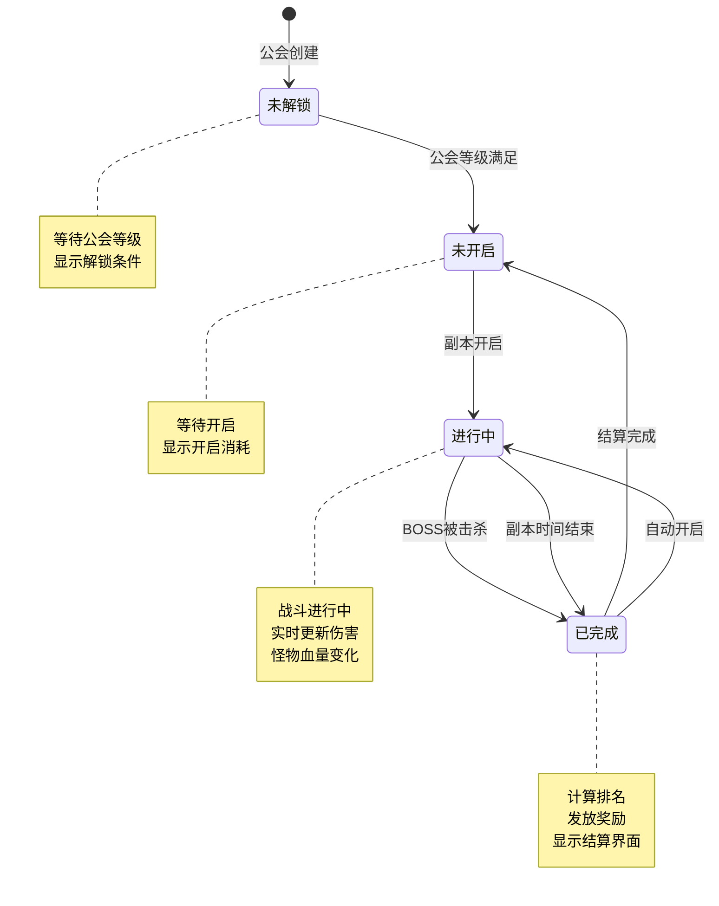
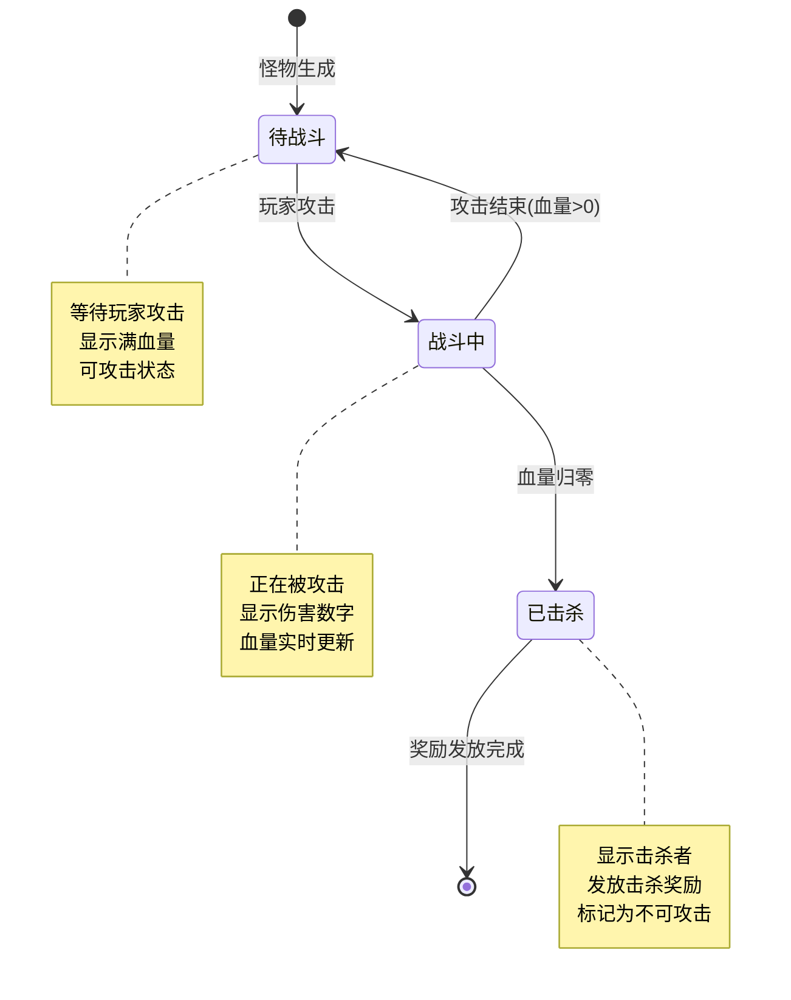
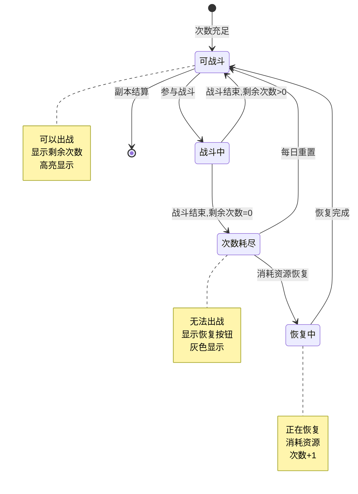
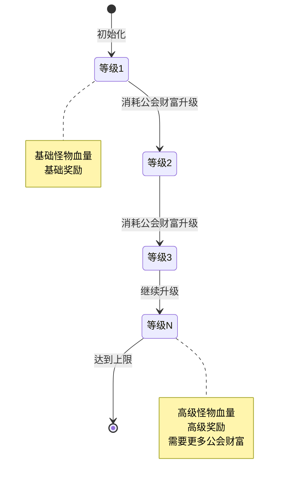
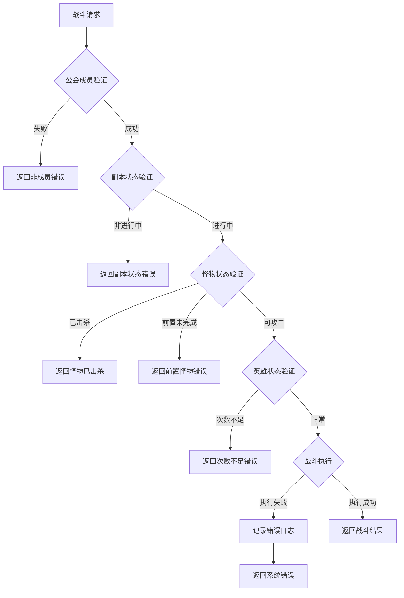

# 公会副本模块实现细节

## 一、计算公式

### 1.1 怪物血量计算

```
怪物血量 = 等级配置.怪物血量列表.获取(怪物类型)
```

**配置示例**：
```
monster_hp:
  COMMON: 500000
  SENIOR: 1000000
  BOSS: 5000000
```

### 1.2 排名计算公式

```
排名 = 所有参与者的伤害值降序排列后的位置
同伤害排名 = 取相同伤害值的最高排名（先更新者排名靠前）
```

### 1.3 副本等级奖励系数

```
奖励倍率 = 1 + (副本等级 - 1) × 0.2
```

**示例计算**：
```
副本等级: 5
奖励倍率 = 1 + (5 - 1) × 0.2 = 1.8
基础奖励100银两 → 实际奖励180银两
```

### 1.4 英雄剩余战斗次数

```
剩余次数 = 1 + 已恢复次数 - 已出战次数
```

**示例计算**：
```
已出战次数: 1
已恢复次数: 0
剩余次数 = 1 + 0 - 1 = 0 (不可出战)
```

---

## 二、状态机定义

### 2.1 副本状态机



### 2.2 怪物状态机



### 2.3 英雄战斗状态机



### 2.4 副本等级状态机



---

## 三、数据约束

### 3.1 副本设置数据约束

| 字段名 | 数据类型 | 取值范围 | 必填 | 说明 |
|--------|----------|----------|------|------|
| id | long | > 0 | 是 | 自增主键 |
| guildId | long | > 0 | 是 | 公会ID |
| dungeonId | long | > 0 | 是 | 副本配置ID |
| dungeonLvl | int | 1-20 | 是 | 副本等级 |
| isAutoStart | boolean | true/false | 是 | 是否自动开启 |

### 3.2 副本实例数据约束

| 字段名 | 数据类型 | 取值范围 | 必填 | 说明 |
|--------|----------|----------|------|------|
| id | long | > 0 | 是 | 实例唯一ID（自增） |
| guildId | long | > 0 | 是 | 公会ID |
| dungeonId | long | > 0 | 是 | 副本配置ID |
| dungeonLvl | int | 1-20 | 是 | 副本等级 |
| startMs | long | > 0 | 是 | 开启时间戳（毫秒） |
| isSettled | boolean | true/false | 是 | 是否已结算 |

### 3.3 怪物数据约束

| 字段名 | 数据类型 | 取值范围 | 必填 | 说明 |
|--------|----------|----------|------|------|
| id | long | > 0 | 是 | 自增主键 |
| instanceId | long | > 0 | 是 | 实例ID |
| monsterId | long | > 0 | 是 | 怪物配置ID |
| hp | long | >= 0 | 是 | 当前血量 |
| isReward | boolean | true/false | 是 | 是否有奖励 |
| isTag | boolean | true/false | 是 | 是否被标记 |
| gainedCidList | blob | - | 否 | 已领取玩家列表 |

### 3.4 玩家英雄战斗数据约束

| 字段名 | 数据类型 | 取值范围 | 必填 | 说明 |
|--------|----------|----------|------|------|
| id | long | > 0 | 是 | 自增主键 |
| cid | long | > 0 | 是 | 玩家CID |
| heroId | long | > 0 | 是 | 英雄ID |
| fightedCount | int | >= 0 | 是 | 已出战次数 |
| recoveredCount | int | >= 0 | 是 | 已恢复次数 |
| lastFightedMs | long | >= 0 | 是 | 最后战斗时间 |

### 3.5 伤害排行数据约束

| 字段名 | 数据类型 | 取值范围 | 必填 | 说明 |
|--------|----------|----------|------|------|
| id | long | > 0 | 是 | 自增主键 |
| guildId | long | > 0 | 是 | 公会ID |
| cid | long | > 0 | 是 | 玩家CID |
| value | long | >= 0 | 是 | 伤害值 |
| updatedMs | long | >= 0 | 是 | 更新时间 |

---

## 四、错误处理策略

### 4.1 公会副本错误码

| 错误码 | 错误信息 | 处理策略 | 用户提示 |
|--------|----------|----------|----------|
| GUILD_DUNGEON_NOT_FOUND | 副本不存在 | 检查副本ID | "副本不存在" |
| GUILD_DUNGEON_NOT_UNLOCK | 副本未解锁 | 检查公会等级 | "公会等级不足，副本未解锁" |
| GUILD_DUNGEON_STARTED | 副本已开启 | 检查副本状态 | "副本已开启" |
| GUILD_DUNGEON_ERR | 副本错误 | 检查配置 | "副本配置错误" |
| GUILD_DUNGEON_START_FAIL | 开启失败 | 回滚消耗 | "副本开启失败" |
| GUILD_DUNGEON_MONSTER_NOT_FOUND | 怪物不存在 | 检查怪物ID | "怪物不存在" |
| GUILD_DUNGEON_MONSTER_KILLED | 怪物已被击杀 | 检查怪物状态 | "怪物已被击杀" |
| GUILD_DUNGEON_MONSTER_PRE_MONSTER_NOT_KILLED | 前置怪物未击杀 | 检查前置怪物 | "请先击杀前置怪物" |
| GUILD_DUNGEON_ATTACK_FAIL | 攻击失败 | 检查攻击参数 | "攻击失败" |
| GUILD_DUNGEON_FIGHT_HERO_FAIL | 英雄战斗失败 | 检查英雄状态 | "英雄无法出战" |
| GUILD_DUNGEON_NOT_RECOVER_HERO | 英雄无法恢复 | 检查恢复条件 | "英雄无需恢复" |
| GUILD_DUNGEON_RECOVER_LIMIT | 恢复次数达到上限 | 检查恢复次数 | "恢复次数已达上限" |
| GUILD_DUNGEON_LVL_UPDATED | 副本等级已更新 | 刷新等级 | "副本等级已更新" |

### 4.2 战斗错误处理流程



### 4.3 异常场景处理

| 异常场景 | 处理策略 | 数据回滚 |
|----------|----------|----------|
| 战斗中断 | 恢复英雄战斗次数 | 是 |
| 开启失败 | 退回公会财富/物品 | 是 |
| 怪物生成失败 | 回滚副本实例 | 是 |
| 奖励发放失败 | 重试发放，记录日志 | 否 |

---

## 五、关键代码示例

### 5.1 副本开启实现

```java
/**
 * 开启公会副本
 */
public Result cmdStart(long _cid, EGuildDungeon_StartType _startType, long _dungeonId, NPPlayerContext _context) {
    // 1. 检查副本配置数据
    GuildDungeonSetInfo setInfo = _m_alDungeonSetMgr.lookup(_dungeonId);
    if (null == setInfo) {
        return GuildErr.GUILD_DUNGEON_NOT_FOUND;
    }
    if (!setInfo.isUnlock()) {
        return GuildErr.GUILD_DUNGEON_NOT_UNLOCK;
    }

    // 2. 检查是否还有正在运行的副本
    if (_m_mgrDungeonInstanceMgr.hasDungeon(_dungeonId)) {
        return GuildErr.GUILD_DUNGEON_STARTED;
    }

    // 3. 检查怪物数据
    ArrayList<GuildDungeon_Monster> monsterList = setInfo.buildMonsterList();
    if (null == monsterList || monsterList.isEmpty()) {
        return GuildErr.GUILD_DUNGEON_ERR;
    }

    // 4. 检查并扣除消耗
    long startCost = 0;
    if (EGuildDungeon_StartType.ALLIANCE_WEALTH == _startType) {
        startCost = setInfo.getLvlRef().star_cost_guild_wealth;
        if (setInfo.getLvlRef().star_cost_guild_wealth > _m_giGuildInfo.getWealth())
            return CommErr.ITEM_NOT_ENOUGH;
        if (!_m_giGuildInfo.spendWealth(setInfo.getLvlRef().star_cost_guild_wealth, _context))
            return CommErr.CONSUME_FAIL;
    } else if (EGuildDungeon_StartType.COMMON_ITEM == _startType) {
        startCost = setInfo.getLvlRef().star_cost_item.getCount();
        // 物品消耗在US处理
    } else {
        return CommErr.PARAM_ERROR;
    }

    // 5. 开启副本
    GuildDungeonInstanceInfo instance = _m_mgrDungeonInstanceMgr.start(setInfo.getRef(), setInfo.getLvlRef(), monsterList, _context);
    if (null == instance) {
        // 开启失败，退回花费
        if (EGuildDungeon_StartType.ALLIANCE_WEALTH == _startType) {
            _m_giGuildInfo.gainWealth(setInfo.getLvlRef().star_cost_guild_wealth, _context);
        }
        return GuildErr.GUILD_DUNGEON_START_FAIL;
    }

    // 6. 推送数据
    _m_giGuildInfo.getMemberMgr().broadcastMsg(
        US2GCWriter_037_GuildDungeonOp.make_051_OnDungeonInstanceChg(instance)
    );

    // 7. 记录日志
    GuildDungeon_LogStart dungeonLog = new GuildDungeon_LogStart();
    dungeonLog.setCid(_cid);
    dungeonLog.setDungeonId(_dungeonId);
    dungeonLog.setStartType(_startType);
    dungeonLog.setStartCost(startCost);
    instance.getLogMgr().addLog(EGuildDungeon_LogType.START, dungeonLog);

    return Result.SUCC;
}
```

### 5.2 攻击怪物实现

```java
/**
 * 攻击怪物
 */
public GuildDungeonAttackResult cmdAttack(long _cid, long _heroId, long _monsterId, long _damage, NPPlayerContext _context) {
    _lock();
    try {
        GuildDungeonAttackResult result = new GuildDungeonAttackResult();

        // 1. 检查怪物数据
        GuildDungeonMonsterInfo monster = _m_mgrDungeonMonsterMgr.lookup(_monsterId);
        if (null == monster) {
            result.result.setCode(GuildErr.GUILD_DUNGEON_MONSTER_NOT_FOUND.getCode());
            return result;
        }
        if (monster.isKilled()) {
            result.result.setCode(GuildErr.GUILD_DUNGEON_MONSTER_KILLED.getCode());
            return result;
        }

        // 2. 检查前置怪物
        boolean isPreMonsterKilled = monster.getRef().pre_monster_id_list.isEmpty();
        for (long preMonsterId : monster.getRef().pre_monster_id_list) {
            GuildDungeonMonsterInfo preMonster = _m_mgrDungeonMonsterMgr.lookup(preMonsterId);
            if (null == preMonster) continue;
            if (preMonster.isKilled()) {
                isPreMonsterKilled = true;
                break;
            }
        }
        if (!isPreMonsterKilled) {
            result.result.setCode(GuildErr.GUILD_DUNGEON_MONSTER_PRE_MONSTER_NOT_KILLED.getCode());
            return result;
        }

        // 3. 减少血量
        long realDamage = monster._reduceHp(_damage);
        if (realDamage <= 0) {
            result.result.setCode(GuildErr.GUILD_DUNGEON_ATTACK_FAIL.getCode());
            return result;
        }
        result.damge = realDamage;

        // 4. 后续处理
        if (monster.isKilled()) {
            // 记录击杀日志
            GuildDungeon_LogKill log = new GuildDungeon_LogKill();
            log.setCid(_cid);
            log.setMonsterId(_monsterId);
            _m_mgrDungeonLogMgr.addLog(EGuildDungeon_LogType.KILL, log);
            result.isKilled = true;

            // 检查副本是否完成
            if (isDone()) {
                result.isDone = true;
            }
        } else {
            // 记录攻击日志
            GuildDungeon_LogAttack log = new GuildDungeon_LogAttack();
            log.setCid(_cid);
            log.setMonsterId(_monsterId);
            log.setDamage(realDamage);
            _m_mgrDungeonLogMgr.addLog(EGuildDungeon_LogType.ATTACK, log);
        }

        // 5. 广播数据
        _m_giGuildInfo.getMemberMgr().broadcastMsg(
            US2GCWriter_037_GuildDungeonOp.make_052_OnDungeonMonsterChg(monster)
        );

        result.result.setCode(0);
        return result;
    } finally {
        _unlock();
    }
}
```

### 5.3 自动开启Tick实现

```java
/**
 * 每秒tick操作
 */
public void tick(long _nowTimeMs) {
    // 公会销毁
    if (_m_giGuildInfo.isDissolve()) return;

    // 自动结算
    if (_m_diDungeonGlobalSetInfo.canAutoSettle(_nowTimeMs) && _m_mgrDungeonInstanceMgr.getCount() > 0) {
        NPPlayerContext context = NPPlayerContext.createNew(ENPGameEvent.GUILD_DUNGEON_AUTO_SETTLE);
        settleAll(context);
    }

    // 自动开启
    if (_m_diDungeonGlobalSetInfo.canAutoStart(_nowTimeMs)) {
        List<RefGuildDungeon> dungeonRefList = RefGuildDungeon.getMgr().getList();
        for (int i = 0; i < dungeonRefList.size(); i++) {
            RefGuildDungeon ref = dungeonRefList.get(i);
            if (null == ref) continue;

            // 检查是否自动开启
            GuildDungeonSetInfo setInfo = _m_alDungeonSetMgr.lookup(ref.id);
            if (null == setInfo || !setInfo.isAutoStart()) continue;

            // 已开启的实例跳过
            if (_m_mgrDungeonInstanceMgr.hasDungeon(ref.id)) continue;

            // 生成怪物数据
            ArrayList<GuildDungeon_Monster> monsterList = setInfo.buildMonsterList();
            if (null == monsterList || monsterList.isEmpty()) continue;

            NPPlayerContext context = NPPlayerContext.createNew(ENPGameEvent.GUILD_DUNGEON_AUTO_START);

            // 检查公会财富消耗
            long startCost = setInfo.getLvlRef().star_cost_guild_wealth;
            if (!_m_giGuildInfo.spendWealth(startCost, context)) continue;

            // 创建实例
            GuildDungeonInstanceInfo instance = _m_mgrDungeonInstanceMgr.start(
                setInfo.getRef(), setInfo.getLvlRef(), monsterList, context
            );
            if (null == instance) continue;

            // 推送数据
            _m_giGuildInfo.getMemberMgr().broadcastMsg(
                US2GCWriter_037_GuildDungeonOp.make_051_OnDungeonInstanceChg(instance)
            );

            // 记录自动开启日志
            GuildDungeon_LogAutoStart dungeonLog = new GuildDungeon_LogAutoStart();
            dungeonLog.setDungeonId(ref.id);
            dungeonLog.setCostValue(startCost);
            instance.getLogMgr().addLog(EGuildDungeon_LogType.AUTO_START, dungeonLog);
        }
    }
}
```

---

## 六、跨模块依赖

### 6.1 依赖模块

| 模块名称 | 依赖类型 | 依赖说明 |
|----------|----------|----------|
| GuildOp | 数据依赖 | 获取公会信息、成员信息、公会财富 |
| HeroOp | 数据依赖 | 获取英雄属性、英雄状态 |
| BagOp | 功能依赖 | 奖励发放到背包 |
| MailOp | 功能依赖 | 排行奖励通过邮件发放 |

### 6.2 数据交互说明

```java
// 获取公会信息
GuildInfo guild = guildMgr.getGuild(guildId);
long guildLevel = guild.getLevel();
long guildWealth = guild.getWealth();

// 获取英雄属性
HeroInfo hero = userData.heroComp.getHero(heroId);
long heroPower = hero.getPower();

// 消耗公会财富
guild.spendWealth(cost, context);

// 发放奖励
NPCommonCostItem reward = monster._gainReward(cid);
userData.bagComp.addItem(reward, context);
```

### 6.3 事件订阅

| 事件名称 | 处理逻辑 |
|----------|----------|
| 公会成员加入 | 无需处理（战斗数据懒加载） |
| 公会成员退出 | 伤害排行数据保留至结算 |
| 每日重置 | 重置英雄战斗次数 |
| 公会解散 | 清理所有副本数据 |

---

## 七、性能优化

### 7.1 数据缓存

- 怪物数据使用内存缓存，减少数据库查询
- 伤害排行使用内存列表，定时持久化

### 7.2 并发控制

- 使用 MutexAtom 进行线程安全保护
- 副本实例使用读写锁提高并发性能

### 7.3 数据库优化

- 批量更新减少数据库操作
- 异步写入日志数据

---

*文档生成时间: 2026-04-11*
