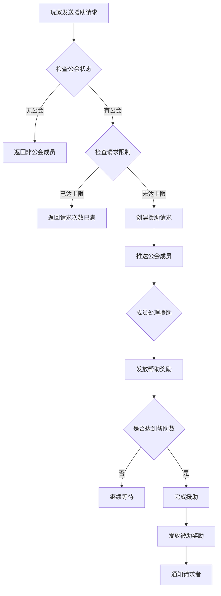
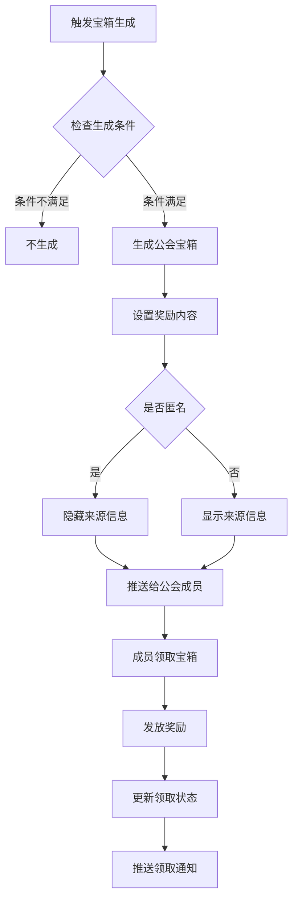
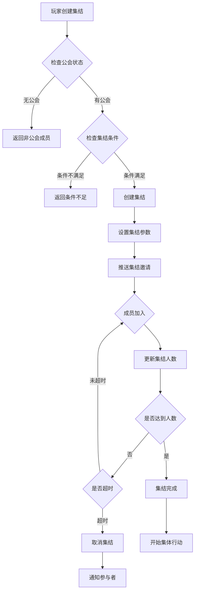

# 公会关联模块完整说明

## 一、模块概述

### 1.1 业务背景

公会关联模块整合了火星援助、公会宝箱和公会集结三大核心社交功能。火星援助让公会成员可以相互帮助加速进度；公会宝箱实现资源的共享与分发；公会集结提供多人协作的战斗模式。这些功能增强了公会成员间的互动和凝聚力。

### 1.2 目标用户

- **公会成员**：通过援助和宝箱获取资源收益
- **活跃玩家**：通过帮助他人获得额外奖励
- **公会管理**：组织公会活动，协调集结行动

### 1.3 核心价值

1. **互助机制**：成员间相互帮助，共同成长
2. **资源共享**：公会宝箱实现资源再分配
3. **协作战斗**：集结功能提供团队玩法
4. **社交粘性**：增强公会成员间联系

---

## 二、功能清单

### 2.1 火星援助功能

| 功能名称 | 功能描述 | 用户价值 |
|---------|---------|---------|
| 发送援助请求 | 请求公会成员帮助加速火星进度 | 加速游戏进程 |
| 查看援助列表 | 查看可处理的援助请求列表 | 选择帮助对象 |
| 处理援助请求 | 帮助公会成员完成援助 | 获得帮助奖励 |
| 查看援助记录 | 查看已处理和已获得的援助 | 了解互助情况 |
| 自动每日记录 | 记录每日援助统计 | 追踪贡献度 |

### 2.2 公会宝箱功能

| 功能名称 | 功能描述 | 用户价值 |
|---------|---------|---------|
| 查看宝箱列表 | 查看可领取的公会宝箱 | 了解奖励内容 |
| 领取宝箱奖励 | 领取宝箱内的奖励 | 获取资源收益 |
| 批量领取 | 一键领取所有宝箱奖励 | 提升领取效率 |
| 匿名分享设置 | 设置宝箱分享是否匿名 | 保护隐私 |

### 2.3 公会集结功能

| 功能名称 | 功能描述 | 用户价值 |
|---------|---------|---------|
| 创建集结 | 发起公会集结行动 | 组织团队活动 |
| 加入集结 | 参与公会成员的集结 | 参与团队战斗 |
| 查看集结信息 | 查看集结状态和成员 | 了解集结详情 |
| 退出集结 | 退出已加入的集结 | 灵活调整 |
| 集结成员通知 | 集结开始时通知成员 | 及时参与 |

---

## 三、业务流程详解

### 3.1 火星援助流程



**详细步骤说明**：

1. **发送请求**
   - 玩家选择需要援助的项目
   - 检查每日援助请求次数
   - 创建援助请求记录

2. **推送通知**
   - 获取公会在线成员列表
   - 推送援助请求通知
   - 更新可处理援助列表

3. **处理援助**
   - 成员选择帮助请求
   - 检查帮助次数限制
   - 扣减帮助次数

4. **完成援助**
   - 达到所需帮助次数
   - 加速火星进度
   - 发放完成奖励

### 3.2 公会宝箱流程



**详细步骤说明**：

1. **宝箱触发**
   - 玩家完成特定行为（充值、活动等）
   - 系统判断是否生成公会宝箱
   - 计算宝箱奖励内容

2. **宝箱生成**
   - 创建宝箱数据记录
   - 设置有效期
   - 根据设置决定是否匿名

3. **推送通知**
   - 向公会成员推送宝箱通知
   - 更新宝箱列表显示

4. **领取奖励**
   - 成员点击领取
   - 检查是否已领取
   - 发放奖励并更新状态

### 3.3 公会集结流程



**详细步骤说明**：

1. **创建集结**
   - 选择集结目标（副本、活动等）
   - 设置集结参数（人数、时间）
   - 消耗集结道具或资源

2. **邀请成员**
   - 向公会成员推送邀请
   - 显示集结信息和倒计时
   - 成员可选择加入或忽略

3. **成员加入**
   - 成员点击加入
   - 检查加入条件
   - 更新集结人数

4. **集结完成**
   - 达到目标人数或时间结束
   - 开始集体行动
   - 计算团队奖励

---

## 四、关键规则

### 4.1 火星援助规则

1. **请求限制**
   - 每日最多发送5次援助请求
   - 每次请求最多可获得10次帮助
   - 请求有效期为24小时

2. **帮助限制**
   - 每日最多帮助20次
   - 同一请求只能帮助1次
   - 帮助次数每日0点重置

3. **奖励规则**
   - 帮助者获得公会贡献+银两
   - 被帮助者获得加速效果
   - 完成援助获得额外奖励

### 4.2 公会宝箱规则

1. **生成规则**
   - 充值达到指定金额生成
   - 活动奖励触发生成
   - 每日最多生成3个

2. **领取规则**
   - 每个宝箱只能领取一次
   - 宝箱有效期为48小时
   - 过期未领取自动消失

3. **匿名规则**
   - 可设置分享时匿名
   - 匿名后不显示来源玩家
   - 奖励内容不受影响

### 4.3 公会集结规则

1. **创建规则**
   - 需要特定道具或资源
   - 同一时间只能有一个进行中的集结
   - 集结时间最长30分钟

2. **加入规则**
   - 需要达到指定等级
   - 需要拥有相应战斗力
   - 加入后不可退出

3. **奖励规则**
   - 按贡献度分配奖励
   - 发起者获得额外奖励
   - 完成时间越短奖励越高

---

## 五、用户故事

### 5.1 火星援助故事

> 作为一名活跃玩家，我每天都在火星系统中推进进度。当我卡在某个阶段时，我发送了援助请求给公会。很快就有5位公会成员帮助了我，进度大幅提升。我也帮助了其他成员，获得了额外的公会贡献和银两奖励。

### 5.2 公会宝箱故事

> 作为一名充值玩家，我购买了月卡后系统自动生成了公会宝箱分享给公会成员。我设置了匿名分享，不想让成员知道是我充值的。宝箱很快被公会成员领取，他们获得了钻石奖励，我也收到了分享奖励。

### 5.3 公会集结故事

> 作为公会会长，我每周都会组织公会集结活动。这次是挑战世界BOSS，我创建了集结并设置需要20人参与。公会成员陆续加入，30分钟内集结完成。我们一起挑战BOSS，获得了丰厚的团队奖励。

---

## 六、示例

### 6.1 火星援助示例

**援助请求**：
```
请求者: 剑舞春秋
援助类型: 加速火星建筑升级
所需帮助次数: 5
当前获得帮助: 3
剩余时间: 18小时
```

**帮助记录**：
```
帮助者: 龙女小舞
帮助时间: 2026-04-07 14:30:00
获得奖励: 公会贡献+10, 银两+500
```

### 6.2 公会宝箱示例

**宝箱信息**：
```
宝箱ID: 10001
宝箱类型: 充值回馈
奖励内容: 钻石×100
来源: 匿名玩家
生成时间: 2026-04-07 10:00:00
过期时间: 2026-04-09 10:00:00
领取状态: 未领取
```

**领取结果**：
```
玩家: 无名剑客
获得奖励: 钻石×100
领取时间: 2026-04-07 12:30:00
```

### 6.3 公会集结示例

**集结信息**：
```
集结ID: 20001
目标: 世界BOSS - 炎龙
发起者: 剑圣无名
开始时间: 2026-04-07 20:00:00
集结时限: 30分钟
需要人数: 15-30人
当前人数: 12人
状态: 集结中
```

**成员列表**：
| 序号 | 成员名称 | 战斗力 | 加入时间 |
|------|----------|--------|----------|
| 1 | 剑圣无名 | 1,200,000 | 20:00:00 |
| 2 | 龙女小舞 | 980,000 | 20:05:00 |
| 3 | 魔法少女 | 850,000 | 20:08:00 |
| ... | ... | ... | ... |

---

*文档生成时间: 2026-04-07*
