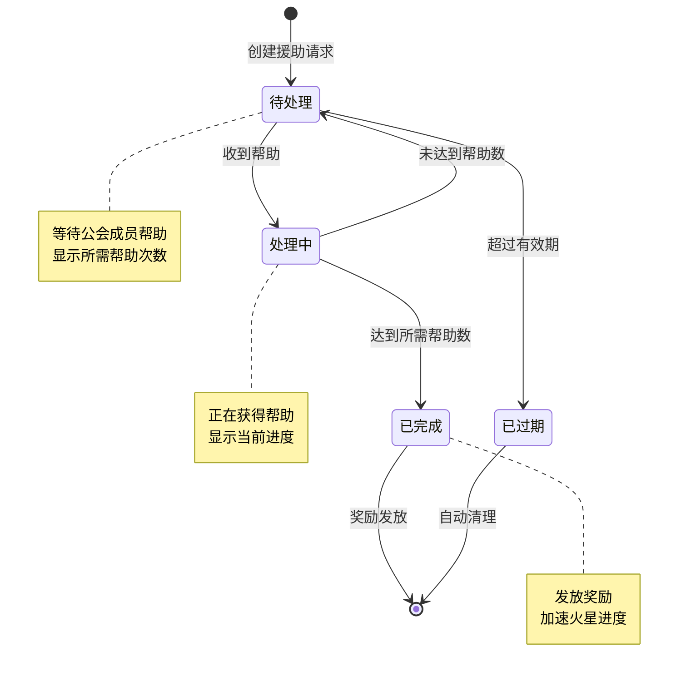
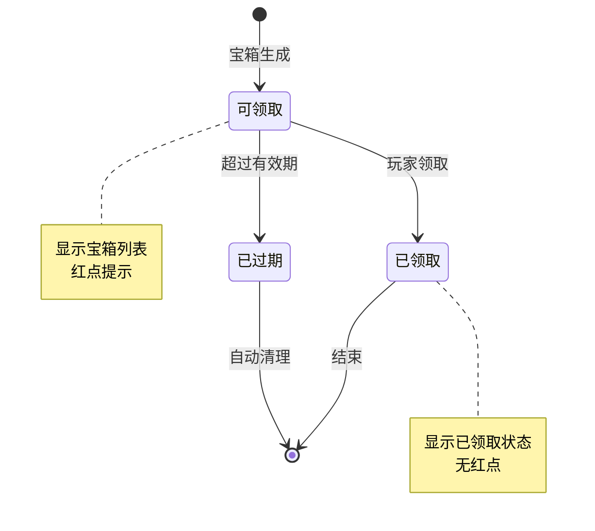
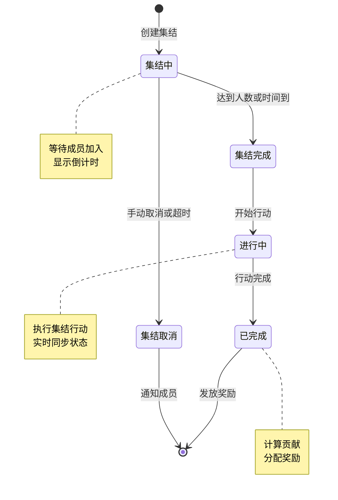
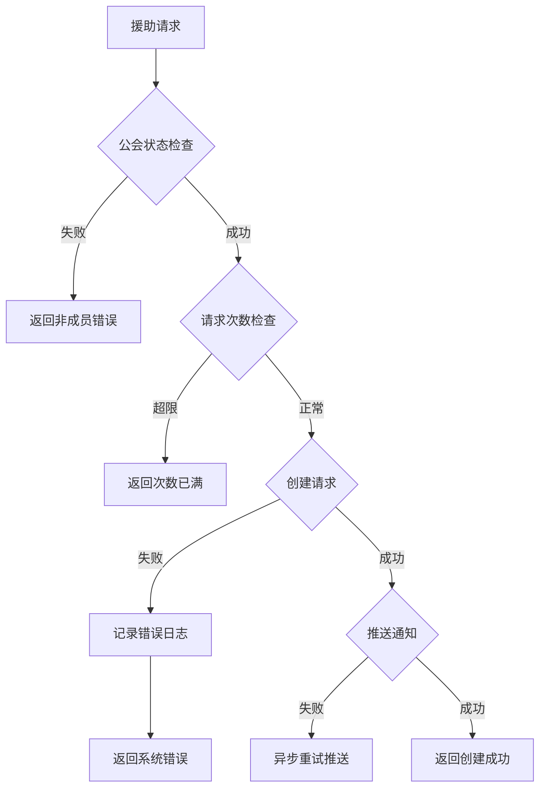

# 公会关联模块实现细节

## 一、计算公式

### 1.1 援助加速计算公式

```
实际加速时间 = 基础加速时间 × (1 + VIP加速加成)
```

**参数说明**：
- `基础加速时间`：单次帮助提供的加速时间（配置）
- `VIP加速加成`：VIP等级提供的加成百分比

**示例计算**：
```
基础加速时间: 600秒 (10分钟)
VIP等级: 5
VIP加成: 10%

实际加速时间 = 600 × (1 + 0.1) = 660秒
```

### 1.2 援助奖励计算公式

```
帮助者奖励 = 基础奖励 × (1 + 公会技能加成)
被帮助者奖励 = 加速效果
完成奖励 = 配置的固定奖励
```

### 1.3 公会宝箱奖励计算

```
宝箱奖励 = 基础奖励 × 活跃度系数 × 公会等级系数

活跃度系数 = 1 + (公会活跃度 / 10000)
公会等级系数 = 1 + (公会等级 - 1) × 0.05
```

**示例计算**：
```
基础奖励: 钻石×50
公会活跃度: 5000
公会等级: 6

活跃度系数 = 1 + 5000/10000 = 1.5
公会等级系数 = 1 + (6-1) × 0.05 = 1.25
宝箱奖励 = 50 × 1.5 × 1.25 = 93.75 ≈ 94钻石
```

### 1.4 集结战斗力计算

```
集结总战力 = Σ(所有成员的出战英雄战力)
集结加成 = 1 + 成员数量 × 0.02
实际战斗力 = 集结总战力 × 集结加成
```

**示例计算**：
```
成员数量: 20
成员战力总和: 15,000,000

集结加成 = 1 + 20 × 0.02 = 1.4
实际战斗力 = 15,000,000 × 1.4 = 21,000,000
```

---

## 二、状态机定义

### 2.1 援助请求状态机



### 2.2 公会宝箱状态机



### 2.3 集结状态机



---

## 三、数据约束

### 3.1 火星援助数据约束

| 字段名 | 数据类型 | 取值范围 | 必填 | 说明 |
|--------|----------|----------|------|------|
| helpId | long | > 0 | 是 | 援助唯一ID |
| requestCid | long | > 0 | 是 | 请求者CID |
| helpType | int | 1-10 | 是 | 援助类型 |
| requiredCount | int | 1-20 | 是 | 所需帮助次数 |
| currentCount | int | 0-20 | 是 | 当前获得次数 |
| requestTime | datetime | - | 是 | 请求时间 |
| expireTime | datetime | - | 是 | 过期时间 |
| status | int | 0-3 | 是 | 状态 |

### 3.2 公会宝箱数据约束

| 字段名 | 数据类型 | 取值范围 | 必填 | 说明 |
|--------|----------|----------|------|------|
| boxId | long | > 0 | 是 | 宝箱唯一ID |
| teamId | long | > 0 | 是 | 公会ID |
| sourceCid | long | > 0 | 否 | 来源玩家CID |
| boxType | int | 1-10 | 是 | 宝箱类型 |
| rewardList | json | - | 是 | 奖励列表 |
| isAnonymous | boolean | true/false | 是 | 是否匿名 |
| createTime | datetime | - | 是 | 创建时间 |
| expireTime | datetime | - | 是 | 过期时间 |

### 3.3 集结数据约束

| 字段名 | 数据类型 | 取值范围 | 必填 | 说明 |
|--------|----------|----------|------|------|
| rallyId | long | > 0 | 是 | 集结唯一ID |
| teamId | long | > 0 | 是 | 公会ID |
| leaderCid | long | > 0 | 是 | 发起者CID |
| targetId | long | > 0 | 是 | 目标ID |
| target_type | int | 1-5 | 是 | 目标类型 |
| minMember | int | 1-50 | 是 | 最少人数 |
| maxMember | int | 1-50 | 是 | 最多人数 |
| currentMember | int | 0-50 | 是 | 当前人数 |
| startTime | datetime | - | 是 | 开始时间 |
| endTime | datetime | - | 是 | 结束时间 |
| status | int | 0-4 | 是 | 状态 |

### 3.4 集结成员数据约束

| 字段名 | 数据类型 | 取值范围 | 必填 | 说明 |
|--------|----------|----------|------|------|
| rallyId | long | > 0 | 是 | 集结ID |
| cid | long | > 0 | 是 | 成员CID |
| joinTime | datetime | - | 是 | 加入时间 |
| power | long | >= 0 | 是 | 出战战力 |
| heroList | json | - | 是 | 出战英雄列表 |

---

## 四、错误处理策略

### 4.1 公会关联错误码

| 错误码 | 错误信息 | 处理策略 | 用户提示 |
|--------|----------|----------|----------|
| 42001 | 非公会成员 | 检查公会状态 | "您不是公会成员" |
| 42002 | 援助请求已达上限 | 检查每日次数 | "今日援助请求次数已用完" |
| 42003 | 帮助次数已达上限 | 检查帮助次数 | "今日帮助次数已用完" |
| 42004 | 已帮助过该请求 | 检查帮助记录 | "您已帮助过此请求" |
| 42005 | 援助请求不存在 | 检查请求ID | "该援助请求已过期或不存在" |
| 42006 | 宝箱已领取 | 检查领取状态 | "该宝箱已领取" |
| 42007 | 宝箱已过期 | 检查有效期 | "该宝箱已过期" |
| 42008 | 无权限创建集结 | 检查权限 | "您没有权限创建集结" |
| 42009 | 已在其他集结中 | 检查集结状态 | "您已在其他集结中" |
| 42010 | 集结已满 | 检查人数 | "该集结人数已满" |
| 42011 | 集结已结束 | 检查集结状态 | "该集结已结束" |

### 4.2 援助处理错误流程



### 4.3 宝箱处理异常

| 异常场景 | 处理策略 | 数据回滚 |
|----------|----------|----------|
| 奖励发放失败 | 重试3次，失败转邮件 | 否 |
| 宝箱过期清理 | 定时任务自动清理 | 否 |
| 并发领取冲突 | 加锁处理，返回已领取 | 是 |

---

## 五、关键代码示例

### 5.1 发送援助请求伪代码

```java
public Result sendMarsHelp(long cid, int helpType) {
    // 1. 检查公会状态
    GuildMember member = guildMemberDao.selectByCid(cid);
    if (member == null) {
        return Result.error(42001, "非公会成员");
    }

    // 2. 检查每日请求次数
    int todayCount = marsHelpDao.countTodayRequest(cid);
    if (todayCount >= MAX_DAILY_REQUEST) {
        return Result.error(42002, "今日援助请求次数已用完");
    }

    // 3. 检查是否有进行中的同类请求
    MarsHelp existing = marsHelpDao.selectActiveByCidAndType(cid, helpType);
    if (existing != null) {
        return Result.error(42002, "已有进行中的同类援助请求");
    }

    // 4. 创建援助请求
    MarsHelp help = new MarsHelp();
    help.setHelpId(idGenerator.nextId());
    help.setRequestCid(cid);
    help.setHelpType(helpType);
    help.setRequiredCount(getRequiredCount(helpType));
    help.setCurrentCount(0);
    help.setRequestTime(new Date());
    help.setExpireTime(DateUtils.addHours(new Date(), 24));
    help.setStatus(HelpStatus.PENDING);

    marsHelpDao.insert(help);

    // 5. 推送给公会成员
    pushHelpRequest(member.getTeamId(), help);

    return Result.success(help);
}
```

### 5.2 处理援助请求伪代码

```java
public Result dealMarsHelp(long cid, long helpId) {
    // 1. 获取援助请求
    MarsHelp help = marsHelpDao.selectById(helpId);
    if (help == null || help.getStatus() != HelpStatus.PENDING) {
        return Result.error(42005, "援助请求不存在或已结束");
    }

    // 2. 检查是否已帮助过
    HelpRecord record = helpRecordDao.selectByCidAndHelpId(cid, helpId);
    if (record != null) {
        return Result.error(42004, "已帮助过该请求");
    }

    // 3. 检查每日帮助次数
    int todayHelpCount = helpRecordDao.countTodayHelp(cid);
    if (todayHelpCount >= MAX_DAILY_HELP) {
        return Result.error(42003, "今日帮助次数已用完");
    }

    // 4. 记录帮助
    HelpRecord newRecord = new HelpRecord();
    newRecord.setRecordId(idGenerator.nextId());
    newRecord.setHelperCid(cid);
    newRecord.setHelpId(helpId);
    newRecord.setHelpTime(new Date());
    helpRecordDao.insert(newRecord);

    // 5. 更新援助进度
    help.setCurrentCount(help.getCurrentCount() + 1);
    if (help.getCurrentCount() >= help.getRequiredCount()) {
        help.setStatus(HelpStatus.COMPLETED);
        // 发放完成奖励给请求者
        sendCompletionReward(help.getRequestCid(), help.getHelpType());
    }
    marsHelpDao.updateById(help);

    // 6. 发放帮助奖励
    RewardInfo reward = getHelpReward(cid);
    rewardService.giveReward(cid, reward);

    // 7. 推送通知
    pushHelpDealt(help.getRequestCid(), cid, helpId);

    return Result.success(reward);
}
```

### 5.3 公会宝箱生成伪代码

```java
public void generateGuildBox(long sourceCid, int boxType, List<RewardInfo> rewards) {
    // 1. 获取公会信息
    GuildMember member = guildMemberDao.selectByCid(sourceCid);
    if (member == null) return;

    // 2. 检查宝箱生成限制
    int todayCount = guildBoxDao.countTodayGenerated(member.getTeamId());
    if (todayCount >= MAX_DAILY_BOX) return;

    // 3. 创建宝箱
    GuildBox box = new GuildBox();
    box.setBoxId(idGenerator.nextId());
    box.setTeamId(member.getTeamId());
    box.setSourceCid(sourceCid);
    box.setBoxType(boxType);
    box.setRewardList(JsonUtils.toJson(rewards));
    box.setIsAnonymous(false);
    box.setCreateTime(new Date());
    box.setExpireTime(DateUtils.addHours(new Date(), 48));

    guildBoxDao.insert(box);

    // 4. 推送给公会成员
    pushBoxGenerated(member.getTeamId(), box);
}
```

### 5.4 领取宝箱奖励伪代码

```java
public Result gainGuildBox(long cid, long boxId) {
    // 1. 检查公会状态
    GuildMember member = guildMemberDao.selectByCid(cid);
    if (member == null) {
        return Result.error(42001, "非公会成员");
    }

    // 2. 获取宝箱
    GuildBox box = guildBoxDao.selectById(boxId);
    if (box == null || !box.getTeamId().equals(member.getTeamId())) {
        return Result.error(42007, "宝箱不存在");
    }

    // 3. 检查是否过期
    if (box.getExpireTime().before(new Date())) {
        return Result.error(42007, "宝箱已过期");
    }

    // 4. 检查是否已领取
    BoxReceiveRecord record = boxRecordDao.selectByCidAndBoxId(cid, boxId);
    if (record != null) {
        return Result.error(42006, "宝箱已领取");
    }

    // 5. 解析奖励
    List<RewardInfo> rewards = JsonUtils.parseList(box.getRewardList(), RewardInfo.class);

    // 6. 发放奖励
    rewardService.giveRewards(cid, rewards);

    // 7. 记录领取
    BoxReceiveRecord newRecord = new BoxReceiveRecord();
    newRecord.setCid(cid);
    newRecord.setBoxId(boxId);
    newRecord.setReceiveTime(new Date());
    boxRecordDao.insert(newRecord);

    return Result.success(rewards);
}
```

### 5.5 创建集结伪代码

```java
public Result createRally(long cid, long targetId, int targetType, int minMember, int maxMember) {
    // 1. 检查公会状态
    GuildMember member = guildMemberDao.selectByCid(cid);
    if (member == null) {
        return Result.error(42001, "非公会成员");
    }

    // 2. 检查是否有进行中的集结
    Rally existing = rallyDao.selectActiveByCid(cid);
    if (existing != null) {
        return Result.error(42009, "已在其他集结中");
    }

    // 3. 检查公会是否已有进行中的同类集结
    Rally guildRally = rallyDao.selectActiveByTeamAndTarget(member.getTeamId(), targetId);
    if (guildRally != null) {
        return Result.error(42008, "公会已有该目标的集结");
    }

    // 4. 创建集结
    Rally rally = new Rally();
    rally.setRallyId(idGenerator.nextId());
    rally.setTeamId(member.getTeamId());
    rally.setLeaderCid(cid);
    rally.setTargetId(targetId);
    rally.setTargetType(targetType);
    rally.setMinMember(minMember);
    rally.setMaxMember(maxMember);
    rally.setCurrentMember(1); // 发起者自动加入
    rally.setStartTime(new Date());
    rally.setEndTime(DateUtils.addMinutes(new Date(), RALLY_DURATION));
    rally.setStatus(RallyStatus.GATHERING);

    rallyDao.insert(rally);

    // 5. 添加发起者为成员
    addRallyMember(rally.getRallyId(), cid, 0);

    // 6. 推送集结邀请
    pushRallyInvite(member.getTeamId(), rally);

    return Result.success(rally);
}
```

### 5.6 加入集结伪代码

```java
public Result joinRally(long cid, long rallyId) {
    // 1. 获取集结信息
    Rally rally = rallyDao.selectById(rallyId);
    if (rally == null || rally.getStatus() != RallyStatus.GATHERING) {
        return Result.error(42011, "集结不存在或已结束");
    }

    // 2. 检查公会
    GuildMember member = guildMemberDao.selectByCid(cid);
    if (member == null || !member.getTeamId().equals(rally.getTeamId())) {
        return Result.error(42001, "非公会成员");
    }

    // 3. 检查是否已在集结中
    RallyMember existing = rallyMemberDao.selectByCidAndRally(cid, rallyId);
    if (existing != null) {
        return Result.error(42009, "已在该集结中");
    }

    // 4. 检查人数限制
    if (rally.getCurrentMember() >= rally.getMaxMember()) {
        return Result.error(42010, "集结人数已满");
    }

    // 5. 添加成员
    addRallyMember(rallyId, cid, 0);

    // 6. 更新人数
    rally.setCurrentMember(rally.getCurrentMember() + 1);
    rallyDao.updateById(rally);

    // 7. 推送通知
    pushMemberJoined(rally, cid);

    return Result.success(rally);
}
```

---

## 六、跨模块依赖

### 6.1 依赖模块

| 模块名称 | 依赖类型 | 依赖说明 |
|----------|----------|----------|
| GuildOp | 数据依赖 | 获取公会信息、成员信息 |
| MarsOp | 功能依赖 | 火星援助关联火星系统 |
| MailOp | 功能依赖 | 奖励通过邮件发放 |
| BagOp | 功能依赖 | 奖励发放到背包 |

### 6.2 被依赖说明

本模块为公会提供辅助功能，其他模块通过以下方式使用：

```java
// 火星系统触发援助请求
GuildRelatedModule.sendMarsHelp(cid, helpType);

// 充值系统触发宝箱生成
GuildRelatedModule.generateGuildBox(sourceCid, BoxType.RECHARGE, rewards);

// 活动系统创建集结
GuildRelatedModule.createRally(leaderCid, targetId, targetType, min, max);
```

### 6.3 事件订阅

| 事件名称 | 处理逻辑 |
|----------|----------|
| 公会成员加入 | 初始化援助数据 |
| 公会成员退出 | 清理援助记录、退出集结 |
| 每日重置 | 重置援助次数 |
| 公会解散 | 清理所有关联数据 |

---

*文档生成时间: 2026-04-07*
