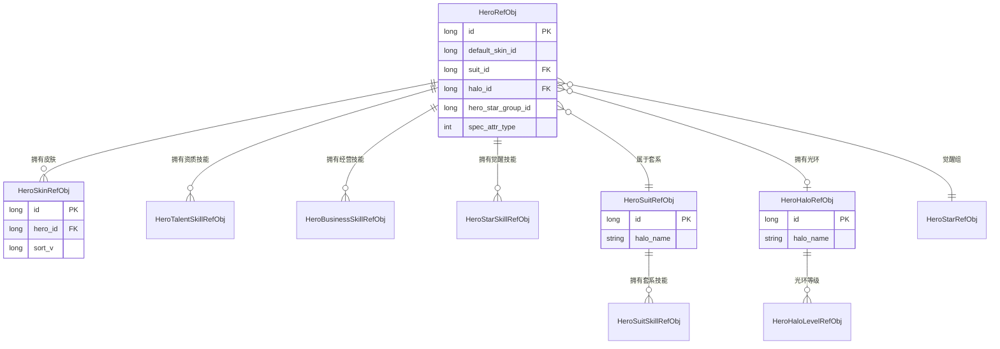

# 英雄模块数据配表文档

## 配表概述

英雄模块相关的配置数据存储在 `hero_refdata.unity3d` 资源文件中，客户端通过 `GRefdataCoreMgr` 访问配置数据。

**资源路径**: `refdata/hero_refdata.unity3d`

---

## 一、英雄基础配表

### 1.1 HeroRefObj - 英雄主表

**文件路径**: `hero_refdata.unity3d` -> `hero`

**配置类**: `GSOHeroRefSet`

| 字段名 | 类型 | 说明 | 示例 |
|--------|------|------|------|
| id | long | 英雄配置ID（唯一标识） | 10001 |
| default_skin_id | long | 默认皮肤ID | 1000101 |
| default_talent_skill_id_list | List\<long\> | 默认资质技能ID列表 | [1001, 1002] |
| can_star_upgrade | bool | 是否可以觉醒升星 | true |
| extra_talent_skill_id_list | List\<WCGPairInt\> | 额外解锁资质技能列表(星级:技能ID) | [{3, 1003}] |
| auto_upgrade_talent_skill_id_list | List\<long\> | 自动升阶的资质技能ID列表 | [1001] |
| star_skill_id_list | List\<long\> | 觉醒技能列表(跟随星级提升等级) | [2001, 2002] |
| business_skill_id | long | 初始经营技能ID | 3001 |
| extra_business_skill_id_list | List\<WCGPairInt\> | 额外解锁经营技能列表(大臣等级:技能ID) | [{20, 3002}] |
| spec_attr_type | ESpecAttrType | 特长属性类型（相性） | ESpecAttrType.WEN |
| suit_id | long | 所属套系ID | 1 |
| halo_id | long | 光环ID（0表示无光环） | 1001 |
| occupation_name | string | 职业名 | "将军" |
| birthplace | string | 出生地 | "京城" |
| introduction_desc | string | 简介描述 | "身经百战..." |
| gain_hero_dialog_id | long | 获得大臣时的对话ID | 10001 |
| settled_building_attr_type_list | List\<ESpecAttrType\> | 可入驻建筑相性类型列表 | [WEN, WU] |
| hero_star_group_id | long | 升星组ID | 1 |

**运行时扩展属性**:

| 属性名 | 类型 | 说明 |
|--------|------|------|
| heroSkinRefList | List\<HeroSkinRefObj\> | 英雄皮肤列表 |
| relationConsortIdList | List\<long\> | 关联家人ID列表 |
| transName | string | 翻译后的名字 |
| transDesc | string | 翻译后的描述 |
| transSource | string | 翻译后的产出来源 |
| icon | NPGTextureIndex | 默认头像 |
| card_image | NPGTextureIndex | 默认卡牌半身像 |
| td_show | NPGGoIndex | 默认全身形象 |

---

### 1.2 HeroLevelRefObj - 英雄等级表

**文件路径**: `hero_refdata.unity3d` -> `hero_level`

**配置类**: `GSOHeroLevelRefSet`

| 字段名 | 类型 | 说明 | 示例 |
|--------|------|------|------|
| level | long | 等级（唯一标识） | 1 |
| need_exp | long | 升到下一等级所需经验 | 100 |
| level_ratio | long | 等级系数（用于实力计算） | 1000 |

---

### 1.3 HeroStepRefObj - 英雄阶段表

**文件路径**: `hero_refdata.unity3d` -> `hero_step`

**配置类**: `GSOHeroStepRefSet`

| 字段名 | 类型 | 说明 | 示例 |
|--------|------|------|------|
| step | long | 阶段（唯一标识） | 1 |
| level_limit | long | 当前阶段等级上限 | 30 |
| cost_item_list | List\<NPCommonCostItem\> | 升到下一阶消耗物品列表 | [{SILVER, 1000}] |

**阶段与等级上限对应关系示例**:

| 阶段 | 等级上限 |
|------|----------|
| 1 | 30 |
| 2 | 50 |
| 3 | 70 |
| 4 | 90 |
| 5 | 100 |

---

### 1.4 HeroStarRefObj - 英雄觉醒表

**文件路径**: `hero_refdata.unity3d` -> `hero_star`

**配置类**: `GSOHeroStarRefSet`

| 字段名 | 类型 | 说明 | 示例 |
|--------|------|------|------|
| id | long | 配置ID（唯一标识） | 10001 |
| star | long | 星级 | 1 |
| hero_star_group_id | long | 升星组ID | 1 |
| upgrade_cost | NPCommonCostItem | 升到当前星级消耗 | {STAR_STONE, 10} |
| upgrade_player_condition | _NPPlayerConditionSerializeInfo | 升星玩家条件 | - |
| upgrade_condition | HeroConditionSerializeInfo | 升星英雄条件 | - |
| upgrade_condition_desc | string | 升星条件描述 | "等级达到50级" |
| desc_args | List\<string\> | 条件描述参数 | - |
| self_attr_prop_modifier | PlayerAttrPropertyModifier | 自身获得实力加成 | - |
| mars_team_player_property | NPPlayerPropertyModifier | 火星探索队伍玩家属性加成 | - |

---

## 二、英雄皮肤配表

### 2.1 HeroSkinRefObj - 英雄皮肤表

**文件路径**: `hero_refdata.unity3d` -> `hero_skin`

**配置类**: `GSOHeroSkinRefSet`

| 字段名 | 类型 | 说明 | 示例 |
|--------|------|------|------|
| id | long | 皮肤ID（唯一标识） | 1000101 |
| hero_id | long | 所属英雄ID | 10001 |
| is_hide | bool | 皮肤是否隐藏 | false |
| sort_v | long | 排序值（由小到大） | 1 |
| unlock_gain_talent_skill_id_list | List\<long\> | 解锁时获得的资质技能ID列表 | [1003] |
| unlock_gain_item_list | List\<NPCommonCostItem\> | 解锁时获得的道具列表 | [{ITEM, 100}] |
| unlock_item | NPCommonCostItem | 解锁所需道具 | {SKIN_TICKET, 1} |
| card_image | NPGTextureIndex | 卡牌半身像 | - |
| td_show | NPGGoIndex | 全身形象 | - |
| td_bg_index | NPGGoIndex | 伙伴形象背景GO | - |

---

### 2.2 HeroSkinLevelRefObj - 英雄皮肤等级表

**文件路径**: `hero_refdata.unity3d` -> `hero_skin_level`

**配置类**: `GSOHeroSkinLevelRefSet`

| 字段名 | 类型 | 说明 |
|--------|------|------|
| skin_id | long | 皮肤ID |
| level | long | 等级 |
| upgrade_cost | NPCommonCostItem | 升级消耗 |
| attr_modifier | PlayerAttrPropertyModifier | 属性加成 |

---

## 三、英雄技能配表

### 3.1 HeroTalentSkillRefObj - 资质技能表

**文件路径**: `hero_refdata.unity3d` -> `hero_talent_skill`

**配置类**: `GSOHeroTalentSkillRefSet`

| 字段名 | 类型 | 说明 | 示例 |
|--------|------|------|------|
| id | long | 技能ID（唯一标识） | 1001 |
| level_limit | long | 技能等级上限 | 20 |
| icon | NPGTextureIndex | 技能图标 | - |
| name | string | 技能名称 | "武力天赋" |
| unlock_desc | string | 解锁描述 | "大臣解锁时自动获得" |
| unlock_desc_args | List\<string\> | 解锁描述参数 | - |

**关联表**: `HeroTalentSkillLevelRefObj` - 资质技能等级表

| 字段名 | 类型 | 说明 |
|--------|------|------|
| talent_skill_id | long | 资质技能ID |
| level | long | 等级 |
| cost | NPCommonCostItem | 升级消耗 |
| cost_per_level | NPCommonCostItem | 每级递增消耗 |
| attr_modifier | PlayerAttrPropertyModifier | 属性加成 |

---

### 3.2 HeroBusinessSkillRefObj - 经营技能表

**文件路径**: `hero_refdata.unity3d` -> `hero_business_skill`

**配置类**: `GSOHeroBusinessSkillRefSet`

| 字段名 | 类型 | 说明 | 示例 |
|--------|------|------|------|
| id | long | 技能ID（唯一标识） | 3001 |
| can_upgrade | bool | 是否可以升级 | true |
| limit_range | _BuildingConditionSerializeInfo | 限制范围（建筑类型） | - |
| name | string | 技能名称 | "商业才能" |
| name_args | List\<string\> | 技能名称参数 | - |
| desc | string | 技能描述 | "提升金币产出" |
| icon | NPGTextureIndex | 技能图标 | - |
| business_skill_lvl_max | long | 技能等级上限 | 10 |
| bonus_prop_modifier | PlayerBonusPropertyModifier | 初始加成 | - |
| bonus_prop_modifier_per_level | PlayerBonusPropertyModifier | 每级加成增长值 | - |
| upgrade_cost_group | long | 升级消耗组 | 1 |

---

### 3.3 HeroStarSkillRefObj - 觉醒技能表

**文件路径**: `hero_refdata.unity3d` -> `hero_star_skill`

**配置类**: `GSOHeroStarSkillRefSet`

| 字段名 | 类型 | 说明 | 示例 |
|--------|------|------|------|
| skill_id | long | 技能ID（唯一标识） | 2001 |
| icon | NPGTextureIndex | 技能图标 | - |
| name | string | 技能名称 | "觉醒之力" |
| desc | string | 技能描述 | "大幅提升实力" |
| maxLevel | long | 最大等级 | 5 |

**关联表**: `HeroStarSkillLevelRefObj` - 觉醒技能等级表

---

## 四、英雄套系配表

### 4.1 HeroSuitRefObj - 英雄套系表

**文件路径**: `hero_refdata.unity3d` -> `hero_halo_suit`

**配置类**: `GSOHeroSuitRefSet`

| 字段名 | 类型 | 说明 | 示例 |
|--------|------|------|------|
| id | long | 套系ID（唯一标识） | 1 |
| halo_name | string | 套系名称 | "文官集团" |
| desc | string | 套系描述 | "提升全体文官实力" |
| desc_args | List\<string\> | 描述参数 | - |
| halo_suit_skill_id_list | List\<long\> | 套系技能列表 | [5001, 5002] |

**运行时扩展属性**:

| 属性名 | 类型 | 说明 |
|--------|------|------|
| heroRefList | List\<HeroRefObj\> | 属于该套系的英雄列表 |

---

### 4.2 HeroSuitSkillRefObj - 套系技能表

**文件路径**: `hero_refdata.unity3d` -> `hero_halo_suit_skill`

**配置类**: `GSOHeroSuitSkillRefSet`

| 字段名 | 类型 | 说明 |
|--------|------|------|
| id | long | 技能ID |
| name | string | 技能名称 |
| desc | string | 技能描述 |
| icon | NPGTextureIndex | 技能图标 |
| max_level | long | 最大等级 |

---

## 五、英雄光环配表

### 5.1 HeroHaloRefObj - 英雄光环表

**文件路径**: `hero_refdata.unity3d` -> `hero_halo`

**配置类**: `GSOHeroHaloRefSet`

| 字段名 | 类型 | 说明 | 示例 |
|--------|------|------|------|
| id | long | 光环ID（唯一标识） | 1001 |
| halo_name | string | 光环名称 | "星辉" |
| desc | string | 光环描述 | "提升自身实力" |
| desc_args | List\<string\> | 描述参数 | - |
| halo_suit_skill_extra_level | List\<WCGPairLong\> | 光环默认套系技能加成 | [{5001, 1}] |

**关联表**: `HeroHaloLevelRefObj` - 光环等级表

| 字段名 | 类型 | 说明 |
|--------|------|------|
| halo_id | long | 光环ID |
| level | long | 等级 |
| upgrade_cost | NPCommonCostItem | 升级消耗 |
| self_attr_prop_modifier | PlayerAttrPropertyModifier | 自身属性加成 |
| halo_suit_skill_level_list | List\<WCGPairLong\> | 套系技能等级加成 |

---

## 六、配表加载方式

### 6.1 客户端访问方式

```csharp
// 获取英雄静态配置
HeroRefObj heroRef = GRefdataCoreMgr.instance.heroRefCore.getRef(heroId);

// 获取英雄等级配置
HeroLevelRefObj levelRef = GRefdataCoreMgr.instance.heroLevelRefCore.getRef(level);

// 获取英雄阶段配置
HeroStepRefObj stepRef = GRefdataCoreMgr.instance.heroStepRefCore.getRef(step);

// 获取英雄觉醒配置
HeroStarRefObj starRef = GRefdataCoreMgr.instance.heroStarRefCore.getRef(starId);

// 获取英雄皮肤配置
HeroSkinRefObj skinRef = GRefdataCoreMgr.instance.heroSkinRefCore.getRef(skinId);

// 获取英雄资质技能配置
HeroTalentSkillRefObj talentSkillRef = GRefdataCoreMgr.instance.heroTalentSkillRefCore.getRef(skillId);

// 获取英雄经营技能配置
HeroBusinessSkillRefObj businessSkillRef = GRefdataCoreMgr.instance.heroBusinessSkillRefCore.getRef(skillId);

// 获取英雄套系配置
HeroSuitRefObj suitRef = GRefdataCoreMgr.instance.heroSuitRefCore.getRef(suitId);

// 获取英雄光环配置
HeroHaloRefObj haloRef = GRefdataCoreMgr.instance.heroHaloRefCore.getRef(haloId);
```

### 6.2 服务端访问方式

```java
// 获取英雄静态配置
RefHero heroRef = RefHero.getMgr().get(heroId);

// 获取英雄等级配置
RefHeroLevel levelRef = RefHeroLevel.getMgr().get(level);

// 获取英雄阶段配置
RefHeroStep stepRef = RefHeroStep.getMgr().get(step);

// 获取英雄觉醒配置（根据组ID和星级）
RefHeroStar starRef = RefHeroStar.getByGroupAndStar(heroStarGroupId, star);

// 获取英雄皮肤配置
RefHeroSkin skinRef = RefHeroSkin.getMgr().get(skinId);
```

---

## 七、配表关系图



---

*文档生成时间: 2026-04-11*
