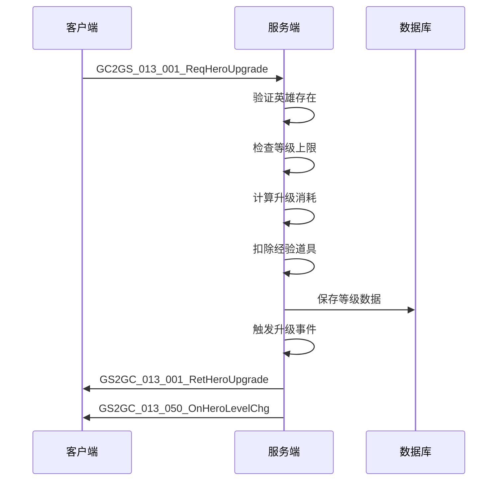
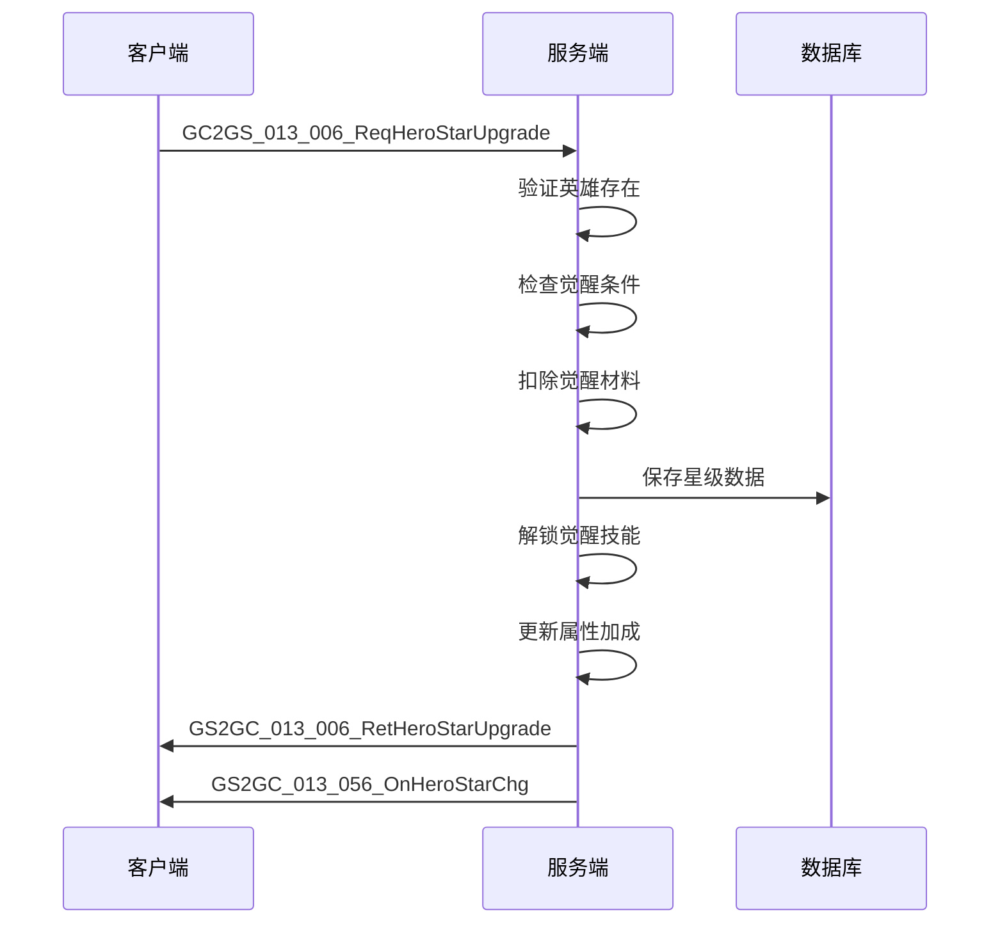
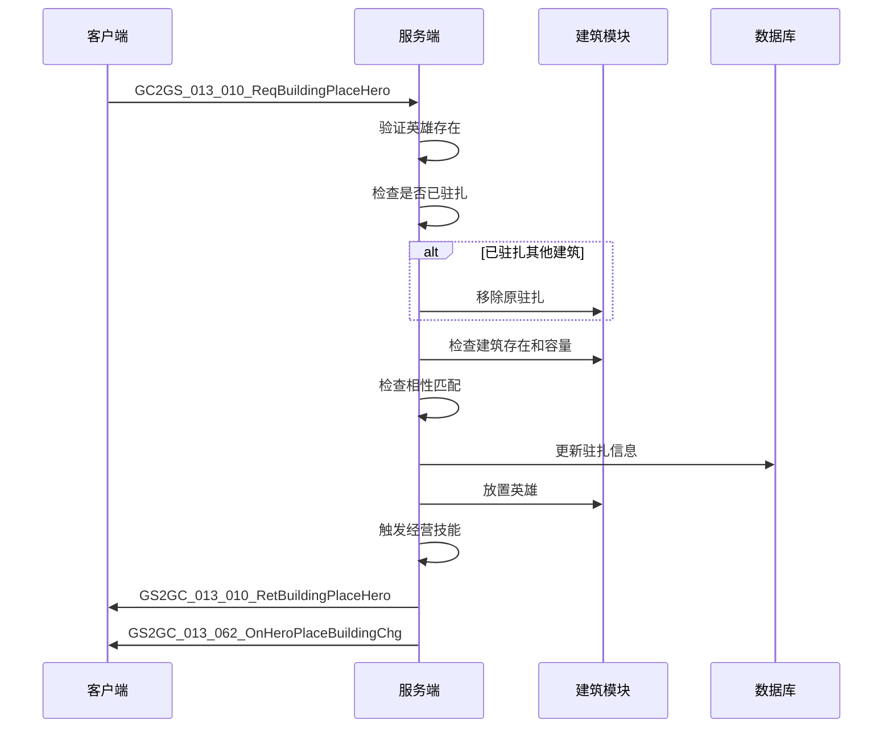
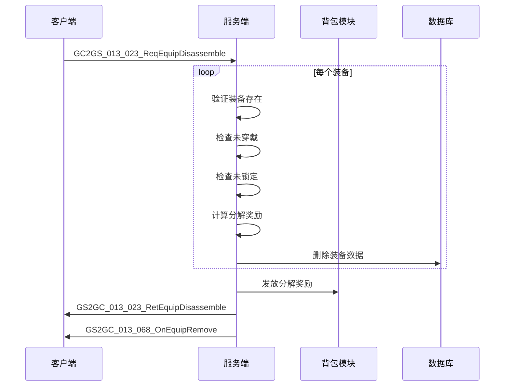

# 英雄模块协议文档

## 协议模块编号: p013

协议主序号: `13`

---

## 一、客户端请求协议 (GC2GS)

### 1.1 英雄升级相关

#### GC2GS_013_001_ReqHeroUpgrade - 升级大臣

**功能说明**: 升级大臣等级，支持单次升级和十连升级

| 序号 | 字段名 | 类型 | 说明 | 示例 |
|------|--------|------|------|------|
| 1 | heroId | long | 大臣ID | 10001 |
| 2 | isTen | bool | 是否十连升级 | false |

**服务端处理流程**:
1. 验证英雄是否存在
2. 检查等级是否达到阶段上限
3. 计算目标等级和所需经验
4. 扣除经验道具
5. 更新等级数据
6. 推送等级变化通知

**响应**: `GS2GC_013_001_RetHeroUpgrade`

---

#### GC2GS_013_004_ReqHeroStepUpgrade - 阶段突破

**功能说明**: 英雄阶段突破，提升等级上限

| 序号 | 字段名 | 类型 | 说明 | 示例 |
|------|--------|------|------|------|
| 1 | heroId | long | 大臣ID | 10001 |

**服务端处理流程**:
1. 验证英雄是否存在
2. 检查等级是否满足突破条件
3. 检查是否已达到最大阶段
4. 扣除突破材料
5. 更新阶段数据
6. 自动提升天赋技能等级
7. 推送阶段变化通知

**响应**: `GS2GC_013_004_RetHeroStepUpgrade`

---

#### GC2GS_013_006_ReqHeroStarUpgrade - 觉醒升级

**功能说明**: 英雄觉醒星级提升

| 序号 | 字段名 | 类型 | 说明 | 示例 |
|------|--------|------|------|------|
| 1 | heroId | long | 大臣ID | 10001 |

**服务端处理流程**:
1. 验证英雄是否存在
2. 检查是否可以觉醒
3. 检查星级是否达到上限
4. 验证觉醒条件
5. 扣除觉醒材料
6. 更新星级数据
7. 解锁觉醒技能
8. 检查解锁额外资质技能
9. 推送星级变化通知

**响应**: `GS2GC_013_006_RetHeroStarUpgrade`

---

### 1.2 皮肤相关

#### GC2GS_013_002_ReqHeroSetSkin - 设置皮肤

**功能说明**: 设置英雄当前使用的皮肤

| 序号 | 字段名 | 类型 | 说明 | 示例 |
|------|--------|------|------|------|
| 1 | heroId | long | 大臣ID | 10001 |
| 2 | skinId | long | 皮肤ID | 1000101 |

**服务端处理流程**:
1. 验证英雄是否存在
2. 检查玩家是否拥有该皮肤
3. 更新当前皮肤ID
4. 推送皮肤变更通知

**响应**: `GS2GC_013_002_RetHeroSetSkin`

---

#### GC2GS_013_005_ReqHeroSkinUpgrade - 皮肤升级

**功能说明**: 升级英雄皮肤等级

| 序号 | 字段名 | 类型 | 说明 | 示例 |
|------|--------|------|------|------|
| 1 | heroId | long | 大臣ID | 10001 |
| 2 | skinId | long | 皮肤ID | 1000101 |

**响应**: `GS2GC_013_005_RetHeroSkinUpgrade`

---

#### GC2GS_013_009_ReqHeroSkinUnlock - 解锁皮肤

**功能说明**: 解锁新皮肤

| 序号 | 字段名 | 类型 | 说明 | 示例 |
|------|--------|------|------|------|
| 1 | heroId | long | 大臣ID | 10001 |
| 2 | skinId | long | 皮肤ID | 1000102 |

**服务端处理流程**:
1. 验证英雄是否存在
2. 检查皮肤配置是否存在
3. 检查是否已拥有该皮肤
4. 扣除解锁道具
5. 获得皮肤附带的资质技能
6. 获得解锁奖励道具
7. 推送皮肤解锁通知

**响应**: `GS2GC_013_009_RetHeroSkinUnlock`

---

### 1.3 技能相关

#### GC2GS_013_007_ReqHeroTalentSkillUpgrade - 资质技能升级

**功能说明**: 升级英雄资质技能

| 序号 | 字段名 | 类型 | 说明 | 示例 |
|------|--------|------|------|------|
| 1 | heroId | long | 大臣ID | 10001 |
| 2 | skillId | long | 技能ID | 1001 |
| 3 | isTen | bool | 是否十连升级 | false |

**响应**: `GS2GC_013_007_RetHeroTalentSkillUpgrade`

---

#### GC2GS_013_008_ReqHeroBusinessSkillUpgrade - 经营技能升级

**功能说明**: 升级英雄经营技能

| 序号 | 字段名 | 类型 | 说明 | 示例 |
|------|--------|------|------|------|
| 1 | heroId | long | 大臣ID | 10001 |
| 2 | skillId | long | 技能ID | 3001 |

**响应**: `GS2GC_013_008_RetHeroBusinessSkillUpgrade`

---

### 1.4 光环相关

#### GC2GS_013_015_ReqHeroHaloUnlock - 解锁光环

**功能说明**: 解锁英雄光环

| 序号 | 字段名 | 类型 | 说明 | 示例 |
|------|--------|------|------|------|
| 1 | heroId | long | 大臣ID | 10001 |

**服务端处理流程**:
1. 验证英雄是否存在
2. 检查是否已有光环
3. 检查是否已解锁
4. 创建光环数据
5. 添加属性加成
6. 添加套系技能等级加成
7. 推送光环变更通知

**响应**: `GS2GC_013_015_RetHeroHaloUnlock`

---

#### GC2GS_013_016_ReqHeroHaloUpgrade - 升级光环

**功能说明**: 升级英雄光环等级

| 序号 | 字段名 | 类型 | 说明 | 示例 |
|------|--------|------|------|------|
| 1 | heroId | long | 大臣ID | 10001 |

**服务端处理流程**:
1. 验证光环是否已解锁
2. 检查是否有下一级
3. 扣除升级消耗
4. 更新光环等级
5. 替换属性加成
6. 更新套系技能等级
7. 推送光环变更通知

**响应**: `GS2GC_013_016_RetHeroHaloUpgrade`

---

### 1.5 建筑驻扎相关

#### GC2GS_013_010_ReqBuildingPlaceHero - 建筑放置英雄

**功能说明**: 将英雄放置到建筑中工作

| 序号 | 字段名 | 类型 | 说明 | 示例 |
|------|--------|------|------|------|
| 1 | heroId | long | 大臣ID | 10001 |
| 2 | buildingId | long | 建筑ID | 20001 |

**服务端处理流程**:
1. 验证英雄是否存在
2. 检查是否已驻扎其他建筑（若有则先移除）
3. 验证目标建筑是否存在
4. 检查建筑是否已满
5. 检查相性是否匹配
6. 更新英雄驻扎信息
7. 触发建筑放置处理
8. 推送驻扎变更通知

**响应**: `GS2GC_013_010_RetBuildingPlaceHero`

---

#### GC2GS_013_011_ReqBuildingRemoveHero - 建筑移除英雄

**功能说明**: 将英雄从建筑中移除

| 序号 | 字段名 | 类型 | 说明 | 示例 |
|------|--------|------|------|------|
| 1 | buildingId | long | 建筑ID | 20001 |

**服务端处理流程**:
1. 检查英雄是否已驻扎
2. 从建筑移除英雄
3. 触发移除处理
4. 清空驻扎信息
5. 推送驻扎变更通知

**响应**: `GS2GC_013_011_RetBuildingRemoveHero`

---

### 1.6 装备相关

#### GC2GS_013_021_ReqEquipUpgrade - 装备升级

**功能说明**: 升级装备等级

| 序号 | 字段名 | 类型 | 说明 | 示例 |
|------|--------|------|------|------|
| 1 | equipId | long | 装备ID | 30001 |

**响应**: `GS2GC_013_021_RetEquipUpgrade`

---

#### GC2GS_013_022_ReqEquipSkillRebuild - 装备技能重铸

**功能说明**: 重新随机装备技能

| 序号 | 字段名 | 类型 | 说明 | 示例 |
|------|--------|------|------|------|
| 1 | equipId | long | 装备ID | 30001 |
| 2 | skillIdx | int | 技能索引 | 0 |
| 3 | useItem | bool | 是否使用道具保底 | true |

**响应**: `GS2GC_013_022_RetEquipSkillRebuild`

---

#### GC2GS_013_023_ReqEquipDisassemble - 装备分解

**功能说明**: 分解装备获取材料

| 序号 | 字段名 | 类型 | 说明 | 示例 |
|------|--------|------|------|------|
| 1 | equipIdList | List\<long\> | 装备ID列表 | [30001, 30002] |

**服务端处理流程**:
1. 遍历所有装备
2. 验证装备是否存在
3. 检查是否已穿戴
4. 检查是否已锁定
5. 计算分解奖励
6. 移除装备数据
7. 发放分解奖励
8. 推送装备移除通知

**响应**: `GS2GC_013_023_RetEquipDisassemble`

---

#### GC2GS_013_024_ReqEquipAwaken - 装备觉醒

**功能说明**: 装备觉醒提升品质

| 序号 | 字段名 | 类型 | 说明 | 示例 |
|------|--------|------|------|------|
| 1 | equipId | long | 装备ID | 30001 |

**响应**: `GS2GC_013_024_RetEquipAwaken`

---

#### GC2GS_013_027_ReqEquipSkillList - 获取装备技能列表

**功能说明**: 请求装备可选技能列表

| 序号 | 字段名 | 类型 | 说明 | 示例 |
|------|--------|------|------|------|
| 1 | equipId | long | 装备ID | 30001 |

**响应**: `GS2GC_013_027_RetEquipSkillList`

---

#### GC2GS_013_028_ReqHeroWearEquip - 英雄穿戴装备

**功能说明**: 英雄穿戴指定装备

| 序号 | 字段名 | 类型 | 说明 | 示例 |
|------|--------|------|------|------|
| 1 | heroId | long | 大臣ID | 10001 |
| 2 | equipId | long | 装备ID | 30001 |

**响应**: `GS2GC_013_028_RetHeroWearEquip`

---

#### GC2GS_013_029_ReqHeroUnWearEquip - 英雄卸下装备

**功能说明**: 英雄卸下装备

| 序号 | 字段名 | 类型 | 说明 | 示例 |
|------|--------|------|------|------|
| 1 | heroId | long | 大臣ID | 10001 |
| 2 | equipPos | int | 装备位置 | 0 |

**响应**: `GS2GC_013_029_RetHeroUnWearEquip`

---

#### GC2GS_013_030_ReqEquipLockStateChg - 装备锁定状态变更

**功能说明**: 锁定/解锁装备

| 序号 | 字段名 | 类型 | 说明 | 示例 |
|------|--------|------|------|------|
| 1 | equipId | long | 装备ID | 30001 |
| 2 | isLock | bool | 是否锁定 | true |

**响应**: `GS2GC_013_030_RetEquipLockStateChg`

---

## 二、服务端响应协议 (GS2GC)

### 2.1 操作结果响应

| 协议名 | 主序号 | 子序号 | 说明 |
|--------|--------|--------|------|
| GS2GC_013_001_RetHeroUpgrade | 13 | 1 | 英雄升级结果 |
| GS2GC_013_002_RetHeroSetSkin | 13 | 2 | 设置皮肤结果 |
| GS2GC_013_004_RetHeroStepUpgrade | 13 | 4 | 阶段升级结果 |
| GS2GC_013_005_RetHeroSkinUpgrade | 13 | 5 | 皮肤升级结果 |
| GS2GC_013_006_RetHeroStarUpgrade | 13 | 6 | 觉醒升级结果 |
| GS2GC_013_007_RetHeroTalentSkillUpgrade | 13 | 7 | 资质技能升级结果 |
| GS2GC_013_008_RetHeroBusinessSkillUpgrade | 13 | 8 | 经营技能升级结果 |
| GS2GC_013_009_RetHeroSkinUnlock | 13 | 9 | 解锁皮肤结果 |
| GS2GC_013_010_RetBuildingPlaceHero | 13 | 10 | 建筑放置英雄结果 |
| GS2GC_013_011_RetBuildingRemoveHero | 13 | 11 | 建筑移除英雄结果 |
| GS2GC_013_015_RetHeroHaloUnlock | 13 | 15 | 解锁光环结果 |
| GS2GC_013_016_RetHeroHaloUpgrade | 13 | 16 | 升级光环结果 |
| GS2GC_013_021_RetEquipUpgrade | 13 | 21 | 装备升级结果 |
| GS2GC_013_022_RetEquipSkillRebuild | 13 | 22 | 装备技能重铸结果 |
| GS2GC_013_023_RetEquipDisassemble | 13 | 23 | 装备分解结果 |
| GS2GC_013_024_RetEquipAwaken | 13 | 24 | 装备觉醒结果 |
| GS2GC_013_027_RetEquipSkillList | 13 | 27 | 装备技能列表 |
| GS2GC_013_028_RetHeroWearEquip | 13 | 28 | 英雄穿戴装备结果 |
| GS2GC_013_029_RetHeroUnWearEquip | 13 | 29 | 英雄卸下装备结果 |
| GS2GC_013_030_RetEquipLockStateChg | 13 | 30 | 装备锁定状态变更结果 |

### 2.2 推送通知协议

| 协议名 | 主序号 | 子序号 | 说明 |
|--------|--------|--------|------|
| GS2GC_013_050_OnHeroLevelChg | 13 | 50 | 英雄等级变化推送 |
| GS2GC_013_052_OnHeroTalentSkillChg | 13 | 52 | 英雄资质技能变化推送 |
| GS2GC_013_054_OnHeroBusinessSkillChg | 13 | 54 | 英雄经营技能变化推送 |
| GS2GC_013_055_OnGainHero | 13 | 55 | 获得新英雄推送 |
| GS2GC_013_056_OnHeroStarChg | 13 | 56 | 英雄觉醒星级变化推送 |
| GS2GC_013_057_OnHeroSkinChg | 13 | 57 | 英雄皮肤变化推送 |
| GS2GC_013_058_OnHeroStepChg | 13 | 58 | 英雄阶段变化推送 |
| GS2GC_013_059_OnHeroWearSkinChg | 13 | 59 | 英雄穿戴皮肤变化推送 |
| GS2GC_013_060_OnHeroSuitChg | 13 | 60 | 英雄套系变化推送 |
| GS2GC_013_061_OnHeroHaloChg | 13 | 61 | 英雄光环变化推送 |
| GS2GC_013_062_OnHeroPlaceBuildingChg | 13 | 62 | 英雄驻扎建筑变化推送 |
| GS2GC_013_063_OnHeroItemAddPowerChg | 13 | 63 | 英雄道具加成实力变化推送 |
| GS2GC_013_064_OnHeroArenaAddPowerChg | 13 | 64 | 英雄竞技场加成实力变化推送 |
| GS2GC_013_065_OnEquipAdd | 13 | 65 | 装备新增推送 |
| GS2GC_013_066_OnEquipBaseChg | 13 | 66 | 装备基础信息变化推送 |
| GS2GC_013_067_OnEquipSkillChg | 13 | 67 | 装备技能变化推送 |
| GS2GC_013_068_OnEquipRemove | 13 | 68 | 装备移除推送 |
| GS2GC_013_069_OnHeroTravelAddPowerChg | 13 | 69 | 英雄游历加成实力变化推送 |

---

## 三、协议数据结构

### 3.1 Hero_Info - 大臣信息

| 序号 | 字段名 | 类型 | 说明 |
|------|--------|------|------|
| 1 | heroId | long | 大臣ID |
| 2 | skinId | long | 当前皮肤ID |
| 3 | level | int | 等级 |
| 4 | step | int | 阶段 |
| 5 | star | int | 觉醒星级 |
| 6 | skinList | List\<Hero_SkinInfo\> | 皮肤列表 |
| 7 | talentSkillList | List\<Hero_TalentSkillInfo\> | 资质技能列表 |
| 8 | businessSkillList | List\<Hero_BusinessSkillInfo\> | 经营技能列表 |
| 9 | haloInfo | Hero_HaloInfo | 光环信息 |
| 10 | placeInfo | Hero_PlaceInfo | 放置信息 |
| 11 | itemAddPower | long | 道具额外加成实力 |
| 12 | arenaAddPower | long | 竞技场额外加成实力 |
| 13 | travelAddPower | long | 游历额外加成实力 |

### 3.2 Hero_SkinInfo - 皮肤信息

| 序号 | 字段名 | 类型 | 说明 |
|------|--------|------|------|
| 1 | skinId | long | 皮肤ID |
| 2 | level | long | 皮肤等级 |

### 3.3 Hero_TalentSkillInfo - 资质技能信息

| 序号 | 字段名 | 类型 | 说明 |
|------|--------|------|------|
| 1 | talentSkillId | long | 资质技能ID |
| 2 | level | long | 技能等级 |

### 3.4 Hero_BusinessSkillInfo - 经营技能信息

| 序号 | 字段名 | 类型 | 说明 |
|------|--------|------|------|
| 1 | skillId | long | 技能ID |
| 2 | level | long | 技能等级 |

### 3.5 Hero_HaloInfo - 光环信息

| 序号 | 字段名 | 类型 | 说明 |
|------|--------|------|------|
| 1 | heroId | long | 大臣ID |
| 2 | isUnlock | bool | 是否解锁 |
| 3 | level | long | 光环等级 |

### 3.6 Hero_PlaceInfo - 放置信息

| 序号 | 字段名 | 类型 | 说明 |
|------|--------|------|------|
| 1 | buildingId | long | 建筑ID |
| 2 | serial | long | 序列号 |

---

## 四、协议时序图

### 4.1 英雄升级流程

### 4.2 英雄觉醒流程

### 4.3 英雄驻扎建筑流程

### 4.4 装备分解流程

---

## 五、错误码定义

| 错误码 | 错误信息 | 说明 |
|--------|----------|------|
| 20001 | HERO_REACH_CURRENT_STEP_LIMIT | 等级达到当前阶段上限 |
| 20002 | HERO_UPGRADE_FAIL | 骑士升级失败 |
| 20003 | HERO_LEVEL_NOT_ENOUGH | 骑士等级不够 |
| 20004 | HERO_STEP_IS_MAX | 骑士已达到最大阶段 |
| 20005 | HERO_SKILL_NOT_EXIST | 骑士技能不存在 |
| 20006 | HERO_STAR_REACH_MAX | 骑士星级达到上限 |
| 20007 | HERO_EXP_SKILL_LEVEL_REACH_MAX | 骑士经验技能等级达到上限 |
| 20008 | HERO_HALO_NOT_FOUND | 大臣没有光环 |
| 20009 | HERO_TALENT_SKILL_NOT_EXIST | 骑士资质技能不存在 |
| 20010 | HERO_SKIN_NOT_EXIST | 骑士皮肤不存在 |
| 20011 | HERO_NOT_EXIST | 骑士不存在 |
| 20012 | HERO_SKIN_ALREADY_OWN | 已拥有骑士皮肤 |
| 20013 | HERO_ONE_CLICK_UPGRADE_NOT_UNLOCK | 大臣一键升级功能未解锁 |
| 20014 | HERO_HALO_UNLOCK_REPEAT | 大臣重复解锁光环 |
| 20015 | HERO_NOT_PLACE | 大臣未驻扎 |
| 20016 | HERO_HALO_NOT_UNLOCK | 大臣光环尚未解锁 |
| 20017 | HERO_ALREADY_EXISTED | 大臣已经存在 |
| 20018 | HERO_TALENT_SKILL_LEVEL_REACH_MAX | 大臣资质技能等级达到上限 |
| 20019 | HERO_CANT_PLACE_TO_THIS_ATTR_BUILDING | 大臣无法驻扎到该相性建筑 |
| 20020 | HERO_TALENT_SKILL_NOT_SUPPORT_MANUAL_UPGRADE | 大臣资质技能不支持手动升级 |

---

*文档生成时间: 2026-04-11*
