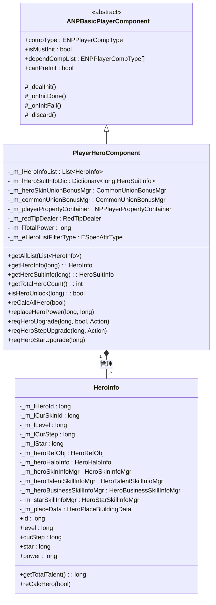
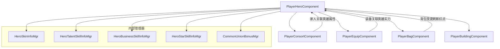
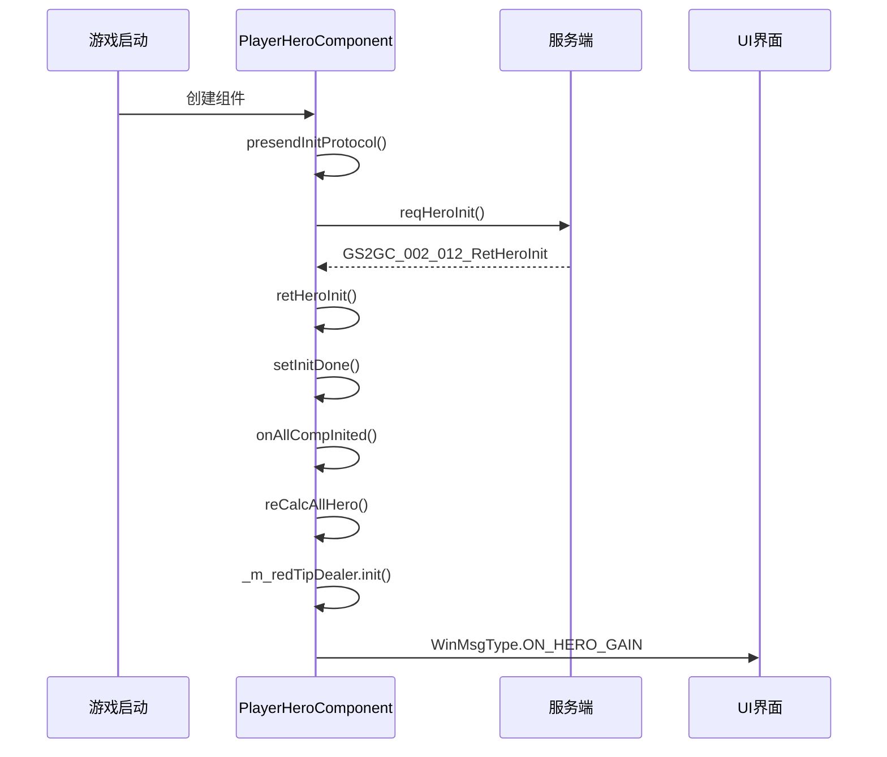

# 英雄模块客户端开发文档

## 一、组件架构

### 1.1 组件类图



### 1.2 HeroInfo 类结构

**路径**: `GameComponent/Hero/HeroInfo.cs`

| 属性名 | 类型 | 说明 |
|--------|------|------|
| id | long | 英雄唯一ID |
| curSkinId | long | 当前皮肤ID |
| star | long | 觉醒星级 |
| level | long | 当前等级 |
| curStep | long | 当前阶段 |
| belongSuitId | long | 所属套系ID |
| specAttrType | ESpecAttrType | 相性类型 |
| heroRefObj | HeroRefObj | 英雄静态配置数据 |
| heroHaloInfo | HeroHaloInfo | 光环信息 |
| heroSkinInfoMgr | HeroSkinInfoMgr | 皮肤管理器 |
| heroTalentSkillInfoMgr | HeroTalentSkillInfoMgr | 资质技能管理器 |
| heroBusinessSkillInfoMgr | HeroBusinessSkillInfoMgr | 经营技能管理器 |
| starSkillInfoMgr | HeroStarSkillInfoMgr | 觉醒技能管理器 |
| attrPropertyContainer | PlayerAttrPropertyContainer | 属性容器 |
| placeData | HeroPlaceBuildingData | 驻扎数据 |
| power | long | 实力值 |
| isUnlock | bool | 是否解锁 |
| haveHalo | bool | 是否有光环 |
| haveStarSkill | bool | 是否有觉醒技能 |

---

## 二、核心方法

### 2.1 PlayerHeroComponent 核心方法

| 方法名 | 参数 | 返回值 | 说明 |
|--------|------|--------|------|
| getAllList | List\<HeroInfo\> _recList | void | 获取所有英雄列表 |
| getHeroInfo | long _heroId | HeroInfo | 根据ID获取英雄信息 |
| getHeroSuitInfo | long _heroHaloSuitId | HeroSuitInfo | 获取套系信息 |
| getTotalHeroCount | - | int | 获取英雄总数 |
| getTotalHeroLevel | - | long | 获取英雄总等级 |
| isHeroUnlock | long _heroId | bool | 英雄是否已解锁 |
| getHeroInBuildingNum | - | long | 获取驻扎中的英雄数量 |
| getTotalHeroTalent | - | long | 获取英雄总资质 |
| getFitStarHeroCount | long _star | long | 获取达到指定星级的英雄数量 |
| reCalcAllHero | bool _isDealNextFrame | void | 重新计算所有英雄属性 |
| replaceHeroPower | long _prePower, long _newPower | void | 更新总实力 |
| needShowRedTip | long _redTipId, long _heroId | bool | 是否需要显示红点 |
| setReadRedTip | long _redTipId, long _heroId | void | 设置红点已读 |

### 2.2 请求方法 (C2S)

| 方法名 | 参数 | 说明 |
|--------|------|------|
| reqHeroInit | - | 请求初始化英雄列表 |
| reqHeroUpgrade | long _heroId, bool _isTen, Action _callback | 请求升级英雄 |
| reqHeroSetSkin | long _skinId | 请求穿戴皮肤 |
| reqHeroStepUpgrade | long _heroId, Action _callback | 请求阶段突破 |
| reqHeroSkinUpgrade | long _skinId | 请求皮肤升级 |
| reqHeroStarUpgrade | long _heroId | 请求觉醒升星 |
| reqHeroTalentSkillUpgrade | long _heroId, long _talentSkillId, bool _isTen, Action\<bool\> _callback | 请求资质技能升级 |
| reqHeroBusinessSkillUpgrade | long _heroId, long _businessSkillId, Action\<bool\> _onDone | 请求经营技能升级 |
| reqHeroSkinUnlock | long _skinId | 请求解锁皮肤 |
| reqBuildingPlaceHero | long _heroId, long _buildingId, Action _callback | 请求驻扎建筑 |
| reqBuildingRemoveHero | long _heroId, Action _callback | 请求移出建筑 |
| reqHeroHaloUnlock | long _heroId, Action _callback | 请求解锁光环 |
| reqHeroHaloUpgrade | long _heroId, Action\<bool\> _callback | 请求升级光环 |

### 2.3 响应方法 (S2C)

| 方法名 | 参数 | 说明 |
|--------|------|------|
| retHeroInit | GS2GC_002_012_RetHeroInit _msg | 初始化英雄信息 |
| onHeroLevelChg | GS2GC_013_050_OnHeroLevelChg _msg | 英雄等级变化 |
| onHeroTalentSkillChg | GS2GC_013_052_OnHeroTalentSkillChg _msg | 资质技能变化 |
| onHeroBusinessSkillChg | GS2GC_013_054_OnHeroBusinessSkillChg _msg | 经营技能变化 |
| onGainHero | GS2GC_013_055_OnGainHero _msg | 获得新英雄 |
| onHeroStarChg | GS2GC_013_056_OnHeroStarChg _msg | 觉醒星级变化 |
| onHeroSkinChg | GS2GC_013_057_OnHeroSkinChg _msg | 皮肤变化 |
| onHeroStepChg | GS2GC_013_058_OnHeroStepChg _msg | 阶段变化 |
| onHeroWearSkinChg | GS2GC_013_059_OnHeroWearSkinChg _msg | 穿戴皮肤变化 |
| onHeroSuitChg | GS2GC_013_060_OnHeroSuitChg _msg | 套系变化 |
| onHeroHaloChg | GS2GC_013_061_OnHeroHaloChg _msg | 光环变化 |
| onHeroPlaceBuildingChg | GS2GC_013_062_OnHeroPlaceBuildingChg _msg | 驻扎变化 |
| onHeroItemAddPowerChg | GS2GC_013_063_OnHeroItemAddPowerChg _msg | 道具加成变化 |
| onHeroArenaAddPowerChg | GS2GC_013_064_OnHeroArenaAddPowerChg _msg | 竞技场加成变化 |
| onHeroTravelAddPowerChg | GS2GC_013_069_OnHeroTravelAddPowerChg _msg | 游历加成变化 |

---

## 三、消息事件

### 3.1 英雄相关消息

| 消息类型 | 说明 | 参数 |
|----------|------|------|
| WinMsgType.ON_HERO_GAIN | 获得新英雄 | HeroInfo heroInfo |
| WinMsgType.ON_HERO_LEVEL_CHG | 英雄等级变化 | HeroInfo heroInfo, long oriLevel, long newLevel |
| WinMsgType.ON_HERO_STEP_CHG | 英雄阶段变化 | HeroInfo heroInfo, long oriStepId |
| WinMsgType.ON_HERO_STAR_CHG | 英雄觉醒变化 | long heroId, long oriStar, long newStar |
| WinMsgType.ON_HERO_SKIN_CHG | 英雄皮肤变化 | HeroInfo heroInfo |
| WinMsgType.ON_HERO_CUR_SKIN_ID_CHG | 英雄穿戴皮肤变化 | HeroInfo heroInfo |
| WinMsgType.ON_HERO_HALO_CHG | 英雄光环变化 | long heroId |
| WinMsgType.ON_HERO_TALENT_SKILL_CHG | 资质技能变化 | long heroId, long skillId |
| WinMsgType.ON_HERO_ADD_TALENT_SKILL | 新增资质技能 | long heroId, long skillId |
| WinMsgType.ON_HERO_BUSINESS_SKILL_CHG | 经营技能变化 | long heroId, long skillId |
| WinMsgType.ON_HERO_GET_NEW_BUSINESS_SKILL | 获得新经营技能 | long heroId, long skillId |
| WinMsgType.ON_HERO_SUIT_CHG | 套系变化 | long suitId |
| WinMsgType.ON_HERO_PLACE_BUILDING_CHG | 驻扎建筑变化 | long heroId, long lastBuildingId, long newBuildingId |
| WinMsgType.ON_ALL_HERO_TOTAL_POWER_CHG | 总实力变化 | - |

### 3.2 依赖消息

| 消息类型 | 说明 |
|----------|------|
| WinMsgType.ON_CONSORT_RELATION_HERO_ATTR_PROPERTY_CHG | 家人关联英雄属性加成变化 |
| WinMsgType.ON_EQUIP_RELATE_HERO_POWER_RECALCULATE | 装备关联英雄实力重算 |
| WinMsgType.ON_BAG_ITEM_ADD | 背包物品新增 |
| WinMsgType.ON_BAG_ITEM_REMOVE | 背包物品移除 |
| WinMsgType.ON_BAG_ITEM_UPDATE | 背包物品更新 |
| WinMsgType.ON_PLAYER_RES_CHANGE | 玩家资源变化 |
| WinMsgType.ON_EQUIP_ADD | 装备新增 |
| WinMsgType.ON_EQUIP_REMOVE | 装备移除 |
| WinMsgType.ON_EQUIP_BASE_CHG | 装备信息变更 |

---

## 四、访问示例

### 4.1 获取英雄组件

```csharp
// 获取英雄组件
PlayerHeroComponent heroComp = NPPlayer.instance.heroComponent;

// 获取所有英雄列表
List<HeroInfo> heroList = new List<HeroInfo>();
heroComp.getAllList(heroList);

// 获取指定英雄
HeroInfo hero = heroComp.getHeroInfo(heroId);
if (hero != null)
{
    // 使用英雄数据
    Debug.Log($"英雄ID: {hero.id}, 等级: {hero.level}, 实力: {hero.power}");
}

// 获取总实力
long totalPower = heroComp.totalPower;

// 获取英雄数量
int heroCount = heroComp.getTotalHeroCount();

// 检查英雄是否已解锁
bool isUnlock = heroComp.isHeroUnlock(heroId);
```

### 4.2 英雄属性获取

```csharp
HeroInfo hero = NPPlayer.instance.heroComponent.getHeroInfo(heroId);
if (hero != null)
{
    // 基础属性
    long level = hero.level;
    long step = hero.curStep;
    long star = hero.star;
    long power = hero.power;

    // 配置数据
    HeroRefObj heroRef = hero.heroRefObj;
    string heroName = heroRef.transName;
    ESpecAttrType attrType = heroRef.spec_attr_type;

    // 技能列表
    var talentSkills = hero.heroTalentSkillInfoMgr;
    var businessSkills = hero.heroBusinessSkillInfoMgr;

    // 驻扎信息
    bool isInBuilding = hero.placeData.buildingId > 0;

    // 光环信息
    bool hasHalo = hero.haveHalo;
    bool haloUnlock = hero.heroHaloInfo?.isUnlock ?? false;
}
```

### 4.3 发送请求示例

```csharp
// 升级英雄
NPPlayer.instance.heroComponent.reqHeroUpgrade(heroId, false, () => {
    Debug.Log("升级成功");
});

// 十连升级
NPPlayer.instance.heroComponent.reqHeroUpgrade(heroId, true, () => {
    Debug.Log("十连升级完成");
});

// 阶段突破
NPPlayer.instance.heroComponent.reqHeroStepUpgrade(heroId, () => {
    Debug.Log("突破成功");
});

// 觉醒升星
NPPlayer.instance.heroComponent.reqHeroStarUpgrade(heroId);

// 驻扎建筑
NPPlayer.instance.heroComponent.reqBuildingPlaceHero(heroId, buildingId, () => {
    Debug.Log("驻扎成功");
});

// 移出建筑
NPPlayer.instance.heroComponent.reqBuildingRemoveHero(heroId, () => {
    Debug.Log("移出成功");
});

// 解锁光环
NPPlayer.instance.heroComponent.reqHeroHaloUnlock(heroId, () => {
    Debug.Log("光环解锁成功");
});

// 升级光环
NPPlayer.instance.heroComponent.reqHeroHaloUpgrade(heroId, (isSuccess) => {
    if (isSuccess)
        Debug.Log("光环升级成功");
});
```

### 4.4 监听消息示例

```csharp
// 监听英雄等级变化
WinMsg.RegisterMsg(WinMsgType.ON_HERO_LEVEL_CHG, (params object[] args) => {
    HeroInfo hero = args[0] as HeroInfo;
    long oriLevel = (long)args[1];
    long newLevel = (long)args[2];
    Debug.Log($"英雄 {hero.id} 从 {oriLevel} 级升到 {newLevel} 级");
});

// 监听获得新英雄
WinMsg.RegisterMsg(WinMsgType.ON_HERO_GAIN, (params object[] args) => {
    HeroInfo hero = args[0] as HeroInfo;
    Debug.Log($"获得新英雄: {hero.heroRefObj.transName}");
});

// 监听总实力变化
WinMsg.RegisterMsg(WinMsgType.ON_ALL_HERO_TOTAL_POWER_CHG, (params object[] args) => {
    long totalPower = NPPlayer.instance.heroComponent.totalPower;
    Debug.Log($"总实力变化: {totalPower}");
});
```

---

## 五、红点系统

### 5.1 红点类型

| 红点类型 | 说明 | 判断条件 |
|----------|------|----------|
| 英雄可升级 | 有英雄可以升级 | 资源充足且未达等级上限 |
| 英雄可突破 | 有英雄可以阶段突破 | 等级满足条件且材料充足 |
| 英雄可觉醒 | 有英雄可以觉醒 | 条件满足且材料充足 |
| 技能可升级 | 有技能可以升级 | 资源充足且未达等级上限 |
| 光环可解锁 | 有光环可以解锁 | 未解锁且材料充足 |
| 光环可升级 | 有光环可以升级 | 已解锁且有下一级 |
| 装备可穿戴 | 有装备可以穿戴 | 有空位且品质匹配 |

### 5.2 红点查询与设置

```csharp
// 检查是否需要显示红点
bool needShow = NPPlayer.instance.heroComponent.needShowRedTip(redTipId, heroId);

// 设置红点已读
NPPlayer.instance.heroComponent.setReadRedTip(redTipId, heroId);
```

---

## 六、组件依赖关系



---

## 七、初始化流程



---

*文档生成时间: 2026-04-11*
