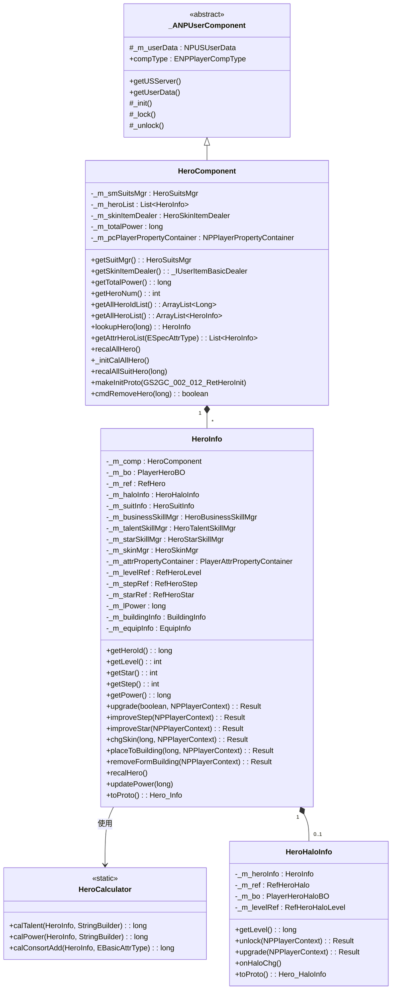
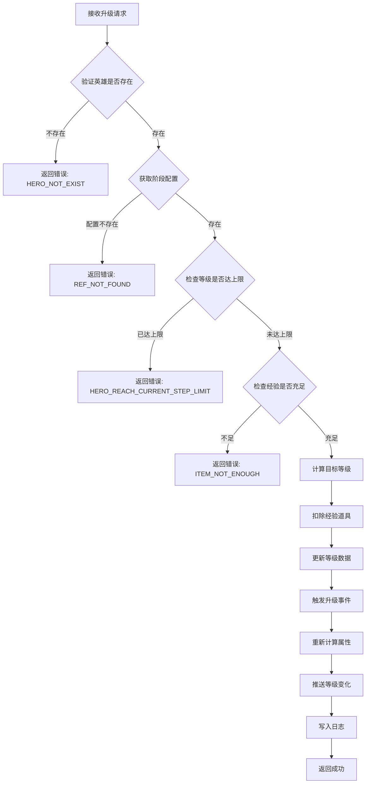
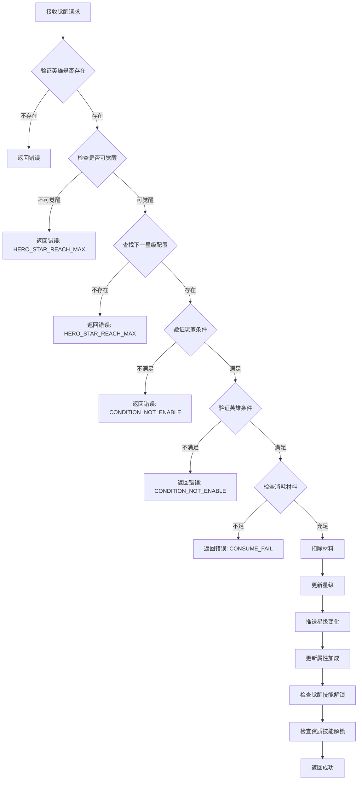
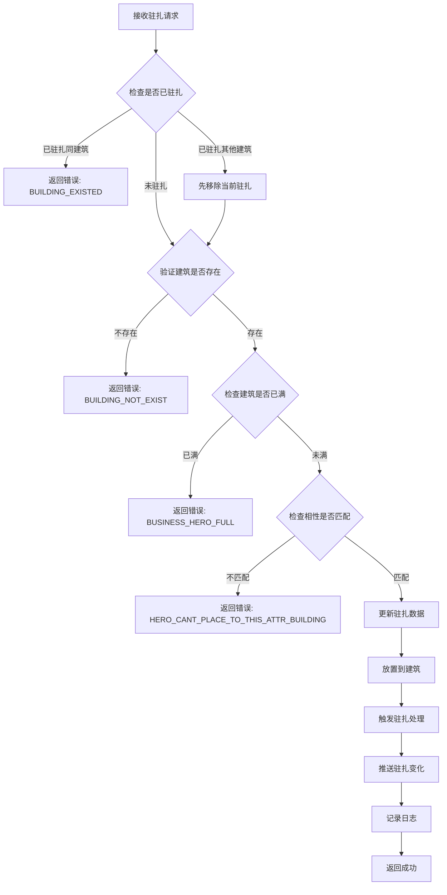
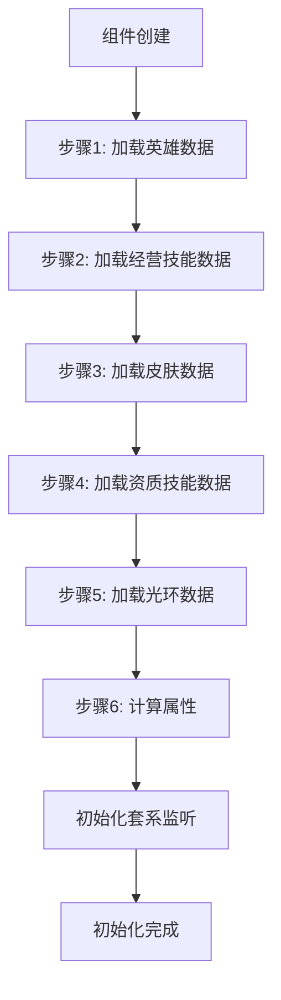

# 英雄模块服务端开发文档

## 一、模块架构

### 1.1 模块概述

英雄模块（Hero Module）负责管理玩家所有英雄（大臣）的数据和业务逻辑，包括：
- 英雄基础属性管理（等级、阶段、觉醒星级）
- 英雄皮肤系统
- 英雄技能系统（资质技能、经营技能、觉醒技能）
- 英雄光环系统
- 英雄套系系统
- 装备穿戴管理
- 建筑驻扎管理

### 1.2 模块编号

协议模块编号: `p013`

### 1.3 类图



---

## 二、核心数据结构

### 2.1 HeroInfo - 英雄信息类

**路径**: `UserComp/HeroComp/HeroInfo.java`

| 属性名 | 类型 | 说明 |
|--------|------|------|
| _m_comp | HeroComponent | 所属组件 |
| _m_bo | PlayerHeroBO | 数据库实体 |
| _m_ref | RefHero | 配置引用 |
| _m_haloInfo | HeroHaloInfo | 光环信息 |
| _m_suitInfo | HeroSuitInfo | 套系信息 |
| _m_businessSkillMgr | HeroBusinessSkillMgr | 经营技能管理器 |
| _m_talentSkillMgr | HeroTalentSkillMgr | 资质技能管理器 |
| _m_starSkillMgr | HeroStarSkillMgr | 觉醒技能管理器 |
| _m_skinMgr | HeroSkinMgr | 皮肤管理器 |
| _m_attrPropertyContainer | PlayerAttrPropertyContainer | 属性容器 |
| _m_levelRef | RefHeroLevel | 等级配置 |
| _m_stepRef | RefHeroStep | 阶段配置 |
| _m_starRef | RefHeroStar | 觉醒配置 |
| _m_lPower | long | 实力值 |
| _m_buildingInfo | BuildingInfo | 驻扎建筑 |
| _m_equipInfo | EquipInfo | 穿戴装备 |

### 2.2 数据库实体

#### PlayerHeroBO - 英雄基础数据

| 字段名 | 类型 | 说明 |
|--------|------|------|
| cid | long | 玩家ID |
| hero_id | long | 英雄唯一ID |
| level | int | 等级 |
| step | int | 阶段 |
| star | int | 觉醒星级 |
| skin_id | long | 当前皮肤ID |
| building_id | long | 驻扎建筑ID |
| serial | long | 驻扎序列号 |
| ext_add_power | long | 道具额外加成实力 |
| arena_add_power | long | 竞技场额外加成实力 |
| travel_add_power | long | 游历额外加成实力 |

#### PlayerHeroHaloBO - 英雄光环数据

| 字段名 | 类型 | 说明 |
|--------|------|------|
| id | long | 主键 |
| cid | long | 玩家ID |
| hero_id | long | 英雄ID |
| level | long | 光环等级 |

#### PlayerHeroSkinBO - 英雄皮肤数据

| 字段名 | 类型 | 说明 |
|--------|------|------|
| id | long | 主键 |
| cid | long | 玩家ID |
| skin_id | long | 皮肤ID |
| level | long | 皮肤等级 |

---

## 三、协议处理器

### 3.1 协议处理器列表

| 处理器类 | 协议 | 说明 |
|----------|------|------|
| MsgDealer_GC2GS_013_001_ReqHeroUpgrade | GC2GS_013_001 | 英雄升级 |
| MsgDealer_GC2GS_013_002_ReqHeroSetSkin | GC2GS_013_002 | 设置皮肤 |
| MsgDealer_GC2GS_013_004_ReqHeroStepUpgrade | GC2GS_013_004 | 阶段突破 |
| MsgDealer_GC2GS_013_005_ReqHeroSkinUpgrade | GC2GS_013_005 | 皮肤升级 |
| MsgDealer_GC2GS_013_006_ReqHeroStarUpgrade | GC2GS_013_006 | 觉醒升星 |
| MsgDealer_GC2GS_013_007_ReqHeroTalentSkillUpgrade | GC2GS_013_007 | 资质技能升级 |
| MsgDealer_GC2GS_013_008_ReqHeroBusinessSkillUpgrade | GC2GS_013_008 | 经营技能升级 |
| MsgDealer_GC2GS_013_009_ReqHeroSkinUnlock | GC2GS_013_009 | 解锁皮肤 |
| MsgDealer_GC2GS_013_010_ReqBuildingPlaceHero | GC2GS_013_010 | 驻扎建筑 |
| MsgDealer_GC2GS_013_011_ReqBuildingRemoveHero | GC2GS_013_011 | 移出建筑 |
| MsgDealer_GC2GS_013_015_ReqHeroHaloUnlock | GC2GS_013_015 | 解锁光环 |
| MsgDealer_GC2GS_013_016_ReqHeroHaloUpgrade | GC2GS_013_016 | 升级光环 |
| MsgDealer_GC2GS_013_021_ReqEquipUpgrade | GC2GS_013_021 | 装备升级 |
| MsgDealer_GC2GS_013_022_ReqEquipSkillRebuild | GC2GS_013_022 | 装备技能重铸 |
| MsgDealer_GC2GS_013_023_ReqEquipDisassemble | GC2GS_013_023 | 装备分解 |
| MsgDealer_GC2GS_013_028_ReqHeroWearEquip | GC2GS_013_028 | 穿戴装备 |
| MsgDealer_GC2GS_013_029_ReqHeroUnWearEquip | GC2GS_013_029 | 卸下装备 |

### 3.2 协议处理示例

```java
// 英雄升级协议处理器
public class MsgDealer_GC2GS_013_001_ReqHeroUpgrade extends _ANPPlayerMsgDealer<GC2GS_013_001_ReqHeroUpgrade>
{
    @Override
    protected Result _dealMsg(NPPlayerContext _context, NPUSUserData _userData, GC2GS_013_001_ReqHeroUpgrade _msg)
    {
        HeroComponent heroComp = _userData.getHeroComponent();
        HeroInfo heroInfo = heroComp.lookupHero(_msg.getHeroId());

        if (heroInfo == null)
            return HeroErr.HERO_NOT_EXIST;

        return heroInfo.upgrade(_msg.getIsTen(), _context);
    }
}
```

---

## 四、业务逻辑流程

### 4.1 英雄升级流程



**核心代码**:

```java
public Result upgrade(boolean _isTen, NPPlayerContext _context)
{
    lock();
    try
    {
        // 当前的阶段配置
        RefHeroStep heroStepRef = getHeroStepRef();
        if (heroStepRef == null)
            return CommErr.REF_NOT_FOUND;

        int heroLevelLimit = heroStepRef.level_limit;
        int curLevel = getLevel();

        // 判断等级是否达到当前等级上限
        if (heroLevelLimit <= curLevel)
            return HeroErr.HERO_REACH_CURRENT_STEP_LIMIT;

        // 玩家当前的经验数量
        long expCount = _m_comp.getUserData().getCurrencyComponent()
            .getItemCount(ECurrency.HERO_EXP.ordinal());
        if (expCount <= 0)
            return CommErr.ITEM_NOT_ENOUGH;

        // 计算目标等级
        int targetLevel = Math.min(_isTen ? (curLevel + 10) : (curLevel + 1), heroLevelLimit);

        // 计算升级所需经验
        WCGPair<RefHeroLevel, Long> calResult = RefHeroLevel.getMgr()
            .calculateLevelUpNeedExp(curLevel, targetLevel, expCount);
        if (calResult.first == null)
            return HeroErr.HERO_UPGRADE_FAIL;

        // 扣除经验
        boolean isSuccess = _m_comp.getUserData().spendItem(
            ENPItemType.CURRENCY, ECurrency.HERO_EXP.ordinal(), calResult.second, _context);
        if (!isSuccess)
            return CommErr.CONSUME_FAIL;

        // 设置新等级
        _setLevel(calResult.first, _context);

        return Result.SUCC;
    } finally
    {
        unlock();
    }
}
```

### 4.2 英雄觉醒流程



### 4.3 英雄驻扎建筑流程



---

## 五、属性计算

### 5.1 实力计算公式

```
总实力 = floor(基础实力 × (10000 + 万分比加成) / 10000 + 绝对值加成)
```

**详细计算**:

```java
public static long calPower(HeroInfo _heroInfo, StringBuilder _sb)
{
    // 1. 计算基础实力 = 资质值 × 等级系数
    long talentPoint = _heroInfo.getPropertyContainer().getValue(EBasicAttrType.TALENT);
    RefHeroLevel heroLevelRef = _heroInfo.getHeroLevelRef();
    long basicPower = talentPoint * (heroLevelRef == null ? 0 : heroLevelRef.level_ratio);

    // 2. 计算万分比加成
    long heroPowerPerAddition = _heroInfo.getPropertyContainer().getValue(EBasicAttrType.POWER_PER);
    long suitPowerPerAddition = _heroInfo.getSuitInfo() != null ?
        _heroInfo.getSuitInfo().getAttrContainer().getValue(EBasicAttrType.POWER_PER) : 0;
    long playerPowerPerAddition = _heroInfo.getPlayerBonusAddValue(EBonusPropertyType.POWER_PER);
    long consortPowerPerAddition = calConsortAdd(_heroInfo, EBasicAttrType.POWER_PER);
    long equipPowerPerAddition = _heroInfo.getEquipPowerPer();

    long powerPerAddition = heroPowerPerAddition + suitPowerPerAddition +
        playerPowerPerAddition + consortPowerPerAddition + equipPowerPerAddition;

    // 3. 计算绝对值加成
    long heroPowerAddition = _heroInfo.getPropertyContainer().getValue(EBasicAttrType.POWER);
    long suitPowerAddition = _heroInfo.getSuitInfo() != null ?
        _heroInfo.getSuitInfo().getAttrContainer().getValue(EBasicAttrType.POWER) : 0;
    long playerPowerAddition = _heroInfo.getPlayerBonusAddValue(EBonusPropertyType.POWER);
    long consortPowerAddition = calConsortAdd(_heroInfo, EBasicAttrType.POWER);
    long itemPowerAddition = _heroInfo.getItemAddPower();
    long arenaPowerAddition = _heroInfo.getArenaAddPower();
    long travelPowerAddition = _heroInfo.getTravelAddPower();

    long powerAddition = heroPowerAddition + suitPowerAddition +
        playerPowerAddition + consortPowerAddition +
        itemPowerAddition + arenaPowerAddition + travelPowerAddition;

    // 4. 计算总实力
    long totalPower = (long) Math.ceil((double) basicPower * (10000 + powerPerAddition) / 10000 + powerAddition);

    return totalPower;
}
```

### 5.2 资质计算

```
总资质 = 英雄自身资质 + 玩家加成资质 + 套系加成资质 + 装备加成资质
```

---

## 六、数据库设计

### 6.1 表结构

#### player_hero - 英雄数据表

| 字段名 | 类型 | 说明 |
|--------|------|------|
| id | BIGINT | 主键 |
| cid | BIGINT | 玩家ID |
| hero_id | BIGINT | 英雄配置ID |
| level | INT | 等级 |
| step | INT | 阶段 |
| star | INT | 觉醒星级 |
| skin_id | BIGINT | 当前皮肤ID |
| building_id | BIGINT | 驻扎建筑ID |
| serial | BIGINT | 驻扎序列号 |
| ext_add_power | BIGINT | 道具额外加成实力 |
| arena_add_power | BIGINT | 竞技场额外加成实力 |
| travel_add_power | BIGINT | 游历额外加成实力 |
| create_time | DATETIME | 创建时间 |
| update_time | DATETIME | 更新时间 |

#### player_hero_halo - 英雄光环数据表

| 字段名 | 类型 | 说明 |
|--------|------|------|
| id | BIGINT | 主键 |
| cid | BIGINT | 玩家ID |
| hero_id | BIGINT | 英雄ID |
| level | BIGINT | 光环等级 |
| create_time | DATETIME | 创建时间 |

#### player_hero_skin - 英雄皮肤数据表

| 字段名 | 类型 | 说明 |
|--------|------|------|
| id | BIGINT | 主键 |
| cid | BIGINT | 玩家ID |
| skin_id | BIGINT | 皮肤ID |
| level | BIGINT | 皮肤等级 |
| create_time | DATETIME | 创建时间 |

#### player_hero_business_skill - 英雄经营技能数据表

| 字段名 | 类型 | 说明 |
|--------|------|------|
| id | BIGINT | 主键 |
| cid | BIGINT | 玩家ID |
| hero_id | BIGINT | 英雄ID |
| skill_id | BIGINT | 技能ID |
| level | BIGINT | 技能等级 |

#### player_hero_talent_skill - 英雄资质技能数据表

| 字段名 | 类型 | 说明 |
|--------|------|------|
| id | BIGINT | 主键 |
| cid | BIGINT | 玩家ID |
| hero_id | BIGINT | 英雄ID |
| talent_skill_id | BIGINT | 技能ID |
| level | BIGINT | 技能等级 |

---

## 七、服务配置

### 7.1 组件依赖

```java
@Override
public ENPPlayerCompType[] getDependCompList()
{
    return new ENPPlayerCompType[]{ENPPlayerCompType.BUILDING};
}
```

### 7.2 初始化流程



---

## 八、缓存策略

### 8.1 英雄缓存

```java
// 更新英雄实力到缓存
PlayerHeroCacheFunc.updatePower(getUserdata(), this);

// 更新英雄等级到缓存
PlayerHeroCacheFunc.updateLevel(getUserdata(), this);

// 更新皮肤ID到缓存
PlayerHeroCacheFunc.updateSkinId(getUserdata(), this);

// 获得英雄时更新缓存
PlayerHeroCacheFunc.onGainHero(getUserdata(), heroInfo);
```

---

*文档生成时间: 2026-04-11*
