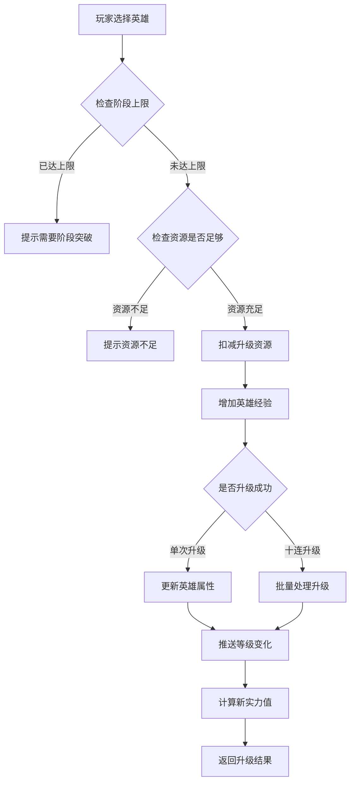
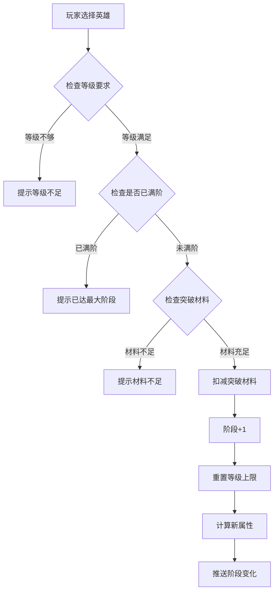
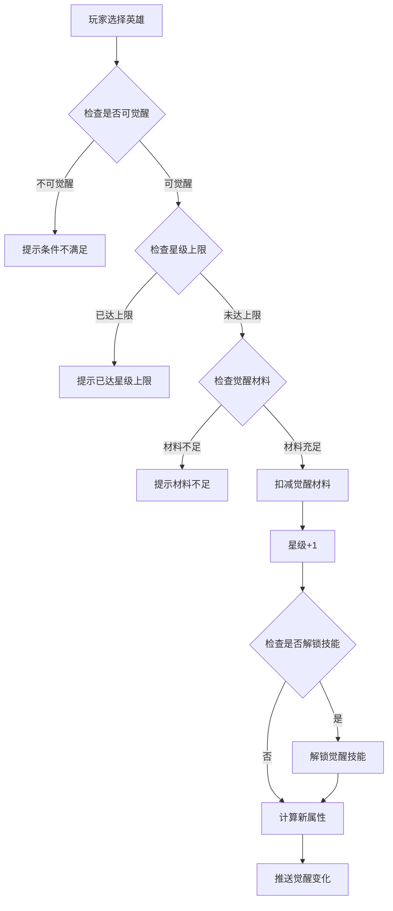
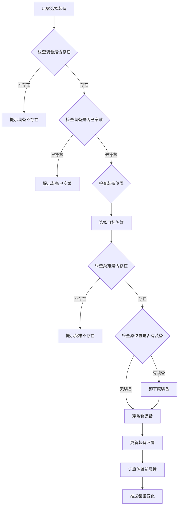
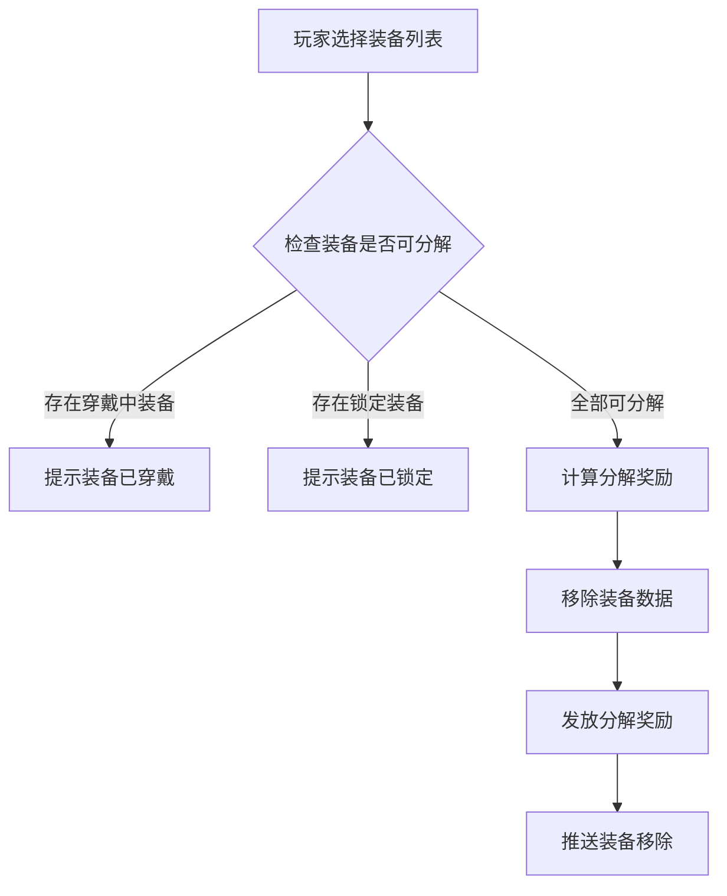
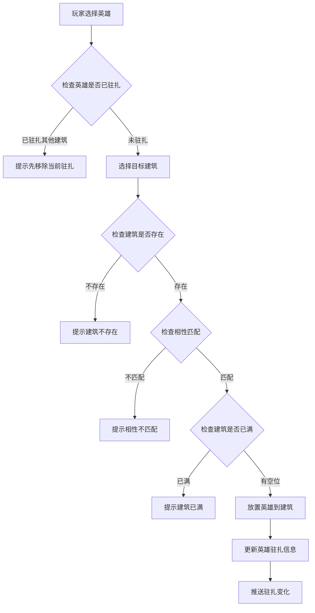

# 英雄模块完整说明

## 一、模块概述

### 1.1 业务背景

英雄模块（又称大臣系统）是 K2C 游戏的核心养成系统之一。玩家通过招募、培养各类英雄（大臣），组建强大的阵容来推进游戏进程。每个英雄拥有独特的技能、皮肤、装备系统，可以在建筑中驻扎工作，为玩家提供资源产出加成。

### 1.2 目标用户

- **游戏玩家**：希望培养强力英雄，提升整体实力
- **策略爱好者**：通过合理搭配英雄套系、装备、技能来优化战斗表现
- **收集玩家**：收集不同品质的英雄和皮肤

### 1.3 核心价值

1. **养成深度**：多维度培养系统（等级、阶段、觉醒、技能、皮肤、装备）
2. **策略性**：套系加成、光环系统、装备搭配
3. **资源产出**：英雄驻扎建筑提供产出加成
4. **社交展示**：英雄皮肤、品质展示玩家成就

---

## 二、功能清单

### 2.1 英雄基础功能

| 功能名称 | 功能描述 | 用户价值 |
|---------|---------|---------|
| 英雄升级 | 消耗资源提升英雄等级 | 提升基础属性 |
| 阶段突破 | 突破等级上限限制 | 解锁更高等级空间 |
| 觉醒升星 | 提升英雄星级 | 解锁觉醒技能、大幅提升属性 |
| 英雄解锁 | 获得新英雄 | 扩充英雄阵容 |

### 2.2 英雄皮肤功能

| 功能名称 | 功能描述 | 用户价值 |
|---------|---------|---------|
| 皮肤解锁 | 解锁英雄新皮肤 | 获得外观变化和属性加成 |
| 皮肤升级 | 提升皮肤等级 | 增强皮肤属性加成 |
| 皮肤切换 | 更换当前穿戴皮肤 | 自定义外观展示 |

### 2.3 英雄技能功能

| 功能名称 | 功能描述 | 用户价值 |
|---------|---------|---------|
| 资质技能升级 | 提升资质技能等级 | 增强英雄基础能力 |
| 经营技能升级 | 提升经营技能等级 | 提升资源产出效率 |
| 觉醒技能解锁 | 通过觉醒解锁特殊技能 | 获得独特战斗能力 |

### 2.4 英雄光环功能

| 功能名称 | 功能描述 | 用户价值 |
|---------|---------|---------|
| 光环解锁 | 解锁英雄专属光环 | 获得光环基础效果 |
| 光环升级 | 提升光环等级 | 增强光环效果 |

### 2.5 装备系统功能

| 功能名称 | 功能描述 | 用户价值 |
|---------|---------|---------|
| 装备穿戴 | 英雄穿戴装备 | 获得装备属性加成 |
| 装备卸下 | 英雄卸下装备 | 调整装备配置 |
| 装备升级 | 提升装备等级 | 增强装备属性 |
| 装备觉醒 | 提升装备品质 | 获得更强属性 |
| 装备技能重铸 | 重新随机装备技能 | 优化装备技能配置 |
| 装备分解 | 分解不需要的装备 | 回收资源 |
| 装备锁定 | 锁定重要装备 | 防止误分解 |

### 2.6 建筑驻扎功能

| 功能名称 | 功能描述 | 用户价值 |
|---------|---------|---------|
| 建筑放置英雄 | 将英雄放入建筑工作 | 提供建筑产出加成 |
| 建筑移除英雄 | 将英雄从建筑移出 | 调整英雄配置 |
| 相性匹配 | 根据英雄相性匹配建筑 | 获得额外加成 |

---

## 三、业务流程详解

### 3.1 英雄升级流程

**详细步骤说明**：

1. **前置检查**
   - 验证英雄是否存在（错误码：20011）
   - 验证英雄当前等级是否达到阶段上限（错误码：20001）
   - 验证一键升级功能是否解锁（错误码：20013）

2. **资源校验**
   - 根据当前等级查询升级所需资源
   - 检查玩家资源是否充足
   - 资源不足时返回错误提示

3. **执行升级**
   - 扣减玩家资源（银两、经验书等）
   - 增加英雄经验值
   - 计算是否升级成功

4. **后续处理**
   - 更新英雄属性值
   - 重新计算英雄实力
   - 推送等级变化通知

### 3.2 英雄阶段突破流程

**详细步骤说明**：

1. **前置检查**
   - 验证英雄是否存在
   - 验证英雄当前等级是否满足突破条件
   - 验证英雄是否已达到最大阶段（错误码：20004）

2. **材料校验**
   - 根据目标阶段查询所需材料
   - 检查玩家背包材料是否充足

3. **执行突破**
   - 扣减突破材料
   - 英雄阶段 +1
   - 更新等级上限
   - 计算新属性加成

4. **后续处理**
   - 更新英雄所有属性
   - 重新计算实力
   - 推送阶段变化通知

### 3.3 英雄觉醒流程

**详细步骤说明**：

1. **前置检查**
   - 验证英雄是否存在
   - 验证英雄当前星级是否达到上限（错误码：20006）
   - 验证觉醒条件是否满足

2. **材料校验**
   - 根据目标星级查询所需材料
   - 检查玩家觉醒材料是否充足

3. **执行觉醒**
   - 扣减觉醒材料
   - 英雄星级 +1
   - 检查是否解锁新觉醒技能
   - 计算新属性加成

4. **后续处理**
   - 更新英雄属性和技能
   - 重新计算实力
   - 推送觉醒变化通知

### 3.4 英雄穿戴装备流程

**详细步骤说明**：

1. **前置检查**
   - 验证装备是否存在（错误码：20024）
   - 验证装备是否已被穿戴（错误码：20028）
   - 验证目标英雄是否存在（错误码：20011）

2. **装备处理**
   - 检查目标装备位是否已有装备
   - 如有装备，先自动卸下
   - 将新装备穿戴到目标位置

3. **后续处理**
   - 更新装备的 heroId 字段
   - 重新计算英雄属性
   - 推送装备变化通知

### 3.5 装备分解流程

**详细步骤说明**：

1. **前置检查**
   - 验证所有装备是否存在
   - 验证是否有装备已被穿戴（错误码：20028）
   - 验证是否有装备已锁定（错误码：20027）

2. **分解处理**
   - 根据装备品质、等级计算分解奖励
   - 移除装备数据
   - 发放分解材料到玩家背包

3. **后续处理**
   - 推送装备移除通知
   - 更新背包物品

### 3.6 英雄驻扎建筑流程

**详细步骤说明**：

1. **前置检查**
   - 验证英雄是否存在
   - 验证英雄是否已驻扎其他建筑（错误码：20015）
   - 验证目标建筑是否存在

2. **相性校验**
   - 检查英雄相性类型与建筑相性是否匹配
   - 不匹配时返回错误（错误码：20019）

3. **放置处理**
   - 将英雄放入建筑
   - 更新英雄驻扎信息
   - 计算建筑产出加成

---

## 四、关键规则

### 4.1 英雄等级规则

1. **等级上限规则**：英雄等级受阶段限制，每个阶段有对应的等级上限
2. **升级消耗规则**：升级消耗银两和经验书，消耗量随等级递增
3. **一键升级规则**：十连升级需解锁对应功能，资源不足时自动停止

### 4.2 英雄阶段规则

1. **阶段上限**：英雄最高可突破至第 10 阶段
2. **突破条件**：必须达到当前阶段等级上限才能突破
3. **突破消耗**：消耗对应品质的突破材料

### 4.3 英雄觉醒规则

1. **星级上限**：英雄最高可觉醒至 5 星
2. **觉醒条件**：需要达到指定阶段才能觉醒
3. **技能解锁**：特定星级解锁对应觉醒技能

### 4.4 装备规则

1. **装备槽位**：每个英雄有固定的装备槽位（武器、防具、饰品等）
2. **品质限制**：高品质装备需要英雄达到一定等级才能穿戴
3. **锁定保护**：锁定的装备无法被分解或穿戴

### 4.5 建筑驻扎规则

1. **相性系统**：英雄有相性属性，需匹配建筑相性
2. **唯一驻扎**：一个英雄同时只能驻扎一个建筑
3. **数量限制**：每个建筑有最大驻扎人数限制

---

## 五、用户故事

### 5.1 新手玩家故事

> 作为一名刚进入游戏的新手玩家，我希望能够快速获得第一个英雄并了解培养方式。游戏在引导任务中赠送了我一个初始英雄，我通过消耗银两将他升级到 10 级，感觉实力提升明显。系统提示我可以进行阶段突破来继续升级，我按照指引完成了第一次突破。

### 5.2 中期玩家故事

> 作为一名游戏进行到中期的玩家，我拥有多个英雄，需要合理分配资源。我发现通过给英雄穿戴装备可以大幅提升实力。我通过副本获取了一件高品质装备，但技能不太理想，于是花费钻石进行了技能重铸，获得了更适合的技能组合。我还把擅长经营的英雄安排到了对应的建筑中驻扎，获得了更高的资源产出。

### 5.3 高级玩家故事

> 作为一名追求极致的高级玩家，我专注于培养主力英雄的觉醒和套装。我通过收集特定套系的英雄来激活套系加成，并且将主力英雄觉醒到满星。每个英雄我都配备了满级满品质的装备，并且精心搭配了装备技能。在竞技场中，我的英雄阵容展现出强大的实力。

---

## 六、示例

### 6.1 英雄升级示例

**初始状态**：
- 英雄 ID：10001
- 当前等级：25 级
- 当前阶段：2 阶（等级上限 30）
- 当前实力：15,000

**升级操作**：
- 选择十连升级
- 消耗：银两 × 50,000 + 经验书 × 100

**结果状态**：
- 升级后等级：30 级（达到阶段上限）
- 升级后实力：18,500
- 系统提示：等级已达到当前阶段上限，请进行阶段突破

### 6.2 装备穿戴示例

**初始状态**：
- 英雄：等级 50，实力 25,000
- 装备：紫色品质武器，攻击力 +500

**穿戴操作**：
- 将武器穿戴到英雄的武器槽位
- 原有蓝色品质武器自动卸下

**结果状态**：
- 英雄实力：27,200（+2,200）
- 武器槽位：紫色武器

### 6.3 英雄驻扎示例

**初始状态**：
- 英雄：相性类型"文官"，经营技能等级 5
- 建筑：书院，相性要求"文官"，基础产出 1,000/小时

**驻扎操作**：
- 将英雄驻扎到书院

**结果状态**：
- 书院产出：1,500/小时（+50% 加成）
- 英雄状态：已驻扎

---

*文档生成时间: 2026-04-06*
