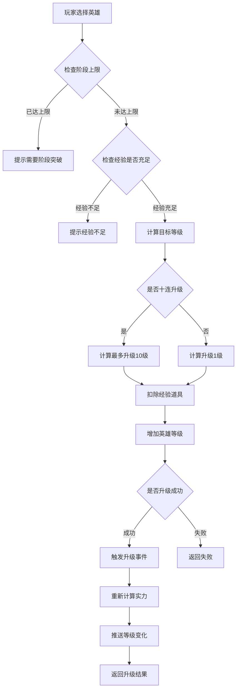
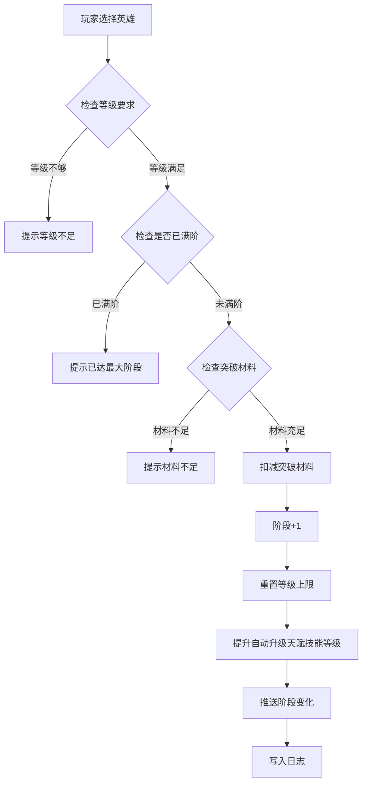
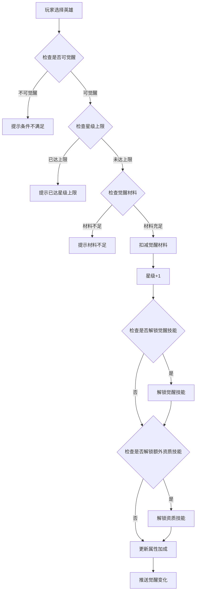
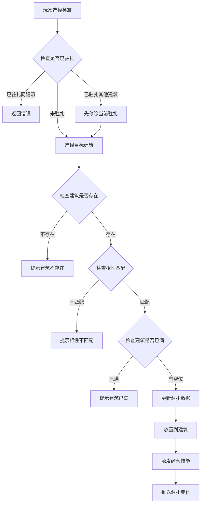
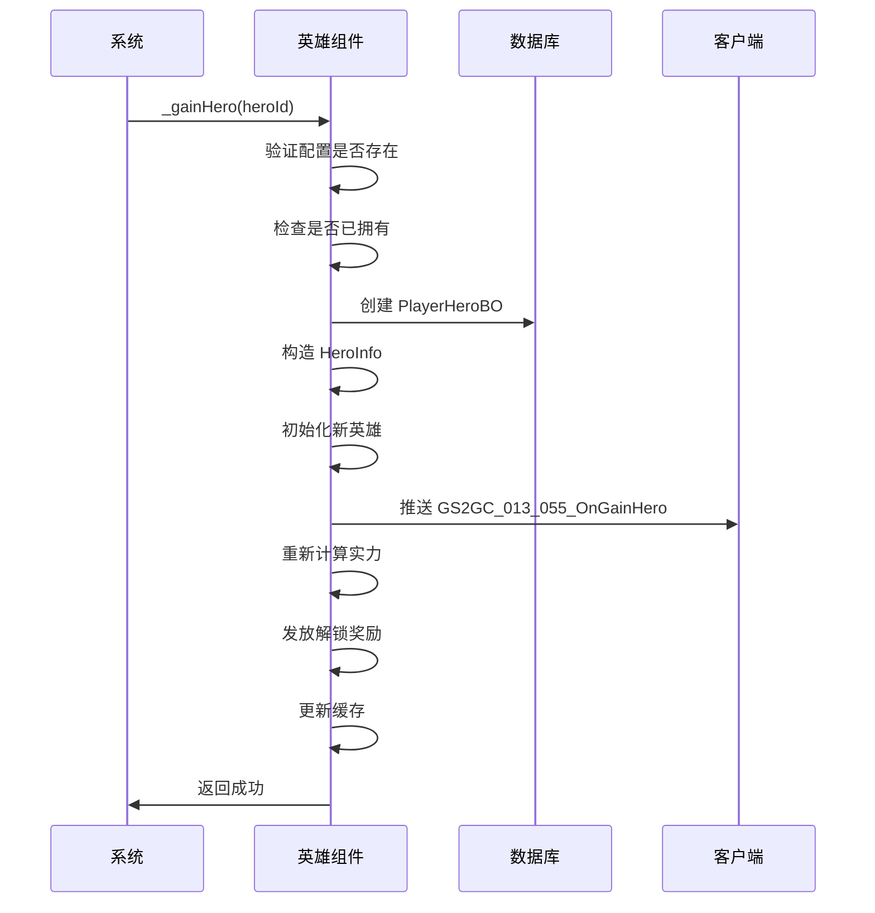
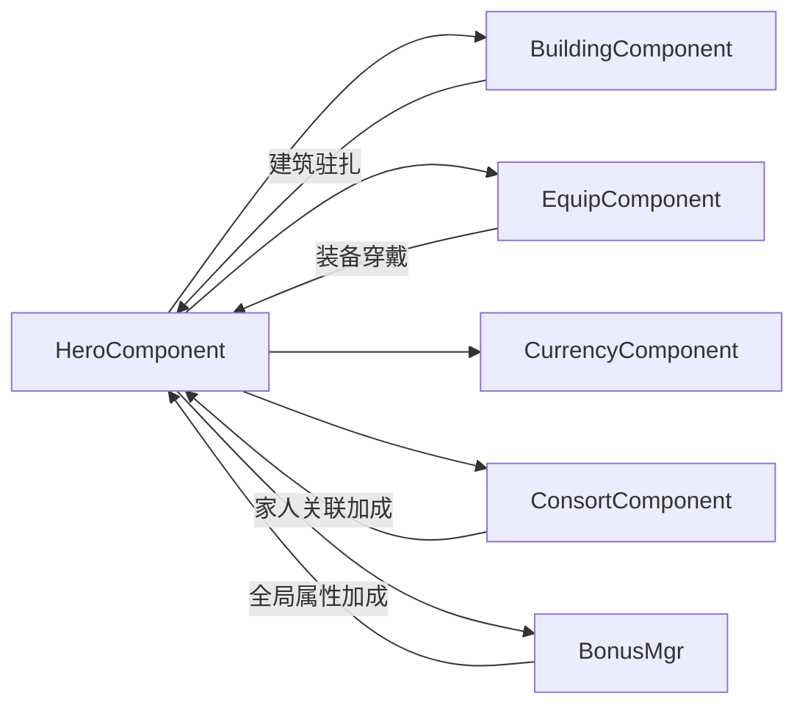

# 英雄模块完整说明

## 一、模块概述

### 1.1 业务背景

英雄模块（又称大臣系统）是 K2C 游戏的核心养成系统之一。玩家通过招募、培养各类英雄（大臣），组建强大的阵容来推进游戏进程。每个英雄拥有独特的技能、皮肤、装备系统，可以在建筑中驻扎工作，为玩家提供资源产出加成。

### 1.2 目标用户

- **游戏玩家**：希望培养强力英雄，提升整体实力
- **策略爱好者**：通过合理搭配英雄套系、装备、技能来优化战斗表现
- **收集玩家**：收集不同品质的英雄和皮肤

### 1.3 核心价值

1. **养成深度**：多维度培养系统（等级、阶段、觉醒、技能、皮肤、装备）
2. **策略性**：套系加成、光环系统、装备搭配
3. **资源产出**：英雄驻扎建筑提供产出加成
4. **社交展示**：英雄皮肤、品质展示玩家成就

---

## 二、系统架构

### 2.1 模块架构图

```mermaid
graph TB
    subgraph 客户端
        A[PlayerHeroComponent] --> B[HeroInfo]
        B --> C[HeroSkinInfoMgr]
        B --> D[HeroTalentSkillInfoMgr]
        B --> E[HeroBusinessSkillInfoMgr]
        B --> F[HeroStarSkillInfoMgr]
        B --> G[HeroHaloInfo]
        B --> H[HeroSuitInfo]
    end

    subgraph 服务端
        I[HeroComponent] --> J[HeroInfo]
        J --> K[HeroSkinMgr]
        J --> L[HeroTalentSkillMgr]
        J --> M[HeroBusinessSkillMgr]
        J --> N[HeroStarSkillMgr]
        J --> O[HeroHaloInfo]
        J --> P[HeroSuitInfo]
        J --> Q[HeroCalculator]
    end

    subgraph 数据存储
        R[(PlayerHeroBO)]
        S[(PlayerHeroSkinBO)]
        T[(PlayerHeroHaloBO)]
        U[(PlayerHeroTalentSkillBO)]
        V[(PlayerHeroBusinessSkillBO)]
    end

    subgraph 配置数据
        W[HeroRefObj]
        X[HeroLevelRefObj]
        Y[HeroStepRefObj]
        Z[HeroStarRefObj]
    end

    A <--> I
    J --> R
    J --> S
    J --> T
    J --> U
    J --> V
    J --> W
    J --> X
    J --> Y
    J --> Z
```



### 2.2 核心概念

| 概念 | 说明 |
|------|------|
| 英雄（大臣） | 玩家可培养的角色单位 |
| 等级 | 英雄的等级，影响基础属性 |
| 阶段 | 决定等级上限，需要突破材料提升 |
| 觉醒星级 | 通过觉醒提升，解锁觉醒技能 |
| 资质技能 | 影响英雄资质值的被动技能 |
| 经营技能 | 影响建筑产出加成的技能 |
| 觉醒技能 | 觉醒解锁的特殊技能 |
| 光环 | 英雄专属的强化系统 |
| 套系 | 多个英雄组成的羁绊系统 |
| 相性 | 决定英雄可入驻的建筑类型 |

---

## 三、功能清单

### 3.1 英雄基础功能

| 功能名称 | 功能描述 | 用户价值 |
|---------|---------|---------|
| 英雄升级 | 消耗经验提升英雄等级 | 提升基础属性 |
| 阶段突破 | 突破等级上限限制 | 解锁更高等级空间 |
| 觉醒升星 | 提升英雄星级 | 解锁觉醒技能、大幅提升属性 |
| 英雄解锁 | 获得新英雄 | 扩充英雄阵容 |

### 3.2 英雄皮肤功能

| 功能名称 | 功能描述 | 用户价值 |
|---------|---------|---------|
| 皮肤解锁 | 解锁英雄新皮肤 | 获得外观变化和资质技能 |
| 皮肤升级 | 提升皮肤等级 | 增强皮肤属性加成 |
| 皮肤切换 | 更换当前穿戴皮肤 | 自定义外观展示 |

### 3.3 英雄技能功能

| 功能名称 | 功能描述 | 用户价值 |
|---------|---------|---------|
| 资质技能升级 | 提升资质技能等级 | 增强英雄基础能力 |
| 经营技能升级 | 提升经营技能等级 | 提升资源产出效率 |
| 觉醒技能解锁 | 通过觉醒解锁特殊技能 | 获得独特战斗能力 |

### 3.4 英雄光环功能

| 功能名称 | 功能描述 | 用户价值 |
|---------|---------|---------|
| 光环解锁 | 解锁英雄专属光环 | 获得光环基础效果 |
| 光环升级 | 提升光环等级 | 增强光环效果和套系加成 |

### 3.5 装备系统功能

| 功能名称 | 功能描述 | 用户价值 |
|---------|---------|---------|
| 装备穿戴 | 英雄穿戴装备 | 获得装备属性加成 |
| 装备卸下 | 英雄卸下装备 | 调整装备配置 |
| 装备升级 | 提升装备等级 | 增强装备属性 |
| 装备觉醒 | 提升装备品质 | 获得更强属性 |
| 装备技能重铸 | 重新随机装备技能 | 优化装备技能配置 |
| 装备分解 | 分解不需要的装备 | 回收资源 |
| 装备锁定 | 锁定重要装备 | 防止误分解 |

### 3.6 建筑驻扎功能

| 功能名称 | 功能描述 | 用户价值 |
|---------|---------|---------|
| 建筑放置英雄 | 将英雄放入建筑工作 | 提供建筑产出加成 |
| 建筑移除英雄 | 将英雄从建筑移出 | 调整英雄配置 |
| 相性匹配 | 根据英雄相性匹配建筑 | 获得额外加成 |

---

## 四、业务流程详解

### 4.1 英雄升级流程



**详细步骤说明**：

1. **前置检查**
   - 验证英雄是否存在（错误码：20011）
   - 验证英雄当前等级是否达到阶段上限（错误码：20001）

2. **资源校验**
   - 根据当前等级查询升级所需经验
   - 检查玩家经验是否充足

3. **执行升级**
   - 扣减玩家经验道具
   - 增加英雄等级
   - 计算是否升级成功

4. **后续处理**
   - 触发升级事件
   - 更新英雄属性值
   - 重新计算英雄实力
   - 推送等级变化通知

### 4.2 英雄阶段突破流程



### 4.3 英雄觉醒流程



### 4.4 英雄驻扎建筑流程



### 4.5 英雄获得流程



---

## 五、关键规则

### 5.1 英雄等级规则

| 规则名称 | 规则说明 |
|----------|----------|
| 等级上限规则 | 英雄等级受阶段限制，每个阶段有对应的等级上限 |
| 升级消耗规则 | 升级消耗经验道具，消耗量随等级递增 |
| 十连升级规则 | 十连升级最多升10级，资源不足或达上限时自动停止 |

### 5.2 英雄阶段规则

| 规则名称 | 规则说明 |
|----------|----------|
| 阶段上限 | 英雄最高可突破至第 10 阶段 |
| 突破条件 | 必须达到当前阶段等级上限才能突破 |
| 突破消耗 | 消耗对应品质的突破材料 |
| 自动升级 | 阶段突破时自动提升天赋技能等级 |

### 5.3 英雄觉醒规则

| 规则名称 | 规则说明 |
|----------|----------|
| 星级上限 | 英雄最高可觉醒至 5 星 |
| 觉醒条件 | 需要满足玩家条件和英雄条件 |
| 技能解锁 | 特定星级解锁对应觉醒技能和额外资质技能 |

### 5.4 装备规则

| 规则名称 | 规则说明 |
|----------|----------|
| 装备槽位 | 每个英雄有固定的装备槽位 |
| 锁定保护 | 锁定的装备无法被分解或穿戴 |
| 穿戴替换 | 穿戴新装备时自动卸下原装备 |

### 5.5 建筑驻扎规则

| 规则名称 | 规则说明 |
|----------|----------|
| 相性系统 | 英雄有相性属性，需匹配建筑相性才能驻扎 |
| 唯一驻扎 | 一个英雄同时只能驻扎一个建筑 |
| 数量限制 | 每个建筑有最大驻扎人数限制 |

---

## 六、模块交互

### 6.1 依赖模块



### 6.2 事件联动

| 事件 | 触发场景 | 联动处理 |
|------|----------|----------|
| 英雄升级 | 升级成功 | 检查解锁经营技能 |
| 阶段突破 | 突破成功 | 自动提升天赋技能等级 |
| 觉醒升星 | 觉醒成功 | 解锁觉醒技能、资质技能 |
| 驻扎建筑 | 驻扎成功 | 触发经营技能效果 |
| 移出建筑 | 移出成功 | 取消经营技能效果 |
| 光环解锁 | 解锁成功 | 添加套系技能等级加成 |

---

## 七、用户故事

### 7.1 新手玩家故事

> 作为一名刚进入游戏的新手玩家，我希望能够快速获得第一个英雄并了解培养方式。游戏在引导任务中赠送了我一个初始英雄，我通过消耗经验将他升级到 10 级，感觉实力提升明显。系统提示我可以进行阶段突破来继续升级，我按照指引完成了第一次突破。

### 7.2 中期玩家故事

> 作为一名游戏进行到中期的玩家，我拥有多个英雄，需要合理分配资源。我发现通过给英雄穿戴装备可以大幅提升实力。我通过副本获取了一件高品质装备，但技能不太理想，于是花费钻石进行了技能重铸，获得了更适合的技能组合。我还把擅长经营的英雄安排到了对应的建筑中驻扎，获得了更高的资源产出。

### 7.3 高级玩家故事

> 作为一名追求极致的高级玩家，我专注于培养主力英雄的觉醒和套装。我通过收集特定套系的英雄来激活套系加成，并且将主力英雄觉醒到满星。每个英雄我都配备了满级满品质的装备，并且精心搭配了装备技能。在竞技场中，我的英雄阵容展现出强大的实力。

---

## 八、示例场景

### 8.1 英雄升级示例

**初始状态**：
- 英雄 ID：10001
- 当前等级：25 级
- 当前阶段：2 阶（等级上限 30）
- 当前实力：15,000

**升级操作**：
- 选择十连升级
- 消耗：经验道具 × 50,000

**结果状态**：
- 升级后等级：30 级（达到阶段上限）
- 升级后实力：18,500
- 系统提示：等级已达到当前阶段上限，请进行阶段突破

### 8.2 装备穿戴示例

**初始状态**：
- 英雄：等级 50，实力 25,000
- 装备：紫色品质武器，攻击力 +500

**穿戴操作**：
- 将武器穿戴到英雄的武器槽位
- 原有蓝色品质武器自动卸下

**结果状态**：
- 英雄实力：27,200（+2,200）
- 武器槽位：紫色武器

### 8.3 英雄驻扎示例

**初始状态**：
- 英雄：相性类型"文官"，经营技能等级 5
- 建筑：书院，相性要求"文官"，基础产出 1,000/小时

**驻扎操作**：
- 将英雄驻扎到书院

**结果状态**：
- 书院产出：1,500/小时（+50% 加成）
- 英雄状态：已驻扎

---

## 九、性能优化

### 9.1 懒计算策略

英雄实力计算采用懒计算策略，当属性变化时不立即计算，而是延迟 100ms 后统一计算，避免频繁计算带来的性能开销。

```java
// 300毫秒间隔执行
_m_lazyPowerCalr = new LazyTaskDealer(new HeroRecalPowerTask(this), 100);
```

### 9.2 批量操作优化

1. **十连升级**：合并数据库更新，减少 IO 次数
2. **批量分解**：统一计算奖励后一次性发放
3. **列表推送**：合并多个变化推送为单条消息

### 9.3 缓存策略

1. **英雄配置缓存**：所有配置表数据在启动时全量加载到内存
2. **英雄实力缓存**：计算后缓存实力值，属性变化时才重新计算
3. **装备索引缓存**：按英雄 ID 建立装备索引，快速查询

---

*文档生成时间: 2026-04-11*
