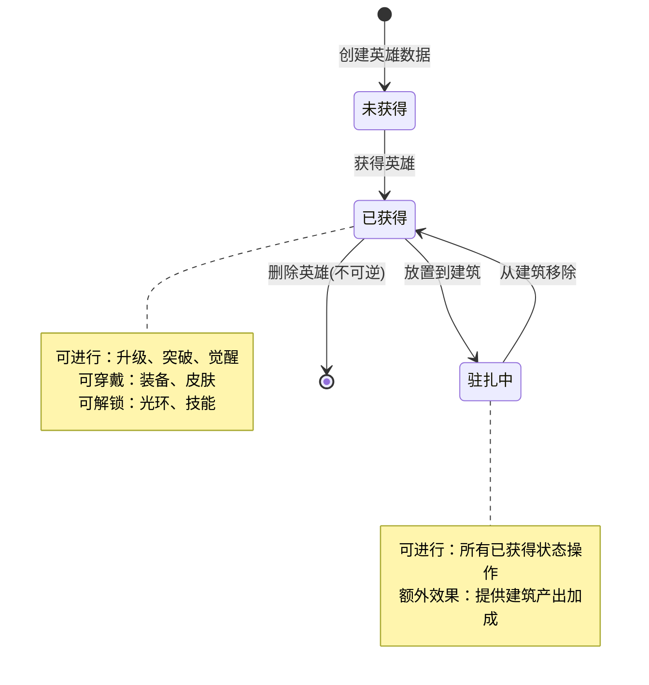
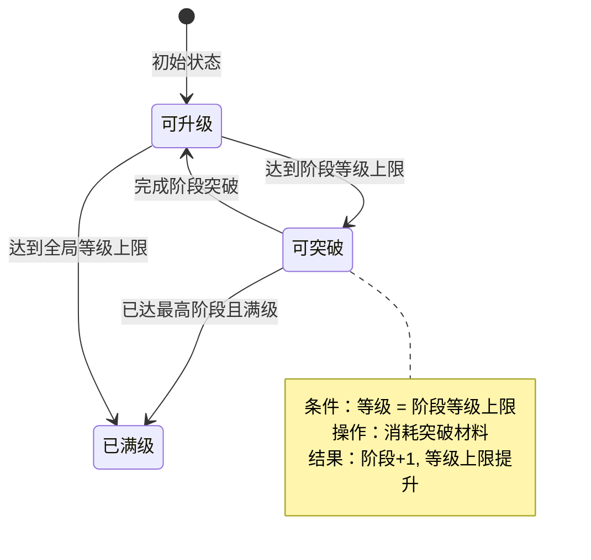
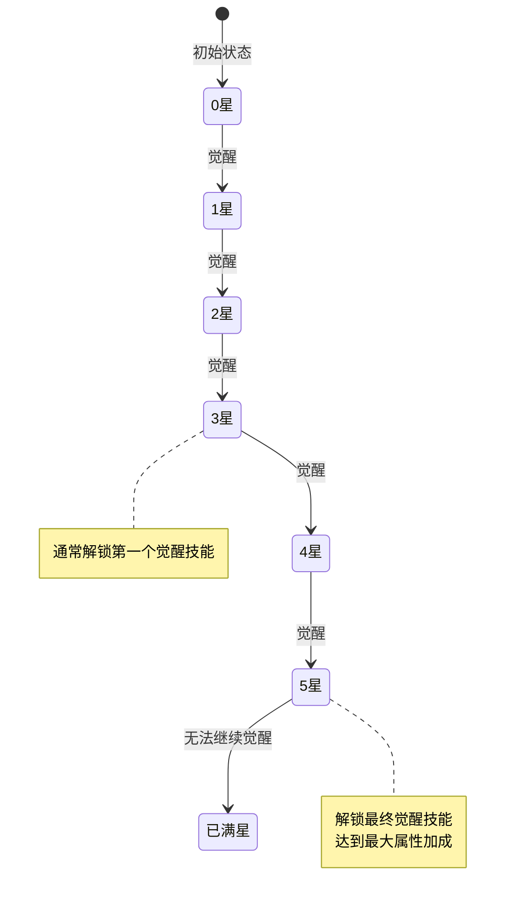
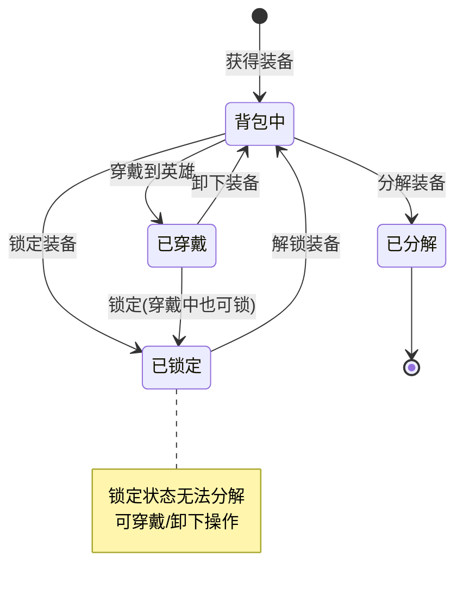
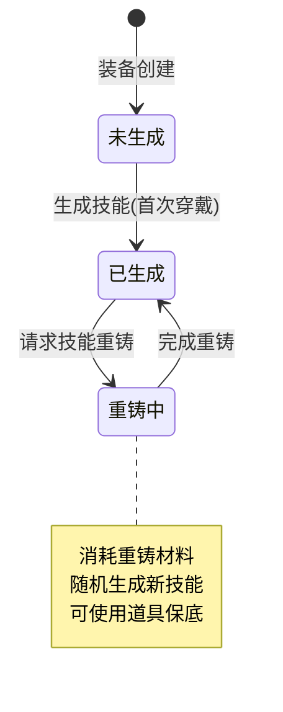
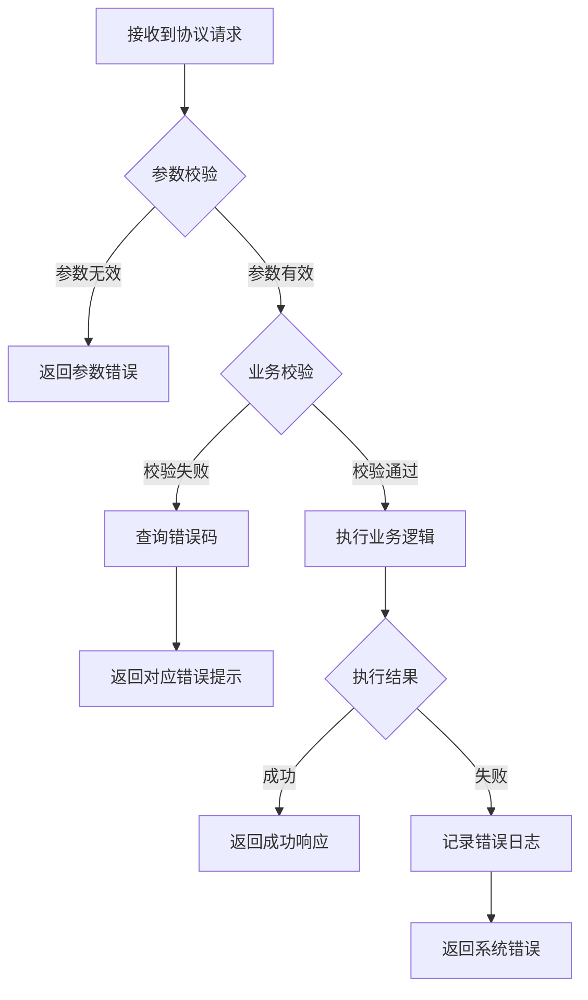

# 英雄模块实现细节

## 一、计算公式

### 1.1 英雄实力计算公式

```
英雄实力 = 基础实力 + 等级加成 + 阶段加成 + 觉醒加成 + 装备加成 + 皮肤加成 + 光环加成 + 额外加成
```

**详细计算**：

```
基础实力 = heroRef.base_power
等级加成 = level × heroRef.level_power_ratio
阶段加成 = step × heroRef.step_power_ratio
觉醒加成 = star × heroRef.star_power_ratio
装备加成 = Σ(equip.base_attr × equip.level_ratio)
皮肤加成 = skinLevel × skinRef.attr_add
光环加成 = haloLevel × haloRef.attr_add
额外加成 = itemAddPower + arenaAddPower + travelAddPower
```

**示例计算**：
```
英雄配置：base_power = 1000, level_power_ratio = 50, step_power_ratio = 500
当前状态：level = 30, step = 2, star = 3
装备加成：武器 2000 + 防具 1500 + 饰品 1000 = 4500
皮肤加成：皮肤等级 5 × 200 = 1000
光环加成：光环等级 3 × 300 = 900
额外加成：道具加成 500 + 竞技场加成 300 = 800

总实力 = 1000 + (30 × 50) + (2 × 500) + (3 × 800) + 4500 + 1000 + 900 + 800
       = 1000 + 1500 + 1000 + 2400 + 4500 + 1000 + 900 + 800
       = 13,100
```

### 1.2 升级消耗公式

```
升级消耗 = base_cost × level_ratio ^ (target_level - current_level)
```

**参数说明**：
- `base_cost`：基础消耗值（配置表）
- `level_ratio`：等级系数（通常为 1.1-1.2）
- `target_level`：目标等级
- `current_level`：当前等级

**示例计算**：
```
base_cost = 100 银两
level_ratio = 1.15
当前等级 = 25
目标等级 = 30

单级消耗：100 × 1.15^5 = 100 × 2.01 ≈ 201 银两
十连升级总消耗：Σ(i=0 to 5) 100 × 1.15^i ≈ 875 银两
```

### 1.3 装备分解产出公式

```
分解产出 = base_reward × quality_ratio × (1 + level_bonus)
```

**参数说明**：
- `base_reward`：基础产出材料数量
- `quality_ratio`：品质系数（白=1, 绿=1.5, 蓝=2, 紫=3, 橙=5）
- `level_bonus`：等级加成（每级 +5%）

**示例计算**：
```
装备品质：紫色（quality_ratio = 3）
装备等级：20 级
base_reward = 10 强化石

分解产出 = 10 × 3 × (1 + 20 × 0.05) = 10 × 3 × 2 = 60 强化石
```

### 1.4 建筑产出加成公式

```
建筑产出加成 = base_output × (1 + hero_bonus_ratio)
hero_bonus_ratio = 经营技能等级 × skill_effect_ratio + 相性加成
```

**示例计算**：
```
建筑基础产出：1000/小时
英雄经营技能等级：5
技能效果系数：0.05
相性匹配加成：0.2（20%）

hero_bonus_ratio = 5 × 0.05 + 0.2 = 0.45
建筑产出加成 = 1000 × (1 + 0.45) = 1450/小时
```

---

## 二、状态机定义

### 2.1 英雄状态机



### 2.2 英雄等级状态机



### 2.3 英雄觉醒状态机



### 2.4 装备状态机



### 2.5 装备技能状态机



---

## 三、数据约束

### 3.1 英雄数据约束

| 字段名 | 数据类型 | 取值范围 | 必填 | 唯一性 | 说明 |
|--------|----------|----------|------|--------|------|
| heroId | long | > 0 | 是 | 是 | 英雄唯一ID，全局唯一 |
| refId | long | > 0 | 是 | 否 | 配置ID，关联 HeroRefObj |
| level | int | 1-100 | 是 | 否 | 等级，不超过阶段上限 |
| step | int | 1-10 | 是 | 否 | 阶段，决定等级上限 |
| star | int | 0-5 | 是 | 否 | 觉醒星级 |
| skinId | long | >= 0 | 是 | 否 | 当前皮肤ID，0表示默认 |
| quality | short | 1-5 | 是 | 否 | 品质：1白,2绿,3蓝,4紫,5橙 |

### 3.2 装备数据约束

| 字段名 | 数据类型 | 取值范围 | 必填 | 唯一性 | 说明 |
|--------|----------|----------|------|--------|------|
| equipId | long | > 0 | 是 | 是 | 装备唯一ID |
| refId | long | > 0 | 是 | 否 | 配置ID |
| level | int | 1-50 | 是 | 否 | 装备等级 |
| quality | int | 1-5 | 是 | 否 | 品质 |
| heroId | long | >= 0 | 是 | 否 | 所属英雄ID，0表示未穿戴 |
| isLock | bool | - | 是 | 否 | 是否锁定 |

### 3.3 英雄技能数据约束

| 字段名 | 数据类型 | 取值范围 | 必填 | 说明 |
|--------|----------|----------|------|------|
| skillId | long | > 0 | 是 | 技能配置ID |
| level | int | 1-20 | 是 | 技能等级 |
| type | int | 1-3 | 是 | 类型：1资质,2经营,3觉醒 |

### 3.4 皮肤数据约束

| 字段名 | 数据类型 | 取值范围 | 必填 | 说明 |
|--------|----------|----------|------|------|
| skinId | long | > 0 | 是 | 皮肤配置ID |
| level | int | 1-10 | 是 | 皮肤等级 |
| unlockTime | long | >= 0 | 是 | 解锁时间戳 |

---

## 四、错误处理策略

### 4.1 英雄模块错误码

| 错误码 | 错误信息 | 处理策略 | 用户提示 |
|--------|----------|----------|----------|
| 20001 | 等级达到当前阶段上限 | 引导玩家进行阶段突破 | "等级已达到当前阶段上限，请先进行阶段突破" |
| 20002 | 骑士升级失败 | 检查资源是否充足，重试 | "升级失败，请稍后重试" |
| 20003 | 骑士等级不够 | 提示所需等级 | "英雄等级不足，需要达到 X 级" |
| 20004 | 骑士已达到最大阶段 | 无需处理 | "英雄已达到最高阶段" |
| 20005 | 骑士技能不存在 | 检查技能配置 | "技能数据异常" |
| 20006 | 骑士星级达到上限 | 无需处理 | "英雄已达到最高星级" |
| 20007 | 骑士经验技能等级达到上限 | 无需处理 | "技能已达到最高等级" |
| 20008 | 大臣没有光环 | 检查英雄配置 | "该英雄没有光环系统" |
| 20009 | 骑士资质技能不存在 | 检查技能配置 | "资质技能不存在" |
| 20010 | 骑士皮肤不存在 | 检查皮肤配置 | "皮肤不存在" |
| 20011 | 骑士不存在 | 检查英雄ID有效性 | "英雄不存在" |
| 20012 | 已拥有骑士皮肤 | 跳过重复解锁 | "已拥有该皮肤" |
| 20013 | 大臣一键升级功能未解锁 | 引导解锁功能 | "一键升级功能尚未解锁" |
| 20014 | 大臣重复解锁光环 | 跳过重复解锁 | "光环已解锁" |
| 20015 | 大臣未驻扎 | 无法执行移除操作 | "英雄当前未驻扎任何建筑" |
| 20016 | 大臣光环尚未解锁 | 引导解锁光环 | "请先解锁光环" |
| 20017 | 大臣已经存在 | 防止重复添加 | "已拥有该英雄" |
| 20018 | 大臣资质技能等级达到上限 | 无需处理 | "技能已达到最高等级" |
| 20019 | 大臣无法驻扎到该相性建筑 | 提示相性要求 | "英雄相性与建筑不匹配" |
| 20020 | 大臣资质技能不支持手动升级 | 说明自动升级机制 | "该技能不支持手动升级" |

### 4.2 装备模块错误码

| 错误码 | 错误信息 | 处理策略 | 用户提示 |
|--------|----------|----------|----------|
| 20021 | 藏品等级已达到最大 | 无需处理 | "装备已达到最高等级" |
| 20022 | 藏品没有被穿戴 | 无法卸下 | "装备未被穿戴" |
| 20023 | 该藏品数量达到上限 | 限制生成 | "该品质装备数量已达上限" |
| 20024 | 藏品不存在 | 检查装备ID | "装备不存在" |
| 20025 | 藏品技能不存在 | 检查技能配置 | "装备技能不存在" |
| 20026 | 藏品重塑失败 | 重试或补偿 | "技能重铸失败，请稍后重试" |
| 20027 | 藏品已锁定 | 引导解锁 | "装备已锁定，请先解锁" |
| 20028 | 藏品已穿戴 | 无法分解 | "装备已穿戴，请先卸下" |

### 4.3 通用错误处理流程



---

## 五、关键代码示例

### 5.1 英雄升级伪代码

```csharp
public Result UpgradeHero(long heroId, bool isTenTimes)
{
    // 1. 获取英雄数据
    HeroInfo hero = heroService.GetHero(heroId);
    if (hero == null)
        return Result.Error(20011, "骑士不存在");

    // 2. 检查等级上限
    HeroStepRefObj stepRef = GetStepRef(hero.step);
    if (hero.level >= stepRef.levelLimit)
        return Result.Error(20001, "等级达到当前阶段上限");

    // 3. 计算升级消耗和次数
    int upgradeCount = isTenTimes ? 10 : 1;
    long totalCost = 0;
    int actualUpgrades = 0;

    for (int i = 0; i < upgradeCount; i++)
    {
        // 检查是否达到上限
        if (hero.level >= stepRef.levelLimit)
            break;

        // 计算单次消耗
        HeroLevelRefObj levelRef = GetLevelRef(hero.level);
        if (playerService.GetResource(ResourceType.Silver) < totalCost + levelRef.cost)
            break;

        totalCost += levelRef.cost;
        actualUpgrades++;
    }

    // 4. 扣除资源
    playerService.CostResource(ResourceType.Silver, totalCost);

    // 5. 增加等级
    hero.level += actualUpgrades;
    heroService.UpdateHero(hero);

    // 6. 重新计算实力
    long newPower = CalculateHeroPower(hero);
    hero.power = newPower;

    // 7. 推送通知
    PushHeroLevelChange(hero);

    return Result.Success(hero);
}
```

### 5.2 装备分解伪代码

```csharp
public Result DisassembleEquips(List<long> equipIds)
{
    List<RewardItem> rewards = new List<RewardItem>();

    foreach (long equipId in equipIds)
    {
        // 1. 获取装备数据
        EquipInfo equip = equipService.GetEquip(equipId);
        if (equip == null)
            return Result.Error(20024, "藏品不存在");

        // 2. 检查是否已穿戴
        if (equip.heroId > 0)
            return Result.Error(20028, "藏品已穿戴");

        // 3. 检查是否锁定
        if (equip.isLock)
            return Result.Error(20027, "藏品已锁定");

        // 4. 计算分解奖励
        EquipRefObj equipRef = GetEquipRef(equip.refId);
        float qualityRatio = GetQualityRatio(equip.quality);
        float levelBonus = 1 + equip.level * 0.05f;

        int materialCount = (int)(equipRef.baseReward * qualityRatio * levelBonus);
        rewards.Add(new RewardItem {
            itemId = MaterialID.StrengthenStone,
            count = materialCount
        });

        // 5. 移除装备
        equipService.RemoveEquip(equipId);
    }

    // 6. 发放奖励
    bagService.AddItems(rewards);

    // 7. 推送通知
    PushEquipRemove(equipIds);
    PushBagChange(rewards);

    return Result.Success(rewards);
}
```

### 5.3 实力计算伪代码

```csharp
public long CalculateHeroPower(HeroInfo hero)
{
    long power = 0;
    HeroRefObj heroRef = GetHeroRef(hero.refId);

    // 基础实力
    power += heroRef.basePower;

    // 等级加成
    power += hero.level * heroRef.levelPowerRatio;

    // 阶段加成
    power += hero.step * heroRef.stepPowerRatio;

    // 觉醒加成
    power += hero.star * heroRef.starPowerRatio;

    // 装备加成
    foreach (EquipInfo equip in GetEquipsByHero(hero.heroId))
    {
        EquipRefObj equipRef = GetEquipRef(equip.refId);
        EquipLevelRefObj levelRef = GetEquipLevelRef(equip.level);
        power += equipRef.baseAttr * levelRef.attrRatio;
    }

    // 皮肤加成
    if (hero.skinId > 0)
    {
        HeroSkinInfo skin = GetSkinInfo(hero.heroId, hero.skinId);
        HeroSkinRefObj skinRef = GetSkinRef(hero.skinId);
        power += skin.level * skinRef.attrAdd;
    }

    // 光环加成
    if (hero.haloInfo != null && hero.haloInfo.level > 0)
    {
        HeroHaloRefObj haloRef = GetHaloRef(heroRef.haloId);
        power += hero.haloInfo.level * haloRef.attrAdd;
    }

    // 额外加成
    power += hero.itemAddPower;
    power += hero.arenaAddPower;
    power += hero.travelAddPower;

    return power;
}
```

### 5.4 英雄驻扎伪代码

```csharp
public Result PlaceHeroToBuilding(long heroId, long buildingId)
{
    // 1. 获取英雄数据
    HeroInfo hero = heroService.GetHero(heroId);
    if (hero == null)
        return Result.Error(20011, "骑士不存在");

    // 2. 检查是否已驻扎
    if (hero.placeInfo != null && hero.placeInfo.buildingId > 0)
        return Result.Error(20015, "大臣未驻扎");

    // 3. 获取建筑数据
    BuildingInfo building = buildingService.GetBuilding(buildingId);
    if (building == null)
        return Result.Error(BuildingErr.BuildingNotExist);

    // 4. 检查相性匹配
    HeroRefObj heroRef = GetHeroRef(hero.refId);
    BuildingRefObj buildingRef = GetBuildingRef(building.refId);
    if (heroRef.specAttrType != buildingRef.specAttrType)
        return Result.Error(20019, "大臣无法驻扎到该相性建筑");

    // 5. 检查建筑容量
    int currentCount = heroService.GetHeroCountInBuilding(buildingId);
    if (currentCount >= buildingRef.maxHeroCount)
        return Result.Error(BuildingErr.BuildingFull);

    // 6. 执行驻扎
    hero.placeInfo = new HeroPlaceInfo {
        buildingId = buildingId,
        placeTime = TimeUtils.Now()
    };
    heroService.UpdateHero(hero);

    // 7. 计算建筑产出加成
    RecalculateBuildingOutput(buildingId);

    // 8. 推送通知
    PushHeroPlaceChange(hero);
    PushBuildingOutputChange(buildingId);

    return Result.Success();
}
```

---

## 六、性能优化建议

### 6.1 缓存策略

1. **英雄配置缓存**：所有配置表数据在启动时全量加载到内存
2. **英雄实力缓存**：计算后缓存实力值，属性变化时才重新计算
3. **装备列表缓存**：按英雄ID建立装备索引，快速查询

### 6.2 批量操作优化

1. **十连升级**：合并数据库更新，减少IO次数
2. **批量分解**：统一计算奖励后一次性发放
3. **列表推送**：合并多个变化推送为单条消息

### 6.3 异步处理

1. **实力计算**：属性变化后异步计算实力
2. **排行榜更新**：实力变化后异步更新排行榜
3. **推送消息**：合并推送，批量发送

---

*文档生成时间: 2026-04-06*
