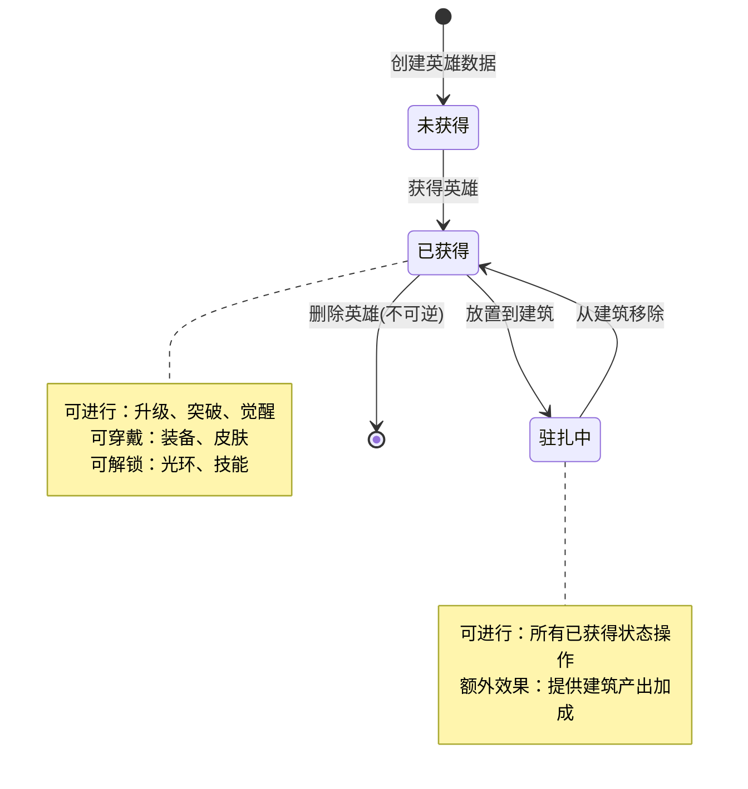
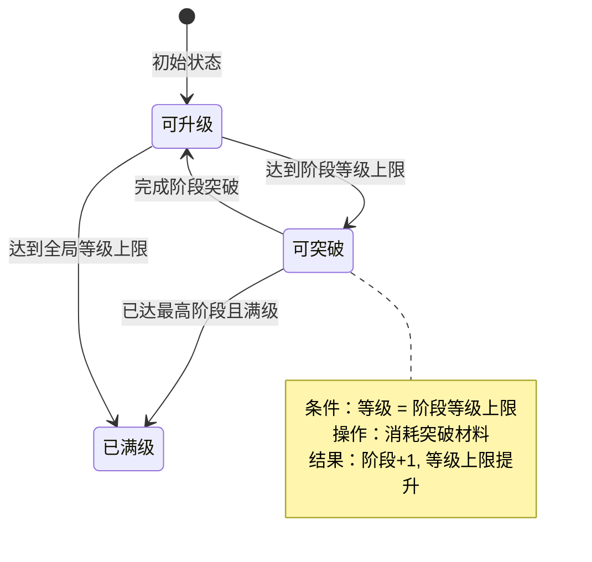
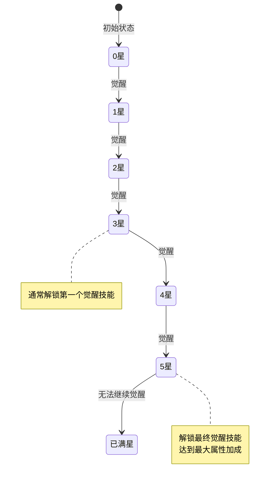
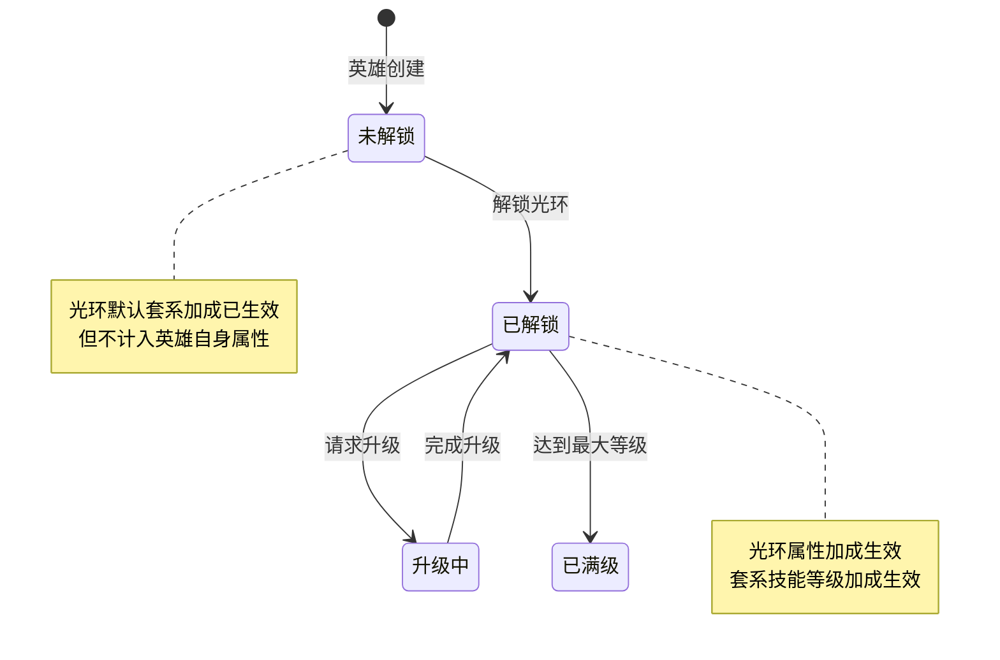
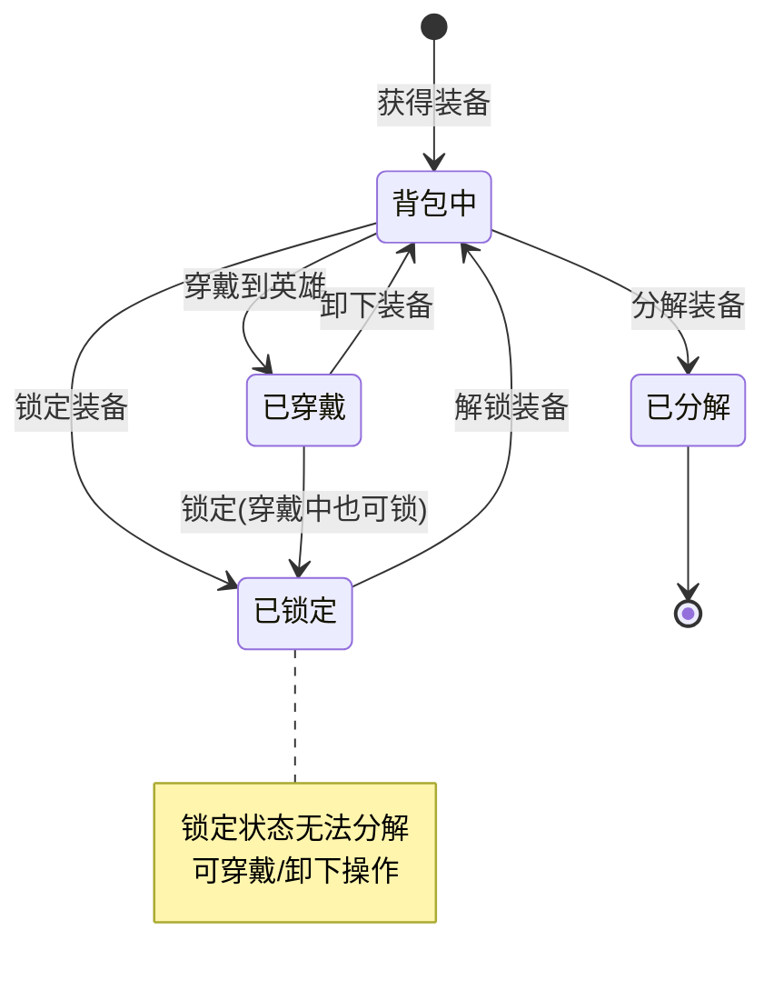
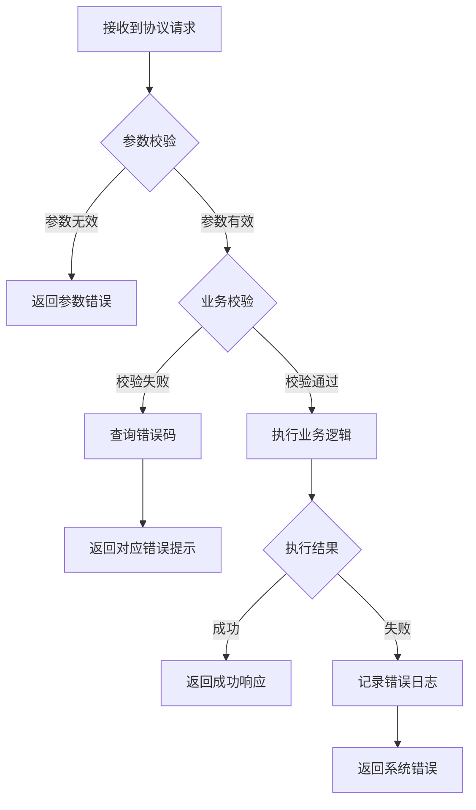

# 英雄模块实现细节

## 一、计算公式

### 1.1 英雄实力计算公式

```
总实力 = floor(基础实力 × (10000 + 万分比加成) / 10000 + 绝对值加成)
```

**详细计算**：

```
基础实力 = 资质值 × 等级系数
资质值 = 英雄自身资质 + 玩家加成资质 + 套系加成资质 + 装备加成资质

万分比加成 = 英雄自身万分比 + 套系万分比 + 玩家bonus万分比 + 家人万分比 + 装备万分比

绝对值加成 = 英雄自身绝对值 + 套系绝对值 + 玩家bonus绝对值 + 家人绝对值 + 道具加成 + 竞技场加成 + 游历加成
```

**示例计算**：
```
资质值：1000
等级系数：50
基础实力 = 1000 × 50 = 50,000

万分比加成：
  - 英雄自身：500
  - 套系：300
  - 玩家bonus：200
  - 家人：100
  - 装备：150
  - 总计：1,250

绝对值加成：
  - 英雄自身：2,000
  - 套系：1,500
  - 玩家bonus：500
  - 家人：300
  - 道具：500
  - 竞技场：300
  - 游历：200
  - 总计：5,300

总实力 = floor(50,000 × (10000 + 1250) / 10000 + 5300)
       = floor(50,000 × 11250 / 10000 + 5300)
       = floor(56,250 + 5,300)
       = 61,550
```

### 1.2 升级消耗公式

```
升级消耗 = base_cost × level_ratio ^ (target_level - current_level)
```

**参数说明**：
- `base_cost`：基础消耗值（配置表）
- `level_ratio`：等级系数（通常为 1.1-1.2）
- `target_level`：目标等级
- `current_level`：当前等级

**示例计算**：
```
base_cost = 100 经验
level_ratio = 1.15
当前等级 = 25
目标等级 = 30

单级消耗：100 × 1.15^5 = 100 × 2.01 ≈ 201 经验
十连升级总消耗：Σ(i=0 to 5) 100 × 1.15^i ≈ 875 经验
```

### 1.3 装备分解产出公式

```
分解产出 = base_reward × quality_ratio × (1 + level_bonus)
```

**参数说明**：
- `base_reward`：基础产出材料数量
- `quality_ratio`：品质系数（白=1, 绿=1.5, 蓝=2, 紫=3, 橙=5）
- `level_bonus`：等级加成（每级 +5%）

**示例计算**：
```
装备品质：紫色（quality_ratio = 3）
装备等级：20 级
base_reward = 10 强化石

分解产出 = 10 × 3 × (1 + 20 × 0.05) = 10 × 3 × 2 = 60 强化石
```

### 1.4 建筑产出加成公式

```
建筑产出加成 = base_output × (1 + hero_bonus_ratio)
hero_bonus_ratio = 经营技能等级 × skill_effect_ratio + 相性加成
```

**示例计算**：
```
建筑基础产出：1000/小时
英雄经营技能等级：5
技能效果系数：0.05
相性匹配加成：0.2（20%）

hero_bonus_ratio = 5 × 0.05 + 0.2 = 0.45
建筑产出加成 = 1000 × (1 + 0.45) = 1450/小时
```

### 1.5 资质技能升级消耗公式

```
单次升级消耗 = base_cost + cost_per_level × (current_level - base_level)
十连升级消耗 = Σ(base_cost + cost_per_level × i) for i in range(upgrade_count)
```

**示例计算**：
```
基础消耗：100
每级递增：10
当前等级：5
基础等级：0

单次升级消耗 = 100 + 10 × 5 = 150
从5级升到15级总消耗 = Σ(100 + 10 × i) for i in 5..14 = 2150
```

---

## 二、状态机定义

### 2.1 英雄状态机



### 2.2 英雄等级状态机



### 2.3 英雄觉醒状态机



### 2.4 光环状态机



### 2.5 装备状态机



---

## 三、数据约束

### 3.1 英雄数据约束

| 字段名 | 数据类型 | 取值范围 | 必填 | 唯一性 | 说明 |
|--------|----------|----------|------|--------|------|
| heroId | long | > 0 | 是 | 是（全局） | 英雄唯一ID |
| refId | long | > 0 | 是 | 否 | 配置ID，关联 HeroRefObj |
| level | int | 1-100 | 是 | 否 | 等级，不超过阶段上限 |
| step | int | 1-10 | 是 | 否 | 阶段，决定等级上限 |
| star | int | 0-5 | 是 | 否 | 觉醒星级 |
| skinId | long | >= 0 | 是 | 否 | 当前皮肤ID，0表示默认 |
| quality | short | 1-5 | 是 | 否 | 品质：1白,2绿,3蓝,4紫,5橙 |

### 3.2 装备数据约束

| 字段名 | 数据类型 | 取值范围 | 必填 | 唯一性 | 说明 |
|--------|----------|----------|------|--------|------|
| equipId | long | > 0 | 是 | 是 | 装备唯一ID |
| refId | long | > 0 | 是 | 否 | 配置ID |
| level | int | 1-50 | 是 | 否 | 装备等级 |
| quality | int | 1-5 | 是 | 否 | 品质 |
| heroId | long | >= 0 | 是 | 否 | 所属英雄ID，0表示未穿戴 |
| isLock | bool | - | 是 | 否 | 是否锁定 |

### 3.3 英雄技能数据约束

| 字段名 | 数据类型 | 取值范围 | 必填 | 说明 |
|--------|----------|----------|------|------|
| skillId | long | > 0 | 是 | 技能配置ID |
| level | int | 1-20 | 是 | 技能等级 |
| type | int | 1-3 | 是 | 类型：1资质,2经营,3觉醒 |

### 3.4 皮肤数据约束

| 字段名 | 数据类型 | 取值范围 | 必填 | 说明 |
|--------|----------|----------|------|------|
| skinId | long | > 0 | 是 | 皮肤配置ID |
| level | int | 1-10 | 是 | 皮肤等级 |
| unlockTime | long | >= 0 | 是 | 解锁时间戳 |

---

## 四、错误处理策略

### 4.1 英雄模块错误码

| 错误码 | 错误信息 | 处理策略 | 用户提示 |
|--------|----------|----------|----------|
| 20001 | HERO_REACH_CURRENT_STEP_LIMIT | 引导玩家进行阶段突破 | "等级已达到当前阶段上限，请先进行阶段突破" |
| 20002 | HERO_UPGRADE_FAIL | 检查资源是否充足，重试 | "升级失败，请稍后重试" |
| 20003 | HERO_LEVEL_NOT_ENOUGH | 提示所需等级 | "英雄等级不足，需要达到 X 级" |
| 20004 | HERO_STEP_IS_MAX | 无需处理 | "英雄已达到最高阶段" |
| 20005 | HERO_SKILL_NOT_EXIST | 检查技能配置 | "技能数据异常" |
| 20006 | HERO_STAR_REACH_MAX | 无需处理 | "英雄已达到最高星级" |
| 20007 | HERO_EXP_SKILL_LEVEL_REACH_MAX | 无需处理 | "技能已达到最高等级" |
| 20008 | HERO_HALO_NOT_FOUND | 检查英雄配置 | "该英雄没有光环系统" |
| 20009 | HERO_TALENT_SKILL_NOT_EXIST | 检查技能配置 | "资质技能不存在" |
| 20010 | HERO_SKIN_NOT_EXIST | 检查皮肤配置 | "皮肤不存在" |
| 20011 | HERO_NOT_EXIST | 检查英雄ID有效性 | "英雄不存在" |
| 20012 | HERO_SKIN_ALREADY_OWN | 跳过重复解锁 | "已拥有该皮肤" |
| 20013 | HERO_ONE_CLICK_UPGRADE_NOT_UNLOCK | 引导解锁功能 | "一键升级功能尚未解锁" |
| 20014 | HERO_HALO_UNLOCK_REPEAT | 跳过重复解锁 | "光环已解锁" |
| 20015 | HERO_NOT_PLACE | 无法执行移除操作 | "英雄当前未驻扎任何建筑" |
| 20016 | HERO_HALO_NOT_UNLOCK | 引导解锁光环 | "请先解锁光环" |
| 20017 | HERO_ALREADY_EXISTED | 防止重复添加 | "已拥有该英雄" |
| 20018 | HERO_TALENT_SKILL_LEVEL_REACH_MAX | 无需处理 | "技能已达到最高等级" |
| 20019 | HERO_CANT_PLACE_TO_THIS_ATTR_BUILDING | 提示相性要求 | "英雄相性与建筑不匹配" |
| 20020 | HERO_TALENT_SKILL_NOT_SUPPORT_MANUAL_UPGRADE | 说明自动升级机制 | "该技能不支持手动升级" |

### 4.2 装备模块错误码

| 错误码 | 错误信息 | 处理策略 | 用户提示 |
|--------|----------|----------|----------|
| 20021 | EQUIP_LEVEL_REACH_MAX | 无需处理 | "装备已达到最高等级" |
| 20022 | EQUIP_NOT_WEARING | 无法卸下 | "装备未被穿戴" |
| 20023 | EQUIP_COUNT_REACH_LIMIT | 限制生成 | "该品质装备数量已达上限" |
| 20024 | EQUIP_NOT_EXIST | 检查装备ID | "装备不存在" |
| 20025 | EQUIP_SKILL_NOT_EXIST | 检查技能配置 | "装备技能不存在" |
| 20026 | EQUIP_REBUILD_FAIL | 重试或补偿 | "技能重铸失败，请稍后重试" |
| 20027 | EQUIP_IS_LOCK | 引导解锁 | "装备已锁定，请先解锁" |
| 20028 | EQUIP_IS_WEARING | 无法分解 | "装备已穿戴，请先卸下" |

### 4.3 通用错误处理流程



---

## 五、关键代码示例

### 5.1 英雄升级（服务端 Java）

```java
public Result upgrade(boolean _isTen, NPPlayerContext _context)
{
    lock();
    try
    {
        // 当前的阶段配置
        RefHeroStep heroStepRef = getHeroStepRef();
        if (heroStepRef == null)
            return CommErr.REF_NOT_FOUND;

        int heroLevelLimit = heroStepRef.level_limit;
        int curLevel = getLevel();

        // 判断等级是否达到当前等级上限
        if (heroLevelLimit <= curLevel)
            return HeroErr.HERO_REACH_CURRENT_STEP_LIMIT;

        // 玩家当前的银币数量
        long expCount = _m_comp.getUserData().getCurrencyComponent()
            .getItemCount(ECurrency.HERO_EXP.ordinal());
        if (expCount <= 0)
            return CommErr.ITEM_NOT_ENOUGH;

        // 计算目标等级,限制到上限范围
        int targetLevel = Math.min(_isTen ? (curLevel + 10) : (curLevel + 1), heroLevelLimit);

        // 计算升级到目标等级所需要的经验
        WCGPair<RefHeroLevel, Long> calResult = RefHeroLevel.getMgr()
            .calculateLevelUpNeedExp(curLevel, targetLevel, expCount);
        if (calResult.first == null)
            return HeroErr.HERO_UPGRADE_FAIL;

        // 尝试消耗银币
        boolean isSuccess = _m_comp.getUserData().spendItem(
            ENPItemType.CURRENCY, ECurrency.HERO_EXP.ordinal(), calResult.second, _context);
        if (!isSuccess)
            return CommErr.CONSUME_FAIL;

        // 增加经验
        _setLevel(calResult.first, _context);

        return Result.SUCC;
    } finally
    {
        unlock();
    }
}
```

### 5.2 英雄觉醒（服务端 Java）

```java
public Result improveStar(NPPlayerContext _context)
{
    lock();
    try
    {
        // 判断是否可以升星
        if (!_m_ref.can_star_upgrade)
            return HeroErr.HERO_STAR_REACH_MAX;

        if (_m_starRef == null)
            return CommErr.REF_NOT_FOUND;

        // 查找下一等级配置
        RefHeroStar refNextStar = RefHeroStar.getByGroupAndStar(_m_ref.hero_star_group_id, getStar() + 1);
        if (refNextStar == null)
            return HeroErr.HERO_STAR_REACH_MAX;

        // 判断条件是否满足
        if (!NPPlayerConditionDealerMgr.IsEnable(_m_starRef.upgrade_player_condition, getUserdata(), null))
            return CommErr.CONDITION_NOT_ENABLE;

        if (!HeroConditionDealerMgr.IsEnable(_m_starRef.upgrade_condition, this, null))
            return CommErr.CONDITION_NOT_ENABLE;

        // 检查消耗
        List<NPCommonCostItem> upgradeCost = _m_starRef.upgrade_cost;
        boolean hasItem = _m_comp.getUserData().hasCostItemList(upgradeCost);
        if (!hasItem)
            return CommErr.CONSUME_FAIL;

        // 尝试消耗
        boolean isSuccess = _m_comp.getUserData().spendCostItemList(upgradeCost, _context);
        if (!isSuccess)
            return CommErr.CONSUME_FAIL;

        // 更新星级
        getBo().saveStar(_m_comp.getUSServer().getBM(), refNextStar.star);
        RefHeroStar preStarRef = _m_starRef;
        _m_starRef = refNextStar;

        // 推送变更
        onStarChg(_context);

        // 重新计算大臣属性
        _m_attrPropertyContainer.replaceModifier(
            preStarRef == null ? null : preStarRef.self_attr_prop_modifier,
            _m_starRef.self_attr_prop_modifier);

        // 检查星级技能解锁
        getStarSkillMgr().onStarLevelChg(getStar(), _context);
        // 检测资质技能的处理
        getTalentSkillMgr().checkUnlockExtraSkill(_context);

        return Result.SUCC;
    } finally
    {
        unlock();
    }
}
```

### 5.3 光环升级（服务端 Java）

```java
public Result upgrade(NPPlayerContext _context)
{
    if (_m_bo == null)
        return HeroErr.HERO_HALO_NOT_UNLOCK;

    // 查询是否有下一级
    RefHeroHaloLevel nextLevelRef = _m_ref.getLevelMapMgr().getLevelData(_m_levelRef.level + 1);
    if (null == nextLevelRef)
        return CommErr.REF_NOT_FOUND;

    // 消耗道具
    if (!_m_levelRef.upgrade_cost.isEmpty() && !getUserdata().spendItem(_m_levelRef.upgrade_cost, _context))
        return CommErr.CONSUME_FAIL;

    // 设置为下一等级
    return _setLevel(nextLevelRef, _context);
}

protected Result _setLevel(RefHeroHaloLevel _levelRef, NPPlayerContext _context)
{
    if (_levelRef == null)
        return CommErr.REF_NOT_FOUND;

    if (_m_levelRef == _levelRef)
        return Result.SUCC;

    RefHeroHaloLevel preLevelRef = _m_levelRef;
    _m_levelRef = _levelRef;
    _m_bo.saveLevel(getUserdata().getUSServer().getBM(), _levelRef.level);

    // 向大臣增加属性
    getHeroInfo().getPropertyContainer().replaceModifier(
        null == preLevelRef ? null : preLevelRef.self_attr_prop_modifier,
        _m_levelRef.self_attr_prop_modifier);

    // 推送变更
    onHaloChg();

    // 更新套系技能等级
    if (null != getHeroInfo().getSuitInfo())
    {
        // 移除旧技能
        if (null != preLevelRef)
        {
            for (WCGPairLong skillInfoPair : preLevelRef.halo_suit_skill_level_list)
            {
                if (skillInfoPair.second() == 0)
                    continue;
                getHeroInfo().getSuitInfo().removeSkillLevel(skillInfoPair.first(), (int) skillInfoPair.second());
            }
        }
        // 添加新技能
        if (null != _m_levelRef)
        {
            for (WCGPairLong skillInfoPair : _m_levelRef.halo_suit_skill_level_list)
            {
                if (skillInfoPair.second() == 0)
                    continue;
                getHeroInfo().getSuitInfo().addSkillLevel(skillInfoPair.first(), (int) skillInfoPair.second());
            }
        }
        getHeroInfo().getSuitInfo().onSuitChg();
    }

    return Result.SUCC;
}
```

### 5.4 实力计算（服务端 Java）

```java
public static long calPower(HeroInfo _heroInfo, StringBuilder _sb)
{
    if (null == _heroInfo)
        return 0;

    // 1. 计算基础实力
    RefHeroLevel heroLevelRef = _heroInfo.getHeroLevelRef();
    long basicPower = calTalent(_heroInfo, _sb) * (heroLevelRef == null ? 0 : heroLevelRef.level_ratio);

    // 2. 计算万分比加成
    long heroPowerPerAddition = _heroInfo.getPropertyContainer().getValue(EBasicAttrType.POWER_PER);
    long suitPowerPerAddition = 0;
    if (_heroInfo.getSuitInfo() != null)
        suitPowerPerAddition = _heroInfo.getSuitInfo().getAttrContainer().getValue(EBasicAttrType.POWER_PER);
    long playerPowerPerAddition = _heroInfo.getPlayerBonusAddValue(EBonusPropertyType.POWER_PER);
    long consortPowerPerAddition = calConsortAdd(_heroInfo, EBasicAttrType.POWER_PER);
    long equipPowerPerAddition = _heroInfo.getEquipPowerPer();
    long powerPerAddition = heroPowerPerAddition + suitPowerPerAddition +
        playerPowerPerAddition + consortPowerPerAddition + equipPowerPerAddition;

    // 3. 获取绝对值加成
    long heroPowerAddition = _heroInfo.getPropertyContainer().getValue(EBasicAttrType.POWER);
    long suitPowerAddition = 0;
    if (_heroInfo.getSuitInfo() != null)
        suitPowerAddition = _heroInfo.getSuitInfo().getAttrContainer().getValue(EBasicAttrType.POWER);
    long playerPowerAddition = _heroInfo.getPlayerBonusAddValue(EBonusPropertyType.POWER);
    long consortPowerAddition = calConsortAdd(_heroInfo, EBasicAttrType.POWER);
    long itemPowerAddition = _heroInfo.getItemAddPower();
    long arenaPowerAddition = _heroInfo.getArenaAddPower();
    long travelPowerAddition = _heroInfo.getTravelAddPower();
    long powerAddition = heroPowerAddition + suitPowerAddition + playerPowerAddition +
        consortPowerAddition + itemPowerAddition + arenaPowerAddition + travelPowerAddition;

    // 4. 返回累加值
    long totalPower = (long) Math.ceil((double) basicPower * (10000 + powerPerAddition) / 10000 + powerAddition);
    return totalPower;
}
```

### 5.5 英雄驻扎建筑（服务端 Java）

```java
public Result placeToBuilding(long _buildingId, NPPlayerContext _context)
{
    // 检查是否已经驻扎
    if (_m_buildingInfo != null)
    {
        if (_m_buildingInfo.getBuildingId() == _buildingId)
            return BuildingErr.BUILDING_EXISTED;
        // 从建筑上移除大臣
        removeFormBuilding(_context);
    }

    // 检查建筑是否存在
    BuildingInfo buildingInfo = getUserdata().getBuildingComponent().lookupBuilding(_buildingId);
    if (buildingInfo == null)
        return BuildingErr.BUILDING_NOT_EXIST;

    // 检查建筑是否已经满了
    if (buildingInfo.isFullHero())
        return BuildingErr.BUSINESS_HERO_FULL;

    // 检查大臣是否可以驻扎到该属性建筑上
    if (!_m_ref.settled_building_attr_type_list.contains(buildingInfo.getAttr()))
        return HeroErr.HERO_CANT_PLACE_TO_THIS_ATTR_BUILDING;

    _m_bo.setBuildingId(_m_comp.getUSServer().getBM(), _buildingId);
    _m_bo.setSerial(_m_comp.getUSServer().getBM(),
        getUserdata().getUSServer().getUSParams().incParam(EUsParam.HERO_PLACE_SERIAL, 1));
    _m_bo.saveAllMarked(_m_comp.getUSServer().getBM());

    _m_buildingInfo = buildingInfo;

    // 放置到建筑上处理
    buildingInfo.placeHero(this);
    _onPlaceToBuilding();

    // 驻扎建筑变更推送
    onHeroPlaceBuildingChg(_context);

    return Result.SUCC;
}
```

---

## 六、性能优化策略

### 6.1 懒计算策略

英雄实力计算采用延迟执行策略，避免频繁计算：

```java
// 300毫秒间隔执行
_m_lazyPowerCalr = new LazyTaskDealer(new HeroRecalPowerTask(this), 100);

// 属性变化时触发懒计算
public void recalHero()
{
    _m_lazyPowerCalr.setNeedDeal();
}
```

### 6.2 缓存策略

| 缓存类型 | 说明 | 刷新时机 |
|----------|------|----------|
| 英雄配置缓存 | 所有配置表数据在启动时全量加载 | 游戏启动 |
| 英雄实力缓存 | 计算后缓存实力值 | 属性变化时重新计算 |
| 装备索引缓存 | 按英雄ID建立装备索引 | 装备穿戴/卸下 |
| 套系技能缓存 | 套系技能等级缓存 | 光环升级/套系变更 |

### 6.3 批量操作优化

```java
// 批量分解装备
public Result DisassembleEquips(List<long> equipIds)
{
    List<RewardItem> rewards = new List<RewardItem>();

    foreach (long equipId in equipIds)
    {
        // 1. 验证装备
        EquipInfo equip = equipService.GetEquip(equipId);
        if (equip == null)
            return Result.Error(20024, "藏品不存在");

        // 2. 批量检查
        if (equip.heroId > 0)
            return Result.Error(20028, "藏品已穿戴");
        if (equip.isLock)
            return Result.Error(20027, "藏品已锁定");

        // 3. 计算奖励（不立即发放）
        rewards.Add(CalculateDisassembleReward(equip));
        equipService.RemoveEquip(equipId);
    }

    // 4. 一次性发放奖励
    bagService.AddItems(rewards);

    // 5. 批量推送
    PushEquipRemove(equipIds);
    PushBagChange(rewards);

    return Result.Success(rewards);
}
```

### 6.4 异步处理

| 异步任务 | 触发时机 | 执行间隔 |
|----------|----------|----------|
| 实力计算 | 属性变化后 | 100ms |
| 排行榜更新 | 实力变化后 | 异步推送 |
| 推送消息合并 | 多个变化时 | 批量发送 |

---

*文档生成时间: 2026-04-11*