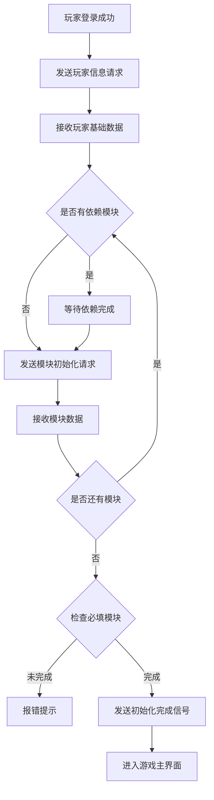
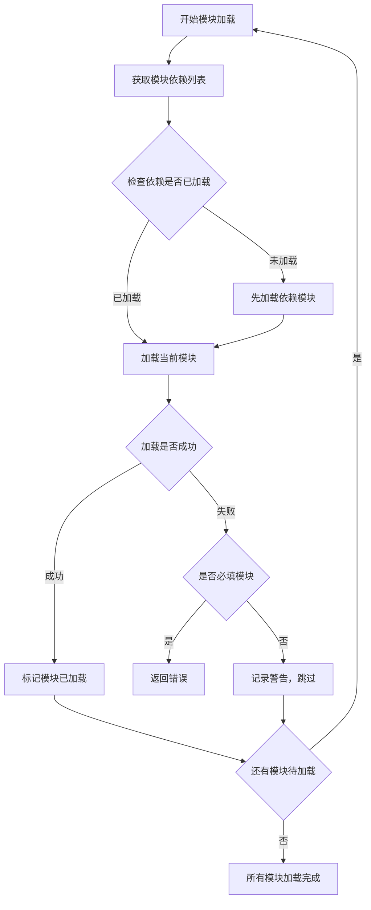
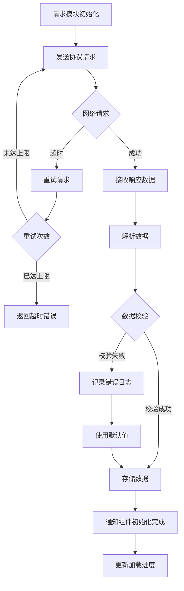
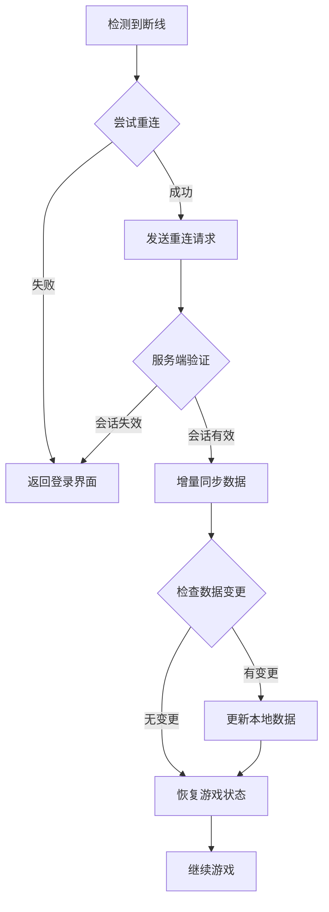

# 初始化模块完整说明

## 一、模块概述

### 1.1 业务背景

初始化模块是 K2C 游戏的核心基础设施模块，负责玩家登录时所有游戏数据的同步。作为客户端与服务端数据交互的起点，该模块确保玩家进入游戏时能够获取完整、一致的游戏状态数据，为其他所有模块的正常运行提供基础保障。

### 1.2 目标用户

- **所有玩家**：每次登录都需要通过初始化模块同步数据
- **开发人员**：新增模块时需要扩展初始化协议
- **运维人员**：通过初始化流程监控登录性能

### 1.3 核心价值

1. **数据同步**：确保客户端与服务端数据一致性
2. **模块解耦**：统一管理各模块的初始化流程
3. **性能优化**：支持分批加载和缓存机制
4. **用户体验**：优化加载流程，减少等待时间

---

## 二、功能清单

### 2.1 核心数据初始化

| 功能名称 | 功能描述 | 用户价值 |
|---------|---------|---------|
| 玩家基础信息 | 同步玩家等级、经验、VIP等基础数据 | 基础身份确认 |
| 货币数据 | 同步各类货币余额 | 资源状态展示 |
| 背包数据 | 同步背包物品列表 | 物品管理 |
| 英雄数据 | 同步英雄列表和属性 | 战斗准备 |

### 2.2 玩法数据初始化

| 功能名称 | 功能描述 | 用户价值 |
|---------|---------|---------|
| 章节数据 | 同步章节进度和解锁状态 | 剧情延续 |
| 任务数据 | 同步任务列表和进度 | 目标追踪 |
| 成就数据 | 同步成就完成情况 | 成就展示 |
| 活动数据 | 同步活动参与状态 | 活动参与 |

### 2.3 社交数据初始化

| 功能名称 | 功能描述 | 用户价值 |
|---------|---------|---------|
| 好友数据 | 同步好友列表和状态 | 社交互动 |
| 公会数据 | 同步公会信息 | 公会功能 |
| 邮件数据 | 同步邮件列表 | 消息接收 |

### 2.4 系统数据初始化

| 功能名称 | 功能描述 | 用户价值 |
|---------|---------|---------|
| 功能解锁 | 同步功能解锁状态 | 功能可用性 |
| 外观数据 | 同步头像、称号等 | 个性化展示 |
| 配置数据 | 同步客户端配置 | 系统设置 |

---

## 三、业务流程详解

### 3.1 完整初始化流程



**详细步骤说明**：

1. **登录验证**
   - 完成账号登录
   - 获取服务器列表
   - 选择服务器连接

2. **核心数据加载**
   - 请求玩家基础信息
   - 加载货币数据
   - 加载背包数据

3. **模块数据加载**
   - 按依赖关系排序模块
   - 并行加载无依赖模块
   - 串行加载有依赖模块

4. **完成检查**
   - 验证必填模块是否加载完成
   - 处理加载失败的模块
   - 通知所有模块初始化完成

### 3.2 模块依赖加载流程



**详细步骤说明**：

1. **依赖解析**
   - 解析模块依赖关系图
   - 拓扑排序确定加载顺序
   - 检测循环依赖

2. **并行加载**
   - 无依赖模块并行加载
   - 使用线程池控制并发数
   - 超时控制

3. **失败处理**
   - 必填模块失败则中断初始化
   - 可选模块失败则跳过并记录
   - 提供重试机制

### 3.3 单个模块初始化流程



**详细步骤说明**：

1. **协议发送**
   - 构造请求协议
   - 设置超时时间
   - 注册回调处理器

2. **数据接收**
   - 接收服务端响应
   - 解析协议数据
   - 校验数据完整性

3. **数据处理**
   - 存储到本地组件
   - 触发数据变更事件
   - 更新UI显示

### 3.4 断线重连初始化流程



---

## 四、关键规则

### 4.1 模块加载顺序规则

1. **核心优先**
   - PlayerInfo 必须最先加载
   - Currency 必须在 PlayerInfo 之后
   - Bag 必须在 Currency 之后

2. **依赖关系**
   - Hero 依赖 PlayerInfo
   - Quest 依赖 PlayerInfo、Hero
   - Achieve 依赖 PlayerInfo、Quest

3. **并行规则**
   - 无依赖关系的模块可并行加载
   - 同一层级的模块并发加载
   - 控制最大并发数为5

### 4.2 必填模块规则

| 模块ID | 模块名称 | 是否必填 | 失败处理 |
|--------|----------|----------|----------|
| 001 | PlayerInfo | 是 | 中断初始化 |
| 003 | CurrencyList | 是 | 中断初始化 |
| 007 | BagItemList | 是 | 中断初始化 |
| 012 | HeroInit | 是 | 中断初始化 |
| 018 | ActivityList | 否 | 跳过加载 |
| 036 | QuestInit | 否 | 跳过加载 |
| 050 | AchieveInit | 否 | 跳过加载 |

### 4.3 缓存规则

1. **数据缓存**
   - 初始化数据缓存5分钟
   - 短时间内重登使用缓存
   - 超时后重新请求服务端

2. **增量同步**
   - 记录上次同步时间戳
   - 只同步变更数据
   - 减少网络传输量

### 4.4 超时规则

| 操作类型 | 超时时间 | 重试次数 |
|----------|----------|----------|
| 核心数据请求 | 10秒 | 3次 |
| 模块数据请求 | 15秒 | 2次 |
| 批量请求 | 30秒 | 1次 |

---

## 五、用户故事

### 5.1 新玩家故事

> 作为一名新玩家，我首次进入游戏时需要创建角色。初始化模块为我加载了初始资源、新手英雄和引导数据。几秒钟后，我看到了游戏主界面，开始了我的冒险之旅。

### 5.2 老玩家故事

> 作为一名老玩家，我每天都会登录游戏。初始化模块快速同步了我的数据，包括最新的任务进度、好友状态和公会消息。我的数据被缓存了，所以重新登录很快就能进入游戏。

### 5.3 网络不稳定玩家故事

> 作为一名网络不稳定的玩家，我在地铁上玩游戏经常断线。初始化模块的断线重连功能让我能够在网络恢复后快速回到游戏，增量同步确保我不会丢失进度。

---

## 六、示例

### 6.1 初始化请求示例

**请求玩家信息**：
```
协议: GC2GS_002_001_ReqPlayerInfo
参数: 无
```

**响应数据**：
```
playerId: 20001
playerName: 剑舞春秋
level: 45
exp: 12500
vipLevel: 5
createTime: 2025-01-01 10:00:00
lastLoginTime: 2026-04-07 09:30:00
```

### 6.2 模块加载顺序示例

```
初始化序列:
1. PlayerInfo (核心, 必填)
2. CurrencyList (核心, 必填)
3. [并行] BagItemList, HeroInit, PlayerSkinInit
4. [并行] QuestInit, AchieveInit, ActivityList
5. [并行] FriendInit, GuildInit, MailStatInfo
6. 其他可选模块...
```

### 6.3 初始化耗时统计示例

| 模块名称 | 请求时间 | 响应时间 | 耗时(ms) |
|----------|----------|----------|----------|
| PlayerInfo | 09:30:00.000 | 09:30:00.085 | 85 |
| CurrencyList | 09:30:00.086 | 09:30:00.142 | 56 |
| HeroInit | 09:30:00.143 | 09:30:00.298 | 155 |
| QuestInit | 09:30:00.299 | 09:30:00.387 | 88 |
| 总耗时 | - | - | 387ms |

---

*文档生成时间: 2026-04-07*
