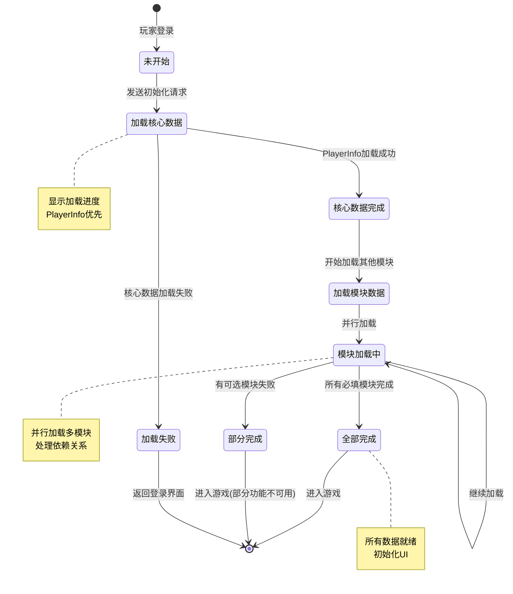
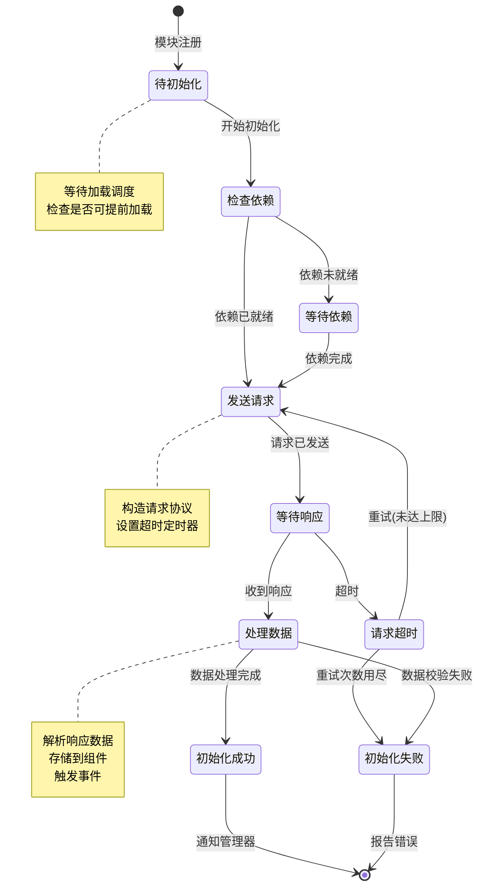
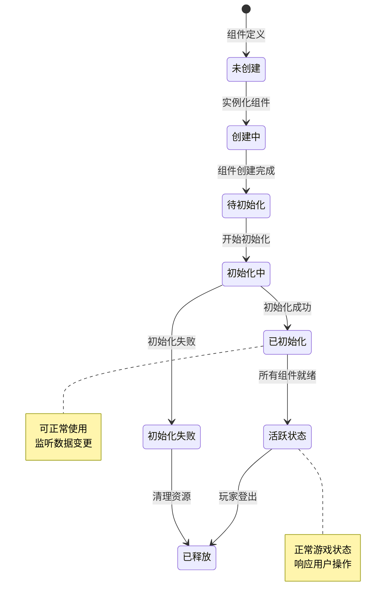
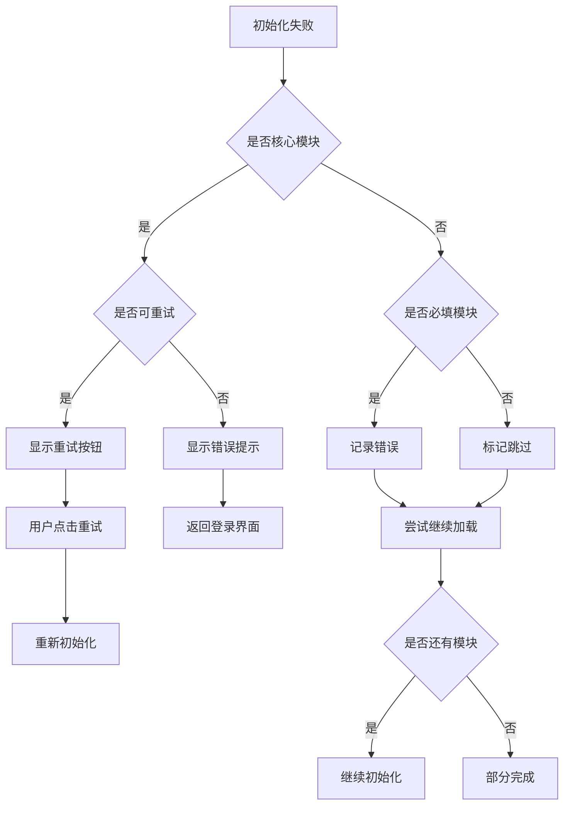
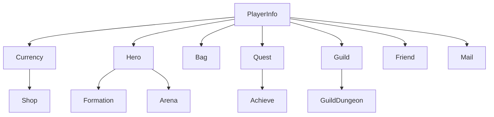

# 初始化模块实现细节

## 一、计算公式

### 1.1 加载进度计算公式

```
加载进度 = 已完成模块数 / 总模块数 × 100%
```

**参数说明**：
- `已完成模块数`：已成功加载的模块数量
- `总模块数`：需要加载的模块总数

**示例计算**：
```
总模块数: 20
已完成: 15
加载进度 = 15 / 20 × 100% = 75%
```

### 1.2 加载权重计算

```
模块权重 = 基础权重 × 数据量系数 × 网络系数
预计加载时间 = 历史平均时间 × 权重
```

**参数说明**：
- `基础权重`：模块类型基础权重（核心模块权重高）
- `数据量系数`：数据量大小影响（大数据量系数高）
- `网络系数`：当前网络状态影响

### 1.3 超时时间计算

```
动态超时 = 基础超时 + 数据量 × 每KB增量时间
实际超时 = min(动态超时, 最大超时)
```

**示例计算**：
```
基础超时: 5000ms
数据量: 100KB
每KB增量时间: 50ms
最大超时: 30000ms

动态超时 = 5000 + 100 × 50 = 10000ms
实际超时 = min(10000, 30000) = 10000ms
```

### 1.4 缓存有效时间计算

```
缓存剩余时间 = 缓存时间 + 缓存有效期 - 当前时间
是否有效 = 缓存剩余时间 > 0
```

---

## 二、状态机定义

### 2.1 初始化整体状态机



### 2.2 单个模块状态机



### 2.3 组件生命周期状态机



---

## 三、数据约束

### 3.1 初始化顺序配置约束

| 字段名 | 数据类型 | 取值范围 | 必填 | 说明 |
|--------|----------|----------|------|------|
| orderId | int | > 0 | 是 | 加载顺序ID |
| moduleId | int | > 0 | 是 | 模块ID |
| moduleName | string | 1-50字符 | 是 | 模块名称 |
| dependList | array | - | 否 | 依赖模块ID列表 |
| isAsync | boolean | true/false | 是 | 是否异步加载 |
| isRequired | boolean | true/false | 是 | 是否必填 |
| cacheTime | int | 0-3600 | 否 | 缓存时间(秒) |

### 3.2 模块加载状态约束

| 字段名 | 数据类型 | 取值范围 | 必填 | 说明 |
|--------|----------|----------|------|------|
| moduleId | int | > 0 | 是 | 模块ID |
| status | int | 0-4 | 是 | 状态：0未开始,1加载中,2成功,3失败,4跳过 |
| startTime | datetime | - | 否 | 开始时间 |
| endTime | datetime | - | 否 | 结束时间 |
| retryCount | int | 0-3 | 是 | 重试次数 |
| errorMsg | string | 0-500字符 | 否 | 错误信息 |

### 3.3 玩家初始化数据约束

| 字段名 | 数据类型 | 取值范围 | 必填 | 说明 |
|--------|----------|----------|------|------|
| playerId | long | > 0 | 是 | 玩家ID |
| lastInitTime | datetime | - | 是 | 最后初始化时间 |
| initVersion | long | >= 0 | 是 | 初始化版本号 |
| dataChecksum | string | 32字符 | 否 | 数据校验和 |

### 3.4 初始化状态枚举

| 状态值 | 状态名 | 说明 |
|--------|--------|------|
| 0 | NONE | 未初始化 |
| 1 | INITING | 初始化中 |
| 2 | DONE | 初始化完成 |
| 3 | FAILED | 初始化失败 |
| 4 | SKIPPED | 已跳过 |

---

## 四、错误处理策略

### 4.1 初始化模块错误码

| 错误码 | 错误信息 | 处理策略 | 用户提示 |
|--------|----------|----------|----------|
| 20001 | 玩家数据不存在 | 检查玩家ID有效性 | "玩家数据异常，请重新登录" |
| 20002 | 核心数据加载失败 | 重试或中断 | "加载数据失败，请检查网络" |
| 20003 | 模块依赖未满足 | 检查依赖配置 | "系统初始化异常" |
| 20004 | 网络请求超时 | 自动重试 | "网络连接超时，正在重试..." |
| 20005 | 数据校验失败 | 记录日志，使用默认值 | "部分数据异常，已恢复默认" |
| 20006 | 版本不兼容 | 提示更新客户端 | "客户端版本过旧，请更新" |
| 20007 | 服务器维护中 | 显示维护公告 | "服务器维护中，请稍后再试" |

### 4.2 初始化失败处理流程



### 4.3 网络异常处理

| 异常场景 | 处理策略 | 重试策略 |
|----------|----------|----------|
| 连接超时 | 自动重试 | 最多3次，间隔递增 |
| 响应超时 | 自动重试 | 最多2次 |
| 网络断开 | 等待恢复 | 无限等待，显示重连按钮 |
| 服务器错误 | 稍后重试 | 最多3次，间隔5秒 |

---

## 五、关键代码示例

### 5.1 组件管理器初始化伪代码

```csharp
public class NPPlayerComponentMgr
{
    // 组件字典
    private Dictionary<ENPPlayerCompType, _ANPBasicPlayerComponent> _m_compDic;

    // 初始化队列
    private Queue<ENPPlayerCompType> _m_initQueue;

    // 初始化状态
    private EInitState _m_initState = EInitState.NONE;

    // 开始初始化
    public void StartInit()
    {
        _m_initState = EInitState.INITING;
        _m_initQueue = new Queue<ENPPlayerCompType>(GetInitOrder());

        // 开始加载第一个模块
        ProcessNextModule();
    }

    // 处理下一个模块
    private void ProcessNextModule()
    {
        if (_m_initQueue.Count == 0)
        {
            // 所有模块加载完成
            OnAllInitDone();
            return;
        }

        ENPPlayerCompType compType = _m_initQueue.Peek();

        // 检查依赖
        if (!CheckDependencies(compType))
        {
            // 依赖未就绪，延后处理
            return;
        }

        // 开始初始化
        InitComponent(compType);
    }

    // 初始化组件
    private void InitComponent(ENPPlayerCompType compType)
    {
        _ANPBasicPlayerComponent comp = CreateComponent(compType);
        _m_compDic[compType] = comp;

        comp.presendInitProtocol();
    }

    // 组件初始化完成回调
    public void OnCompInitDone(ENPPlayerCompType compType)
    {
        _m_initQueue.Dequeue();

        // 更新进度
        UpdateProgress();

        // 继续下一个
        ProcessNextModule();
    }

    // 组件初始化失败回调
    public void OnCompInitFail(ENPPlayerCompType compType, string error)
    {
        var config = GetModuleConfig(compType);

        if (config.isRequired)
        {
            // 必填模块失败
            OnInitFailed(error);
        }
        else
        {
            // 可选模块跳过
            _m_initQueue.Dequeue();
            ProcessNextModule();
        }
    }

    // 所有初始化完成
    private void OnAllInitDone()
    {
        _m_initState = EInitState.DONE;

        // 通知所有组件
        foreach (var comp in _m_compDic.Values)
        {
            comp.onAllCompInited();
        }

        // 发送初始化完成事件
        EventManager.Instance.Publish(new InitCompleteEvent());
    }
}
```

### 5.2 组件基类伪代码

```csharp
public abstract class _ANPBasicPlayerComponent
{
    protected NPPlayerComponentMgr _m_compMgr;
    protected EInitState _m_initState = EInitState.NONE;
    protected int _m_retryCount = 0;

    // 是否必须初始化
    public abstract bool isMustInit { get; }

    // 组件类型
    public abstract ENPPlayerCompType compType { get; }

    // 依赖组件列表
    public abstract ENPPlayerCompType[] dependCompList { get; }

    // 是否允许提前初始化
    public virtual bool canPreInit { get { return false; } }

    // 发送初始化协议
    public virtual void presendInitProtocol()
    {
        _m_initState = EInitState.INITING;
        _dealInit();
    }

    // 处理初始化
    protected abstract void _dealInit();

    // 设置初始化完成
    protected void setInitDone()
    {
        _m_initState = EInitState.DONE;
        _onInitDone();
        _m_compMgr.OnCompInitDone(compType);
    }

    // 设置初始化失败
    protected void setInitFail(string error)
    {
        _m_initState = EInitState.FAILED;

        // 检查是否需要重试
        if (_m_retryCount < MAX_RETRY && isMustInit)
        {
            _m_retryCount++;
            RetryInit();
        }
        else
        {
            _onInitFail();
            _m_compMgr.OnCompInitFail(compType, error);
        }
    }

    // 重试初始化
    private void RetryInit()
    {
        _m_initState = EInitState.NONE;
        presendInitProtocol();
    }

    // 初始化完成回调
    protected abstract void _onInitDone();

    // 初始化失败回调
    protected abstract void _onInitFail();

    // 所有组件初始化完成回调
    public virtual void onAllCompInited() { }

    // 释放资源
    protected abstract void _discard();
}
```

### 5.3 服务端初始化处理伪代码

```java
@Component
public class InitHandler {

    @Autowired
    private PlayerService playerService;

    @Autowired
    private CurrencyService currencyService;

    @Autowired
    private HeroService heroService;

    // 处理玩家信息请求
    @Handler(module = 2, sub = 1)
    public void handlePlayerInfo(long playerId, GC2GS_002_001_ReqPlayerInfo req) {
        // 加载玩家基础信息
        PlayerInfo playerInfo = playerService.getPlayerInfo(playerId);

        // 构造响应
        GS2GC_002_001_RetPlayerInfo response = new GS2GC_002_001_RetPlayerInfo();
        response.setPlayerId(playerInfo.getPlayerId());
        response.setPlayerName(playerInfo.getPlayerName());
        response.setLevel(playerInfo.getLevel());
        response.setExp(playerInfo.getExp());
        response.setVipLevel(playerInfo.getVipLevel());
        response.setCreateTime(playerInfo.getCreateTime().getTime());
        response.setLastLoginTime(playerInfo.getLastLoginTime().getTime());

        // 发送响应
        sendToClient(playerId, response);
    }

    // 处理货币列表请求
    @Handler(module = 2, sub = 3)
    public void handleCurrencyList(long playerId, GC2GS_002_003_ReqCurrencyList req) {
        // 加载货币数据
        List<CurrencyInfo> currencyList = currencyService.getCurrencyList(playerId);

        // 构造响应
        GS2GC_002_003_RetCurrencyList response = new GS2GC_002_003_RetCurrencyList();
        response.setCurrencyList(currencyList);

        // 发送响应
        sendToClient(playerId, response);
    }

    // 处理英雄初始化请求
    @Handler(module = 2, sub = 12)
    public void handleHeroInit(long playerId, GC2GS_002_012_ReqHeroInit req) {
        // 加载英雄列表
        List<HeroInfo> heroList = heroService.getHeroList(playerId);

        // 加载阵容信息
        List<Long> formationList = heroService.getFormationList(playerId);

        // 构造响应
        GS2GC_002_012_RetHeroInit response = new GS2GC_002_012_RetHeroInit();
        response.setHeroList(heroList);
        response.setFormationList(formationList);

        // 发送响应
        sendToClient(playerId, response);
    }
}
```

### 5.4 数据缓存管理伪代码

```java
@Component
public class InitCacheManager {

    @Autowired
    private RedisTemplate<String, Object> redisTemplate;

    private static final int DEFAULT_CACHE_TIME = 300; // 5分钟

    // 缓存初始化数据
    public void cacheInitData(long playerId, int moduleId, Object data) {
        String key = buildCacheKey(playerId, moduleId);
        int cacheTime = getModuleCacheTime(moduleId);

        redisTemplate.opsForValue().set(key, data, cacheTime, TimeUnit.SECONDS);
    }

    // 获取缓存的初始化数据
    public Object getCachedData(long playerId, int moduleId) {
        String key = buildCacheKey(playerId, moduleId);
        return redisTemplate.opsForValue().get(key);
    }

    // 检查缓存是否有效
    public boolean isCacheValid(long playerId, int moduleId) {
        String key = buildCacheKey(playerId, moduleId);
        Long expire = redisTemplate.getExpire(key, TimeUnit.SECONDS);
        return expire != null && expire > 0;
    }

    // 清除玩家缓存
    public void clearPlayerCache(long playerId) {
        String pattern = "init:" + playerId + ":*";
        Set<String> keys = redisTemplate.keys(pattern);
        if (keys != null && !keys.isEmpty()) {
            redisTemplate.delete(keys);
        }
    }

    // 增量同步
    public void syncIncrementalData(long playerId, long lastSyncTime) {
        // 获取变更数据
        List<DataChange> changes = dataChangeDao.selectByPlayerIdAndTime(playerId, lastSyncTime);

        for (DataChange change : changes) {
            pushDataChange(playerId, change);
        }
    }

    private String buildCacheKey(long playerId, int moduleId) {
        return "init:" + playerId + ":" + moduleId;
    }

    private int getModuleCacheTime(int moduleId) {
        InitModuleConfig config = moduleConfigDao.selectById(moduleId);
        return config != null ? config.getCacheTime() : DEFAULT_CACHE_TIME;
    }
}
```

---

## 六、跨模块依赖

### 6.1 依赖关系图



### 6.2 被依赖说明

初始化模块是所有其他模块的基础，所有模块的数据同步都依赖初始化模块完成。

### 6.3 模块注册

新模块需要在初始化系统中注册：

```csharp
// 注册新模块
public class NewModuleComponent : _ANPBasicPlayerComponent
{
    public override bool isMustInit { get { return false; } }
    public override ENPPlayerCompType compType { get { return ENPPlayerCompType.NEW_MODULE; } }
    public override ENPPlayerCompType[] dependCompList { get { return new[] { ENPPlayerCompType.PLAYER_INFO }; } }

    protected override void _dealInit()
    {
        // 发送初始化请求
        NPGSClientListener.sendMsg(GSWriter_002_InitOp.make_002_XXX_ReqNewModuleInit());
    }
}
```

---

*文档生成时间: 2026-04-07*
