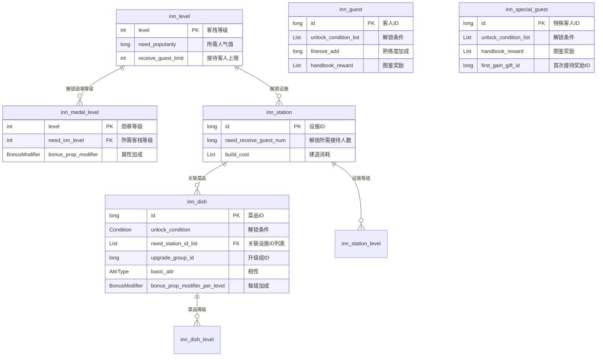
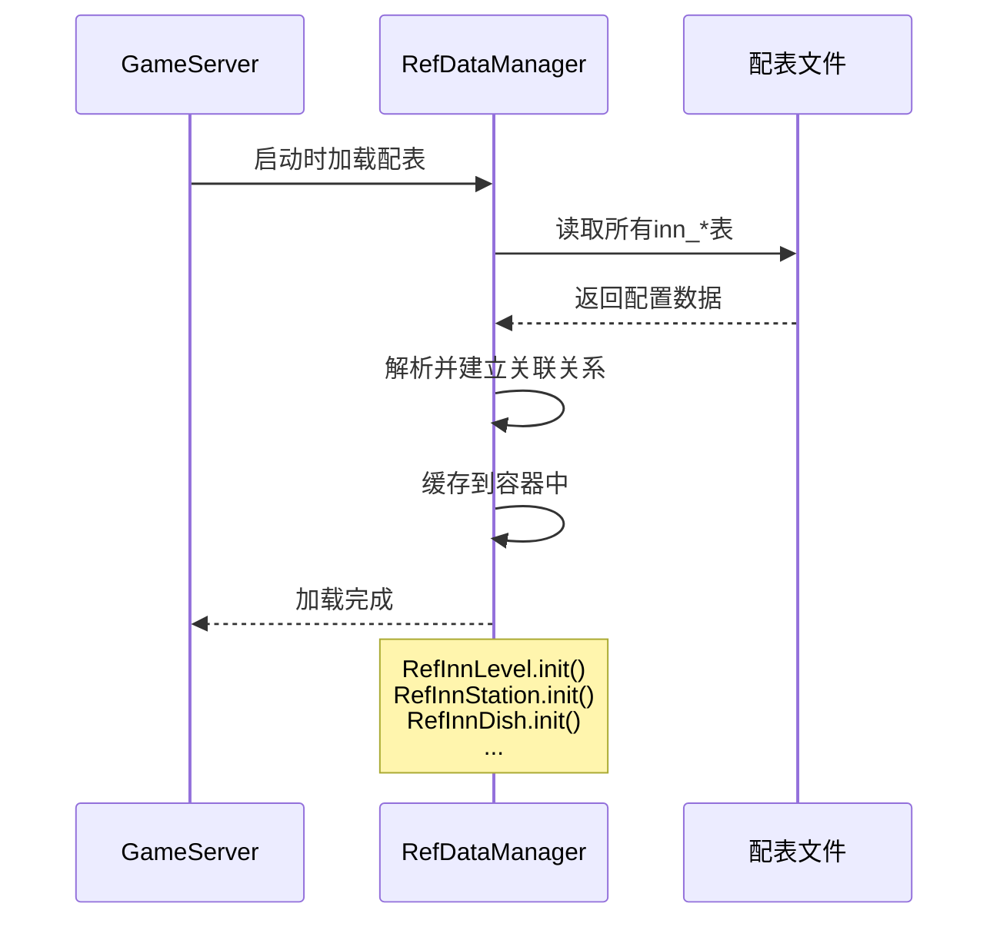

# 客栈模块 - 数据配表

## 概述

客栈模块 (InnOp, p034) 是游戏中的特色经营玩法，玩家经营客栈接待客人获取收益。核心数据通过配表配置，包含设施、菜品、客人、勋章等配置表。

## 配表关系图



---

## 一、客栈等级配置 (inn_level)

### 1.1 表结构

| 字段名 | 类型 | 说明 | 示例值 |
|-------|------|------|--------|
| level | int | 客栈等级（主键） | 1 |
| need_popularity | long | 升级所需人气值 | 1000 |
| receive_guest_limit | int | 接待客人上限 | 10 |

### 1.2 服务端引用类

```java
// 文件路径: game_server/GameRes/src/NPGameRes/Refs/Inn/RefInnLevel.java
@RefTable(tableName = "inn_level")
public class RefInnLevel extends RefBase {
    public int level;                   // 等级（主键）
    public long need_popularity;        // 所需人气值
    public int receive_guest_limit;     // 接收客人上限
}
```

### 1.3 配置示例

| level | need_popularity | receive_guest_limit |
|-------|-----------------|---------------------|
| 1 | 0 | 5 |
| 2 | 500 | 10 |
| 3 | 1500 | 15 |
| 4 | 3500 | 20 |
| 5 | 7000 | 25 |

---

## 二、勋章等级配置 (inn_medal_level)

### 2.1 表结构

| 字段名 | 类型 | 说明 | 示例值 |
|-------|------|------|--------|
| level | int | 勋章等级（主键） | 1 |
| need_inn_level | int | 所需客栈等级 | 5 |
| bonus_prop_modifier | BonusModifier | 属性加成 | 见说明 |

### 2.2 服务端引用类

```java
// 文件路径: game_server/GameRes/src/NPGameRes/Refs/Inn/RefInnMedalLevel.java
@RefTable(tableName = "inn_medal_level")
public class RefInnMedalLevel extends RefBase {
    public int level;                           // 勋章等级（主键）
    public int need_inn_level;                  // 所需旅店等级
    public PlayerBonusPropertyModifier bonus_prop_modifier; // 加成
}
```

### 2.3 配置示例

| level | need_inn_level | bonus_prop_modifier |
|-------|----------------|---------------------|
| 1 | 1 | 攻击+5%, 防御+3% |
| 2 | 3 | 攻击+8%, 防御+5% |
| 3 | 5 | 攻击+12%, 防御+8% |
| 4 | 8 | 攻击+18%, 防御+12% |
| 5 | 10 | 攻击+25%, 防御+18% |

---

## 三、设施配置 (inn_station)

### 3.1 表结构

| 字段名 | 类型 | 说明 | 示例值 |
|-------|------|------|--------|
| id | long | 设施ID（主键） | 1001 |
| need_receive_guest_num | long | 解锁所需接待人数 | 10 |
| build_cost | List\<NPCommonCostItem\> | 建造消耗 | [{itemId: 101, count: 100}] |

### 3.2 服务端引用类

```java
// 文件路径: game_server/GameRes/src/NPGameRes/Refs/Inn/RefInnStation.java
@RefTable(tableName = "inn_station")
public class RefInnStation extends RefBase {
    public long id;                             // 站点ID（主键）
    public long need_receive_guest_num;         // 解锁所需迎宾人数
    public List<NPCommonCostItem> build_cost;   // 建造消耗

    @RefField(isIgnore = true)
    private List<RefInnStationLevel> _m_levelRefList; // 设施等级列表

    public RefInnStationLevel getLevelRef(int _level) {
        // 根据等级获取配置
    }
}
```

### 3.3 设施等级配置 (inn_station_level)

| 字段名 | 类型 | 说明 |
|-------|------|------|
| station_id | long | 设施ID |
| level | int | 等级 |
| upgrade_cost | List | 升级消耗 |
| bonus_modifier | BonusModifier | 等级加成 |

### 3.4 配置示例

**设施表 (inn_station)**:

| id | need_receive_guest_num | build_cost |
|----|------------------------|------------|
| 1001 | 0 | [] |
| 1002 | 10 | [{silver: 1000}] |
| 1003 | 30 | [{silver: 3000, item: 101}] |

---

## 四、菜品配置 (inn_dish)

### 4.1 表结构

| 字段名 | 类型 | 说明 | 示例值 |
|-------|------|------|--------|
| id | long | 菜品ID（主键） | 2001 |
| unlock_condition | NPPlayerConditionGroupObj | 解锁条件 | 等级>=5 |
| need_station_id_list | List\<Long\> | 关联设施ID列表 | [1001, 1002] |
| upgrade_group_id | long | 升级组ID | 1 |
| basic_attr | ESpecAttrType | 菜品相性 | FIRE |
| bonus_prop_modifier_per_level | PlayerBonusPropertyModifier | 每级加成 | 攻击+2% |

### 4.2 服务端引用类

```java
// 文件路径: game_server/GameRes/src/NPGameRes/Refs/Inn/RefInnDish.java
@RefTable(tableName = "inn_dish")
public class RefInnDish extends RefBase {
    public long id;                                     // 菜品ID（主键）
    public NPPlayerConditionGroupObj unlock_condition;  // 解锁条件
    public List<Long> need_station_id_list;             // 菜品关联设施ID列表
    public long upgrade_group_id;                       // 菜品升级组ID
    public ESpecAttrType basic_attr;                    // 菜品相性
    public PlayerBonusPropertyModifier bonus_prop_modifier_per_level; // 每级加成值
}
```

### 4.3 菜品等级配置 (inn_dish_level)

| 字段名 | 类型 | 说明 |
|-------|------|------|
| dish_id | long | 菜品ID |
| level | int | 等级 |
| upgrade_cost | List | 升级消耗 |
| need_finesse | long | 所需熟练度 |

### 4.4 配置示例

| id | unlock_condition | need_station_id_list | basic_attr |
|----|-----------------|---------------------|------------|
| 2001 | level>=1 | [1001] | FIRE |
| 2002 | level>=5 | [1001, 1002] | WATER |
| 2003 | level>=10 | [1002, 1003] | WIND |

---

## 五、普通客人配置 (inn_guest)

### 5.1 表结构

| 字段名 | 类型 | 说明 | 示例值 |
|-------|------|------|--------|
| id | long | 客人ID（主键） | 3001 |
| unlock_condition_list | List\<NPPlayerConditionGroupObj\> | 解锁条件 | 等级>=1 |
| finesse_add | long | 熟练度加成 | 10 |
| handbook_reward | List\<NPCommonCostItem\> | 图鉴奖励 | [{itemId: 101, count: 50}] |

### 5.2 服务端引用类

```java
// 文件路径: game_server/GameRes/src/NPGameRes/Refs/Inn/RefInnGuest.java
@RefTable(tableName = "inn_guest")
public class RefInnGuest extends RefBase {
    public long id;                                     // 客人ID（主键）
    public List<NPPlayerConditionGroupObj> unlock_condition_list; // 解锁条件
    public long finesse_add;                            // 熟练度加成
    public List<NPCommonCostItem> handbook_reward;      // 图鉴奖励
}
```

### 5.3 配置示例

| id | unlock_condition_list | finesse_add | handbook_reward |
|----|----------------------|-------------|-----------------|
| 3001 | level>=1 | 10 | [{silver: 100}] |
| 3002 | level>=5 | 15 | [{silver: 200}] |
| 3003 | level>=10 | 20 | [{silver: 500, item: 101}] |

---

## 六、特殊客人配置 (inn_special_guest)

### 6.1 表结构

| 字段名 | 类型 | 说明 | 示例值 |
|-------|------|------|--------|
| id | long | 特殊客人ID（主键） | 4001 |
| unlock_condition_list | List\<NPPlayerConditionGroupObj\> | 解锁条件 | 完成任务101 |
| handbook_reward | List\<NPCommonCostItem\> | 图鉴奖励 | [{itemId: 201, count: 1}] |
| first_gain_gift_id | long | 首次接待获得的珍宝奖励ID | 5001 |

### 6.2 服务端引用类

```java
// 文件路径: game_server/GameRes/src/NPGameRes/Refs/Inn/RefInnSpecialGuest.java
@RefTable(tableName = "inn_special_guest")
public class RefInnSpecialGuest extends RefBase {
    public long id;                                     // 客人ID（主键）
    public List<NPPlayerConditionGroupObj> unlock_condition_list; // 解锁条件
    public List<NPCommonCostItem> handbook_reward;      // 图鉴奖励
    public long first_gain_gift_id;                     // 首次接待获得的珍宝奖励ID
}
```

### 6.3 配置示例

| id | unlock_condition_list | handbook_reward | first_gain_gift_id |
|----|----------------------|-----------------|-------------------|
| 4001 | quest=101 | [{item: 201, count: 1}] | 5001 |
| 4002 | quest=205 | [{item: 202, count: 1}] | 5002 |
| 4003 | chapter=10 | [{item: 203, count: 1}] | 5003 |

---

## 七、配表加载流程



---

## 八、配表路径

| 端 | 路径 |
|----|------|
| 服务端配置 | `game_server/Config/inn/` |
| 服务端引用类 | `game_server/GameRes/src/NPGameRes/Refs/Inn/` |
| 客户端配置 | `game_client/Assets/Scripts/ResScripts/NPSO/GSO/Inn/` |

---

*文档生成时间: 2026-04-11*
