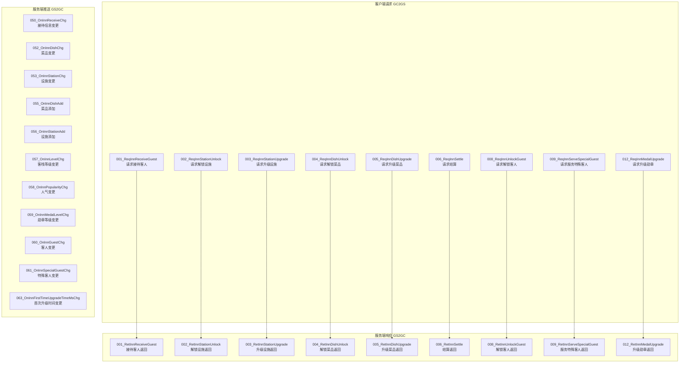
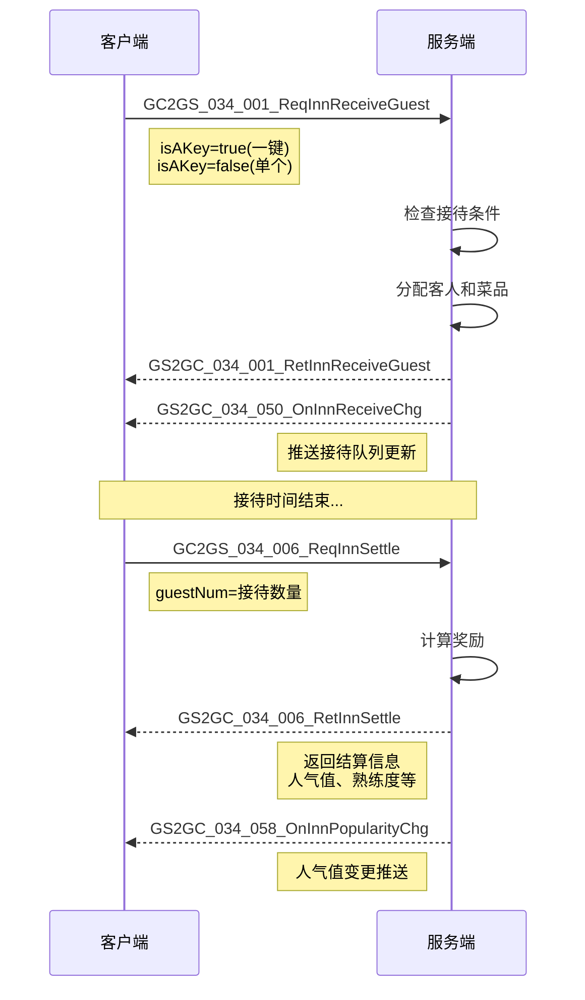
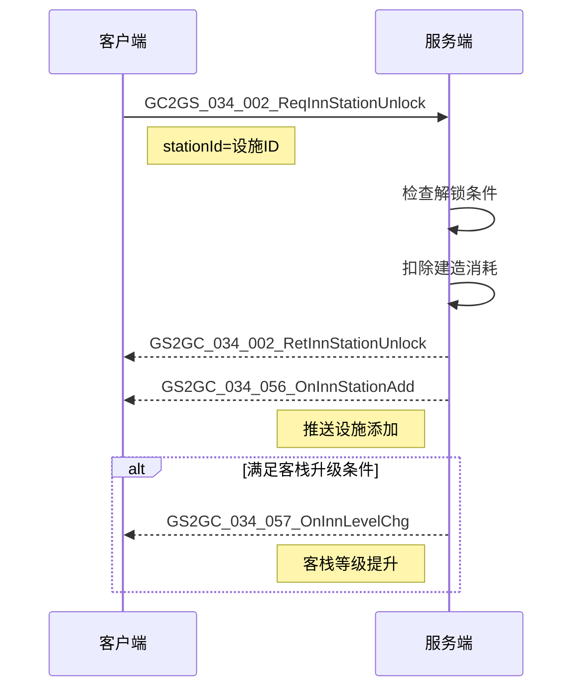

# 客栈模块 - 协议文档

## 协议编号

模块编号：**p034** (InnOp)

---

## 协议架构图



---

## 一、客户端请求协议 (GC2GS)

### 1.1 GC2GS_034_001_ReqInnReceiveGuest - 请求接待客人

**协议号**：034-001

**说明**：请求接待客人，支持一键接待

**请求字段**：

| 字段名 | 类型 | 说明 |
|-------|------|------|
| isAKey | bool | 是否一键接待 |

**客户端代码**：

```csharp
// 文件路径: game_client/Assets/Scripts/ClientProtocol/GC2GS/p034_InnOp/GC2GS_034_001_ReqInnReceiveGuest.cs
public class GC2GS_034_001_ReqInnReceiveGuest : ALBasicProtocolPack._IALProtocolStructure {
    private bool isAKey;  // 是否一键

    public byte getMainOrder() { return (byte)34; }
    public byte getSubOrder() { return (byte)1; }
}
```

---

### 1.2 GC2GS_034_002_ReqInnStationUnlock - 请求解锁设施

**协议号**：034-002

**说明**：请求解锁/建造新设施

**请求字段**：

| 字段名 | 类型 | 说明 |
|-------|------|------|
| stationId | long | 设施ID |

---

### 1.3 GC2GS_034_003_ReqInnStationUpgrade - 请求升级设施

**协议号**：034-003

**说明**：请求升级设施等级

**请求字段**：

| 字段名 | 类型 | 说明 |
|-------|------|------|
| stationId | long | 设施ID |

---

### 1.4 GC2GS_034_004_ReqInnDishUnlock - 请求解锁菜品

**协议号**：034-004

**说明**：请求解锁新菜品

**请求字段**：

| 字段名 | 类型 | 说明 |
|-------|------|------|
| dishId | long | 菜品ID |

---

### 1.5 GC2GS_034_005_ReqInnDishUpgrade - 请求升级菜品

**协议号**：034-005

**说明**：请求升级菜品等级

**请求字段**：

| 字段名 | 类型 | 说明 |
|-------|------|------|
| dishId | long | 菜品ID |

---

### 1.6 GC2GS_034_006_ReqInnSettle - 请求结算

**协议号**：034-006

**说明**：请求结算已完成的接待，获取奖励

**请求字段**：

| 字段名 | 类型 | 说明 |
|-------|------|------|
| guestNum | int | 结算客人数量 |

**客户端代码**：

```csharp
// 文件路径: game_client/Assets/Scripts/ClientProtocol/GC2GS/p034_InnOp/GC2GS_034_006_ReqInnSettle.cs
public class GC2GS_034_006_ReqInnSettle : ALBasicProtocolPack._IALProtocolStructure {
    private int guestNum;  // 结算客人数量

    public byte getMainOrder() { return (byte)34; }
    public byte getSubOrder() { return (byte)6; }
}
```

---

### 1.7 GC2GS_034_008_ReqInnUnlockGuest - 请求解锁客人

**协议号**：034-008

**说明**：请求解锁新客人

**请求字段**：

| 字段名 | 类型 | 说明 |
|-------|------|------|
| guestId | long | 客人ID |

---

### 1.8 GC2GS_034_009_ReqInnServeSpecialGuest - 请求服务特殊客人

**协议号**：034-009

**说明**：请求接待特殊客人

**请求字段**：

| 字段名 | 类型 | 说明 |
|-------|------|------|
| specialGuestId | long | 特殊客人ID |

---

### 1.9 GC2GS_034_012_ReqInnMedalUpgrade - 请求升级勋章

**协议号**：034-012

**说明**：请求升级客栈勋章等级

---

## 二、服务端响应协议 (GS2GC)

### 2.1 GS2GC_034_006_RetInnSettle - 结算返回

**协议号**：034-006

**说明**：返回结算结果

**响应字段**：

| 字段名 | 类型 | 说明 |
|-------|------|------|
| settleInfo | Inn_SettleInfo | 结算信息 |

**数据结构**：

```csharp
// Inn_SettleInfo 结算信息
public class Inn_SettleInfo {
    public int receiveNum;              // 接待数量
    public long addPopularity;          // 获得人气值
    public long addAffection;           // 获得心意值
    public long addStationBlueprintNum; // 获得设施蓝图数量
    public List<Inn_DishSettleInfo> dishList; // 菜品结算列表
}

// Inn_DishSettleInfo 菜品结算信息
public class Inn_DishSettleInfo {
    public long dishId;     // 菜品ID
    public int receiveNum;  // 接待数量
    public long addFinesse; // 获得熟练度
}
```

---

## 三、服务端推送协议 (GS2GC)

### 3.1 GS2GC_034_050_OnInnReceiveChg - 接待信息变更

**协议号**：034-050

**说明**：推送接待队列信息变更

**推送字段**：

| 字段名 | 类型 | 说明 |
|-------|------|------|
| receiveList | Inn_ReceiveList | 接待队列列表 |

**数据结构**：

```csharp
// 文件路径: game_client/Assets/Scripts/ClientProtocol/GS2GC/p034_InnOp/GS2GC_034_050_OnInnReceiveChg.cs
public class GS2GC_034_050_OnInnReceiveChg {
    private Inn_ReceiveList receiveList;  // 接待信息
}

// Inn_ReceiveList 接待队列列表
public class Inn_ReceiveList {
    public long hadBeenReceiveNum;              // 已接待数量
    public List<Inn_ReceiveInfo> receiveList;   // 接待队列列表
}

// Inn_ReceiveInfo 接待队列信息
public class Inn_ReceiveInfo {
    public long startTimeMs;   // 接待开始时间(毫秒)
    public int needReceiveNum; // 需要接待数量
}
```

---

### 3.2 GS2GC_034_052_OnInnDishChg - 菜品变更

**协议号**：034-052

**说明**：推送菜品信息变更

**推送字段**：

| 字段名 | 类型 | 说明 |
|-------|------|------|
| dishInfo | Inn_DishInfo | 菜品信息 |

---

### 3.3 GS2GC_034_053_OnInnStationChg - 设施变更

**协议号**：034-053

**说明**：推送设施等级变更

**推送字段**：

| 字段名 | 类型 | 说明 |
|-------|------|------|
| stationInfo | Inn_StationInfo | 设施信息 |

---

### 3.4 GS2GC_034_055_OnInnDishAdd - 菜品添加

**协议号**：034-055

**说明**：推送新菜品解锁

---

### 3.5 GS2GC_034_056_OnInnStationAdd - 设施添加

**协议号**：034-056

**说明**：推送新设施建造完成

---

### 3.6 GS2GC_034_057_OnInnLevelChg - 客栈等级变更

**协议号**：034-057

**说明**：推送客栈等级提升

**推送字段**：

| 字段名 | 类型 | 说明 |
|-------|------|------|
| newLevel | int | 新等级 |

---

### 3.7 GS2GC_034_058_OnInnPopularityChg - 人气变更

**协议号**：034-058

**说明**：推送人气值变化

**推送字段**：

| 字段名 | 类型 | 说明 |
|-------|------|------|
| newPopularity | long | 新人气值 |

---

### 3.8 GS2GC_034_059_OnInnMedalLevelChg - 勋章等级变更

**协议号**：034-059

**说明**：推送勋章等级提升

**推送字段**：

| 字段名 | 类型 | 说明 |
|-------|------|------|
| medalLevel | int | 勋章等级 |

---

### 3.9 GS2GC_034_060_OnInnGuestChg - 客人变更

**协议号**：034-060

**说明**：推送普通客人信息变更

**推送字段**：

| 字段名 | 类型 | 说明 |
|-------|------|------|
| guestInfo | Inn_GuestInfo | 客人信息 |

**数据结构**：

```csharp
// Inn_GuestInfo 客人信息
public class Inn_GuestInfo {
    public long guestId;                 // 客人ID
    public bool hadDrawHandbookReward;   // 是否领取图鉴奖励
    public long startLineUpId;           // 开始排队的ID
}
```

---

### 3.10 GS2GC_034_061_OnInnSpecialGuestChg - 特殊客人变更

**协议号**：034-061

**说明**：推送特殊客人信息变更

**推送字段**：

| 字段名 | 类型 | 说明 |
|-------|------|------|
| specialGuestInfo | Inn_SpecialGuestInfo | 特殊客人信息 |

**数据结构**：

```csharp
// Inn_SpecialGuestInfo 特殊客人信息
public class Inn_SpecialGuestInfo {
    public long specialGuestId;          // 特殊客人ID
    public bool hadBeenServe;            // 是否接待过
    public bool hadDrawHandbookReward;   // 是否领取图鉴奖励
}
```

---

### 3.11 GS2GC_034_063_OnInnFirstTimeUpgradeTimeMsChg - 首次升级时间变更

**协议号**：034-063

**说明**：推送首次升级时间记录

**推送字段**：

| 字段名 | 类型 | 说明 |
|-------|------|------|
| firstTimeUpgradeTimeMs | long | 首次升级时间(毫秒) |

---

## 四、数据结构定义

### 4.1 Inn_Info - 客栈信息

```csharp
// 文件路径: game_client/Assets/Scripts/ClientProtocol/Common/InnObj/Inn_Info.cs
public class Inn_Info : ALBasicProtocolPack._IALProtocolStructure {
    public int level;                    // 客栈等级
    public long popularity;              // 人气值
    public int medalLevel;               // 勋章等级
    public Inn_ReceiveList receiveList;  // 接待信息
    public List<Inn_StationInfo> stationList;  // 设施列表
    public List<Inn_DishInfo> dishList;        // 菜品列表
    public List<Inn_GuestInfo> guestList;      // 客人列表
    public List<Inn_SpecialGuestInfo> specialGuestList; // 特殊客人列表
    public long firstTimeUpgradeTimeMs;  // 首次升级时间(ms)
    public long randomSeed;              // 随机种子
}
```

### 4.2 Inn_StationInfo - 设施信息

```csharp
// 文件路径: game_client/Assets/Scripts/ClientProtocol/Common/InnObj/Inn_StationInfo.cs
public class Inn_StationInfo : ALBasicProtocolPack._IALProtocolStructure {
    public long stationId;  // 设施ID
    public int level;       // 等级
}
```

### 4.3 Inn_DishInfo - 菜品信息

```csharp
// 文件路径: game_client/Assets/Scripts/ClientProtocol/Common/InnObj/Inn_DishInfo.cs
public class Inn_DishInfo : ALBasicProtocolPack._IALProtocolStructure {
    public long dishId;         // 菜品ID
    public int level;           // 等级
    public long finesse;        // 熟练度
    public bool hadUnlock;      // 是否解锁
    public bool hadGainRecipe;  // 是否获得菜谱
    public long startLineUpId;  // 开始排队的ID
}
```

### 4.4 Inn_ReceiveGuestInfo - 接待客人信息

```csharp
// 文件路径: game_client/Assets/Scripts/ClientProtocol/Common/InnObj/Inn_ReceiveGuestInfo.cs
public class Inn_ReceiveGuestInfo : ALBasicProtocolPack._IALProtocolStructure {
    public int index;     // 队列中的索引
    public long guestId;  // 客人ID
    public long dishId;   // 菜品ID
}
```

---

## 五、协议交互流程

### 5.1 接待客人流程



### 5.2 设施解锁流程



---

## 六、错误码定义

| 错误码 | 错误信息 | 说明 |
|--------|----------|------|
| 430001 | 旅店勋章等级已达上限 | 勋章已满级 |
| 430002 | 旅店等级不足 | 客栈等级不满足条件 |
| 430003 | 旅店菜品等级已达上限 | 菜品已满级 |
| 430004 | 旅店菜品熟练度不足 | 熟练度不够升级 |
| 430007 | 旅店接待客人数量不足 | 结算数量无效 |
| 430008 | 旅店设施已建造 | 设施重复建造 |
| 430009 | 旅店设施等级已达上限 | 设施已满级 |
| 430010 | 旅店菜品已解锁 | 菜品重复解锁 |
| 430011 | 旅店设施不存在 | 无效设施ID |
| 430012 | 旅店菜品解锁条件未满足 | 解锁条件不满足 |
| 430013 | 旅店特殊客人已服务过 | 特殊客人重复服务 |
| 430014 | 旅店图鉴奖励已领取 | 奖励重复领取 |
| 430015 | 旅店客人未被服务 | 无效结算请求 |
| 430016 | 旅店接待冷却中 | 接待CD未结束 |
| 430017 | 旅店没有可接待的客人 | 客人池为空 |
| 430018 | 旅店没有可接待的菜品 | 菜品未解锁 |
| 430019 | 旅店没有可结算的客人 | 无可结算客人 |
| 430021 | 旅店设施未找到 | 设施数据缺失 |
| 430022 | 旅店菜品未找到 | 菜品数据缺失 |
| 430023 | 旅店特殊客人博物馆物品已领取 | 博物馆奖励已领 |
| 430024 | 旅店客人未找到 | 客人数据缺失 |
| 430025 | 旅店特殊客人未找到 | 特殊客人数据缺失 |
| 430026 | 旅店菜品菜谱未获得 | 菜谱未解锁 |
| 430027 | 旅店客人已解锁 | 客人重复解锁 |
| 430028 | 旅店客人解锁条件未满足 | 客人解锁条件不足 |
| 430029 | 旅店队伍内客人数量已达上限 | 队列已满 |

---

## 七、协议文件路径

| 类型 | 路径 |
|------|------|
| 客户端协议 | `game_client/Assets/Scripts/ClientProtocol/GC2GS/p034_InnOp/` |
| 客户端协议 | `game_client/Assets/Scripts/ClientProtocol/GS2GC/p034_InnOp/` |
| 服务端协议 | `game_server/ServerProtocol/ProtocolScripts/GC2GS/p034_InnOp/` |
| 数据结构 | `game_client/Assets/Scripts/ClientProtocol/Common/InnObj/` |

---

*文档生成时间: 2026-04-11*
