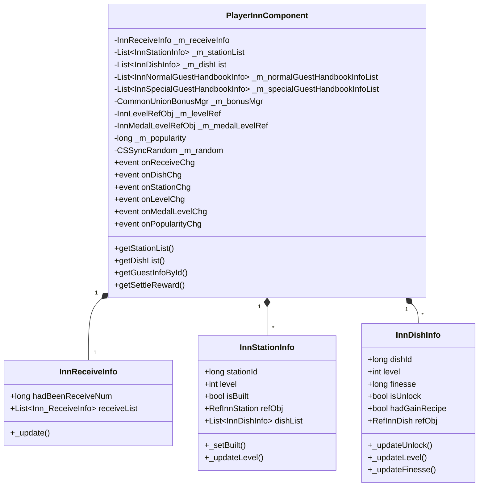

# 客栈模块 - 客户端开发

## 模块架构

```
GameComponent/Inn/
├── PlayerInnComponent.cs              # 客栈核心组件
├── PlayerInnComponent_RedTipDealer.cs # 红点提示处理
├── InnStationInfo.cs                  # 设施信息类
├── InnDishInfo.cs                     # 菜品信息类
├── InnGuestInfo.cs                    # 客人信息类
├── InnReceiveInfo.cs                  # 接待信息类
├── InnNormalGuestHandbookInfo.cs      # 普通客人图鉴
└── InnSpecialGuestHandbookInfo.cs     # 特殊客人图鉴
```

---

## 类图



---

## 一、核心组件 PlayerInnComponent

### 1.1 组件定义

```csharp
// 文件路径: game_client/Assets/Scripts/LogicScripts/GameComponent/Inn/PlayerInnComponent.cs

/// <summary>
/// 旅店组件
/// </summary>
public partial class PlayerInnComponent : _ANPBasicPlayerComponent
{
    // 当前接待的客人的相关信息
    [NotNull] private readonly InnReceiveInfo _m_receiveInfo;

    // 所有设施的数据，包括未建造的
    [ItemNotNull, NotNull] private readonly List<InnStationInfo> _m_stationList;

    // 所有菜品的数据，包括未解锁的
    [ItemNotNull, NotNull] private readonly List<InnDishInfo> _m_dishList;

    // 普通客人的图鉴数据
    [ItemNotNull, NotNull] private readonly List<InnNormalGuestHandbookInfo> _m_normalGuestHandbookInfoList;

    // 特殊客人的图鉴数据
    [ItemNotNull, NotNull] private readonly List<InnSpecialGuestHandbookInfo> _m_specialGuestHandbookInfoList;

    // 旅店的属性加成管理器
    [NotNull] private readonly CommonUnionBonusMgr _m_bonusMgr;

    // 旅店等级
    private InnLevelRefObj _m_levelRef;
    private InnLevelRefObj _m_nextLevelRef;

    // 旅店奖牌等级
    private InnMedalLevelRefObj _m_medalLevelRef;
    private InnMedalLevelRefObj _m_nextMedalLevelRef;

    // 旅店当前的人气值（用来升级）
    private long _m_popularity;

    // 第一次升级时的时间
    private long _m_firstTimeUpgradeTimeMs;

    // 客人相关的随机种子
    private CSSyncRandom _m_random;
}
```

### 1.2 事件定义

```csharp
/// <summary>
/// 当接待信息发生了变化
/// </summary>
public Action onReceiveChg;

/// <summary>
/// 当菜品信息发生变化
/// </summary>
public event Action<InnDishInfo> onDishChg;

/// <summary>
/// 当设施数据发生了变化
/// </summary>
public event Action<InnStationInfo> onStationChg;

/// <summary>
/// 当下一个可建设的设施发生了变化
/// </summary>
public event Action<InnStationInfo> onNextBuildableStationChg;

/// <summary>
/// 当旅店等级发生了变化
/// </summary>
public event Action onLevelChg;

/// <summary>
/// 当旅店奖牌等级发生了变化
/// </summary>
public event Action onMedalLevelChg;

/// <summary>
/// 当人气值发生了变化
/// </summary>
public event Action onPopularityChg;

/// <summary>
/// 当普通客人的图鉴数据变化了
/// </summary>
public event Action onNormalGuestHandbookInfoChg;

/// <summary>
/// 当特殊客人的图鉴数据变化了
/// </summary>
public event Action onSpecialGuestHandbookInfoChg;
```

### 1.3 公共属性

```csharp
public override bool isMustInit { get { return true; } }
public override ENPPlayerCompType compType { get { return ENPPlayerCompType.INN; } }
public override bool canPreInit { get { return true; } }

/// <summary>
/// 当前的等级配置
/// </summary>
public InnLevelRefObj levelRef { get { return _m_levelRef; } }

/// <summary>
/// 下一级的等级配置
/// </summary>
public InnLevelRefObj nextLevelRef { get { return _m_nextLevelRef; } }

/// <summary>
/// 当前的奖牌等级
/// </summary>
public InnMedalLevelRefObj medalLevelRef { get { return _m_medalLevelRef; } }

/// <summary>
/// 下一级的奖牌等级
/// </summary>
public InnMedalLevelRefObj nextMedalLevelRef { get { return _m_nextMedalLevelRef; } }

/// <summary>
/// 人气值
/// </summary>
public long popularity { get { return _m_popularity; } }

/// <summary>
/// 下一个可建造的设施信息
/// </summary>
public InnStationInfo nextBuildableStationInfo { get { return _m_nextBuildableStation; } }

/// <summary>
/// 总菜品数量
/// </summary>
public int allDishCount { get { return _m_dishList.Count; } }

/// <summary>
/// 属性加成管理器
/// </summary>
public CommonUnionBonusMgr bonusMgr { get { return _m_bonusMgr; } }

/// <summary>
/// 首次升级时间
/// </summary>
public long firstTimeUpgradeTimeMs { get { return _m_firstTimeUpgradeTimeMs; } }

/// <summary>
/// 接待信息
/// </summary>
[NotNull] public InnReceiveInfo receiveInfo { get { return _m_receiveInfo; } }
```

---

## 二、核心方法

### 2.1 初始化方法

```csharp
public override void presendInitProtocol()
{
    NPGSClientListener.sendRequestByLog(
        new GC2GS_002_057_ReqInnInit(),
        new CommonRequestSucFailSameCallbackProtocolDealer<GS2GC_002_057_RetInnInit>((_isSuc, _msg) =>
        {
            dealPreInitFunc(() =>
            {
                if (_isSuc)
                {
                    _initData(_msg);
                    setInitDone();
                }
                else
                    setInitFail();
            });
        }));
}
```

### 2.2 设施相关方法

```csharp
/// <summary>
/// 获取所有设施列表
/// </summary>
[Pure, ItemNotNull, NotNull]
public List<InnStationInfo> getStationList()
{
    return new List<InnStationInfo>(_m_stationList);
}

/// <summary>
/// 根据设施 ID 获取设施信息
/// </summary>
public InnStationInfo getStationInfoById(long _stationId)
{
    return _m_stationList.Find(_info => _info.stationId == _stationId);
}

/// <summary>
/// 获取所有已建造的设施的总等级
/// </summary>
public int getStationTotalLevel()
{
    int result = 0;
    foreach (InnStationInfo stationInfo in _m_stationList)
    {
        if (stationInfo.isBuilt)
            result += stationInfo.level;
    }
    return result;
}

/// <summary>
/// 判断当前旅店设施是否可以升级
/// </summary>
[Pure]
public bool canUpgradeStation()
{
    foreach (InnStationInfo stationInfo in _m_stationList)
    {
        if (!stationInfo.isBuilt)
            return false;
    }
    return true;
}
```

### 2.3 菜品相关方法

```csharp
/// <summary>
/// 获取所有菜品列表
/// </summary>
[Pure, ItemNotNull, NotNull]
public List<InnDishInfo> getDishList()
{
    return new List<InnDishInfo>(_m_dishList);
}

/// <summary>
/// 获取所有已解锁的菜品列表
/// </summary>
public void getUnlockedDishListNonAlloc(List<InnDishInfo> _list)
{
    if (_list == null) return;

    _list.Clear();
    foreach (InnDishInfo dishInfo in _m_dishList)
    {
        if (dishInfo.isUnlock)
            _list.Add(dishInfo);
    }
}

/// <summary>
/// 根据菜品 ID 获取菜品信息
/// </summary>
public InnDishInfo getDishInfoById(long _dishId)
{
    return _m_dishList.Find(_info => _info.dishId == _dishId);
}

/// <summary>
/// 判断是否所有菜品都已解锁
/// </summary>
public bool checkIsAllDishUnlocked()
{
    foreach (InnDishInfo dishInfo in _m_dishList)
    {
        if (!dishInfo.isUnlock)
            return false;
    }
    return true;
}
```

### 2.4 客人相关方法

```csharp
/// <summary>
/// 根据客人实例ID获取客人信息
/// </summary>
public InnGuestInfo getGuestInfoById(long _guestInstanceId)
{
    if (_m_random == null)
        return null;

    // 计算解锁的菜品数量（基于客人ID）
    int unlockedDishCount = 0;
    foreach (InnDishInfo dishInfo in _m_dishList)
    {
        if (dishInfo.isUnlock && _guestInstanceId >= dishInfo.unlockGuestNum)
            unlockedDishCount++;
        else
            break;
    }

    // 计算解锁的普通客人图鉴数量
    int unlockedGuestHandbookCount = 0;
    foreach (InnNormalGuestHandbookInfo handbookInfo in _m_normalGuestHandbookInfoList)
    {
        if (handbookInfo.isUnlock && _guestInstanceId >= handbookInfo.unlockGuestNum)
            unlockedGuestHandbookCount++;
        else
            break;
    }

    if (unlockedDishCount == 0 || unlockedGuestHandbookCount == 0)
        return null;

    // 使用客人ID作为随机种子，随机选择菜品和客人
    int dishIndex = _m_random.RandomInt(_guestInstanceId, unlockedDishCount);
    int guestIndex = _m_random.RandomInt(_guestInstanceId, unlockedGuestHandbookCount);

    InnDishInfo selectedDish = _m_dishList[dishIndex];
    InnNormalGuestHandbookInfo selectedGuestHandbook = _m_normalGuestHandbookInfoList[guestIndex];

    return new InnGuestInfo(_guestInstanceId, selectedGuestHandbook.refObj, selectedDish);
}

/// <summary>
/// 获取第一个特殊客人信息
/// </summary>
public InnSpecialGuestInfo tryGetFirstSpecialGuest()
{
    foreach (InnSpecialGuestHandbookInfo handbookInfo in _m_specialGuestHandbookInfoList)
    {
        if (!handbookInfo.conditionEnable())
            continue;

        if (handbookInfo.isUnlock)
            continue;

        return new InnSpecialGuestInfo(handbookInfo);
    }

    return null;
}
```

### 2.5 结算请求

```csharp
/// <summary>
/// 获取结算奖励
/// </summary>
public void getSettleReward(int _realRewardCount, Action<bool, GS2GC_034_006_RetInnSettle> _complete)
{
    NPGSClientListener.sendRequestByLog(
        new GC2GS_034_006_ReqInnSettle(_realRewardCount),
        new CommonRequestSucFailSameCallbackProtocolDealer<GS2GC_034_006_RetInnSettle>((_isSuc, _msg) =>
        {
            _m_redTipDealer.refreshStationRedTip();
            _m_redTipDealer.refreshDishRedTip();
            WinMsg.SendMsg(WinMsgType.ON_INN_GET_SETTLE_REWARD);
            _complete?.Invoke(_isSuc, _msg);
        }));
}
```

---

## 三、协议处理

### 3.1 接待信息变更处理

```csharp
internal void _onInnReceiveChg(GS2GC_034_050_OnInnReceiveChg _msg)
{
    _onInnReceiveChg(_msg.getReceiveList());
}

internal void _onInnReceiveChg(Inn_ReceiveList _receiveInfo, bool _triggerEvent = true)
{
    _m_receiveInfo._update(_receiveInfo);
    if (_triggerEvent)
        onReceiveChg?.Invoke();
}
```

### 3.2 菜品变更处理

```csharp
internal void _onInnDishChg(GS2GC_034_052_OnInnDishChg _msg)
{
    Inn_DishInfo serverInfo = _msg?.getDishInfo();
    _onInnDishChg(serverInfo, true, false);
}

internal void _onInnDishChg(Inn_DishInfo _serverInfo, bool _triggerEvent, bool _isInitial)
{
    if (_serverInfo == null) return;

    InnDishInfo dishInfo = getDishInfoById(_serverInfo.getDishId());
    if (dishInfo == null) return;

    bool isUnlock = !dishInfo.isUnlock && _serverInfo.getHadUnlock();
    bool isLevelChg = dishInfo.level != _serverInfo.getLevel();

    dishInfo._updateUnlock(_serverInfo.getHadUnlock(), _serverInfo.getStartLineUpId());
    dishInfo._updateHasRecipe(_serverInfo.getHadGainRecipe());
    dishInfo._updateLevel(_serverInfo.getLevel());
    dishInfo._updateFinesse(_serverInfo.getFinesse());

    if (!_isInitial)
        _m_dishList.Sort();

    if (_triggerEvent)
    {
        onDishChg?.Invoke(dishInfo);
        if (isUnlock)
            WinMsg.SendMsg(WinMsgType.ON_INN_DISH_UNLOCK, dishInfo);
        if (isLevelChg)
            WinMsg.SendMsg(WinMsgType.ON_INN_DISH_LEVEL_CHG, dishInfo);
    }

    _m_redTipDealer.refreshDishRedTip();
}
```

### 3.3 设施变更处理

```csharp
internal void _onInnStationChg(GS2GC_034_053_OnInnStationChg _msg)
{
    Inn_StationInfo serverInfo = _msg?.getStationInfo();
    if (serverInfo == null) return;

    InnStationInfo stationInfo = getStationInfoById(serverInfo.getStationId());
    if (stationInfo == null) return;

    stationInfo._updateLevel(serverInfo.getLevel());
    onStationChg?.Invoke(stationInfo);
    WinMsg.SendMsg(WinMsgType.ON_INN_STATION_LEVEL_CHG, stationInfo);
    _m_redTipDealer.refreshStationRedTip();
    _m_redTipDealer.refreshDishRedTip();
}

internal void _onInnStationAdd(Inn_StationInfo _serverInfo, bool _triggerEvent = true)
{
    if (_serverInfo == null) return;

    InnStationInfo stationInfo = getStationInfoById(_serverInfo.getStationId());
    if (stationInfo == null) return;

    stationInfo._setBuilt();
    stationInfo._updateLevel(_serverInfo.getLevel());
    _refreshNextBuildableStation();

    if (_triggerEvent)
    {
        onStationChg?.Invoke(stationInfo);
        WinMsg.SendMsg(WinMsgType.ON_INN_STATION_LEVEL_CHG, stationInfo);
    }
    _m_redTipDealer.refreshStationRedTip();
    _m_redTipDealer.refreshDishRedTip();
}
```

### 3.4 等级/人气/勋章变更处理

```csharp
internal void _onInnLevelChg(GS2GC_034_057_OnInnLevelChg _msg)
{
    if (_msg == null) return;

    int newLevel = _msg.getNewLevel();
    if (_m_levelRef != null && newLevel == _m_levelRef.level)
        return;

    int oldLevel = _m_levelRef != null ? (int)_m_levelRef.level : 0;
    _m_levelRef = GRefdataCoreMgr.instance.getInnLevelRef(newLevel);
    _m_nextLevelRef = GRefdataCoreMgr.instance.getInnLevelRef(newLevel + 1);
    onLevelChg?.Invoke();
    WinMsg.SendMsg(WinMsgType.ON_INN_LEVEL_CHG, oldLevel, newLevel);
    _m_redTipDealer.refreshMedalLevelRedTip();
}

internal void _onInnPopularityChg(GS2GC_034_058_OnInnPopularityChg _msg)
{
    if (_msg == null) return;

    long newPopularity = _msg.getNewPopularity();
    if (_m_popularity == newPopularity)
        return;

    long oldPopularity = _m_popularity;
    _m_popularity = newPopularity;
    onPopularityChg?.Invoke();
    WinMsg.SendMsg(WinMsgType.ON_INN_POPULARITY_CHG, oldPopularity, _m_popularity);
}

internal void _onInnMedalLevelChg(int _medalLevel)
{
    if (_m_medalLevelRef != null && _m_medalLevelRef.level == _medalLevel)
        return;

    if (_m_medalLevelRef != null)
        _m_bonusMgr.removeTotalModifier(_m_medalLevelRef.bonus_prop_modifier);

    _m_medalLevelRef = GRefdataCoreMgr.instance.getInnMedalLevelRef(_medalLevel);
    _m_nextMedalLevelRef = GRefdataCoreMgr.instance.getInnMedalLevelRef(_medalLevel + 1);

    if (_m_medalLevelRef != null)
        _m_bonusMgr.addTotalModifier(_m_medalLevelRef.bonus_prop_modifier);

    onMedalLevelChg?.Invoke();
    _m_redTipDealer.refreshMedalLevelRedTip();
    WinMsg.SendMsg(WinMsgType.ON_INN_MEDAL_LEVEL_CHG);
}
```

---

## 四、UI 窗口集成

### 4.1 客栈主界面

```csharp
public class InnMainWindow : BaseWindow
{
    private PlayerInnComponent _innComp;

    protected override void _onInit()
    {
        _innComp = NPPlayer.instance.innComp;

        // 注册事件监听
        _innComp.onReceiveChg += _refreshReceiveUI;
        _innComp.onStationChg += _onStationChg;
        _innComp.onDishChg += _onDishChg;
        _innComp.onLevelChg += _onLevelChg;
    }

    protected override void _onDiscard()
    {
        // 取消事件监听
        _innComp.onReceiveChg -= _refreshReceiveUI;
        _innComp.onStationChg -= _onStationChg;
        _innComp.onDishChg -= _onDishChg;
        _innComp.onLevelChg -= _onLevelChg;
    }

    /// <summary>
    /// 点击接待客人
    /// </summary>
    public void onClickReceiveGuest()
    {
        // 打开客人选择界面
        UIManager.openWindow<InnGuestSelectWindow>((win) =>
        {
            win.init(_innComp);
        });
    }

    /// <summary>
    /// 点击结算
    /// </summary>
    public void onClickSettle()
    {
        int settleCount = _innComp.receiveInfo.getSettleableCount();
        _innComp.getSettleReward(settleCount, (_isSuc, _msg) =>
        {
            if (_isSuc)
            {
                refreshUI();
                showSettleEffect(_msg.getSettleInfo());
            }
        });
    }

    private void _refreshReceiveUI()
    {
        // 刷新接待队列UI
    }

    private void _onStationChg(InnStationInfo _stationInfo)
    {
        // 刷新设施数据
    }

    private void _onDishChg(InnDishInfo _dishInfo)
    {
        // 刷新菜品数据
    }

    private void _onLevelChg()
    {
        // 刷新等级显示
    }
}
```

### 4.2 设施列表界面

```csharp
public class InnStationListView : BaseView
{
    private List<InnStationInfo> _stationList = new List<InnStationInfo>();

    public void refresh(PlayerInnComponent _innComp)
    {
        _innComp.getStationListNonAlloc(_stationList);
        // 刷新列表显示
    }
}
```

### 4.3 菜品列表界面

```csharp
public class InnDishListView : BaseView
{
    private List<InnDishInfo> _dishList = new List<InnDishInfo>();

    public void refresh(PlayerInnComponent _innComp)
    {
        _innComp.getUnlockedDishListNonAlloc(_dishList);
        // 刷新列表显示
    }
}
```

---

## 五、红点提示

```csharp
// 文件路径: game_client/Assets/Scripts/LogicScripts/GameComponent/Inn/PlayerInnComponent_RedTipDealer.cs
public partial class PlayerInnComponent
{
    private class RedTipDealer
    {
        public void init() { }
        public void clear() { }

        public void refreshStationRedTip() { }
        public void refreshDishRedTip() { }
        public void refreshMedalLevelRedTip() { }
        public void refreshNormalGuestHandbookRewardRedTip() { }
        public void refreshSpecialGuestHandbookRewardRedTip() { }
    }
}
```

---

## 六、注意事项

1. **设施解锁顺序**：设施按照 `need_receive_guest_num` 排序，需要依次建造
2. **菜品解锁条件**：菜品需要满足解锁条件且关联设施已建造
3. **客人随机分配**：使用同步随机种子确保客户端和服务端一致性
4. **事件监听**：UI 打开时注册事件，关闭时必须取消注册
5. **属性加成**：勋章等级提供全局属性加成，通过 `bonusMgr` 管理

---

## 七、文件路径

| 文件 | 路径 |
|------|------|
| 组件主文件 | `game_client/Assets/Scripts/LogicScripts/GameComponent/Inn/PlayerInnComponent.cs` |
| 红点处理 | `game_client/Assets/Scripts/LogicScripts/GameComponent/Inn/PlayerInnComponent_RedTipDealer.cs` |
| 设施信息 | `game_client/Assets/Scripts/LogicScripts/GameComponent/Inn/InnStationInfo.cs` |
| 菜品信息 | `game_client/Assets/Scripts/LogicScripts/GameComponent/Inn/InnDishInfo.cs` |
| 客人信息 | `game_client/Assets/Scripts/LogicScripts/GameComponent/Inn/InnGuestInfo.cs` |
| 视图管理 | `game_client/Assets/Scripts/LogicScripts/GameQueue/GQueue/InGame/Inn/ViewMgr/` |

---

*文档生成时间: 2026-04-11*
