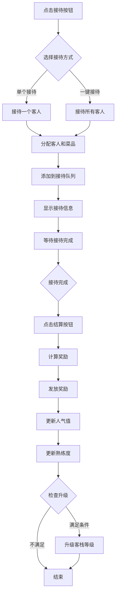
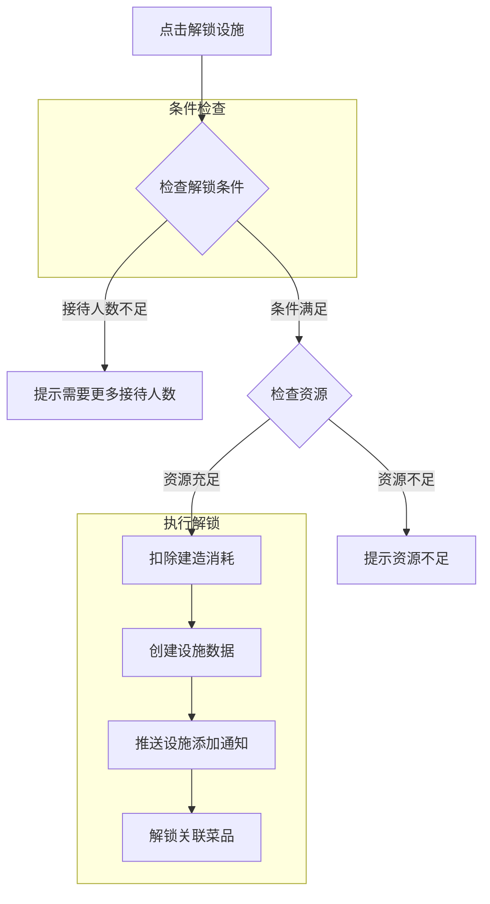
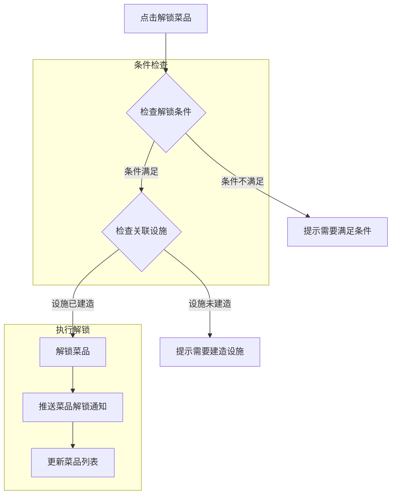
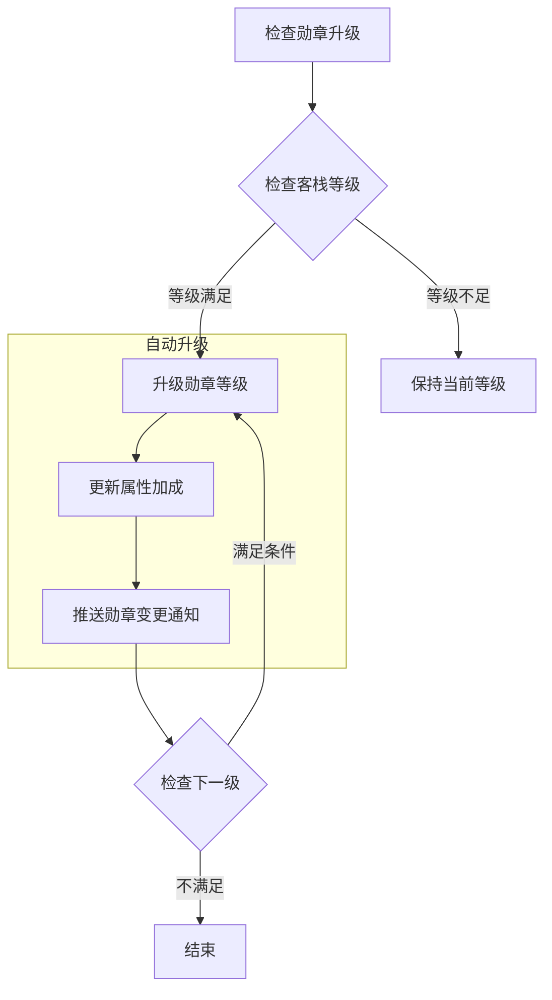
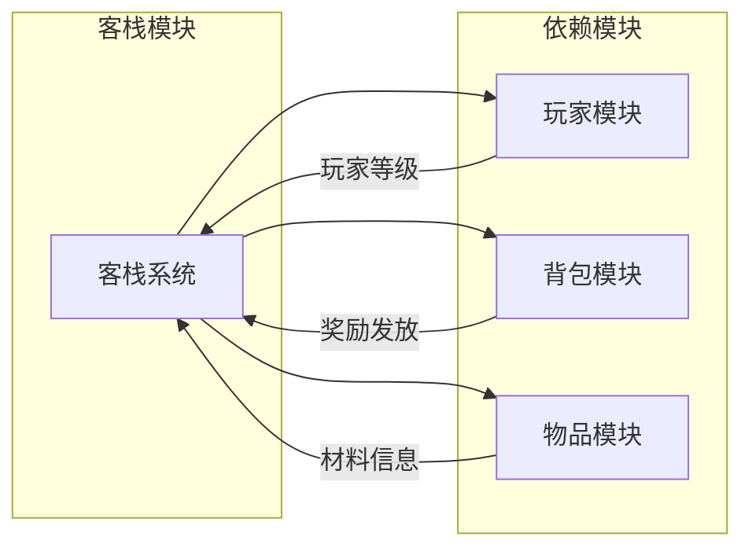

# 客栈模块完整说明

## 一、模块概述

### 1.1 业务背景

客栈模块是 K2C 游戏中的特色经营玩法，玩家扮演客栈老板，通过接待客人、提供菜品服务来获取收益。该玩法融合了模拟经营和角色养成元素，玩家需要管理设施、菜品、客人等多种资源，逐步提升客栈等级和人气，获得稳定的资源产出。

### 1.2 目标用户

- **休闲玩家**：享受经营玩法，获取稳定收益
- **收集玩家**：收集不同客人和菜品图鉴
- **活跃玩家**：追求客栈高等级和高人气

### 1.3 核心价值

1. **经营乐趣**：提供模拟经营的策略玩法
2. **稳定收益**：获取人气值、熟练度等资源
3. **收集系统**：客人图鉴和菜品解锁
4. **休闲体验**：轻松的挂机收益玩法

---

## 二、功能清单

### 2.1 设施管理功能

| 功能名称 | 功能描述 | 用户价值 |
|---------|---------|---------|
| 解锁设施 | 消耗资源建造新设施 | 扩大经营规模 |
| 升级设施 | 提升设施等级 | 提高收益加成 |
| 查看设施状态 | 查看设施当前信息 | 了解经营状况 |

### 2.2 菜品管理功能

| 功能名称 | 功能描述 | 用户价值 |
|---------|---------|---------|
| 解锁菜品 | 解锁新菜品供客人选择 | 丰富服务内容 |
| 升级菜品 | 提升菜品等级和熟练度 | 提高服务收益 |
| 查看菜品列表 | 查看所有菜品和状态 | 管理菜品资源 |

### 2.3 客人接待功能

| 功能名称 | 功能描述 | 用户价值 |
|---------|---------|---------|
| 接待普通客人 | 随机接待普通客人 | 获取基础收益 |
| 接待特殊客人 | 接待有特殊需求的客人 | 获取稀有奖励 |
| 一键接待 | 快速接待所有客人 | 减少操作负担 |
| 解锁新客人 | 通过条件解锁新客人类型 | 丰富客人图鉴 |
| 查看客人图鉴 | 查看已解锁的客人信息 | 收集展示 |

### 2.4 收益结算功能

| 功能名称 | 功能描述 | 用户价值 |
|---------|---------|---------|
| 手动结算 | 主动结算接待收益 | 即时获取收益 |
| 查看收益统计 | 查看客栈历史收益 | 了解经营成果 |

### 2.5 勋章系统功能

| 功能名称 | 功能描述 | 用户价值 |
|---------|---------|---------|
| 升级勋章 | 提升客栈勋章等级 | 获得属性加成 |
| 查看勋章效果 | 查看当前勋章加成 | 了解收益提升 |

---

## 三、业务流程详解

### 3.1 接待客人流程



**详细步骤说明**：

1. **选择接待方式**
   - 单个接待：每次接待一个客人
   - 一键接待：一次性接待所有可接待的客人

2. **分配客人和菜品**
   - 使用同步随机种子确保客户端和服务端一致
   - 根据已解锁的客人和菜品随机分配

3. **等待接待完成**
   - 接待队列显示当前接待的客人信息
   - 每个客人有对应的菜品

4. **结算收益**
   - 人气值：根据客人配置计算
   - 熟练度：根据菜品配置计算
   - 蓝图掉落：随机掉落设施蓝图

### 3.2 设施解锁流程



**详细步骤说明**：

1. **条件检查**
   - 检查接待人数是否达到要求
   - 检查前置设施是否已建造

2. **资源扣除**
   - 扣除建造所需的银两和材料

3. **创建设施**
   - 设施初始等级为1
   - 关联的菜品变为可用

### 3.3 菜品解锁流程



### 3.4 勋章升级流程



**说明**：勋章升级为自动进行，当客栈等级满足条件时自动提升。

---

## 四、关键规则

### 4.1 设施规则

1. **解锁规则**
   - 初始解锁第一个设施
   - 后续设施需要满足接待人数要求
   - 设施按 `need_receive_guest_num` 顺序解锁

2. **升级规则**
   - 设施等级影响关联菜品的收益
   - 升级消耗银两和材料
   - 等级上限由配置决定

3. **关联规则**
   - 每个设施关联若干菜品
   - 设施建造后，关联菜品才可解锁

### 4.2 菜品规则

1. **解锁规则**
   - 需要满足解锁条件（等级、任务等）
   - 需要关联设施已建造

2. **熟练度规则**
   - 每次结算获得熟练度
   - 熟练度满足条件后可升级

3. **相性规则**
   - 菜品有不同的相性属性
   - 相性影响属性加成类型

### 4.3 客人规则

1. **普通客人**
   - 随机从已解锁的客人池选择
   - 有不同的熟练度加成
   - 提供图鉴奖励

2. **特殊客人**
   - 需要特定条件才能接待
   - 提供珍宝奖励
   - 只能接待一次

3. **随机分配**
   - 使用同步随机种子
   - 确保客户端和服务端一致

### 4.4 收益规则

1. **人气值收益**
   - 每次结算获得人气值
   - 人气值用于客栈升级

2. **熟练度收益**
   - 根据客人配置计算
   - 用于菜品升级

3. **蓝图掉落**
   - 随机掉落设施蓝图
   - 用于设施相关功能

---

## 五、数据结构一览

### 5.1 Inn_Info - 客栈信息

| 字段名 | 类型 | 说明 |
|-------|------|------|
| level | int | 客栈等级 |
| popularity | long | 人气值 |
| medalLevel | int | 勋章等级 |
| receiveList | Inn_ReceiveList | 接待队列 |
| stationList | List\<Inn_StationInfo\> | 设施列表 |
| dishList | List\<Inn_DishInfo\> | 菜品列表 |
| guestList | List\<Inn_GuestInfo\> | 客人列表 |
| specialGuestList | List\<Inn_SpecialGuestInfo\> | 特殊客人列表 |
| firstTimeUpgradeTimeMs | long | 首次升级时间(ms) |
| randomSeed | long | 随机种子 |

### 5.2 Inn_StationInfo - 设施信息

| 字段名 | 类型 | 说明 |
|-------|------|------|
| stationId | long | 设施ID |
| level | int | 等级 |

### 5.3 Inn_DishInfo - 菜品信息

| 字段名 | 类型 | 说明 |
|-------|------|------|
| dishId | long | 菜品ID |
| level | int | 等级 |
| finesse | long | 熟练度 |
| hadUnlock | bool | 是否解锁 |
| hadGainRecipe | bool | 是否获得菜谱 |
| startLineUpId | long | 开始排队ID |

### 5.4 Inn_GuestInfo - 客人信息

| 字段名 | 类型 | 说明 |
|-------|------|------|
| guestId | long | 客人ID |
| hadDrawHandbookReward | bool | 是否领取图鉴奖励 |
| startLineUpId | long | 开始排队ID |

### 5.5 Inn_SpecialGuestInfo - 特殊客人信息

| 字段名 | 类型 | 说明 |
|-------|------|------|
| specialGuestId | long | 特殊客人ID |
| hadBeenServe | bool | 是否接待过 |
| hadDrawHandbookReward | bool | 是否领取图鉴奖励 |

### 5.6 Inn_SettleInfo - 结算信息

| 字段名 | 类型 | 说明 |
|-------|------|------|
| receiveNum | int | 接待数量 |
| addPopularity | long | 获得人气值 |
| addAffection | long | 获得心意值 |
| addStationBlueprintNum | long | 获得设施蓝图数量 |
| dishList | List\<Inn_DishSettleInfo\> | 菜品结算列表 |

---

## 六、用户故事

### 6.1 休闲玩家故事

> 作为一名休闲玩家，我每天上线后会花几分钟时间接待客栈客人。我解锁了所有设施，选择合适的菜品服务给客人。看着客栈人气一点点增长，收益不断增加，感觉很放松。

### 6.2 收集玩家故事

> 作为一名收集玩家，我的目标是解锁所有客人图鉴。我仔细研究每个特殊客人的解锁条件，完成对应的前置任务。每解锁一个新客人，我都会去图鉴里查看他们的故事背景。

### 6.3 活跃玩家故事

> 作为一名活跃玩家，我把客栈当作主要的资源来源。我优先升级勋章等级，获得更高的属性加成。我还会研究最优的客人接待策略，最大化每天的人气收益。

---

## 七、示例

### 7.1 设施信息示例

```
设施ID: 1002
设施名称: 雅间
等级: 5
是否已建造: 是
关联菜品: [红烧肉, 糖醋排骨, 清蒸鱼]
建造消耗: 银两×3000
```

### 7.2 菜品信息示例

```
菜品ID: 2001
菜品名称: 红烧肉
等级: 3
熟练度: 150/200
是否解锁: 是
相性: FIRE
每级加成: 攻击+2%
关联设施: [1001, 1002]
```

### 7.3 客人信息示例

**普通客人**：
```
客人ID: 3001
客人名称: 商人王富贵
解锁条件: 客栈等级>=1
熟练度加成: 10
图鉴奖励: 银两×100
```

**特殊客人**：
```
客人ID: 4001
客人名称: 神秘剑客
解锁条件: 完成主线第10章
图鉴奖励: 珍宝碎片×1
首次接待奖励: 剑法秘籍
```

### 7.4 结算信息示例

```
接待数量: 5
获得人气值: 250
获得心意值: 100
获得蓝图数量: 1

菜品结算:
- 红烧肉: 接待2次, 熟练度+20
- 糖醋排骨: 接待3次, 熟练度+30
```

---

## 八、模块依赖



| 模块名称 | 依赖类型 | 依赖说明 |
|----------|----------|----------|
| PlayerOp | 数据依赖 | 获取玩家等级、资源 |
| BagOp | 功能依赖 | 奖励发放到背包 |
| ItemOp | 数据依赖 | 获取材料信息 |

---

*文档生成时间: 2026-04-11*
