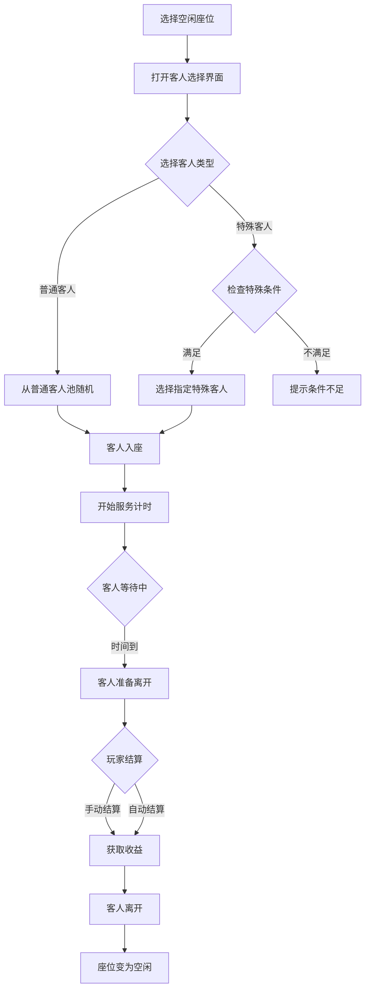
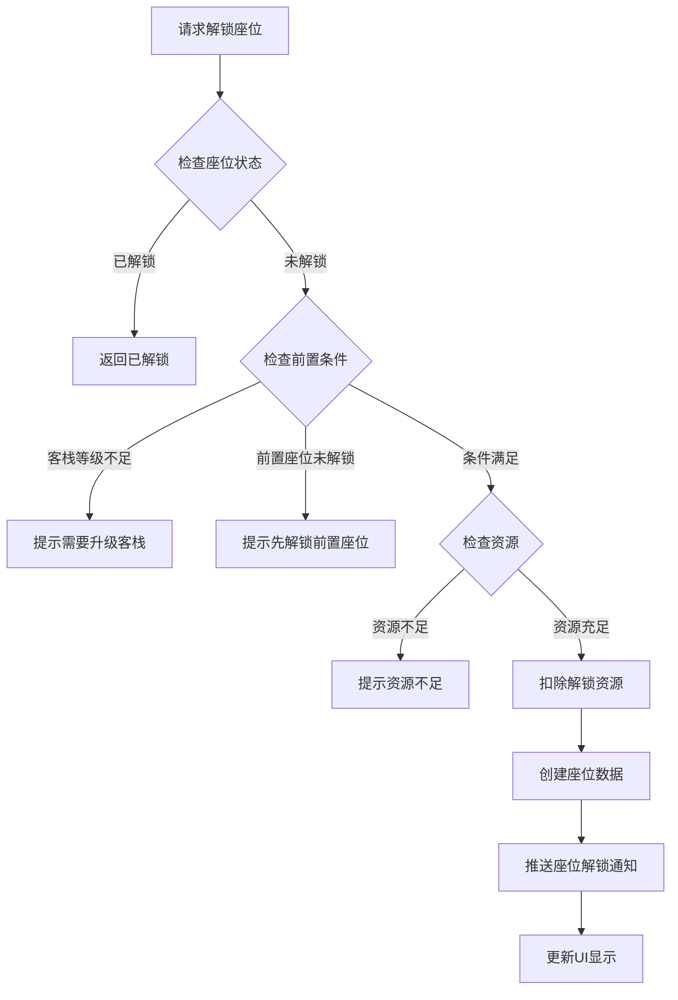
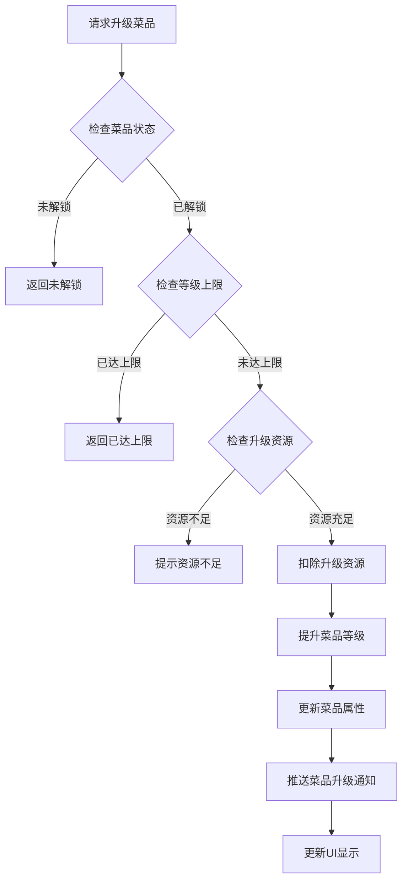
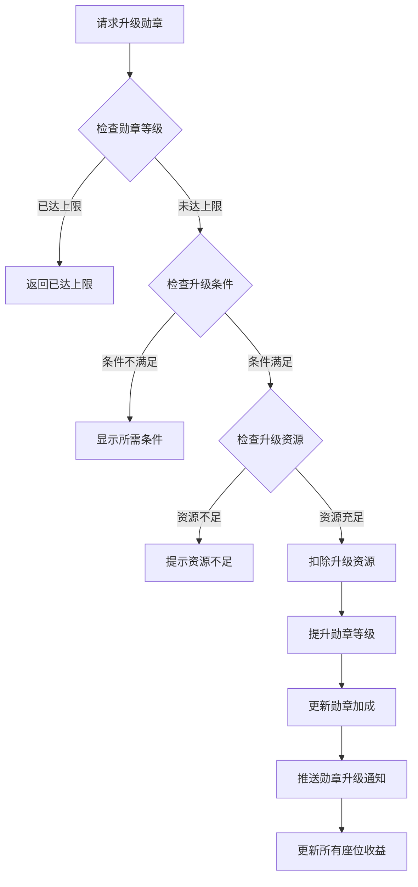

# 客栈模块完整说明

## 一、模块概述

### 1.1 业务背景

客栈模块是 K2C 游戏中的特色经营玩法，玩家扮演客栈老板，通过接待客人、提供菜品服务来获取收益。该玩法融合了模拟经营和角色养成元素，玩家需要管理座位、菜品、客人等多种资源，逐步提升客栈等级和人气，获得稳定的资源产出。

### 1.2 目标用户

- **休闲玩家**：享受经营玩法，获取稳定收益
- **收集玩家**：收集不同客人和菜品图鉴
- **活跃玩家**：追求客栈高等级和高人气

### 1.3 核心价值

1. **经营乐趣**：提供模拟经营的策略玩法
2. **稳定收益**：获取银两、材料等资源
3. **收集系统**：客人图鉴和菜品解锁
4. **休闲体验**：轻松的挂机收益玩法

---

## 二、功能清单

### 2.1 座位管理功能

| 功能名称 | 功能描述 | 用户价值 |
|---------|---------|---------|
| 解锁座位 | 消耗资源解锁新座位 | 扩大经营规模 |
| 升级座位 | 提升座位等级和品质 | 提高客人满意度 |
| 查看座位状态 | 查看座位当前客人信息 | 了解经营状况 |

### 2.2 菜品管理功能

| 功能名称 | 功能描述 | 用户价值 |
|---------|---------|---------|
| 解锁菜品 | 解锁新菜品供客人选择 | 丰富服务内容 |
| 升级菜品 | 提升菜品品质和收益 | 提高服务收益 |
| 查看菜品列表 | 查看所有菜品和状态 | 管理菜品资源 |

### 2.3 客人接待功能

| 功能名称 | 功能描述 | 用户价值 |
|---------|---------|---------|
| 接待普通客人 | 在座位接待普通客人 | 获取基础收益 |
| 接待特殊客人 | 接待有特殊需求的客人 | 获取稀有奖励 |
| 解锁新客人 | 通过条件解锁新客人类型 | 丰富客人图鉴 |
| 查看客人图鉴 | 查看已解锁的客人信息 | 收集展示 |

### 2.4 收益结算功能

| 功能名称 | 功能描述 | 用户价值 |
|---------|---------|---------|
| 手动结算 | 主动结算客人消费 | 即时获取收益 |
| 自动结算 | 自动完成客人结算 | 减少操作负担 |
| 查看收益统计 | 查看客栈历史收益 | 了解经营成果 |

### 2.5 勋章系统功能

| 功能名称 | 功能描述 | 用户价值 |
|---------|---------|---------|
| 升级勋章 | 提升客栈勋章等级 | 获得经营加成 |
| 查看勋章效果 | 查看当前勋章加成 | 了解收益提升 |

---

## 三、业务流程详解

### 3.1 接待客人流程



**详细步骤说明**：

1. **选择座位**
   - 检查座位是否空闲
   - 检查座位是否已解锁
   - 显示座位当前状态

2. **选择客人**
   - 普通客人随机分配
   - 特殊客人需要满足条件
   - 显示客人偏好和收益预览

3. **服务过程**
   - 客人入座开始计时
   - 可选择推荐菜品
   - 等待服务完成

4. **结算收益**
   - 基础收益由客人类型决定
   - 菜品加成由推荐菜品决定
   - 勋章加成由勋章等级决定

### 3.2 座位解锁流程



**详细步骤说明**：

1. **条件检查**
   - 检查客栈等级是否满足
   - 检查前置座位是否已解锁
   - 检查是否有足够的资源

2. **解锁执行**
   - 扣除解锁所需资源
   - 创建座位数据记录
   - 设置座位初始等级

3. **通知更新**
   - 推送座位解锁通知
   - 更新座位列表显示
   - 更新解锁进度

### 3.3 菜品升级流程



### 3.4 勋章升级流程



---

## 四、关键规则

### 4.1 座位规则

1. **解锁规则**
   - 初始解锁2个座位
   - 后续座位需要满足客栈等级
   - 部分座位有前置解锁条件

2. **升级规则**
   - 座位等级影响客人满意度
   - 升级消耗银两和材料
   - 等级上限由客栈等级决定

3. **状态规则**
   - 空闲：可接待新客人
   - 服务中：有客人在座
   - 待结算：客人等待结账

### 4.2 菜品规则

1. **解锁规则**
   - 通过客栈等级解锁
   - 部分菜品需要特殊条件
   - 解锁后所有座位可用

2. **品质规则**
   - 品质分为：普通、优良、精品、珍品
   - 品质影响收益加成
   - 升级可提升品质

3. **推荐规则**
   - 推荐客人喜爱的菜品有额外加成
   - 错误推荐会降低满意度
   - 特殊客人有特殊菜品要求

### 4.3 客人规则

1. **普通客人**
   - 随机从客人池选择
   - 有不同的消费能力和偏好
   - 基础收益相对稳定

2. **特殊客人**
   - 需要特定条件才能接待
   - 提供稀有奖励和道具
   - 有独特的故事背景

3. **满意度规则**
   - 满意度影响小费收益
   - 菜品推荐正确提升满意度
   - 座位等级提升满意度

### 4.4 收益规则

1. **基础收益**
   - 银两：主要收益
   - 材料：随机掉落
   - 经验：提升客栈等级

2. **加成规则**
   - 菜品加成：推荐正确菜品
   - 勋章加成：全局收益加成
   - 座位加成：高等级座位加成

---

## 五、用户故事

### 5.1 休闲玩家故事

> 作为一名休闲玩家，我每天上线后会花几分钟时间接待客栈客人。我解锁了所有座位，选择合适的菜品推荐给客人。看着客栈人气一点点增长，收入不断增加，感觉很放松。

### 5.2 收集玩家故事

> 作为一名收集玩家，我的目标是解锁所有客人图鉴。我仔细研究每个特殊客人的解锁条件，完成对应的前置任务。每解锁一个新客人，我都会去图鉴里查看他们的故事背景。

### 5.3 活跃玩家故事

> 作为一名活跃玩家，我把客栈当作主要的资源来源。我优先升级勋章等级，获得更高的收益加成。我还会研究最优的客人接待策略，最大化每天的银两收益。

---

## 六、示例

### 6.1 座位信息示例

**座位数据**：
```
座位ID: 3
座位名称: 雅座
座位等级: 5
当前状态: 服务中
当前客人: 书生李白
开始时间: 2026-04-07 14:00:00
预计完成: 2026-04-07 14:30:00
```

### 6.2 客人信息示例

**普通客人**：
```
客人ID: 101
客人名称: 商人王富贵
客人类型: 普通
喜好菜品: 红烧肉、糖醋排骨
基础消费: 200银两
服务时间: 15分钟
满意度加成: 最高50%
```

**特殊客人**：
```
客人ID: 201
客人名称: 神秘剑客
客人类型: 特殊
解锁条件: 完成主线第10章
喜好菜品: 清酒、烤鱼
基础消费: 500银两
特殊奖励: 剑法秘籍碎片
```

### 6.3 菜品信息示例

**菜品数据**：
```
菜品ID: 5
菜品名称: 红烧肉
菜品等级: 3
菜品品质: 优良
收益加成: +15%
升级消耗: 银两×500, 猪肉×10
```

### 6.4 收益结算示例

**结算数据**：
```
客人: 商人王富贵
座位: 雅座(5级)
推荐菜品: 红烧肉(喜爱)

基础消费: 200银两
菜品加成: +30(正确推荐)
座位加成: +10(座位等级)
勋章加成: +24(12%勋章加成)
满意度加成: +50(满分满意度)

总收益: 314银两, 随机材料×1
```

---

*文档生成时间: 2026-04-07*
