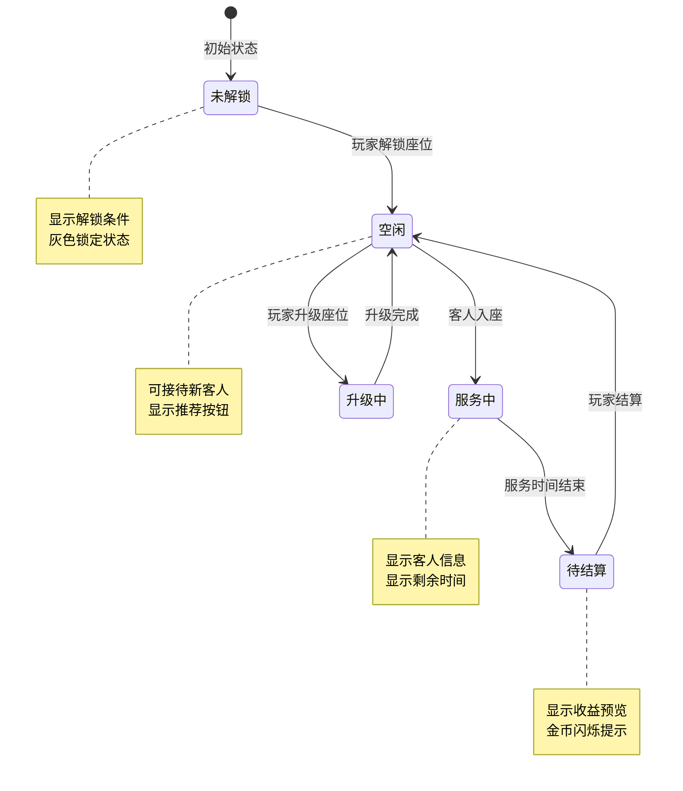
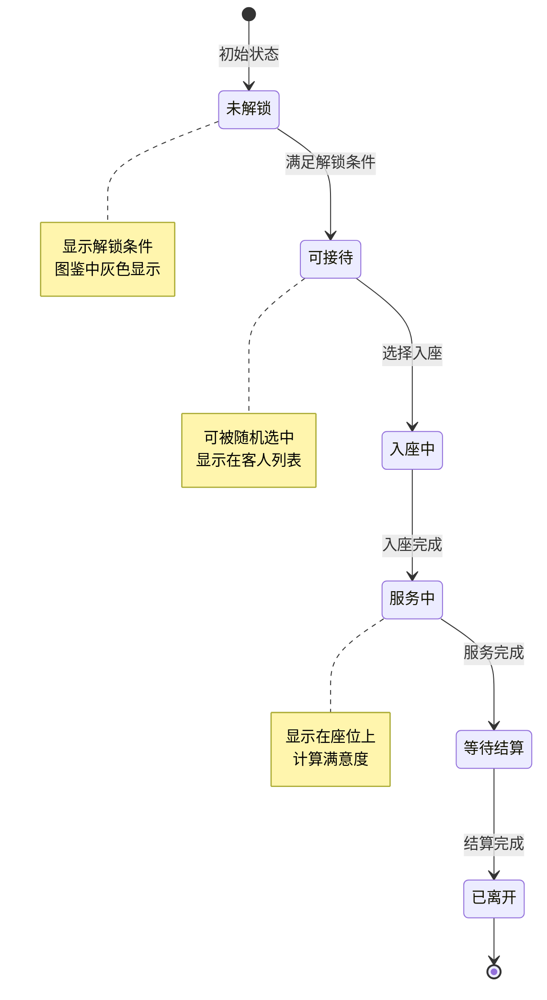
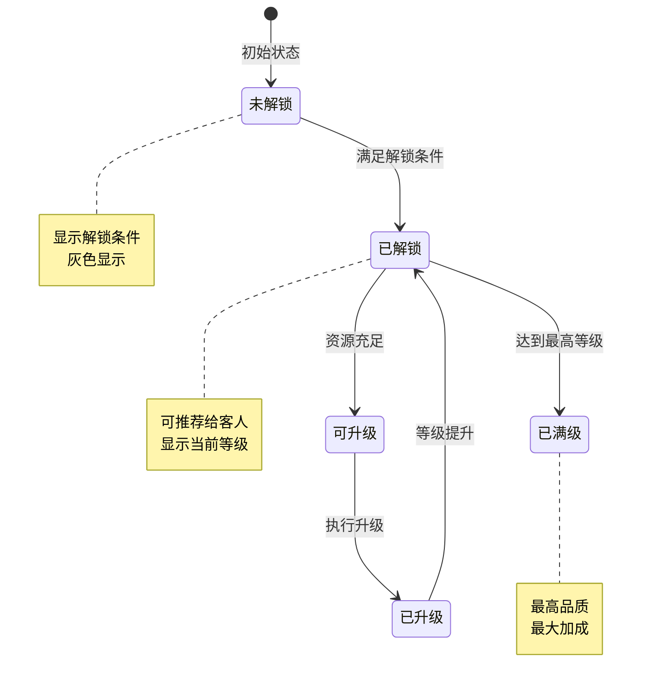
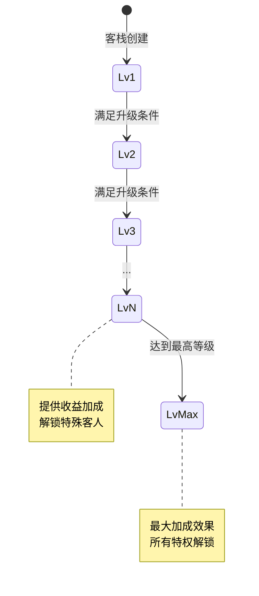
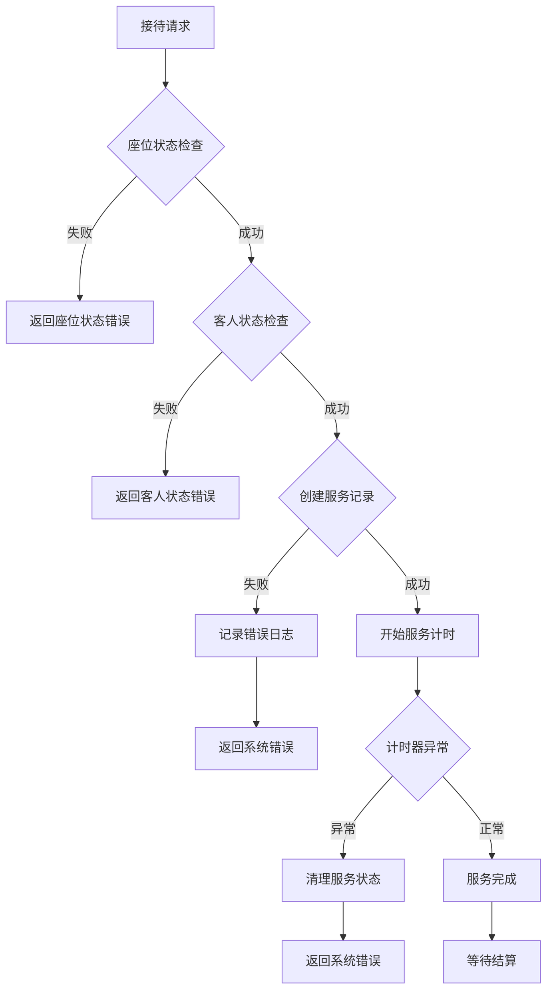

# 客栈模块实现细节

## 一、计算公式

### 1.1 收益计算公式

```
总收益 = 基础消费 × (1 + 菜品加成) × (1 + 座位加成) × (1 + 勋章加成) × 满意度系数
```

**参数说明**：
- `基础消费`：客人配置的基础消费金额
- `菜品加成`：推荐正确菜品的加成百分比
- `座位加成`：座位等级提供的加成百分比
- `勋章加成`：勋章等级提供的全局加成
- `满意度系数`：客人满意度影响的系数(0.5-1.5)

**示例计算**：
```
基础消费: 200银两
菜品加成: 15% (推荐喜爱菜品)
座位加成: 5% (座位等级5级)
勋章加成: 12% (勋章等级3级)
满意度: 100% (系数为1.2)

总收益 = 200 × 1.15 × 1.05 × 1.12 × 1.2 = 325.63 ≈ 326银两
```

### 1.2 满意度计算公式

```
满意度 = 基础满意度 + 菜品匹配加分 + 座位等级加分 - 等待时间扣分
满意度系数 = 0.5 + (满意度 / 100) × 1.0
```

**参数说明**：
- `基础满意度`：初始值为50
- `菜品匹配加分`：推荐喜爱菜品+30，普通菜品+10，错误推荐+0
- `座位等级加分`：每级+2
- `等待时间扣分`：超过预期时间每分钟-5

**示例计算**：
```
基础满意度: 50
菜品匹配: 喜爱菜品 +30
座位等级: 5级 +10
等待时间: 未超时 0

满意度 = 50 + 30 + 10 - 0 = 90
满意度系数 = 0.5 + (90/100) × 1.0 = 1.4
```

### 1.3 座位升级费用计算

```
升级费用 = 基础费用 × (当前等级 ^ 1.5)
```

**示例计算**：
```
基础费用: 100银两
当前等级: 4 → 5

升级费用 = 100 × 4^1.5 = 100 × 8 = 800银两
```

### 1.4 勋章加成计算

```
勋章加成 = 基础加成 × 勋章等级
```

**示例计算**：
```
基础加成: 4%
勋章等级: 3

勋章加成 = 4% × 3 = 12%
```

### 1.5 客栈人气计算

```
人气值 = Σ(所有成功服务的客人的人气贡献)
等级人气需求 = 基础需求 × 等级 ^ 2
```

---

## 二、状态机定义

### 2.1 座位状态机



### 2.2 客人状态机



### 2.3 菜品状态机



### 2.4 勋章状态机



---

## 三、数据约束

### 3.1 客栈基础数据约束

| 字段名 | 数据类型 | 取值范围 | 必填 | 说明 |
|--------|----------|----------|------|------|
| playerId | long | > 0 | 是 | 玩家ID |
| innLevel | int | 1-50 | 是 | 客栈等级 |
| popularity | int | >= 0 | 是 | 人气值 |
| medalLevel | int | 1-10 | 是 | 勋章等级 |
| totalEarnings | long | >= 0 | 是 | 累计收益 |
| createTime | datetime | - | 是 | 创建时间 |

### 3.2 座位数据约束

| 字段名 | 数据类型 | 取值范围 | 必填 | 说明 |
|--------|----------|----------|------|------|
| stationId | int | > 0 | 是 | 座位ID |
| playerId | long | > 0 | 是 | 玩家ID |
| level | int | 1-20 | 是 | 座位等级 |
| status | int | 0-3 | 是 | 状态：0未解锁,1空闲,2服务中,3待结算 |
| guestId | int | >= 0 | 是 | 当前客人ID |
| guestStartTime | datetime | - | 否 | 客人到达时间 |
| recommendDishId | int | >= 0 | 否 | 推荐菜品ID |

### 3.3 菜品数据约束

| 字段名 | 数据类型 | 取值范围 | 必填 | 说明 |
|--------|----------|----------|------|------|
| dishId | int | > 0 | 是 | 菜品ID |
| playerId | long | > 0 | 是 | 玩家ID |
| level | int | 1-10 | 是 | 菜品等级 |
| status | int | 0-2 | 是 | 状态：0未解锁,1已解锁,2已满级 |
| unlockTime | datetime | - | 否 | 解锁时间 |

### 3.4 客人数据约束

| 字段名 | 数据类型 | 取值范围 | 必填 | 说明 |
|--------|----------|----------|------|------|
| guestId | int | > 0 | 是 | 客人ID |
| playerId | long | > 0 | 是 | 玩家ID |
| status | int | 0-2 | 是 | 状态：0未解锁,1已解锁 |
| serveCount | int | >= 0 | 是 | 服务次数 |
| lastServeTime | datetime | - | 否 | 最后服务时间 |

### 3.5 状态枚举定义

**座位状态枚举**：
| 状态值 | 状态名 | 说明 |
|--------|--------|------|
| 0 | LOCKED | 未解锁 |
| 1 | IDLE | 空闲 |
| 2 | SERVING | 服务中 |
| 3 | PENDING | 待结算 |

**客人类型枚举**：
| 类型值 | 类型名 | 说明 |
|--------|--------|------|
| 1 | NORMAL | 普通客人 |
| 2 | RARE | 稀有客人 |
| 3 | SPECIAL | 特殊客人 |

---

## 四、错误处理策略

### 4.1 客栈模块错误码

| 错误码 | 错误信息 | 处理策略 | 用户提示 |
|--------|----------|----------|----------|
| 34001 | 座位未解锁 | 检查座位状态 | "该座位尚未解锁" |
| 34002 | 座位已有人 | 检查座位状态 | "该座位已有客人" |
| 34003 | 客人未解锁 | 检查客人解锁条件 | "该客人尚未解锁" |
| 34004 | 菜品未解锁 | 检查菜品状态 | "该菜品尚未解锁" |
| 34005 | 资源不足 | 检查玩家资源 | "资源不足，无法操作" |
| 34006 | 等级已达上限 | 检查等级配置 | "已达最高等级" |
| 34007 | 服务时间未到 | 检查服务时间 | "客人正在用餐，请稍候" |
| 34008 | 勋章升级条件不满足 | 检查升级条件 | "勋章升级条件不足" |
| 34009 | 无客人可接待 | 检查客人池 | "暂无可接待的客人" |

### 4.2 服务流程错误处理



### 4.3 异常场景处理

| 异常场景 | 处理策略 | 数据回滚 |
|----------|----------|----------|
| 客人服务中断 | 自动结算当前收益 | 否 |
| 升级过程中断 | 回滚已扣除资源 | 是 |
| 结算网络失败 | 转为离线结算 | 否 |
| 数据不一致 | 从服务端重新同步 | 否 |

---

## 五、关键代码示例

### 5.1 接待客人伪代码

```java
public Result receiveGuest(long playerId, int stationId, int guestId) {
    // 1. 检查座位状态
    InnStation station = stationDao.selectByPlayerAndId(playerId, stationId);
    if (station == null) {
        return Result.error(34001, "座位未解锁");
    }
    if (station.getStatus() != StationStatus.IDLE) {
        return Result.error(34002, "座位已有客人");
    }

    // 2. 检查客人状态
    InnGuest guest = guestDao.selectById(guestId);
    if (guest == null) {
        return Result.error(34003, "客人不存在");
    }
    InnGuestUnlock unlock = guestUnlockDao.selectByPlayerAndGuest(playerId, guestId);
    if (unlock == null || unlock.getStatus() == GuestStatus.LOCKED) {
        return Result.error(34003, "客人未解锁");
    }

    // 3. 开始服务
    station.setStatus(StationStatus.SERVING);
    station.setGuestId(guestId);
    station.setGuestStartTime(new Date());
    stationDao.updateById(station);

    // 4. 更新客人服务次数
    unlock.setServeCount(unlock.getServeCount() + 1);
    unlock.setLastServeTime(new Date());
    guestUnlockDao.updateById(unlock);

    // 5. 推送通知
    pushInnReceiveChg(playerId, stationId, guestId);

    return Result.success(station);
}
```

### 5.2 结算收益伪代码

```java
public Result settle(long playerId, int stationId) {
    // 1. 获取座位信息
    InnStation station = stationDao.selectByPlayerAndId(playerId, stationId);
    if (station == null || station.getStatus() != StationStatus.PENDING) {
        return Result.error(34007, "服务时间未到或无需结算");
    }

    // 2. 获取客人配置
    InnGuestConfig guestConfig = guestConfigDao.getById(station.getGuestId());

    // 3. 计算满意度
    int satisfaction = calculateSatisfaction(station, guestConfig);

    // 4. 计算收益
    Inn inn = innDao.selectByPlayerId(playerId);
    long earnings = calculateEarnings(guestConfig, station, inn, satisfaction);

    // 5. 发放奖励
    List<RewardInfo> rewards = new ArrayList<>();
    rewards.add(new RewardInfo(RewardType.SILVER, earnings));

    // 随机材料掉落
    if (RandomUtil.random() < guestConfig.getMaterialDropRate()) {
        rewards.add(new RewardInfo(RewardType.MATERIAL, guestConfig.getMaterialId(), 1));
    }

    rewardService.giveRewards(playerId, rewards);

    // 6. 更新客栈数据
    inn.setTotalEarnings(inn.getTotalEarnings() + earnings);
    inn.setPopularity(inn.getPopularity() + guestConfig.getPopularityAdd());
    innDao.updateById(inn);

    // 7. 清空座位
    station.setStatus(StationStatus.IDLE);
    station.setGuestId(0);
    station.setGuestStartTime(null);
    station.setRecommendDishId(0);
    stationDao.updateById(station);

    // 8. 推送通知
    pushInnSettleResult(playerId, stationId, earnings, rewards);

    return Result.success(new SettleResult(earnings, rewards));
}
```

### 5.3 满意度计算伪代码

```java
private int calculateSatisfaction(InnStation station, InnGuestConfig guestConfig) {
    int satisfaction = 50; // 基础满意度

    // 菜品匹配加分
    if (station.getRecommendDishId() > 0) {
        List<Integer> favoriteDishes = guestConfig.getFavoriteDishes();
        if (favoriteDishes.contains(station.getRecommendDishId())) {
            satisfaction += 30; // 喜爱菜品
        } else {
            satisfaction += 10; // 普通菜品
        }
    }

    // 座位等级加分
    satisfaction += station.getLevel() * 2;

    // 等待时间扣分
    long elapsedSeconds = (System.currentTimeMillis() - station.getGuestStartTime().getTime()) / 1000;
    long expectedSeconds = guestConfig.getServiceTime() * 60;
    if (elapsedSeconds > expectedSeconds) {
        int overtimeMinutes = (int) ((elapsedSeconds - expectedSeconds) / 60);
        satisfaction -= overtimeMinutes * 5;
    }

    // 限制范围
    return Math.max(0, Math.min(100, satisfaction));
}
```

### 5.4 收益计算伪代码

```java
private long calculateEarnings(InnGuestConfig guestConfig, InnStation station,
                               Inn inn, int satisfaction) {
    // 基础消费
    long baseEarnings = guestConfig.getBaseConsume();

    // 菜品加成
    double dishBonus = 0;
    if (station.getRecommendDishId() > 0) {
        InnDishConfig dishConfig = dishConfigDao.getById(station.getRecommendDishId());
        if (guestConfig.getFavoriteDishes().contains(station.getRecommendDishId())) {
            dishBonus = dishConfig.getBonusRate() * 1.5; // 喜爱菜品额外加成
        } else {
            dishBonus = dishConfig.getBonusRate();
        }
    }

    // 座位加成
    double stationBonus = station.getLevel() * 0.01;

    // 勋章加成
    InnMedalConfig medalConfig = medalConfigDao.getByLevel(inn.getMedalLevel());
    double medalBonus = medalConfig.getBonusRate();

    // 满意度系数
    double satisfactionFactor = 0.5 + (satisfaction / 100.0) * 1.0;

    // 总收益
    long totalEarnings = (long) (baseEarnings * (1 + dishBonus) * (1 + stationBonus)
                                * (1 + medalBonus) * satisfactionFactor);

    return Math.max(1, totalEarnings);
}
```

### 5.5 座位升级伪代码

```java
public Result upgradeStation(long playerId, int stationId) {
    // 1. 获取座位信息
    InnStation station = stationDao.selectByPlayerAndId(playerId, stationId);
    if (station == null) {
        return Result.error(34001, "座位未解锁");
    }

    // 2. 检查等级上限
    InnStationConfig config = stationConfigDao.getById(stationId);
    if (station.getLevel() >= config.getMaxLevel()) {
        return Result.error(34006, "已达最高等级");
    }

    // 3. 计算升级费用
    long upgradeCost = (long) (config.getBaseUpgradeCost() * Math.pow(station.getLevel(), 1.5));

    // 4. 检查资源
    PlayerCurrency currency = currencyDao.selectByPlayerId(playerId);
    if (currency.getSilver() < upgradeCost) {
        return Result.error(34005, "银两不足");
    }

    // 5. 扣除资源
    currency.setSilver(currency.getSilver() - upgradeCost);
    currencyDao.updateById(currency);

    // 6. 升级座位
    station.setLevel(station.getLevel() + 1);
    stationDao.updateById(station);

    // 7. 推送通知
    pushInnStationChg(playerId, station);

    return Result.success(station);
}
```

---

## 六、跨模块依赖

### 6.1 依赖模块

| 模块名称 | 依赖类型 | 依赖说明 |
|----------|----------|----------|
| PlayerOp | 数据依赖 | 获取玩家等级、资源 |
| BagOp | 功能依赖 | 奖励发放到背包 |
| ItemOp | 数据依赖 | 获取菜品材料信息 |

### 6.2 被依赖说明

客栈模块为独立的经营玩法，其他模块通过以下方式使用：

```java
// 获取客栈收益数据
Inn inn = InnModule.getInn(playerId);
long totalEarnings = inn.getTotalEarnings();

// 检查客人是否解锁
boolean unlocked = InnModule.isGuestUnlocked(playerId, guestId);
```

### 6.3 事件订阅

| 事件名称 | 处理逻辑 |
|----------|----------|
| 玩家等级提升 | 检查解锁新座位/菜品 |
| 每日重置 | 重置特殊客人出现次数 |
| 主线任务完成 | 检查特殊客人解锁条件 |

---

*文档生成时间: 2026-04-07*
