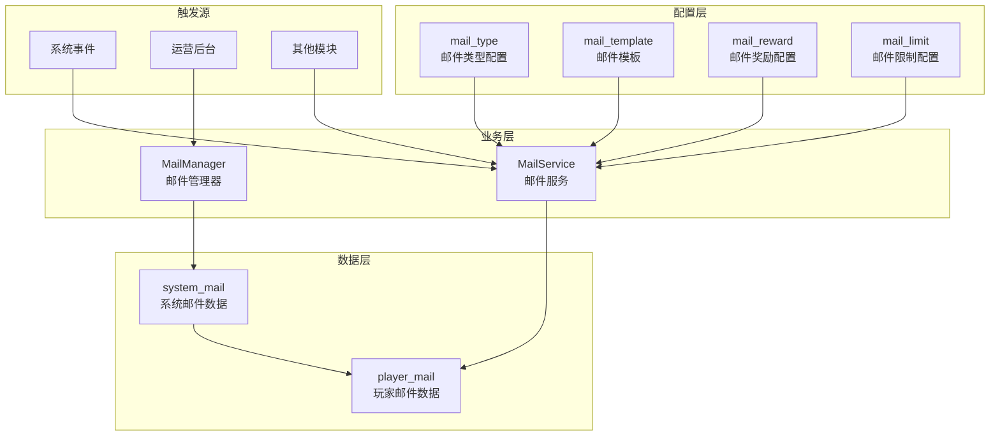
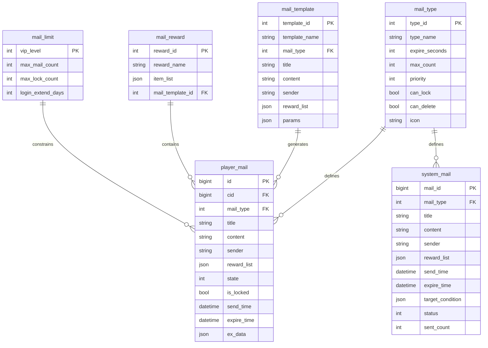
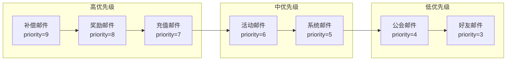
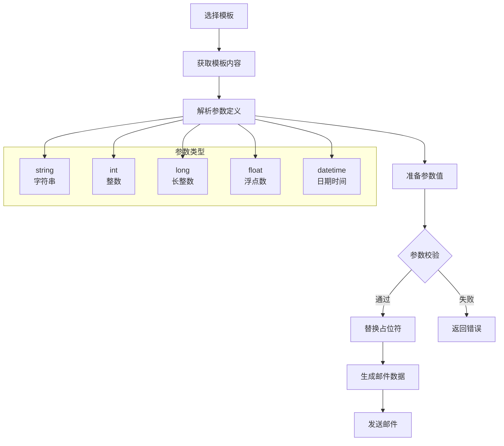
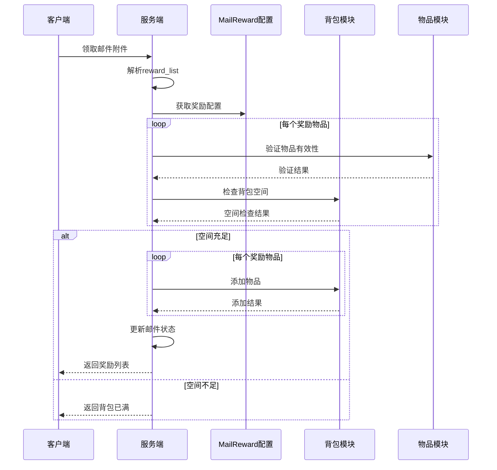
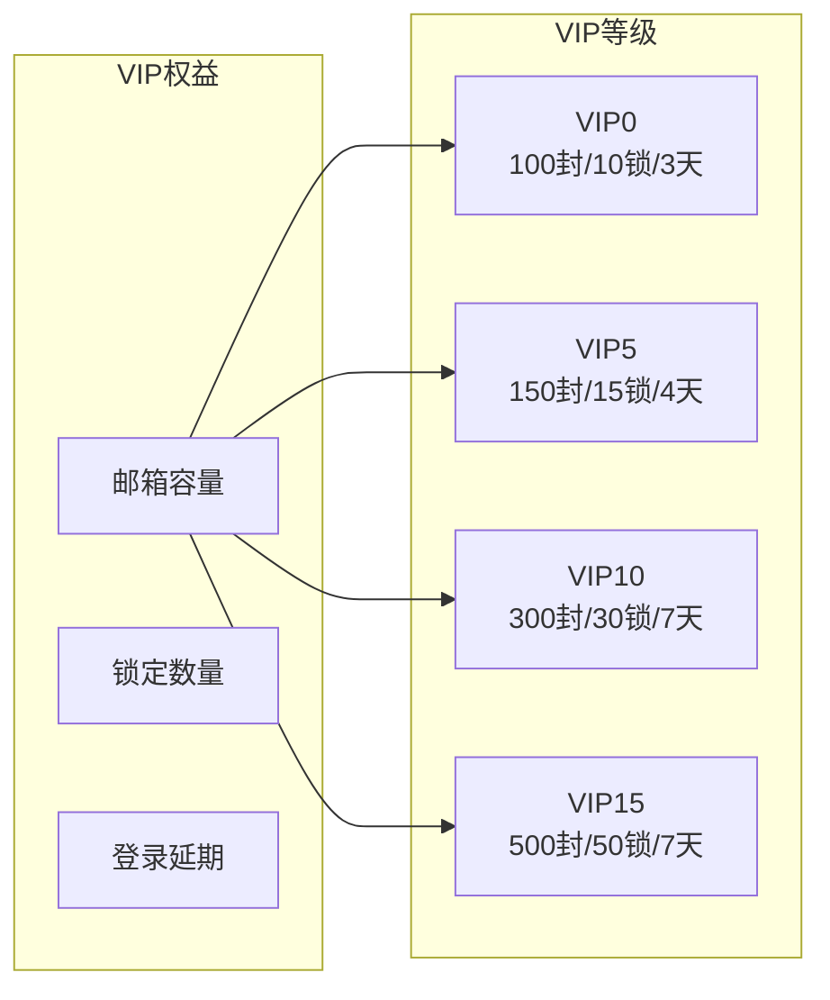
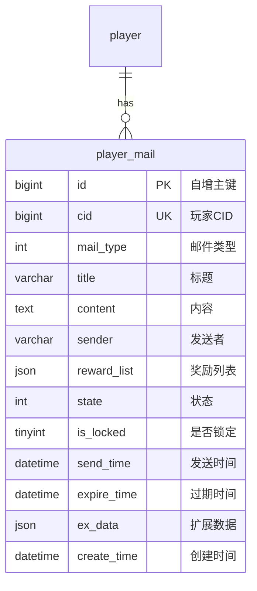
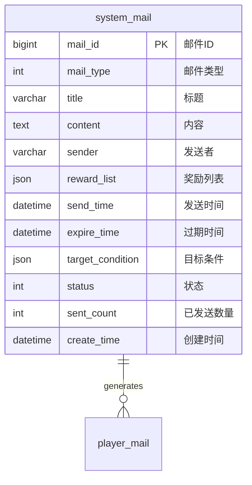
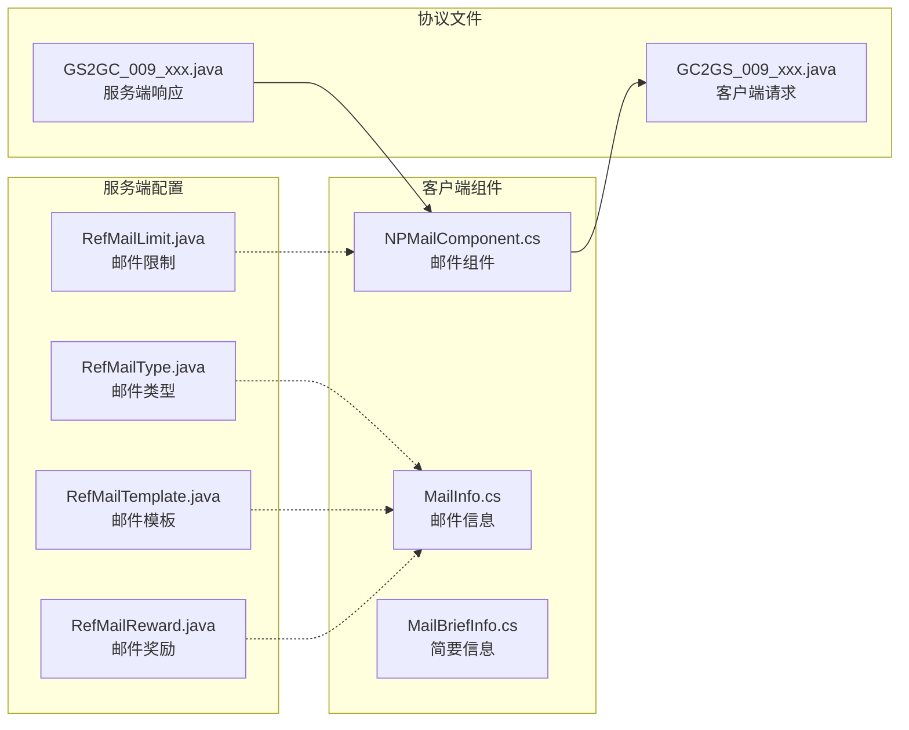
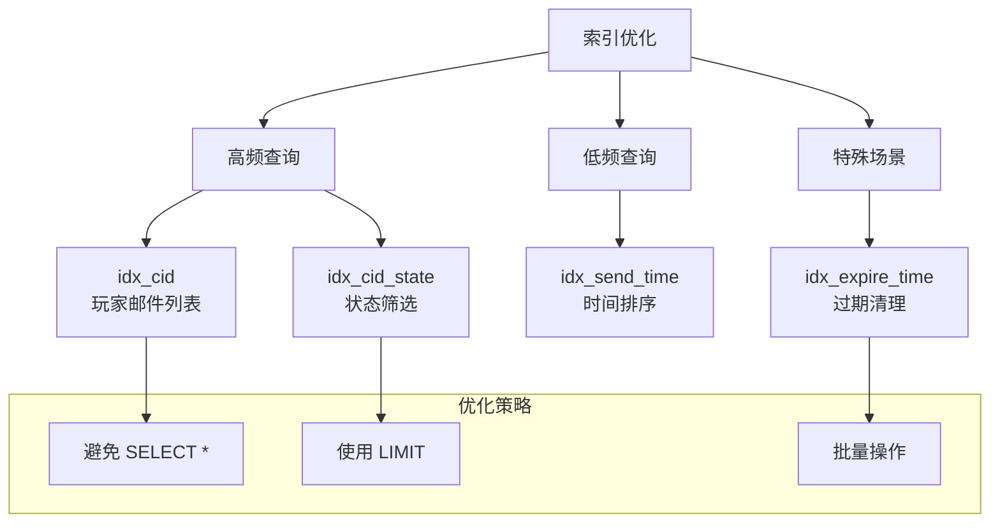

# 邮件系统 - 数据配表

## 概述

邮件系统 (MailOp, p009) 是游戏中的通信和奖励发放系统，支持系统邮件、奖励邮件、公告邮件等多种类型。本模块涉及 4 张配表和 2 张数据库表。

---

## 配表架构总览

### 系统架构图



### 配表关系图



---

## 配表文件列表

| 配表名称 | 表名 | 文件位置 | 用途 | 更新频率 |
|---------|------|----------|------|----------|
| 邮件类型配置 | mail_type | RefMailType.java | 定义邮件类型和有效期 | 低 |
| 邮件模板 | mail_template | RefMailTemplate.java | 预设邮件模板 | 中 |
| 邮件奖励配置 | mail_reward | RefMailReward.java | 奖励发放规则 | 中 |
| 邮件限制配置 | mail_limit | RefMailLimit.java | 容量和锁定限制 | 低 |

---

## 1. 邮件类型配置 (mail_type)

**文件位置**: `game_server/GameRes/src/NPGameRes/Refs/Mail/RefMailType.java`

### 完整字段列表

| 字段名 | 类型 | 必填 | 默认值 | 取值范围 | 说明 |
|-------|------|------|--------|----------|------|
| type_id | int | 是 | - | 1-100 | 类型ID (主键) |
| type_name | string | 是 | - | 1-32字符 | 类型名称 |
| expire_seconds | int | 是 | 604800 | 3600-2592000 | 过期时间(秒)，默认7天 |
| max_count | int | 是 | 100 | 10-500 | 最大数量限制 |
| priority | int | 是 | 0 | 0-10 | 显示优先级(越大越靠前) |
| can_lock | boolean | 是 | true | true/false | 是否支持锁定 |
| can_delete | boolean | 是 | true | true/false | 是否可手动删除 |
| icon | string | 否 | "" | - | 类型图标路径 |

### 字段详细说明

#### type_id (类型ID)
- **作用**: 唯一标识邮件类型
- **取值规则**: 1-100，保留 101-255 用于扩展
- **关联关系**: 与 player_mail.mail_type 关联

#### expire_seconds (过期时间)
- **作用**: 定义该类型邮件的默认有效期
- **计算方式**: 过期时间 = 发送时间 + expire_seconds
- **特殊值**:
  - 0: 永不过期 (仅系统邮件)
  - -1: 跟随玩家账号生命周期

#### priority (优先级)
- **作用**: 决定邮件在列表中的默认排序权重
- **排序规则**: priority 越大越靠前，相同则按发送时间排序
- **推荐值**:
  - 补偿邮件: 9 (最高)
  - 奖励邮件: 8
  - 充值邮件: 7
  - 活动邮件: 6
  - 系统邮件: 5
  - 公会邮件: 4
  - 好友邮件: 3

### 类型关系图



### 邮件类型枚举 (EMailType)

```java
public enum EMailType
{
    SYSTEM(1, "系统邮件", 604800, 100, true, true),      // 系统邮件
    REWARD(2, "奖励邮件", 2592000, 200, true, true),    // 奖励邮件
    FRIEND(3, "好友邮件", 604800, 50, true, true),      // 好友邮件
    GUILD(4, "公会邮件", 604800, 100, true, true),      // 公会邮件
    ACTIVITY(5, "活动邮件", 1209600, 150, true, true), // 活动邮件
    RECHARGE(6, "充值邮件", 2592000, 200, true, true),  // 充值邮件
    COMPENSATE(7, "补偿邮件", 2592000, 100, true, true); // 补偿邮件

    private final int value;
    private final String name;
    private final int expireSeconds;
    private final int maxCount;
    private final boolean canLock;
    private final boolean canDelete;

    EMailType(int value, String name, int expireSeconds, int maxCount,
              boolean canLock, boolean canDelete)
    {
        this.value = value;
        this.name = name;
        this.expireSeconds = expireSeconds;
        this.maxCount = maxCount;
        this.canLock = canLock;
        this.canDelete = canDelete;
    }

    public int getValue() { return value; }
    public String getName() { return name; }
    public int getExpireSeconds() { return expireSeconds; }
    public int getMaxCount() { return maxCount; }
    public boolean canLock() { return canLock; }
    public boolean canDelete() { return canDelete; }

    public static EMailType valueOf(int value)
    {
        for (EMailType type : values())
        {
            if (type.value == value) return type;
        }
        return SYSTEM;
    }

    /**
     * 获取过期时间
     * @param sendTime 发送时间
     * @return 过期时间
     */
    public Date calculateExpireTime(Date sendTime)
    {
        Calendar cal = Calendar.getInstance();
        cal.setTime(sendTime);
        cal.add(Calendar.SECOND, expireSeconds);
        return cal.getTime();
    }

    /**
     * 是否已过期
     */
    public boolean isExpired(Date expireTime)
    {
        return expireTime != null && expireTime.before(new Date());
    }
}
```

### 配置示例 (JSON)

```json
[
    {
        "type_id": 1,
        "type_name": "系统邮件",
        "expire_seconds": 604800,
        "max_count": 100,
        "priority": 5,
        "can_lock": true,
        "can_delete": true,
        "icon": "mail_system.png"
    },
    {
        "type_id": 2,
        "type_name": "奖励邮件",
        "expire_seconds": 2592000,
        "max_count": 200,
        "priority": 8,
        "can_lock": true,
        "can_delete": true,
        "icon": "mail_reward.png"
    },
    {
        "type_id": 3,
        "type_name": "好友邮件",
        "expire_seconds": 604800,
        "max_count": 50,
        "priority": 3,
        "can_lock": true,
        "can_delete": true,
        "icon": "mail_friend.png"
    },
    {
        "type_id": 4,
        "type_name": "公会邮件",
        "expire_seconds": 604800,
        "max_count": 100,
        "priority": 4,
        "can_lock": true,
        "can_delete": true,
        "icon": "mail_guild.png"
    },
    {
        "type_id": 5,
        "type_name": "活动邮件",
        "expire_seconds": 1209600,
        "max_count": 150,
        "priority": 6,
        "can_lock": true,
        "can_delete": true,
        "icon": "mail_activity.png"
    },
    {
        "type_id": 6,
        "type_name": "充值邮件",
        "expire_seconds": 2592000,
        "max_count": 200,
        "priority": 7,
        "can_lock": true,
        "can_delete": true,
        "icon": "mail_recharge.png"
    },
    {
        "type_id": 7,
        "type_name": "补偿邮件",
        "expire_seconds": 2592000,
        "max_count": 100,
        "priority": 9,
        "can_lock": true,
        "can_delete": true,
        "icon": "mail_compensate.png"
    }
]
```

---

## 2. 邮件模板 (mail_template)

**文件位置**: `game_server/GameRes/src/NPGameRes/Refs/Mail/RefMailTemplate.java`

### 完整字段列表

| 字段名 | 类型 | 必填 | 默认值 | 取值范围 | 说明 |
|-------|------|------|--------|----------|------|
| template_id | int | 是 | - | > 0 | 模板ID (主键) |
| template_name | string | 是 | - | 1-64字符 | 模板名称 |
| mail_type | int | 是 | - | 1-7 | 邮件类型 |
| title | string | 是 | - | 1-100字符 | 邮件标题 |
| content | string | 是 | - | 1-5000字符 | 邮件内容 |
| sender | string | 是 | "系统" | 1-32字符 | 发送者名称 |
| reward_list | json | 否 | [] | - | 默认奖励列表 |
| params | json | 否 | {} | - | 参数定义 |

### 字段详细说明

#### template_id (模板ID)
- **取值范围**: 1001-9999
- **分配规则**:
  - 1001-1999: 系统内置模板
  - 2001-3999: 活动模板
  - 4001-5999: 运营模板
  - 6001-9999: 临时模板

#### title/content (标题/内容)
- **支持参数占位符**: 使用 `{param_name}` 格式
- **参数替换**: 在发送时动态替换

#### reward_list (奖励列表)
- **格式**: JSON 数组
- **结构**:
  ```json
  [
    {"type": 1, "id": 50001, "count": 1},
    {"type": 2, "id": 2, "count": 100}
  ]
  ```

### 模板参数系统



### 模板参数定义

```java
public class MailTemplateParam
{
    // 常用参数占位符
    public static final String PARAM_PLAYER_NAME = "{player_name}";
    public static final String PARAM_ITEM_NAME = "{item_name}";
    public static final String PARAM_COUNT = "{count}";
    public static final String PARAM_TIME = "{time}";
    public static final String PARAM_RANK = "{rank}";
    public static final String PARAM_AMOUNT = "{amount}";
    public static final String PARAM_DIAMOND = "{diamond}";
    public static final String PARAM_GUILD_NAME = "{guild_name}";
    public static final String PARAM_BOSS_NAME = "{boss_name}";
    public static final String PARAM_DAMAGE = "{damage}";
    public static final String PARAM_ACTIVITY_NAME = "{activity_name}";

    /**
     * 替换模板参数
     * @param template 模板字符串
     * @param params 参数映射
     * @return 替换后的字符串
     */
    public static String replaceParams(String template, Map<String, Object> params)
    {
        if (template == null || params == null)
            return template;

        String result = template;
        for (Map.Entry<String, Object> entry : params.entrySet())
        {
            String placeholder = "{" + entry.getKey() + "}";
            String value = String.valueOf(entry.getValue());
            result = result.replace(placeholder, value);
        }
        return result;
    }

    /**
     * 验证参数完整性
     * @param template 模板
     * @param params 参数
     * @return 缺失的参数列表
     */
    public static List<String> validateParams(String template, Map<String, Object> params)
    {
        List<String> missingParams = new ArrayList<>();
        Pattern pattern = Pattern.compile("\\{(\\w+)\\}");
        Matcher matcher = pattern.matcher(template);

        while (matcher.find())
        {
            String paramName = matcher.group(1);
            if (!params.containsKey(paramName))
            {
                missingParams.add(paramName);
            }
        }
        return missingParams;
    }
}
```

### 配置示例

```json
[
    {
        "template_id": 1001,
        "template_name": "每日签到奖励",
        "mail_type": 2,
        "title": "每日签到奖励",
        "content": "尊敬的{player_name}，您已连续签到{count}天，请查收您的奖励！",
        "sender": "签到系统",
        "reward_list": [],
        "params": {
            "player_name": "string",
            "count": "int"
        }
    },
    {
        "template_id": 1002,
        "template_name": "充值成功",
        "mail_type": 6,
        "title": "充值成功通知",
        "content": "您已成功充值{amount}元，获得钻石{diamond}颗，感谢您的支持！",
        "sender": "充值中心",
        "reward_list": [],
        "params": {
            "amount": "int",
            "diamond": "int"
        }
    },
    {
        "template_id": 1003,
        "template_name": "竞技场排名奖励",
        "mail_type": 2,
        "title": "竞技场周排名奖励",
        "content": "恭喜您在竞技场周排名中获得第{rank}名！以下是您的排名奖励。",
        "sender": "竞技场系统",
        "reward_list": [],
        "params": {
            "rank": "int"
        }
    },
    {
        "template_id": 1004,
        "template_name": "服务器维护补偿",
        "mail_type": 7,
        "title": "服务器维护补偿",
        "content": "尊敬的玩家，由于服务器紧急维护，给您带来的不便深表歉意。特发放以下补偿，请查收。",
        "sender": "游戏运营团队",
        "reward_list": [
            {"type": 2, "id": 2, "count": 100},
            {"type": 2, "id": 1, "count": 500}
        ],
        "params": {}
    },
    {
        "template_id": 1005,
        "template_name": "公会副本奖励",
        "mail_type": 4,
        "title": "公会副本结算奖励",
        "content": "您的公会在{boss_name}副本中排名第{rank}名，您获得{damage}伤害贡献奖励！",
        "sender": "公会系统",
        "reward_list": [],
        "params": {
            "boss_name": "string",
            "rank": "int",
            "damage": "long"
        }
    },
    {
        "template_id": 1006,
        "template_name": "活动排名奖励",
        "mail_type": 5,
        "title": "{activity_name}活动奖励",
        "content": "恭喜您在{activity_name}活动中获得第{rank}名！奖励已发放，请查收。",
        "sender": "活动中心",
        "reward_list": [],
        "params": {
            "activity_name": "string",
            "rank": "int"
        }
    },
    {
        "template_id": 1007,
        "template_name": "好友赠送",
        "mail_type": 3,
        "title": "{sender_name}向您赠送了礼物",
        "content": "您的好友{sender_name}向您赠送了{item_name}x{count}，请查收！",
        "sender": "好友系统",
        "reward_list": [],
        "params": {
            "sender_name": "string",
            "item_name": "string",
            "count": "int"
        }
    }
]
```

### 模板使用示例

```java
public class MailTemplateExample
{
    /**
     * 使用模板发送签到奖励邮件
     */
    public void sendSignInRewardMail(long playerId, String playerName, int signInDays)
    {
        // 1. 准备参数
        Map<String, Object> params = new HashMap<>();
        params.put("player_name", playerName);
        params.put("count", signInDays);

        // 2. 从模板创建邮件
        MailData mailData = MailRefHelper.createMailFromTemplate(1001, params);

        // 3. 动态设置奖励
        List<RewardInfo> rewards = calculateSignInReward(signInDays);
        mailData.setRewardList(rewards);

        // 4. 发送邮件
        mailService.sendMail(playerId, mailData);
    }

    /**
     * 使用模板发送竞技场排名奖励
     */
    public void sendArenaRankRewardMail(long playerId, int rank)
    {
        Map<String, Object> params = new HashMap<>();
        params.put("rank", rank);

        MailData mailData = MailRefHelper.createMailFromTemplate(1003, params);
        mailData.setRewardList(getArenaRankReward(rank));

        mailService.sendMail(playerId, mailData);
    }
}
```

---

## 3. 邮件奖励配置 (mail_reward)

**文件位置**: `game_server/GameRes/src/NPGameRes/Refs/Mail/RefMailReward.java`

### 完整字段列表

| 字段名 | 类型 | 必填 | 默认值 | 取值范围 | 说明 |
|-------|------|------|--------|----------|------|
| reward_id | int | 是 | - | > 0 | 奖励ID (主键) |
| reward_name | string | 是 | - | 1-64字符 | 奖励名称 |
| item_list | json | 是 | [] | - | 物品列表 |
| mail_template_id | int | 否 | 0 | > 0 | 关联的邮件模板ID |

### 奖励物品结构

```java
public class MailRewardItem
{
    public ENPItemType type;  // 物品类型
    public long id;           // 物品ID
    public int count;         // 数量
    public int expireSeconds; // 过期时间(秒)，0表示不过期

    /**
     * 转换为通用消耗物品
     */
    public NPCommonCostItem toCostItem()
    {
        return new NPCommonCostItem(type, id, count);
    }

    /**
     * 验证物品有效性
     */
    public boolean isValid()
    {
        if (type == null) return false;
        if (id <= 0) return false;
        if (count <= 0) return false;
        return true;
    }
}
```

### 物品类型枚举

```java
public enum ENPItemType
{
    ITEM(1, "道具"),
    CURRENCY(2, "货币"),
    HERO(3, "英雄"),
    EQUIPMENT(4, "装备"),
    SKIN(5, "皮肤"),
    TITLE(6, "称号");

    private final int value;
    private final String name;

    ENPItemType(int value, String name)
    {
        this.value = value;
        this.name = name;
    }

    public int getValue() { return value; }
    public String getName() { return name; }
}
```

### 奖励发放流程



### 配置示例

```json
[
    {
        "reward_id": 1,
        "reward_name": "新手礼包",
        "item_list": [
            {"type": 2, "id": 2, "count": 100, "expire_seconds": 0},
            {"type": 2, "id": 1, "count": 10000, "expire_seconds": 0},
            {"type": 1, "id": 50001, "count": 1, "expire_seconds": 0}
        ],
        "mail_template_id": 1001
    },
    {
        "reward_id": 2,
        "reward_name": "VIP每日奖励",
        "item_list": [
            {"type": 2, "id": 2, "count": 50, "expire_seconds": 0},
            {"type": 2, "id": 3, "count": 100, "expire_seconds": 0}
        ],
        "mail_template_id": 0
    },
    {
        "reward_id": 3,
        "reward_name": "竞技场前三名奖励",
        "item_list": [
            {"type": 2, "id": 2, "count": 300, "expire_seconds": 0},
            {"type": 2, "id": 3, "count": 1000, "expire_seconds": 0},
            {"type": 1, "id": 60001, "count": 5, "expire_seconds": 0},
            {"type": 1, "id": 70001, "count": 1, "expire_seconds": 0}
        ],
        "mail_template_id": 1003
    },
    {
        "reward_id": 4,
        "reward_name": "服务器维护补偿",
        "item_list": [
            {"type": 2, "id": 2, "count": 100, "expire_seconds": 0},
            {"type": 2, "id": 1, "count": 500, "expire_seconds": 0},
            {"type": 1, "id": 40001, "count": 2, "expire_seconds": 0}
        ],
        "mail_template_id": 1004
    },
    {
        "reward_id": 5,
        "reward_name": "首充奖励",
        "item_list": [
            {"type": 2, "id": 2, "count": 500, "expire_seconds": 0},
            {"type": 3, "id": 1001, "count": 1, "expire_seconds": 0},
            {"type": 1, "id": 80001, "count": 10, "expire_seconds": 0}
        ],
        "mail_template_id": 1002
    },
    {
        "reward_id": 6,
        "reward_name": "限时活动奖励",
        "item_list": [
            {"type": 1, "id": 90001, "count": 1, "expire_seconds": 604800},
            {"type": 2, "id": 4, "count": 200, "expire_seconds": 0}
        ],
        "mail_template_id": 1006
    }
]
```

---

## 4. 邮件限制配置 (mail_limit)

**文件位置**: `game_server/GameRes/src/NPGameRes/Refs/Mail/RefMailLimit.java`

### 完整字段列表

| 字段名 | 类型 | 必填 | 默认值 | 取值范围 | 说明 |
|-------|------|------|--------|----------|------|
| vip_level | int | 是 | - | 0-100 | VIP等级 (主键) |
| max_mail_count | int | 是 | 100 | 50-500 | 邮箱容量上限 |
| max_lock_count | int | 是 | 10 | 5-50 | 最大锁定数量 |
| login_extend_days | int | 是 | 3 | 0-7 | 登录延期天数 |

### 字段详细说明

#### max_mail_count (邮箱容量)
- **作用**: 定义玩家的邮箱最大邮件数量
- **增长规则**: 每 VIP 等级增加 10 封容量
- **上限**: 500 封

#### max_lock_count (最大锁定数)
- **作用**: 定义玩家可锁定的邮件数量
- **用途**: 防止重要邮件被自动删除
- **增长规则**: 每 VIP 等级增加 1 个锁定位

#### login_extend_days (登录延期)
- **作用**: 玩家登录后延长邮件有效期
- **计算方式**: 实际过期 = max(原过期时间, 登录时间 + 延期天数)

### VIP 权益关系图



### 容量管理器

```java
public class MailCapacityManager
{
    /**
     * 获取玩家邮箱容量
     */
    public static int getMailCapacity(int vipLevel)
    {
        RefMailLimit ref = RefMailLimit.getMgr().get(vipLevel);
        if (ref == null)
            ref = RefMailLimit.getMgr().get(0); // 默认配置

        return ref.max_mail_count;
    }

    /**
     * 获取最大锁定数量
     */
    public static int getMaxLockCount(int vipLevel)
    {
        RefMailLimit ref = RefMailLimit.getMgr().get(vipLevel);
        if (ref == null)
            ref = RefMailLimit.getMgr().get(0);

        return ref.max_lock_count;
    }

    /**
     * 计算实际过期时间
     */
    public static Date calculateExpireTime(int vipLevel, Date sendTime, int mailType)
    {
        RefMailLimit ref = RefMailLimit.getMgr().get(vipLevel);
        if (ref == null)
            ref = RefMailLimit.getMgr().get(0);

        RefMailType typeRef = RefMailType.getMgr().get(mailType);
        int expireSeconds = typeRef.expire_seconds;

        // 登录延期
        int extendDays = ref.login_extend_days;

        Calendar cal = Calendar.getInstance();
        cal.setTime(sendTime);
        cal.add(Calendar.SECOND, expireSeconds);
        cal.add(Calendar.DAY_OF_MONTH, extendDays);

        return cal.getTime();
    }

    /**
     * 检查邮箱是否已满
     */
    public static boolean isMailBoxFull(long playerId)
    {
        int vipLevel = playerService.getVipLevel(playerId);
        int maxCapacity = getMailCapacity(vipLevel);
        int currentCount = mailDao.countByCid(playerId);

        return currentCount >= maxCapacity;
    }

    /**
     * 检查是否可以锁定更多邮件
     */
    public static boolean canLockMore(long playerId)
    {
        int vipLevel = playerService.getVipLevel(playerId);
        int maxLock = getMaxLockCount(vipLevel);
        int currentLock = mailDao.countLocked(playerId);

        return currentLock < maxLock;
    }
}
```

### 配置示例

| vip_level | max_mail_count | max_lock_count | login_extend_days | 说明 |
|-----------|----------------|----------------|-------------------|------|
| 0 | 100 | 10 | 3 | 普通玩家 |
| 1 | 110 | 11 | 3 | VIP1 |
| 2 | 120 | 12 | 3 | VIP2 |
| 3 | 130 | 13 | 3 | VIP3 |
| 4 | 140 | 14 | 4 | VIP4 |
| 5 | 150 | 15 | 4 | VIP5 |
| 6 | 160 | 16 | 4 | VIP6 |
| 7 | 180 | 18 | 5 | VIP7 |
| 8 | 200 | 20 | 5 | VIP8 |
| 9 | 250 | 25 | 6 | VIP9 |
| 10 | 300 | 30 | 7 | VIP10 |
| 11 | 350 | 35 | 7 | VIP11 |
| 12 | 400 | 40 | 7 | VIP12 |
| 13 | 450 | 45 | 7 | VIP13 |
| 14 | 500 | 50 | 7 | VIP14 |
| 15 | 500 | 50 | 7 | VIP15 |

---

## 数据库表结构

### player_mail (玩家邮件数据表)



#### 完整字段定义

| 字段名 | 类型 | 是否主键 | 是否索引 | 默认值 | 说明 |
|-------|------|----------|----------|--------|------|
| id | bigint(20) | 是 | 是 | 自增 | 主键 |
| cid | bigint(20) | 否 | 是 | - | 玩家CID |
| mail_type | int(11) | 否 | 是 | 1 | 邮件类型 |
| title | varchar(255) | 否 | 否 | - | 邮件标题 |
| content | text | 否 | 否 | - | 邮件内容 |
| sender | varchar(64) | 否 | 否 | - | 发送者名称 |
| reward_list | json | 否 | 否 | NULL | 奖励列表(JSON) |
| state | int(11) | 否 | 是 | 0 | 邮件状态 |
| is_locked | tinyint(1) | 否 | 否 | 0 | 是否锁定 |
| send_time | datetime | 否 | 是 | - | 发送时间 |
| expire_time | datetime | 否 | 是 | - | 过期时间 |
| ex_data | json | 否 | 否 | NULL | 扩展数据(JSON) |
| create_time | datetime | 否 | 否 | CURRENT_TIMESTAMP | 创建时间 |

#### 索引设计

```sql
-- 主键索引
PRIMARY KEY (`id`)

-- 玩家ID索引 (高频查询)
KEY `idx_cid` (`cid`)

-- 组合索引 (状态查询)
KEY `idx_cid_state` (`cid`, `state`)

-- 过期时间索引 (定时清理)
KEY `idx_expire_time` (`expire_time`)

-- 发送时间索引 (排序查询)
KEY `idx_send_time` (`send_time`)
```

### system_mail (系统邮件数据表)



#### 完整字段定义

| 字段名 | 类型 | 是否主键 | 是否索引 | 默认值 | 说明 |
|-------|------|----------|----------|--------|------|
| mail_id | bigint(20) | 是 | 是 | 自增 | 邮件ID |
| mail_type | int(11) | 否 | 是 | 1 | 邮件类型 |
| title | varchar(255) | 否 | 否 | - | 邮件标题 |
| content | text | 否 | 否 | - | 邮件内容 |
| sender | varchar(64) | 否 | 否 | - | 发送者名称 |
| reward_list | json | 否 | 否 | NULL | 奖励列表(JSON) |
| send_time | datetime | 否 | 是 | - | 发送时间 |
| expire_time | datetime | 否 | 是 | - | 过期时间 |
| target_condition | json | 否 | 否 | NULL | 目标玩家条件(JSON) |
| status | int(11) | 否 | 是 | 0 | 发送状态 |
| sent_count | int(11) | 否 | 否 | 0 | 已发送数量 |
| create_time | datetime | 否 | 否 | CURRENT_TIMESTAMP | 创建时间 |

---

## SQL 建表语句

### player_mail 表

```sql
CREATE TABLE `player_mail` (
    `id` bigint(20) NOT NULL AUTO_INCREMENT COMMENT '主键ID',
    `cid` bigint(20) NOT NULL COMMENT '玩家CID',
    `mail_type` int(11) NOT NULL DEFAULT '1' COMMENT '邮件类型',
    `title` varchar(255) NOT NULL COMMENT '邮件标题',
    `content` text NOT NULL COMMENT '邮件内容',
    `sender` varchar(64) NOT NULL COMMENT '发送者名称',
    `reward_list` json DEFAULT NULL COMMENT '奖励列表(JSON)',
    `state` int(11) NOT NULL DEFAULT '0' COMMENT '邮件状态(0未读/1已读/2已领取)',
    `is_locked` tinyint(1) NOT NULL DEFAULT '0' COMMENT '是否锁定',
    `send_time` datetime NOT NULL COMMENT '发送时间',
    `expire_time` datetime NOT NULL COMMENT '过期时间',
    `ex_data` json DEFAULT NULL COMMENT '扩展数据(JSON)',
    `create_time` timestamp NOT NULL DEFAULT CURRENT_TIMESTAMP COMMENT '创建时间',
    PRIMARY KEY (`id`),
    KEY `idx_cid` (`cid`),
    KEY `idx_cid_state` (`cid`, `state`),
    KEY `idx_expire_time` (`expire_time`),
    KEY `idx_send_time` (`send_time`)
) ENGINE=InnoDB DEFAULT CHARSET=utf8mb4 COMMENT='玩家邮件数据表';
```

### system_mail 表

```sql
CREATE TABLE `system_mail` (
    `mail_id` bigint(20) NOT NULL AUTO_INCREMENT COMMENT '邮件ID',
    `mail_type` int(11) NOT NULL DEFAULT '1' COMMENT '邮件类型',
    `title` varchar(255) NOT NULL COMMENT '邮件标题',
    `content` text NOT NULL COMMENT '邮件内容',
    `sender` varchar(64) NOT NULL COMMENT '发送者名称',
    `reward_list` json DEFAULT NULL COMMENT '奖励列表(JSON)',
    `send_time` datetime NOT NULL COMMENT '发送时间',
    `expire_time` datetime NOT NULL COMMENT '过期时间',
    `target_condition` json DEFAULT NULL COMMENT '目标玩家条件(JSON)',
    `status` int(11) NOT NULL DEFAULT '0' COMMENT '发送状态(0草稿/1待发送/2发送中/3已发送)',
    `sent_count` int(11) NOT NULL DEFAULT '0' COMMENT '已发送数量',
    `create_time` timestamp NOT NULL DEFAULT CURRENT_TIMESTAMP COMMENT '创建时间',
    PRIMARY KEY (`mail_id`),
    KEY `idx_status` (`status`),
    KEY `idx_send_time` (`send_time`),
    KEY `idx_expire_time` (`expire_time`)
) ENGINE=InnoDB DEFAULT CHARSET=utf8mb4 COMMENT='系统邮件数据表';
```

---

## 枚举定义

### EMailState (邮件状态)

```java
public enum EMailState
{
    UNREAD(0, "未读"),
    READ(1, "已读"),
    REWARD_TAKEN(2, "附件已领取");

    private final int value;
    private final String name;

    EMailState(int value, String name)
    {
        this.value = value;
        this.name = name;
    }

    public int getValue() { return value; }
    public String getName() { return name; }

    public static EMailState valueOf(int value)
    {
        for (EMailState state : values())
        {
            if (state.value == value) return state;
        }
        return UNREAD;
    }

    /**
     * 是否可以领取附件
     */
    public boolean canTakeReward()
    {
        return this != REWARD_TAKEN;
    }

    /**
     * 是否未读
     */
    public boolean isUnread()
    {
        return this == UNREAD;
    }
}
```

### ESystemMailStatus (系统邮件状态)

```java
public enum ESystemMailStatus
{
    DRAFT(0, "草稿"),
    PENDING(1, "待发送"),
    SENDING(2, "发送中"),
    SENT(3, "已发送");

    private final int value;
    private final String name;

    ESystemMailStatus(int value, String name)
    {
        this.value = value;
        this.name = name;
    }

    public int getValue() { return value; }
    public String getName() { return name; }

    public static ESystemMailStatus valueOf(int value)
    {
        for (ESystemMailStatus status : values())
        {
            if (status.value == value) return status;
        }
        return DRAFT;
    }
}
```

---

## 配表工具类

### MailRefHelper

```java
public class MailRefHelper
{
    /**
     * 获取邮件类型配置
     */
    public static RefMailType getMailType(int mailType)
    {
        return RefMailType.getMgr().get(mailType);
    }

    /**
     * 获取邮件模板
     */
    public static RefMailTemplate getTemplate(int templateId)
    {
        return RefMailTemplate.getMgr().get(templateId);
    }

    /**
     * 获取玩家邮箱容量
     */
    public static int getMailCapacity(int vipLevel)
    {
        RefMailLimit ref = RefMailLimit.getMgr().get(vipLevel);
        return ref != null ? ref.max_mail_count : 100;
    }

    /**
     * 获取最大锁定数量
     */
    public static int getMaxLockCount(int vipLevel)
    {
        RefMailLimit ref = RefMailLimit.getMgr().get(vipLevel);
        return ref != null ? ref.max_lock_count : 10;
    }

    /**
     * 根据模板创建邮件
     */
    public static MailData createMailFromTemplate(int templateId, Map<String, Object> params)
    {
        RefMailTemplate template = getTemplate(templateId);
        if (template == null)
            return null;

        MailData mailData = new MailData();
        mailData.setMailType(template.mail_type);
        mailData.setTitle(MailTemplateParam.replaceParams(template.title, params));
        mailData.setContent(MailTemplateParam.replaceParams(template.content, params));
        mailData.setSender(template.sender);
        mailData.setRewardList(template.reward_list);

        return mailData;
    }

    /**
     * 获取奖励配置
     */
    public static List<MailRewardItem> getRewardItems(int rewardId)
    {
        RefMailReward ref = RefMailReward.getMgr().get(rewardId);
        if (ref == null)
            return Collections.emptyList();

        return ref.item_list;
    }

    /**
     * 获取登录延期天数
     */
    public static int getLoginExtendDays(int vipLevel)
    {
        RefMailLimit ref = RefMailLimit.getMgr().get(vipLevel);
        return ref != null ? ref.login_extend_days : 3;
    }
}
```

---

## 数据迁移脚本

### 新增字段迁移

```sql
-- 添加扩展数据字段
ALTER TABLE `player_mail`
ADD COLUMN `ex_data` json DEFAULT NULL COMMENT '扩展数据(JSON)' AFTER `expire_time`;

-- 添加登录延期字段
ALTER TABLE `player_mail`
ADD COLUMN `extend_days` int(11) NOT NULL DEFAULT '0' COMMENT '延期天数' AFTER `ex_data`;
```

### 历史数据归档

```sql
-- 创建归档表
CREATE TABLE `player_mail_archive` LIKE `player_mail`;

-- 归档30天前的已读已领取邮件
INSERT INTO `player_mail_archive`
SELECT * FROM `player_mail`
WHERE `create_time` < DATE_SUB(NOW(), INTERVAL 30 DAY)
  AND `state` = 2
  AND `is_locked` = 0;

-- 删除已归档数据
DELETE FROM `player_mail`
WHERE `create_time` < DATE_SUB(NOW(), INTERVAL 30 DAY)
  AND `state` = 2
  AND `is_locked` = 0;
```

---

## 配表路径汇总



---

## 索引性能分析

### 查询场景与索引使用

```sql
-- 场景1: 查询玩家邮件列表
-- 使用索引: idx_cid
EXPLAIN SELECT * FROM player_mail WHERE cid = 12345678 ORDER BY send_time DESC;
-- 结果: type=ref, key=idx_cid, rows≈100

-- 场景2: 统计未读邮件数量
-- 使用索引: idx_cid_state
EXPLAIN SELECT COUNT(*) FROM player_mail WHERE cid = 12345678 AND state = 0;
-- 结果: type=ref, key=idx_cid_state, rows≈10

-- 场景3: 清理过期邮件
-- 使用索引: idx_expire_time
EXPLAIN SELECT id FROM player_mail WHERE expire_time < NOW() LIMIT 10000;
-- 结果: type=range, key=idx_expire_time, rows≈10000

-- 场景4: 查询有附件未领取的邮件
-- 使用索引: idx_cid_state
EXPLAIN SELECT * FROM player_mail WHERE cid = 12345678 AND state < 2 AND reward_list IS NOT NULL;
-- 结果: type=ref, key=idx_cid_state, rows≈50
```

### 索引优化建议



---

*文档生成时间: 2026-04-11*
