# 邮件系统 - 协议文档

## 协议编号

模块编号：p009 (MailOp)

---

## 协议架构总览

### 协议分类图

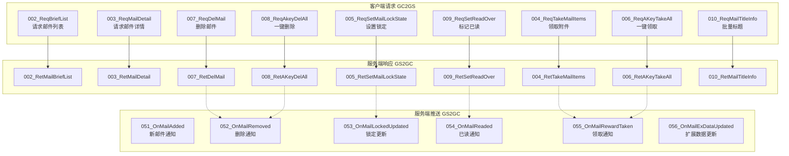

### 协议通信序列图

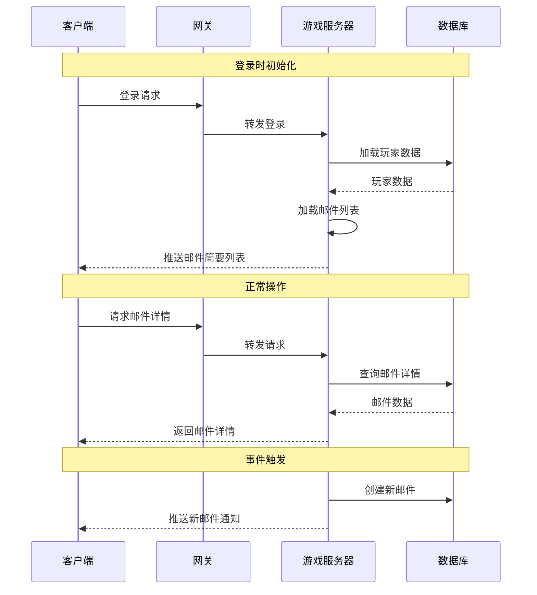

---

## 客户端请求协议 (GC2GS)

### GC2GS_009_002_ReqBriefList

**说明**：请求邮件简要列表

**触发场景**：
- 玩家打开邮箱界面
- 玩家下拉刷新邮件列表
- 登录后初始化邮件数据

**请求参数**：无

```protobuf
message GC2GS_009_002_ReqBriefList
{
    // 无参数
}
```

**响应**：GS2GC_009_002_RetMailBriefList

**服务端处理流程**：

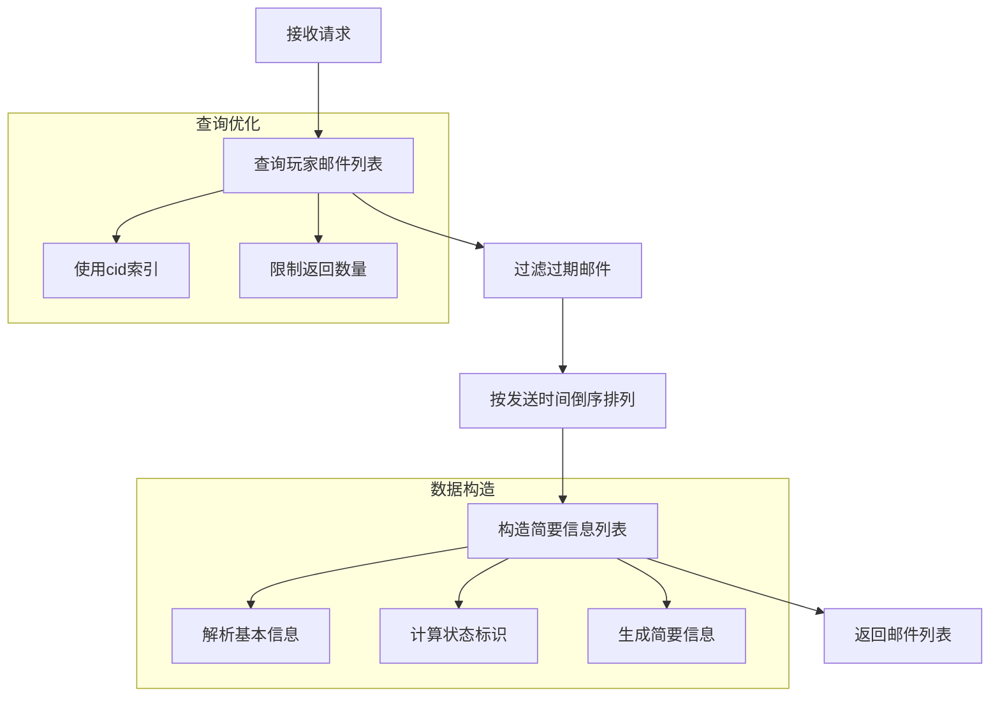

**代码实现**：

```java
public void reqBriefList(long cid, GC2GS_009_002_ReqBriefList req)
{
    // 1. 查询玩家邮件列表
    List<PlayerMail> mailList = mailDao.selectByCid(cid);

    // 2. 过滤过期邮件
    Date now = new Date();
    mailList.removeIf(mail -> mail.getExpireTime().before(now));

    // 3. 按发送时间倒序排列
    mailList.sort((a, b) -> b.getSendTime().compareTo(a.getSendTime()));

    // 4. 构造简要信息列表
    List<Mail_BriefInfo> briefList = new ArrayList<>();
    for (PlayerMail mail : mailList)
    {
        Mail_BriefInfo briefInfo = new Mail_BriefInfo();
        briefInfo.setMailId(mail.getId());
        briefInfo.setMailType(mail.getMailType());
        briefInfo.setTitle(mail.getTitle());
        briefInfo.setSendTime(mail.getSendTime().getTime());
        briefInfo.setState(mail.getState());
        briefInfo.setHasReward(mail.getRewardList() != null && !mail.getRewardList().isEmpty());
        briefInfo.setIsLocked(mail.getIsLocked());
        briefList.add(briefInfo);
    }

    // 5. 返回邮件列表
    GS2GC_009_002_RetMailBriefList resp = new GS2GC_009_002_RetMailBriefList();
    resp.setBriefList(briefList);
    sendResponse(cid, resp);
}
```

---

### GC2GS_009_003_ReqMailDetail

**说明**：请求邮件详情

**触发场景**：
- 玩家点击邮件查看详情
- 需要获取邮件完整内容

**请求参数**：

| 字段名 | 类型 | 必填 | 说明 | 示例 |
|-------|------|------|------|------|
| mailId | long | 是 | 邮件ID | 10001 |

```protobuf
message GC2GS_009_003_ReqMailDetail
{
    required int64 mailId = 1;  // 邮件ID
}
```

**响应**：GS2GC_009_003_RetMailDetail

**服务端处理流程**：

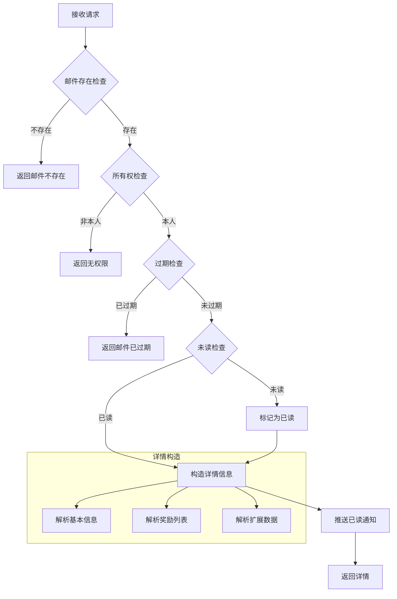

**代码实现**：

```java
public Result reqMailDetail(long cid, long mailId)
{
    // 1. 查询邮件
    PlayerMail mail = mailDao.selectById(mailId);
    if (mail == null || !mail.getCid().equals(cid))
        return Result.fail(MailErr.MAIL_NOT_FOUND);

    // 2. 检查过期
    if (mail.getExpireTime().before(new Date()))
        return Result.fail(MailErr.MAIL_EXPIRED);

    // 3. 如果未读，标记为已读
    if (mail.getState() == EMailState.UNREAD.getValue())
    {
        mail.setState(EMailState.READ.getValue());
        mailDao.updateById(mail);

        // 推送已读通知
        pushMailReaded(cid, mailId);
    }

    // 4. 构造详情信息
    Mail_DetailInfo detailInfo = new Mail_DetailInfo();
    detailInfo.setMailId(mail.getId());
    detailInfo.setMailType(mail.getMailType());
    detailInfo.setTitle(mail.getTitle());
    detailInfo.setContent(mail.getContent());
    detailInfo.setSender(mail.getSender());
    detailInfo.setSendTime(mail.getSendTime().getTime());
    detailInfo.setExpireTime(mail.getExpireTime().getTime());
    detailInfo.setState(mail.getState());
    detailInfo.setRewardList(JsonUtils.parseList(mail.getRewardList(), RewardInfo.class));
    detailInfo.setIsLocked(mail.getIsLocked());
    detailInfo.setExData(JsonUtils.parseObject(mail.getExData(), Map.class));

    // 5. 返回详情
    GS2GC_009_003_RetMailDetail resp = new GS2GC_009_003_RetMailDetail();
    resp.setMailInfo(detailInfo);
    sendResponse(cid, resp);

    return Result.SUCC;
}
```

---

### GC2GS_009_004_ReqTakeMailItems

**说明**：请求领取邮件附件

**触发场景**：
- 玩家点击领取附件按钮
- 邮件详情页面领取

**请求参数**：

| 字段名 | 类型 | 必填 | 说明 | 示例 |
|-------|------|------|------|------|
| mailId | long | 是 | 邮件ID | 10001 |

```protobuf
message GC2GS_009_004_ReqTakeMailItems
{
    required int64 mailId = 1;  // 邮件ID
}
```

**响应**：GS2GC_009_004_RetTakeMailItems

**服务端处理流程**：

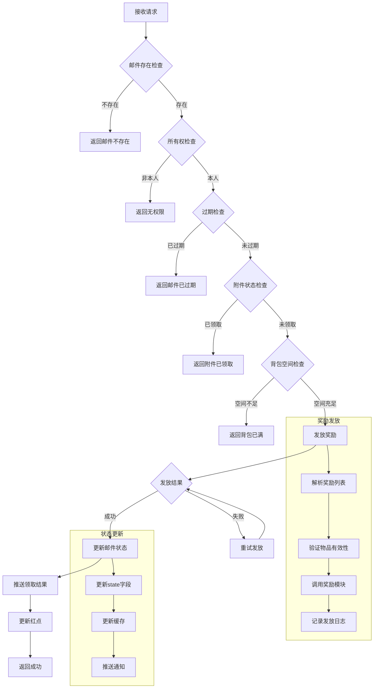

**代码实现**：

```java
public Result takeMailItems(long cid, long mailId, NPPlayerContext context)
{
    // 1. 查询邮件
    PlayerMail mail = mailDao.selectById(mailId);
    if (mail == null || !mail.getCid().equals(cid))
        return Result.fail(MailErr.MAIL_NOT_FOUND);

    // 2. 检查过期
    if (mail.getExpireTime().before(new Date()))
        return Result.fail(MailErr.MAIL_EXPIRED);

    // 3. 检查附件状态
    if (mail.getState() == EMailState.REWARD_TAKEN.getValue())
        return Result.fail(MailErr.MAIL_REWARD_TAKEN);

    // 4. 解析奖励列表
    List<RewardInfo> rewardList = JsonUtils.parseList(mail.getRewardList(), RewardInfo.class);
    if (rewardList == null || rewardList.isEmpty())
    {
        // 无附件邮件直接标记已读
        mail.setState(EMailState.READ.getValue());
        mailDao.updateById(mail);
        return Result.SUCC;
    }

    // 5. 检查背包空间
    if (!bagService.hasEnoughSpace(cid, rewardList))
        return Result.fail(MailErr.BAG_FULL);

    // 6. 发放奖励
    rewardService.giveRewards(cid, rewardList, context);

    // 7. 更新邮件状态
    mail.setState(EMailState.REWARD_TAKEN.getValue());
    mailDao.updateById(mail);

    // 8. 推送通知
    pushMailRewardTaken(cid, mailId);

    // 9. 更新红点
    updateMailRedDot(cid);

    return Result.SUCC;
}
```

---

### GC2GS_009_005_ReqSetMailLockState

**说明**：请求设置邮件锁定状态

**触发场景**：
- 玩家点击锁定/解锁按钮
- 保护重要邮件不被删除

**请求参数**：

| 字段名 | 类型 | 必填 | 说明 | 示例 |
|-------|------|------|------|------|
| mailId | long | 是 | 邮件ID | 10001 |
| isLocked | bool | 是 | 是否锁定 | true |

```protobuf
message GC2GS_009_005_ReqSetMailLockState
{
    required int64 mailId = 1;      // 邮件ID
    required bool isLocked = 2;     // 是否锁定
}
```

**响应**：GS2GC_009_005_RetSetMailLockState

**服务端处理流程**：

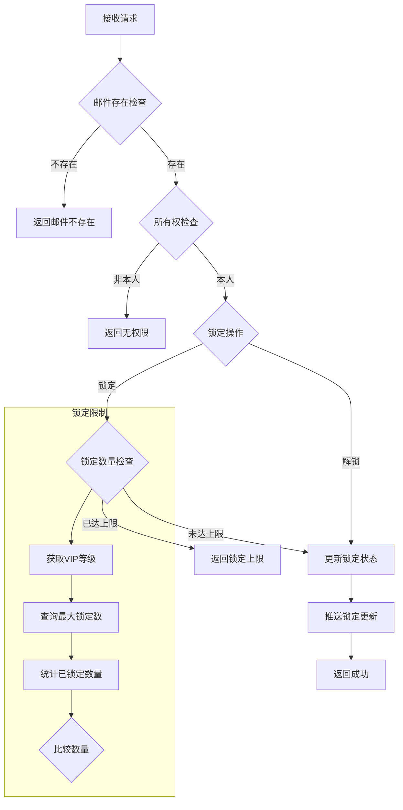

**代码实现**：

```java
public Result setMailLockState(long cid, long mailId, boolean isLocked)
{
    // 1. 查询邮件
    PlayerMail mail = mailDao.selectById(mailId);
    if (mail == null || !mail.getCid().equals(cid))
        return Result.fail(MailErr.MAIL_NOT_FOUND);

    // 2. 如果锁定，检查锁定数量上限
    if (isLocked)
    {
        int vipLevel = playerService.getVipLevel(cid);
        int maxLockCount = MailRefHelper.getMaxLockCount(vipLevel);
        int currentLockCount = mailDao.countLocked(cid);

        if (currentLockCount >= maxLockCount)
            return Result.fail(MailErr.LOCK_COUNT_OVER_LIMIT);
    }

    // 3. 更新锁定状态
    mail.setIsLocked(isLocked);
    mailDao.updateById(mail);

    // 4. 推送通知
    pushMailLockedUpdated(cid, mailId, isLocked);

    return Result.SUCC;
}
```

---

### GC2GS_009_006_ReqAKeyTakeAll

**说明**：请求一键领取所有附件

**触发场景**：
- 玩家点击一键领取按钮
- 批量领取所有未领附件

**请求参数**：无

```protobuf
message GC2GS_009_006_ReqAKeyTakeAll
{
    // 无参数
}
```

**响应**：GS2GC_009_006_RetAKeyTakeAll

**服务端处理流程**：

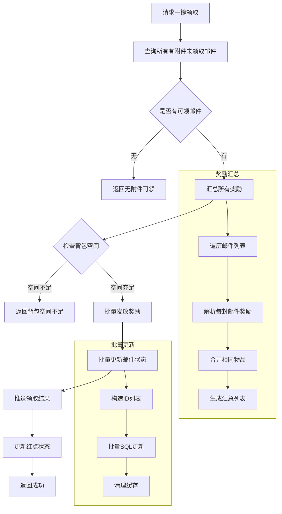

**代码实现**：

```java
public Result takeAllMailItems(long cid, NPPlayerContext context)
{
    // 1. 查询所有有附件未领取的邮件
    List<PlayerMail> mailList = mailDao.selectWithUnclaimedReward(cid);

    if (mailList.isEmpty())
        return Result.fail(MailErr.NO_REWARD_TO_TAKE);

    // 2. 汇总所有奖励
    List<RewardInfo> allRewards = new ArrayList<>();
    List<Long> mailIds = new ArrayList<>();

    for (PlayerMail mail : mailList)
    {
        List<RewardInfo> rewards = JsonUtils.parseList(mail.getRewardList(), RewardInfo.class);
        if (rewards != null && !rewards.isEmpty())
        {
            allRewards.addAll(rewards);
            mailIds.add(mail.getId());
        }
    }

    // 3. 检查背包空间
    if (!bagService.hasEnoughSpace(cid, allRewards))
        return Result.fail(MailErr.BAG_FULL);

    // 4. 批量发放奖励
    rewardService.giveRewards(cid, allRewards, context);

    // 5. 批量更新邮件状态
    mailDao.batchUpdateState(mailIds, EMailState.REWARD_TAKEN.getValue());

    // 6. 推送通知
    pushAllMailRewardTaken(cid, mailIds);

    // 7. 更新红点
    updateMailRedDot(cid);

    return Result.success(allRewards);
}
```

---

### GC2GS_009_007_ReqDelMail

**说明**：请求删除邮件

**触发场景**：
- 玩家点击删除按钮
- 邮件详情页面删除

**请求参数**：

| 字段名 | 类型 | 必填 | 说明 | 示例 |
|-------|------|------|------|------|
| mailId | long | 是 | 邮件ID | 10001 |

```protobuf
message GC2GS_009_007_ReqDelMail
{
    required int64 mailId = 1;  // 邮件ID
}
```

**响应**：GS2GC_009_007_RetDelMail

**服务端处理流程**：

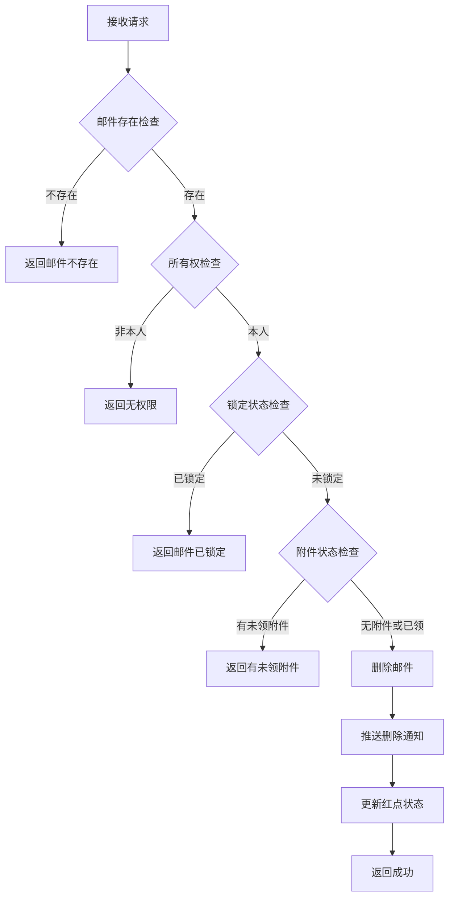

**代码实现**：

```java
public Result deleteMail(long cid, long mailId)
{
    // 1. 查询邮件
    PlayerMail mail = mailDao.selectById(mailId);
    if (mail == null || !mail.getCid().equals(cid))
        return Result.fail(MailErr.MAIL_NOT_FOUND);

    // 2. 检查锁定状态
    if (mail.getIsLocked())
        return Result.fail(MailErr.MAIL_LOCKED);

    // 3. 检查附件状态
    if (mail.getState() != EMailState.REWARD_TAKEN.getValue())
    {
        List<RewardInfo> rewards = JsonUtils.parseList(mail.getRewardList(), RewardInfo.class);
        if (rewards != null && !rewards.isEmpty())
            return Result.fail(MailErr.MAIL_HAS_REWARD);
    }

    // 4. 删除邮件
    mailDao.deleteById(mailId);

    // 5. 推送通知
    pushMailRemoved(cid, mailId);

    // 6. 更新红点
    updateMailRedDot(cid);

    return Result.SUCC;
}
```

---

### GC2GS_009_008_ReqAkeyDelAll

**说明**：请求一键删除已读邮件

**触发场景**：
- 玩家点击一键删除按钮
- 批量清理已读邮件

**请求参数**：无

```protobuf
message GC2GS_009_008_ReqAkeyDelAll
{
    // 无参数
}
```

**响应**：GS2GC_009_008_RetAKeyDelAll

**服务端处理流程**：

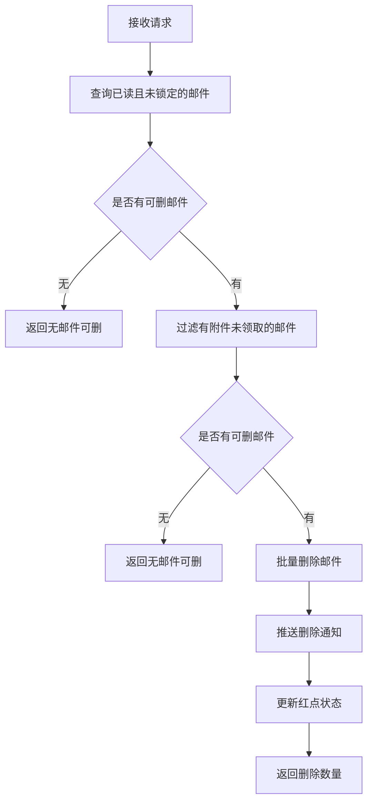

**代码实现**：

```java
public Result deleteAllReadMail(long cid)
{
    // 1. 查询所有已读且未锁定的邮件
    List<PlayerMail> mailList = mailDao.selectReadAndUnlocked(cid);

    if (mailList.isEmpty())
        return Result.fail(MailErr.NO_MAIL_TO_DELETE);

    // 2. 过滤有附件未领取的邮件
    List<Long> deleteIds = new ArrayList<>();
    for (PlayerMail mail : mailList)
    {
        if (mail.getState() == EMailState.REWARD_TAKEN.getValue())
        {
            deleteIds.add(mail.getId());
        }
        else
        {
            List<RewardInfo> rewards = JsonUtils.parseList(mail.getRewardList(), RewardInfo.class);
            if (rewards == null || rewards.isEmpty())
            {
                deleteIds.add(mail.getId());
            }
        }
    }

    // 3. 批量删除
    if (!deleteIds.isEmpty())
    {
        mailDao.batchDelete(deleteIds);

        // 4. 推送通知
        for (Long mailId : deleteIds)
        {
            pushMailRemoved(cid, mailId);
        }

        // 5. 更新红点
        updateMailRedDot(cid);
    }

    return Result.success(deleteIds.size());
}
```

---

### GC2GS_009_009_ReqSetReadOver

**说明**：请求标记已读完

**触发场景**：
- 玩家点击全部已读按钮
- 批量标记所有邮件为已读

**请求参数**：

| 字段名 | 类型 | 必填 | 说明 | 示例 |
|-------|------|------|------|------|
| mailId | long | 否 | 邮件ID(0表示全部) | 10001 |

```protobuf
message GC2GS_009_009_ReqSetReadOver
{
    optional int64 mailId = 1 [default = 0];  // 邮件ID(0表示全部已读)
}
```

**响应**：GS2GC_009_009_RetSetReadOver

**代码实现**：

```java
public Result setReadOver(long cid, long mailId)
{
    if (mailId > 0)
    {
        // 标记单封邮件已读
        PlayerMail mail = mailDao.selectById(mailId);
        if (mail == null || !mail.getCid().equals(cid))
            return Result.fail(MailErr.MAIL_NOT_FOUND);

        if (mail.getState() == EMailState.UNREAD.getValue())
        {
            mail.setState(EMailState.READ.getValue());
            mailDao.updateById(mail);
            pushMailReaded(cid, mailId);
        }
    }
    else
    {
        // 标记所有未读邮件已读
        List<PlayerMail> unreadMails = mailDao.selectUnread(cid);
        List<Long> mailIds = new ArrayList<>();

        for (PlayerMail mail : unreadMails)
        {
            mail.setState(EMailState.READ.getValue());
            mailIds.add(mail.getId());
        }

        if (!mailIds.isEmpty())
        {
            mailDao.batchUpdateState(mailIds, EMailState.READ.getValue());

            for (Long id : mailIds)
            {
                pushMailReaded(cid, id);
            }
        }

        updateMailRedDot(cid);
    }

    return Result.SUCC;
}
```

---

### GC2GS_009_010_ReqMailTitleInfo

**说明**：请求邮件标题信息

**触发场景**：
- 批量获取邮件标题(用于优化显示)
- 减少数据传输量

**请求参数**：

| 字段名 | 类型 | 必填 | 说明 | 示例 |
|-------|------|------|------|------|
| mailIdList | array | 是 | 邮件ID列表 | [10001, 10002] |

```protobuf
message GC2GS_009_010_ReqMailTitleInfo
{
    repeated int64 mailIdList = 1;  // 邮件ID列表
}
```

**响应**：GS2GC_009_010_RetMailTitleInfo

---

## 服务端响应/推送协议 (GS2GC)

### GS2GC_009_002_RetMailBriefList

**说明**：返回邮件简要列表

**响应字段**：

| 字段名 | 类型 | 必填 | 说明 |
|-------|------|------|------|
| briefList | array&lt;Mail_BriefInfo&gt; | 是 | 邮件简要信息列表 |

```protobuf
message GS2GC_009_002_RetMailBriefList
{
    repeated Mail_BriefInfo briefList = 1;  // 邮件简要信息列表
}
```

**数据结构**：

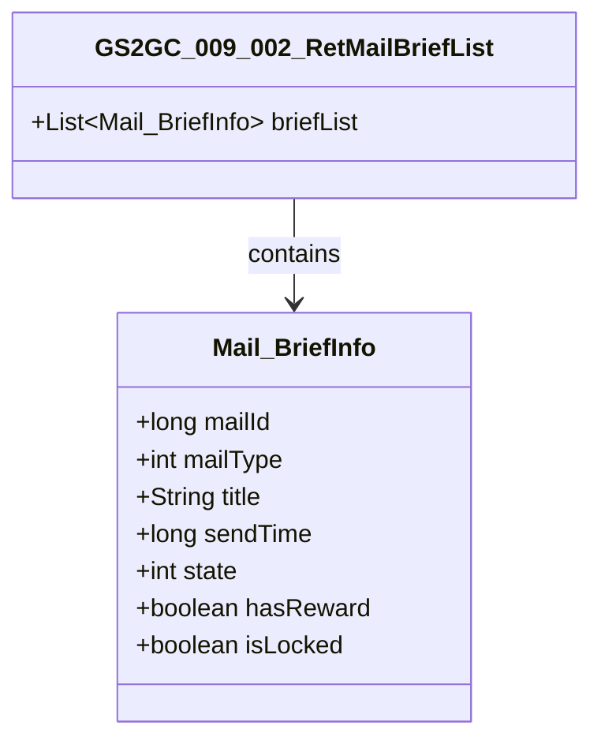

---

### GS2GC_009_003_RetMailDetail

**说明**：返回邮件详情

**响应字段**：

| 字段名 | 类型 | 必填 | 说明 |
|-------|------|------|------|
| mailInfo | Mail_DetailInfo | 是 | 邮件详情信息 |

```protobuf
message GS2GC_009_003_RetMailDetail
{
    required Mail_DetailInfo mailInfo = 1;  // 邮件详情信息
}
```

---

### GS2GC_009_004_RetTakeMailItems

**说明**：返回领取附件结果

**响应字段**：

| 字段名 | 类型 | 必填 | 说明 |
|-------|------|------|------|
| mailId | long | 是 | 邮件ID |
| rewardList | array | 是 | 领取的奖励列表 |

```protobuf
message GS2GC_009_004_RetTakeMailItems
{
    required int64 mailId = 1;                    // 邮件ID
    repeated NPCommonCostItem rewardList = 2;    // 奖励列表
}
```

---

### GS2GC_009_051_OnMailAdded

**说明**：通知新邮件添加

**触发时机**：
- 系统发送新邮件
- 其他玩家发送邮件
- 活动奖励邮件

**推送数据**：

| 字段名 | 类型 | 必填 | 说明 |
|-------|------|------|------|
| mailInfo | Mail_BriefInfo | 是 | 邮件简要信息 |

```protobuf
message GS2GC_009_051_OnMailAdded
{
    required Mail_BriefInfo mailInfo = 1;  // 邮件简要信息
}
```

**服务端构造**：

```java
public void pushMailAdded(long cid, PlayerMail mail)
{
    Mail_BriefInfo briefInfo = new Mail_BriefInfo();
    briefInfo.setMailId(mail.getId());
    briefInfo.setMailType(mail.getMailType());
    briefInfo.setTitle(mail.getTitle());
    briefInfo.setSendTime(mail.getSendTime().getTime());
    briefInfo.setState(mail.getState());
    briefInfo.setHasReward(mail.getRewardList() != null && !mail.getRewardList().isEmpty());
    briefInfo.setIsLocked(mail.getIsLocked());

    GS2GC_009_051_OnMailAdded msg = new GS2GC_009_051_OnMailAdded();
    msg.setMailInfo(briefInfo);

    sendPush(cid, msg);
}
```

---

### GS2GC_009_052_OnMailRemoved

**说明**：通知邮件删除

**触发时机**：
- 玩家手动删除
- 一键删除
- 过期清理

**推送数据**：

| 字段名 | 类型 | 必填 | 说明 |
|-------|------|------|------|
| mailId | long | 是 | 邮件ID |

```protobuf
message GS2GC_009_052_OnMailRemoved
{
    required int64 mailId = 1;  // 邮件ID
}
```

---

### GS2GC_009_053_OnMailLockedUpdated

**说明**：通知邮件锁定状态更新

**推送数据**：

| 字段名 | 类型 | 必填 | 说明 |
|-------|------|------|------|
| mailId | long | 是 | 邮件ID |
| isLocked | bool | 是 | 是否锁定 |

```protobuf
message GS2GC_009_053_OnMailLockedUpdated
{
    required int64 mailId = 1;      // 邮件ID
    required bool isLocked = 2;     // 是否锁定
}
```

---

### GS2GC_009_054_OnMailReaded

**说明**：通知邮件已读状态更新

**推送数据**：

| 字段名 | 类型 | 必填 | 说明 |
|-------|------|------|------|
| mailId | long | 是 | 邮件ID |

```protobuf
message GS2GC_009_054_OnMailReaded
{
    required int64 mailId = 1;  // 邮件ID
}
```

---

### GS2GC_009_055_OnMailRewardTaken

**说明**：通知邮件奖励已领取

**推送数据**：

| 字段名 | 类型 | 必填 | 说明 |
|-------|------|------|------|
| mailId | long | 是 | 邮件ID |

```protobuf
message GS2GC_009_055_OnMailRewardTaken
{
    required int64 mailId = 1;  // 邮件ID
}
```

---

### GS2GC_009_056_OnMailExDataUpdated

**说明**：通知邮件扩展数据更新

**推送数据**：

| 字段名 | 类型 | 必填 | 说明 |
|-------|------|------|------|
| mailId | long | 是 | 邮件ID |
| exData | object | 是 | 扩展数据 |

```protobuf
message GS2GC_009_056_OnMailExDataUpdated
{
    required int64 mailId = 1;       // 邮件ID
    required string exData = 2;      // 扩展数据(JSON)
}
```

---

## 数据结构定义

### Mail_BriefInfo (邮件简要信息)

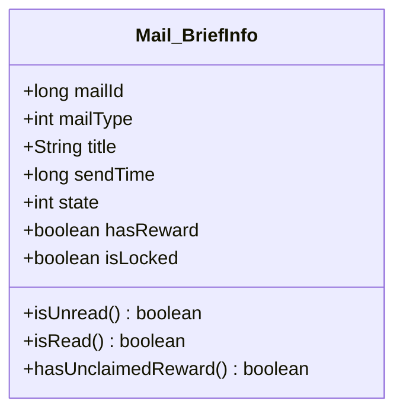

```protobuf
message Mail_BriefInfo
{
    required int64 mailId = 1;       // 邮件ID
    required int32 mailType = 2;     // 邮件类型
    required string title = 3;       // 标题
    required int64 sendTime = 4;     // 发送时间(毫秒时间戳)
    required int32 state = 5;        // 状态(0未读/1已读/2已领取)
    required bool hasReward = 6;     // 是否有奖励
    required bool isLocked = 7;      // 是否锁定
}
```

| 字段名 | 类型 | 说明 |
|-------|------|------|
| mailId | int64 | 邮件唯一ID |
| mailType | int32 | 邮件类型(1-7) |
| title | string | 邮件标题 |
| sendTime | int64 | 发送时间戳(毫秒) |
| state | int32 | 邮件状态枚举值 |
| hasReward | bool | 是否包含附件奖励 |
| isLocked | bool | 是否被玩家锁定 |

---

### Mail_DetailInfo (邮件详情信息)

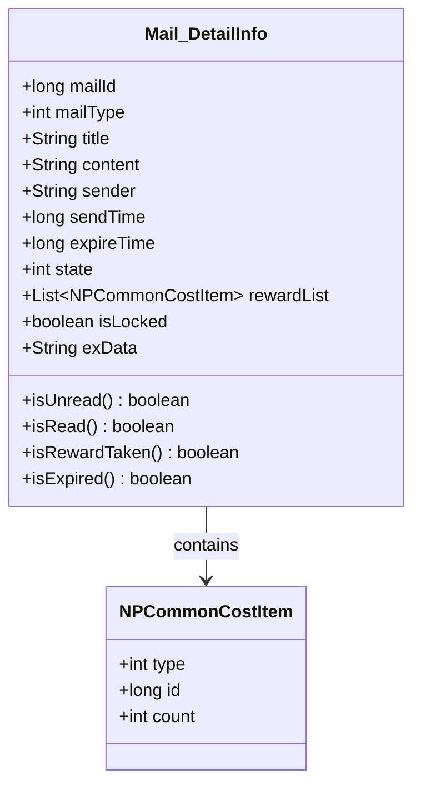

```protobuf
message Mail_DetailInfo
{
    required int64 mailId = 1;                        // 邮件ID
    required int32 mailType = 2;                      // 邮件类型
    required string title = 3;                        // 标题
    required string content = 4;                      // 内容
    required string sender = 5;                       // 发送者
    required int64 sendTime = 6;                      // 发送时间
    required int64 expireTime = 7;                    // 过期时间
    required int32 state = 8;                         // 状态
    repeated NPCommonCostItem rewardList = 9;        // 奖励列表
    required bool isLocked = 10;                      // 是否锁定
    optional string exData = 11;                      // 扩展数据(JSON)
}
```

| 字段名 | 类型 | 说明 |
|-------|------|------|
| mailId | int64 | 邮件唯一ID |
| mailType | int32 | 邮件类型(1-7) |
| title | string | 邮件标题 |
| content | string | 邮件完整内容 |
| sender | string | 发送者名称 |
| sendTime | int64 | 发送时间戳(毫秒) |
| expireTime | int64 | 过期时间戳(毫秒) |
| state | int32 | 邮件状态枚举值 |
| rewardList | repeated NPCommonCostItem | 附件奖励列表 |
| isLocked | bool | 是否被玩家锁定 |
| exData | string | 扩展数据(JSON格式) |

---

### NPCommonCostItem (通用奖励物品)

```protobuf
message NPCommonCostItem
{
    required int32 type = 1;   // 物品类型(1道具/2货币/3英雄)
    required int64 id = 2;     // 物品ID
    required int32 count = 3;  // 数量
}
```

---

## 协议流程图

### 完整邮件操作流程

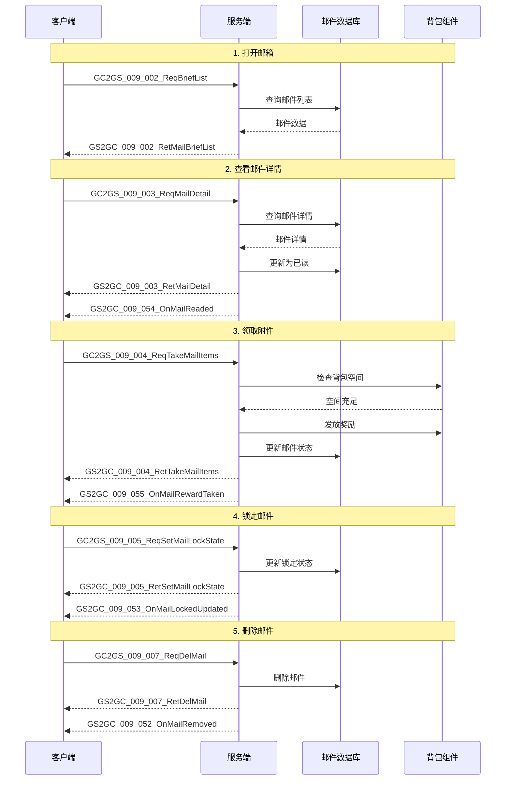

### 一键领取流程

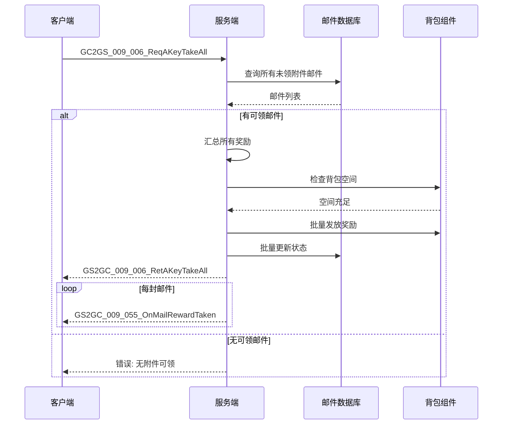

### 接收新邮件流程

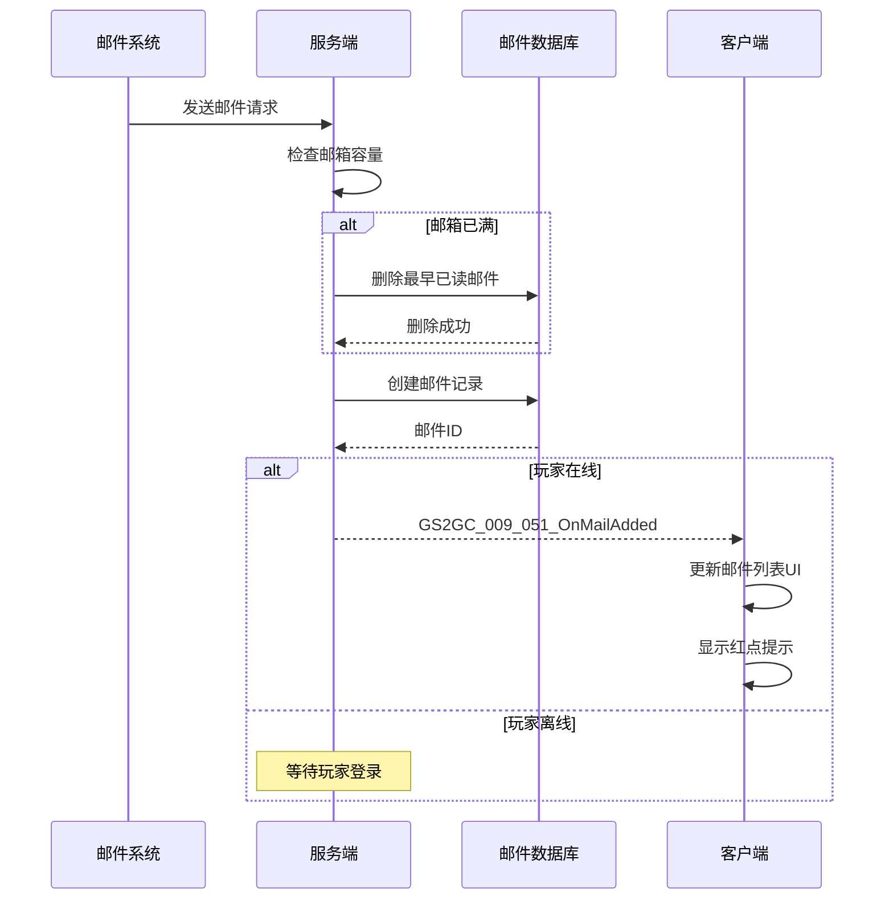

---

## 协议状态转换图

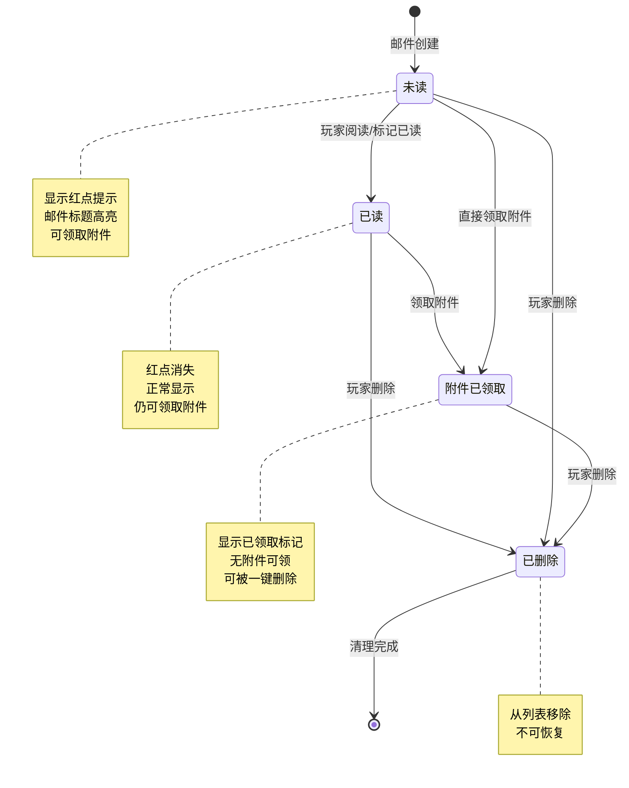

---

## 错误码定义

### 错误码枚举

```java
public enum MailErr
{
    MAIL_NOT_FOUND(90001, "邮件不存在"),
    MAIL_EXPIRED(90002, "邮件已过期"),
    MAIL_REWARD_TAKEN(90003, "附件已领取"),
    MAIL_LOCKED(90004, "邮件已锁定"),
    MAIL_HAS_REWARD(90005, "邮件有未领附件"),
    MAIL_FULL(90006, "邮箱已满"),
    BAG_FULL(90007, "背包空间不足"),
    LOCK_COUNT_OVER_LIMIT(90008, "锁定数量已达上限"),
    NO_REWARD_TO_TAKE(90009, "无附件可领取"),
    NO_MAIL_TO_DELETE(90010, "无邮件可删除");

    private final int code;
    private final String msg;

    MailErr(int code, String msg)
    {
        this.code = code;
        this.msg = msg;
    }

    public int getCode() { return code; }
    public String getMsg() { return msg; }
}
```

### 错误码表

| 错误码 | 错误名称 | 协议 | 说明 | 用户提示 |
|-------|---------|------|------|----------|
| 90001 | MAIL_NOT_FOUND | 003/004/005/007 | 邮件不存在 | "邮件不存在" |
| 90002 | MAIL_EXPIRED | 003/004 | 邮件已过期 | "邮件已过期" |
| 90003 | MAIL_REWARD_TAKEN | 004/006 | 附件已领取 | "附件已领取" |
| 90004 | MAIL_LOCKED | 007/008 | 邮件已锁定 | "邮件已锁定，请先解锁" |
| 90005 | MAIL_HAS_REWARD | 007/008 | 邮件有未领附件 | "请先领取附件" |
| 90006 | MAIL_FULL | 051 | 邮箱已满 | "邮箱已满，请清理" |
| 90007 | BAG_FULL | 004/006 | 背包空间不足 | "背包空间不足" |
| 90008 | LOCK_COUNT_OVER_LIMIT | 005 | 锁定数量已达上限 | "锁定邮件数量已达上限" |
| 90009 | NO_REWARD_TO_TAKE | 006 | 无附件可领取 | "没有可领取的附件" |
| 90010 | NO_MAIL_TO_DELETE | 008 | 无邮件可删除 | "没有可删除的邮件" |

---

## 协议测试用例

### 单元测试示例

```java
/**
 * 邮件协议测试类
 */
public class MailProtocolTest
{
    @Test
    public void testReqBriefList_Success()
    {
        // 准备数据
        long cid = createTestUser();
        createTestMail(cid, EMailType.REWARD, "测试邮件", "测试内容");

        // 发送请求
        GC2GS_009_002_ReqBriefList req = new GC2GS_009_002_ReqBriefList();
        GS2GC_009_002_RetMailBriefList resp = sendRequest(cid, req);

        // 验证结果
        assertTrue(resp.getResult().isSucc());
        assertNotNull(resp.getBriefList());
        assertEquals(1, resp.getBriefList().size());
    }

    @Test
    public void testTakeMailItems_Success()
    {
        // 准备数据
        long cid = createTestUser();
        long mailId = createTestMailWithReward(cid);

        // 发送请求
        GC2GS_009_004_ReqTakeMailItems req = new GC2GS_009_004_ReqTakeMailItems(mailId);
        GS2GC_009_004_RetTakeMailItems resp = sendRequest(cid, req);

        // 验证结果
        assertTrue(resp.getResult().isSucc());
        assertNotNull(resp.getRewardList());
        assertTrue(resp.getRewardList().size() > 0);
    }

    @Test
    public void testTakeMailItems_AlreadyTaken()
    {
        // 准备数据
        long cid = createTestUser();
        long mailId = createTestMailWithReward(cid);

        // 第一次领取
        GC2GS_009_004_ReqTakeMailItems req1 = new GC2GS_009_004_ReqTakeMailItems(mailId);
        sendRequest(cid, req1);

        // 第二次领取
        GC2GS_009_004_ReqTakeMailItems req2 = new GC2GS_009_004_ReqTakeMailItems(mailId);
        GS2GC_009_004_RetTakeMailItems resp = sendRequest(cid, req2);

        // 验证结果
        assertEquals(MailErr.MAIL_REWARD_TAKEN.getCode(), resp.getResult().getCode());
    }

    @Test
    public void testSetMailLockState_Success()
    {
        // 准备数据
        long cid = createTestUser();
        long mailId = createTestMail(cid, EMailType.SYSTEM, "测试", "内容");

        // 发送请求
        GC2GS_009_005_ReqSetMailLockState req = new GC2GS_009_005_ReqSetMailLockState(mailId, true);
        GS2GC_009_005_RetSetMailLockState resp = sendRequest(cid, req);

        // 验证结果
        assertTrue(resp.getResult().isSucc());

        // 验证数据库状态
        PlayerMail mail = mailDao.selectById(mailId);
        assertTrue(mail.getIsLocked());
    }

    @Test
    public void testDeleteMail_Locked()
    {
        // 准备数据
        long cid = createTestUser();
        long mailId = createTestMail(cid, EMailType.SYSTEM, "测试", "内容");

        // 锁定邮件
        mailDao.updateLockState(mailId, true);

        // 尝试删除
        GC2GS_009_007_ReqDelMail req = new GC2GS_009_007_ReqDelMail(mailId);
        GS2GC_009_007_RetDelMail resp = sendRequest(cid, req);

        // 验证结果
        assertEquals(MailErr.MAIL_LOCKED.getCode(), resp.getResult().getCode());
    }
}
```

### 压力测试场景

```java
/**
 * 邮件系统压力测试
 */
public class MailStressTest
{
    /**
     * 模拟1000玩家同时接收邮件
     */
    @Test
    public void stressTestSendMail()
    {
        int concurrentUsers = 1000;
        CountDownLatch latch = new CountDownLatch(concurrentUsers);
        AtomicInteger successCount = new AtomicInteger(0);
        AtomicInteger failCount = new AtomicInteger(0);

        for (int i = 0; i < concurrentUsers; i++)
        {
            final int userId = i;
            executor.submit(() -> {
                try
                {
                    long cid = createTestUser(userId);

                    // 发送邮件
                    long startTime = System.currentTimeMillis();
                    Result result = mailService.sendMail(cid, createTestMailData());
                    long latency = System.currentTimeMillis() - startTime;

                    if (result.isSucc() && latency < 1000)
                    {
                        successCount.incrementAndGet();
                    }
                    else
                    {
                        failCount.incrementAndGet();
                    }
                }
                finally
                {
                    latch.countDown();
                }
            });
        }

        latch.await(30, TimeUnit.SECONDS);

        System.out.println("Success: " + successCount.get());
        System.out.println("Fail: " + failCount.get());
        System.out.println("Success rate: " +
            (successCount.get() * 100.0 / concurrentUsers) + "%");
    }

    /**
     * 模拟批量发送系统邮件
     */
    @Test
    public void stressTestBatchSend()
    {
        int targetCount = 10000; // 发送给1万玩家

        // 创建系统邮件
        SystemMail sysMail = createSystemMail(targetCount);

        // 执行批量发送
        long startTime = System.currentTimeMillis();
        mailService.sendSystemMail(sysMail);
        long latency = System.currentTimeMillis() - startTime;

        System.out.println("Batch send " + targetCount + " mails cost " + latency + "ms");
        System.out.println("Average latency: " + (latency * 1.0 / targetCount) + "ms per mail");
    }
}
```

---

## 协议安全校验

### 请求参数校验规则

```java
/**
 * 协议参数校验器
 */
public class MailProtocolValidator
{
    /**
     * 校验请求邮件详情
     */
    public static Result validateReqMailDetail(GC2GS_009_003_ReqMailDetail req, long cid)
    {
        // 1. 邮件ID校验
        if (req.getMailId() <= 0)
            return Result.fail(CommErr.PARAM_ERROR, "邮件ID无效");

        // 2. 邮件存在性校验
        PlayerMail mail = mailDao.selectById(req.getMailId());
        if (mail == null)
            return Result.fail(MailErr.MAIL_NOT_FOUND);

        // 3. 所有权校验
        if (!mail.getCid().equals(cid))
            return Result.fail(MailErr.MAIL_NOT_FOUND);

        // 4. 过期校验
        if (mail.getExpireTime().before(new Date()))
            return Result.fail(MailErr.MAIL_EXPIRED);

        return Result.SUCC;
    }

    /**
     * 校验领取附件请求
     */
    public static Result validateTakeMailItems(GC2GS_009_004_ReqTakeMailItems req, long cid)
    {
        // 基础校验
        Result result = validateReqMailDetail(req, cid);
        if (!result.isSucc())
            return result;

        PlayerMail mail = mailDao.selectById(req.getMailId());

        // 检查是否有附件
        if (mail.getState() == EMailState.REWARD_TAKEN.getValue())
            return Result.fail(MailErr.MAIL_REWARD_TAKEN);

        return Result.SUCC;
    }

    /**
     * 校验删除邮件请求
     */
    public static Result validateDeleteMail(GC2GS_009_007_ReqDelMail req, long cid)
    {
        // 基础校验
        Result result = validateReqMailDetail(req, cid);
        if (!result.isSucc())
            return result;

        PlayerMail mail = mailDao.selectById(req.getMailId());

        // 锁定校验
        if (mail.getIsLocked())
            return Result.fail(MailErr.MAIL_LOCKED);

        // 附件校验
        if (mail.getState() != EMailState.REWARD_TAKEN.getValue())
        {
            List<RewardInfo> rewards = JsonUtils.parseList(mail.getRewardList(), RewardInfo.class);
            if (rewards != null && !rewards.isEmpty())
                return Result.fail(MailErr.MAIL_HAS_REWARD);
        }

        return Result.SUCC;
    }
}
```

### 防作弊校验

```java
/**
 * 邮件系统防作弊检测
 */
public class MailAntiCheat
{
    // 操作最小间隔(毫秒)
    private static final long MIN_OPERATION_INTERVAL = 200;

    // 一键领取最大邮件数
    private static final int MAX_TAKE_ALL_COUNT = 100;

    /**
     * 检测操作频率
     */
    public static boolean checkOperationFrequency(long cid)
    {
        Long lastTime = operationTimeCache.get(cid);
        long now = System.currentTimeMillis();

        if (lastTime != null && now - lastTime < MIN_OPERATION_INTERVAL)
        {
            MJLog.warn("Mail operation too frequent", cid, "interval", now - lastTime);
            return false;
        }

        operationTimeCache.put(cid, now);
        return true;
    }

    /**
     * 检测一键领取数量
     */
    public static boolean checkTakeAllCount(int mailCount)
    {
        if (mailCount > MAX_TAKE_ALL_COUNT)
        {
            MJLog.warn("TakeAll mail count over limit", "count", mailCount);
            return false;
        }
        return true;
    }
}
```

---

## 协议调试工具

### GM命令调试

```java
/**
 * 邮件系统GM命令
 */
public class MailGMCommand
{
    /**
     * 发送测试邮件
     * 用法: /mail send <cid> <type> <title> <content>
     */
    @GMCommand("mail send")
    public static String sendMail(String[] args)
    {
        if (args.length < 4)
            return "Usage: /mail send <cid> <type> <title> <content>";

        long cid = Long.parseLong(args[0]);
        int type = Integer.parseInt(args[1]);
        String title = args[2];
        String content = args[3];

        MailData mailData = new MailData();
        mailData.setMailType(type);
        mailData.setTitle(title);
        mailData.setContent(content);
        mailData.setSender("GM");

        mailService.sendMail(cid, mailData);

        return "Mail sent to " + cid;
    }

    /**
     * 发送全服邮件
     * 用法: /mail broadcast <title> <content>
     */
    @GMCommand("mail broadcast")
    public static String broadcastMail(String[] args)
    {
        if (args.length < 2)
            return "Usage: /mail broadcast <title> <content>";

        String title = args[0];
        String content = args[1];

        SystemMail sysMail = new SystemMail();
        sysMail.setMailType(EMailType.SYSTEM.getValue());
        sysMail.setTitle(title);
        sysMail.setContent(content);
        sysMail.setSender("系统公告");
        sysMail.setTargetCondition(null); // 全服

        mailService.sendSystemMail(sysMail);

        return "Broadcast mail sent";
    }

    /**
     * 清理过期邮件
     * 用法: /mail clean
     */
    @GMCommand("mail clean")
    public static String cleanExpiredMails()
    {
        int count = mailService.cleanExpiredMails();
        return "Cleaned " + count + " expired mails";
    }

    /**
     * 查看玩家邮件状态
     * 用法: /mail status <cid>
     */
    @GMCommand("mail status")
    public static String getMailStatus(String[] args)
    {
        if (args.length < 1)
            return "Usage: /mail status <cid>";

        long cid = Long.parseLong(args[0]);

        int total = mailDao.countByCid(cid);
        int unread = mailDao.countUnread(cid);
        int withReward = mailDao.countWithReward(cid);
        int locked = mailDao.countLocked(cid);

        StringBuilder sb = new StringBuilder();
        sb.append("=== Mail Status ===\n");
        sb.append("CID: ").append(cid).append("\n");
        sb.append("Total: ").append(total).append("\n");
        sb.append("Unread: ").append(unread).append("\n");
        sb.append("With Reward: ").append(withReward).append("\n");
        sb.append("Locked: ").append(locked).append("\n");

        return sb.toString();
    }
}
```

---

## 协议性能优化建议

### 消息压缩

```java
/**
 * 邮件协议压缩处理器
 */
public class MailProtocolCompressor
{
    // 压缩阈值(字节)
    private static final int COMPRESS_THRESHOLD = 512;

    /**
     * 压缩大邮件列表
     */
    public static byte[] compressIfNeeded(byte[] data)
    {
        if (data.length < COMPRESS_THRESHOLD)
            return data;

        try
        {
            ByteArrayOutputStream baos = new ByteArrayOutputStream();
            GZIPOutputStream gzip = new GZIPOutputStream(baos);
            gzip.write(data);
            gzip.close();

            byte[] compressed = baos.toByteArray();

            if (compressed.length < data.length * 0.8)
            {
                return compressed;
            }
            return data;
        }
        catch (Exception e)
        {
            return data;
        }
    }
}
```

### 批量操作优化

```java
/**
 * 批量操作优化器
 */
public class MailBatchOptimizer
{
    /**
     * 批量更新邮件状态
     */
    public static void batchUpdateState(List<Long> mailIds, int state)
    {
        int batchSize = 100;
        for (int i = 0; i < mailIds.size(); i += batchSize)
        {
            int end = Math.min(i + batchSize, mailIds.size());
            List<Long> batch = mailIds.subList(i, end);
            mailDao.batchUpdateState(batch, state);
        }
    }

    /**
     * 批量推送通知
     */
    public static void batchPushNotification(long cid, List<Long> mailIds, int notificationType)
    {
        // 合并相同类型的通知，减少推送次数
        if (notificationType == NotificationType.REWARD_TAKEN)
        {
            GS2GC_009_055_OnMailRewardTaken msg = new GS2GC_009_055_OnMailRewardTaken();
            msg.setMailIdList(mailIds);
            sendPush(cid, msg);
        }
    }
}
```

---

*文档生成时间: 2026-04-11*
