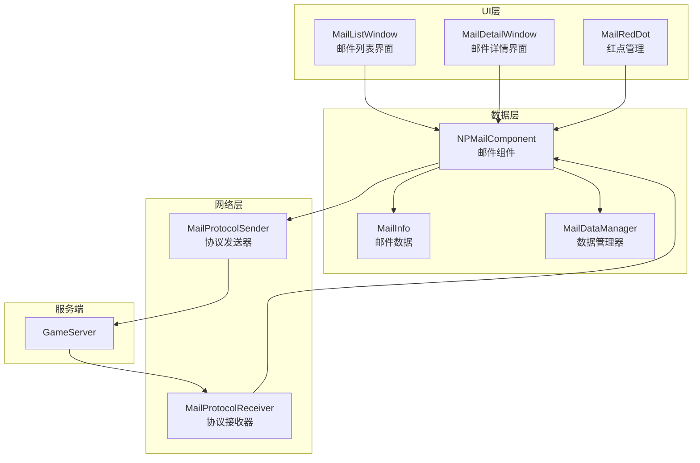
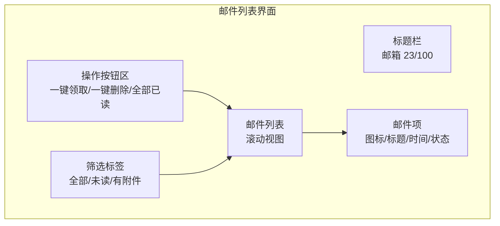
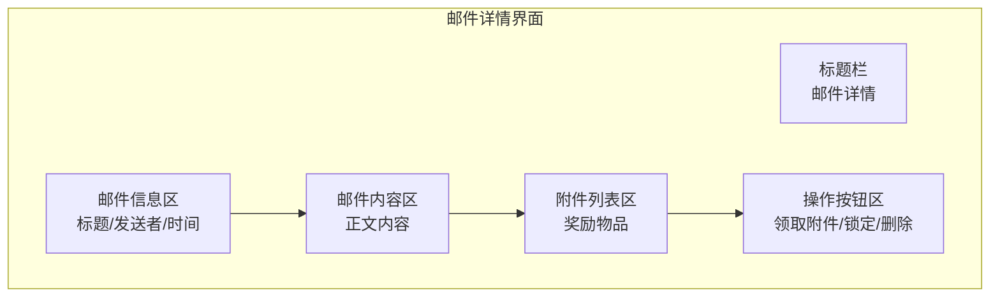

# 邮件系统 - 客户端开发

## 组件结构

邮件系统客户端主要使用 NPMail 组件进行数据管理。

### 核心类

```
GameComponent/Mail/
├── NPMailComponent.cs      # 邮件组件
├── MailInfo.cs             # 邮件信息
├── MailBriefInfo.cs        # 邮件简要信息
└── MailDataManager.cs      # 邮件数据管理器
```

---

## 架构设计



---

## 数据管理

### NPMailComponent

邮件数据管理组件：

```csharp
public class NPMailComponent : _ANPBasicPlayerComponent
{
    // 邮件列表
    private List<MailInfo> _m_mailList;

    // 未读邮件数量
    private int _m_unreadCount;

    // 有奖励邮件数量
    private int _m_rewardCount;

    // 已锁定邮件数量
    private int _m_lockedCount;

    /// <summary>
    /// 获取邮件列表
    /// </summary>
    public List<MailInfo> mailList { get { return _m_mailList; } }

    /// <summary>
    /// 获取未读数量
    /// </summary>
    public int unreadCount { get { return _m_unreadCount; } }

    /// <summary>
    /// 获取有奖励邮件数量
    /// </summary>
    public int rewardCount { get { return _m_rewardCount; } }

    /// <summary>
    /// 获取已锁定数量
    /// </summary>
    public int lockedCount { get { return _m_lockedCount; } }

    /// <summary>
    /// 组件初始化
    /// </summary>
    public override void init()
    {
        base.init();
        _m_mailList = new List<MailInfo>();
        _m_unreadCount = 0;
        _m_rewardCount = 0;
        _m_lockedCount = 0;
    }

    /// <summary>
    /// 组件销毁
    /// </summary>
    public override void destroy()
    {
        _m_mailList.Clear();
        base.destroy();
    }
}
```

### MailInfo

邮件信息类：

```csharp
public class MailInfo
{
    private long _m_mailId;         // 邮件ID
    private int _m_mailType;        // 邮件类型
    private string _m_title;        // 标题
    private string _m_content;      // 内容
    private string _m_sender;       // 发送者
    private long _m_sendTime;       // 发送时间
    private long _m_expireTime;     // 过期时间
    private int _m_state;           // 状态
    private bool _m_hasReward;      // 是否有奖励
    private bool _m_isLocked;       // 是否锁定
    private List<RewardInfo> _m_rewardList; // 奖励列表
    private Dictionary<string, object> _m_exData; // 扩展数据

    // 是否未读
    public bool isUnread { get { return _m_state == (int)EMailState.UNREAD; } }

    // 是否已读
    public bool isRead { get { return _m_state == (int)EMailState.READ; } }

    // 是否有未领取奖励
    public bool hasUnclaimedReward
    {
        get { return _m_hasReward && _m_state < (int)EMailState.REWARD_TAKEN; }
    }

    // 是否已领取奖励
    public bool isRewardTaken { get { return _m_state == (int)EMailState.REWARD_TAKEN; } }

    // 是否过期
    public bool isExpired
    {
        get { return _m_expireTime > 0 && TimeUtils.GetCurrentTimeMs() > _m_expireTime; }
    }

    // 获取发送时间格式化字符串
    public string sendTimeStr
    {
        get { return TimeUtils.FormatTime(_m_sendTime, "yyyy-MM-dd HH:mm"); }
    }

    // 获取过期时间格式化字符串
    public string expireTimeStr
    {
        get { return TimeUtils.FormatTime(_m_expireTime, "yyyy-MM-dd HH:mm"); }
    }

    /// <summary>
    /// 从简要信息构造
    /// </summary>
    public static MailInfo FromBriefInfo(Mail_BriefInfo briefInfo)
    {
        MailInfo info = new MailInfo();
        info._m_mailId = briefInfo.mailId;
        info._m_mailType = briefInfo.mailType;
        info._m_title = briefInfo.title;
        info._m_sendTime = briefInfo.sendTime;
        info._m_state = briefInfo.state;
        info._m_hasReward = briefInfo.hasReward;
        info._m_isLocked = briefInfo.isLocked;
        return info;
    }

    /// <summary>
    /// 从详情信息更新
    /// </summary>
    public void UpdateFromDetailInfo(Mail_DetailInfo detailInfo)
    {
        _m_content = detailInfo.content;
        _m_sender = detailInfo.sender;
        _m_expireTime = detailInfo.expireTime;
        _m_rewardList = RewardInfo.ParseList(detailInfo.rewardList);
        _m_exData = JsonUtils.ParseDictionary(detailInfo.exData);
    }
}
```

### MailBriefInfo

邮件简要信息类：

```csharp
public class MailBriefInfo
{
    public long mailId { get; set; }
    public int mailType { get; set; }
    public string title { get; set; }
    public long sendTime { get; set; }
    public int state { get; set; }
    public bool hasReward { get; set; }
    public bool isLocked { get; set; }

    /// <summary>
    /// 从协议数据构造
    /// </summary>
    public static MailBriefInfo FromProto(Mail_BriefInfo proto)
    {
        return new MailBriefInfo
        {
            mailId = proto.mailId,
            mailType = proto.mailType,
            title = proto.title,
            sendTime = proto.sendTime,
            state = proto.state,
            hasReward = proto.hasReward,
            isLocked = proto.isLocked
        };
    }
}
```

---

## 协议对接

### 发送请求

```csharp
public class NPMailComponent
{
    /// <summary>
    /// 请求邮件列表
    /// </summary>
    public void reqBriefList()
    {
        NPGSClientListener.sendMsg(
            GSWriter_009_MailOp.make_009_002_ReqBriefList());
    }

    /// <summary>
    /// 请求邮件详情
    /// </summary>
    public void reqMailDetail(long mailId)
    {
        NPGSClientListener.sendMsg(
            GSWriter_009_MailOp.make_009_003_ReqMailDetail(mailId));
    }

    /// <summary>
    /// 领取邮件附件
    /// </summary>
    public void reqTakeMailItems(long mailId, Action callback)
    {
        NPGSClientListener.sendRequest(
            GSWriter_009_MailOp.make_009_004_ReqTakeMailItems(mailId),
            new CommonErrCodeRequestCallbackProtocolDealer<GS2GC_009_004_RetTakeMailItems>((msg) =>
            {
                if (msg.getResult().isSucc())
                {
                    // 显示获得奖励
                    showRewardToast(msg.getRewardList());
                }
                callback?.Invoke();
            }));
    }

    /// <summary>
    /// 一键领取所有附件
    /// </summary>
    public void reqAKeyTakeAll(Action callback)
    {
        NPGSClientListener.sendRequest(
            GSWriter_009_MailOp.make_009_006_ReqAKeyTakeAll(),
            new CommonErrCodeRequestCallbackProtocolDealer<GS2GC_009_006_RetAKeyTakeAll>((msg) =>
            {
                if (msg.getResult().isSucc())
                {
                    // 显示获得奖励
                    showRewardToast(msg.getRewardList());
                }
                callback?.Invoke();
            }));
    }

    /// <summary>
    /// 设置邮件锁定状态
    /// </summary>
    public void reqSetMailLockState(long mailId, bool isLocked, Action callback)
    {
        NPGSClientListener.sendRequest(
            GSWriter_009_MailOp.make_009_005_ReqSetMailLockState(mailId, isLocked),
            new CommonErrCodeRequestCallbackProtocolDealer<GS2GC_009_005_RetSetMailLockState>((msg) =>
            {
                callback?.Invoke();
            }));
    }

    /// <summary>
    /// 删除邮件
    /// </summary>
    public void reqDelMail(long mailId, Action callback)
    {
        NPGSClientListener.sendRequest(
            GSWriter_009_MailOp.make_009_007_ReqDelMail(mailId),
            new CommonErrCodeRequestCallbackProtocolDealer<GS2GC_009_007_RetDelMail>((msg) =>
            {
                callback?.Invoke();
            }));
    }

    /// <summary>
    /// 一键删除已读邮件
    /// </summary>
    public void reqAkeyDelAll(Action callback)
    {
        NPGSClientListener.sendRequest(
            GSWriter_009_MailOp.make_009_008_ReqAkeyDelAll(),
            new CommonErrCodeRequestCallbackProtocolDealer<GS2GC_009_008_RetAKeyDelAll>((msg) =>
            {
                callback?.Invoke();
            }));
    }

    /// <summary>
    /// 标记全部已读
    /// </summary>
    public void reqSetAllReadOver(Action callback)
    {
        NPGSClientListener.sendRequest(
            GSWriter_009_MailOp.make_009_009_ReqSetReadOver(0),
            new CommonErrCodeRequestCallbackProtocolDealer<GS2GC_009_009_RetSetReadOver>((msg) =>
            {
                callback?.Invoke();
            }));
    }
}
```

### 接收响应

```csharp
public class NPMailComponent
{
    /// <summary>
    /// 初始化协议监听
    /// </summary>
    public void initProtocolListeners()
    {
        // 邮件列表
        NPGSClientListener.addListener(
            new GS2GC_009_002_RetMailBriefList(),
            (msg) => retMailBriefList((GS2GC_009_002_RetMailBriefList)msg));

        // 新邮件通知
        NPGSClientListener.addListener(
            new GS2GC_009_051_OnMailAdded(),
            (msg) => onMailAdded((GS2GC_009_051_OnMailAdded)msg));

        // 邮件删除通知
        NPGSClientListener.addListener(
            new GS2GC_009_052_OnMailRemoved(),
            (msg) => onMailRemoved((GS2GC_009_052_OnMailRemoved)msg));

        // 锁定状态更新
        NPGSClientListener.addListener(
            new GS2GC_009_053_OnMailLockedUpdated(),
            (msg) => onMailLockedUpdated((GS2GC_009_053_OnMailLockedUpdated)msg));

        // 已读状态更新
        NPGSClientListener.addListener(
            new GS2GC_009_054_OnMailReaded(),
            (msg) => onMailReaded((GS2GC_009_054_OnMailReaded)msg));

        // 奖励已领取
        NPGSClientListener.addListener(
            new GS2GC_009_055_OnMailRewardTaken(),
            (msg) => onMailRewardTaken((GS2GC_009_055_OnMailRewardTaken)msg));
    }

    /// <summary>
    /// 接收邮件列表
    /// </summary>
    public void retMailBriefList(GS2GC_009_002_RetMailBriefList msg)
    {
        _m_mailList.Clear();

        foreach (var briefInfo in msg.getBriefList())
        {
            var mailInfo = MailInfo.FromBriefInfo(briefInfo);
            _m_mailList.Add(mailInfo);
        }

        // 按发送时间倒序排序
        _m_mailList.Sort((a, b) => b.sendTime.CompareTo(a.sendTime));

        // 更新统计
        updateStatistics();

        // 发送刷新消息
        WinMsg.SendMsg(WinMsgType.ON_MAIL_LIST_REFRESH);
    }

    /// <summary>
    /// 接收新邮件通知
    /// </summary>
    public void onMailAdded(GS2GC_009_051_OnMailAdded msg)
    {
        var mailInfo = MailInfo.FromBriefInfo(msg.getMailInfo());

        // 插入到列表开头(最新的邮件)
        _m_mailList.Insert(0, mailInfo);

        // 更新统计
        updateStatistics();

        // 发送刷新消息
        WinMsg.SendMsg(WinMsgType.ON_MAIL_ADDED, mailInfo);

        // 显示新邮件提示
        showNewMailNotification(mailInfo);
    }

    /// <summary>
    /// 邮件删除通知
    /// </summary>
    public void onMailRemoved(GS2GC_009_052_OnMailRemoved msg)
    {
        var mailId = msg.getMailId();
        var removed = _m_mailList.RemoveAll(m => m.mailId == mailId);

        if (removed > 0)
        {
            // 更新统计
            updateStatistics();

            // 发送刷新消息
            WinMsg.SendMsg(WinMsgType.ON_MAIL_REMOVED, mailId);
        }
    }

    /// <summary>
    /// 锁定状态更新
    /// </summary>
    public void onMailLockedUpdated(GS2GC_009_053_OnMailLockedUpdated msg)
    {
        var mailId = msg.getMailId();
        var mailInfo = _m_mailList.Find(m => m.mailId == mailId);

        if (mailInfo != null)
        {
            mailInfo.isLocked = msg.getIsLocked();
            updateStatistics();
            WinMsg.SendMsg(WinMsgType.ON_MAIL_LOCKED_CHANGED, mailId);
        }
    }

    /// <summary>
    /// 已读状态更新
    /// </summary>
    public void onMailReaded(GS2GC_009_054_OnMailReaded msg)
    {
        var mailId = msg.getMailId();
        var mailInfo = _m_mailList.Find(m => m.mailId == mailId);

        if (mailInfo != null && mailInfo.isUnread)
        {
            mailInfo.state = (int)EMailState.READ;
            updateStatistics();
            WinMsg.SendMsg(WinMsgType.ON_MAIL_STATE_CHANGED, mailId);
        }
    }

    /// <summary>
    /// 奖励已领取
    /// </summary>
    public void onMailRewardTaken(GS2GC_009_055_OnMailRewardTaken msg)
    {
        var mailId = msg.getMailId();
        var mailInfo = _m_mailList.Find(m => m.mailId == mailId);

        if (mailInfo != null)
        {
            mailInfo.state = (int)EMailState.REWARD_TAKEN;
            updateStatistics();
            WinMsg.SendMsg(WinMsgType.ON_MAIL_STATE_CHANGED, mailId);
        }
    }
}
```

---

## 统计更新

```csharp
public class NPMailComponent
{
    /// <summary>
    /// 更新统计数据
    /// </summary>
    private void updateStatistics()
    {
        _m_unreadCount = _m_mailList.Count(m => m.isUnread);
        _m_rewardCount = _m_mailList.Count(m => m.hasUnclaimedReward);
        _m_lockedCount = _m_mailList.Count(m => m.isLocked);

        // 更新红点
        updateRedDot();
    }

    /// <summary>
    /// 更新红点
    /// </summary>
    private void updateRedDot()
    {
        int totalRedDot = _m_unreadCount + _m_rewardCount;
        RedTipMgr.instance.setCountByRedTipId(RedTipId.MAIL, totalRedDot);

        // 发送红点更新消息
        WinMsg.SendMsg(WinMsgType.ON_MAIL_REDDOT_CHANGED, totalRedDot);
    }
}
```

---

## UI 窗口

### 邮件列表界面



**主要功能**：
- 显示所有邮件列表
- 区分已读/未读状态
- 显示是否有附件
- 支持批量操作

```csharp
public class MailListWindow : BaseWindow
{
    private List<MailItem> _mailItems = new List<MailItem>();
    private EMailFilterType _currentFilter = EMailFilterType.ALL;

    /// <summary>
    /// 窗口初始化
    /// </summary>
    protected override void onInit()
    {
        base.onInit();

        // 初始化UI组件
        initUIComponents();

        // 注册消息监听
        registerMsgListeners();

        // 请求邮件列表
        NPMailComponent.instance.reqBriefList();
    }

    /// <summary>
    /// 注册消息监听
    /// </summary>
    private void registerMsgListeners()
    {
        WinMsg.addListener(WinMsgType.ON_MAIL_LIST_REFRESH, onMailListRefresh);
        WinMsg.addListener(WinMsgType.ON_MAIL_ADDED, onMailAdded);
        WinMsg.addListener(WinMsgType.ON_MAIL_REMOVED, onMailRemoved);
        WinMsg.addListener(WinMsgType.ON_MAIL_STATE_CHANGED, onMailStateChanged);
        WinMsg.addListener(WinMsgType.ON_MAIL_LOCKED_CHANGED, onMailLockedChanged);
        WinMsg.addListener(WinMsgType.ON_MAIL_REDDOT_CHANGED, onRedDotChanged);
    }

    /// <summary>
    /// 刷新邮件列表
    /// </summary>
    public void refreshMailList()
    {
        var mailList = NPMailComponent.instance.mailList;

        // 应用筛选
        var filteredList = applyFilter(mailList, _currentFilter);

        // 更新UI显示
        updateMailItems(filteredList);

        // 更新标题
        updateTitle();

        // 更新操作按钮状态
        updateActionButtons();
    }

    /// <summary>
    /// 应用筛选
    /// </summary>
    private List<MailInfo> applyFilter(List<MailInfo> mailList, EMailFilterType filter)
    {
        switch (filter)
        {
            case EMailFilterType.UNREAD:
                return mailList.Where(m => m.isUnread).ToList();

            case EMailFilterType.WITH_REWARD:
                return mailList.Where(m => m.hasUnclaimedReward).ToList();

            default:
                return mailList;
        }
    }

    /// <summary>
    /// 更新邮件项
    /// </summary>
    private void updateMailItems(List<MailInfo> mailList)
    {
        // 清空现有项
        clearMailItems();

        // 创建新的邮件项
        foreach (var mailInfo in mailList)
        {
            var mailItem = createMailItem(mailInfo);
            _mailItems.Add(mailItem);
        }
    }

    /// <summary>
    /// 创建邮件项
    /// </summary>
    private MailItem createMailItem(MailInfo mailInfo)
    {
        var mailItem = Instantiate(_mailItemPrefab, _contentTransform).GetComponent<MailItem>();
        mailItem.setData(mailInfo);
        mailItem.onClick = onClickMail;
        return mailItem;
    }

    /// <summary>
    /// 点击邮件
    /// </summary>
    public void onClickMail(MailInfo mailInfo)
    {
        if (mailInfo.isUnread)
        {
            // 请求邮件详情并标记已读
            NPMailComponent.instance.reqMailDetail(mailInfo.mailId);
        }
        else
        {
            // 直接显示内容
            showMailDetail(mailInfo);
        }
    }

    /// <summary>
    /// 一键领取
    /// </summary>
    public void onClickTakeAll()
    {
        if (NPMailComponent.instance.rewardCount == 0)
        {
            UITip.showTip("没有可领取的附件");
            return;
        }

        NPMailComponent.instance.reqAKeyTakeAll(() =>
        {
            refreshMailList();
        });
    }

    /// <summary>
    /// 一键删除
    /// </summary>
    public void onClickDeleteAll()
    {
        UIManager.instance.showConfirm(
            "确认删除",
            "确定要删除所有已读且无附件的邮件吗？",
            () =>
            {
                NPMailComponent.instance.reqAkeyDelAll(() =>
                {
                    refreshMailList();
                });
            });
    }

    /// <summary>
    /// 全部已读
    /// </summary>
    public void onClickReadAll()
    {
        if (NPMailComponent.instance.unreadCount == 0)
        {
            UITip.showTip("没有未读邮件");
            return;
        }

        NPMailComponent.instance.reqSetAllReadOver(() =>
        {
            refreshMailList();
        });
    }
}
```

### 邮件详情界面



**主要功能**：
- 显示邮件完整内容
- 领取附件奖励
- 锁定/解锁邮件
- 删除邮件

```csharp
public class MailDetailWindow : BaseWindow
{
    private MailInfo _mailInfo;

    /// <summary>
    /// 显示邮件详情
    /// </summary>
    public void showMailDetail(MailInfo mailInfo)
    {
        _mailInfo = mailInfo;

        // 设置标题、内容、发送者
        setTitle(mailInfo.title);
        setContent(mailInfo.content);
        setSender(mailInfo.sender);
        setSendTime(mailInfo.sendTimeStr);
        setExpireTime(mailInfo.expireTimeStr);

        // 显示状态图标
        updateStateIcons();

        // 显示奖励列表
        if (mailInfo.hasUnclaimedReward)
        {
            showRewardList(mailInfo.rewardList);
        }
        else if (mailInfo.isRewardTaken)
        {
            showRewardTakenTip();
        }
        else
        {
            hideRewardList();
        }

        // 更新操作按钮
        updateActionButtons();
    }

    /// <summary>
    /// 显示奖励列表
    /// </summary>
    private void showRewardList(List<RewardInfo> rewardList)
    {
        _rewardListGO.SetActive(true);

        foreach (var reward in rewardList)
        {
            var rewardItem = createRewardItem(reward);
            _rewardItemContainer.Add(rewardItem);
        }
    }

    /// <summary>
    /// 领取奖励
    /// </summary>
    public void onClickTakeReward()
    {
        if (_mailInfo == null || !_mailInfo.hasUnclaimedReward)
            return;

        NPMailComponent.instance.reqTakeMailItems(_mailInfo.mailId, () =>
        {
            // 领取成功，更新UI
            showRewardTakenTip();
            hideRewardList();
            updateActionButtons();
        });
    }

    /// <summary>
    /// 锁定/解锁邮件
    /// </summary>
    public void onClickToggleLock()
    {
        if (_mailInfo == null)
            return;

        bool newLockState = !_mailInfo.isLocked;

        NPMailComponent.instance.reqSetMailLockState(_mailInfo.mailId, newLockState, () =>
        {
            // 更新UI
            _mailInfo.isLocked = newLockState;
            updateStateIcons();
            updateActionButtons();
        });
    }

    /// <summary>
    /// 删除邮件
    /// </summary>
    public void onClickDelete()
    {
        if (_mailInfo == null)
            return;

        if (_mailInfo.isLocked)
        {
            UITip.showTip("邮件已锁定，请先解锁");
            return;
        }

        if (_mailInfo.hasUnclaimedReward)
        {
            UIManager.instance.showConfirm(
                "确认删除",
                "该邮件有未领取的附件，确定要删除吗？",
                () => deleteMail());
        }
        else
        {
            deleteMail();
        }
    }

    /// <summary>
    /// 执行删除
    /// </summary>
    private void deleteMail()
    {
        NPMailComponent.instance.reqDelMail(_mailInfo.mailId, () =>
        {
            // 关闭详情界面
            close();

            // 提示删除成功
            UITip.showTip("邮件已删除");
        });
    }

    /// <summary>
    /// 更新操作按钮状态
    /// </summary>
    private void updateActionButtons()
    {
        if (_mailInfo == null)
            return;

        // 领取按钮
        _takeRewardBtn.SetActive(_mailInfo.hasUnclaimedReward);

        // 锁定按钮
        _lockBtnText.text = _mailInfo.isLocked ? "解锁" : "锁定";
        _lockBtnIcon.sprite = _mailInfo.isLocked ? _lockedIcon : _unlockedIcon;

        // 删除按钮
        _deleteBtn.interactable = !_mailInfo.isLocked;
    }
}
```

---

## 邮件项组件

```csharp
public class MailItem : MonoBehaviour
{
    [SerializeField] private Image _typeIcon;
    [SerializeField] private Text _titleText;
    [SerializeField] private Text _timeText;
    [SerializeField] private GameObject _unreadIcon;
    [SerializeField] private GameObject _rewardIcon;
    [SerializeField] private GameObject _lockedIcon;
    [SerializeField] private GameObject _takenIcon;
    [SerializeField] private Button _itemButton;

    private MailInfo _mailInfo;
    public Action<MailInfo> onClick;

    /// <summary>
    /// 设置数据
    /// </summary>
    public void setData(MailInfo mailInfo)
    {
        _mailInfo = mailInfo;

        // 设置类型图标
        _typeIcon.sprite = getMailTypeIcon(mailInfo.mailType);

        // 设置标题
        _titleText.text = mailInfo.title;
        _titleText.color = mailInfo.isUnread ? _unreadColor : _readColor;

        // 设置时间
        _timeText.text = mailInfo.sendTimeStr;

        // 设置状态图标
        _unreadIcon.SetActive(mailInfo.isUnread);
        _rewardIcon.SetActive(mailInfo.hasUnclaimedReward);
        _lockedIcon.SetActive(mailInfo.isLocked);
        _takenIcon.SetActive(mailInfo.isRewardTaken);
    }

    /// <summary>
    /// 获取邮件类型图标
    /// </summary>
    private Sprite getMailTypeIcon(int mailType)
    {
        switch ((EMailType)mailType)
        {
            case EMailType.SYSTEM:
                return _systemIcon;
            case EMailType.REWARD:
                return _rewardIcon;
            case EMailType.FRIEND:
                return _friendIcon;
            case EMailType.GUILD:
                return _guildIcon;
            case EMailType.ACTIVITY:
                return _activityIcon;
            case EMailType.RECHARGE:
                return _rechargeIcon;
            case EMailType.COMPENSATE:
                return _compensateIcon;
            default:
                return _systemIcon;
        }
    }

    /// <summary>
    /// 初始化
    /// </summary>
    private void Awake()
    {
        _itemButton.onClick.AddListener(onItemClick);
    }

    /// <summary>
    /// 点击事件
    /// </summary>
    private void onItemClick()
    {
        onClick?.Invoke(_mailInfo);
    }
}
```

---

## 红点系统

邮件红点触发条件：
- 有未读邮件
- 有未领取的附件

```csharp
public class MailRedDot : MonoBehaviour
{
    [SerializeField] private GameObject _redDot;
    [SerializeField] private Text _countText;

    /// <summary>
    /// 初始化
    /// </summary>
    private void Awake()
    {
        WinMsg.addListener(WinMsgType.ON_MAIL_REDDOT_CHANGED, onRedDotChanged);
        updateRedDot();
    }

    /// <summary>
    /// 红点变化回调
    /// </summary>
    private void onRedDotChanged(object data)
    {
        int count = (int)data;
        updateRedDotUI(count);
    }

    /// <summary>
    /// 更新红点
    /// </summary>
    private void updateRedDot()
    {
        int count = NPMailComponent.instance.unreadCount + NPMailComponent.instance.rewardCount;
        updateRedDotUI(count);
    }

    /// <summary>
    /// 更新红点UI
    /// </summary>
    private void updateRedDotUI(int count)
    {
        if (count > 0)
        {
            _redDot.SetActive(true);
            _countText.text = count > 99 ? "99+" : count.ToString();
        }
        else
        {
            _redDot.SetActive(false);
        }
    }

    /// <summary>
    /// 销毁
    /// </summary>
    private void OnDestroy()
    {
        WinMsg.removeListener(WinMsgType.ON_MAIL_REDDOT_CHANGED, onRedDotChanged);
    }
}
```

---

## 工具方法

### 邮件类型工具

```csharp
public static class MailTypeUtils
{
    /// <summary>
    /// 获取邮件类型名称
    /// </summary>
    public static string GetMailTypeName(int mailType)
    {
        switch ((EMailType)mailType)
        {
            case EMailType.SYSTEM: return "系统邮件";
            case EMailType.REWARD: return "奖励邮件";
            case EMailType.FRIEND: return "好友邮件";
            case EMailType.GUILD: return "公会邮件";
            case EMailType.ACTIVITY: return "活动邮件";
            case EMailType.RECHARGE: return "充值邮件";
            case EMailType.COMPENSATE: return "补偿邮件";
            default: return "未知类型";
        }
    }

    /// <summary>
    /// 获取邮件类型图标名称
    /// </summary>
    public static string GetMailTypeIconName(int mailType)
    {
        switch ((EMailType)mailType)
        {
            case EMailType.SYSTEM: return "mail_system";
            case EMailType.REWARD: return "mail_reward";
            case EMailType.FRIEND: return "mail_friend";
            case EMailType.GUILD: return "mail_guild";
            case EMailType.ACTIVITY: return "mail_activity";
            case EMailType.RECHARGE: return "mail_recharge";
            case EMailType.COMPENSATE: return "mail_compensate";
            default: return "mail_system";
        }
    }

    /// <summary>
    /// 获取邮件类型颜色
    /// </summary>
    public static Color GetMailTypeColor(int mailType)
    {
        switch ((EMailType)mailType)
        {
            case EMailType.SYSTEM: return new Color(0.5f, 0.5f, 0.5f);
            case EMailType.REWARD: return new Color(1f, 0.8f, 0f);
            case EMailType.FRIEND: return new Color(0.3f, 0.7f, 1f);
            case EMailType.GUILD: return new Color(0.8f, 0.4f, 1f);
            case EMailType.ACTIVITY: return new Color(1f, 0.5f, 0.3f);
            case EMailType.RECHARGE: return new Color(1f, 0.2f, 0.2f);
            case EMailType.COMPENSATE: return new Color(0.3f, 1f, 0.3f);
            default: return Color.white;
        }
    }
}
```

### 时间格式化工具

```csharp
public static class MailTimeUtils
{
    /// <summary>
    /// 格式化邮件时间显示
    /// </summary>
    public static string FormatMailTime(long timestamp)
    {
        long now = TimeUtils.GetCurrentTimeMs();
        long diff = now - timestamp;

        // 1小时内
        if (diff < 3600000)
        {
            int minutes = (int)(diff / 60000);
            return minutes <= 1 ? "刚刚" : $"{minutes}分钟前";
        }

        // 今天
        if (TimeUtils.IsToday(timestamp))
        {
            return TimeUtils.FormatTime(timestamp, "HH:mm");
        }

        // 昨天
        if (TimeUtils.IsYesterday(timestamp))
        {
            return "昨天 " + TimeUtils.FormatTime(timestamp, "HH:mm");
        }

        // 今年
        if (TimeUtils.IsThisYear(timestamp))
        {
            return TimeUtils.FormatTime(timestamp, "MM-dd HH:mm");
        }

        // 其他
        return TimeUtils.FormatTime(timestamp, "yyyy-MM-dd");
    }

    /// <summary>
    /// 格式化过期时间
    /// </summary>
    public static string FormatExpireTime(long expireTime)
    {
        long now = TimeUtils.GetCurrentTimeMs();
        long diff = expireTime - now;

        if (diff <= 0)
            return "已过期";

        int days = (int)(diff / 86400000);

        if (days > 7)
            return $"{days}天后过期";
        else if (days > 0)
            return $"<color=red>{days}天后过期</color>";
        else
        {
            int hours = (int)(diff / 3600000);
            return $"<color=red>{hours}小时后过期</color>";
        }
    }
}
```

---

## 消息类型定义

```csharp
public class WinMsgType
{
    // 邮件列表刷新
    public const int ON_MAIL_LIST_REFRESH = 9001;

    // 新邮件添加
    public const int ON_MAIL_ADDED = 9002;

    // 邮件删除
    public const int ON_MAIL_REMOVED = 9003;

    // 邮件状态变化
    public const int ON_MAIL_STATE_CHANGED = 9004;

    // 锁定状态变化
    public const int ON_MAIL_LOCKED_CHANGED = 9005;

    // 红点变化
    public const int ON_MAIL_REDDOT_CHANGED = 9006;
}
```

---

## 枚举定义

```csharp
/// <summary>
/// 邮件类型枚举
/// </summary>
public enum EMailType
{
    SYSTEM = 1,         // 系统邮件
    REWARD = 2,         // 奖励邮件
    FRIEND = 3,         // 好友邮件
    GUILD = 4,          // 公会邮件
    ACTIVITY = 5,       // 活动邮件
    RECHARGE = 6,       // 充值邮件
    COMPENSATE = 7      // 补偿邮件
}

/// <summary>
/// 邮件状态枚举
/// </summary>
public enum EMailState
{
    UNREAD = 0,         // 未读
    READ = 1,           // 已读
    REWARD_TAKEN = 2    // 附件已领取
}

/// <summary>
/// 邮件筛选类型
/// </summary>
public enum EMailFilterType
{
    ALL = 0,            // 全部
    UNREAD = 1,         // 未读
    WITH_REWARD = 2     // 有附件
}
```

---

## 注意事项

1. **邮件列表排序**：需要按时间倒序排列
2. **锁定的邮件**：不能被一键删除
3. **附件领取**：领取后需要更新邮件状态
4. **过期处理**：注意处理邮件过期情况
5. **红点更新**：邮件状态变化时及时更新红点
6. **内存管理**：大量邮件时注意内存占用

---

## 性能优化建议

### 列表优化

```csharp
public class MailListOptimization
{
    /// <summary>
    /// 使用虚拟列表优化大量邮件
    /// </summary>
    private void optimizeLargeMailList()
    {
        // 使用对象池
        _mailItemPool = new GameObjectPool<MailItem>(_mailItemPrefab);

        // 使用虚拟列表
        _virtualList = new VirtualList<MailInfo, MailItem>(
            _scrollRect,
            _mailItemPrefab,
            onItemUpdate: updateMailItem,
            onItemCreate: createMailItem,
            onItemRecycle: recycleMailItem
        );
    }

    /// <summary>
    /// 分批加载邮件
    /// </summary>
    private void loadMailsInBatch(List<MailInfo> allMails)
    {
        int batchSize = 20;
        int currentIndex = 0;

        StartCoroutine(loadBatch());

        IEnumerator loadBatch()
        {
            while (currentIndex < allMails.Count)
            {
                int endIndex = Mathf.Min(currentIndex + batchSize, allMails.Count);

                for (int i = currentIndex; i < endIndex; i++)
                {
                    createMailItem(allMails[i]);
                }

                currentIndex = endIndex;
                yield return null;
            }
        }
    }
}
```

### 缓存优化

```csharp
public class MailCacheManager
{
    // 缓存邮件详情
    private Dictionary<long, Mail_DetailInfo> _detailCache = new Dictionary<long, Mail_DetailInfo>();

    // 缓存过期时间(5分钟)
    private const int CACHE_EXPIRE_SECONDS = 300;

    /// <summary>
    /// 获取缓存的邮件详情
    /// </summary>
    public Mail_DetailInfo getCachedDetail(long mailId)
    {
        if (_detailCache.TryGetValue(mailId, out var detail))
        {
            // 检查缓存是否过期
            if (TimeUtils.GetCurrentTimeMs() - detail.cacheTime < CACHE_EXPIRE_SECONDS * 1000)
            {
                return detail;
            }
            else
            {
                _detailCache.Remove(mailId);
            }
        }
        return null;
    }

    /// <summary>
    /// 缓存邮件详情
    /// </summary>
    public void cacheDetail(long mailId, Mail_DetailInfo detail)
    {
        detail.cacheTime = TimeUtils.GetCurrentTimeMs();
        _detailCache[mailId] = detail;
    }

    /// <summary>
    /// 清空缓存
    /// </summary>
    public void clearCache()
    {
        _detailCache.Clear();
    }
}
```

---

## 调试工具

### 邮件调试面板

```csharp
#if UNITY_EDITOR || DEVELOPMENT_BUILD
public class MailDebugPanel : MonoBehaviour
{
    [SerializeField] private GameObject _panel;

    private void Update()
    {
        if (Input.GetKeyDown(KeyCode.M) && Input.GetKey(KeyCode.LeftControl))
        {
            _panel.SetActive(!_panel.activeSelf);
        }
    }

    public void OnClickAddTestMail()
    {
        // 添加测试邮件
        var mailInfo = createTestMail();
        NPMailComponent.instance.onMailAdded(mailInfo);
    }

    public void OnClickClearAllMails()
    {
        // 清空所有邮件
        NPMailComponent.instance.clearAllMails();
    }

    public void OnClickRefreshList()
    {
        // 刷新列表
        NPMailComponent.instance.reqBriefList();
    }

    private Mail_BriefInfo createTestMail()
    {
        return new Mail_BriefInfo
        {
            mailId = Random.Range(10000, 99999),
            mailType = Random.Range(1, 8),
            title = "测试邮件 " + DateTime.Now.ToString("HH:mm:ss"),
            sendTime = TimeUtils.GetCurrentTimeMs(),
            state = 0,
            hasReward = Random.Range(0, 2) == 1,
            isLocked = false
        };
    }
}
#endif
```

---

*文档生成时间: 2026-04-11*
