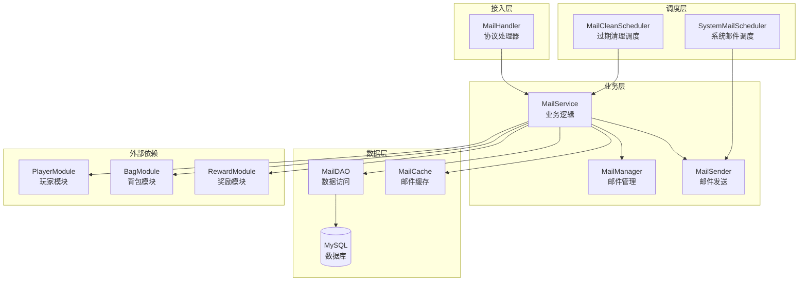

# 邮件系统 - 服务端开发

## 模块架构

### 目录结构

```
GameServer/
├── MailModule/
│   ├── MailHandler.java          # 协议处理器
│   ├── MailService.java          # 业务逻辑服务
│   ├── MailManager.java          # 邮件管理器
│   ├── MailSender.java           # 邮件发送器
│   ├── SystemMailScheduler.java  # 系统邮件调度器
│   └── MailDAO.java              # 数据访问层
```

---

## 架构设计



---

## 数据存储

### 邮件数据表 (player_mail)

| 字段名 | 类型 | 说明 |
|-------|------|------|
| id | bigint(20) | 邮件ID (主键) |
| cid | bigint(20) | 玩家ID |
| mail_type | int(11) | 邮件类型 |
| title | varchar(255) | 邮件标题 |
| content | text | 邮件内容 |
| sender | varchar(64) | 发送者 |
| reward_list | json | 奖励列表 |
| state | int(11) | 状态 |
| is_locked | tinyint(1) | 是否锁定 |
| send_time | datetime | 发送时间 |
| expire_time | datetime | 过期时间 |
| ex_data | json | 扩展数据 |
| create_time | datetime | 创建时间 |

### 系统邮件表 (system_mail)

| 字段名 | 类型 | 说明 |
|-------|------|------|
| mail_id | bigint(20) | 邮件ID (主键) |
| mail_type | int(11) | 邮件类型 |
| title | varchar(255) | 标题 |
| content | text | 内容 |
| sender | varchar(64) | 发送者 |
| reward_list | json | 奖励列表 |
| send_time | datetime | 发送时间 |
| expire_time | datetime | 过期时间 |
| target_condition | json | 目标玩家条件 |
| status | int(11) | 状态 |
| sent_count | int(11) | 已发送数量 |
| create_time | datetime | 创建时间 |

---

## 核心逻辑

### MailService - 邮件服务

```java
public class MailService
{
    @Autowired
    private MailDAO mailDao;

    @Autowired
    private PlayerService playerService;

    @Autowired
    private BagService bagService;

    @Autowired
    private RewardService rewardService;

    @Autowired
    private MailCache mailCache;

    /**
     * 发送单人邮件
     */
    public Result sendMail(long playerId, MailData mailData)
    {
        // 1. 检查邮箱容量
        int currentCount = mailDao.countByPlayerId(playerId);
        int maxCapacity = getMailCapacity(playerId);

        if (currentCount >= maxCapacity)
        {
            // 自动清理最早的已读无附件邮件
            cleanOldestReadMail(playerId);
        }

        // 2. 生成邮件ID
        long mailId = idGenerator.nextId();

        // 3. 计算过期时间
        Date expireTime = calculateExpireTime(playerId, mailData.getMailType());

        // 4. 创建邮件
        PlayerMail mail = new PlayerMail();
        mail.setId(mailId);
        mail.setCid(playerId);
        mail.setMailType(mailData.getMailType());
        mail.setTitle(mailData.getTitle());
        mail.setContent(mailData.getContent());
        mail.setSender(mailData.getSender());
        mail.setRewardList(JsonUtils.toJson(mailData.getRewardList()));
        mail.setState(EMailState.UNREAD.getValue());
        mail.setIsLocked(false);
        mail.setSendTime(new Date());
        mail.setExpireTime(expireTime);
        mail.setCreateTime(new Date());

        // 5. 保存邮件
        mailDao.insert(mail);

        // 6. 更新缓存
        mailCache.addMail(playerId, mail);

        // 7. 推送通知
        if (playerService.isOnline(playerId))
        {
            pushMailAdded(playerId, mail);
        }

        return Result.success(mailId);
    }

    /**
     * 发送系统邮件（批量）
     */
    public Result sendSystemMail(SystemMail systemMail)
    {
        // 1. 获取目标玩家列表
        List<Long> targetPlayers = getTargetPlayers(systemMail.getTargetCondition());

        if (targetPlayers.isEmpty())
            return Result.fail("目标玩家列表为空");

        // 2. 更新系统邮件状态为发送中
        systemMail.setStatus(ESystemMailStatus.SENDING.getValue());
        systemMailDao.updateById(systemMail);

        // 3. 批量插入邮件
        int batchSize = 1000;
        int sentCount = 0;

        for (int i = 0; i < targetPlayers.size(); i += batchSize)
        {
            int endIndex = Math.min(i + batchSize, targetPlayers.size());
            List<Long> batch = targetPlayers.subList(i, endIndex);

            // 批量创建邮件
            List<PlayerMail> mailBatch = new ArrayList<>();
            Map<Long, PlayerMail> onlinePlayerMails = new HashMap<>();

            for (Long playerId : batch)
            {
                PlayerMail mail = createMailFromSystem(systemMail, playerId);
                mailBatch.add(mail);

                if (playerService.isOnline(playerId))
                {
                    onlinePlayerMails.put(playerId, mail);
                }
            }

            // 批量插入
            mailDao.batchInsert(mailBatch);
            sentCount += batch.size();

            // 推送给在线玩家
            for (Map.Entry<Long, PlayerMail> entry : onlinePlayerMails.entrySet())
            {
                pushMailAdded(entry.getKey(), entry.getValue());
            }

            // 更新进度
            systemMail.setSentCount(sentCount);
            systemMailDao.updateById(systemMail);
        }

        // 4. 更新系统邮件状态为已发送
        systemMail.setStatus(ESystemMailStatus.SENT.getValue());
        systemMail.setSentCount(sentCount);
        systemMailDao.updateById(systemMail);

        return Result.success(sentCount);
    }

    /**
     * 领取邮件附件
     */
    public Result takeMailItems(long playerId, long mailId, NPPlayerContext context)
    {
        // 1. 查询邮件
        PlayerMail mail = mailDao.selectById(mailId);
        if (mail == null || !mail.getCid().equals(playerId))
            return Result.fail(MailErr.MAIL_NOT_FOUND);

        // 2. 检查过期
        if (mail.getExpireTime().before(new Date()))
            return Result.fail(MailErr.MAIL_EXPIRED);

        // 3. 检查附件状态
        if (mail.getState() == EMailState.REWARD_TAKEN.getValue())
            return Result.fail(MailErr.MAIL_REWARD_TAKEN);

        // 4. 解析奖励列表
        List<RewardInfo> rewardList = JsonUtils.parseList(mail.getRewardList(), RewardInfo.class);
        if (rewardList == null || rewardList.isEmpty())
        {
            // 无附件邮件直接标记已读
            mail.setState(EMailState.READ.getValue());
            mailDao.updateById(mail);
            return Result.success();
        }

        // 5. 检查背包空间
        if (!bagService.hasEnoughSpace(playerId, rewardList))
            return Result.fail(MailErr.BAG_FULL);

        // 6. 发放奖励
        List<NPCommonCostItem> items = rewardService.giveRewards(playerId, rewardList, context);

        // 7. 更新邮件状态
        mail.setState(EMailState.REWARD_TAKEN.getValue());
        mailDao.updateById(mail);

        // 8. 更新缓存
        mailCache.updateMail(playerId, mail);

        // 9. 推送通知
        pushMailRewardTaken(playerId, mailId);

        return Result.success(items);
    }

    /**
     * 一键领取所有附件
     */
    public Result takeAllMailItems(long playerId, NPPlayerContext context)
    {
        // 1. 查询所有有附件未领取的邮件
        List<PlayerMail> mailList = mailDao.selectWithUnclaimedReward(playerId);

        if (mailList.isEmpty())
            return Result.fail(MailErr.NO_REWARD_TO_TAKE);

        // 2. 汇总所有奖励
        List<RewardInfo> allRewards = new ArrayList<>();
        List<Long> mailIds = new ArrayList<>();

        for (PlayerMail mail : mailList)
        {
            List<RewardInfo> rewards = JsonUtils.parseList(mail.getRewardList(), RewardInfo.class);
            if (rewards != null && !rewards.isEmpty())
            {
                allRewards.addAll(rewards);
                mailIds.add(mail.getId());
            }
        }

        // 3. 检查背包空间
        if (!bagService.hasEnoughSpace(playerId, allRewards))
            return Result.fail(MailErr.BAG_FULL);

        // 4. 批量发放奖励
        List<NPCommonCostItem> items = rewardService.giveRewards(playerId, allRewards, context);

        // 5. 批量更新邮件状态
        mailDao.batchUpdateState(mailIds, EMailState.REWARD_TAKEN.getValue());

        // 6. 更新缓存
        mailCache.removeMails(playerId, mailIds);

        // 7. 推送通知
        for (Long mailId : mailIds)
        {
            pushMailRewardTaken(playerId, mailId);
        }

        return Result.success(items);
    }

    /**
     * 删除邮件
     */
    public Result deleteMail(long playerId, long mailId)
    {
        // 1. 查询邮件
        PlayerMail mail = mailDao.selectById(mailId);
        if (mail == null || !mail.getCid().equals(playerId))
            return Result.fail(MailErr.MAIL_NOT_FOUND);

        // 2. 检查锁定状态
        if (mail.getIsLocked())
            return Result.fail(MailErr.MAIL_LOCKED);

        // 3. 检查附件状态
        if (mail.getState() != EMailState.REWARD_TAKEN.getValue())
        {
            List<RewardInfo> rewards = JsonUtils.parseList(mail.getRewardList(), RewardInfo.class);
            if (rewards != null && !rewards.isEmpty())
                return Result.fail(MailErr.MAIL_HAS_REWARD);
        }

        // 4. 删除邮件
        mailDao.deleteById(mailId);

        // 5. 更新缓存
        mailCache.removeMail(playerId, mailId);

        // 6. 推送通知
        pushMailRemoved(playerId, mailId);

        return Result.success();
    }
}
```

---

## MailHandler - 协议处理器

```java
public class MailHandler
{
    @Autowired
    private MailService mailService;

    /**
     * 请求邮件列表
     */
    @Handler(module = 9, sub = 2)
    public void handleBriefList(long playerId, GC2GS_009_002_ReqBriefList req)
    {
        List<PlayerMail> mailList = mailService.getMailList(playerId);
        sendRetMailBriefList(playerId, mailList);
    }

    /**
     * 请求邮件详情
     */
    @Handler(module = 9, sub = 3)
    public void handleMailDetail(long playerId, GC2GS_009_003_ReqMailDetail req)
    {
        Result result = mailService.getMailDetail(playerId, req.getMailId());

        if (result.isSucc())
        {
            sendRetMailDetail(playerId, (Mail_DetailInfo) result.getData());
        }
        else
        {
            sendError(playerId, result.getCode(), result.getMsg());
        }
    }

    /**
     * 领取附件
     */
    @Handler(module = 9, sub = 4)
    public void handleTakeMailItems(long playerId, GC2GS_009_004_ReqTakeMailItems req)
    {
        NPPlayerContext context = getPlayerContext(playerId);
        Result result = mailService.takeMailItems(playerId, req.getMailId(), context);

        if (result.isSucc())
        {
            GS2GC_009_004_RetTakeMailItems resp = new GS2GC_009_004_RetTakeMailItems();
            resp.setMailId(req.getMailId());
            resp.setRewardList((List<NPCommonCostItem>) result.getData());
            sendResponse(playerId, resp);
        }
        else
        {
            sendError(playerId, result.getCode(), result.getMsg());
        }
    }

    /**
     * 设置锁定状态
     */
    @Handler(module = 9, sub = 5)
    public void handleSetMailLockState(long playerId, GC2GS_009_005_ReqSetMailLockState req)
    {
        Result result = mailService.setMailLockState(playerId, req.getMailId(), req.getIsLocked());

        if (result.isSucc())
        {
            GS2GC_009_005_RetSetMailLockState resp = new GS2GC_009_005_RetSetMailLockState();
            resp.setMailId(req.getMailId());
            resp.setIsLocked(req.getIsLocked());
            sendResponse(playerId, resp);

            // 推送锁定状态更新
            pushMailLockedUpdated(playerId, req.getMailId(), req.getIsLocked());
        }
        else
        {
            sendError(playerId, result.getCode(), result.getMsg());
        }
    }

    /**
     * 一键领取
     */
    @Handler(module = 9, sub = 6)
    public void handleAKeyTakeAll(long playerId, GC2GS_009_006_ReqAKeyTakeAll req)
    {
        NPPlayerContext context = getPlayerContext(playerId);
        Result result = mailService.takeAllMailItems(playerId, context);

        if (result.isSucc())
        {
            GS2GC_009_006_RetAKeyTakeAll resp = new GS2GC_009_006_RetAKeyTakeAll();
            resp.setRewardList((List<NPCommonCostItem>) result.getData());
            sendResponse(playerId, resp);
        }
        else
        {
            sendError(playerId, result.getCode(), result.getMsg());
        }
    }

    /**
     * 删除邮件
     */
    @Handler(module = 9, sub = 7)
    public void handleDelMail(long playerId, GC2GS_009_007_ReqDelMail req)
    {
        Result result = mailService.deleteMail(playerId, req.getMailId());

        if (result.isSucc())
        {
            GS2GC_009_007_RetDelMail resp = new GS2GC_009_007_RetDelMail();
            resp.setMailId(req.getMailId());
            sendResponse(playerId, resp);
        }
        else
        {
            sendError(playerId, result.getCode(), result.getMsg());
        }
    }
}
```

---

## 定时任务

### 清理过期邮件

```java
@Component
public class MailCleanScheduler
{
    @Autowired
    private MailDAO mailDao;

    @Autowired
    private MailCache mailCache;

    private static final Logger logger = LoggerFactory.getLogger(MailCleanScheduler.class);

    /**
     * 每天凌晨2点清理过期邮件
     */
    @Scheduled(cron = "0 0 2 * * ?")
    public void cleanExpiredMails()
    {
        logger.info("Start cleaning expired mails...");

        Date now = new Date();
        int totalDeleted = 0;

        // 分批处理，避免一次性处理过多
        int batchSize = 10000;

        while (true)
        {
            // 查询过期邮件ID
            List<Long> expiredMailIds = mailDao.selectExpiredIds(now, batchSize);

            if (expiredMailIds.isEmpty())
                break;

            // 批量删除
            mailDao.batchDelete(expiredMailIds);
            totalDeleted += expiredMailIds.size();

            // 清理缓存
            mailCache.cleanExpiredMails(expiredMailIds);

            logger.info("Cleaned {} expired mails, total: {}", expiredMailIds.size(), totalDeleted);

            // 如果查询数量小于批次大小，说明已经处理完
            if (expiredMailIds.size() < batchSize)
                break;
        }

        logger.info("Mail cleanup completed, total deleted: {}", totalDeleted);
    }
}
```

### 发送定时系统邮件

```java
@Component
public class SystemMailScheduler
{
    @Autowired
    private MailService mailService;

    @Autowired
    private SystemMailDAO systemMailDao;

    /**
     * 每分钟检查待发送的系统邮件
     */
    @Scheduled(fixedRate = 60000)
    public void sendScheduledMails()
    {
        // 查询待发送的系统邮件
        List<SystemMail> pendingMails = systemMailDao.selectPending();

        for (SystemMail mail : pendingMails)
        {
            // 检查发送时间
            if (mail.getSendTime().after(new Date()))
                continue;

            // 异步发送
            CompletableFuture.runAsync(() ->
            {
                try
                {
                    Result result = mailService.sendSystemMail(mail);

                    if (result.isSucc())
                    {
                        logger.info("System mail sent successfully, mailId: {}, sentCount: {}",
                            mail.getMailId(), result.getData());
                    }
                    else
                    {
                        logger.error("System mail send failed, mailId: {}, error: {}",
                            mail.getMailId(), result.getMsg());
                    }
                }
                catch (Exception e)
                {
                    logger.error("System mail send error, mailId: " + mail.getMailId(), e);
                }
            });
        }
    }
}
```

---

## 数据访问层

### MailDAO

```java
@Repository
public class MailDAO
{
    @Autowired
    private JdbcTemplate jdbcTemplate;

    /**
     * 插入邮件
     */
    public void insert(PlayerMail mail)
    {
        String sql = "INSERT INTO player_mail " +
            "(id, cid, mail_type, title, content, sender, reward_list, state, is_locked, " +
            "send_time, expire_time, ex_data, create_time) " +
            "VALUES (?, ?, ?, ?, ?, ?, ?, ?, ?, ?, ?, ?, ?)";

        jdbcTemplate.update(sql,
            mail.getId(),
            mail.getCid(),
            mail.getMailType(),
            mail.getTitle(),
            mail.getContent(),
            mail.getSender(),
            mail.getRewardList(),
            mail.getState(),
            mail.getIsLocked(),
            mail.getSendTime(),
            mail.getExpireTime(),
            mail.getExData(),
            mail.getCreateTime());
    }

    /**
     * 批量插入邮件
     */
    public void batchInsert(List<PlayerMail> mailList)
    {
        String sql = "INSERT INTO player_mail " +
            "(id, cid, mail_type, title, content, sender, reward_list, state, is_locked, " +
            "send_time, expire_time, create_time) " +
            "VALUES (?, ?, ?, ?, ?, ?, ?, ?, ?, ?, ?, ?)";

        jdbcTemplate.batchUpdate(sql, new BatchPreparedStatementSetter()
        {
            @Override
            public void setValues(PreparedStatement ps, int i) throws SQLException
            {
                PlayerMail mail = mailList.get(i);
                ps.setLong(1, mail.getId());
                ps.setLong(2, mail.getCid());
                ps.setInt(3, mail.getMailType());
                ps.setString(4, mail.getTitle());
                ps.setString(5, mail.getContent());
                ps.setString(6, mail.getSender());
                ps.setString(7, mail.getRewardList());
                ps.setInt(8, mail.getState());
                ps.setBoolean(9, mail.getIsLocked());
                ps.setTimestamp(10, new Timestamp(mail.getSendTime().getTime()));
                ps.setTimestamp(11, new Timestamp(mail.getExpireTime().getTime()));
                ps.setTimestamp(12, new Timestamp(mail.getCreateTime().getTime()));
            }

            @Override
            public int getBatchSize()
            {
                return mailList.size();
            }
        });
    }

    /**
     * 根据玩家ID查询邮件列表
     */
    public List<PlayerMail> selectByCid(long cid)
    {
        String sql = "SELECT * FROM player_mail WHERE cid = ? AND expire_time > ? ORDER BY send_time DESC";
        return jdbcTemplate.query(sql, new Object[]{cid, new Date()}, new MailRowMapper());
    }

    /**
     * 查询有未领取附件的邮件
     */
    public List<PlayerMail> selectWithUnclaimedReward(long cid)
    {
        String sql = "SELECT * FROM player_mail " +
            "WHERE cid = ? AND state < ? AND reward_list IS NOT NULL AND reward_list != '[]'";

        return jdbcTemplate.query(sql,
            new Object[]{cid, EMailState.REWARD_TAKEN.getValue()},
            new MailRowMapper());
    }

    /**
     * 批量更新状态
     */
    public void batchUpdateState(List<Long> mailIds, int state)
    {
        String sql = "UPDATE player_mail SET state = ? WHERE id IN (?)";

        String inClause = mailIds.stream()
            .map(String::valueOf)
            .collect(Collectors.joining(","));

        jdbcTemplate.update(sql, state, inClause);
    }

    /**
     * 查询过期邮件ID
     */
    public List<Long> selectExpiredIds(Date expireTime, int limit)
    {
        String sql = "SELECT id FROM player_mail WHERE expire_time < ? LIMIT ?";
        return jdbcTemplate.queryForList(sql, new Object[]{expireTime, limit}, Long.class);
    }

    /**
     * 批量删除
     */
    public void batchDelete(List<Long> mailIds)
    {
        if (mailIds.isEmpty())
            return;

        String sql = "DELETE FROM player_mail WHERE id IN (?)";

        String inClause = mailIds.stream()
            .map(String::valueOf)
            .collect(Collectors.joining(","));

        jdbcTemplate.update(sql, inClause);
    }
}
```

---

## 缓存设计

### MailCache

```java
@Component
public class MailCache
{
    @Autowired
    private RedisTemplate<String, Object> redisTemplate;

    // 缓存前缀
    private static final String MAIL_LIST_KEY = "mail:list:";
    private static final String MAIL_DETAIL_KEY = "mail:detail:";

    // 缓存过期时间(秒)
    private static final int CACHE_EXPIRE = 300;

    /**
     * 添加邮件到缓存
     */
    public void addMail(long playerId, PlayerMail mail)
    {
        String listKey = MAIL_LIST_KEY + playerId;

        // 添加到列表缓存
        redisTemplate.opsForList().leftPush(listKey, mail);
        redisTemplate.expire(listKey, CACHE_EXPIRE, TimeUnit.SECONDS);

        // 添加详情缓存
        String detailKey = MAIL_DETAIL_KEY + mail.getId();
        redisTemplate.opsForValue().set(detailKey, mail, CACHE_EXPIRE, TimeUnit.SECONDS);
    }

    /**
     * 获取邮件列表缓存
     */
    public List<PlayerMail> getMailList(long playerId)
    {
        String listKey = MAIL_LIST_KEY + playerId;
        List<Object> list = redisTemplate.opsForList().range(listKey, 0, -1);

        if (list == null || list.isEmpty())
            return null;

        return list.stream()
            .map(obj -> (PlayerMail) obj)
            .collect(Collectors.toList());
    }

    /**
     * 更新邮件缓存
     */
    public void updateMail(long playerId, PlayerMail mail)
    {
        String detailKey = MAIL_DETAIL_KEY + mail.getId();
        redisTemplate.opsForValue().set(detailKey, mail, CACHE_EXPIRE, TimeUnit.SECONDS);

        // 删除列表缓存，强制重新加载
        String listKey = MAIL_LIST_KEY + playerId;
        redisTemplate.delete(listKey);
    }

    /**
     * 删除邮件缓存
     */
    public void removeMail(long playerId, long mailId)
    {
        String detailKey = MAIL_DETAIL_KEY + mailId;
        redisTemplate.delete(detailKey);

        // 删除列表缓存
        String listKey = MAIL_LIST_KEY + playerId;
        redisTemplate.delete(listKey);
    }

    /**
     * 清理过期邮件缓存
     */
    public void cleanExpiredMails(List<Long> mailIds)
    {
        for (Long mailId : mailIds)
        {
            String detailKey = MAIL_DETAIL_KEY + mailId;
            redisTemplate.delete(detailKey);
        }
    }
}
```

---

## 注意事项

1. **邮件ID唯一性**：使用雪花算法生成全局唯一ID
2. **批量发送性能**：分批处理，避免数据库压力过大
3. **奖励发放事务**：确保奖励发放和邮件状态更新的原子性
4. **过期清理时机**：选择低峰期执行，避免影响玩家体验
5. **缓存一致性**：邮件状态变化时及时更新缓存
6. **推送可靠性**：确保在线玩家能收到实时推送

---

*文档生成时间: 2026-04-11*
