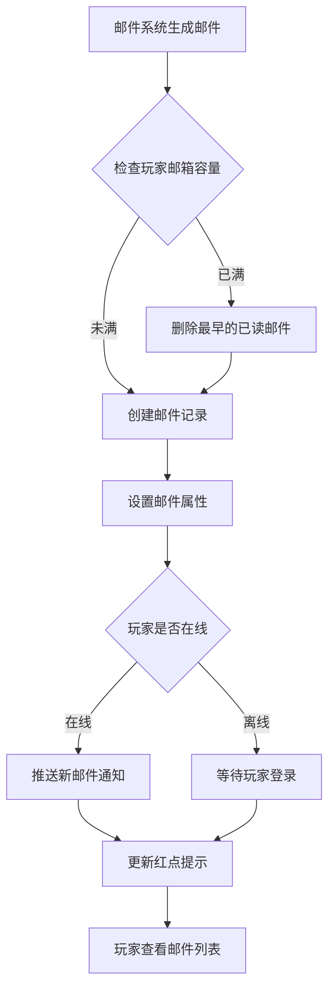
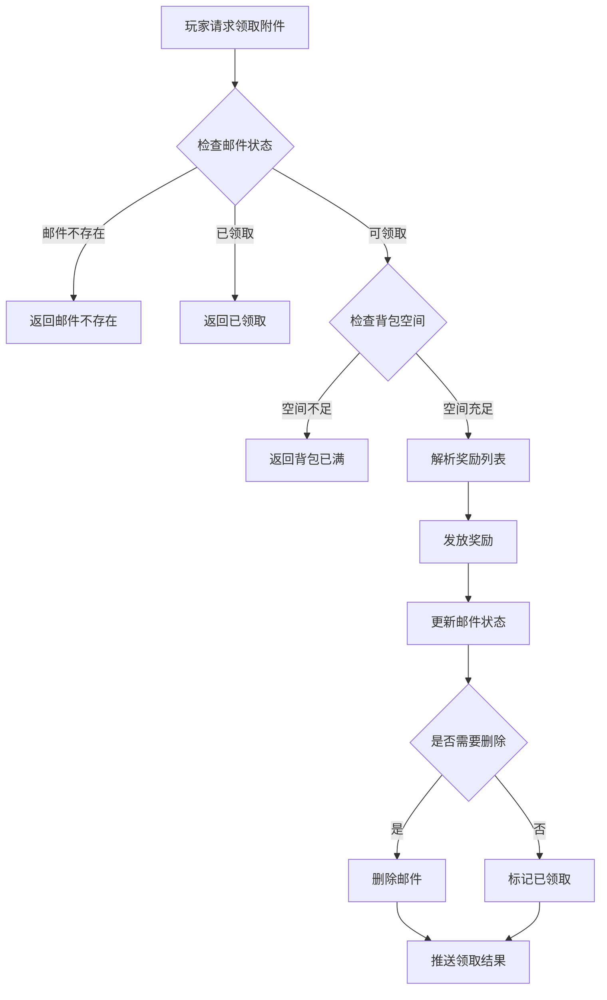
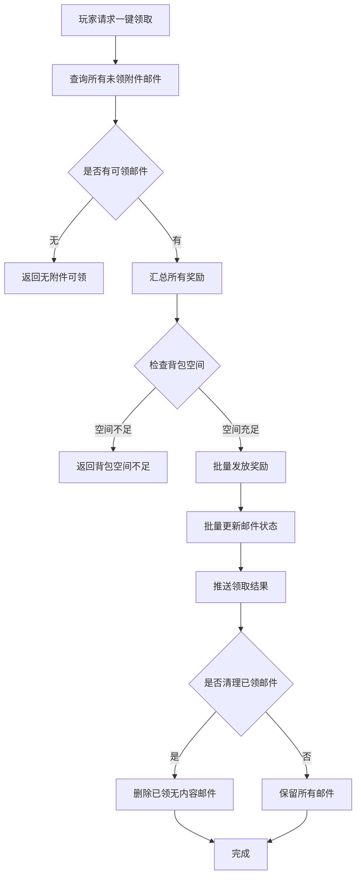
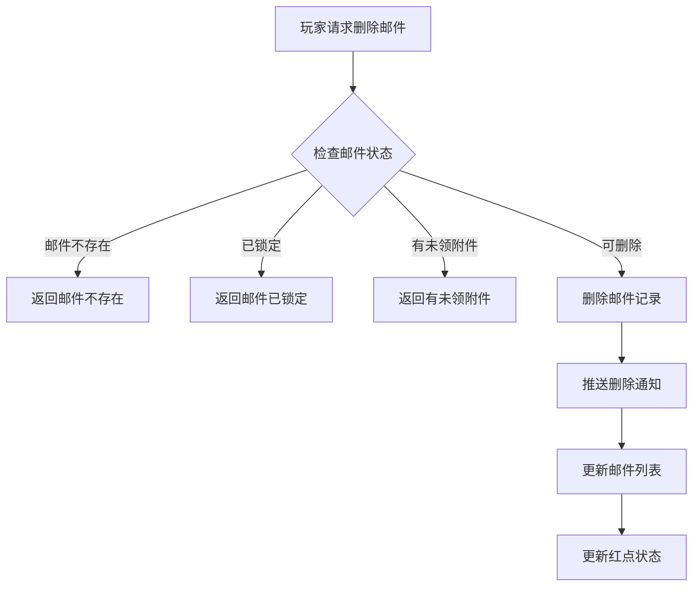

# 邮件模块完整说明

## 一、模块概述

### 1.1 业务背景

邮件模块是 K2C 游戏的核心通信系统，负责游戏内所有消息通知和奖励发放。该模块为玩家提供系统消息、奖励发放、活动通知等多种邮件类型，支持附件领取、邮件锁定、批量操作等功能，是游戏运营和玩家交互的重要渠道。

### 1.2 目标用户

- **所有玩家**：接收系统消息和奖励
- **运营人员**：通过邮件发放奖励和通知
- **客服人员**：通过邮件处理玩家补偿

### 1.3 核心价值

1. **消息通知**：及时传达游戏信息给玩家
2. **奖励发放**：便捷的奖励分发渠道
3. **运营支撑**：支持全服邮件、定向邮件等运营需求
4. **历史记录**：保存重要消息供玩家查阅

---

## 二、功能清单

### 2.1 邮件列表功能

| 功能名称 | 功能描述 | 用户价值 |
|---------|---------|---------|
| 查看邮件列表 | 显示所有邮件的简要信息 | 快速浏览邮件 |
| 区分已读未读 | 显示邮件阅读状态 | 了解哪些未读 |
| 显示附件状态 | 标识邮件是否有附件 | 优先处理有奖励邮件 |
| 邮件排序 | 按时间排序邮件列表 | 最新邮件优先显示 |

### 2.2 邮件详情功能

| 功能名称 | 功能描述 | 用户价值 |
|---------|---------|---------|
| 查看邮件详情 | 显示邮件完整内容 | 了解邮件详情 |
| 查看发送者 | 显示邮件发送来源 | 了解消息来源 |
| 查看发送时间 | 显示邮件发送时间 | 了解消息时效 |
| 查看过期时间 | 显示邮件过期时间 | 了解保存期限 |

### 2.3 附件管理功能

| 功能名称 | 功能描述 | 用户价值 |
|---------|---------|---------|
| 领取单个附件 | 领取指定邮件的附件 | 获取奖励 |
| 一键领取全部 | 批量领取所有未领附件 | 提升领取效率 |
| 显示附件列表 | 显示邮件包含的奖励 | 了解奖励内容 |
| 附件状态标识 | 标识是否已领取 | 避免重复操作 |

### 2.4 邮件管理功能

| 功能名称 | 功能描述 | 用户价值 |
|---------|---------|---------|
| 标记已读 | 将未读邮件标记为已读 | 管理阅读状态 |
| 锁定邮件 | 防止重要邮件被误删 | 保护重要邮件 |
| 删除邮件 | 删除不需要的邮件 | 清理邮箱空间 |
| 一键删除已读 | 批量删除已读邮件 | 快速清理 |

### 2.5 邮件统计功能

| 功能名称 | 功能描述 | 用户价值 |
|---------|---------|---------|
| 未读数量统计 | 显示未读邮件数量 | 了解新邮件 |
| 有附件统计 | 显示有附件邮件数量 | 了解待领奖励 |
| 红点提示 | 邮件入口红点提示 | 提醒玩家查看 |

---

## 三、业务流程详解

### 3.1 接收新邮件流程



**详细步骤说明**：

1. **邮件生成**
   - 系统触发邮件生成条件
   - 从模板或动态内容创建邮件
   - 设置邮件类型和属性

2. **容量检查**
   - 检查玩家邮箱是否已满
   - 满时自动删除最早的已读无附件邮件
   - 确保新邮件可以存入

3. **通知推送**
   - 在线玩家实时推送通知
   - 离线玩家登录时推送
   - 更新邮件红点状态

### 3.2 领取附件流程



**详细步骤说明**：

1. **状态检查**
   - 检查邮件是否存在
   - 检查附件是否已领取
   - 检查邮件是否过期

2. **空间检查**
   - 检查背包是否有足够空间
   - 检查货币是否超过上限
   - 给出相应的提示

3. **奖励发放**
   - 解析邮件附件列表
   - 依次发放各类奖励
   - 记录发放日志

4. **状态更新**
   - 标记附件已领取
   - 无附件邮件可能自动删除
   - 推送领取结果通知

### 3.3 一键领取流程



### 3.4 删除邮件流程



---

## 四、关键规则

### 4.1 邮件类型规则

| 类型ID | 类型名称 | 过期时间 | 说明 |
|--------|----------|----------|------|
| 1 | 系统邮件 | 7天 | 系统通知消息 |
| 2 | 奖励邮件 | 30天 | 包含奖励附件 |
| 3 | 好友邮件 | 7天 | 好友互动消息 |
| 4 | 公会邮件 | 7天 | 公会通知消息 |
| 5 | 活动邮件 | 14天 | 活动相关消息 |
| 6 | 充值邮件 | 30天 | 充值相关通知 |
| 7 | 补偿邮件 | 30天 | 客服补偿奖励 |

### 4.2 邮箱容量规则

1. **容量限制**
   - 默认邮箱容量：100封
   - 可通过VIP扩展容量
   - 最大容量：500封

2. **自动清理**
   - 邮箱满时自动删除最早已读邮件
   - 锁定邮件不会被自动删除
   - 有附件邮件不会被自动删除

### 4.3 邮件状态规则

| 状态值 | 状态名称 | 说明 |
|--------|----------|------|
| 0 | 未读 | 邮件未阅读 |
| 1 | 已读 | 邮件已阅读 |
| 2 | 附件已领取 | 附件已领取完毕 |

### 4.4 锁定规则

1. **锁定限制**
   - 最多锁定10封邮件
   - 锁定邮件不能被删除
   - 锁定邮件不能被一键删除

2. **解锁操作**
   - 可随时取消锁定
   - 解锁后可正常删除

### 4.5 过期规则

1. **过期清理**
   - 过期邮件定时清理（每日凌晨2点）
   - 清理前推送提醒通知
   - 过期邮件无法恢复

2. **延期机制**
   - 登录时延长未读邮件有效期
   - 特殊邮件支持手动延期

---

## 五、用户故事

### 5.1 普通玩家故事

> 作为一名普通玩家，我每天登录游戏都会先查看邮件。系统会给我发送每日签到奖励、活动通知等邮件。我看到有红点提示就点击进入，一键领取所有奖励，非常方便。

### 5.2 活跃玩家故事

> 作为一名活跃玩家，我的邮箱经常有很多邮件。我会优先查看有附件的邮件，快速领取奖励。对于重要的系统公告，我会锁定保存，方便以后查阅。每周我会清理一次已读的无用邮件。

### 5.3 付费玩家故事

> 作为一名付费玩家，充值后我会收到充值确认邮件和返利奖励。这些邮件有30天有效期，我可以慢慢领取。我还订阅了VIP专属邮件，获取独家活动信息。

---

## 六、示例

### 6.1 邮件列表示例

```
邮箱状态: 23/100
未读: 5封
有附件: 3封

邮件列表:
1. [奖励] 每日签到奖励 (有附件) 2026-04-07
2. [系统] 服务器维护通知 (已读) 2026-04-06
3. [活动] 限时活动开启 (未读, 有附件) 2026-04-06
4. [奖励] 竞技场排名奖励 (已领取) 2026-04-05
5. [公会] 公会副本结算 (已读) 2026-04-05
```

### 6.2 邮件详情示例

**邮件信息**：
```
邮件ID: 10001
邮件类型: 奖励邮件
标题: 竞技场周排名奖励
内容: 恭喜您在竞技场周排名中获得第5名！
      以下是您的排名奖励，请查收。
发送者: 竞技场系统
发送时间: 2026-04-07 00:00:00
过期时间: 2026-05-07 00:00:00
状态: 未读
锁定: 否

附件列表:
- 钻石 × 200
- 竞技场积分 × 500
- 随机英雄碎片箱 × 1
```

### 6.3 系统邮件示例

**全服邮件**：
```
邮件类型: 系统邮件
标题: 全服维护补偿
内容: 尊敬的玩家，由于服务器紧急维护，
      给您带来的不便深表歉意。
      特发放以下补偿，请查收。
发送者: 游戏运营团队
目标: 全服玩家
发送时间: 2026-04-07 10:00:00

附件:
- 钻石 × 100
- 体力药水(大) × 2
```

### 6.4 领取结果示例

**领取输入**：
```
邮件ID: 10001
操作: 领取附件
```

**领取结果**：
```
领取成功
获得奖励:
- 钻石 × 200
- 竞技场积分 × 500
- 随机英雄碎片箱 × 1

邮件状态: 已领取
剩余未领附件邮件: 2封
```

---

*文档生成时间: 2026-04-07*
