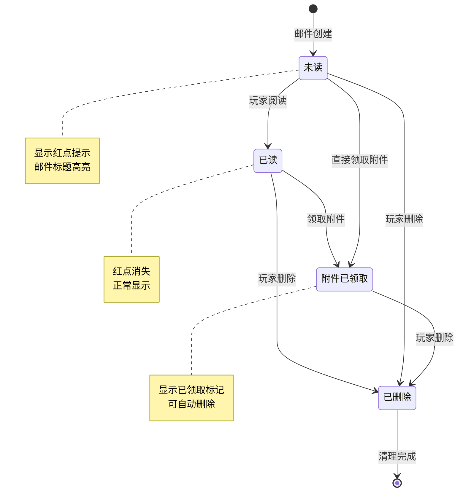
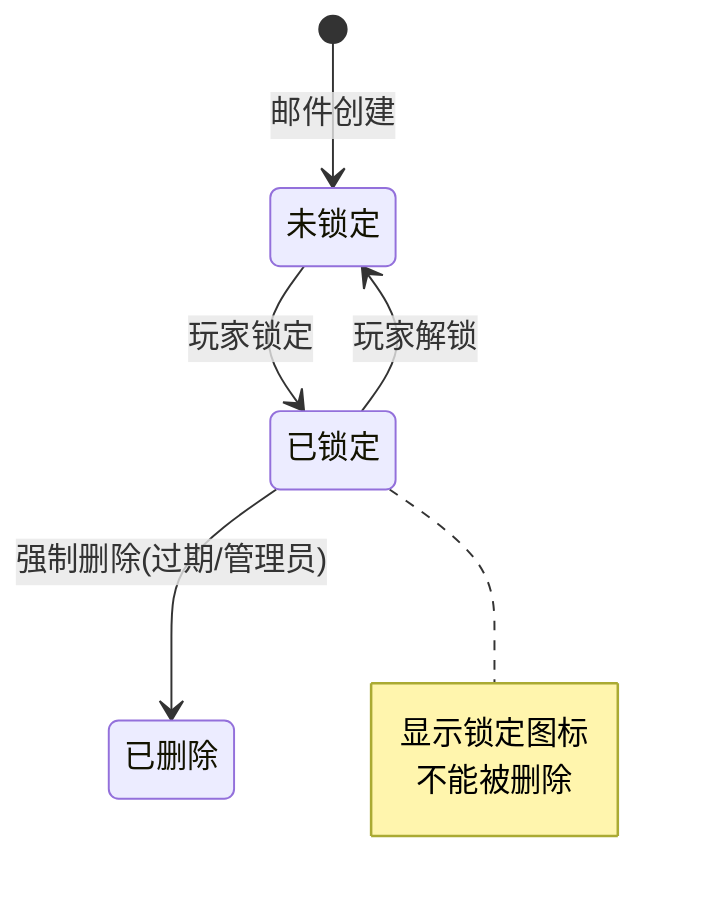
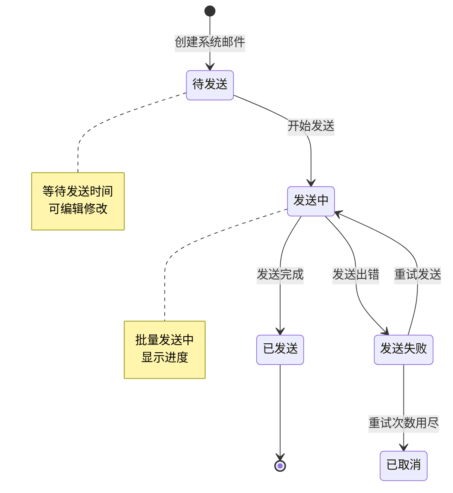
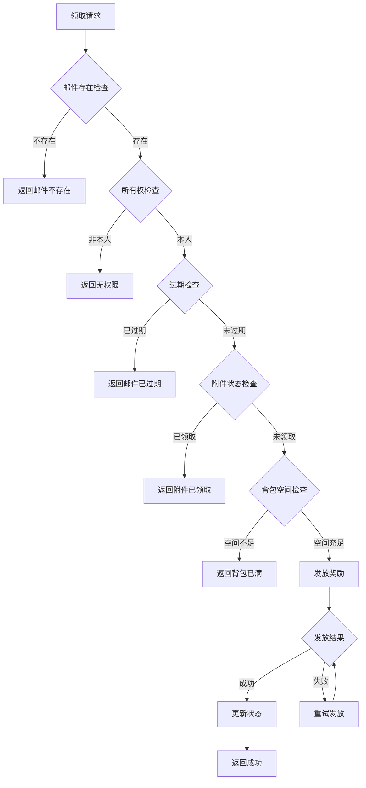

# 邮件模块实现细节

## 一、计算公式

### 1.1 邮件ID生成

```
邮件ID = 雪花算法生成唯一ID
ID结构 = 时间戳(41位) + 机器ID(10位) + 序列号(12位)
```

**特点**：
- 全局唯一
- 时间有序
- 支持分布式

### 1.2 过期时间计算

```
过期时间 = 发送时间 + 类型有效期
实际过期时间 = max(过期时间, 最后登录时间 + 登录延期天数)
```

**示例计算**：
```
发送时间: 2026-04-07 10:00:00
类型有效期: 7天
最后登录时间: 2026-04-10
登录延期: 3天

基础过期: 2026-04-14 10:00:00
延期过期: 2026-04-13
实际过期: 2026-04-14 10:00:00 (取较晚时间)
```

### 1.3 邮箱容量计算

```
邮箱容量 = 基础容量 + VIP加成
基础容量 = 100
VIP加成 = VIP等级 × 10
最大容量 = 500
```

**示例计算**：
```
VIP等级: 8
基础容量: 100
VIP加成: 8 × 10 = 80

邮箱容量 = min(100 + 80, 500) = 180
```

### 1.4 红点数量计算

```
红点数量 = 未读邮件数 + 有附件未领邮件数
```

---

## 二、状态机定义

### 2.1 邮件状态机



### 2.2 邮件锁定状态机



### 2.3 邮件发送状态机（系统邮件）



---

## 三、数据约束

### 3.1 玩家邮件数据约束

| 字段名 | 数据类型 | 取值范围 | 必填 | 说明 |
|--------|----------|----------|------|------|
| mailId | long | > 0 | 是 | 邮件唯一ID |
| playerId | long | > 0 | 是 | 玩家ID |
| mailType | int | 1-7 | 是 | 邮件类型 |
| title | varchar(255) | 1-100字符 | 是 | 邮件标题 |
| content | text | 0-5000字符 | 是 | 邮件内容 |
| sender | varchar(64) | 1-32字符 | 是 | 发送者名称 |
| rewardList | json | - | 否 | 附件奖励列表 |
| state | int | 0-2 | 是 | 邮件状态 |
| isLocked | boolean | true/false | 是 | 是否锁定 |
| sendTime | datetime | - | 是 | 发送时间 |
| expireTime | datetime | - | 是 | 过期时间 |
| createTime | datetime | - | 是 | 创建时间 |

### 3.2 系统邮件数据约束

| 字段名 | 数据类型 | 取值范围 | 必填 | 说明 |
|--------|----------|----------|------|------|
| sysMailId | long | > 0 | 是 | 系统邮件ID |
| mailType | int | 1-7 | 是 | 邮件类型 |
| title | varchar(255) | 1-100字符 | 是 | 邮件标题 |
| content | text | 0-5000字符 | 是 | 邮件内容 |
| sender | varchar(64) | 1-32字符 | 是 | 发送者名称 |
| rewardList | json | - | 否 | 附件奖励列表 |
| sendTime | datetime | - | 是 | 发送时间 |
| expireTime | datetime | - | 是 | 过期时间 |
| targetCondition | json | - | 否 | 目标玩家条件 |
| status | int | 0-3 | 是 | 状态 |
| sentCount | int | >= 0 | 是 | 已发送数量 |

### 3.3 邮件模板数据约束

| 字段名 | 数据类型 | 取值范围 | 必填 | 说明 |
|--------|----------|----------|------|------|
| templateId | int | > 0 | 是 | 模板ID |
| templateName | varchar(64) | 1-32字符 | 是 | 模板名称 |
| title | varchar(255) | 1-100字符 | 是 | 默认标题 |
| content | text | 0-5000字符 | 是 | 默认内容 |
| sender | varchar(64) | 1-32字符 | 是 | 默认发送者 |
| rewardList | json | - | 否 | 默认奖励列表 |
| params | json | - | 否 | 参数定义 |

### 3.4 状态枚举定义

**邮件状态枚举**：
| 状态值 | 状态名 | 说明 |
|--------|--------|------|
| 0 | UNREAD | 未读 |
| 1 | READ | 已读 |
| 2 | REWARD_TAKEN | 附件已领取 |

**系统邮件状态枚举**：
| 状态值 | 状态名 | 说明 |
|--------|--------|------|
| 0 | DRAFT | 草稿 |
| 1 | PENDING | 待发送 |
| 2 | SENDING | 发送中 |
| 3 | SENT | 已发送 |

---

## 四、错误处理策略

### 4.1 邮件模块错误码

| 错误码 | 错误信息 | 处理策略 | 用户提示 |
|--------|----------|----------|----------|
| 90001 | 邮件不存在 | 检查邮件ID | "邮件不存在" |
| 90002 | 邮件已过期 | 检查过期时间 | "邮件已过期" |
| 90003 | 附件已领取 | 检查邮件状态 | "附件已领取" |
| 90004 | 邮件已锁定 | 检查锁定状态 | "邮件已锁定，请先解锁" |
| 90005 | 邮件有未领附件 | 检查附件状态 | "请先领取附件" |
| 90006 | 邮箱已满 | 检查邮箱容量 | "邮箱已满，请清理" |
| 90007 | 背包空间不足 | 检查背包容量 | "背包空间不足" |
| 90008 | 锁定数量已达上限 | 检查锁定数量 | "锁定邮件数量已达上限" |

### 4.2 邮件领取错误处理流程



### 4.3 异常场景处理

| 异常场景 | 处理策略 | 数据回滚 |
|----------|----------|----------|
| 奖励发放失败 | 重试3次，失败转邮件补偿 | 是 |
| 邮件创建失败 | 记录日志，通知运维 | 否 |
| 批量发送中断 | 从断点继续发送 | 否 |
| 并发领取冲突 | 加锁处理，返回已领取 | 是 |

---

## 五、关键代码示例

### 5.1 发送邮件伪代码

```java
public void sendMail(long playerId, MailData mailData) {
    // 1. 检查邮箱容量
    int currentCount = mailDao.countByPlayerId(playerId);
    int maxCapacity = getMailCapacity(playerId);

    if (currentCount >= maxCapacity) {
        // 自动清理最早的已读无附件邮件
        cleanOldestReadMail(playerId);
    }

    // 2. 创建邮件
    PlayerMail mail = new PlayerMail();
    mail.setMailId(idGenerator.nextId());
    mail.setPlayerId(playerId);
    mail.setMailType(mailData.getMailType());
    mail.setTitle(mailData.getTitle());
    mail.setContent(mailData.getContent());
    mail.setSender(mailData.getSender());
    mail.setRewardList(JsonUtils.toJson(mailData.getRewardList()));
    mail.setState(MailState.UNREAD.getValue());
    mail.setIsLocked(false);
    mail.setSendTime(new Date());
    mail.setExpireTime(calculateExpireTime(mailData.getMailType()));
    mail.setCreateTime(new Date());

    // 3. 保存邮件
    mailDao.insert(mail);

    // 4. 推送通知
    if (playerManager.isOnline(playerId)) {
        pushMailAdded(playerId, mail);
    }

    // 5. 更新红点
    updateMailRedDot(playerId);
}
```

### 5.2 领取附件伪代码

```java
public Result takeMailItems(long playerId, long mailId) {
    // 1. 查询邮件
    PlayerMail mail = mailDao.selectById(mailId);
    if (mail == null) {
        return Result.error(90001, "邮件不存在");
    }

    // 2. 检查所有权
    if (!mail.getPlayerId().equals(playerId)) {
        return Result.error(90001, "邮件不存在");
    }

    // 3. 检查过期
    if (mail.getExpireTime().before(new Date())) {
        return Result.error(90002, "邮件已过期");
    }

    // 4. 检查附件状态
    if (mail.getState() == MailState.REWARD_TAKEN.getValue()) {
        return Result.error(90003, "附件已领取");
    }

    // 5. 解析奖励列表
    List<RewardInfo> rewardList = JsonUtils.parseList(mail.getRewardList(), RewardInfo.class);
    if (rewardList == null || rewardList.isEmpty()) {
        // 无附件邮件直接标记已读
        mail.setState(MailState.READ.getValue());
        mailDao.updateById(mail);
        return Result.success();
    }

    // 6. 检查背包空间
    if (!bagService.hasEnoughSpace(playerId, rewardList)) {
        return Result.error(90007, "背包空间不足");
    }

    // 7. 发放奖励
    rewardService.giveRewards(playerId, rewardList);

    // 8. 更新邮件状态
    mail.setState(MailState.REWARD_TAKEN.getValue());
    mailDao.updateById(mail);

    // 9. 推送通知
    pushMailRewardTaken(playerId, mailId);

    // 10. 更新红点
    updateMailRedDot(playerId);

    return Result.success(rewardList);
}
```

### 5.3 一键领取伪代码

```java
public Result takeAllMailItems(long playerId) {
    // 1. 查询所有有附件未领取的邮件
    List<PlayerMail> mailList = mailDao.selectWithUnclaimedReward(playerId);

    if (mailList.isEmpty()) {
        return Result.error(90003, "没有可领取的附件");
    }

    // 2. 汇总所有奖励
    List<RewardInfo> allRewards = new ArrayList<>();
    for (PlayerMail mail : mailList) {
        List<RewardInfo> rewards = JsonUtils.parseList(mail.getRewardList(), RewardInfo.class);
        if (rewards != null) {
            allRewards.addAll(rewards);
        }
    }

    // 3. 检查背包空间
    if (!bagService.hasEnoughSpace(playerId, allRewards)) {
        return Result.error(90007, "背包空间不足");
    }

    // 4. 批量发放奖励
    rewardService.giveRewards(playerId, allRewards);

    // 5. 批量更新邮件状态
    List<Long> mailIds = new ArrayList<>();
    for (PlayerMail mail : mailList) {
        mail.setState(MailState.REWARD_TAKEN.getValue());
        mailIds.add(mail.getMailId());
    }
    mailDao.batchUpdateState(mailIds, MailState.REWARD_TAKEN.getValue());

    // 6. 推送通知
    pushAllMailRewardTaken(playerId, mailIds);

    // 7. 更新红点
    updateMailRedDot(playerId);

    return Result.success(allRewards);
}
```

### 5.4 删除邮件伪代码

```java
public Result deleteMail(long playerId, long mailId) {
    // 1. 查询邮件
    PlayerMail mail = mailDao.selectById(mailId);
    if (mail == null || !mail.getPlayerId().equals(playerId)) {
        return Result.error(90001, "邮件不存在");
    }

    // 2. 检查锁定状态
    if (mail.getIsLocked()) {
        return Result.error(90004, "邮件已锁定");
    }

    // 3. 检查附件状态
    if (mail.getState() != MailState.REWARD_TAKEN.getValue()) {
        List<RewardInfo> rewards = JsonUtils.parseList(mail.getRewardList(), RewardInfo.class);
        if (rewards != null && !rewards.isEmpty()) {
            return Result.error(90005, "请先领取附件");
        }
    }

    // 4. 删除邮件
    mailDao.deleteById(mailId);

    // 5. 推送通知
    pushMailRemoved(playerId, mailId);

    // 6. 更新红点
    updateMailRedDot(playerId);

    return Result.success();
}
```

### 5.5 批量发送系统邮件伪代码

```java
public void sendSystemMail(SystemMail systemMail) {
    // 1. 获取目标玩家列表
    List<Long> targetPlayers = getTargetPlayers(systemMail.getTargetCondition());

    // 2. 批量插入邮件
    int batchSize = 1000;
    List<PlayerMail> mailBatch = new ArrayList<>();

    for (Long playerId : targetPlayers) {
        PlayerMail mail = createMailFromSystem(systemMail, playerId);
        mailBatch.add(mail);

        if (mailBatch.size() >= batchSize) {
            mailDao.batchInsert(mailBatch);
            mailBatch.clear();

            // 推送给在线玩家
            for (PlayerMail m : mailBatch) {
                if (playerManager.isOnline(m.getPlayerId())) {
                    pushMailAdded(m.getPlayerId(), m);
                }
            }
        }
    }

    // 插入剩余邮件
    if (!mailBatch.isEmpty()) {
        mailDao.batchInsert(mailBatch);
    }

    // 3. 更新系统邮件状态
    systemMail.setStatus(SysMailStatus.SENT.getValue());
    systemMail.setSentCount(targetPlayers.size());
    systemMailDao.updateById(systemMail);
}
```

### 5.6 过期清理定时任务伪代码

```java
@Scheduled(cron = "0 0 2 * * ?") // 每天凌晨2点
public void cleanExpiredMails() {
    Date now = new Date();
    int totalDeleted = 0;

    // 分批处理，避免一次性处理过多
    int batchSize = 10000;
    while (true) {
        // 查询过期邮件
        List<Long> expiredMailIds = mailDao.selectExpiredIds(now, batchSize);

        if (expiredMailIds.isEmpty()) {
            break;
        }

        // 批量删除
        mailDao.batchDelete(expiredMailIds);
        totalDeleted += expiredMailIds.size();

        log.info("Cleaned {} expired mails, total: {}", expiredMailIds.size(), totalDeleted);
    }

    log.info("Mail cleanup completed, total deleted: {}", totalDeleted);
}
```

---

## 六、跨模块依赖

### 6.1 依赖模块

| 模块名称 | 依赖类型 | 依赖说明 |
|----------|----------|----------|
| PlayerOp | 数据依赖 | 获取玩家VIP等级（邮箱容量） |
| BagOp | 功能依赖 | 奖励发放到背包 |
| ItemOp | 数据依赖 | 获取物品信息 |

### 6.2 被依赖说明

邮件模块是通用的奖励发放渠道，其他模块通过以下方式使用：

```java
// 发送单人邮件
MailModule.sendMail(playerId, mailData);

// 发送全服邮件
MailModule.sendSystemMail(systemMail);

// 发送条件筛选邮件
MailModule.sendConditionalMail(condition, mailData);
```

### 6.3 事件触发

| 触发场景 | 邮件类型 | 说明 |
|----------|----------|------|
| 每日签到 | 奖励邮件 | 签到奖励发放 |
| 竞技场结算 | 奖励邮件 | 排名奖励发放 |
| 公会副本结算 | 奖励邮件 | 伤害排名奖励 |
| 充值成功 | 充值邮件 | 充值确认和返利 |
| 活动结束 | 活动邮件 | 活动排名奖励 |
| 服务器维护 | 系统邮件 | 维护补偿 |

---

*文档生成时间: 2026-04-07*
