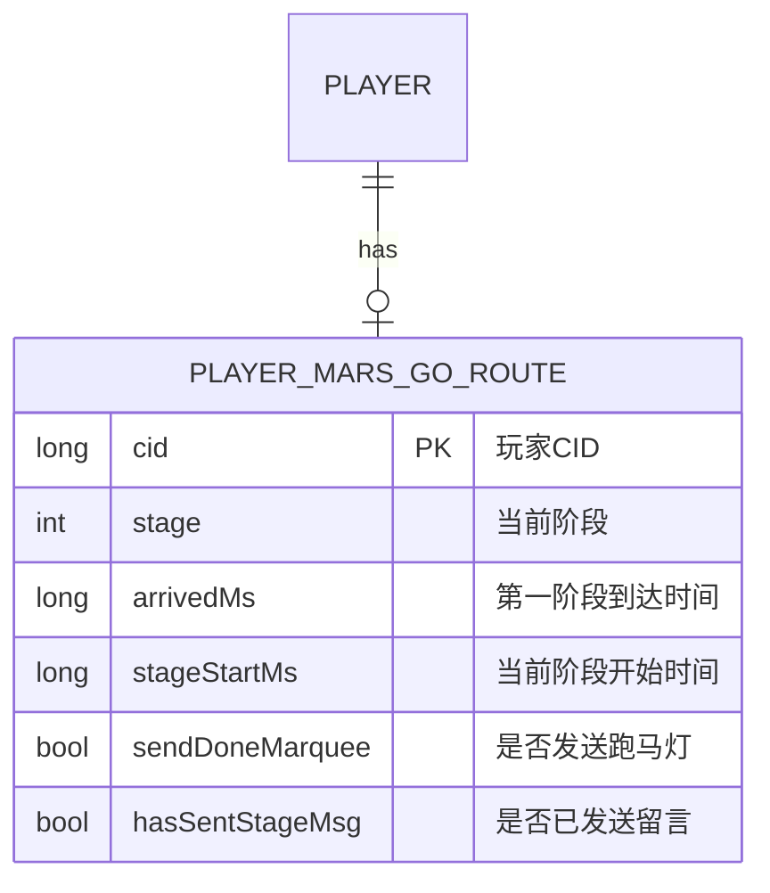
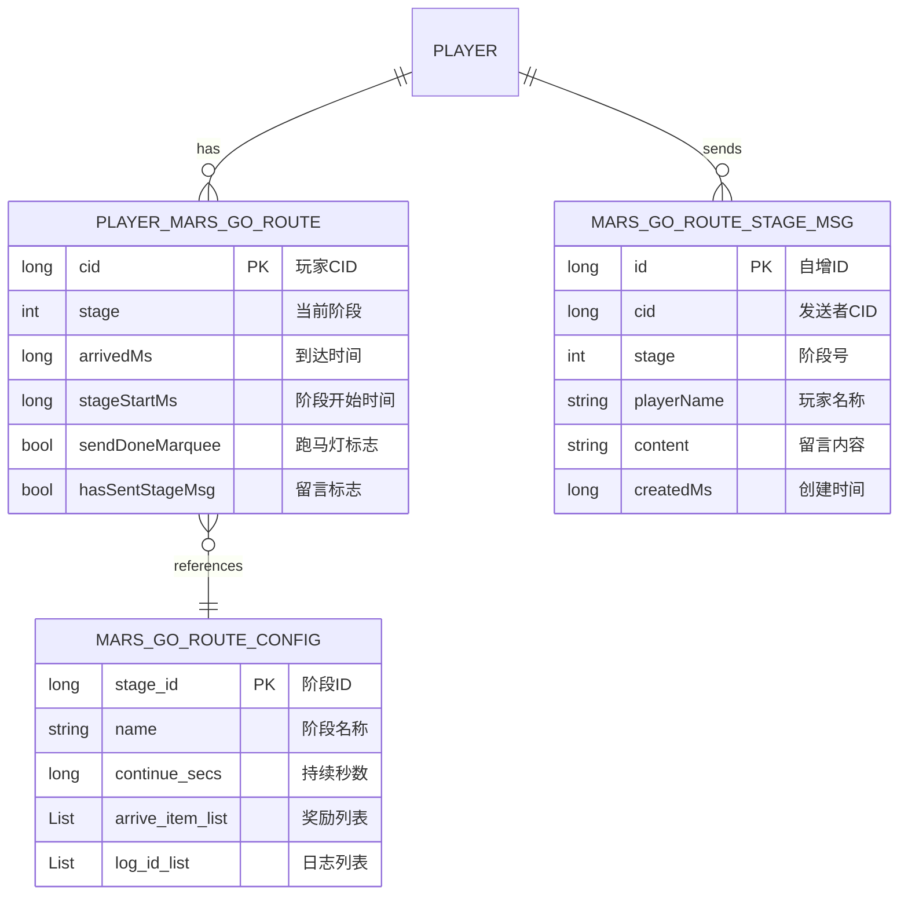

# 火星系统 - 数据配表

## 概述

火星系统 (MarsOp, p038) 是游戏中的特色探索玩法，玩家驾驶飞船前往火星进行殖民建设。本文档描述相关的数据配表结构。

---

## 一、数据库表设计

### 1. 玩家前往火星数据表 (player_mars_go_route)

**表注释**：火星-玩家前往火星数据

| 字段名 | 类型 | 默认值 | 说明 |
|--------|------|--------|------|
| cid | long | - | 玩家CID (主键) |
| stage | int | 0 | 当前阶段 |
| arrivedMs | long | 0 | 第一阶段到达时间（毫秒） |
| stageStartMs | long | 0 | 当前阶段开始时间（毫秒） |
| sendDoneMarquee | bool | false | 发送登录成功后的跑马灯 |
| hasSentStageMsg | bool | false | 当前阶段是否已发送过留言（阶段变更时清空） |

**数据约束**：
- `cid`: 唯一主键，关联玩家ID
- `stage`: 阶段值 >= 0，0表示未开始
- `arrivedMs`: 时间戳（毫秒），未开始时为0
- `stageStartMs`: 时间戳（毫秒），阶段变更时更新

**数据库关系图**：



### 2. 火星阶段留言表 (mars_go_route_stage_msg)

**表注释**：火星前往路线-阶段留言

| 字段名 | 类型 | 默认值 | 说明 |
|--------|------|--------|------|
| id | long | - | 自增主键 |
| cid | long | - | 发送留言的玩家CID |
| stage | int | - | 所在阶段号 |
| playerName | string | - | 玩家名称 |
| content | string | - | 留言内容 |
| createdMs | long | - | 留言创建时间（毫秒） |

**数据约束**：
- `content`: 最大长度限制200字符，需过滤敏感词
- `stage`: 范围 1-N (N为最大阶段数)
- `createdMs`: 创建时间戳

**索引设计**：
- 主键索引: `id`
- 玩家索引: `cid`
- 阶段索引: `stage` (用于查询阶段留言列表)

---

## 二、配置表设计

### 1. 火星航程配置 (MarsGoRoute)

**用途**：定义火星航程的各个阶段信息

**配置文件路径**：`refdata/mars_refdata.unity3d`

| 字段名 | 类型 | 说明 |
|--------|------|------|
| id | long | 配置ID |
| stage_id | long | 阶段ID |
| continue_secs | long | 该阶段持续秒数 |
| arrive_item_list | List\<NPCommonCostItem\> | 到达奖励物品列表 |
| bg_index | NPGGoIndex | 背景视频资源 |
| banner_tex | NPGTextureIndex | 当前节点banner图 |
| msg_stage_name | string | 火星留言用的节点名称 |
| name | string | 当前节点名称 |
| desc | string | 当前节点描述 |
| desc_args | string | 当前节点描述参数 |
| arrive_desc | string | 抵达当前节点描述 |
| arrive_desc_args | string | 抵达当前节点描述参数 |
| arrive_confirm_btn_desc | string | 抵达当前节点确认按钮描述 |
| arrive_dialogue_id | long | 抵达当前节点对话id |
| log_id_list | List\<long\> | 航行日志id列表 |
| done_simple_unlock_id | long | 完成条件simpleUnlockId |

**配置示例**：
```json
{
  "id": 1,
  "stage_id": 1,
  "name": "地球轨道",
  "desc": "从地球出发，进入地球轨道",
  "continue_secs": 3600,
  "arrive_item_list": [
    {"itemId": 50001, "count": 100}
  ],
  "log_id_list": [1001, 1002],
  "arrive_dialogue_id": 2001,
  "msg_stage_name": "地球轨道"
}
```

### 2. 火星航程日志配置 (MarsGoRouteLog)

**用途**：定义航程中显示的日志内容

| 字段名 | 类型 | 说明 |
|--------|------|------|
| id | long | 日志ID |
| content | string | 日志内容 |
| trigger_offset_secs | int | 触发偏移秒数 |

### 3. 火星通用配置 (NPGeneral)

**相关配置字段**：

| 字段名 | 类型 | 说明 |
|--------|------|------|
| mars_stage_arrive_reduce_per | int | 全服抵达人数动态减少时长万分比 |
| mars_building_oxygen_coefficient | int | 健康指数计算-氧气系数 |
| mars_building_satiety_coefficient | int | 健康指数计算-饱腹系数 |
| mars_building_sleep_coefficient | int | 健康指数计算-睡眠系数 |
| mars_building_comfort_coefficient | int | 幸福指数计算-舒适系数 |
| mars_building_mood_coefficient | int | 幸福指数计算-心情系数 |
| mars_building_oxygen_yield_per_consume | int | 每人口消耗氧气值 |
| mars_building_satiety_yield_per_consume | int | 每人口消耗饱腹值 |
| mars_building_sleep_yield_per_consume | int | 每人口消耗睡眠值 |
| mars_building_comfort_yield_per_consume | int | 每人口消耗舒适值 |
| mars_building_mood_yield_per_consume | int | 每人口消耗心情值 |
| mars_building_oxygen_index_max | int | 氧气指数上限 |
| mars_building_satiety_index_max | int | 饱腹指数上限 |
| mars_building_sleep_index_max | int | 睡眠指数上限 |
| mars_building_comfort_index_max | int | 舒适度指数上限 |
| mars_building_mood_index_max | int | 心情指数上限 |

---

## 三、枚举定义

### 1. 火星属性类型 (EMarsPropertyType)

```csharp
public enum EMarsPropertyType
{
    // 健康相关
    HEALTH_ADD_PER = 1,         // 健康指数万分比加成

    // 生存指标
    OXYGEN_ADD_PER = 10,        // 氧气指数万分比加成
    SATIETY_ADD_PER = 11,       // 饱腹指数万分比加成
    SLEEP_ADD_PER = 12,         // 睡眠指数万分比加成

    // 心理指标
    HAPPY_ADD_PER = 20,         // 幸福指数万分比加成
    COMFORT_ADD_PER = 21,       // 舒适度指数万分比加成
    MOOD_ADD_PER = 22,          // 心情指数万分比加成
}
```

### 2. 背包道具使用时间类型 (EMarsBagItemUseTimeType)

```csharp
public enum EMarsBagItemUseTimeType
{
    MARS_BUILDING = 1,          // 火星建筑加速
    MARS_TEAM_REPAIR = 2,       // 火星队伍修复加速
    MARS_TECH = 3,              // 火星科技研究加速
}
```

---

## 四、配置表路径汇总

| 类型 | 路径 |
|------|------|
| 客户端配置 | `game_client/Assets/Scripts/ResScripts/NPSO/GSO/Mars/` |
| 服务端配置 | `game_server/Config/mars/` |
| 通用配置 | `game_client/Assets/Scripts/ResScripts/NPSO/GSO/General/NPGeneral.cs` |
| 资源文件 | `refdata/mars_refdata.unity3d` |

---

## 五、数据关系图



---

## 六、阶段时长计算公式

### 6.1 动态时长计算

```
实际阶段时长 = 基础时长 × (10000 - 全服抵达减少万分比) / 10000
```

**示例计算**：
```
基础时长: 3600秒 (1小时)
全服抵达减少: 2000 (万分之)

实际阶段时长 = 3600 × (10000 - 2000) / 10000 = 2880秒 (48分钟)
```

### 6.2 阶段结束时间计算

```
阶段结束时间 = 阶段开始时间 + 实际阶段时长
```

**代码实现** (MarsStageInfo.cs):
```csharp
public long endTimeMs
{
    get
    {
        long continueMs = _m_marsGoRouteRef != null ? _m_marsGoRouteRef.continue_secs * 1000 : 0;
        long reducePer = GRefdataCoreMgr.instance.getMarsStageArriveReducePer();
        if (reducePer > 0)
            continueMs = continueMs * (10000 - reducePer) / 10000;
        return arriveTimeMs + continueMs;
    }
}
```

---

## 七、配置加载代码示例

### 7.1 获取阶段配置

```csharp
// 根据阶段ID获取配置
MarsGoRouteRefObj GetMarsGoRouteRefByStageId(long stageId)
{
    foreach (var refObj in GRefdataCoreMgr.instance.marsGoRouteRefCore.refList)
    {
        if (refObj.stage_id == stageId)
            return refObj;
    }
    return null;
}
```

### 7.2 获取全服抵达减少比例

```csharp
// 获取全服抵达人数动态减少时长万分比
long reducePer = GRefdataCoreMgr.instance.getMarsStageArriveReducePer();
```

---

*文档生成时间: 2026-04-11*
