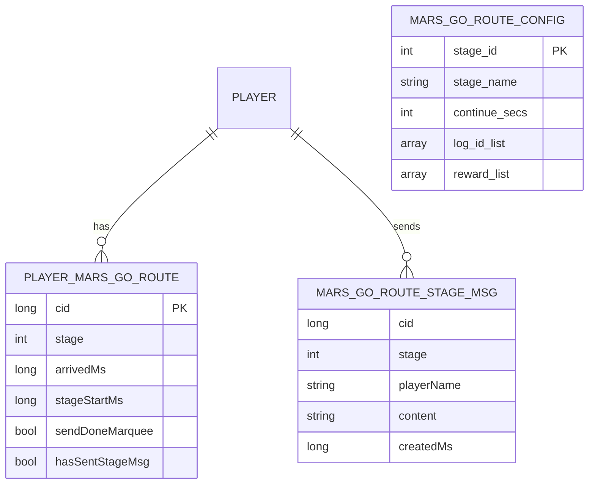

# 火星系统 - 数据配表

## 概述

火星系统 (MarsOp, p038) 是游戏中的特色探索玩法，玩家驾驶飞船前往火星进行殖民建设。本文档描述相关的数据配表结构。

---

## 一、数据库表设计

### 1. 玩家前往火星数据表 (player_mars_go_route)

**表注释**：火星-玩家前往火星数据

| 字段名 | 类型 | 说明 |
|--------|------|------|
| cid | long | 玩家CID (主键) |
| stage | int | 当前阶段 |
| arrivedMs | long | 第一阶段到达时间（毫秒） |
| stageStartMs | long | 当前阶段开始时间（毫秒） |
| sendDoneMarquee | bool | 发送登录成功后的跑马灯 |
| hasSentStageMsg | bool | 当前阶段是否已发送过留言（阶段变更时清空） |

**数据约束**：
- `cid`: 唯一主键，关联玩家ID
- `stage`: 阶段值 >= 0，0表示未开始
- `arrivedMs`: 时间戳（毫秒），未开始时为0

### 2. 火星阶段留言表 (mars_go_route_stage_msg)

**表注释**：火星前往路线-阶段留言

| 字段名 | 类型 | 说明 |
|--------|------|------|
| cid | long | 发送留言的玩家CID |
| stage | int | 所在阶段号 |
| playerName | string | 玩家名称 |
| content | string | 留言内容 |
| createdMs | long | 留言创建时间（毫秒） |

**数据约束**：
- `content`: 最大长度限制，需过滤敏感词
- `stage`: 范围 1-N (N为最大阶段数)

---

## 二、配置表设计

### 1. 火星航程配置 (MarsGoRoute)

**用途**：定义火星航程的各个阶段信息

| 字段名 | 类型 | 说明 |
|--------|------|------|
| stage_id | int | 阶段ID |
| stage_name | string | 阶段名称 |
| continue_secs | int | 该阶段持续秒数 |
| log_id_list | array | 日志ID列表 |
| reward_list | array | 阶段奖励列表 |

**配置示例**：
```json
{
  "stage_id": 1,
  "stage_name": "地球轨道",
  "continue_secs": 3600,
  "log_id_list": [1001, 1002],
  "reward_list": [{"itemId": 50001, "count": 100}]
}
```

### 2. 火星通用配置 (NPGeneral)

**相关配置字段**：

| 字段名 | 类型 | 说明 |
|--------|------|------|
| mars_stage_arrive_reduce_per | int | 全服抵达人数动态减少时长万分比 |
| mars_building_oxygen_coefficient | int | 健康指数计算-氧气系数 |
| mars_building_satiety_coefficient | int | 健康指数计算-饱腹系数 |
| mars_building_sleep_coefficient | int | 健康指数计算-睡眠系数 |
| mars_building_comfort_coefficient | int | 幸福指数计算-舒适系数 |
| mars_building_mood_coefficient | int | 幸福指数计算-心情系数 |
| mars_building_oxygen_yield_per_consume | int | 每人口消耗氧气值 |
| mars_building_satiety_yield_per_consume | int | 每人口消耗饱腹值 |
| mars_building_sleep_yield_per_consume | int | 每人口消耗睡眠值 |
| mars_building_comfort_yield_per_consume | int | 每人口消耗舒适值 |
| mars_building_mood_yield_per_consume | int | 每人口消耗心情值 |
| mars_building_oxygen_index_max | int | 氧气指数上限 |
| mars_building_satiety_index_max | int | 饱腹指数上限 |
| mars_building_sleep_index_max | int | 睡眠指数上限 |
| mars_building_comfort_index_max | int | 舒适度指数上限 |
| mars_building_mood_index_max | int | 心情指数上限 |

---

## 三、枚举定义

### 1. 火星属性类型 (EMarsPropertyType)

```csharp
public enum EMarsPropertyType
{
    // 健康相关
    HEALTH_ADD_PER = 1,         // 健康指数万分比加成

    // 生存指标
    OXYGEN_ADD_PER = 10,        // 氧气指数万分比加成
    SATIETY_ADD_PER = 11,       // 饱腹指数万分比加成
    SLEEP_ADD_PER = 12,         // 睡眠指数万分比加成

    // 心理指标
    HAPPY_ADD_PER = 20,         // 幸福指数万分比加成
    COMFORT_ADD_PER = 21,       // 舒适度指数万分比加成
    MOOD_ADD_PER = 22,          // 心情指数万分比加成
}
```

### 2. 背包道具使用时间类型 (EMarsBagItemUseTimeType)

```csharp
public enum EMarsBagItemUseTimeType
{
    MARS_BUILDING = 1,          // 火星建筑加速
    MARS_TEAM_REPAIR = 2,       // 火星队伍修复加速
    MARS_TECH = 3,              // 火星科技研究加速
}
```

---

## 四、配置表路径

| 类型 | 路径 |
|------|------|
| 客户端配置 | `game_client/Assets/Scripts/ResScripts/NPSO/GSO/Mars/` |
| 服务端配置 | `game_server/Config/mars/` |
| 通用配置 | `game_client/Assets/Scripts/ResScripts/NPSO/GSO/General/NPGeneral.cs` |

---

## 五、数据关系图



---

*文档生成时间: 2026-04-11*
