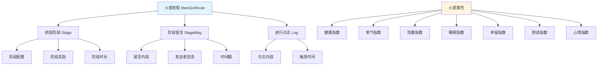
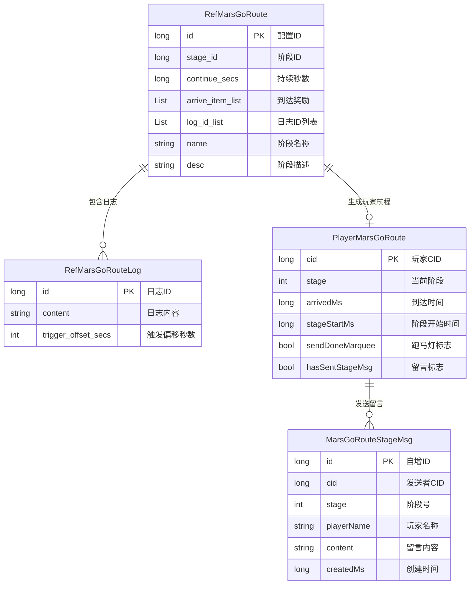
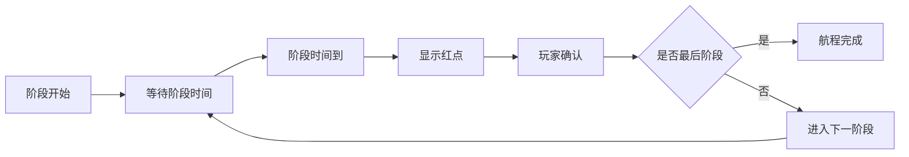
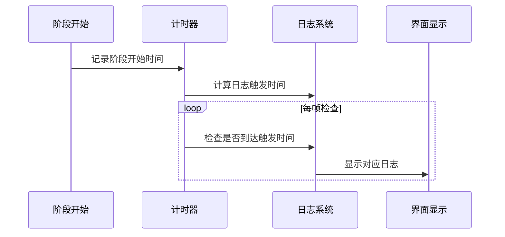
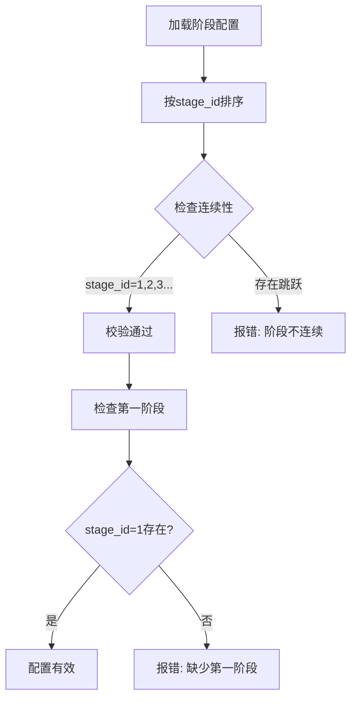
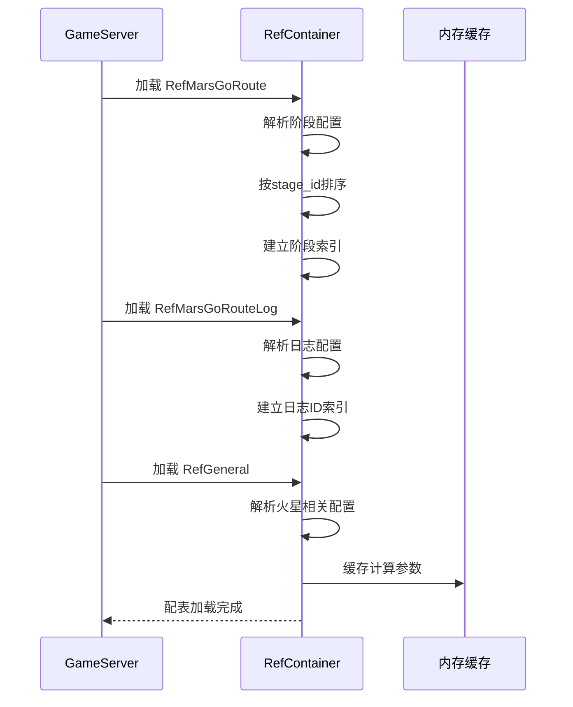
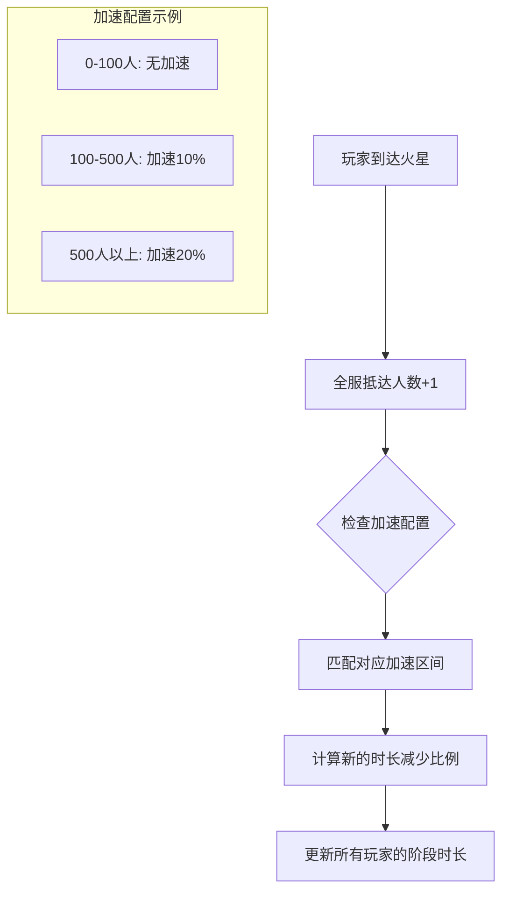

# 火星系统 - 数据配表

## 模块概述

**模块编号**: p038
**模块名称**: MarsOp (火星航程操作)
**主要功能**: 管理玩家前往火星的航程进度、阶段奖励、留言系统等

---

## 核心概念



---

## 配表文件列表

| 配表名称 | 文件路径 | 说明 |
|---------|---------|------|
| RefMarsGoRoute | game_server/GameRes/src/NPGameRes/Refs/Mars/RefMarsGoRoute.java | 航程阶段配置 |
| RefMarsGoRouteLog | game_server/GameRes/src/NPGameRes/Refs/Mars/RefMarsGoRouteLog.java | 航行日志配置 |
| RefGeneral | game_server/GameRes/src/NPGameRes/Refs/RefGeneral.java | 通用配置（火星相关字段） |

---

## 配表关系图



---

## 1. 航程阶段配置 (RefMarsGoRoute)

**配表名**: `mars_go_route`

### 完整字段列表

| 字段名 | 类型 | 必填 | 默认值 | 说明 |
|--------|------|------|--------|------|
| id | long | 是 | - | 配置ID（主键） |
| stage_id | long | 是 | - | 阶段ID，唯一标识阶段 |
| continue_secs | long | 是 | 0 | 该阶段持续秒数 |
| arrive_item_list | List\<NPCommonCostItem\> | 否 | [] | 到达奖励物品列表 |
| bg_index | NPGGoIndex | 否 | null | 背景视频资源索引 |
| banner_tex | NPGTextureIndex | 否 | null | 当前节点banner图 |
| msg_stage_name | string | 否 | "" | 火星留言用的节点名称 |
| name | string | 是 | "" | 当前节点名称 |
| desc | string | 否 | "" | 当前节点描述 |
| desc_args | string | 否 | "" | 当前节点描述参数 |
| arrive_desc | string | 否 | "" | 抵达当前节点描述 |
| arrive_desc_args | string | 否 | "" | 抵达当前节点描述参数 |
| arrive_confirm_btn_desc | string | 否 | "" | 抵达当前节点确认按钮描述 |
| arrive_dialogue_id | long | 否 | 0 | 抵达当前节点对话ID |
| log_id_list | List\<long\> | 否 | [] | 航行日志ID列表 |
| done_simple_unlock_id | long | 否 | 0 | 完成条件simpleUnlockId |

### 阶段配置示例

```json
{
    "id": 1,
    "stage_id": 1,
    "name": "地球轨道",
    "desc": "从地球出发，进入地球轨道",
    "desc_args": "",
    "continue_secs": 3600,
    "arrive_item_list": [
        {"item": {"itemType": 1, "itemId": 50001}, "count": 100}
    ],
    "arrive_desc": "抵达地球轨道，准备进入星际航行",
    "arrive_dialogue_id": 2001,
    "log_id_list": [1001, 1002, 1003],
    "msg_stage_name": "地球轨道",
    "done_simple_unlock_id": 0,
    "bg_index": {"type": 1, "index": 100},
    "banner_tex": {"type": 1, "index": 200}
}
```

### 代码示例

```java
// 服务端获取阶段配置
RefMarsGoRoute stageRef = RefGeneral.Ref().getMarsGoRouteStageMapMgr().getLevelData(stageId);
if (stageRef == null) {
    return CommErr.REF_NOT_FOUND;
}

// 获取阶段持续时长
long continueSecs = stageRef.continue_secs;

// 发放阶段奖励
getUserData().gainItemList(stageRef.arrive_item_list, context);

// 检查完成条件
if (!NPPlayerConditionDealerMgr.IsEnable(stageRef.done_simple_unlock_id, getUserData(), null)) {
    return CommErr.CONDITION_NOT_ENABLE;
}
```

```csharp
// 客户端获取阶段配置
MarsGoRouteRefObj GetMarsGoRouteRefByStageId(long stageId)
{
    foreach (var refObj in GRefdataCoreMgr.instance.marsGoRouteRefCore.refList)
    {
        if (refObj.stage_id == stageId)
            return refObj;
    }
    return null;
}

// 获取阶段名称
string stageName = stageRef.name;

// 获取阶段时长
long continueSecs = stageRef.continue_secs;

// 获取到达奖励
List<NPCommonCostItem> rewards = stageRef.arrive_item_list;
```

### 阶段流程图



---

## 2. 航行日志配置 (RefMarsGoRouteLog)

**配表名**: `mars_go_route_log`

### 完整字段列表

| 字段名 | 类型 | 必填 | 默认值 | 说明 |
|--------|------|------|--------|------|
| id | long | 是 | - | 日志ID（主键） |
| content | string | 是 | "" | 日志内容 |
| trigger_offset_secs | int | 是 | 0 | 触发偏移秒数（相对于阶段开始时间） |

### 日志配置示例

```json
{
    "id": 1001,
    "content": "飞船系统自检完成，一切正常。",
    "trigger_offset_secs": 60
}
```

### 日志触发机制



### 日志触发计算代码

```csharp
/// <summary>
/// 计算日志触发时间
/// </summary>
public long calculateTriggerTimeMs(MarsStageLogInfo logInfo, long stageStartMs)
{
    // 获取日志配置
    MarsGoRouteLogRefObj logRef = GRefdataCoreMgr.instance.getMarsGoRouteLogRef(logInfo.logId);
    if (logRef == null) return 0;

    // 触发时间 = 阶段开始时间 + 触发偏移秒数
    return stageStartMs + logRef.trigger_offset_secs * 1000;
}

/// <summary>
/// 检查日志是否应该触发
/// </summary>
public bool shouldTriggerLog(MarsStageLogInfo logInfo, long curServerTimeMs)
{
    long triggerTimeMs = calculateTriggerTimeMs(logInfo, curServerTimeMs);
    return curServerTimeMs >= triggerTimeMs;
}
```

---

## 3. 通用配置火星相关字段 (RefGeneral)

### 火星航程相关配置

| 字段名 | 类型 | 说明 | 默认值 |
|--------|------|------|--------|
| mars_go_route_arrive_reduce_list | List\<WCGTripleLong\> | 全服抵达人数时长减少配置 | [] |
| mars_go_to_finish_marquee_id | long | 火星抵达跑马灯ID | 0 |

### 火星建筑相关配置

| 字段名 | 类型 | 说明 | 默认值 |
|--------|------|------|--------|
| mars_building_oxygen_coefficient | int | 健康指数计算-氧气系数（万分比） | 3000 |
| mars_building_satiety_coefficient | int | 健康指数计算-饱腹系数（万分比） | 4000 |
| mars_building_sleep_coefficient | int | 健康指数计算-睡眠系数（万分比） | 3000 |
| mars_building_comfort_coefficient | int | 幸福指数计算-舒适系数（万分比） | 5000 |
| mars_building_mood_coefficient | int | 幸福指数计算-心情系数（万分比） | 5000 |
| mars_building_oxygen_yield_per_consume | int | 每人口消耗氧气值 | 10 |
| mars_building_satiety_yield_per_consume | int | 每人口消耗饱腹值 | 10 |
| mars_building_sleep_yield_per_consume | int | 每人口消耗睡眠值 | 10 |
| mars_building_comfort_yield_per_consume | int | 每人口消耗舒适值 | 10 |
| mars_building_mood_yield_per_consume | int | 每人口消耗心情值 | 10 |
| mars_building_oxygen_index_max | int | 氧气指数上限 | 10000 |
| mars_building_satiety_index_max | int | 饱腹指数上限 | 10000 |
| mars_building_sleep_index_max | int | 睡眠指数上限 | 10000 |
| mars_building_comfort_index_max | int | 舒适度指数上限 | 10000 |
| mars_building_mood_index_max | int | 心情指数上限 | 10000 |

### 全服抵达人数时长减少规则

```
配置格式: WCGTripleLong(first, second, three)
- first: 抵达人数下限 (-1表示无下限)
- second: 抵达人数上限 (-1表示无上限)
- three: 时长减少万分比

示例:
[(-1, 100, 0), (100, 500, 1000), (500, -1, 2000)]

解读:
- 抵达人数 0-100: 无减少
- 抵达人数 100-500: 减少10%
- 抵达人数 500+: 减少20%
```

### 配置读取代码

```java
// 服务端获取全服抵达人数时长减少比例
public int getMarsStageArriveReducePer(long arrivedCount) {
    List<WCGTripleLong> reduceList = RefGeneral.Ref().mars_go_route_arrive_reduce_list;
    for (WCGTripleLong triple : reduceList) {
        long minCount = triple.getFirst();   // 下限，-1表示无下限
        long maxCount = triple.getSecond();  // 上限，-1表示无上限
        int reducePer = triple.getThird();   // 减少万分比

        boolean minMatch = (minCount == -1 || arrivedCount >= minCount);
        boolean maxMatch = (maxCount == -1 || arrivedCount < maxCount);

        if (minMatch && maxMatch) {
            return reducePer;
        }
    }
    return 0;
}
```

```csharp
// 客户端获取全服抵达人数时长减少比例
public int getMarsStageArriveReducePer()
{
    long arrivedCount = getGlobalArrivedCount();
    var reduceList = GRefdataCoreMgr.instance.npGeneral.mars_go_route_arrive_reduce_list;

    foreach (var triple in reduceList)
    {
        long minCount = triple.first;
        long maxCount = triple.second;
        int reducePer = triple.three;

        bool minMatch = (minCount == -1 || arrivedCount >= minCount);
        bool maxMatch = (maxCount == -1 || arrivedCount < maxCount);

        if (minMatch && maxMatch)
            return reducePer;
    }
    return 0;
}
```

---

## 数据库表结构

### player_mars_go_route（玩家火星航程数据表）

```sql
CREATE TABLE IF NOT EXISTS `player_mars_go_route` (
    `cid` bigint(20) NOT NULL COMMENT '玩家CID (主键)',
    `stage` int(11) NOT NULL DEFAULT '0' COMMENT '当前阶段 (0表示未开始)',
    `arrivedMs` bigint(20) NOT NULL DEFAULT '0' COMMENT '第一阶段到达时间（毫秒）',
    `stageStartMs` bigint(20) NOT NULL DEFAULT '0' COMMENT '当前阶段开始时间（毫秒）',
    `sendDoneMarquee` tinyint(1) NOT NULL DEFAULT '0' COMMENT '是否发送跑马灯',
    `hasSentStageMsg` tinyint(1) NOT NULL DEFAULT '0' COMMENT '当前阶段是否已发送留言',
    `createTime` datetime DEFAULT CURRENT_TIMESTAMP COMMENT '创建时间',
    `updateTime` datetime DEFAULT CURRENT_TIMESTAMP ON UPDATE CURRENT_TIMESTAMP COMMENT '更新时间',
    PRIMARY KEY (`cid`),
    KEY `idx_stage` (`stage`),
    KEY `idx_arrivedMs` (`arrivedMs`)
) COMMENT='玩家火星航程数据' engine=InnoDB DEFAULT CHARSET=utf8mb4;
```

### mars_go_route_stage_msg（火星阶段留言表）

```sql
CREATE TABLE IF NOT EXISTS `mars_go_route_stage_msg` (
    `id` bigint(20) NOT NULL AUTO_INCREMENT COMMENT '自增主键',
    `cid` bigint(20) NOT NULL COMMENT '发送留言的玩家CID',
    `stage` int(11) NOT NULL COMMENT '所在阶段号',
    `playerName` varchar(64) NOT NULL COMMENT '玩家名称',
    `content` varchar(200) NOT NULL COMMENT '留言内容',
    `createdMs` bigint(20) NOT NULL COMMENT '留言创建时间（毫秒）',
    `createTime` datetime DEFAULT CURRENT_TIMESTAMP COMMENT '创建时间',
    PRIMARY KEY (`id`),
    KEY `idx_cid` (`cid`),
    KEY `idx_stage` (`stage`),
    KEY `idx_createdMs` (`createdMs`),
    KEY `idx_stage_createdMs` (`stage`, `createdMs`)
) COMMENT='火星航程阶段留言' engine=InnoDB DEFAULT CHARSET=utf8mb4;
```

### 数据库操作代码

```java
// DAO层实现示例
@Repository
public class MarsGoRouteDaoImpl implements MarsGoRouteDao {

    @Autowired
    private JdbcTemplate jdbcTemplate;

    @Override
    public PlayerMarsGoRoute getRouteByCid(long cid) {
        String sql = "SELECT * FROM player_mars_go_route WHERE cid = ?";
        List<PlayerMarsGoRoute> list = jdbcTemplate.query(sql,
            new Object[]{cid},
            new MarsGoRouteRowMapper());
        return list.isEmpty() ? null : list.get(0);
    }

    @Override
    public void saveOrUpdate(PlayerMarsGoRoute route) {
        String sql = "INSERT INTO player_mars_go_route " +
            "(cid, stage, arrivedMs, stageStartMs, sendDoneMarquee, hasSentStageMsg) " +
            "VALUES (?, ?, ?, ?, ?, ?) " +
            "ON DUPLICATE KEY UPDATE " +
            "stage = VALUES(stage), arrivedMs = VALUES(arrivedMs), " +
            "stageStartMs = VALUES(stageStartMs), sendDoneMarquee = VALUES(sendDoneMarquee), " +
            "hasSentStageMsg = VALUES(hasSentStageMsg)";

        jdbcTemplate.update(sql,
            route.getCid(),
            route.getStage(),
            route.getArrivedMs(),
            route.getStageStartMs(),
            route.isSendDoneMarquee() ? 1 : 0,
            route.isHasSentStageMsg() ? 1 : 0);
    }

    @Override
    public List<PlayerMarsGoRoute> getUnfinishedRoutes() {
        String sql = "SELECT * FROM player_mars_go_route WHERE stage > 0";
        return jdbcTemplate.query(sql, new MarsGoRouteRowMapper());
    }
}
```

---

## 枚举定义

### EMarsPropertyType (火星属性类型)

| 枚举值 | 数值 | 说明 | 计算影响 |
|--------|------|------|----------|
| HEALTH_ADD_PER | 1 | 健康指数万分比加成 | 影响健康指数 |
| OXYGEN_ADD_PER | 10 | 氧气指数万分比加成 | 影响氧气指数 |
| SATIETY_ADD_PER | 11 | 饱腹指数万分比加成 | 影响饱腹指数 |
| SLEEP_ADD_PER | 12 | 睡眠指数万分比加成 | 影响睡眠指数 |
| HAPPY_ADD_PER | 20 | 幸福指数万分比加成 | 影响幸福指数 |
| COMFORT_ADD_PER | 21 | 舒适度指数万分比加成 | 影响舒适度指数 |
| MOOD_ADD_PER | 22 | 心情指数万分比加成 | 影响心情指数 |

```csharp
public enum EMarsPropertyType
{
    // 健康相关
    HEALTH_ADD_PER = 1,         // 健康指数万分比加成

    // 生存指标
    OXYGEN_ADD_PER = 10,        // 氧气指数万分比加成
    SATIETY_ADD_PER = 11,       // 饱腹指数万分比加成
    SLEEP_ADD_PER = 12,         // 睡眠指数万分比加成

    // 心理指标
    HAPPY_ADD_PER = 20,         // 幸福指数万分比加成
    COMFORT_ADD_PER = 21,       // 舒适度指数万分比加成
    MOOD_ADD_PER = 22,          // 心情指数万分比加成
}
```

### EMarsBagItemUseTimeType (背包道具使用时间类型)

| 枚举值 | 数值 | 说明 | 使用场景 |
|--------|------|------|----------|
| MARS_BUILDING | 1 | 火星建筑加速 | 建筑升级加速 |
| MARS_TEAM_REPAIR | 2 | 火星队伍修复加速 | 队伍修复加速 |
| MARS_TECH | 3 | 火星科技研究加速 | 科技研究加速 |

```csharp
public enum EMarsBagItemUseTimeType
{
    MARS_BUILDING = 1,          // 火星建筑加速
    MARS_TEAM_REPAIR = 2,       // 火星队伍修复加速
    MARS_TECH = 3,              // 火星科技研究加速
}
```

---

## 配表校验规则

### 航程阶段配置校验

| 字段名 | 校验规则 | 异常处理 |
|--------|----------|----------|
| id | 必须唯一，范围 > 0 | 配表加载时去重 |
| stage_id | 必须唯一，范围 >= 1 | 加载时报错 |
| continue_secs | 范围 0-86400（最长24小时） | 强制限制范围 |
| arrive_item_list | 必须关联有效物品 | 加载时校验关联 |
| log_id_list | 必须关联有效日志配置 | 加载时校验关联 |

### 阶段连续性校验



### 校验代码

```java
// 配表校验代码
public void validateMarsGoRouteConfig(List<RefMarsGoRoute> routeList) {
    // 按stage_id排序
    routeList.sort((a, b) -> Long.compare(a.stage_id, b.stage_id));

    // 检查第一阶段是否存在
    if (routeList.isEmpty() || routeList.get(0).stage_id != 1) {
        throw new ConfigException("缺少第一阶段配置");
    }

    // 检查阶段连续性
    for (int i = 1; i < routeList.size(); i++) {
        if (routeList.get(i).stage_id != routeList.get(i-1).stage_id + 1) {
            throw new ConfigException("阶段不连续: " +
                routeList.get(i-1).stage_id + " -> " + routeList.get(i).stage_id);
        }
    }

    // 检查日志关联
    for (RefMarsGoRoute route : routeList) {
        for (Long logId : route.log_id_list) {
            if (!RefMarsGoRouteLog.Ref().hasRef(logId)) {
                throw new ConfigException("阶段 " + route.stage_id +
                    " 引用了不存在的日志ID: " + logId);
            }
        }
    }
}
```

---

## 数据字典

### 阶段状态映射

| stage值 | 状态说明 | 显示内容 |
|---------|----------|----------|
| 0 | 未开始 | 显示开始按钮 |
| 1-N | 进行中 | 显示进度条 |
| N+1 | 已完成 | 显示到达火星 |

### 时间字段说明

| 字段名 | 含义 | 更新时机 |
|--------|------|----------|
| arrivedMs | 开始前往火星的时间 | 第一次调用 startStage 时设置 |
| stageStartMs | 当前阶段开始时间 | 每次阶段变更时更新 |

---

## 配置加载流程



---

## 配置文件位置

```
game_server/GameRes/src/NPGameRes/Refs/Mars/
├── RefMarsGoRoute.java          # 航程阶段配置
└── RefMarsGoRouteLog.java       # 航行日志配置

game_server/GameRes/src/NPGameRes/Refs/
└── RefGeneral.java              # 通用配置（含火星相关字段）

game_server/DBTool/source_db/UserServer/
├── player_mars_go_route.py      # 航程数据表定义
└── mars_go_route_stage_msg.py   # 阶段留言表定义

game_client/Assets/Scripts/ResScripts/NPSO/GSO/Mars/
├── MarsGoRouteRefObj.cs         # 航程配置对象
└── MarsGoRouteRefCore.cs        # 航程配置容器
```

---

## 阶段时长计算公式

### 动态时长计算

```
实际阶段时长 = 基础时长 × (10000 - 全服抵达减少万分比) / 10000
```

**示例计算**：
```
基础时长: 3600秒 (1小时)
全服抵达减少: 2000 (万分之)

实际阶段时长 = 3600 × (10000 - 2000) / 10000 = 2880秒 (48分钟)
```

### 阶段结束时间计算

```
阶段结束时间 = 阶段开始时间 + 实际阶段时长
```

**代码实现** (MarsStageInfo.cs):
```csharp
public long endTimeMs
{
    get
    {
        long continueMs = _m_marsGoRouteRef != null ? _m_marsGoRouteRef.continue_secs * 1000 : 0;
        long reducePer = GRefdataCoreMgr.instance.getMarsStageArriveReducePer();
        if (reducePer > 0)
            continueMs = continueMs * (10000 - reducePer) / 10000;
        return arriveTimeMs + continueMs;
    }
}
```

---

## 全服抵达人数加速机制



### 全服抵达计数代码

```java
// 服务端统计全服抵达人数
public long getGlobalArrivedCount() {
    // 从缓存或数据库获取已抵达火星的玩家数量
    String cacheKey = "mars:arrived_count";
    Long count = redisTemplate.opsForValue().get(cacheKey);
    if (count != null) {
        return count;
    }

    // 从数据库统计
    String sql = "SELECT COUNT(*) FROM player_mars_go_route WHERE stage > ?";
    int maxStage = RefMarsGoRoute.Ref().getMaxStage();
    count = jdbcTemplate.queryForObject(sql, Long.class, maxStage);

    // 缓存结果
    redisTemplate.opsForValue().set(cacheKey, count, 5, TimeUnit.MINUTES);
    return count;
}

// 玩家抵达火星时更新计数
public void onPlayerArrivedMars() {
    redisTemplate.opsForValue().increment("mars:arrived_count");
}
```

---

## 客户端配置类

### MarsGoRouteRefObj.cs

```csharp
/// <summary>
/// 火星航程阶段配置对象
/// </summary>
public class MarsGoRouteRefObj : _IALRefDataObj
{
    public long id;                              // 配置ID
    public long stage_id;                        // 阶段ID
    public long continue_secs;                   // 持续秒数
    public List<NPCommonCostItem> arrive_item_list;  // 到达奖励
    public NPGGoIndex bg_index;                  // 背景视频索引
    public NPGTextureIndex banner_tex;           // Banner图
    public string msg_stage_name;                // 留言节点名称
    public string name;                          // 节点名称
    public string desc;                          // 节点描述
    public string desc_args;                     // 描述参数
    public string arrive_desc;                   // 抵达描述
    public string arrive_desc_args;              // 抵达描述参数
    public string arrive_confirm_btn_desc;       // 确认按钮描述
    public long arrive_dialogue_id;              // 对话ID
    public List<long> log_id_list;               // 日志ID列表
    public long done_simple_unlock_id;           // 完成条件

    /// <summary>
    /// 获取阶段时长（毫秒），考虑全服抵达加速
    /// </summary>
    public long getContinueMs()
    {
        long continueMs = continue_secs * 1000;
        int reducePer = GRefdataCoreMgr.instance.getMarsStageArriveReducePer();
        if (reducePer > 0)
            continueMs = continueMs * (10000 - reducePer) / 10000;
        return continueMs;
    }
}
```

### MarsGoRouteRefCore.cs

```csharp
/// <summary>
/// 火星航程配置容器
/// </summary>
public class MarsGoRouteRefCore : _ALRefDataCore
{
    public List<MarsGoRouteRefObj> refList;      // 所有阶段配置列表
    private Dictionary<long, MarsGoRouteRefObj> _stageMap;  // 阶段ID映射

    public override void init(List<_IALRefDataObj> _refList)
    {
        base.init(_refList);

        _stageMap = new Dictionary<long, MarsGoRouteRefObj>();
        foreach (var obj in _refList)
        {
            var refObj = obj as MarsGoRouteRefObj;
            _stageMap[refObj.stage_id] = refObj;
        }
    }

    /// <summary>
    /// 根据阶段ID获取配置
    /// </summary>
    public MarsGoRouteRefObj getByStageId(long stageId)
    {
        return _stageMap.TryGetValue(stageId, out var refObj) ? refObj : null;
    }

    /// <summary>
    /// 获取最大阶段号
    /// </summary>
    public int getMaxStage()
    {
        return refList.Count > 0 ? (int)refList[refList.Count - 1].stage_id : 0;
    }
}
```

---

*文档生成时间: 2026-04-12*
*文档版本: v2.0.0*
