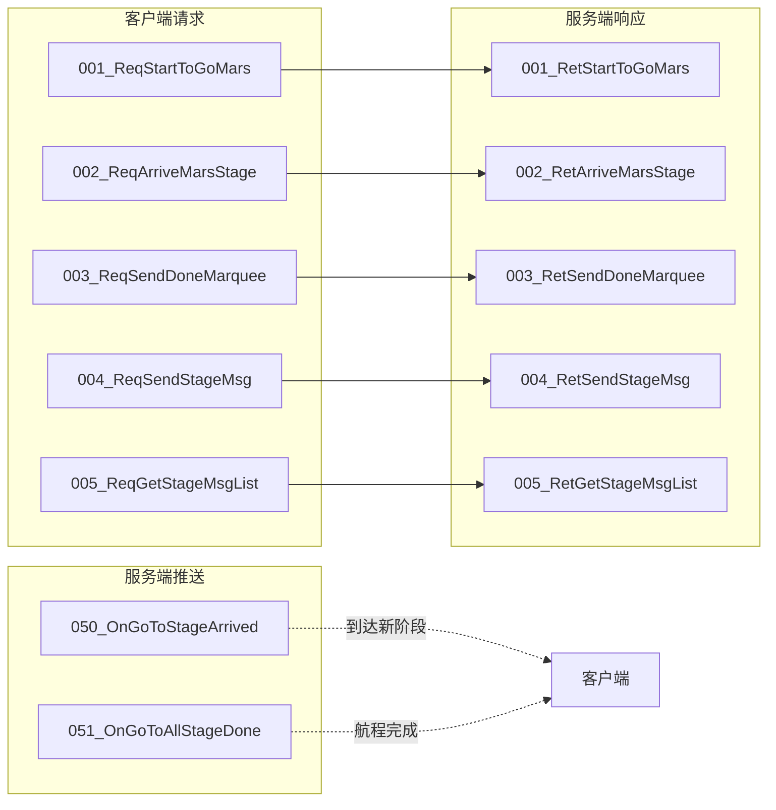
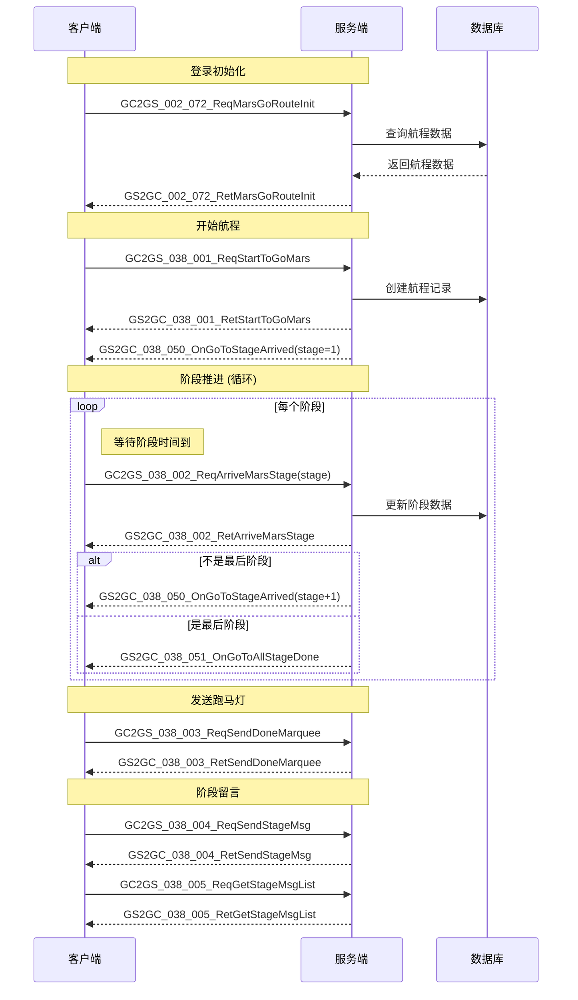
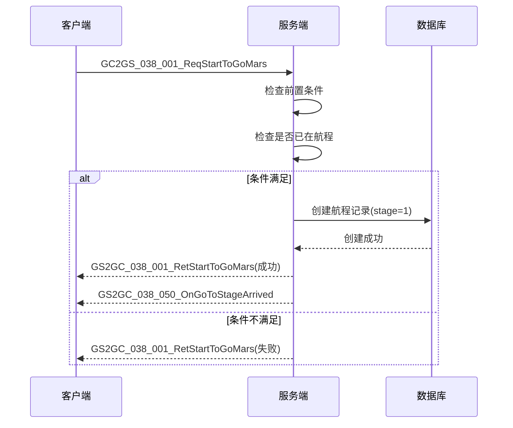

# 火星系统 - 协议文档

## 协议编号

**模块编号**: p038 (MarsOp)

**协议范围**: 038_001 ~ 038_051

---

## 一、协议总览



---

## 二、客户端请求协议 (GC2GS)

### 1. GC2GS_038_001_ReqStartToGoMars - 请求前往火星

**说明**: 玩家请求开始前往火星的航程

**协议号**: 主指令=38, 子指令=1

**请求参数**: 无

**协议定义**:
```csharp
public class GC2GS_038_001_ReqStartToGoMars : _IALProtocolStructure
{
    // 无参数
}
```

**响应**: `GS2GC_038_001_RetStartToGoMars`

**使用场景**:
- 玩家首次点击"前往火星"按钮
- 开始新的火星探索之旅

---

### 2. GC2GS_038_002_ReqArriveMarsStage - 请求到达火星指定阶段

**说明**: 玩家请求到达航程的指定阶段

**协议号**: 主指令=38, 子指令=2

**请求参数**:

| 参数名 | 类型 | 说明 | 约束 |
|--------|------|------|------|
| stage | int | 目标阶段号 | 必须为当前阶段+1 |

**协议定义**:
```csharp
public class GC2GS_038_002_ReqArriveMarsStage : _IALProtocolStructure
{
    private int stage;  // 目标阶段
}
```

**响应**: `GS2GC_038_002_RetArriveMarsStage`

**使用场景**:
- 当前阶段时间已到，点击"前往下一阶段"
- 领取当前阶段奖励

---

### 3. GC2GS_038_003_ReqSendDoneMarquee - 发送登录成功跑马灯

**说明**: 到达火星后发送登录成功跑马灯通知

**协议号**: 主指令=38, 子指令=3

**请求参数**: 无

**协议定义**:
```csharp
public class GC2GS_038_003_ReqSendDoneMarquee : _IALProtocolStructure
{
    // 无参数
}
```

**响应**: `GS2GC_038_003_RetSendDoneMarquee`

**使用场景**:
- 到达火星后，玩家主动触发全服跑马灯

---

### 4. GC2GS_038_004_ReqSendStageMsg - 发送阶段留言

**说明**: 在当前航程阶段发送留言

**协议号**: 主指令=38, 子指令=4

**请求参数**:

| 参数名 | 类型 | 说明 | 约束 |
|--------|------|------|------|
| stage | int | 当前阶段 | 有效阶段号 |
| content | string | 留言内容 | 最大200字符 |

**协议定义**:
```csharp
public class GC2GS_038_004_ReqSendStageMsg : _IALProtocolStructure
{
    private int stage;          // 当前阶段
    private string content;     // 留言内容
}
```

**响应**: `GS2GC_038_004_RetSendStageMsg`

**使用场景**:
- 玩家在航程阶段留言板上发送留言
- 每个阶段只能发送一次留言

---

### 5. GC2GS_038_005_ReqGetStageMsgList - 请求阶段留言列表

**说明**: 获取指定阶段的留言列表

**协议号**: 主指令=38, 子指令=5

**请求参数**:

| 参数名 | 类型 | 说明 | 约束 |
|--------|------|------|------|
| stage | int | 阶段号 | 有效阶段号 |

**协议定义**:
```csharp
public class GC2GS_038_005_ReqGetStageMsgList : _IALProtocolStructure
{
    private int stage;  // 阶段
}
```

**响应**: `GS2GC_038_005_RetGetStageMsgList`

**使用场景**:
- 打开阶段留言板查看留言列表

---

## 三、服务端响应协议 (GS2GC)

### 1. GS2GC_038_001_RetStartToGoMars - 前往火星响应

**说明**: 响应开始前往火星请求

**协议号**: 主指令=38, 子指令=1

**响应参数**: 无 (通过错误码判断结果)

**协议定义**:
```csharp
public class GS2GC_038_001_RetStartToGoMars : _IALProtocolStructure
{
    // 无参数，通过错误码判断结果
}
```

**错误码**:
| 错误码 | 说明 |
|--------|------|
| 0 | 成功 |
| 38001 | 航程已在进行中 |
| 38003 | 前置条件不满足 |

---

### 2. GS2GC_038_002_RetArriveMarsStage - 到达阶段响应

**说明**: 响应到达指定阶段请求

**协议号**: 主指令=38, 子指令=2

**响应参数**: 无 (通过错误码判断结果)

**错误码**:
| 错误码 | 说明 |
|--------|------|
| 0 | 成功 |
| 38002 | 航程未开始 |
| 38004 | 阶段时间未到 |

---

### 3. GS2GC_038_003_RetSendDoneMarquee - 发送跑马灯响应

**说明**: 响应发送跑马灯请求

**协议号**: 主指令=38, 子指令=3

**响应参数**: 无

---

### 4. GS2GC_038_004_RetSendStageMsg - 发送留言响应

**说明**: 响应发送留言请求

**协议号**: 主指令=38, 子指令=4

**响应参数**: 无

**错误码**:
| 错误码 | 说明 |
|--------|------|
| 0 | 成功 |
| 38005 | 当前阶段已发送过留言 |

---

### 5. GS2GC_038_005_RetGetStageMsgList - 留言列表响应

**说明**: 返回指定阶段的留言列表

**协议号**: 主指令=38, 子指令=5

**响应参数**:

| 参数名 | 类型 | 说明 |
|--------|------|------|
| stage | int | 阶段 |
| msgList | List\<Mars_GoRoute_StageMsg\> | 留言列表 |

**协议定义**:
```csharp
public class GS2GC_038_005_RetGetStageMsgList : _IALProtocolStructure
{
    private int stage;                                              // 阶段
    private List<Common.MarsObj.Mars_GoRoute_StageMsg> msgList;    // 留言列表
}
```

---

## 四、服务端推送协议 (GS2GC)

### 1. GS2GC_038_050_OnGoToStageArrived - 到达新阶段通知

**说明**: 服务端推送玩家到达航程新阶段

**协议号**: 主指令=38, 子指令=50

**推送参数**:

| 参数名 | 类型 | 说明 |
|--------|------|------|
| stage | int | 当前阶段 |
| startMs | long | 开启前往火星时间（毫秒） |
| stageStartMs | long | 当前阶段开始时间（毫秒） |

**协议定义**:
```csharp
public class GS2GC_038_050_OnGoToStageArrived : _IALProtocolStructure
{
    private int stage;          // 当前阶段
    private long startMs;       // 开启前往火星时间（毫秒）
    private long stageStartMs;  // 当前阶段开始时间（毫秒）
}
```

**触发时机**:
- 开始航程时推送第一阶段
- 玩家确认到达下一阶段后推送新阶段

---

### 2. GS2GC_038_051_OnGoToAllStageDone - 所有阶段完成通知

**说明**: 服务端推送玩家完成所有航程阶段，已到达火星

**协议号**: 主指令=38, 子指令=51

**推送参数**: 无

**协议定义**:
```csharp
public class GS2GC_038_051_OnGoToAllStageDone : _IALProtocolStructure
{
    // 无参数
}
```

**触发时机**:
- 玩家完成最后一个阶段，正式到达火星

---

## 五、数据结构定义

### 1. Mars_GoRoute_StageMsg - 阶段留言

**用途**: 存储航程阶段的留言信息

| 字段名 | 类型 | 说明 | 约束 |
|--------|------|------|------|
| playerName | string | 玩家名称 | 非空 |
| content | string | 留言内容 | 最大200字符 |
| timeMs | long | 留言时间（毫秒） | > 0 |

**协议定义**:
```csharp
public class Mars_GoRoute_StageMsg : _IALProtocolStructure
{
    private string playerName;  // 玩家名称
    private string content;     // 留言内容
    private long timeMs;        // 留言时间（毫秒）
}
```

---

## 六、初始化协议

### GS2GC_002_072_RetMarsGoRouteInit - 前往火星数据初始化

**说明**: 玩家登录时获取火星航程数据

**协议号**: 主指令=2, 子指令=72

**响应参数**:

| 参数名 | 类型 | 说明 |
|--------|------|------|
| isAllDone | bool | 是否全部完成 |
| stage | int | 当前阶段 |
| startMs | long | 开始时间（毫秒） |
| stageStartMs | long | 当前阶段开始时间（毫秒） |

**协议定义**:
```csharp
public class GS2GC_002_072_RetMarsGoRouteInit : _IALProtocolStructure
{
    private bool isAllDone;     // 是否全部完成
    private int stage;          // 当前阶段
    private long startMs;       // 开始时间
    private long stageStartMs;  // 当前阶段开始时间（毫秒）
}
```

**触发时机**:
- 玩家登录时自动请求
- 进入火星模块时请求

---

## 七、协议交互流程图

### 7.1 完整航程流程



### 7.2 开始航程时序图



---

## 八、协议文件路径

| 类型 | 路径 |
|------|------|
| 客户端请求协议 | `game_client/Assets/Scripts/ClientProtocol/GC2GS/p038_MarsOp/` |
| 服务端响应协议 | `game_client/Assets/Scripts/ClientProtocol/GS2GC/p038_MarsOp/` |
| 公共数据结构 | `game_client/Assets/Scripts/ClientProtocol/Common/MarsObj/` |
| 服务端协议定义 | `game_server/ClientProtocol/GC2GS/p038_MarsOp/` |
| 服务端响应定义 | `game_server/ServerProtocol/src/GS2GC/p038_MarsOp/` |

---

## 九、错误码汇总

| 错误码 | 错误信息 | 处理建议 |
|--------|----------|----------|
| 38001 | 航程已在进行中 | 检查当前航程状态 |
| 38002 | 航程未开始 | 先调用开始航程接口 |
| 38003 | 阶段条件不满足 | 检查前置条件 |
| 38004 | 阶段时间未到 | 等待阶段时间到达 |
| 38005 | 留言已发送 | 当前阶段只能留言一次 |

---

*文档生成时间: 2026-04-11*
