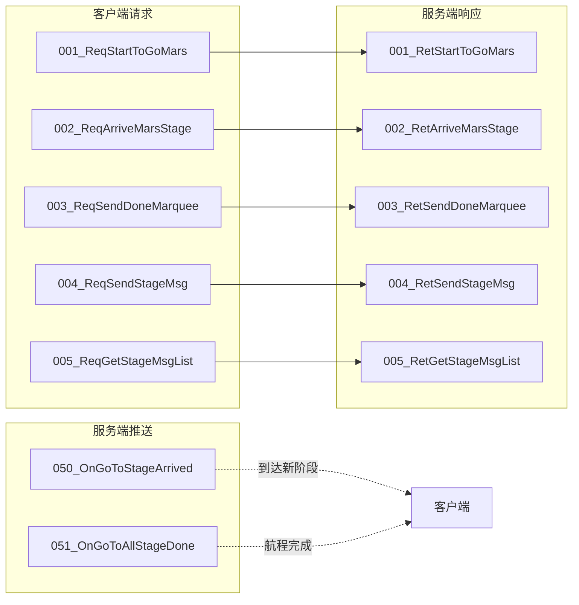
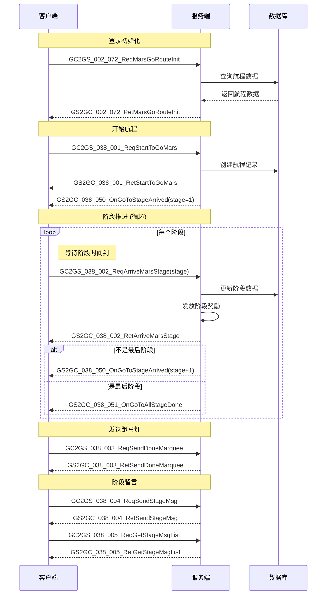
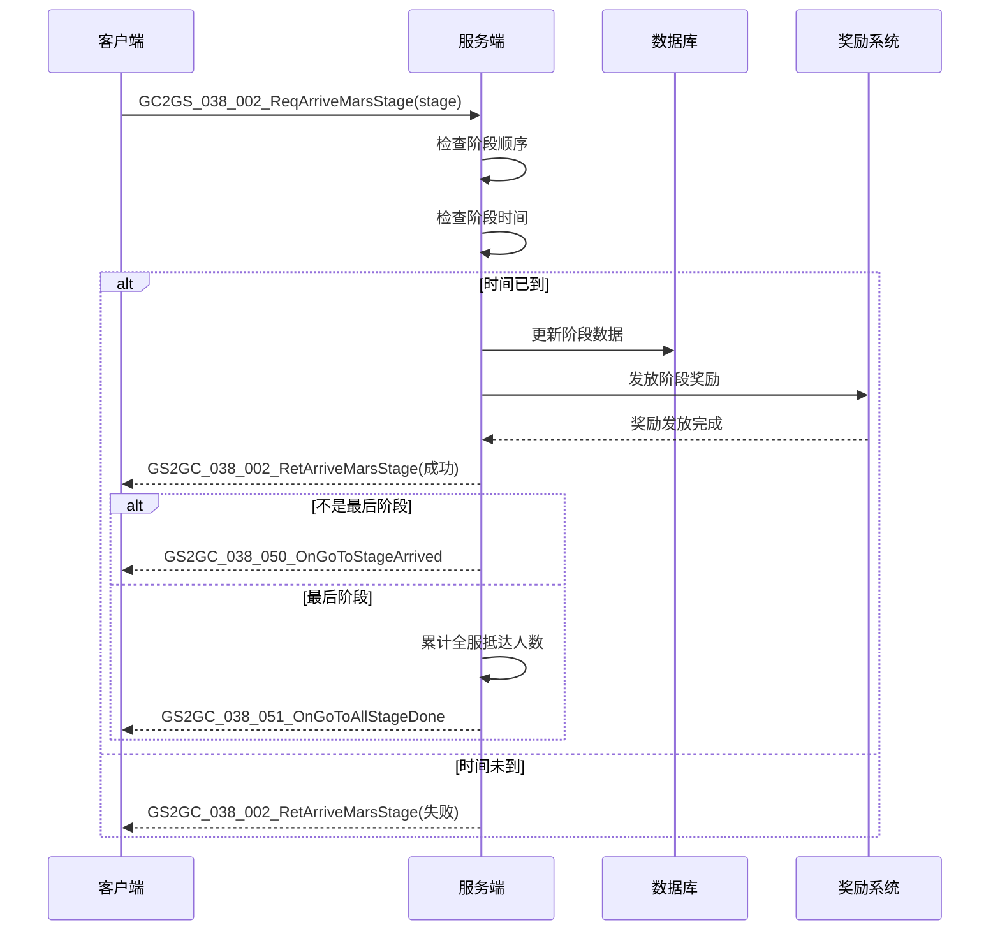
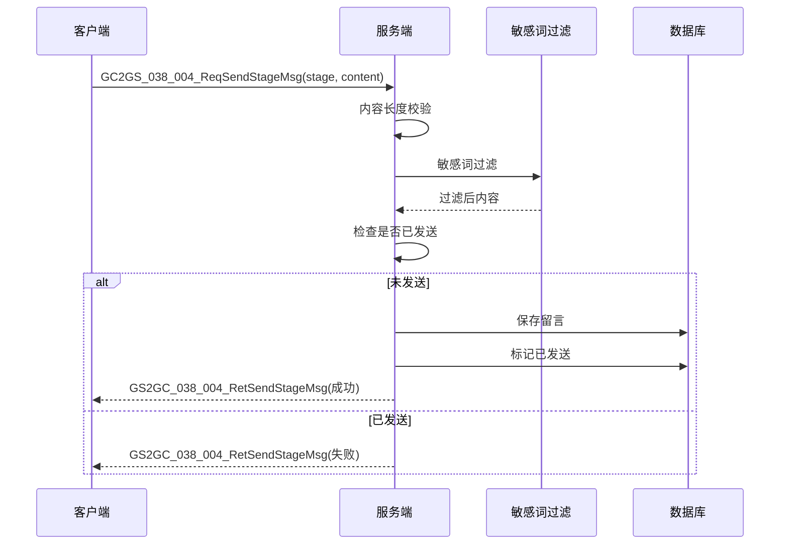
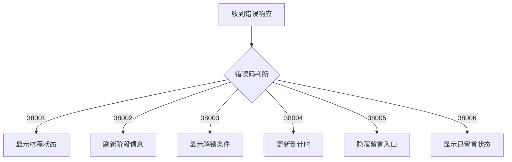

# 火星系统 - 协议文档

## 协议编号

**模块编号**: p038 (MarsOp)

**协议范围**: 038_001 ~ 038_051

---

## 一、协议总览



### 协议汇总表

| 协议号 | 协议名称 | 方向 | 说明 |
|--------|----------|------|------|
| 038_001 | ReqStartToGoMars | C->S | 请求开始前往火星 |
| 038_001 | RetStartToGoMars | S->C | 响应开始前往火星 |
| 038_002 | ReqArriveMarsStage | C->S | 请求到达指定阶段 |
| 038_002 | RetArriveMarsStage | S->C | 响应到达指定阶段 |
| 038_003 | ReqSendDoneMarquee | C->S | 请求发送跑马灯 |
| 038_003 | RetSendDoneMarquee | S->C | 响应发送跑马灯 |
| 038_004 | ReqSendStageMsg | C->S | 请求发送阶段留言 |
| 038_004 | RetSendStageMsg | S->C | 响应发送阶段留言 |
| 038_005 | ReqGetStageMsgList | C->S | 请求获取留言列表 |
| 038_005 | RetGetStageMsgList | S->C | 响应留言列表 |
| 038_050 | OnGoToStageArrived | S->C | 推送到达新阶段 |
| 038_051 | OnGoToAllStageDone | S->C | 推送航程完成 |

---

## 二、客户端请求协议 (GC2GS)

### 1. GC2GS_038_001_ReqStartToGoMars - 请求前往火星

**说明**: 玩家请求开始前往火星的航程

**协议号**: 主指令=38, 子指令=1

**请求参数**: 无

**协议定义**:
```csharp
public class GC2GS_038_001_ReqStartToGoMars : _IALProtocolStructure
{
    // 无参数
    public byte getMainOrder() { return (byte)38; }
    public byte getSubOrder() { return (byte)1; }
}
```

**Java服务端定义**:
```java
public class GC2GS_038_001_ReqStartToGoMars extends _ALProtocolStructure
{
    // 无参数
}
```

**响应**: `GS2GC_038_001_RetStartToGoMars`

**使用场景**:
- 玩家首次点击"前往火星"按钮
- 开始新的火星探索之旅

**前置条件**:
- 玩家已解锁火星功能
- 玩家未在进行中的航程

**客户端调用代码**:
```csharp
/// <summary>
/// 请求开始前往火星
/// </summary>
public void reqStartToGoMars(Action<bool> _callback = null)
{
    NPGSClientListener.sendRequestByLog(
        new GC2GS_038_001_ReqStartToGoMars(),
        new CommonRequestSucFailSameCallbackProtocolDealer<GS2GC_038_001_RetStartToGoMars>(
            (_isSuc, _msg) =>
            {
                if (_callback != null)
                    _callback(_isSuc);
            }));
}
```

---

### 2. GC2GS_038_002_ReqArriveMarsStage - 请求到达火星指定阶段

**说明**: 玩家请求到达航程的指定阶段

**协议号**: 主指令=38, 子指令=2

**请求参数**:

| 参数名 | 类型 | 必填 | 默认值 | 说明 | 约束 |
|--------|------|------|--------|------|------|
| stage | int | 是 | - | 目标阶段号 | 必须为当前阶段+1 |

**协议定义**:
```csharp
public class GC2GS_038_002_ReqArriveMarsStage : _IALProtocolStructure
{
    private int stage;  // 目标阶段

    public GC2GS_038_002_ReqArriveMarsStage(int _stage)
    {
        stage = _stage;
    }

    public int getStage() { return stage; }
    public byte getMainOrder() { return (byte)38; }
    public byte getSubOrder() { return (byte)2; }
}
```

**Java服务端定义**:
```java
public class GC2GS_038_002_ReqArriveMarsStage extends _ALProtocolStructure
{
    private int stage;  // 目标阶段

    public int getStage() { return stage; }
}
```

**响应**: `GS2GC_038_002_RetArriveMarsStage`

**使用场景**:
- 当前阶段时间已到，点击"前往下一阶段"
- 领取当前阶段奖励

**业务规则**:
- stage必须等于服务器当前阶段+1
- 当前阶段时间必须已结束

**客户端调用代码**:
```csharp
/// <summary>
/// 请求到达火星指定阶段
/// </summary>
public void reqArriveMarsStage(int _stage, Action<bool, GS2GC_038_002_RetArriveMarsStage> _callback = null)
{
    NPGSClientListener.sendRequestByLog(
        new GC2GS_038_002_ReqArriveMarsStage(_stage),
        new CommonRequestSucFailSameCallbackProtocolDealer<GS2GC_038_002_RetArriveMarsStage>(
            (_isSuc, _msg) =>
            {
                if (_callback != null)
                    _callback(_isSuc, _msg);
            }));
}
```

---

### 3. GC2GS_038_003_ReqSendDoneMarquee - 发送登录成功跑马灯

**说明**: 到达火星后发送登录成功跑马灯通知

**协议号**: 主指令=38, 子指令=3

**请求参数**: 无

**协议定义**:
```csharp
public class GC2GS_038_003_ReqSendDoneMarquee : _IALProtocolStructure
{
    // 无参数
    public byte getMainOrder() { return (byte)38; }
    public byte getSubOrder() { return (byte)3; }
}
```

**Java服务端定义**:
```java
public class GC2GS_038_003_ReqSendDoneMarquee extends _ALProtocolStructure
{
    // 无参数
}
```

**响应**: `GS2GC_038_003_RetSendDoneMarquee`

**使用场景**:
- 到达火星后，玩家主动触发全服跑马灯
- 展示成就给全服玩家

**业务规则**:
- 玩家必须已到达火星
- 每个玩家只能发送一次

**客户端调用代码**:
```csharp
/// <summary>
/// 发送登录成功跑马灯
/// </summary>
public void reqSendDoneMarquee(Action<bool> _callback = null)
{
    NPGSClientListener.sendRequestByLog(
        new GC2GS_038_003_ReqSendDoneMarquee(),
        new CommonRequestSucFailSameCallbackProtocolDealer<GS2GC_038_003_RetSendDoneMarquee>(
            (_isSuc, _msg) =>
            {
                if (_callback != null)
                    _callback(_isSuc);
            }));
}
```

---

### 4. GC2GS_038_004_ReqSendStageMsg - 发送阶段留言

**说明**: 在当前航程阶段发送留言

**协议号**: 主指令=38, 子指令=4

**请求参数**:

| 参数名 | 类型 | 必填 | 默认值 | 说明 | 约束 |
|--------|------|------|--------|------|------|
| stage | int | 是 | - | 当前阶段 | 有效阶段号 |
| content | string | 是 | - | 留言内容 | 最大200字符 |

**协议定义**:
```csharp
public class GC2GS_038_004_ReqSendStageMsg : _IALProtocolStructure
{
    private int stage;          // 当前阶段
    private string content;     // 留言内容

    public GC2GS_038_004_ReqSendStageMsg(int _stage, string _content)
    {
        stage = _stage;
        content = _content;
    }

    public int getStage() { return stage; }
    public string getContent() { return content; }
    public byte getMainOrder() { return (byte)38; }
    public byte getSubOrder() { return (byte)4; }
}
```

**Java服务端定义**:
```java
public class GC2GS_038_004_ReqSendStageMsg extends _ALProtocolStructure
{
    private int stage;          // 当前阶段
    private String content;     // 留言内容

    public int getStage() { return stage; }
    public String getContent() { return content; }
}
```

**响应**: `GS2GC_038_004_RetSendStageMsg`

**使用场景**:
- 玩家在航程阶段留言板上发送留言

**业务规则**:
- 每个阶段只能发送一次留言
- 阶段变更后可再次发送
- 留言内容需敏感词过滤

**客户端调用代码**:
```csharp
/// <summary>
/// 请求发送阶段留言
/// </summary>
public void reqSendStageMsg(int _stage, string _content, Action<bool> _callback = null)
{
    // 内容校验
    if (string.IsNullOrEmpty(_content) || _content.Length > 200)
    {
        _callback?.Invoke(false);
        return;
    }

    NPGSClientListener.sendRequestByLog(
        new GC2GS_038_004_ReqSendStageMsg(_stage, _content),
        new CommonRequestSucFailSameCallbackProtocolDealer<GS2GC_038_004_RetSendStageMsg>(
            (_isSuc, _msg) =>
            {
                if (_callback != null)
                    _callback(_isSuc);
            }));
}
```

---

### 5. GC2GS_038_005_ReqGetStageMsgList - 请求阶段留言列表

**说明**: 获取指定阶段的留言列表

**协议号**: 主指令=38, 子指令=5

**请求参数**:

| 参数名 | 类型 | 必填 | 默认值 | 说明 | 约束 |
|--------|------|------|--------|------|------|
| stage | int | 是 | - | 阶段号 | 有效阶段号 |

**协议定义**:
```csharp
public class GC2GS_038_005_ReqGetStageMsgList : _IALProtocolStructure
{
    private int stage;  // 阶段

    public GC2GS_038_005_ReqGetStageMsgList(int _stage)
    {
        stage = _stage;
    }

    public int getStage() { return stage; }
    public byte getMainOrder() { return (byte)38; }
    public byte getSubOrder() { return (byte)5; }
}
```

**Java服务端定义**:
```java
public class GC2GS_038_005_ReqGetStageMsgList extends _ALProtocolStructure
{
    private int stage;  // 阶段

    public int getStage() { return stage; }
}
```

**响应**: `GS2GC_038_005_RetGetStageMsgList`

**使用场景**:
- 打开阶段留言板查看留言列表

**客户端调用代码**:
```csharp
/// <summary>
/// 请求获取阶段留言列表
/// </summary>
public void reqGetStageMsgList(int _stage, Action<GS2GC_038_005_RetGetStageMsgList> _callback)
{
    NPGSClientListener.sendRequestByLog(
        new GC2GS_038_005_ReqGetStageMsgList(_stage),
        new CommonRequestSucFailSameCallbackProtocolDealer<GS2GC_038_005_RetGetStageMsgList>(
            (_isSuc, _msg) =>
            {
                if (_callback != null && _isSuc)
                    _callback(_msg);
            }));
}
```

---

## 三、服务端响应协议 (GS2GC)

### 1. GS2GC_038_001_RetStartToGoMars - 前往火星响应

**说明**: 响应开始前往火星请求

**协议号**: 主指令=38, 子指令=1

**响应参数**: 无 (通过错误码判断结果)

**协议定义**:
```csharp
public class GS2GC_038_001_RetStartToGoMars : _IALProtocolStructure
{
    // 无参数，通过错误码判断结果
    public byte getMainOrder() { return (byte)38; }
    public byte getSubOrder() { return (byte)1; }
}
```

**Java服务端定义**:
```java
public class GS2GC_038_001_RetStartToGoMars extends _ALProtocolStructure
{
    // 无参数
}
```

**错误码**:
| 错误码 | 常量名 | 说明 | 处理建议 |
|--------|--------|------|----------|
| 0 | SUCC | 成功 | 等待推送消息 |
| 38001 | MARS_GO_ROUTE_ALREADY_IN_ROUTE | 航程已在进行中 | 检查航程状态 |
| 38003 | MARS_NOT_UNLOCK | 火星功能未解锁 | 检查解锁条件 |

**服务端写入代码**:
```java
// US2GCWriter_038_MarsOp.java
public static GS2GC_038_001_RetStartToGoMars make_001_RetStartToGoMars()
{
    return new GS2GC_038_001_RetStartToGoMars();
}
```

---

### 2. GS2GC_038_002_RetArriveMarsStage - 到达阶段响应

**说明**: 响应到达指定阶段请求

**协议号**: 主指令=38, 子指令=2

**响应参数**: 无 (通过错误码判断结果)

**协议定义**:
```csharp
public class GS2GC_038_002_RetArriveMarsStage : _IALProtocolStructure
{
    // 无参数，通过错误码判断结果
    public byte getMainOrder() { return (byte)38; }
    public byte getSubOrder() { return (byte)2; }
}
```

**错误码**:
| 错误码 | 常量名 | 说明 | 处理建议 |
|--------|--------|------|----------|
| 0 | SUCC | 成功 | 等待推送消息 |
| 38002 | MARS_GO_ROUTE_NEXT_ERROR | 阶段顺序错误 | 检查阶段号 |
| 38004 | MARS_GO_ROUTE_NEXT_SECS_NOT_FULL | 阶段时间未到 | 等待阶段时间到达 |

**服务端写入代码**:
```java
public static GS2GC_038_002_RetArriveMarsStage make_002_RetArriveMarsStage()
{
    return new GS2GC_038_002_RetArriveMarsStage();
}
```

---

### 3. GS2GC_038_003_RetSendDoneMarquee - 发送跑马灯响应

**说明**: 响应发送跑马灯请求

**协议号**: 主指令=38, 子指令=3

**响应参数**: 无

**协议定义**:
```csharp
public class GS2GC_038_003_RetSendDoneMarquee : _IALProtocolStructure
{
    // 无参数
    public byte getMainOrder() { return (byte)38; }
    public byte getSubOrder() { return (byte)3; }
}
```

**服务端写入代码**:
```java
public static GS2GC_038_003_RetSendDoneMarquee make_003_RetSendDoneMarquee()
{
    return new GS2GC_038_003_RetSendDoneMarquee();
}
```

---

### 4. GS2GC_038_004_RetSendStageMsg - 发送留言响应

**说明**: 响应发送留言请求

**协议号**: 主指令=38, 子指令=4

**响应参数**: 无

**协议定义**:
```csharp
public class GS2GC_038_004_RetSendStageMsg : _IALProtocolStructure
{
    // 无参数
    public byte getMainOrder() { return (byte)38; }
    public byte getSubOrder() { return (byte)4; }
}
```

**错误码**:
| 错误码 | 常量名 | 说明 | 处理建议 |
|--------|--------|------|----------|
| 0 | SUCC | 成功 | 留言已发送 |
| 38005 | MARS_GO_ROUTE_STAGE_NOT_ALLOW_MSG | 当前阶段不允许留言 | 检查阶段状态 |
| 38006 | MARS_GO_ROUTE_ALREADY_SENT_STAGE_MSG | 当前阶段已发送过留言 | 每阶段只能留言一次 |

**服务端写入代码**:
```java
public static GS2GC_038_004_RetSendStageMsg make_004_RetSendStageMsg()
{
    return new GS2GC_038_004_RetSendStageMsg();
}
```

---

### 5. GS2GC_038_005_RetGetStageMsgList - 留言列表响应

**说明**: 返回指定阶段的留言列表

**协议号**: 主指令=38, 子指令=5

**响应参数**:

| 参数名 | 类型 | 说明 |
|--------|------|------|
| stage | int | 阶段 |
| msgList | List\<Mars_GoRoute_StageMsg\> | 留言列表 |

**协议定义**:
```csharp
public class GS2GC_038_005_RetGetStageMsgList : _IALProtocolStructure
{
    private int stage;                                              // 阶段
    private List<Common.MarsObj.Mars_GoRoute_StageMsg> msgList;    // 留言列表

    public int getStage() { return stage; }
    public List<Common.MarsObj.Mars_GoRoute_StageMsg> getMsgList() { return msgList; }
    public byte getMainOrder() { return (byte)38; }
    public byte getSubOrder() { return (byte)5; }
}
```

**Java服务端定义**:
```java
public class GS2GC_038_005_RetGetStageMsgList extends _ALProtocolStructure
{
    private int stage;
    private List<Mars_GoRoute_StageMsg> msgList;

    public int getStage() { return stage; }
    public List<Mars_GoRoute_StageMsg> getMsgList() { return msgList; }
}
```

**服务端写入代码**:
```java
public static GS2GC_038_005_RetGetStageMsgList make_005_RetGetStageMsgList(
    int stage, List<Mars_GoRoute_StageMsg> msgList)
{
    GS2GC_038_005_RetGetStageMsgList msg = new GS2GC_038_005_RetGetStageMsgList();
    msg.stage = stage;
    msg.msgList = msgList;
    return msg;
}
```

---

## 四、服务端推送协议 (GS2GC)

### 1. GS2GC_038_050_OnGoToStageArrived - 到达新阶段通知

**说明**: 服务端推送玩家到达航程新阶段

**协议号**: 主指令=38, 子指令=50

**推送参数**:

| 参数名 | 类型 | 说明 |
|--------|------|------|
| stage | int | 当前阶段 |
| startMs | long | 开启前往火星时间（毫秒） |
| stageStartMs | long | 当前阶段开始时间（毫秒） |

**协议定义**:
```csharp
public class GS2GC_038_050_OnGoToStageArrived : _IALProtocolStructure
{
    private int stage;          // 当前阶段
    private long startMs;       // 开启前往火星时间（毫秒）
    private long stageStartMs;  // 当前阶段开始时间（毫秒）

    public int getStage() { return stage; }
    public long getStartMs() { return startMs; }
    public long getStageStartMs() { return stageStartMs; }
    public byte getMainOrder() { return (byte)38; }
    public byte getSubOrder() { return (byte)50; }
}
```

**Java服务端定义**:
```java
public class GS2GC_038_050_OnGoToStageArrived extends _ALProtocolStructure
{
    private int stage;          // 当前阶段
    private long startMs;       // 开启前往火星时间（毫秒）
    private long stageStartMs;  // 当前阶段开始时间（毫秒）

    public int getStage() { return stage; }
    public long getStartMs() { return startMs; }
    public long getStageStartMs() { return stageStartMs; }
}
```

**触发时机**:
- 开始航程时推送第一阶段
- 玩家确认到达下一阶段后推送新阶段

**服务端写入代码**:
```java
public static GS2GC_038_050_OnGoToStageArrived make_050_OnGoToStageArrived(
    int stage, long startMs, long stageStartMs)
{
    GS2GC_038_050_OnGoToStageArrived msg = new GS2GC_038_050_OnGoToStageArrived();
    msg.stage = stage;
    msg.startMs = startMs;
    msg.stageStartMs = stageStartMs;
    return msg;
}
```

**客户端处理代码**:
```csharp
/// <summary>
/// 前往火星-到达新阶段
/// </summary>
public void onGoToStageArrived(GS2GC_038_050_OnGoToStageArrived _msg)
{
    if (_msg == null) return;

    _m_lStartTimeMs = _msg.getStartMs();
    if (_m_curArrivedMarsStageInfo != null)
        _m_curArrivedMarsStageInfo.updateInfo(_msg.getStage(), _msg.getStageStartMs());
    else
        _m_curArrivedMarsStageInfo = new MarsStageInfo(_msg.getStage(), _msg.getStageStartMs());

    // 初始化日志列表
    if (_m_lStartTimeMs > 0 && (_m_lLogInfoList == null || _m_lLogInfoList.Count <= 0))
        _initLogList();

    // 发送埋点
    GCommon.sendStepReport(TraceConst.GO_TO_MARS_ARRIVED_SRAGE.setMarkParam(_msg.getStage()));

    // 发送UI消息
    WinMsg.SendMsg(WinMsgType.ON_MARS_ARRIVED_NEW_STAGE, _msg.getStage());
}
```

---

### 2. GS2GC_038_051_OnGoToAllStageDone - 所有阶段完成通知

**说明**: 服务端推送玩家完成所有航程阶段，已到达火星

**协议号**: 主指令=38, 子指令=51

**推送参数**: 无

**协议定义**:
```csharp
public class GS2GC_038_051_OnGoToAllStageDone : _IALProtocolStructure
{
    // 无参数
    public byte getMainOrder() { return (byte)38; }
    public byte getSubOrder() { return (byte)51; }
}
```

**Java服务端定义**:
```java
public class GS2GC_038_051_OnGoToAllStageDone extends _ALProtocolStructure
{
    // 无参数
}
```

**触发时机**:
- 玩家完成最后一个阶段，正式到达火星

**服务端写入代码**:
```java
public static GS2GC_038_051_OnGoToAllStageDone make_051_OnGoToAllStageDone()
{
    return new GS2GC_038_051_OnGoToAllStageDone();
}
```

**客户端处理代码**:
```csharp
/// <summary>
/// 前往火星所有阶段完成
/// </summary>
public void onGoToAllStageDone()
{
    _m_bIsArriveMars = true;

    // 发送埋点
    GCommon.sendStepReport(TraceConst.ARRIVED_MARS);

    // 刷新显示
    GCommon.reloadCustomLoadPrefab();
}
```

---

## 五、数据结构定义

### 1. Mars_GoRoute_StageMsg - 阶段留言

**用途**: 存储航程阶段的留言信息

**路径**: `ClientProtocol/Common/MarsObj/Mars_GoRoute_StageMsg.cs`

| 字段名 | 类型 | 必填 | 说明 | 约束 |
|--------|------|------|------|------|
| playerName | string | 是 | 玩家名称 | 非空，最大64字符 |
| content | string | 是 | 留言内容 | 最大200字符 |
| timeMs | long | 是 | 留言时间（毫秒） | > 0 |

**协议定义**:
```csharp
public class Mars_GoRoute_StageMsg : _IALProtocolStructure
{
    private string playerName;  // 玩家名称
    private string content;     // 留言内容
    private long timeMs;        // 留言时间（毫秒）

    public string getPlayerName() { return playerName; }
    public string getContent() { return content; }
    public long getTimeMs() { return timeMs; }
}
```

**Java服务端定义**:
```java
public class Mars_GoRoute_StageMsg extends _ALProtocolStructure
{
    private String playerName;
    private String content;
    private long timeMs;

    public String getPlayerName() { return playerName; }
    public String getContent() { return content; }
    public long getTimeMs() { return timeMs; }
}
```

### 2. Mars_GoRoute_StageMsg 创建代码

```java
// 服务端创建留言对象
public static Mars_GoRoute_StageMsg createStageMsg(MarsGoRouteStageMsg dbMsg)
{
    Mars_GoRoute_StageMsg msg = new Mars_GoRoute_StageMsg();
    msg.playerName = dbMsg.getPlayerName();
    msg.content = dbMsg.getContent();
    msg.timeMs = dbMsg.getCreatedMs();
    return msg;
}
```

---

## 六、初始化协议

### GS2GC_002_072_RetMarsGoRouteInit - 前往火星数据初始化

**说明**: 玩家登录时获取火星航程数据

**协议号**: 主指令=2, 子指令=72

**请求协议**: `GC2GS_002_072_ReqMarsGoRouteInit`

**响应参数**:

| 参数名 | 类型 | 说明 |
|--------|------|------|
| isAllDone | bool | 是否全部完成（已到达火星） |
| stage | int | 当前阶段（0表示未开始） |
| startMs | long | 开始时间（毫秒） |
| stageStartMs | long | 当前阶段开始时间（毫秒） |

**协议定义**:
```csharp
public class GS2GC_002_072_RetMarsGoRouteInit : _IALProtocolStructure
{
    private bool isAllDone;     // 是否全部完成
    private int stage;          // 当前阶段
    private long startMs;       // 开始时间
    private long stageStartMs;  // 当前阶段开始时间（毫秒）

    public bool getIsAllDone() { return isAllDone; }
    public int getStage() { return stage; }
    public long getStartMs() { return startMs; }
    public long getStageStartMs() { return stageStartMs; }
}
```

**Java服务端定义**:
```java
public class GS2GC_002_072_RetMarsGoRouteInit extends _ALProtocolStructure
{
    private boolean isAllDone;     // 是否全部完成
    private int stage;             // 当前阶段
    private long startMs;          // 开始时间
    private long stageStartMs;     // 当前阶段开始时间

    public boolean getIsAllDone() { return isAllDone; }
    public int getStage() { return stage; }
    public long getStartMs() { return startMs; }
    public long getStageStartMs() { return stageStartMs; }
}
```

**触发时机**:
- 玩家登录时自动请求
- 进入火星模块时请求

**客户端处理代码**:
```csharp
/// <summary>
/// 前往火星数据初始化
/// </summary>
public void retMarsGoRouteInit(GS2GC_002_072_RetMarsGoRouteInit _msg)
{
    _m_parentComponent.dealPreInitFunc(() =>
    {
        if (_msg == null)
        {
            _m_initCompleteCallback?.Invoke(false);
            return;
        }

        _m_bIsArriveMars = _msg.getIsAllDone();
        _m_lStartTimeMs = _msg.getStartMs();
        if (_msg.getStage() > 0)
            _m_curArrivedMarsStageInfo = new MarsStageInfo(_msg.getStage(), _msg.getStageStartMs());

        // 初始化日志列表
        if (_m_lStartTimeMs > 0 && (_m_lLogInfoList == null || _m_lLogInfoList.Count <= 0))
            _initLogList();

        // 开启任务刷新定时器
        _m_tcTickTaskController.setDisable();
        _m_tcTickTaskController = ALCommonTaskController.CommonEnableDurationActionAddMonoTask(_refreshGoToRedTip, 1f);

        // 初始化完成回调
        _m_initCompleteCallback?.Invoke(true);
    });
}
```

---

## 七、协议交互流程图

### 7.1 完整航程流程



### 7.2 开始航程时序图


### 7.3 到达阶段时序图



### 7.4 留言系统时序图



---

## 八、协议文件路径

| 类型 | 路径 |
|------|------|
| 客户端请求协议 | `game_client/Assets/Scripts/ClientProtocol/GC2GS/p038_MarsOp/` |
| 服务端响应协议 | `game_client/Assets/Scripts/ClientProtocol/GS2GC/p038_MarsOp/` |
| 公共数据结构 | `game_client/Assets/Scripts/ClientProtocol/Common/MarsObj/` |
| 服务端协议定义 | `game_server/ClientProtocol/GC2GS/p038_MarsOp/` |
| 服务端响应定义 | `game_server/ServerProtocol/src/GS2GC/p038_MarsOp/` |
| 消息处理器 | `game_server/UserServer/src/NPUSServer/NPUserMsgDispather/p038_MarsOp/` |
| 协议写入器 | `game_server/UserServer/src/NPUSServer/NPUserMsgDispather/Write/US2GCWriter_038_MarsOp.java` |

---

## 九、错误码汇总

### 错误码定义 (MarsErr)

| 错误码 | 常量名 | 说明 | 处理建议 | 用户提示 |
|--------|--------|------|----------|----------|
| 38001 | MARS_GO_ROUTE_ALREADY_IN_ROUTE | 航程已在进行中 | 检查当前航程状态 | "航程已在进行中" |
| 38002 | MARS_GO_ROUTE_NEXT_ERROR | 阶段顺序错误 | 检查请求的阶段号 | "阶段顺序错误" |
| 38003 | MARS_NOT_UNLOCK | 火星功能未解锁 | 检查解锁条件 | "火星功能未解锁" |
| 38004 | MARS_GO_ROUTE_NEXT_SECS_NOT_FULL | 阶段时间未到 | 等待阶段时间到达 | "阶段时间未到" |
| 38005 | MARS_GO_ROUTE_STAGE_NOT_ALLOW_MSG | 当前阶段不允许留言 | 检查阶段状态 | "当前阶段不允许留言" |
| 38006 | MARS_GO_ROUTE_ALREADY_SENT_STAGE_MSG | 留言已发送 | 当前阶段只能留言一次 | "本阶段已发送过留言" |

### 错误码处理流程



### 错误码枚举定义

```java
// MarsErr.java
public enum MarsErr implements CommErrInterface
{
    MARS_GO_ROUTE_ALREADY_IN_ROUTE(38001, "航程已在进行中"),
    MARS_GO_ROUTE_NEXT_ERROR(38002, "阶段顺序错误"),
    MARS_NOT_UNLOCK(38003, "火星功能未解锁"),
    MARS_GO_ROUTE_NEXT_SECS_NOT_FULL(38004, "阶段时间未到"),
    MARS_GO_ROUTE_STAGE_NOT_ALLOW_MSG(38005, "当前阶段不允许留言"),
    MARS_GO_ROUTE_ALREADY_SENT_STAGE_MSG(38006, "本阶段已发送过留言");

    private final int code;
    private final String desc;

    MarsErr(int code, String desc) {
        this.code = code;
        this.desc = desc;
    }

    @Override
    public int getCode() { return code; }

    @Override
    public String getDesc() { return desc; }
}
```

---

## 十、协议版本兼容性

### 版本演进规则

| 版本 | 变更内容 | 兼容性 |
|------|----------|--------|
| v1.0.0 | 初始协议定义 | - |
| v1.1.0 | 新增留言功能 (004, 005) | 向后兼容 |
| v1.2.0 | 新增推送消息 (050, 051) | 向后兼容 |

---

## 十一、协议测试用例

### 测试用例列表

| 用例编号 | 测试场景 | 请求参数 | 预期结果 |
|----------|----------|----------|----------|
| TC_001 | 正常开始航程 | 无参数 | 成功，推送stage=1 |
| TC_002 | 重复开始航程 | 无参数 | 失败，错误码38001 |
| TC_003 | 未解锁开始航程 | 无参数 | 失败，错误码38003 |
| TC_004 | 正常到达阶段 | stage=2 | 成功，推送新阶段 |
| TC_005 | 阶段顺序错误 | stage=5 | 失败，错误码38002 |
| TC_006 | 阶段时间未到 | stage=2 | 失败，错误码38004 |
| TC_007 | 正常发送留言 | stage, content | 成功 |
| TC_008 | 重复发送留言 | stage, content | 失败，错误码38006 |
| TC_009 | 留言内容过长 | stage, 201字符 | 失败，参数校验 |
| TC_010 | 正常获取留言列表 | stage | 成功，返回列表 |

### 测试协议构造

```csharp
// 单元测试示例
[Test]
public void TestStartToGoMars()
{
    var req = new GC2GS_038_001_ReqStartToGoMars();
    Assert.AreEqual(38, req.getMainOrder());
    Assert.AreEqual(1, req.getSubOrder());
}

[Test]
public void TestArriveMarsStage()
{
    var req = new GC2GS_038_002_ReqArriveMarsStage(2);
    Assert.AreEqual(2, req.getStage());
    Assert.AreEqual(38, req.getMainOrder());
    Assert.AreEqual(2, req.getSubOrder());
}

[Test]
public void TestSendStageMsg()
{
    string content = "测试留言内容";
    var req = new GC2GS_038_004_ReqSendStageMsg(1, content);
    Assert.AreEqual(1, req.getStage());
    Assert.AreEqual(content, req.getContent());
}
```

---

## 十二、协议监听注册

### 客户端监听器配置

| 监听器 | 协议 | 说明 | 文件位置 |
|--------|------|------|----------|
| GSSubDealer_038_050_OnGoToStageArrived | GS2GC_038_050 | 到达新阶段通知 | p038_MarsOp/ |
| GSSubDealer_038_051_OnGoToAllStageDone | GS2GC_038_051 | 所有阶段完成 | p038_MarsOp/ |

### 监听器注册代码

```csharp
// 协议监听注册
public static void registerMarsListeners()
{
    // 注册推送消息监听
    NPGSClientListener.regSubDealer(
        new GSSubDealer_038_050_OnGoToStageArrived());
    NPGSClientListener.regSubDealer(
        new GSSubDealer_038_051_OnGoToAllStageDone());
}

// 监听器实现
public class GSSubDealer_038_050_OnGoToStageArrived : _ANPGSSubDealer
{
    public override void dealMessage(GS2GC_038_050_OnGoToStageArrived _msg)
    {
        NPPlayer.instance.marsComp.goToSubComponent.onGoToStageArrived(_msg);
    }
}

public class GSSubDealer_038_051_OnGoToAllStageDone : _ANPGSSubDealer
{
    public override void dealMessage(GS2GC_038_051_OnGoToAllStageDone _msg)
    {
        NPPlayer.instance.marsComp.goToSubComponent.onGoToAllStageDone();
    }
}
```

---

*文档生成时间: 2026-04-12*
*文档版本: v2.0.0*
