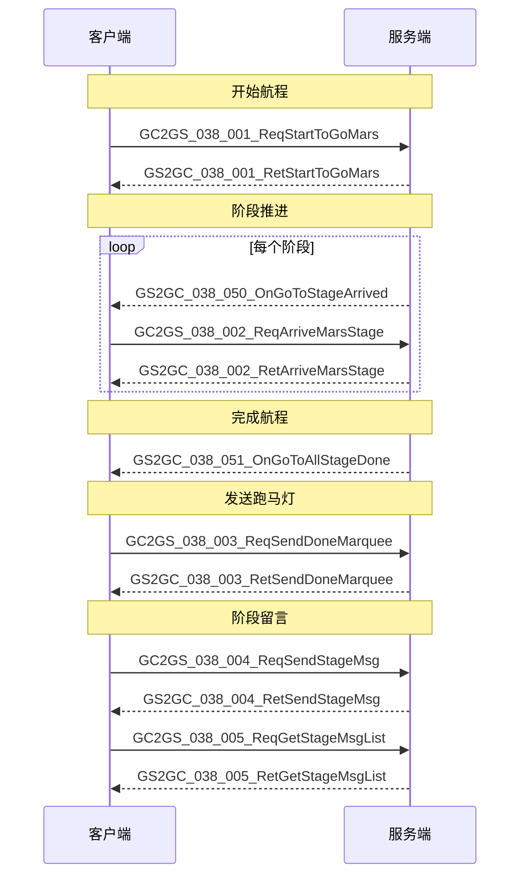

# 火星系统 - 协议文档

## 协议编号

**模块编号**: p038 (MarsOp)

---

## 一、客户端请求协议 (GC2GS)

### 1. GC2GS_038_001_ReqStartToGoMars - 请求前往火星

**说明**: 玩家请求开始前往火星的航程

**请求参数**: 无

**协议定义**:
```csharp
public class GC2GS_038_001_ReqStartToGoMars : _IALProtocolStructure
{
    // 无参数
}
```

**响应**: `GS2GC_038_001_RetStartToGoMars`

---

### 2. GC2GS_038_002_ReqArriveMarsStage - 请求到达火星指定阶段

**说明**: 玩家请求到达航程的指定阶段

**请求参数**:

| 参数名 | 类型 | 说明 |
|--------|------|------|
| stage | int | 目标阶段号 |

**协议定义**:
```csharp
public class GC2GS_038_002_ReqArriveMarsStage : _IALProtocolStructure
{
    private int stage;  // 目标阶段
}
```

**响应**: `GS2GC_038_002_RetArriveMarsStage`

---

### 3. GC2GS_038_003_ReqSendDoneMarquee - 发送登录成功跑马灯

**说明**: 到达火星后发送登录成功跑马灯通知

**请求参数**: 无

**协议定义**:
```csharp
public class GC2GS_038_003_ReqSendDoneMarquee : _IALProtocolStructure
{
    // 无参数
}
```

**响应**: `GS2GC_038_003_RetSendDoneMarquee`

---

### 4. GC2GS_038_004_ReqSendStageMsg - 发送阶段留言

**说明**: 在当前航程阶段发送留言

**请求参数**:

| 参数名 | 类型 | 说明 |
|--------|------|------|
| stage | int | 当前阶段 |
| content | string | 留言内容 |

**协议定义**:
```csharp
public class GC2GS_038_004_ReqSendStageMsg : _IALProtocolStructure
{
    private int stage;          // 当前阶段
    private string content;     // 留言内容
}
```

**响应**: `GS2GC_038_004_RetSendStageMsg`

---

### 5. GC2GS_038_005_ReqGetStageMsgList - 请求阶段留言列表

**说明**: 获取指定阶段的留言列表

**请求参数**:

| 参数名 | 类型 | 说明 |
|--------|------|------|
| stage | int | 阶段号 |

**协议定义**:
```csharp
public class GC2GS_038_005_ReqGetStageMsgList : _IALProtocolStructure
{
    private int stage;  // 阶段
}
```

**响应**: `GS2GC_038_005_RetGetStageMsgList`

---

## 二、服务端响应协议 (GS2GC)

### 1. GS2GC_038_001_RetStartToGoMars - 前往火星响应

**说明**: 响应开始前往火星请求

**响应参数**: 无

**协议定义**:
```csharp
public class GS2GC_038_001_RetStartToGoMars : _IALProtocolStructure
{
    // 无参数，通过错误码判断结果
}
```

---

### 2. GS2GC_038_002_RetArriveMarsStage - 到达阶段响应

**说明**: 响应到达指定阶段请求

---

### 3. GS2GC_038_003_RetSendDoneMarquee - 发送跑马灯响应

**说明**: 响应发送跑马灯请求

**响应参数**: 无

---

### 4. GS2GC_038_004_RetSendStageMsg - 发送留言响应

**说明**: 响应发送留言请求

**响应参数**: 无

---

### 5. GS2GC_038_005_RetGetStageMsgList - 留言列表响应

**说明**: 返回指定阶段的留言列表

**响应参数**:

| 参数名 | 类型 | 说明 |
|--------|------|------|
| stage | int | 阶段 |
| msgList | List<Mars_GoRoute_StageMsg> | 留言列表 |

**协议定义**:
```csharp
public class GS2GC_038_005_RetGetStageMsgList : _IALProtocolStructure
{
    private int stage;                                              // 阶段
    private List<Common.MarsObj.Mars_GoRoute_StageMsg> msgList;    // 留言列表
}
```

---

## 三、服务端推送协议 (GS2GC)

### 1. GS2GC_038_050_OnGoToStageArrived - 到达新阶段通知

**说明**: 服务端推送玩家到达航程新阶段

**推送参数**:

| 参数名 | 类型 | 说明 |
|--------|------|------|
| stage | int | 当前阶段 |
| startMs | long | 开启前往火星时间（毫秒） |
| stageStartMs | long | 当前阶段开始时间（毫秒） |

**协议定义**:
```csharp
public class GS2GC_038_050_OnGoToStageArrived : _IALProtocolStructure
{
    private int stage;          // 当前阶段
    private long startMs;       // 开启前往火星时间（毫秒）
    private long stageStartMs;  // 当前阶段开始时间（毫秒）
}
```

---

### 2. GS2GC_038_051_OnGoToAllStageDone - 所有阶段完成通知

**说明**: 服务端推送玩家完成所有航程阶段，已到达火星

**推送参数**: 无

**协议定义**:
```csharp
public class GS2GC_038_051_OnGoToAllStageDone : _IALProtocolStructure
{
    // 无参数
}
```

---

## 四、数据结构定义

### 1. Mars_GoRoute_StageMsg - 阶段留言

**用途**: 存储航程阶段的留言信息

| 字段名 | 类型 | 说明 |
|--------|------|------|
| playerName | string | 玩家名称 |
| content | string | 留言内容 |
| timeMs | long | 留言时间（毫秒） |

**协议定义**:
```csharp
public class Mars_GoRoute_StageMsg : _IALProtocolStructure
{
    private string playerName;  // 玩家名称
    private string content;     // 留言内容
    private long timeMs;        // 留言时间（毫秒）
}
```

---

## 五、协议文件路径

| 类型 | 路径 |
|------|------|
| 客户端请求协议 | `game_client/Assets/Scripts/ClientProtocol/GC2GS/p038_MarsOp/` |
| 服务端响应协议 | `game_client/Assets/Scripts/ClientProtocol/GS2GC/p038_MarsOp/` |
| 公共数据结构 | `game_client/Assets/Scripts/ClientProtocol/Common/MarsObj/` |
| 服务端协议定义 | `game_server/ClientProtocol/GC2GS/p038_MarsOp/` |

---

## 六、协议交互流程图



---

## 七、初始化协议

### GS2GC_002_072_RetMarsGoRouteInit - 前往火星数据初始化

**说明**: 玩家登录时获取火星航程数据

**响应参数**:

| 参数名 | 类型 | 说明 |
|--------|------|------|
| isAllDone | bool | 是否全部完成 |
| stage | int | 当前阶段 |
| startMs | long | 开始时间（毫秒） |
| stageStartMs | long | 当前阶段开始时间（毫秒） |

**协议定义**:
```csharp
public class GS2GC_002_072_RetMarsGoRouteInit : _IALProtocolStructure
{
    private bool isAllDone;     // 是否全部完成
    private int stage;          // 当前阶段
    private long startMs;       // 开始时间
    private long stageStartMs;  // 当前阶段开始时间（毫秒）
}
```

---

*文档生成时间: 2026-04-11*
