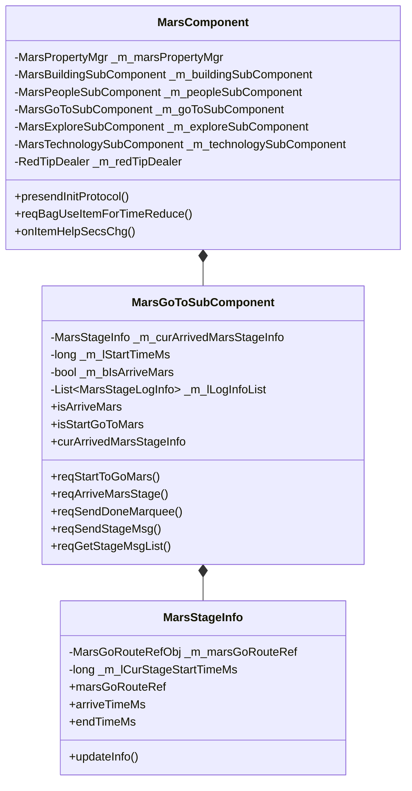

# 火星系统 - 客户端开发

## 概述

本文档描述火星系统（MarsOp, p038）的客户端开发实现，包括组件结构、核心类设计、协议交互等内容。

---

## 一、组件架构

### 1.1 组件结构图



### 1.2 目录结构

```
game_client/Assets/Scripts/LogicScripts/GameComponent/Mars/
├── MarsComponent.cs                    # 火星主组件
├── MarsComponent_RedTipDealer.cs       # 红点处理
├── MarsUtil.cs                         # 工具类
├── MarsGoToSubComponent.cs             # 前往火星子组件
├── MarsBuildingSubComponent.cs         # 建筑子组件
├── MarsPeopleSubComponent.cs           # 居民子组件
├── MarsExploreSubComponent.cs          # 探索子组件
├── MarsTechnologySubComponent.cs       # 科技子组件
├── MarsStageInfo.cs                    # 阶段信息
├── MarsStageLogInfo.cs                 # 阶段日志信息
├── Building/                           # 建筑相关
│   ├── MarsBuildingInfo.cs
│   ├── MarsBuildingEquipmentInfo.cs
│   └── ...
├── PeopleWill/                         # 居民意愿
│   ├── Help/
│   └── Letter/
├── Explore/                            # 探索相关
│   ├── MarsExploreTeamInfo.cs
│   ├── MarsExploreMineInfo.cs
│   └── ...
└── Technology/                         # 科技相关
    └── MarsTechnologyInfo.cs
```

---

## 二、核心类详解

### 2.1 MarsComponent - 火星主组件

**继承关系**: `_ANPBasicPlayerComponent`

**组件类型**: `ENPPlayerCompType.MARS`

**依赖组件**:
- `BASIC_INFO` - 玩家基础信息
- `RECORD` - 记录组件
- `PLAYER_BUFF` - 玩家Buff
- `HERO` - 英雄组件
- `SPECIAL_ITEM` - 特殊道具

**核心属性**:

| 属性名 | 类型 | 说明 |
|--------|------|------|
| power | long | 火星实力 |
| healthValue | long | 健康指数 |
| oxygenValue | long | 氧气指数 |
| satietyValue | long | 饱食度指数 |
| sleepValue | long | 睡眠指数 |
| happyValue | long | 幸福指数 |
| comfortValue | long | 舒适度指数 |
| moodValue | long | 心情指数 |
| cureRate | long | 治愈率 |
| peopleNumLimit | long | 人口上限 |
| settleSlotPeopleLimit | long | 可派遣人数上限 |
| dispatchedPeopleNum | long | 已派遣人数总数 |
| totalPeopleNum | long | 总人口数 |

**事件定义**:

```csharp
public event Action<long> onPowerChanged;              // 火星实力变化
public event Action<long> onHealthValueChanged;        // 健康指数变化
public event Action<long> onOxygenValueChanged;        // 氧气指数变化
public event Action<long> onSatietyValueChanged;       // 饱腹指数变化
public event Action<long> onSleepValueChanged;         // 睡眠指数变化
public event Action<long> onHappyValueChanged;         // 幸福指数变化
public event Action<long> onComfortValueChanged;       // 舒适度指数变化
public event Action<long> onMoodValueChanged;          // 心情指数变化
public event Action<long> onCureRateChanged;           // 治愈率变化
public event Action<long> onPeopleNumLimitChanged;     // 人口上限变化
public event Action<long> onSettleSlotPeopleLimitChanged;  // 可派遣人数上限变化
public event Action<long> onDispatchedPeopleNumChanged;    // 已派遣人数变化
public event Action<long> onTotalPeopleNumChanged;         // 总人口数变化
```

**关键方法**:

```csharp
// 请求使用背包道具减少时间
public void reqBagUseItemForTimeReduce(
    List<NPCommon_ItemInfo> _useItemList,
    EMarsBagItemUseTimeType _timeType,
    long _objId,
    Action<bool, GS2GC_039_014_RetBagUseItemForTimeReduce> _callBack
)

// 触发属性重新计算
public void needUpdatePower()           // 触发火星实力重算
public void needUpdateHealthValue()     // 触发健康指数重算
public void needUpdateTotalPeopleNum()  // 触发总人口数重算
// ... 其他属性更新方法
```

### 2.2 MarsGoToSubComponent - 前往火星子组件

**继承关系**: `_AMarsSubComponent`

**核心属性**:

| 属性名 | 类型 | 说明 |
|--------|------|------|
| isArriveMars | bool | 是否已到达火星 |
| isStartGoToMars | bool | 是否已开始前往火星 |
| curArrivedMarsStageInfo | MarsStageInfo | 当前火星节点信息 |
| firstStageArrivedTimeMs | long | 第一个节点到达时间 |

**关键方法**:

```csharp
// 请求初始化前往火星数据
public void reqMarsGoRouteInit()

// 请求开始前往火星
public void reqStartToGoMars(Action<bool> _callback = null)

// 请求到达火星指定阶段
public void reqArriveMarsStage(int _stage, Action<bool, GS2GC_038_002_RetArriveMarsStage> _callback = null)

// 发送登录成功跑马灯
public void reqSendDoneMarquee()

// 请求发送阶段留言
public void reqSendStageMsg(int _stage, string _content)

// 请求阶段留言列表
public void reqGetStageMsgList(int _stage, Action<GS2GC_038_005_RetGetStageMsgList> _callback)
```

### 2.3 MarsStageInfo - 阶段信息

**用途**: 存储火星航程单个阶段的信息

**核心属性**:

| 属性名 | 类型 | 说明 |
|--------|------|------|
| marsGoRouteRef | MarsGoRouteRefObj | 当前阶段配置引用 |
| arriveTimeMs | long | 到达该节点时间 |
| endTimeMs | long | 该节点结束时间 |

**结束时间计算逻辑**:

```csharp
public long endTimeMs
{
    get
    {
        // 持续时间
        long continueMs = _m_marsGoRouteRef != null ? _m_marsGoRouteRef.continue_secs * 1000 : 0;
        // 根据全服抵达人数动态减少时长
        long reducePer = GRefdataCoreMgr.instance.getMarsStageArriveReducePer();
        if (reducePer > 0)
            continueMs = continueMs * (10000 - reducePer) / 10000;

        return arriveTimeMs + continueMs;
    }
}
```

---

## 三、协议处理

### 3.1 初始化流程

```csharp
public override void presendInitProtocol()
{
    bool isInitDone = true;
    ALStepCounter stepCounter = new ALStepCounter();
    stepCounter.chgTotalStepCount(5);
    stepCounter.regAllDoneDelegate(() =>
    {
        if (isInitDone)
            setInitDone();
        else
            setInitFail();
    });

    // 并行初始化5个子组件
    _m_buildingSubComponent.init(_isSuc => { ... });
    _m_peopleSubComponent.init(_isSuc => { ... });
    _m_goToSubComponent.init(_isSuc => { ... });
    _m_exploreSubComponent.init(_isSuc => { ... });
    _m_technologySubComponent.init(_isSuc => { ... });
}
```

### 3.2 协议监听注册

**监听文件位置**: `game_client/Assets/Scripts/LogicScripts/NPGSClientListener/SubDealer/p038_MarsOp/`

| 监听器 | 协议 | 说明 |
|--------|------|------|
| GSSubDealer_038_050_OnGoToStageArrived | GS2GC_038_050 | 到达新阶段通知 |
| GSSubDealer_038_051_OnGoToAllStageDone | GS2GC_038_051 | 所有阶段完成 |

### 3.3 协议处理示例

```csharp
// 前往火星数据初始化
public void retMarsGoRouteInit(GS2GC_002_072_RetMarsGoRouteInit _msg)
{
    _m_parentComponent.dealPreInitFunc(() =>
    {
        if (_msg == null)
        {
            _m_initCompleteCallback?.Invoke(false);
            return;
        }

        _m_bIsArriveMars = _msg.getIsAllDone();
        _m_lStartTimeMs = _msg.getStartMs();
        if (_msg.getStage() > 0)
            _m_curArrivedMarsStageInfo = new MarsStageInfo(_msg.getStage(), _msg.getStageStartMs());

        // 初始化日志列表
        if (_m_lStartTimeMs > 0 && (_m_lLogInfoList == null || _m_lLogInfoList.Count <= 0))
            _initLogList();

        // 开启任务刷新定时器
        _m_tcTickTaskController = ALCommonTaskController.CommonEnableDurationActionAddMonoTask(_refreshGoToRedTip, 1f);

        _m_initCompleteCallback?.Invoke(true);
    });
}

// 到达新阶段
public void onGoToStageArrived(GS2GC_038_050_OnGoToStageArrived _msg)
{
    if (_msg == null) return;

    _m_lStartTimeMs = _msg.getStartMs();
    if (_m_curArrivedMarsStageInfo != null)
        _m_curArrivedMarsStageInfo.updateInfo(_msg.getStage(), _msg.getStageStartMs());
    else
        _m_curArrivedMarsStageInfo = new MarsStageInfo(_msg.getStage(), _msg.getStageStartMs());

    // 发送埋点-到达火星新阶段
    GCommon.sendStepReport(TraceConst.GO_TO_MARS_ARRIVED_SRAGE.setMarkParam(_msg.getStage()));

    WinMsg.SendMsg(WinMsgType.ON_MARS_ARRIVED_NEW_STAGE, _msg.getStage());
}

// 所有阶段完成
public void onGoToAllStageDone()
{
    _m_bIsArriveMars = true;

    // 发送埋点-到达火星
    GCommon.sendStepReport(TraceConst.ARRIVED_MARS);
    // 刷新显示
    GCommon.reloadCustomLoadPrefab();
}
```

---

## 四、红点系统

### 4.1 红点刷新逻辑

```csharp
private void _refreshGoToRedTip()
{
    long redTipCount = 0;

    // 未到达火星
    if (!_m_bIsArriveMars)
    {
        // 当前阶段已抵达
        if (_m_curArrivedMarsStageInfo != null &&
            _m_curArrivedMarsStageInfo.endTimeMs - FpsAndPingMgr.instance.serverTimeTag <= 0)
            redTipCount = 1;
    }
    else
    {
        // 登录火星条件通过并且未选择登陆区域
        if (GCommon.isFuncUnlock(ENPFunctionType.LAND_MARS) &&
            !NPPlayer.instance.playerInfoComp.clientDataRemarkInfo.isSelectLandingMarsArea())
            redTipCount = 1;
    }

    RedTipMgr.instance.setCountByRefRedTipId(RedTipConst.RED_MARS_GO_TO_NEXT, redTipCount);
}
```

---

## 五、协议文件位置

| 类型 | 路径 |
|------|------|
| 客户端请求协议 | `game_client/Assets/Scripts/ClientProtocol/GC2GS/p038_MarsOp/` |
| 服务端响应协议 | `game_client/Assets/Scripts/ClientProtocol/GS2GC/p038_MarsOp/` |
| 公共数据结构 | `game_client/Assets/Scripts/ClientProtocol/Common/MarsObj/` |

---

*文档生成时间: 2026-04-11*
