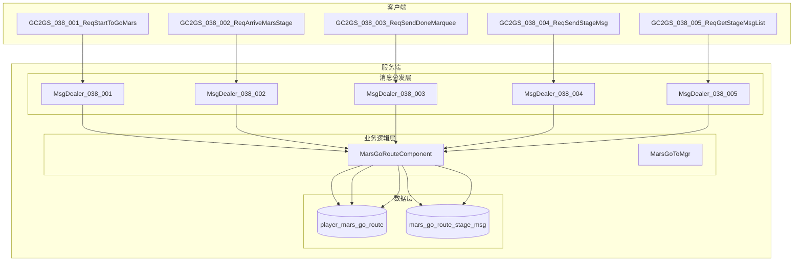
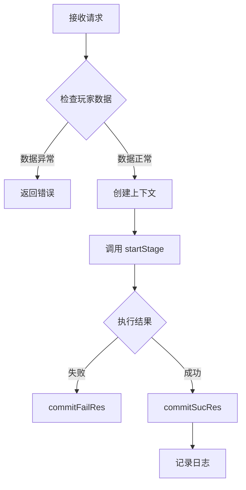
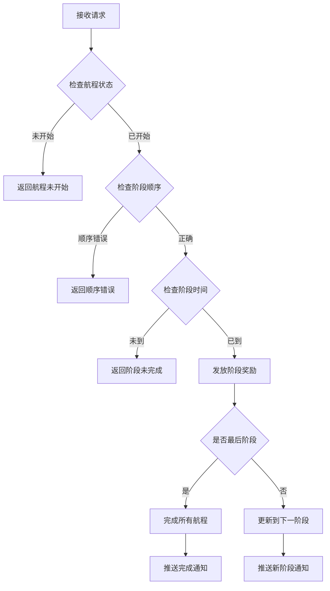
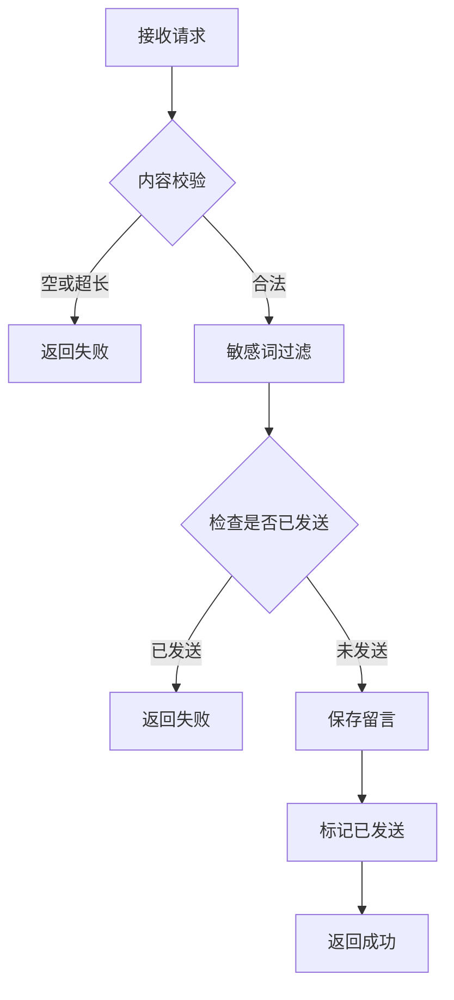
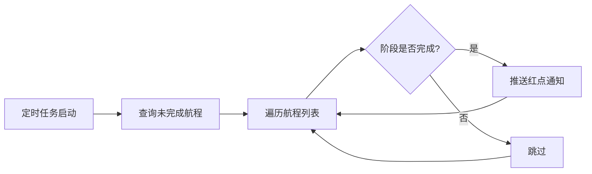
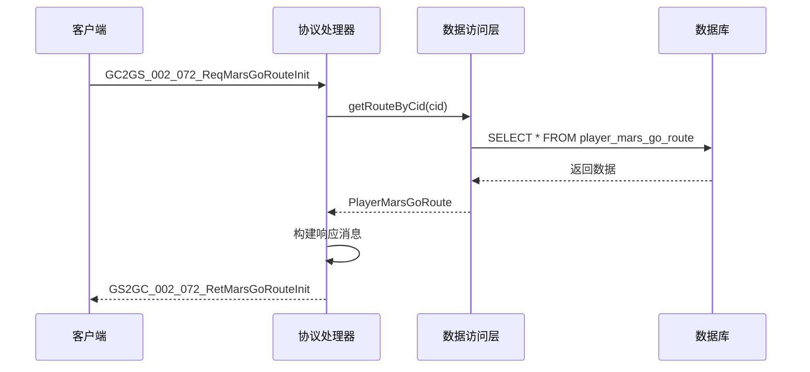
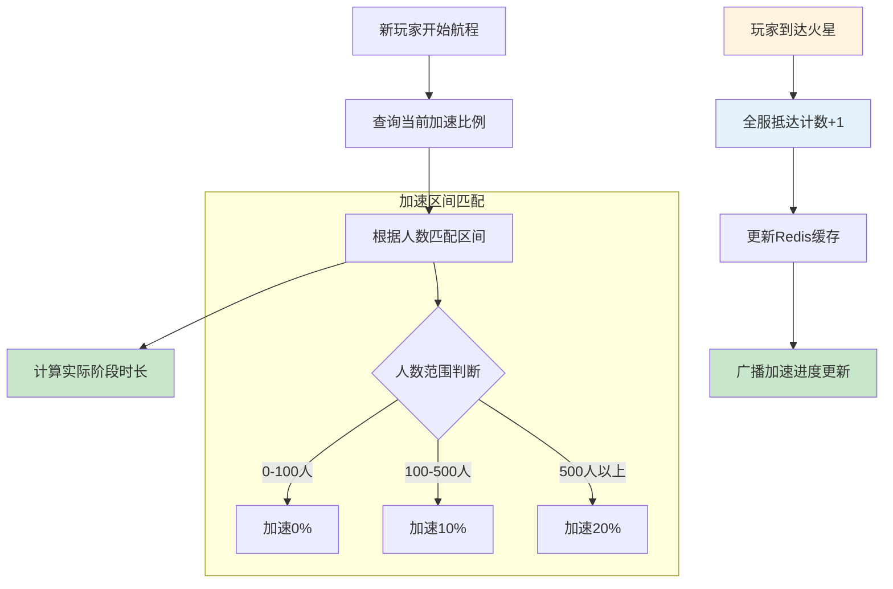

# 火星系统 - 服务端开发

## 概述

本文档描述火星系统（MarsOp, p038）的服务端开发实现，包括目录结构、消息处理器、数据存储等内容。

---

## 一、模块架构

### 1.1 目录结构

```
game_server/UserServer/src/NPUSServer/
├── NPUserMsgDispather/p038_MarsOp/
│   ├── MsgDealer_GC2GS_038_001_ReqStartToGoMars.java    # 开始前往火星
│   ├── MsgDealer_GC2GS_038_002_ReqArriveMarsStage.java  # 到达阶段
│   ├── MsgDealer_GC2GS_038_003_ReqSendDoneMarquee.java  # 发送跑马灯
│   ├── MsgDealer_GC2GS_038_004_ReqSendStageMsg.java     # 发送留言
│   ├── MsgDealer_GC2GS_038_005_ReqGetStageMsgList.java  # 获取留言列表
│   └── Write/
│       └── US2GCWriter_038_MarsOp.java                  # 协议写入器
└── NPUSUserMgr/UserComp/MarsComp/
    ├── MarsGoToMgr.java                                  # 航程管理器
    └── ...
```

### 1.2 架构图



---

## 二、消息处理器详解

### 2.1 MsgDealer_GC2GS_038_001_ReqStartToGoMars

**功能**: 处理玩家开始前往火星的请求

**处理流程**:



**完整代码**:

```java
public class MsgDealer_GC2GS_038_001_ReqStartToGoMars extends NPUserMsgDealer<GC2GS_038_001_ReqStartToGoMars>
{
    @Override
    protected void _dealMessage(_ANPUSUserBasicMsgItem _commiter, GC2GS_038_001_ReqStartToGoMars _msg)
    {
        NPUSUserData userData = _commiter.getUserData();
        if (null == userData)
            return;

        // 执行解锁操作
        NPPlayerContext context = NPPlayerContext.createNew(ENPGameEvent.MARS_GO_ROUTE_START_STAGE);
        Result result = userData.getMarsGoRouteComponent().startStage(context);

        if(!result.isSucc())
        {
            _commiter.commitFailRes(result.getCode());
            return;
        }

        _commiter.commitSucRes(US2GCWriter_038_MarsOp.make_001_RetStartToGoMars());

        // 日志数据
        Opt038001MarsRouteStartBO optBo = new Opt038001MarsRouteStartBO();
        _commiter.getUserData().logEvent(optBo, context);
    }
}
```

### 2.2 MsgDealer_GC2GS_038_002_ReqArriveMarsStage

**功能**: 处理玩家到达指定阶段的请求

**请求参数**:

| 参数名 | 类型 | 说明 |
|--------|------|------|
| stage | int | 目标阶段号 |

**处理逻辑**:



**伪代码**:

```java
public void dealMsg(GC2GS_038_002_ReqArriveMarsStage msg, NPUSUser user) {
    int targetStage = msg.getStage();

    // 1. 获取玩家航程数据
    PlayerMarsGoRoute route = marsDao.getRouteByCid(user.getCid());
    if (route == null || route.getStage() <= 0) {
        return; // 航程未开始
    }

    // 2. 检查阶段顺序
    if (targetStage != route.getStage() + 1) {
        return; // 阶段顺序错误
    }

    // 3. 检查当前阶段是否完成
    MarsGoRouteConfig config = configDao.getStageConfig(route.getStage());
    long stageEndTime = route.getStageStartMs() + config.getContinueSecs() * 1000;
    if (System.currentTimeMillis() < stageEndTime) {
        return; // 当前阶段时间未到
    }

    // 4. 发放阶段奖励
    giveStageReward(user, route.getStage());

    // 5. 更新阶段
    long nowMs = System.currentTimeMillis();
    route.setStage(targetStage);
    route.setStageStartMs(nowMs);
    route.setHasSentStageMsg(false);
    marsDao.update(route);

    // 6. 检查是否全部完成
    int maxStage = configDao.getMaxStage();
    if (targetStage > maxStage) {
        // 全部阶段完成
        user.sendMsg(new GS2GC_038_051_OnGoToAllStageDone());
    } else {
        // 推送新阶段到达
        user.sendMsg(new GS2GC_038_050_OnGoToStageArrived()
            .setStage(targetStage)
            .setStartMs(route.getArrivedMs())
            .setStageStartMs(nowMs));
    }
}
```

### 2.3 MsgDealer_GC2GS_038_003_ReqSendDoneMarquee

**功能**: 处理发送跑马灯请求

**处理逻辑**:

```java
public void dealMsg(GC2GS_038_003_ReqSendDoneMarquee msg, NPUSUser user) {
    PlayerMarsGoRoute route = marsDao.getRouteByCid(user.getCid());

    // 检查是否已发送过
    if (route == null || route.isSendDoneMarquee()) {
        return;
    }

    // 检查是否已到达火星
    if (!route.isArriveMars()) {
        return;
    }

    // 发送全服跑马灯
    marqueeService.sendMarsArrivalMarquee(user);

    // 标记已发送
    route.setSendDoneMarquee(true);
    marsDao.update(route);

    // 返回成功
    user.sendMsg(new GS2GC_038_003_RetSendDoneMarquee());
}
```

### 2.4 MsgDealer_GC2GS_038_004_ReqSendStageMsg

**功能**: 处理玩家发送阶段留言

**请求参数**:

| 参数名 | 类型 | 说明 |
|--------|------|------|
| stage | int | 当前阶段 |
| content | string | 留言内容 |

**处理逻辑**:



**伪代码**:

```java
public void dealMsg(GC2GS_038_004_ReqSendStageMsg msg, NPUSUser user) {
    // 1. 内容校验
    if (StringUtils.isBlank(msg.getContent()) ||
        msg.getContent().length() > MAX_MSG_LENGTH) {
        return;
    }

    // 2. 敏感词过滤
    String filteredContent = wordFilterService.filter(msg.getContent());

    // 3. 检查是否已发送过
    PlayerMarsGoRoute route = marsDao.getRouteByCid(user.getCid());
    if (route == null || route.isHasSentStageMsg()) {
        return;
    }

    // 4. 保存留言
    MarsGoRouteStageMsg stageMsg = new MarsGoRouteStageMsg();
    stageMsg.setCid(user.getCid());
    stageMsg.setStage(msg.getStage());
    stageMsg.setPlayerName(user.getPlayerName());
    stageMsg.setContent(filteredContent);
    stageMsg.setCreatedMs(System.currentTimeMillis());
    marsMsgDao.save(stageMsg);

    // 5. 标记已发送
    route.setHasSentStageMsg(true);
    marsDao.update(route);

    // 6. 返回成功
    user.sendMsg(new GS2GC_038_004_RetSendStageMsg());
}
```

### 2.5 MsgDealer_GC2GS_038_005_ReqGetStageMsgList

**功能**: 获取阶段留言列表

**请求参数**:

| 参数名 | 类型 | 说明 |
|--------|------|------|
| stage | int | 阶段号 |

**处理逻辑**:

```java
public void dealMsg(GC2GS_038_005_ReqGetStageMsgList msg, NPUSUser user) {
    int stage = msg.getStage();

    // 获取留言列表
    List<MarsGoRouteStageMsg> msgList = marsMsgDao.getMsgListByStage(stage, 50);

    // 构建响应
    GS2GC_038_005_RetGetStageMsgList response = new GS2GC_038_005_RetGetStageMsgList();
    response.setStage(stage);
    response.setMsgList(msgList);

    user.sendMsg(response);
}
```

---

## 三、数据存储

### 3.1 数据访问层

**DAO 接口设计**:

```java
public interface MarsGoRouteDao {
    // 根据玩家ID获取航程数据
    PlayerMarsGoRoute getRouteByCid(long cid);

    // 保存或更新航程数据
    void saveOrUpdate(PlayerMarsGoRoute route);

    // 更新航程数据
    void update(PlayerMarsGoRoute route);

    // 获取未完成的航程列表（用于定时任务）
    List<PlayerMarsGoRoute> getUnfinishedRoutes();
}

public interface MarsStageMsgDao {
    // 保存留言
    void save(MarsGoRouteStageMsg msg);

    // 获取指定阶段的留言列表
    List<MarsGoRouteStageMsg> getMsgListByStage(int stage, int limit);

    // 删除过期留言
    void deleteExpiredMsgs(long expireTimeMs);
}
```

### 3.2 数据实体

**PlayerMarsGoRoute**:

```java
public class PlayerMarsGoRoute {
    private long cid;                  // 玩家CID (主键)
    private int stage;                 // 当前阶段
    private long arrivedMs;            // 第一阶段到达时间
    private long stageStartMs;         // 当前阶段开始时间
    private boolean sendDoneMarquee;   // 是否发送跑马灯
    private boolean hasSentStageMsg;   // 当前阶段是否已发送留言

    // 业务方法
    public boolean isArriveMars() {
        return stage > 0 && stage > ConfigManager.getMaxStage();
    }

    public boolean isInRoute() {
        return stage > 0 && stage <= ConfigManager.getMaxStage();
    }
}
```

**MarsGoRouteStageMsg**:

```java
public class MarsGoRouteStageMsg {
    private long id;           // 自增主键
    private long cid;          // 发送者CID
    private int stage;         // 阶段号
    private String playerName; // 玩家名称
    private String content;    // 留言内容
    private long createdMs;    // 创建时间
}
```

---

## 四、定时任务

### 4.1 阶段完成检测

**任务描述**: 定时检测玩家阶段是否完成，推送通知



**代码实现**:

```java
@Scheduled(fixedRate = 60000) // 每分钟执行
public void checkStageComplete() {
    List<PlayerMarsGoRoute> routes = marsDao.getUnfinishedRoutes();
    long nowMs = System.currentTimeMillis();

    for (PlayerMarsGoRoute route : routes) {
        MarsGoRouteConfig config = configDao.getStageConfig(route.getStage());
        long endTime = route.getStageStartMs() + config.getContinueSecs() * 1000;

        if (nowMs >= endTime) {
            // 阶段完成，可以推送红点或通知
            pushService.pushStageReady(route.getCid(), route.getStage());
        }
    }
}
```

### 4.2 过期留言清理

```java
@Scheduled(cron = "0 0 3 * * ?") // 每天凌晨3点执行
public void cleanExpiredMsgs() {
    long expireTimeMs = System.currentTimeMillis() - 30L * 24 * 60 * 60 * 1000; // 30天前
    marsMsgDao.deleteExpiredMsgs(expireTimeMs);
}
```

---

## 五、初始化协议处理

### 5.1 GC2GS_002_072_ReqMarsGoRouteInit

**功能**: 玩家登录时获取火星航程初始化数据



**代码实现**:

```java
public void sendMarsGoRouteInit(NPUSUser user) {
    PlayerMarsGoRoute route = marsDao.getRouteByCid(user.getCid());

    GS2GC_002_072_RetMarsGoRouteInit msg = new GS2GC_002_072_RetMarsGoRouteInit();

    if (route == null || route.getStage() <= 0) {
        msg.setIsAllDone(false);
        msg.setStage(0);
        msg.setStartMs(0);
        msg.setStageStartMs(0);
    } else {
        int maxStage = configDao.getMaxStage();
        msg.setIsAllDone(route.getStage() > maxStage);
        msg.setStage(route.getStage());
        msg.setStartMs(route.getArrivedMs());
        msg.setStageStartMs(route.getStageStartMs());
    }

    user.sendMsg(msg);
}
```

---

## 六、配置文件路径

| 类型 | 路径 |
|------|------|
| 服务端协议定义 | `game_server/ClientProtocol/GC2GS/p038_MarsOp/` |
| 服务端响应定义 | `game_server/ServerProtocol/src/GS2GC/p038_MarsOp/` |
| 数据库定义 | `game_server/DBTool/source_db/UserServer/player_mars_go_route.py` |
| 消息处理器 | `game_server/UserServer/src/NPUSServer/NPUserMsgDispather/p038_MarsOp/` |

---

## 七、错误码定义

| 错误码 | 常量名 | 说明 | 处理建议 |
|--------|--------|------|----------|
| 38001 | MARS_ALREADY_IN_ROUTE | 航程已在进行中 | 检查航程状态 |
| 38002 | MARS_ROUTE_NOT_STARTED | 航程未开始 | 先调用开始航程接口 |
| 38003 | MARS_PRE_CONDITION_NOT_MET | 阶段条件不满足 | 检查前置条件 |
| 38004 | MARS_STAGE_TIME_NOT_REACHED | 阶段时间未到 | 等待阶段时间到达 |
| 38005 | MARS_MSG_ALREADY_SENT | 留言已发送 | 当前阶段只能留言一次 |

---

## 八、服务端推送机制

### 8.1 推送时机

| 推送协议 | 触发时机 | 推送对象 |
|----------|----------|----------|
| GS2GC_038_050_OnGoToStageArrived | 开始航程/到达下一阶段 | 单个玩家 |
| GS2GC_038_051_OnGoToAllStageDone | 完成所有阶段 | 单个玩家 |

### 8.2 推送代码示例

```java
// 推送到达新阶段
public void pushStageArrived(long cid, int stage, long startMs, long stageStartMs) {
    GS2GC_038_050_OnGoToStageArrived msg = new GS2GC_038_050_OnGoToStageArrived();
    msg.setStage(stage);
    msg.setStartMs(startMs);
    msg.setStageStartMs(stageStartMs);

    userSessionManager.sendMsgToUser(cid, msg);
}

// 推送航程完成
public void pushAllStageDone(long cid) {
    GS2GC_038_051_OnGoToAllStageDone msg = new GS2GC_038_051_OnGoToAllStageDone();
    userSessionManager.sendMsgToUser(cid, msg);
}
```

---

## 九、业务服务层

### 9.1 MarsGoRouteService - 航程服务

**功能**: 提供航程相关的核心业务逻辑

```java
@Service
public class MarsGoRouteService {

    @Autowired
    private MarsGoRouteDao marsGoRouteDao;

    @Autowired
    private RefMarsGoRoute.Ref refMarsGoRoute;

    @Autowired
    private ItemService itemService;

    /**
     * 开始航程
     */
    @Transactional
    public Result startRoute(NPUSUserData userData, NPPlayerContext context) {
        // 1. 检查是否已在航程中
        PlayerMarsGoRoute route = marsGoRouteDao.getRouteByCid(userData.getCid());
        if (route != null && route.getStage() > 0) {
            return Result.fail(MarsErr.MARS_GO_ROUTE_ALREADY_IN_ROUTE);
        }

        // 2. 检查功能解锁
        if (!isFuncUnlock(userData)) {
            return Result.fail(MarsErr.MARS_NOT_UNLOCK);
        }

        // 3. 创建航程记录
        long nowMs = System.currentTimeMillis();
        route = new PlayerMarsGoRoute();
        route.setCid(userData.getCid());
        route.setStage(1);
        route.setArrivedMs(nowMs);
        route.setStageStartMs(nowMs);
        route.setSendDoneMarquee(false);
        route.setHasSentStageMsg(false);

        marsGoRouteDao.saveOrUpdate(route);

        return Result.success();
    }

    /**
     * 到达下一阶段
     */
    @Transactional
    public Result arriveNextStage(NPUSUserData userData, int targetStage, NPPlayerContext context) {
        // 1. 获取航程数据
        PlayerMarsGoRoute route = marsGoRouteDao.getRouteByCid(userData.getCid());
        if (route == null || route.getStage() <= 0) {
            return Result.fail(MarsErr.MARS_ROUTE_NOT_STARTED);
        }

        // 2. 检查阶段顺序
        if (targetStage != route.getStage() + 1) {
            return Result.fail(MarsErr.MARS_GO_ROUTE_NEXT_ERROR);
        }

        // 3. 检查阶段时间
        RefMarsGoRoute stageConfig = refMarsGoRoute.getByStageId(route.getStage());
        long actualDuration = calculateActualDuration(stageConfig);
        long endTime = route.getStageStartMs() + actualDuration;
        if (System.currentTimeMillis() < endTime) {
            return Result.fail(MarsErr.MARS_GO_ROUTE_NEXT_SECS_NOT_FULL);
        }

        // 4. 发放当前阶段奖励
        giveStageReward(userData, stageConfig, context);

        // 5. 更新阶段
        long nowMs = System.currentTimeMillis();
        route.setStage(targetStage);
        route.setStageStartMs(nowMs);
        route.setHasSentStageMsg(false);
        marsGoRouteDao.update(route);

        return Result.success();
    }

    /**
     * 计算实际阶段时长（考虑全服加速）
     */
    private long calculateActualDuration(RefMarsGoRoute config) {
        long baseDuration = config.continue_secs * 1000;
        int reducePer = getGlobalArriveReducePer();
        if (reducePer > 0) {
            baseDuration = baseDuration * (10000 - reducePer) / 10000;
        }
        return baseDuration;
    }

    /**
     * 发放阶段奖励
     */
    private void giveStageReward(NPUSUserData userData, RefMarsGoRoute config, NPPlayerContext context) {
        if (config.arrive_item_list != null && !config.arrive_item_list.isEmpty()) {
            userData.gainItemList(config.arrive_item_list, context);
        }
    }

    /**
     * 获取全服抵达加速比例
     */
    public int getGlobalArriveReducePer() {
        long arrivedCount = getGlobalArrivedCount();
        List<WCGTripleLong> reduceList = RefGeneral.Ref().mars_go_route_arrive_reduce_list;

        for (WCGTripleLong triple : reduceList) {
            long minCount = triple.getFirst();
            long maxCount = triple.getSecond();
            int reducePer = triple.getThird();

            boolean minMatch = (minCount == -1 || arrivedCount >= minCount);
            boolean maxMatch = (maxCount == -1 || arrivedCount < maxCount);

            if (minMatch && maxMatch) {
                return reducePer;
            }
        }
        return 0;
    }

    /**
     * 获取全服已抵达人数
     */
    public long getGlobalArrivedCount() {
        String cacheKey = "mars:arrived_count";
        Long count = redisTemplate.opsForValue().get(cacheKey);
        if (count != null) {
            return count;
        }

        int maxStage = refMarsGoRoute.getMaxStage();
        count = marsGoRouteDao.countArrivedPlayers(maxStage);

        redisTemplate.opsForValue().set(cacheKey, count, 5, TimeUnit.MINUTES);
        return count;
    }

    /**
     * 检查功能是否解锁
     */
    private boolean isFuncUnlock(NPUSUserData userData) {
        return NPPlayerConditionDealerMgr.IsEnable(
            RefGeneral.Ref().mars_go_route_unlock_id, userData, null);
    }
}
```

### 9.2 MarsStageMsgService - 留言服务

```java
@Service
public class MarsStageMsgService {

    @Autowired
    private MarsStageMsgDao marsStageMsgDao;

    @Autowired
    private MarsGoRouteDao marsGoRouteDao;

    @Autowired
    private WordFilterService wordFilterService;

    private static final int MAX_MSG_LENGTH = 200;

    /**
     * 发送阶段留言
     */
    @Transactional
    public Result sendStageMsg(NPUSUserData userData, int stage, String content) {
        // 1. 内容校验
        if (StringUtils.isBlank(content)) {
            return Result.fail(CommErr.PARAM_ERROR);
        }
        if (content.length() > MAX_MSG_LENGTH) {
            return Result.fail(CommErr.PARAM_TOO_LONG);
        }

        // 2. 敏感词过滤
        String filteredContent = wordFilterService.filter(content);

        // 3. 检查航程状态
        PlayerMarsGoRoute route = marsGoRouteDao.getRouteByCid(userData.getCid());
        if (route == null || route.getStage() != stage) {
            return Result.fail(MarsErr.MARS_GO_ROUTE_STAGE_NOT_ALLOW_MSG);
        }

        // 4. 检查是否已发送
        if (route.isHasSentStageMsg()) {
            return Result.fail(MarsErr.MARS_GO_ROUTE_ALREADY_SENT_STAGE_MSG);
        }

        // 5. 保存留言
        MarsGoRouteStageMsg stageMsg = new MarsGoRouteStageMsg();
        stageMsg.setCid(userData.getCid());
        stageMsg.setStage(stage);
        stageMsg.setPlayerName(userData.getPlayerName());
        stageMsg.setContent(filteredContent);
        stageMsg.setCreatedMs(System.currentTimeMillis());
        marsStageMsgDao.save(stageMsg);

        // 6. 更新航程状态
        route.setHasSentStageMsg(true);
        marsGoRouteDao.update(route);

        return Result.success();
    }

    /**
     * 获取阶段留言列表
     */
    public List<Mars_GoRoute_StageMsg> getStageMsgList(int stage, int limit) {
        // 尝试从缓存获取
        String cacheKey = "mars:stage_msg:" + stage;
        List<Mars_GoRoute_StageMsg> cached = redisTemplate.opsForValue().get(cacheKey);
        if (cached != null) {
            return cached;
        }

        // 从数据库获取
        List<MarsGoRouteStageMsg> dbList = marsStageMsgDao.getMsgListByStage(stage, limit);
        List<Mars_GoRoute_StageMsg> result = new ArrayList<>();
        for (MarsGoRouteStageMsg dbMsg : dbList) {
            result.add(convertToProto(dbMsg));
        }

        // 缓存结果
        redisTemplate.opsForValue().set(cacheKey, result, 1, TimeUnit.MINUTES);

        return result;
    }

    /**
     * 转换为协议对象
     */
    private Mars_GoRoute_StageMsg convertToProto(MarsGoRouteStageMsg dbMsg) {
        Mars_GoRoute_StageMsg msg = new Mars_GoRoute_StageMsg();
        msg.playerName = dbMsg.getPlayerName();
        msg.content = dbMsg.getContent();
        msg.timeMs = dbMsg.getCreatedMs();
        return msg;
    }
}
```

### 9.3 MarqueeService - 跑马灯服务

```java
@Service
public class MarqueeService {

    @Autowired
    private MarsGoRouteDao marsGoRouteDao;

    @Autowired
    private MarqueeSender marqueeSender;

    /**
     * 发送火星抵达跑马灯
     */
    @Transactional
    public Result sendMarsArrivalMarquee(NPUSUserData userData) {
        // 1. 检查航程状态
        PlayerMarsGoRoute route = marsGoRouteDao.getRouteByCid(userData.getCid());
        if (route == null || !route.isArriveMars()) {
            return Result.fail(MarsErr.MARS_ROUTE_NOT_STARTED);
        }

        // 2. 检查是否已发送
        if (route.isSendDoneMarquee()) {
            return Result.fail(CommErr.ALREADY_DONE);
        }

        // 3. 发送跑马灯
        long marqueeId = RefGeneral.Ref().mars_go_to_finish_marquee_id;
        if (marqueeId > 0) {
            marqueeSender.sendMarquee(marqueeId, userData.getPlayerName());
        }

        // 4. 标记已发送
        route.setSendDoneMarquee(true);
        marsGoRouteDao.update(route);

        return Result.success();
    }
}
```

---

## 十、数据访问层实现

### 10.1 MarsGoRouteDaoImpl

```java
@Repository
public class MarsGoRouteDaoImpl implements MarsGoRouteDao {

    @Autowired
    private JdbcTemplate jdbcTemplate;

    @Autowired
    private RedisTemplate<String, Object> redisTemplate;

    private static final String TABLE_NAME = "player_mars_go_route";

    @Override
    public PlayerMarsGoRoute getRouteByCid(long cid) {
        // 先从缓存获取
        String cacheKey = "mars:route:" + cid;
        PlayerMarsGoRoute cached = (PlayerMarsGoRoute) redisTemplate.opsForValue().get(cacheKey);
        if (cached != null) {
            return cached;
        }

        // 从数据库获取
        String sql = "SELECT * FROM " + TABLE_NAME + " WHERE cid = ?";
        List<PlayerMarsGoRoute> list = jdbcTemplate.query(sql,
            new Object[]{cid},
            new MarsGoRouteRowMapper());

        PlayerMarsGoRoute route = list.isEmpty() ? null : list.get(0);

        // 缓存结果
        if (route != null) {
            redisTemplate.opsForValue().set(cacheKey, route, 30, TimeUnit.MINUTES);
        }

        return route;
    }

    @Override
    public void saveOrUpdate(PlayerMarsGoRoute route) {
        String sql = "INSERT INTO " + TABLE_NAME + " " +
            "(cid, stage, arrivedMs, stageStartMs, sendDoneMarquee, hasSentStageMsg) " +
            "VALUES (?, ?, ?, ?, ?, ?) " +
            "ON DUPLICATE KEY UPDATE " +
            "stage = VALUES(stage), arrivedMs = VALUES(arrivedMs), " +
            "stageStartMs = VALUES(stageStartMs), sendDoneMarquee = VALUES(sendDoneMarquee), " +
            "hasSentStageMsg = VALUES(hasSentStageMsg)";

        jdbcTemplate.update(sql,
            route.getCid(),
            route.getStage(),
            route.getArrivedMs(),
            route.getStageStartMs(),
            route.isSendDoneMarquee() ? 1 : 0,
            route.isHasSentStageMsg() ? 1 : 0);

        // 更新缓存
        String cacheKey = "mars:route:" + route.getCid();
        redisTemplate.opsForValue().set(cacheKey, route, 30, TimeUnit.MINUTES);
    }

    @Override
    public void update(PlayerMarsGoRoute route) {
        String sql = "UPDATE " + TABLE_NAME + " SET " +
            "stage = ?, arrivedMs = ?, stageStartMs = ?, " +
            "sendDoneMarquee = ?, hasSentStageMsg = ? WHERE cid = ?";

        jdbcTemplate.update(sql,
            route.getStage(),
            route.getArrivedMs(),
            route.getStageStartMs(),
            route.isSendDoneMarquee() ? 1 : 0,
            route.isHasSentStageMsg() ? 1 : 0,
            route.getCid());

        // 更新缓存
        String cacheKey = "mars:route:" + route.getCid();
        redisTemplate.opsForValue().set(cacheKey, route, 30, TimeUnit.MINUTES);
    }

    @Override
    public List<PlayerMarsGoRoute> getUnfinishedRoutes() {
        String sql = "SELECT * FROM " + TABLE_NAME + " WHERE stage > 0";
        return jdbcTemplate.query(sql, new MarsGoRouteRowMapper());
    }

    @Override
    public long countArrivedPlayers(int maxStage) {
        String sql = "SELECT COUNT(*) FROM " + TABLE_NAME + " WHERE stage > ?";
        Long count = jdbcTemplate.queryForObject(sql, Long.class, maxStage);
        return count != null ? count : 0;
    }

    /**
     * 行映射器
     */
    private static class MarsGoRouteRowMapper implements RowMapper<PlayerMarsGoRoute> {
        @Override
        public PlayerMarsGoRoute mapRow(ResultSet rs, int rowNum) throws SQLException {
            PlayerMarsGoRoute route = new PlayerMarsGoRoute();
            route.setCid(rs.getLong("cid"));
            route.setStage(rs.getInt("stage"));
            route.setArrivedMs(rs.getLong("arrivedMs"));
            route.setStageStartMs(rs.getLong("stageStartMs"));
            route.setSendDoneMarquee(rs.getBoolean("sendDoneMarquee"));
            route.setHasSentStageMsg(rs.getBoolean("hasSentStageMsg"));
            return route;
        }
    }
}
```

### 10.2 MarsStageMsgDaoImpl

```java
@Repository
public class MarsStageMsgDaoImpl implements MarsStageMsgDao {

    @Autowired
    private JdbcTemplate jdbcTemplate;

    private static final String TABLE_NAME = "mars_go_route_stage_msg";

    @Override
    public void save(MarsGoRouteStageMsg msg) {
        String sql = "INSERT INTO " + TABLE_NAME + " " +
            "(cid, stage, playerName, content, createdMs) VALUES (?, ?, ?, ?, ?)";
        jdbcTemplate.update(sql,
            msg.getCid(),
            msg.getStage(),
            msg.getPlayerName(),
            msg.getContent(),
            msg.getCreatedMs());
    }

    @Override
    public List<MarsGoRouteStageMsg> getMsgListByStage(int stage, int limit) {
        String sql = "SELECT * FROM " + TABLE_NAME + " " +
            "WHERE stage = ? ORDER BY createdMs DESC LIMIT ?";
        return jdbcTemplate.query(sql,
            new Object[]{stage, limit},
            new MarsStageMsgRowMapper());
    }

    @Override
    public void deleteExpiredMsgs(long expireTimeMs) {
        String sql = "DELETE FROM " + TABLE_NAME + " WHERE createdMs < ?";
        jdbcTemplate.update(sql, expireTimeMs);
    }

    /**
     * 行映射器
     */
    private static class MarsStageMsgRowMapper implements RowMapper<MarsGoRouteStageMsg> {
        @Override
        public MarsGoRouteStageMsg mapRow(ResultSet rs, int rowNum) throws SQLException {
            MarsGoRouteStageMsg msg = new MarsGoRouteStageMsg();
            msg.setId(rs.getLong("id"));
            msg.setCid(rs.getLong("cid"));
            msg.setStage(rs.getInt("stage"));
            msg.setPlayerName(rs.getString("playerName"));
            msg.setContent(rs.getString("content"));
            msg.setCreatedMs(rs.getLong("createdMs"));
            return msg;
        }
    }
}
```

---

## 十一、配置服务

### 11.1 MarsConfigService

```java
@Service
public class MarsConfigService {

    /**
     * 获取最大阶段号
     */
    public int getMaxStage() {
        return RefMarsGoRoute.Ref().getMaxStage();
    }

    /**
     * 获取阶段配置
     */
    public RefMarsGoRoute getStageConfig(int stage) {
        return RefMarsGoRoute.Ref().getByStageId(stage);
    }

    /**
     * 获取所有阶段配置
     */
    public List<RefMarsGoRoute> getAllStageConfigs() {
        return RefMarsGoRoute.Ref().getAll();
    }

    /**
     * 获取日志配置
     */
    public RefMarsGoRouteLog getLogConfig(long logId) {
        return RefMarsGoRouteLog.Ref().getRef(logId);
    }

    /**
     * 获取阶段日志列表
     */
    public List<RefMarsGoRouteLog> getStageLogs(int stage) {
        RefMarsGoRoute stageConfig = getStageConfig(stage);
        if (stageConfig == null || stageConfig.log_id_list == null) {
            return Collections.emptyList();
        }

        List<RefMarsGoRouteLog> logs = new ArrayList<>();
        for (Long logId : stageConfig.log_id_list) {
            RefMarsGoRouteLog log = getLogConfig(logId);
            if (log != null) {
                logs.add(log);
            }
        }

        // 按触发时间排序
        logs.sort((a, b) -> Integer.compare(a.trigger_offset_secs, b.trigger_offset_secs));
        return logs;
    }

    /**
     * 获取阶段奖励列表
     */
    public List<NPCommonCostItem> getStageRewards(int stage) {
        RefMarsGoRoute stageConfig = getStageConfig(stage);
        if (stageConfig == null || stageConfig.arrive_item_list == null) {
            return Collections.emptyList();
        }
        return stageConfig.arrive_item_list;
    }

    /**
     * 计算阶段时长（考虑加速）
     */
    public long calculateStageDuration(int stage, int reducePer) {
        RefMarsGoRoute config = getStageConfig(stage);
        if (config == null) {
            return 0;
        }

        long duration = config.continue_secs * 1000;
        if (reducePer > 0) {
            duration = duration * (10000 - reducePer) / 10000;
        }
        return duration;
    }

    /**
     * 校验阶段配置
     */
    public void validateConfigs() {
        List<RefMarsGoRoute> routes = getAllStageConfigs();

        // 按stage_id排序
        routes.sort((a, b) -> Long.compare(a.stage_id, b.stage_id));

        // 检查第一阶段
        if (routes.isEmpty() || routes.get(0).stage_id != 1) {
            throw new ConfigException("缺少第一阶段配置");
        }

        // 检查阶段连续性
        for (int i = 1; i < routes.size(); i++) {
            if (routes.get(i).stage_id != routes.get(i-1).stage_id + 1) {
                throw new ConfigException("阶段不连续: " +
                    routes.get(i-1).stage_id + " -> " + routes.get(i).stage_id);
            }
        }

        // 检查日志关联
        for (RefMarsGoRoute route : routes) {
            for (Long logId : route.log_id_list) {
                if (!RefMarsGoRouteLog.Ref().hasRef(logId)) {
                    throw new ConfigException("阶段 " + route.stage_id +
                        " 引用了不存在的日志ID: " + logId);
                }
            }
        }
    }
}
```

---

## 十二、全服加速机制实现

### 12.1 全服抵达计数服务

```java
@Service
public class MarsGlobalService {

    @Autowired
    private RedisTemplate<String, Object> redisTemplate;

    @Autowired
    private MarsGoRouteDao marsGoRouteDao;

    private static final String ARRIVED_COUNT_KEY = "mars:arrived_count";
    private static final String LAST_UPDATE_KEY = "mars:arrived_last_update";

    /**
     * 获取全服抵达人数
     */
    public long getGlobalArrivedCount() {
        // 从缓存获取
        Object cached = redisTemplate.opsForValue().get(ARRIVED_COUNT_KEY);
        if (cached != null) {
            return (Long) cached;
        }

        // 从数据库统计
        int maxStage = RefMarsGoRoute.Ref().getMaxStage();
        long count = marsGoRouteDao.countArrivedPlayers(maxStage);

        // 缓存结果
        redisTemplate.opsForValue().set(ARRIVED_COUNT_KEY, count, 5, TimeUnit.MINUTES);

        return count;
    }

    /**
     * 玩家抵达火星时更新计数
     */
    public void onPlayerArrived() {
        redisTemplate.opsForValue().increment(ARRIVED_COUNT_KEY);

        // 记录最后更新时间
        redisTemplate.opsForValue().set(LAST_UPDATE_KEY, System.currentTimeMillis());
    }

    /**
     * 获取当前加速比例
     */
    public int getCurrentReducePer() {
        long count = getGlobalArrivedCount();
        return calculateReducePer(count);
    }

    /**
     * 根据人数计算加速比例
     */
    private int calculateReducePer(long count) {
        List<WCGTripleLong> reduceList = RefGeneral.Ref().mars_go_route_arrive_reduce_list;

        for (WCGTripleLong triple : reduceList) {
            long minCount = triple.getFirst();
            long maxCount = triple.getSecond();
            int reducePer = triple.getThird();

            boolean minMatch = (minCount == -1 || count >= minCount);
            boolean maxMatch = (maxCount == -1 || count < maxCount);

            if (minMatch && maxMatch) {
                return reducePer;
            }
        }

        return 0;
    }

    /**
     * 获取加速进度信息
     */
    public MarsAccelerationInfo getAccelerationInfo() {
        MarsAccelerationInfo info = new MarsAccelerationInfo();
        info.currentCount = getGlobalArrivedCount();
        info.currentReducePer = getCurrentReducePer();

        // 计算下一档信息
        List<WCGTripleLong> reduceList = RefGeneral.Ref().mars_go_route_arrive_reduce_list;
        for (WCGTripleLong triple : reduceList) {
            if (triple.getThird() > info.currentReducePer) {
                info.nextThreshold = triple.getFirst();
                info.nextReducePer = triple.getThird();
                break;
            }
        }

        return info;
    }
}

/**
 * 加速信息结构
 */
public class MarsAccelerationInfo {
    public long currentCount;      // 当前抵达人数
    public int currentReducePer;   // 当前加速比例
    public long nextThreshold;     // 下一档阈值
    public int nextReducePer;      // 下一档加速比例
}
```

### 12.2 加速机制流程图



---

## 十三、日志与埋点

### 13.1 服务端日志服务

```java
@Service
public class MarsLogService {

    @Autowired
    private LogCollector logCollector;

    /**
     * 记录航程开始日志
     */
    public void logRouteStart(long cid, NPPlayerContext context) {
        Opt038001MarsRouteStartBO log = new Opt038001MarsRouteStartBO();
        log.setCid(cid);
        log.setStartTime(System.currentTimeMillis());
        logCollector.collect(log, context);
    }

    /**
     * 记录阶段完成日志
     */
    public void logStageComplete(long cid, int stage, NPPlayerContext context) {
        Opt038002MarsStageCompleteBO log = new Opt038002MarsStageCompleteBO();
        log.setCid(cid);
        log.setStage(stage);
        log.setCompleteTime(System.currentTimeMillis());
        logCollector.collect(log, context);
    }

    /**
     * 记录抵达火星日志
     */
    public void logMarsArrival(long cid, NPPlayerContext context) {
        Opt038003MarsArrivalBO log = new Opt038003MarsArrivalBO();
        log.setCid(cid);
        log.setArrivalTime(System.currentTimeMillis());

        // 记录全服抵达人数
        long globalCount = marsGlobalService.getGlobalArrivedCount();
        log.setGlobalArrivedCount(globalCount);

        logCollector.collect(log, context);
    }

    /**
     * 记录留言日志
     */
    public void logStageMessage(long cid, int stage, String content, NPPlayerContext context) {
        Opt038004MarsStageMsgBO log = new Opt038004MarsStageMsgBO();
        log.setCid(cid);
        log.setStage(stage);
        log.setMsgLength(content.length());
        logCollector.collect(log, context);
    }
}
```

---

## 十四、异常处理

### 14.1 异常处理策略

```java
@ControllerAdvice
public class MarsExceptionHandler {

    private static final Logger logger = LoggerFactory.getLogger(MarsExceptionHandler.class);

    /**
     * 处理火星模块业务异常
     */
    @ExceptionHandler(MarsBusinessException.class)
    public ResponseEntity<ErrorResponse> handleMarsException(MarsBusinessException e) {
        logger.warn("火星模块业务异常: cid={}, code={}, msg={}",
            e.getCid(), e.getCode(), e.getMessage());

        ErrorResponse response = new ErrorResponse();
        response.setCode(e.getCode());
        response.setMsg(e.getMessage());

        return ResponseEntity.ok(response);
    }

    /**
     * 处理配置异常
     */
    @ExceptionHandler(ConfigException.class)
    public ResponseEntity<ErrorResponse> handleConfigException(ConfigException e) {
        logger.error("火星模块配置异常: {}", e.getMessage());

        ErrorResponse response = new ErrorResponse();
        response.setCode(CommErr.CONFIG_ERROR.getCode());
        response.setMsg("系统配置错误");

        return ResponseEntity.status(500).body(response);
    }

    /**
     * 处理数据库异常
     */
    @ExceptionHandler(DataAccessException.class)
    public ResponseEntity<ErrorResponse> handleDataAccessException(DataAccessException e) {
        logger.error("火星模块数据库异常", e);

        ErrorResponse response = new ErrorResponse();
        response.setCode(CommErr.DB_ERROR.getCode());
        response.setMsg("系统繁忙，请稍后重试");

        return ResponseEntity.status(500).body(response);
    }
}
```

---

## 十五、性能优化

### 15.1 缓存策略

```java
@Service
public class MarsCacheService {

    @Autowired
    private RedisTemplate<String, Object> redisTemplate;

    // 缓存键前缀
    private static final String ROUTE_KEY_PREFIX = "mars:route:";
    private static final String STAGE_MSG_KEY_PREFIX = "mars:stage_msg:";
    private static final String ARRIVED_COUNT_KEY = "mars:arrived_count";

    // 缓存过期时间
    private static final long ROUTE_CACHE_TTL = 30;      // 30分钟
    private static final long MSG_CACHE_TTL = 1;          // 1分钟
    private static final long COUNT_CACHE_TTL = 5;        // 5分钟

    /**
     * 获取航程数据（带缓存）
     */
    public PlayerMarsGoRoute getRouteWithCache(long cid, Supplier<PlayerMarsGoRoute> loader) {
        String key = ROUTE_KEY_PREFIX + cid;
        PlayerMarsGoRoute route = (PlayerMarsGoRoute) redisTemplate.opsForValue().get(key);

        if (route != null) {
            return route;
        }

        route = loader.get();
        if (route != null) {
            redisTemplate.opsForValue().set(key, route, ROUTE_CACHE_TTL, TimeUnit.MINUTES);
        }

        return route;
    }

    /**
     * 失效航程缓存
     */
    public void invalidateRouteCache(long cid) {
        String key = ROUTE_KEY_PREFIX + cid;
        redisTemplate.delete(key);
    }

    /**
     * 失效留言缓存
     */
    public void invalidateStageMsgCache(int stage) {
        String key = STAGE_MSG_KEY_PREFIX + stage;
        redisTemplate.delete(key);
    }
}
```

### 15.2 批量操作优化

```java
@Service
public class MarsBatchService {

    @Autowired
    private JdbcTemplate jdbcTemplate;

    /**
     * 批量更新航程数据
     */
    public void batchUpdateRoutes(List<PlayerMarsGoRoute> routes) {
        String sql = "UPDATE player_mars_go_route SET " +
            "stage = ?, arrivedMs = ?, stageStartMs = ?, " +
            "sendDoneMarquee = ?, hasSentStageMsg = ? WHERE cid = ?";

        jdbcTemplate.batchUpdate(sql, routes, routes.size(),
            (ps, route) -> {
                ps.setInt(1, route.getStage());
                ps.setLong(2, route.getArrivedMs());
                ps.setLong(3, route.getStageStartMs());
                ps.setBoolean(4, route.isSendDoneMarquee());
                ps.setBoolean(5, route.isHasSentStageMsg());
                ps.setLong(6, route.getCid());
            });
    }
}
```

---

*文档生成时间: 2026-04-12*
*文档版本: v2.1.0*
