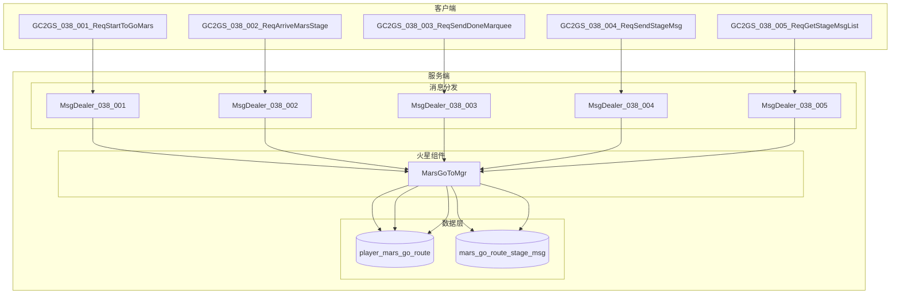
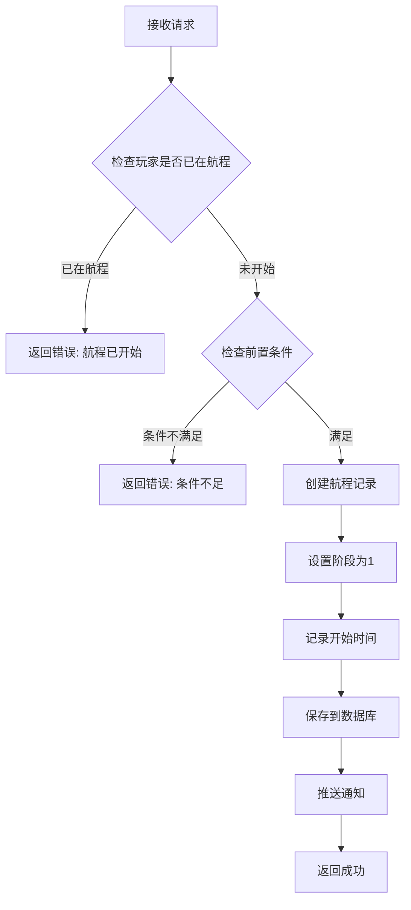

# 火星系统 - 服务端开发

## 概述

本文档描述火星系统（MarsOp, p038）的服务端开发实现，包括目录结构、消息处理器、数据存储等内容。

---

## 一、模块架构

### 1.1 目录结构

```
game_server/UserServer/src/NPUSServer/
├── NPUserMsgDispather/p038_MarsOp/
│   ├── MsgDealer_GC2GS_038_001_ReqStartToGoMars.java    # 开始前往火星
│   ├── MsgDealer_GC2GS_038_002_ReqArriveMarsStage.java  # 到达阶段
│   ├── MsgDealer_GC2GS_038_003_ReqSendDoneMarquee.java  # 发送跑马灯
│   ├── MsgDealer_GC2GS_038_004_ReqSendStageMsg.java     # 发送留言
│   └── MsgDealer_GC2GS_038_005_ReqGetStageMsgList.java  # 获取留言列表
└── NPUSUserMgr/UserComp/MarsComp/
    ├── MarsGoToMgr.java                                  # 航程管理器
    └── ...
```

### 1.2 架构图



---

## 二、消息处理器

### 2.1 MsgDealer_GC2GS_038_001_ReqStartToGoMars

**功能**: 处理玩家开始前往火星的请求

**处理流程**:



**伪代码**:

```java
public void dealMsg(GC2GS_038_001_ReqStartToGoMars msg, NPUSUser user) {
    // 1. 获取玩家火星航程数据
    PlayerMarsGoRoute route = marsDao.getRouteByCid(user.getCid());

    // 2. 检查是否已在航程中
    if (route != null && route.getStage() > 0) {
        user.sendMsg(new GS2GC_038_001_RetStartToGoMars()
            .setErrorCode(ErrorCode.MARS_ALREADY_IN_ROUTE));
        return;
    }

    // 3. 检查前置条件
    if (!checkPreCondition(user)) {
        user.sendMsg(new GS2GC_038_001_RetStartToGoMars()
            .setErrorCode(ErrorCode.MARS_PRE_CONDITION_NOT_MET));
        return;
    }

    // 4. 创建航程记录
    long nowMs = System.currentTimeMillis();
    if (route == null) {
        route = new PlayerMarsGoRoute();
        route.setCid(user.getCid());
    }
    route.setStage(1);
    route.setArrivedMs(nowMs);
    route.setStageStartMs(nowMs);
    route.setSendDoneMarquee(false);
    route.setHasSentStageMsg(false);

    // 5. 保存数据
    marsDao.saveOrUpdate(route);

    // 6. 推送到达阶段通知
    user.sendMsg(new GS2GC_038_050_OnGoToStageArrived()
        .setStage(1)
        .setStartMs(nowMs)
        .setStageStartMs(nowMs));

    // 7. 返回成功
    user.sendMsg(new GS2GC_038_001_RetStartToGoMars());
}
```

### 2.2 MsgDealer_GC2GS_038_002_ReqArriveMarsStage

**功能**: 处理玩家到达指定阶段的请求

**请求参数**:

| 参数名 | 类型 | 说明 |
|--------|------|------|
| stage | int | 目标阶段号 |

**处理逻辑**:

```java
public void dealMsg(GC2GS_038_002_ReqArriveMarsStage msg, NPUSUser user) {
    int targetStage = msg.getStage();

    // 1. 获取玩家航程数据
    PlayerMarsGoRoute route = marsDao.getRouteByCid(user.getCid());
    if (route == null || route.getStage() <= 0) {
        return; // 航程未开始
    }

    // 2. 检查阶段顺序
    if (targetStage != route.getStage() + 1) {
        return; // 阶段顺序错误
    }

    // 3. 检查当前阶段是否完成
    MarsGoRouteConfig config = configDao.getStageConfig(route.getStage());
    long stageEndTime = route.getStageStartMs() + config.getContinueSecs() * 1000;
    if (System.currentTimeMillis() < stageEndTime) {
        return; // 当前阶段时间未到
    }

    // 4. 发放阶段奖励
    giveStageReward(user, route.getStage());

    // 5. 更新阶段
    long nowMs = System.currentTimeMillis();
    route.setStage(targetStage);
    route.setStageStartMs(nowMs);
    route.setHasSentStageMsg(false);
    marsDao.update(route);

    // 6. 检查是否全部完成
    int maxStage = configDao.getMaxStage();
    if (targetStage > maxStage) {
        // 全部阶段完成
        user.sendMsg(new GS2GC_038_051_OnGoToAllStageDone());
    } else {
        // 推送新阶段到达
        user.sendMsg(new GS2GC_038_050_OnGoToStageArrived()
            .setStage(targetStage)
            .setStartMs(route.getArrivedMs())
            .setStageStartMs(nowMs));
    }
}
```

### 2.3 MsgDealer_GC2GS_038_004_ReqSendStageMsg

**功能**: 处理玩家发送阶段留言

**请求参数**:

| 参数名 | 类型 | 说明 |
|--------|------|------|
| stage | int | 当前阶段 |
| content | string | 留言内容 |

**处理逻辑**:

```java
public void dealMsg(GC2GS_038_004_ReqSendStageMsg msg, NPUSUser user) {
    // 1. 内容校验
    if (StringUtils.isBlank(msg.getContent()) ||
        msg.getContent().length() > MAX_MSG_LENGTH) {
        return;
    }

    // 2. 敏感词过滤
    String filteredContent = wordFilterService.filter(msg.getContent());

    // 3. 检查是否已发送过
    PlayerMarsGoRoute route = marsDao.getRouteByCid(user.getCid());
    if (route == null || route.isHasSentStageMsg()) {
        return;
    }

    // 4. 保存留言
    MarsGoRouteStageMsg stageMsg = new MarsGoRouteStageMsg();
    stageMsg.setCid(user.getCid());
    stageMsg.setStage(msg.getStage());
    stageMsg.setPlayerName(user.getPlayerName());
    stageMsg.setContent(filteredContent);
    stageMsg.setCreatedMs(System.currentTimeMillis());
    marsMsgDao.save(stageMsg);

    // 5. 标记已发送
    route.setHasSentStageMsg(true);
    marsDao.update(route);

    // 6. 返回成功
    user.sendMsg(new GS2GC_038_004_RetSendStageMsg());
}
```

---

## 三、数据存储

### 3.1 数据访问层

**DAO 接口设计**:

```java
public interface MarsGoRouteDao {
    // 根据玩家ID获取航程数据
    PlayerMarsGoRoute getRouteByCid(long cid);

    // 保存或更新航程数据
    void saveOrUpdate(PlayerMarsGoRoute route);

    // 更新航程数据
    void update(PlayerMarsGoRoute route);
}

public interface MarsStageMsgDao {
    // 保存留言
    void save(MarsGoRouteStageMsg msg);

    // 获取指定阶段的留言列表
    List<MarsGoRouteStageMsg> getMsgListByStage(int stage, int limit);
}
```

### 3.2 数据实体

**PlayerMarsGoRoute**:

```java
public class PlayerMarsGoRoute {
    private long cid;                  // 玩家CID (主键)
    private int stage;                 // 当前阶段
    private long arrivedMs;            // 第一阶段到达时间
    private long stageStartMs;         // 当前阶段开始时间
    private boolean sendDoneMarquee;   // 是否发送跑马灯
    private boolean hasSentStageMsg;   // 当前阶段是否已发送留言
}
```

**MarsGoRouteStageMsg**:

```java
public class MarsGoRouteStageMsg {
    private long cid;           // 发送者CID
    private int stage;          // 阶段号
    private String playerName;  // 玩家名称
    private String content;     // 留言内容
    private long createdMs;     // 创建时间
}
```

---

## 四、定时任务

### 4.1 阶段完成检测

**任务描述**: 定时检测玩家阶段是否完成，推送通知

```java
@Scheduled(fixedRate = 60000) // 每分钟执行
public void checkStageComplete() {
    List<PlayerMarsGoRoute> routes = marsDao.getUnfinishedRoutes();
    long nowMs = System.currentTimeMillis();

    for (PlayerMarsGoRoute route : routes) {
        MarsGoRouteConfig config = configDao.getStageConfig(route.getStage());
        long endTime = route.getStageStartMs() + config.getContinueSecs() * 1000;

        if (nowMs >= endTime) {
            // 阶段完成，可以推送红点或通知
            pushService.pushStageReady(route.getCid(), route.getStage());
        }
    }
}
```

---

## 五、初始化协议处理

### 5.1 GC2GS_002_072_ReqMarsGoRouteInit

**功能**: 玩家登录时获取火星航程初始化数据

```java
public void sendMarsGoRouteInit(NPUSUser user) {
    PlayerMarsGoRoute route = marsDao.getRouteByCid(user.getCid());

    GS2GC_002_072_RetMarsGoRouteInit msg = new GS2GC_002_072_RetMarsGoRouteInit();

    if (route == null || route.getStage() <= 0) {
        msg.setIsAllDone(false);
        msg.setStage(0);
        msg.setStartMs(0);
        msg.setStageStartMs(0);
    } else {
        int maxStage = configDao.getMaxStage();
        msg.setIsAllDone(route.getStage() > maxStage);
        msg.setStage(route.getStage());
        msg.setStartMs(route.getArrivedMs());
        msg.setStageStartMs(route.getStageStartMs());
    }

    user.sendMsg(msg);
}
```

---

## 六、配置文件路径

| 类型 | 路径 |
|------|------|
| 服务端协议定义 | `game_server/ClientProtocol/GC2GS/p038_MarsOp/` |
| 数据库定义 | `game_server/DBTool/source_db/UserServer/player_mars_go_route.py` |

---

*文档生成时间: 2026-04-11*
