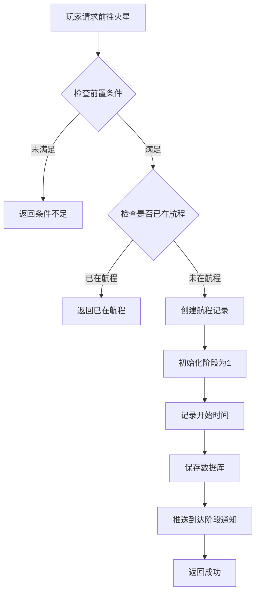
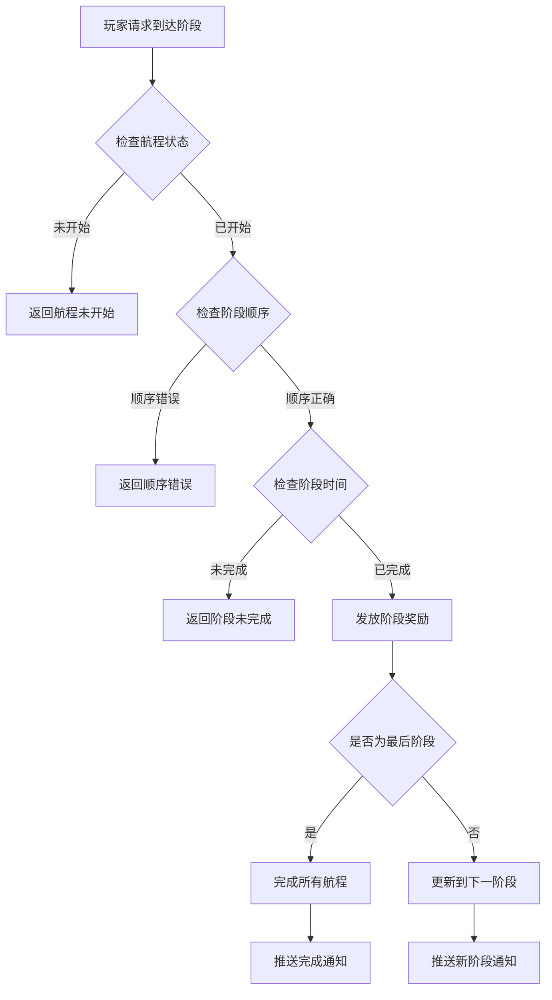
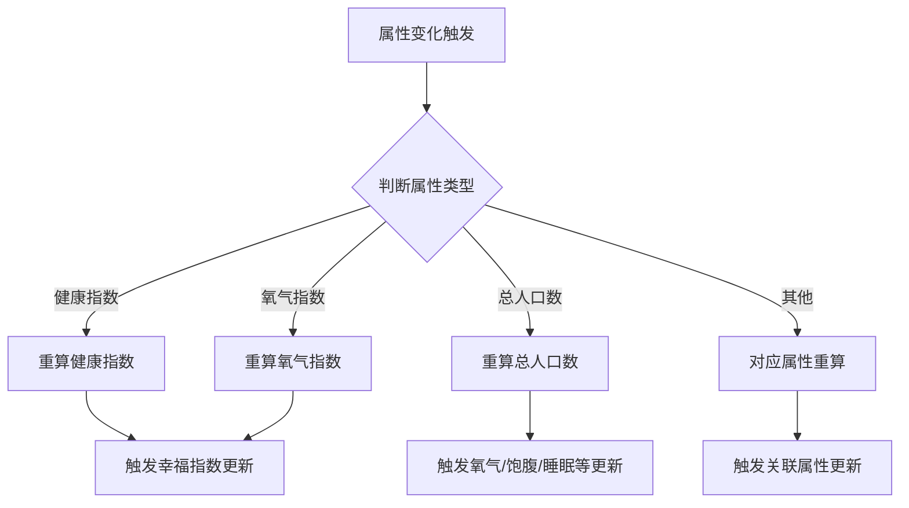
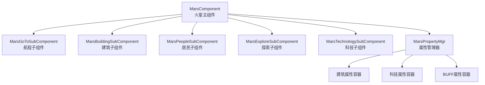

# 火星模块完整说明

## 一、模块概述

### 1.1 业务背景

火星模块是 K2C 游戏的特色探索玩法，玩家可以驾驶飞船前往火星进行殖民建设。该玩法融合了探索、建造、养成等多种元素，玩家需要管理航程进度、建设火星基地、派遣人员执行任务、探索火星未知区域。通过持续的投入和发展，玩家可以逐步解锁火星的更多内容和奖励。

### 1.2 模块架构

火星系统由多个子模块组成：

| 模块编号 | 模块名称 | 说明 |
|----------|----------|------|
| p038 | MarsOp | 火星航程操作 |
| p039 | MarsBuildingOp | 火星建筑操作 |
| p040 | MarsPeopleOp | 火星人员操作 |
| p041 | MarsExploreOp | 火星探索操作 |

### 1.3 目标用户

- **探索型玩家**：享受探索未知区域的内容
- **建设型玩家**：喜欢经营建造玩法
- **收集型玩家**：收集火星资源和稀有道具
- **社交型玩家**：通过公会援助加速进度

### 1.4 核心价值

1. **探索乐趣**：逐步解锁火星区域的探索体验
2. **建设成就感**：从荒芜到繁华的建设过程
3. **长期目标**：持续提供长期养成目标
4. **社交互动**：公会援助促进社交协作

---

## 二、功能清单

### 2.1 航程管理功能 (MarsOp, p038)

| 功能名称 | 功能描述 | 用户价值 |
|---------|---------|---------|
| 开始航程 | 发起前往火星的航程 | 开启火星探索 |
| 到达阶段 | 到达航程中的各个阶段 | 获取阶段性奖励 |
| 查看航程进度 | 查看当前航程进度 | 了解探索进度 |
| 阶段留言 | 在各阶段发送留言 | 社交互动 |
| 跑马灯通知 | 到达火星后发送全服通知 | 展示成就 |

### 2.2 建筑管理功能 (MarsBuildingOp, p039)

| 功能名称 | 功能描述 | 用户价值 |
|---------|---------|---------|
| 查看建筑列表 | 查看火星基地的建筑 | 了解基地状态 |
| 升级建筑 | 提升建筑等级 | 增强基地功能 |
| 建筑功能 | 使用建筑的产出功能 | 获取资源收益 |
| 建筑布局 | 规划建筑摆放位置 | 优化基地布局 |

### 2.3 人员管理功能 (MarsPeopleOp, p040)

| 功能名称 | 功能描述 | 用户价值 |
|---------|---------|---------|
| 查看人员列表 | 查看可派遣的人员 | 了解人员状态 |
| 分配人员 | 将人员分配到建筑 | 提升建筑效率 |
| 人员培养 | 提升人员能力属性 | 增强人员效率 |
| 人员招募 | 招募新的工作人员 | 扩大人员队伍 |

### 2.4 探索功能 (MarsExploreOp, p041)

| 功能名称 | 功能描述 | 用户价值 |
|---------|---------|---------|
| 开始探索 | 派遣人员探索区域 | 发现新资源 |
| 查看探索进度 | 查看探索任务进度 | 了解探索状态 |
| 探索奖励 | 领取探索完成奖励 | 获取探索收益 |
| 区域解锁 | 解锁新的探索区域 | 扩展探索范围 |

### 2.5 科技研究功能 (MarsBuildingOp, p039)

| 功能名称 | 功能描述 | 用户价值 |
|---------|---------|---------|
| 查看科技树 | 查看可研究的科技 | 了解科技发展方向 |
| 研究科技 | 消耗资源研究科技 | 获得科技加成 |
| 科技效果 | 查看已研究科技效果 | 了解科技收益 |

---

## 三、业务流程详解

### 3.1 开始航程流程



**详细步骤说明**：

1. **前置检查**
   - 检查玩家等级是否满足
   - 检查是否已完成前置任务
   - 检查是否已在航程中

2. **航程创建**
   - 创建航程记录
   - 设置初始阶段为1
   - 记录开始时间

3. **阶段推进**
   - 每个阶段有固定时长
   - 阶段完成获得奖励
   - 到达终点完成航程

### 3.2 到达阶段流程



### 3.3 火星属性计算流程



---

## 四、关键规则

### 4.1 航程规则

1. **阶段设置**
   - 航程分为多个阶段
   - 每个阶段有固定时长
   - 阶段间有剧情过渡

2. **加速规则**
   - 全服抵达人数动态减少时长
   - 可使用道具加速

3. **完成规则**
   - 所有阶段完成即到达火星
   - 到达后可进行建筑、探索等玩法

### 4.2 阶段留言规则

1. 每个阶段只能发送一次留言
2. 阶段变更时重置留言状态
3. 留言内容需敏感词过滤
4. 留言有长度限制

### 4.3 属性计算规则

#### 健康指数计算

```
健康指数 = (氧气指数 * 氧气系数 + 饱腹指数 * 饱腹系数 + 睡眠指数 * 睡眠系数) * (1 + 火星属性_健康指数万分比加成)
```

#### 氧气指数计算

```
氧气指数 = [建筑氧气产出总和 / (每人口消耗氧气 * 人口数)] * (1 + 火星属性_氧气万分比加成)
上限: mars_building_oxygen_index_max
```

#### 幸福指数计算

```
幸福指数 = (舒适指数 * 舒适系数 + 心情指数 * 心情系数) * (1 + 火星属性_幸福指数万分比加成)
```

#### 火星实力计算

```
火星实力 = (建筑实力总和 + 科技加成实力 + 队伍历史最高实力) * (1 + 玩家属性万分比加成)
```

---

## 五、模块关联

### 5.1 依赖模块

| 模块名称 | 依赖类型 | 依赖说明 |
|----------|----------|----------|
| PlayerOp | 数据依赖 | 获取玩家等级、资源 |
| GuildRelatedOp | 功能依赖 | 公会援助加速 |
| BagOp | 功能依赖 | 道具使用加速 |

### 5.2 子模块关联图



---

## 六、用户故事

### 6.1 探索型玩家故事

> 作为一名探索型玩家，我对火星充满好奇。我完成了航程的所有阶段，解锁了多个探索区域。每次探索都让我兴奋不已，因为我不知道会发现什么。上周我发现了一个隐藏的矿洞，获得了稀有的图纸奖励。

### 6.2 建设型玩家故事

> 作为一名建设型玩家，我热衷于经营我的火星基地。我合理规划建筑布局，优先升级能源站确保电力供应。看着荒芜的火星逐渐变成繁华的基地，我非常有成就感。我的基地等级已经达到了10级。

### 6.3 社交型玩家故事

> 作为一名社交型玩家，我和公会成员经常在火星玩法上互相帮助。每次航程加速我都会请求援助，公会成员的帮助让我大大缩短了等待时间。我也会帮助其他成员，获得额外的公会贡献。

---

## 七、示例

### 7.1 航程信息示例

**航程状态**：
```
航程ID: 30001
当前阶段: 3/5
当前阶段名称: 火星轨道
阶段进度: 60%
预计到达: 2026-04-11 16:00:00
开始时间: 2026-04-11 10:00:00
```

### 7.2 协议交互示例

**开始航程**:
```json
// 请求 GC2GS_038_001_ReqStartToGoMars
{}

// 响应 GS2GC_038_001_RetStartToGoMars
{}

// 推送 GS2GC_038_050_OnGoToStageArrived
{
  "stage": 1,
  "startMs": 1712808000000,
  "stageStartMs": 1712808000000
}
```

### 7.3 属性计算示例

**健康指数计算**：
```
氧气指数: 8000
饱腹指数: 7500
睡眠指数: 6000
氧气系数: 3000 (万分之)
饱腹系数: 4000 (万分之)
睡眠系数: 3000 (万分之)
健康加成: 2000 (万分之)

健康指数 = (8000*0.3 + 7500*0.4 + 6000*0.3) * 1.2
        = (2400 + 3000 + 1800) * 1.2
        = 7200 * 1.2
        = 8640
```

---

*文档生成时间: 2026-04-11*
