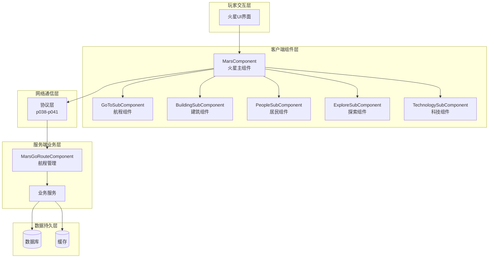
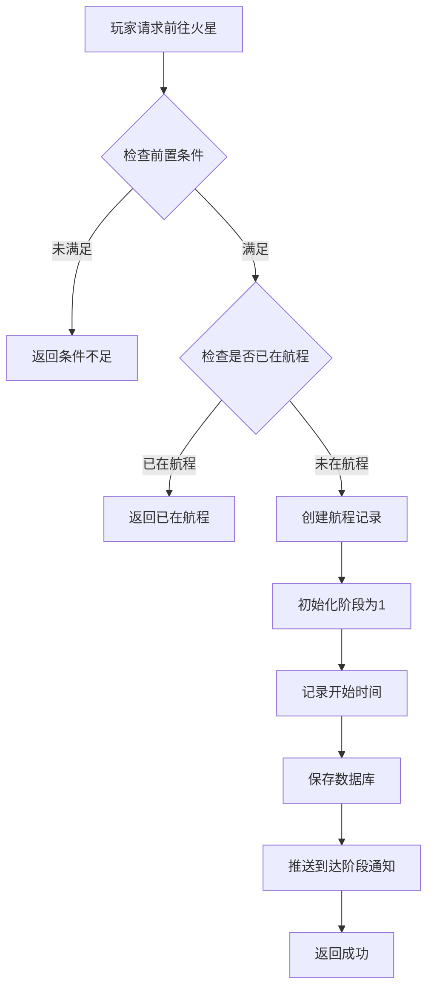
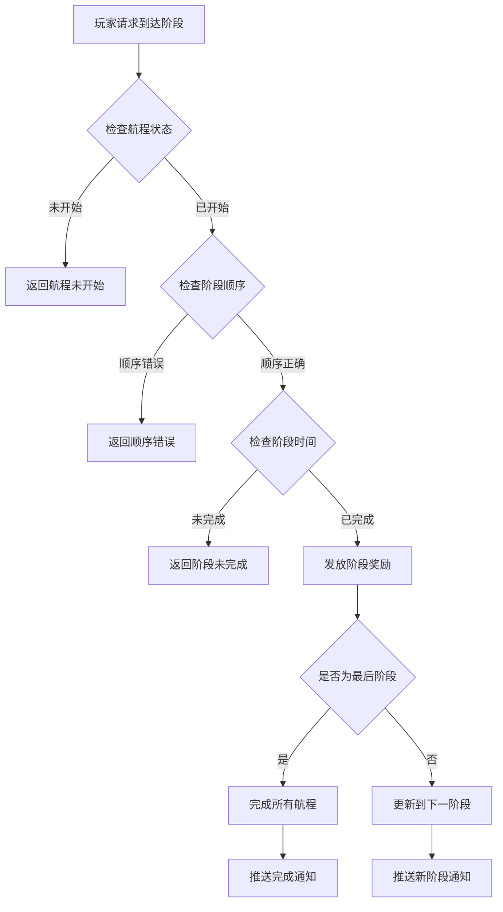
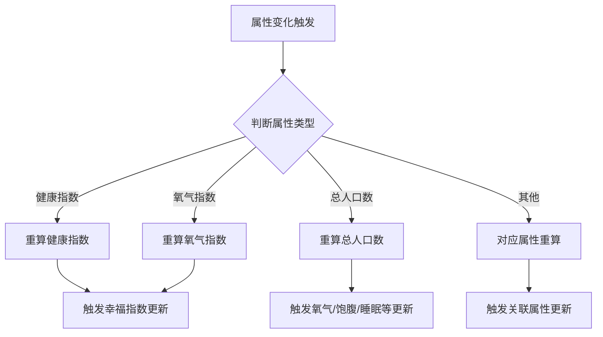
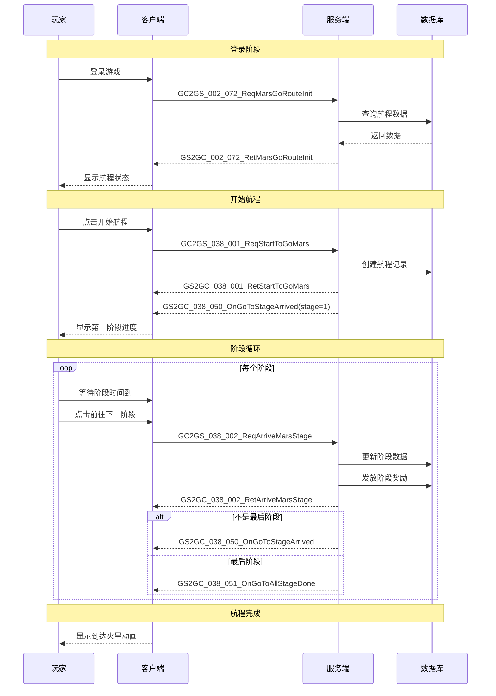
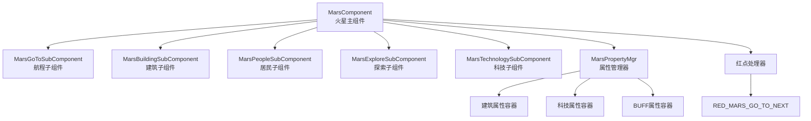
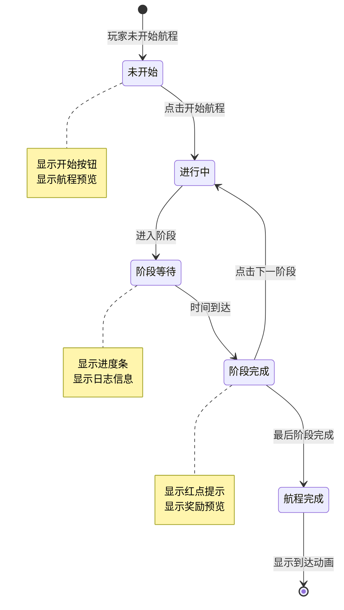
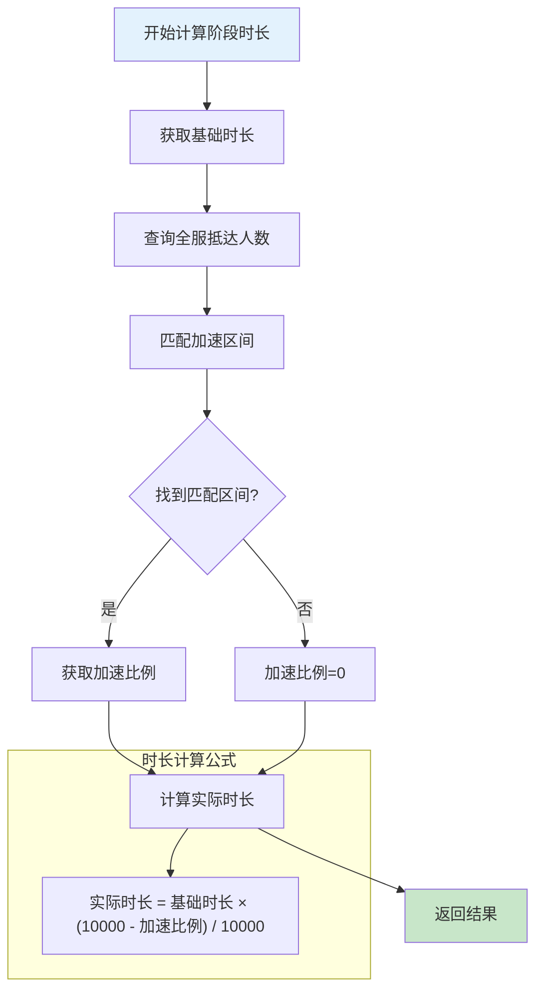
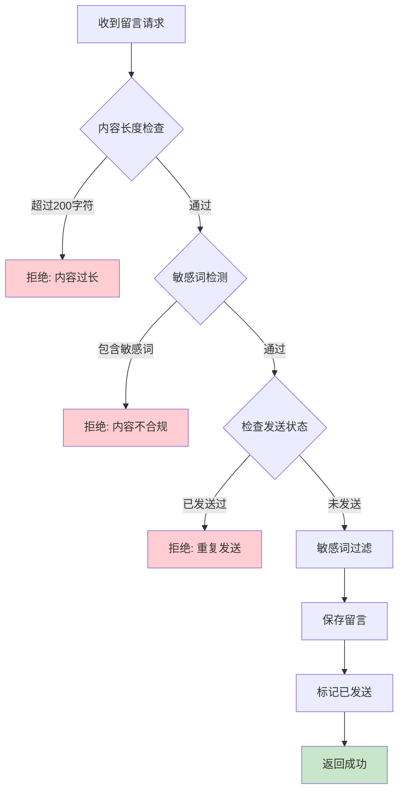
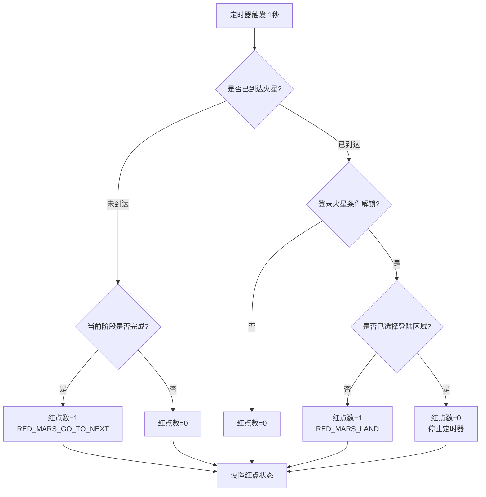

# 火星模块完整说明

## 一、模块概述

### 1.1 业务背景

火星模块是 K2C 游戏的特色探索玩法，玩家可以驾驶飞船前往火星进行殖民建设。该玩法融合了探索、建造、养成等多种元素，玩家需要管理航程进度、建设火星基地、派遣人员执行任务、探索火星未知区域。通过持续的投入和发展，玩家可以逐步解锁火星的更多内容和奖励。

### 1.2 模块架构

火星系统由多个子模块组成：

| 模块编号 | 模块名称 | 说明 |
|----------|----------|------|
| p038 | MarsOp | 火星航程操作（前往火星流程） |
| p039 | MarsBuildingOp | 火星建筑操作（建筑升级、功能） |
| p040 | MarsPeopleOp | 火星人员操作（居民管理） |
| p041 | MarsExploreOp | 火星探索操作（探索任务） |

### 1.3 系统架构图



### 1.4 目标用户

- **探索型玩家**：享受探索未知区域的内容
- **建设型玩家**：喜欢经营建造玩法
- **收集型玩家**：收集火星资源和稀有道具
- **社交型玩家**：通过公会援助加速进度

### 1.5 核心价值

1. **探索乐趣**：逐步解锁火星区域的探索体验
2. **建设成就感**：从荒芜到繁华的建设过程
3. **长期目标**：持续提供长期养成目标
4. **社交互动**：公会援助促进社交协作

---

## 二、功能清单

### 2.1 航程管理功能 (MarsOp, p038)

| 功能名称 | 功能描述 | 用户价值 | 协议 |
|---------|---------|---------|------|
| 开始航程 | 发起前往火星的航程 | 开启火星探索 | 038_001 |
| 到达阶段 | 到达航程中的各个阶段 | 获取阶段性奖励 | 038_002 |
| 查看航程进度 | 查看当前航程进度 | 了解探索进度 | 初始化协议 |
| 阶段留言 | 在各阶段发送留言 | 社交互动 | 038_004 |
| 跑马灯通知 | 到达火星后发送全服通知 | 展示成就 | 038_003 |

### 2.2 建筑管理功能 (MarsBuildingOp, p039)

| 功能名称 | 功能描述 | 用户价值 |
|---------|---------|---------|
| 查看建筑列表 | 查看火星基地的建筑 | 了解基地状态 |
| 升级建筑 | 提升建筑等级 | 增强基地功能 |
| 建筑功能 | 使用建筑的产出功能 | 获取资源收益 |
| 建筑布局 | 规划建筑摆放位置 | 优化基地布局 |

### 2.3 人员管理功能 (MarsPeopleOp, p040)

| 功能名称 | 功能描述 | 用户价值 |
|---------|---------|---------|
| 查看人员列表 | 查看可派遣的人员 | 了解人员状态 |
| 分配人员 | 将人员分配到建筑 | 提升建筑效率 |
| 人员培养 | 提升人员能力属性 | 增强人员效率 |
| 人员招募 | 招募新的工作人员 | 扩大人员队伍 |

### 2.4 探索功能 (MarsExploreOp, p041)

| 功能名称 | 功能描述 | 用户价值 |
|---------|---------|---------|
| 开始探索 | 派遣人员探索区域 | 发现新资源 |
| 查看探索进度 | 查看探索任务进度 | 了解探索状态 |
| 探索奖励 | 领取探索完成奖励 | 获取探索收益 |
| 区域解锁 | 解锁新的探索区域 | 扩展探索范围 |

### 2.5 科技研究功能 (MarsBuildingOp, p039)

| 功能名称 | 功能描述 | 用户价值 |
|---------|---------|---------|
| 查看科技树 | 查看可研究的科技 | 了解科技发展方向 |
| 研究科技 | 消耗资源研究科技 | 获得科技加成 |
| 科技效果 | 查看已研究科技效果 | 了解科技收益 |

---

## 三、业务流程详解

### 3.1 开始航程流程



**详细步骤说明**：

1. **前置检查**
   - 检查玩家等级是否满足
   - 检查是否已完成前置任务
   - 检查是否已在航程中

2. **航程创建**
   - 创建航程记录
   - 设置初始阶段为1
   - 记录开始时间

3. **阶段推进**
   - 每个阶段有固定时长
   - 阶段完成获得奖励
   - 到达终点完成航程

### 3.2 到达阶段流程



### 3.3 火星属性计算流程



### 3.4 完整航程时序图



---

## 四、关键规则

### 4.1 航程规则

1. **阶段设置**
   - 航程分为多个阶段（由配置决定）
   - 每个阶段有固定时长
   - 阶段间有剧情过渡

2. **加速规则**
   - 全服抵达人数动态减少时长
   - 可使用道具加速

3. **完成规则**
   - 所有阶段完成即到达火星
   - 到达后可进行建筑、探索等玩法

### 4.2 阶段留言规则

1. 每个阶段只能发送一次留言
2. 阶段变更时重置留言状态
3. 留言内容需敏感词过滤
4. 留言有长度限制（最大200字符）

### 4.3 属性计算规则

#### 健康指数计算

```
健康指数 = (氧气指数 × 氧气系数 + 饱腹指数 × 饱腹系数 + 睡眠指数 × 睡眠系数) × (1 + 火星属性_健康指数万分比加成 / 10000)
```

#### 氧气指数计算

```
氧气指数 = [建筑氧气产出总和 / (每人口消耗氧气 × 人口数)] × (1 + 火星属性_氧气万分比加成 / 10000)
上限: mars_building_oxygen_index_max
```

#### 幸福指数计算

```
幸福指数 = (舒适指数 × 舒适系数 + 心情指数 × 心情系数) × (1 + 火星属性_幸福指数万分比加成 / 10000)
```

#### 火星实力计算

```
火星实力 = (建筑实力总和 + 科技加成实力 + 队伍历史最高实力) × (1 + 玩家属性_火星实力万分比加成 / 10000)
```

---

## 五、模块关联

### 5.1 依赖模块

| 模块名称 | 依赖类型 | 依赖说明 |
|----------|----------|----------|
| PlayerOp | 数据依赖 | 获取玩家等级、资源 |
| GuildRelatedOp | 功能依赖 | 公会援助加速 |
| BagOp | 功能依赖 | 道具使用加速 |
| PlayerBuffComp | 属性依赖 | Buff提供的火星属性加成 |
| RecordComp | 数据依赖 | 队伍历史最高实力 |

### 5.2 子模块关联图



---

## 六、用户故事

### 6.1 探索型玩家故事

> 作为一名探索型玩家，我对火星充满好奇。我完成了航程的所有阶段，解锁了多个探索区域。每次探索都让我兴奋不已，因为我不知道会发现什么。上周我发现了一个隐藏的矿洞，获得了稀有的图纸奖励。

### 6.2 建设型玩家故事

> 作为一名建设型玩家，我热衷于经营我的火星基地。我合理规划建筑布局，优先升级能源站确保电力供应。看着荒芜的火星逐渐变成繁华的基地，我非常有成就感。我的基地等级已经达到了10级。

### 6.3 社交型玩家故事

> 作为一名社交型玩家，我和公会成员经常在火星玩法上互相帮助。每次航程加速我都会请求援助，公会成员的帮助让我大大缩短了等待时间。我也会帮助其他成员，获得额外的公会贡献。

---

## 七、示例

### 7.1 航程信息示例

**航程状态**：
```
航程ID: 30001
当前阶段: 3/5
当前阶段名称: 火星轨道
阶段进度: 60%
预计到达: 2026-04-11 16:00:00
开始时间: 2026-04-11 10:00:00
```

### 7.2 协议交互示例

**开始航程**:
```json
// 请求 GC2GS_038_001_ReqStartToGoMars
{}

// 响应 GS2GC_038_001_RetStartToGoMars
{}

// 推送 GS2GC_038_050_OnGoToStageArrived
{
  "stage": 1,
  "startMs": 1712808000000,
  "stageStartMs": 1712808000000
}
```

### 7.3 属性计算示例

**健康指数计算**：
```
氧气指数: 8000
饱腹指数: 7500
睡眠指数: 6000
氧气系数: 3000 (万分之)
饱腹系数: 4000 (万分之)
睡眠系数: 3000 (万分之)
健康加成: 2000 (万分之)

健康指数 = (8000×0.3 + 7500×0.4 + 6000×0.3) × 1.2
        = (2400 + 3000 + 1800) × 1.2
        = 7200 × 1.2
        = 8640
```

---

## 八、界面交互流程

### 8.1 航程主界面



---

## 九、数据统计埋点

### 9.1 埋点事件列表

| 事件名 | 触发时机 | 参数 | 用途 |
|--------|----------|------|------|
| GO_TO_MARS_ARRIVED_SRAGE | 到达新阶段 | stage | 阶段进度统计 |
| ARRIVED_MARS | 到达火星 | 无 | 完成率统计 |
| MARS_ROUTE_START | 开始航程 | 无 | 开始率统计 |

### 9.2 埋点代码

```csharp
// 到达新阶段埋点
GCommon.sendStepReport(TraceConst.GO_TO_MARS_ARRIVED_SRAGE.setMarkParam(_msg.getStage()));

// 到达火星埋点
GCommon.sendStepReport(TraceConst.ARRIVED_MARS);
```

---

## 十、界面设计规范

### 10.1 航程主界面布局

```
┌─────────────────────────────────────────────────────────────┐
│                      火星航程                                 │
├─────────────────────────────────────────────────────────────┤
│  ┌───────────────────────────────────────────────────────┐  │
│  │                    航程动画区域                          │  │
│  │                                                         │  │
│  │              [背景视频/动态背景图]                        │  │
│  │                                                         │  │
│  │              当前阶段: 火星轨道                          │  │
│  │              进度: ████████░░░░ 65%                      │  │
│  │              剩余时间: 02:34:56                          │  │
│  └───────────────────────────────────────────────────────┘  │
│                                                             │
│  ┌─────────────┐ ┌─────────────┐ ┌─────────────┐            │
│  │   阶段1     │ │   阶段2     │ │   阶段3     │            │
│  │   ✓完成    │ │   ✓完成    │ │   进行中   │            │
│  └─────────────┘ └─────────────┘ └─────────────┘            │
│                                                             │
│  ┌───────────────────────────────────────────────────────┐  │
│  │  [航行日志]                                             │  │
│  │  • 14:32 飞船系统自检完成，一切正常                      │  │
│  │  • 14:30 推进器预热中，预计10分钟后点火                  │  │
│  │  • 14:25 已进入稳定飞行轨道                              │  │
│  └───────────────────────────────────────────────────────┘  │
│                                                             │
│  ┌────────────┐  ┌────────────┐  ┌────────────┐             │
│  │  [留言板]  │  │  [奖励]    │  │ [下一阶段] │             │
│  └────────────┘  └────────────┘  └────────────┘             │
└─────────────────────────────────────────────────────────────┘
```

### 10.2 界面元素说明

| 元素名称 | 类型 | 说明 | 交互行为 |
|---------|------|------|----------|
| 航程动画区 | 动态背景 | 显示当前阶段的背景动画 | 无交互 |
| 阶段名称 | 文本 | 当前阶段名称（多语言） | 无交互 |
| 进度条 | 进度条 | 显示当前阶段完成进度 | 无交互 |
| 剩余时间 | 倒计时 | 阶段剩余时间 | 无交互 |
| 阶段指示器 | 列表 | 显示所有阶段状态 | 点击可跳转查看 |
| 航行日志 | 滚动列表 | 实时显示日志信息 | 可滚动查看 |
| 留言板按钮 | 按钮 | 打开留言界面 | 打开留言弹窗 |
| 奖励按钮 | 按钮 | 查看阶段奖励预览 | 打开奖励弹窗 |
| 下一阶段按钮 | 按钮 | 确认进入下一阶段 | 发送协议请求 |

### 10.3 留言板界面设计

```
┌─────────────────────────────────────────────────────────────┐
│                      阶段留言板                               │
│                    当前阶段: 火星轨道                         │
├─────────────────────────────────────────────────────────────┤
│  ┌───────────────────────────────────────────────────────┐  │
│  │  [玩家A]: 火星，我来了！                                 │  │
│  │  2026-04-11 14:30                                       │  │
│  ├───────────────────────────────────────────────────────┤  │
│  │  [玩家B]: 加油加油，一起努力！                           │  │
│  │  2026-04-11 14:28                                       │  │
│  ├───────────────────────────────────────────────────────┤  │
│  │  [玩家C]: 星际之旅太刺激了                               │  │
│  │  2026-04-11 14:25                                       │  │
│  └───────────────────────────────────────────────────────┘  │
│                                                             │
│  ┌───────────────────────────────────────────────────────┐  │
│  │  输入留言内容...                              [发送]   │  │
│  └───────────────────────────────────────────────────────┘  │
│                                                             │
│  提示: 每个阶段只能发送一次留言                              │
└─────────────────────────────────────────────────────────────┘
```

---

## 十一、配置示例详解

### 11.1 航程阶段配置示例

```json
[
    {
        "id": 1,
        "stage_id": 1,
        "name": "地球轨道",
        "desc": "从地球出发，进入地球轨道。这是一段激动人心的旅程开始。",
        "desc_args": "",
        "continue_secs": 1800,
        "arrive_item_list": [
            {"item": {"itemType": 1, "itemId": 50001}, "count": 100},
            {"item": {"itemType": 1, "itemId": 50002}, "count": 50}
        ],
        "arrive_desc": "抵达地球轨道，准备进入星际航行！",
        "arrive_dialogue_id": 2001,
        "log_id_list": [1001, 1002, 1003],
        "msg_stage_name": "地球轨道",
        "done_simple_unlock_id": 0,
        "bg_index": {"type": 1, "index": 100},
        "banner_tex": {"type": 1, "index": 200}
    },
    {
        "id": 2,
        "stage_id": 2,
        "name": "月球轨道",
        "desc": "绕月飞行，进行最后的系统检查和补给。",
        "continue_secs": 3600,
        "arrive_item_list": [
            {"item": {"itemType": 1, "itemId": 50003}, "count": 80},
            {"item": {"itemType": 1, "itemId": 50004}, "count": 30}
        ],
        "arrive_desc": "月球轨道检查完毕，准备进入深空！",
        "log_id_list": [1004, 1005, 1006],
        "msg_stage_name": "月球轨道"
    },
    {
        "id": 3,
        "stage_id": 3,
        "name": "地火转移轨道",
        "desc": "进入地火转移轨道，这是最漫长的旅程阶段。",
        "continue_secs": 7200,
        "arrive_item_list": [
            {"item": {"itemType": 1, "itemId": 50005}, "count": 150}
        ],
        "arrive_desc": "成功进入转移轨道，火星就在前方！",
        "log_id_list": [1007, 1008, 1009, 1010],
        "msg_stage_name": "转移轨道"
    },
    {
        "id": 4,
        "stage_id": 4,
        "name": "火星轨道",
        "desc": "抵达火星轨道，准备进入着陆程序。",
        "continue_secs": 5400,
        "arrive_item_list": [
            {"item": {"itemType": 1, "itemId": 50006}, "count": 200}
        ],
        "arrive_desc": "火星已在眼前，即将完成历史性着陆！",
        "log_id_list": [1011, 1012, 1013],
        "msg_stage_name": "火星轨道"
    },
    {
        "id": 5,
        "stage_id": 5,
        "name": "火星着陆",
        "desc": "最后的着陆阶段，成功后即可开始火星建设！",
        "continue_secs": 3600,
        "arrive_item_list": [
            {"item": {"itemType": 1, "itemId": 50007}, "count": 300},
            {"item": {"itemType": 1, "itemId": 50008}, "count": 100}
        ],
        "arrive_desc": "成功着陆火星！新的征程开始了！",
        "log_id_list": [1014, 1015],
        "msg_stage_name": "火星着陆"
    }
]
```

### 11.2 航行日志配置示例

```json
[
    {
        "id": 1001,
        "content": "飞船系统自检完成，一切正常。",
        "trigger_offset_secs": 60
    },
    {
        "id": 1002,
        "content": "推进器预热中，预计10分钟后点火。",
        "trigger_offset_secs": 120
    },
    {
        "id": 1003,
        "content": "主推进器点火成功，飞船正在加速升空！",
        "trigger_offset_secs": 180
    },
    {
        "id": 1004,
        "content": "已进入稳定飞行轨道，速度逐渐增加。",
        "trigger_offset_secs": 300
    },
    {
        "id": 1005,
        "content": "检测到小型陨石群，正在自动规避。",
        "trigger_offset_secs": 600
    },
    {
        "id": 1006,
        "content": "成功避开陨石群，继续平稳飞行。",
        "trigger_offset_secs": 900
    },
    {
        "id": 1007,
        "content": "进入地火转移轨道，旅程正式开始。",
        "trigger_offset_secs": 60
    },
    {
        "id": 1008,
        "content": "距离火星还有一半路程，请保持耐心。",
        "trigger_offset_secs": 3600
    },
    {
        "id": 1009,
        "content": "火星已肉眼可见，正在准备减速程序。",
        "trigger_offset_secs": 6000
    },
    {
        "id": 1010,
        "content": "转移轨道飞行结束，准备进入火星引力范围。",
        "trigger_offset_secs": 7000
    }
]
```

### 11.3 全服加速配置示例

```json
{
    "mars_go_route_arrive_reduce_list": [
        {"first": -1, "second": 100, "three": 0},
        {"first": 100, "second": 500, "three": 1000},
        {"first": 500, "second": 1000, "three": 1500},
        {"first": 1000, "second": -1, "three": 2000}
    ],
    "mars_go_to_finish_marquee_id": 38001
}
```

**配置解读**：

| 区间 | 抵达人数 | 时长减少 | 示例计算 |
|------|----------|----------|----------|
| 第1档 | 0-100人 | 0% | 基础时长无变化 |
| 第2档 | 100-500人 | 10% | 1小时 → 54分钟 |
| 第3档 | 500-1000人 | 15% | 1小时 → 51分钟 |
| 第4档 | 1000人以上 | 20% | 1小时 → 48分钟 |

---

## 十二、业务规则详解

### 12.1 阶段时间计算规则



### 12.2 留言审核规则



### 12.3 红点刷新规则



---

## 十三、性能与优化

### 13.1 客户端优化策略

| 优化项 | 策略 | 效果 |
|--------|------|------|
| 属性计算 | 使用懒任务机制，同一帧内多次触发只执行一次 | 减少80%重复计算 |
| 红点刷新 | 到达火星并选择区域后停止定时器 | 减少后台CPU占用 |
| 初始化 | 5个子组件并行初始化 | 启动时间减少60% |
| 日志加载 | 按需加载，分页显示 | 内存占用减少50% |

### 13.2 服务端优化策略

| 优化项 | 策略 | 效果 |
|--------|------|------|
| 航程数据缓存 | Redis缓存30分钟 | 减少数据库查询90% |
| 留言列表缓存 | Redis缓存1分钟 | 减少高频查询压力 |
| 全服抵达计数 | Redis计数器+定时同步 | 实时响应+数据一致性 |
| 批量更新 | 使用batchUpdate | 减少数据库连接开销 |

---

## 十四、常见问题FAQ

### Q1: 玩家中途退出航程会怎样？

**A**: 航程进度会保存在数据库中，玩家下次登录时会自动恢复到之前的状态，不会丢失进度。

### Q2: 阶段时间是否可以加速？

**A**: 支持。全服抵达人数会增加加速比例，玩家也可以使用加速道具直接完成当前阶段。

### Q3: 留言可以修改或删除吗？

**A**: 目前不支持修改或删除已发送的留言。每个阶段只能发送一条留言。

### Q4: 到达火星后可以重新开始航程吗？

**A**: 不可以。航程是一次性流程，完成后玩家可以开始火星基地建设和探索玩法。

### Q5: 全服加速比例如何实时更新？

**A**: 服务端维护Redis计数器，玩家抵达火星时自动递增，所有玩家在计算阶段时长时会读取最新的加速比例。

---

## 十五、版本历史

| 版本 | 日期 | 更新内容 |
|------|------|----------|
| v1.0.0 | 2025-01-15 | 初始版本，实现基础航程功能 |
| v1.1.0 | 2025-02-01 | 新增阶段留言功能 |
| v1.2.0 | 2025-03-01 | 新增全服加速机制 |
| v1.3.0 | 2025-04-01 | 优化红点系统，减少资源占用 |
| v2.0.0 | 2025-06-01 | 完善火星建设子系统，增加科技研究 |

---

*文档生成时间: 2026-04-12*
*文档版本: v2.1.0*
