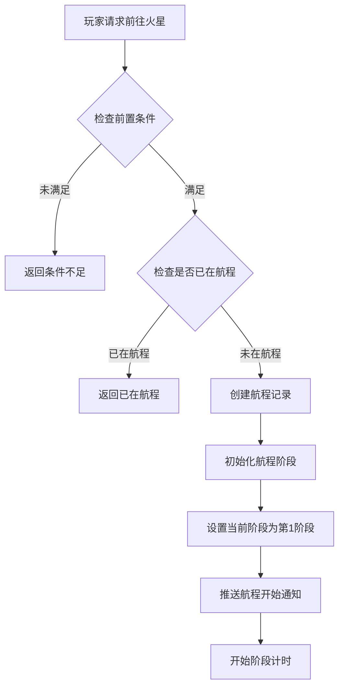
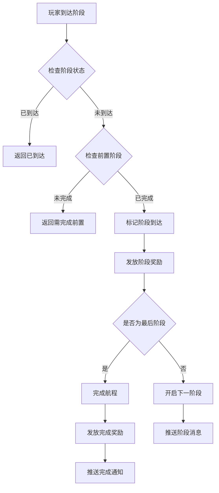
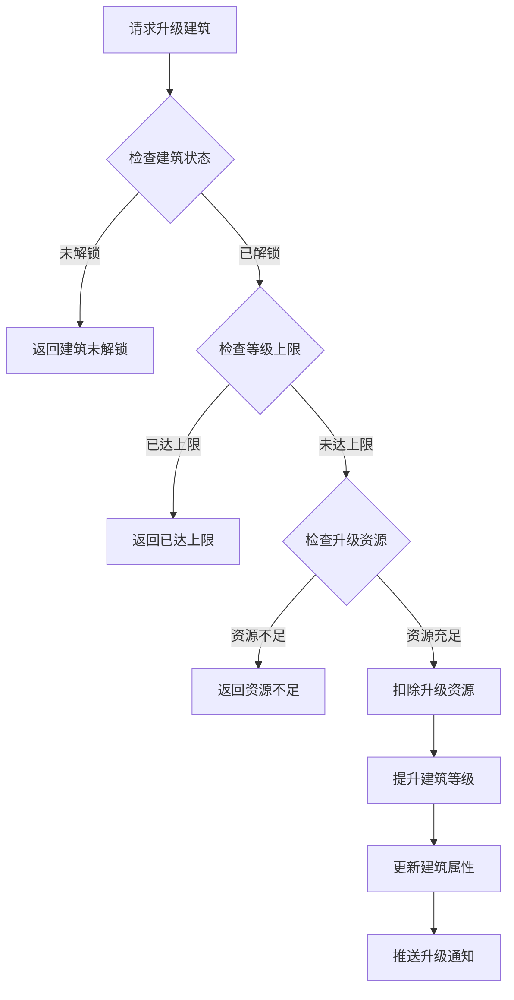
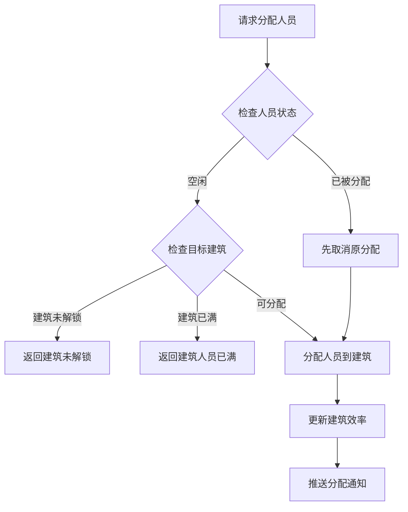
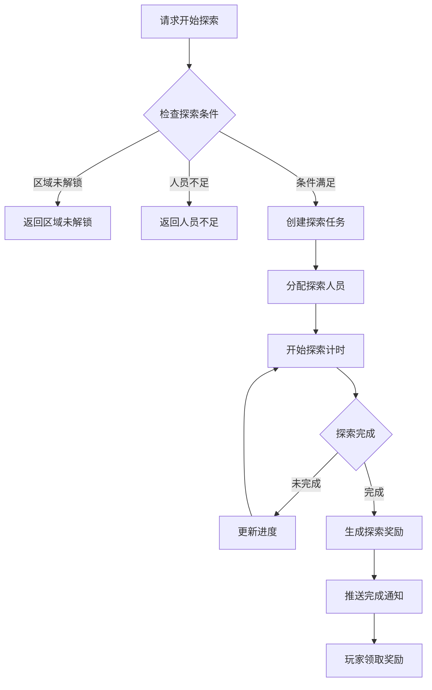

# 火星模块完整说明

## 一、模块概述

### 1.1 业务背景

火星模块是 K2C 游戏的特色探索玩法，玩家可以驾驶飞船前往火星进行殖民建设。该玩法融合了探索、建造、养成等多种元素，玩家需要管理航程进度、建设火星基地、派遣人员执行任务、探索火星未知区域。通过持续的投入和发展，玩家可以逐步解锁火星的更多内容和奖励。

### 1.2 目标用户

- **探索型玩家**：享受探索未知区域的内容
- **建设型玩家**：喜欢经营建造玩法
- **收集型玩家**：收集火星资源和稀有道具
- **社交型玩家**：通过公会援助加速进度

### 1.3 核心价值

1. **探索乐趣**：逐步解锁火星区域的探索体验
2. **建设成就感**：从荒芜到繁华的建设过程
3. **长期目标**：持续提供长期养成目标
4. **社交互动**：公会援助促进社交协作

---

## 二、功能清单

### 2.1 航程管理功能

| 功能名称 | 功能描述 | 用户价值 |
|---------|---------|---------|
| 开始航程 | 发起前往火星的航程 | 开启火星探索 |
| 到达阶段 | 到达航程中的各个阶段 | 获取阶段性奖励 |
| 查看航程进度 | 查看当前航程进度 | 了解探索进度 |
| 阶段消息 | 查看各阶段的剧情消息 | 了解剧情故事 |

### 2.2 建筑管理功能

| 功能名称 | 功能描述 | 用户价值 |
|---------|---------|---------|
| 查看建筑列表 | 查看火星基地的建筑 | 了解基地状态 |
| 升级建筑 | 提升建筑等级 | 增强基地功能 |
| 建筑功能 | 使用建筑的产出功能 | 获取资源收益 |
| 建筑布局 | 规划建筑摆放位置 | 优化基地布局 |

### 2.3 人员管理功能

| 功能名称 | 功能描述 | 用户价值 |
|---------|---------|---------|
| 查看人员列表 | 查看可派遣的人员 | 了解人员状态 |
| 分配人员 | 将人员分配到建筑 | 提升建筑效率 |
| 人员培养 | 提升人员能力属性 | 增强人员效率 |
| 人员招募 | 招募新的工作人员 | 扩大人员队伍 |

### 2.4 探索功能

| 功能名称 | 功能描述 | 用户价值 |
|---------|---------|---------|
| 开始探索 | 派遣人员探索区域 | 发现新资源 |
| 查看探索进度 | 查看探索任务进度 | 了解探索状态 |
| 探索奖励 | 领取探索完成奖励 | 获取探索收益 |
| 区域解锁 | 解锁新的探索区域 | 扩展探索范围 |

### 2.5 科技研究功能

| 功能名称 | 功能描述 | 用户价值 |
|---------|---------|---------|
| 查看科技树 | 查看可研究的科技 | 了解科技发展方向 |
| 研究科技 | 消耗资源研究科技 | 获得科技加成 |
| 科技效果 | 查看已研究科技效果 | 了解科技收益 |

---

## 三、业务流程详解

### 3.1 开始航程流程



**详细步骤说明**：

1. **前置检查**
   - 检查玩家等级是否满足
   - 检查是否已完成前置任务
   - 检查是否有足够的燃料

2. **航程创建**
   - 创建航程记录
   - 初始化所有阶段信息
   - 设置开始时间

3. **阶段推进**
   - 每个阶段有固定时长
   - 阶段完成获得奖励
   - 到达终点完成航程

### 3.2 到达阶段流程



**详细步骤说明**：

1. **状态检查**
   - 检查阶段是否已完成
   - 检查是否满足到达条件

2. **奖励发放**
   - 发放阶段性奖励
   - 推送奖励通知

3. **阶段推进**
   - 开启下一阶段
   - 更新航程进度
   - 推送阶段消息

### 3.3 建筑升级流程



### 3.4 人员分配流程



### 3.5 探索流程



---

## 四、关键规则

### 4.1 航程规则

1. **阶段设置**
   - 航程分为多个阶段
   - 每个阶段有固定时长
   - 阶段间有剧情过渡

2. **加速规则**
   - 可消耗钻石加速航程
   - 公会援助可缩短时间
   - VIP等级提供加速加成

3. **重置规则**
   - 航程完成后可重新开始
   - 重置后保留建筑等级
   - 每周可重置一次

### 4.2 建筑规则

| 建筑类型 | 功能 | 说明 |
|----------|------|------|
| 指挥中心 | 核心建筑 | 控制基地运行 |
| 能源站 | 生产能源 | 为其他建筑供能 |
| 矿场 | 开采矿物 | 获取建造材料 |
| 研究所 | 科技研究 | 解锁新科技 |
| 居住区 | 人员容纳 | 增加人员上限 |

### 4.3 人员规则

1. **人员属性**
   - 工作效率：影响建筑产出
   - 探索能力：影响探索收益
   - 研究能力：影响科技研究速度

2. **分配规则**
   - 每个建筑有人员上限
   - 人员只能分配到一个建筑
   - 分配后可持续产出

3. **培养规则**
   - 消耗资源提升属性
   - 属性上限由等级决定
   - 特殊人员有天赋加成

### 4.4 探索规则

1. **区域解锁**
   - 按航程进度逐步解锁
   - 部分区域需要特殊条件
   - 解锁后可重复探索

2. **探索奖励**
   - 资源：矿物、能源等
   - 道具：稀有材料、图纸
   - 发现：新区域、彩蛋

3. **探索限制**
   - 每日探索次数限制
   - 探索需要派遣人员
   - 高级区域需要高级人员

---

## 五、用户故事

### 5.1 探索型玩家故事

> 作为一名探索型玩家，我对火星充满好奇。我完成了航程的所有阶段，解锁了多个探索区域。每次探索都让我兴奋不已，因为我不知道会发现什么。上周我发现了一个隐藏的矿洞，获得了稀有的图纸奖励。

### 5.2 建设型玩家故事

> 作为一名建设型玩家，我热衷于经营我的火星基地。我合理规划建筑布局，优先升级能源站确保电力供应。看着荒芜的火星逐渐变成繁华的基地，我非常有成就感。我的基地等级已经达到了10级。

### 5.3 社交型玩家故事

> 作为一名社交型玩家，我和公会成员经常在火星玩法上互相帮助。每次航程加速我都会请求援助，公会成员的帮助让我大大缩短了等待时间。我也会帮助其他成员，获得额外的公会贡献。

---

## 六、示例

### 6.1 航程信息示例

**航程状态**：
```
航程ID: 30001
当前阶段: 3/5
当前阶段名称: 火星轨道
阶段进度: 60%
预计到达: 2026-04-07 16:00:00
开始时间: 2026-04-07 10:00:00
```

### 6.2 建筑信息示例

**建筑数据**：
```
建筑ID: 1
建筑名称: 指挥中心
建筑等级: 5
建筑状态: 运行中
当前人员: 3/5
产出效率: 150%
升级消耗: 矿石×500, 能源×200
```

### 6.3 人员信息示例

**人员数据**：
```
人员ID: 101
人员名称: 工程师张三
人员等级: 10
工作效率: 80
探索能力: 45
研究能力: 60
当前分配: 能源站
状态: 工作中
```

### 6.4 探索信息示例

**探索任务**：
```
探索ID: 501
探索区域: 赤道峡谷
探索进度: 75%
派遣人员: 工程师张三, 探险家李四
预计完成: 2026-04-07 15:00:00
预期奖励: 矿石×100, 稀有图纸×1
```

---

*文档生成时间: 2026-04-07*
