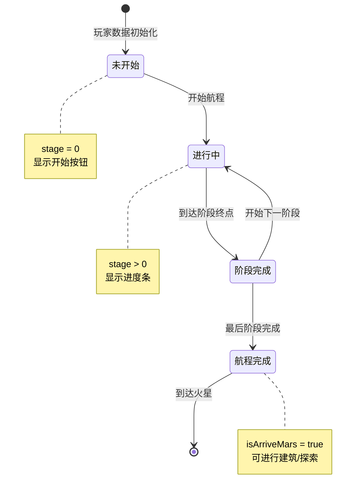
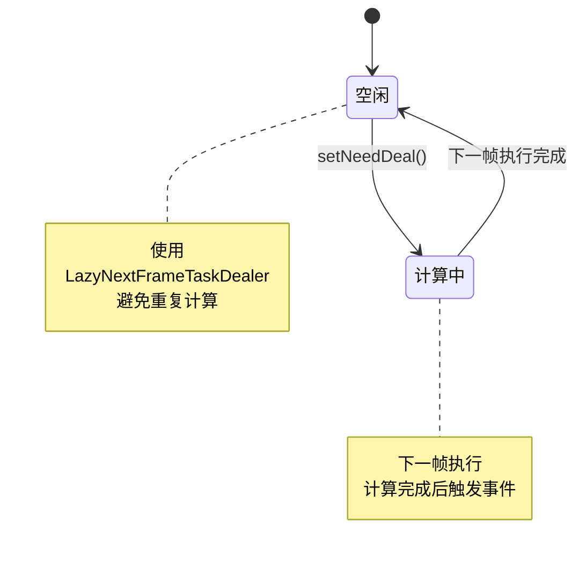
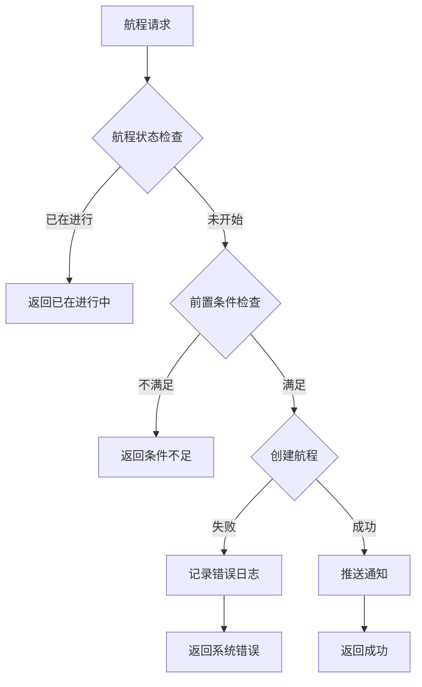

# 火星模块实现细节

## 一、计算公式

### 1.1 阶段时间计算

```
阶段时长 = 基础时长 × (10000 - 全服抵达减少万分比) / 10000
实际时长 = max(阶段时长, 最小时长)
```

**参数说明**：
- `基础时长`：配置的阶段基础时长 (continue_secs)
- `全服抵达减少万分比`：根据全服抵达人数动态调整 (getMarsStageArriveReducePer)

**示例计算**：
```
基础时长: 3600秒 (1小时)
全服抵达减少: 2000 (万分之)

阶段时长 = 3600 × (10000 - 2000) / 10000 = 2880秒
```

**代码实现** (MarsStageInfo.cs):
```csharp
public long endTimeMs
{
    get
    {
        long continueMs = _m_marsGoRouteRef != null ? _m_marsGoRouteRef.continue_secs * 1000 : 0;
        long reducePer = GRefdataCoreMgr.instance.getMarsStageArriveReducePer();
        if (reducePer > 0)
            continueMs = continueMs * (10000 - reducePer) / 10000;
        return arriveTimeMs + continueMs;
    }
}
```

### 1.2 健康指数计算

```
健康指数 = (氧气指数 × 氧气系数 + 饱腹指数 × 饱腹系数 + 睡眠指数 × 睡眠系数) × (1 + 火星属性_健康指数万分比加成 / 10000)
```

**代码实现** (MarsComponent.cs):
```csharp
public void deal()
{
    long value = (long)(_m_component.oxygenValue * npGeneral.mars_building_oxygen_coefficient / 10000f) +
                 (long)(_m_component.satietyValue * npGeneral.mars_building_satiety_coefficient / 10000f) +
                 (long)(_m_component.sleepValue * npGeneral.mars_building_sleep_coefficient / 10000f);
    float per = 1 + _m_component._m_marsPropertyMgr.getValue(EMarsPropertyType.HEALTH_ADD_PER) / 10000f;
    long totalValue = (long)(value * per);

    if (_m_component._m_healthValue != totalValue)
    {
        _m_component._m_healthValue = totalValue;
        _m_component.onHealthValueChanged?.Invoke(totalValue);
    }
}
```

### 1.3 氧气指数计算

```
氧气指数 = [建筑氧气产出总和 / (每人口消耗氧气 × 人口数)] × (1 + 火星属性_氧气万分比加成 / 10000)
上限: mars_building_oxygen_index_max
```

**代码实现**:
```csharp
public void deal()
{
    long totalValue = 0;
    foreach (MarsBuildingInfo buildingInfo in _m_component._m_buildingSubComponent._getBuildingInfos())
        totalValue += buildingInfo.oxygenYieldProperty.value;

    long peopleCount = _m_component.totalPeopleNum;
    long peopleConsume = peopleCount * npGeneral.mars_building_oxygen_yield_per_consume;
    if (peopleConsume > 0)
    {
        double per = 1 + _m_component._m_marsPropertyMgr.getValue(EMarsPropertyType.OXYGEN_ADD_PER) / 10000d;
        totalValue = (long)(totalValue * per / peopleConsume);
    }
    else
        totalValue = 0;

    totalValue = Math.Min(totalValue, npGeneral.mars_building_oxygen_index_max);
    // 更新值...
}
```

### 1.4 幸福指数计算

```
幸福指数 = (舒适指数 × 舒适系数 + 心情指数 × 心情系数) × (1 + 火星属性_幸福指数万分比加成 / 10000)
```

### 1.5 火星实力计算

```
火星实力 = (Σ建筑实力 + 科技加成实力 + 队伍历史最高实力) × (1 + 玩家属性_火星实力万分比加成 / 10000)
```

**代码实现**:
```csharp
public void deal()
{
    long value = 0;
    foreach (MarsBuildingInfo buildingInfo in _m_component._m_buildingSubComponent._getBuildingInfos())
        value += buildingInfo.powerProperty.value;

    value += _m_component.technologySubComponent.marsPower;
    value += NPPlayer.instance.recordComp.getValue(ENPPlayerRecordParam.MARS_TEAM_MAX_POWER);

    float per = 1 + NPPlayer.instance.playerPropertyMgr.getValue(ENPPlayerPropertyType.MARS_POWER_PER) / 10000f;
    long totalValue = (long)(value * per);

    if (_m_component._m_power != totalValue)
    {
        long oriValue = _m_component._m_power;
        _m_component._m_power = totalValue;
        _m_component.onPowerChanged?.Invoke(totalValue);

        if (totalValue > oriValue && _m_component._m_enableTip)
            TipQueueMgr.instance.addDealer(new TipQueueDealer_MarsPowerChg(oriValue, totalValue));
    }
}
```

### 1.6 总人口数计算

```
总人口数 = 空闲人数 + 工作人数 + 生病人数
```

---

## 二、状态机定义

### 2.1 航程状态机



### 2.2 火星属性计算状态机



---

## 三、数据约束

### 3.1 火星航程数据约束

| 字段名 | 数据类型 | 取值范围 | 必填 | 说明 |
|--------|----------|----------|------|------|
| cid | long | > 0 | 是 | 玩家CID (主键) |
| stage | int | >= 0 | 是 | 当前阶段，0表示未开始 |
| arrivedMs | long | >= 0 | 是 | 第一阶段到达时间（毫秒） |
| stageStartMs | long | >= 0 | 是 | 当前阶段开始时间（毫秒） |
| sendDoneMarquee | bool | - | 是 | 是否发送跑马灯 |
| hasSentStageMsg | bool | - | 是 | 当前阶段是否已发送留言 |

### 3.2 阶段留言数据约束

| 字段名 | 数据类型 | 取值范围 | 必填 | 说明 |
|--------|----------|----------|------|------|
| cid | long | > 0 | 是 | 发送者CID |
| stage | int | 1-N | 是 | 阶段号 |
| playerName | string | 非空 | 是 | 玩家名称 |
| content | string | 1-200字符 | 是 | 留言内容 |
| createdMs | long | > 0 | 是 | 创建时间（毫秒） |

---

## 四、错误处理策略

### 4.1 火星模块错误码

| 错误码 | 错误信息 | 处理策略 | 用户提示 |
|--------|----------|----------|----------|
| 38001 | 航程已在进行中 | 检查航程状态 | "航程已在进行中" |
| 38002 | 航程未开始 | 检查航程状态 | "请先开始航程" |
| 38003 | 阶段条件不满足 | 检查阶段条件 | "条件不满足，无法到达该阶段" |
| 38004 | 阶段时间未到 | 检查时间配置 | "阶段时间未到" |
| 38005 | 留言已发送 | 检查留言状态 | "当前阶段已发送过留言" |

### 4.2 航程错误处理流程



---

## 五、关键代码示例

### 5.1 开始航程完整代码

```csharp
/// <summary>
/// 请求开始前往火星
/// </summary>
public void reqStartToGoMars(Action<bool> _callback = null)
{
    NPGSClientListener.sendRequestByLog(new GC2GS_038_001_ReqStartToGoMars(),
        new CommonRequestSucFailSameCallbackProtocolDealer<GS2GC_038_001_RetStartToGoMars>((_isSuc, _msg) =>
        {
            if (_callback != null)
                _callback(_isSuc);
        }));
}
```

### 5.2 到达阶段处理代码

```csharp
/// <summary>
/// 前往火星-到达新阶段
/// </summary>
public void onGoToStageArrived(GS2GC_038_050_OnGoToStageArrived _msg)
{
    if (_msg == null) return;

    _m_lStartTimeMs = _msg.getStartMs();
    if (_m_curArrivedMarsStageInfo != null)
        _m_curArrivedMarsStageInfo.updateInfo(_msg.getStage(), _msg.getStageStartMs());
    else
        _m_curArrivedMarsStageInfo = new MarsStageInfo(_msg.getStage(), _msg.getStageStartMs());

    // 初始化日志列表
    if (_m_lStartTimeMs > 0 && (_m_lLogInfoList == null || _m_lLogInfoList.Count <= 0))
        _initLogList();

    // 发送埋点
    GCommon.sendStepReport(TraceConst.GO_TO_MARS_ARRIVED_SRAGE.setMarkParam(_msg.getStage()));

    WinMsg.SendMsg(WinMsgType.ON_MARS_ARRIVED_NEW_STAGE, _msg.getStage());
}
```

### 5.3 属性懒任务更新

```csharp
// 使用LazyNextFrameTaskDealer避免重复计算
_m_recalPowerDealer = new LazyNextFrameTaskDealer(new _RecalPower(this));
_m_recalHealthValueDealer = new LazyNextFrameTaskDealer(new _RecalHealthValue(this));
// ... 其他属性

// 触发更新
public void needUpdatePower()
{
    _m_recalPowerDealer.setNeedDeal();
}

// 属性变化联动
private void _marsPropertyChg(EMarsPropertyType _type, long _)
{
    switch (_type)
    {
        case EMarsPropertyType.HEALTH_ADD_PER:
            needUpdateHealthValue();
            break;
        case EMarsPropertyType.OXYGEN_ADD_PER:
            needUpdateOxygenValue();
            break;
        // ... 其他属性
    }
}
```

### 5.4 总人口数更新联动

```csharp
public void deal()
{
    // 总人口数 = 空闲人数 + 工作人数 + 生病人数
    long totalValue =
        _m_component._m_peopleSubComponent.idlePeopleNum +
        _m_component._m_peopleSubComponent.workingPeopleNum +
        _m_component._m_peopleSubComponent.sickPeopleNum;

    if (_m_component._m_totalPeopleNum != totalValue)
    {
        _m_component._m_totalPeopleNum = totalValue;
        _m_component.onTotalPeopleNumChanged?.Invoke(totalValue);

        // 总人口数变化，触发相关属性更新
        _m_component.needUpdateOxygenValue();
        _m_component.needUpdateSatietyValue();
        _m_component.needUpdateSleepValue();
        _m_component.needUpdateComfortValue();
        _m_component.needUpdateMoodValue();

        WinMsg.SendMsg(WinMsgType.ON_MARS_TOTAL_PEOPLE_NUM_CHG);
    }

    WinMsg.SendMsg(WinMsgType.ON_MARS_PEOPLE_NUM_CHG);
}
```

---

## 六、性能优化

### 6.1 懒任务机制

使用 `LazyNextFrameTaskDealer` 实现属性计算的懒执行：

1. **避免重复计算**：同一帧内多次调用只执行一次
2. **分散计算压力**：计算延后到下一帧执行
3. **联动更新优化**：属性变化自动触发关联属性更新

### 6.2 初始化并行化

```csharp
public override void presendInitProtocol()
{
    ALStepCounter stepCounter = new ALStepCounter();
    stepCounter.chgTotalStepCount(5);

    // 并行初始化5个子组件
    _m_buildingSubComponent.init(_isSuc => stepCounter.addDoneStepCount());
    _m_peopleSubComponent.init(_isSuc => stepCounter.addDoneStepCount());
    _m_goToSubComponent.init(_isSuc => stepCounter.addDoneStepCount());
    _m_exploreSubComponent.init(_isSuc => stepCounter.addDoneStepCount());
    _m_technologySubComponent.init(_isSuc => stepCounter.addDoneStepCount());

    stepCounter.regAllDoneDelegate(() => setInitDone());
}
```

---

## 七、跨模块依赖

### 7.1 依赖模块

| 模块名称 | 依赖类型 | 依赖说明 |
|----------|----------|----------|
| PlayerOp | 数据依赖 | 获取玩家等级、资源 |
| PlayerBuffComp | 属性依赖 | Buff提供的火星属性加成 |
| RecordComp | 数据依赖 | 队伍历史最高实力 |
| BagOp | 功能依赖 | 道具使用加速 |

### 7.2 属性容器注册

```csharp
protected override void _onInitDone()
{
    // 注册建筑属性容器
    _m_marsPropertyMgr.regPropertyContainer(_m_buildingSubComponent.marsPropertyContainer);
    // 注册科技属性容器
    _m_marsPropertyMgr.regPropertyContainer(_m_technologySubComponent.marsPropertyContainer);
    // 注册玩家buff提供的火星属性加成容器
    _m_marsPropertyMgr.regPropertyContainer(NPPlayer.instance.playerBuffComp.marsPropertyContainer);
    // 初始化属性
    _m_marsPropertyMgr.initProperties();
}
```

---

## 八、日志与埋点

### 8.1 埋点事件

| 事件名 | 触发时机 | 参数 |
|--------|----------|------|
| GO_TO_MARS_ARRIVED_SRAGE | 到达新阶段 | stage |
| ARRIVED_MARS | 到达火星 | 无 |

### 8.2 埋点代码

```csharp
// 到达新阶段埋点
GCommon.sendStepReport(TraceConst.GO_TO_MARS_ARRIVED_SRAGE.setMarkParam(_msg.getStage()));

// 到达火星埋点
GCommon.sendStepReport(TraceConst.ARRIVED_MARS);
```

---

*文档生成时间: 2026-04-11*
