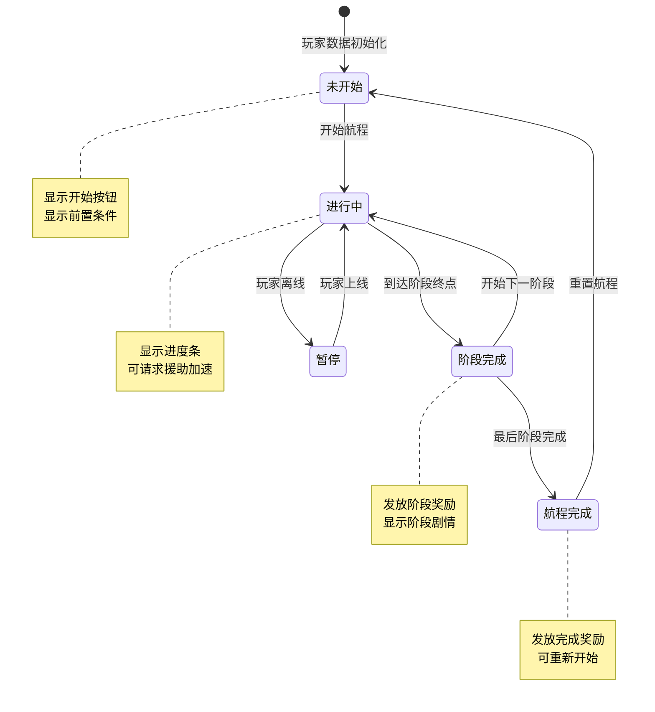
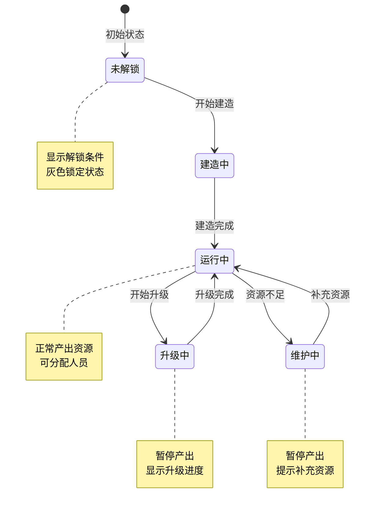
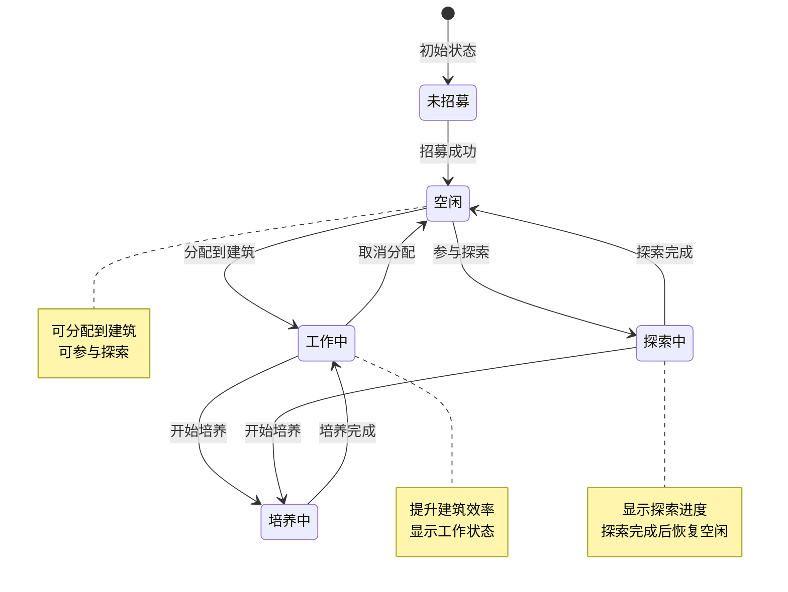
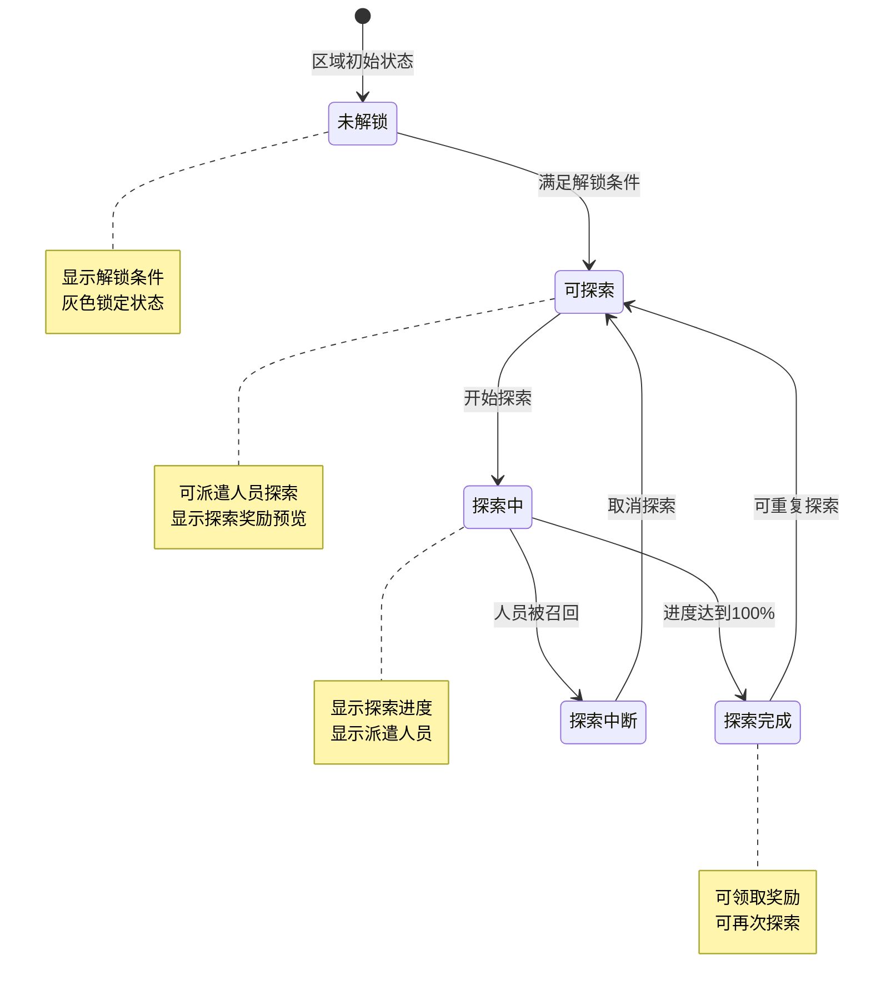
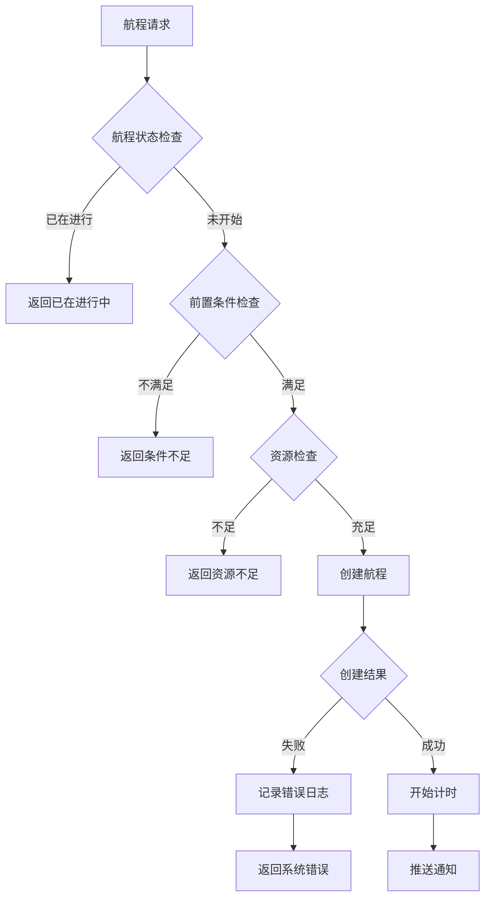

# 火星模块实现细节

## 一、计算公式

### 1.1 航程阶段时间计算

```
阶段时长 = 基础时长 × (1 - VIP加速加成) - 援助加速
实际时长 = max(阶段时长, 最小时长)
```

**参数说明**：
- `基础时长`：配置的阶段基础时长
- `VIP加速加成`：VIP等级提供的百分比加成
- `援助加速`：公会成员帮助加速的时间

**示例计算**：
```
基础时长: 3600秒 (1小时)
VIP等级: 5, 加成: 10%
援助次数: 5次, 每次加速: 60秒

阶段时长 = 3600 × (1 - 0.1) - 5 × 60 = 2940秒
实际时长 = max(2940, 600) = 2940秒
```

### 1.2 建筑产出计算

```
建筑产出 = 基础产出 × (1 + 等级加成) × (1 + 人员加成) × (1 + 科技加成)
等级加成 = 建筑等级 × 每级加成百分比
人员加成 = Σ(分配人员的工作效率) / 100
```

**示例计算**：
```
基础产出: 100矿石/小时
建筑等级: 5, 每级加成: 5%
分配人员: 工程师A(效率60) + 工程师B(效率40)
科技加成: 15%

等级加成 = 5 × 5% = 25%
人员加成 = (60 + 40) / 100 = 100%
建筑产出 = 100 × 1.25 × 2.0 × 1.15 = 287.5矿石/小时
```

### 1.3 探索成功率计算

```
成功率 = 基础成功率 × (1 + 人员能力加成) × (1 + 科技加成) × (1 + 道具加成)
人员能力加成 = Σ(派遣人员的探索能力) / 区域难度系数
```

**示例计算**：
```
基础成功率: 50%
派遣人员: 探险家A(能力80) + 探险家B(能力60)
区域难度系数: 100
科技加成: 20%

人员能力加成 = (80 + 60) / 100 = 140%
成功率 = 50% × 2.4 × 1.2 = 144% → 100% (上限)
```

### 1.4 升级费用计算

```
升级费用 = 基础费用 × (当前等级 ^ 1.5)
```

**示例计算**：
```
基础费用: 矿石×100
当前等级: 4 → 5

升级费用 = 100 × 4^1.5 = 100 × 8 = 矿石×800
```

### 1.5 科技研究时间计算

```
研究时间 = 基础时间 × (1 - 研究所等级加成) × (1 - 人员加成)
```

---

## 二、状态机定义

### 2.1 航程状态机



### 2.2 建筑状态机



### 2.3 人员状态机



### 2.4 探索状态机



---

## 三、数据约束

### 3.1 火星航程数据约束

| 字段名 | 数据类型 | 取值范围 | 必填 | 说明 |
|--------|----------|----------|------|------|
| routeId | long | > 0 | 是 | 航程唯一ID |
| playerId | long | > 0 | 是 | 玩家ID |
| currentStage | int | 1-10 | 是 | 当前阶段 |
| routeState | int | 0-3 | 是 | 状态：0未开始,1进行中,2完成,3暂停 |
| startTime | datetime | - | 否 | 开始时间 |
| stageProgress | int | 0-100 | 是 | 阶段进度百分比 |
| aidCount | int | 0-20 | 是 | 已获得援助次数 |

### 3.2 建筑数据约束

| 字段名 | 数据类型 | 取值范围 | 必填 | 说明 |
|--------|----------|----------|------|------|
| buildingId | int | > 0 | 是 | 建筑配置ID |
| playerId | long | > 0 | 是 | 玩家ID |
| level | int | 1-20 | 是 | 建筑等级 |
| state | int | 0-4 | 是 | 状态：0未解锁,1建造中,2运行中,3升级中,4维护中 |
| assignedPeople | json | - | 否 | 分配的人员ID列表 |
| position | json | - | 是 | 建筑坐标位置 |

### 3.3 人员数据约束

| 字段名 | 数据类型 | 取值范围 | 必填 | 说明 |
|--------|----------|----------|------|------|
| peopleId | int | > 0 | 是 | 人员配置ID |
| playerId | long | > 0 | 是 | 玩家ID |
| level | int | 1-50 | 是 | 人员等级 |
| workEfficiency | int | 10-200 | 是 | 工作效率 |
| exploreAbility | int | 10-200 | 是 | 探索能力 |
| researchAbility | int | 10-200 | 是 | 研究能力 |
| status | int | 0-3 | 是 | 状态：0空闲,1工作中,2探索中,3培养中 |
| assignedBuilding | int | >= 0 | 是 | 分配的建筑ID |

### 3.4 探索数据约束

| 字段名 | 数据类型 | 取值范围 | 必填 | 说明 |
|--------|----------|----------|------|------|
| exploreId | int | > 0 | 是 | 探索配置ID |
| playerId | long | > 0 | 是 | 玩家ID |
| status | int | 0-3 | 是 | 状态：0未解锁,1可探索,2探索中,3完成 |
| progress | int | 0-100 | 是 | 探索进度百分比 |
| assignedPeople | json | - | 否 | 派遣的人员列表 |
| startTime | datetime | - | 否 | 开始时间 |
| completeCount | int | >= 0 | 是 | 完成次数 |

### 3.5 状态枚举定义

**航程状态枚举**：
| 状态值 | 状态名 | 说明 |
|--------|--------|------|
| 0 | NOT_STARTED | 未开始 |
| 1 | IN_PROGRESS | 进行中 |
| 2 | COMPLETED | 已完成 |
| 3 | PAUSED | 暂停 |

**建筑状态枚举**：
| 状态值 | 状态名 | 说明 |
|--------|--------|------|
| 0 | LOCKED | 未解锁 |
| 1 | BUILDING | 建造中 |
| 2 | RUNNING | 运行中 |
| 3 | UPGRADING | 升级中 |
| 4 | MAINTENANCE | 维护中 |

---

## 四、错误处理策略

### 4.1 火星模块错误码

| 错误码 | 错误信息 | 处理策略 | 用户提示 |
|--------|----------|----------|----------|
| 38001 | 航程已在进行中 | 检查航程状态 | "航程已在进行中" |
| 38002 | 航程未开始 | 检查航程状态 | "请先开始航程" |
| 38003 | 阶段条件不满足 | 检查阶段条件 | "条件不满足，无法到达该阶段" |
| 38004 | 建筑未解锁 | 检查建筑状态 | "该建筑尚未解锁" |
| 38005 | 建筑已达最高等级 | 检查等级配置 | "建筑已达最高等级" |
| 38006 | 人员已被分配 | 检查人员状态 | "该人员已被分配到其他建筑" |
| 38007 | 探索区域未解锁 | 检查区域状态 | "该探索区域尚未解锁" |
| 38008 | 探索人数已满 | 检查探索配置 | "该区域探索人数已满" |
| 38009 | 资源不足 | 检查玩家资源 | "资源不足，无法操作" |
| 38010 | 前置条件不满足 | 检查前置条件 | "前置条件不满足" |

### 4.2 航程错误处理流程



### 4.3 异常场景处理

| 异常场景 | 处理策略 | 数据回滚 |
|----------|----------|----------|
| 航程中断 | 保存当前进度，暂停计时 | 否 |
| 建筑升级失败 | 回滚已扣除资源 | 是 |
| 探索失败 | 部分奖励，记录日志 | 否 |
| 人员分配冲突 | 返回冲突提示，保持原状态 | 否 |

---

## 五、关键代码示例

### 5.1 开始航程伪代码

```java
public Result startToGoMars(long playerId) {
    // 1. 检查是否有进行中的航程
    PlayerMarsRoute route = marsRouteDao.selectByPlayerId(playerId);
    if (route != null && route.getRouteState() == RouteState.IN_PROGRESS) {
        return Result.error(38001, "航程已在进行中");
    }

    // 2. 检查前置条件
    PlayerInfo player = playerDao.selectById(playerId);
    if (player.getLevel() < MIN_LEVEL) {
        return Result.error(38010, "等级不足");
    }

    // 3. 创建航程
    if (route == null) {
        route = new PlayerMarsRoute();
        route.setRouteId(idGenerator.nextId());
        route.setPlayerId(playerId);
    }

    route.setCurrentStage(1);
    route.setRouteState(RouteState.IN_PROGRESS);
    route.setStartTime(new Date());
    route.setStageProgress(0);
    route.setAidCount(0);

    marsRouteDao.saveOrUpdate(route);

    // 4. 推送通知
    pushMarsStart(playerId, route);

    return Result.success(route);
}
```

### 5.2 到达阶段伪代码

```java
public Result arriveStage(long playerId, int stage) {
    // 1. 获取航程信息
    PlayerMarsRoute route = marsRouteDao.selectByPlayerId(playerId);
    if (route == null || route.getRouteState() != RouteState.IN_PROGRESS) {
        return Result.error(38002, "航程未开始");
    }

    // 2. 检查阶段顺序
    if (stage != route.getCurrentStage() + 1 && stage != route.getCurrentStage()) {
        return Result.error(38003, "阶段顺序错误");
    }

    // 3. 检查阶段进度
    if (route.getStageProgress() < 100) {
        return Result.error(38003, "阶段进度未完成");
    }

    // 4. 更新阶段
    route.setCurrentStage(stage);
    route.setStageProgress(0);
    route.setAidCount(0);
    marsRouteDao.updateById(route);

    // 5. 发放阶段奖励
    MarsStageConfig stageConfig = stageConfigDao.getByStage(stage - 1);
    if (stageConfig.getRewardList() != null) {
        rewardService.giveRewards(playerId, stageConfig.getRewardList());
    }

    // 6. 检查是否完成
    MarsRouteConfig routeConfig = routeConfigDao.getById(route.getRouteId());
    if (stage >= routeConfig.getStageCount()) {
        route.setRouteState(RouteState.COMPLETED);
        marsRouteDao.updateById(route);

        // 发放完成奖励
        rewardService.giveRewards(playerId, routeConfig.getCompleteRewardList());
    }

    // 7. 推送通知
    pushStageArrived(playerId, route);

    return Result.success(route);
}
```

### 5.3 建筑升级伪代码

```java
public Result upgradeBuilding(long playerId, int buildingId) {
    // 1. 获取建筑信息
    PlayerMarsBuilding building = marsBuildingDao.selectByPlayerAndId(playerId, buildingId);
    if (building == null) {
        return Result.error(38004, "建筑未解锁");
    }

    // 2. 检查等级上限
    MarsBuildingConfig config = buildingConfigDao.getById(buildingId);
    if (building.getLevel() >= config.getMaxLevel()) {
        return Result.error(38005, "建筑已达最高等级");
    }

    // 3. 计算升级费用
    Map<Integer, Integer> costMap = calculateUpgradeCost(config, building.getLevel());

    // 4. 检查资源
    for (Map.Entry<Integer, Integer> entry : costMap.entrySet()) {
        int resourceId = entry.getKey();
        int cost = entry.getValue();
        if (!resourceService.hasEnough(playerId, resourceId, cost)) {
            return Result.error(38009, "资源不足");
        }
    }

    // 5. 扣除资源
    for (Map.Entry<Integer, Integer> entry : costMap.entrySet()) {
        resourceService.cost(playerId, entry.getKey(), entry.getValue(), "建筑升级");
    }

    // 6. 升级建筑
    building.setLevel(building.getLevel() + 1);
    marsBuildingDao.updateById(building);

    // 7. 推送通知
    pushBuildingUpgraded(playerId, building);

    return Result.success(building);
}
```

### 5.4 人员分配伪代码

```java
public Result assignPeople(long playerId, int peopleId, int buildingId) {
    // 1. 获取人员信息
    PlayerMarsPeople people = marsPeopleDao.selectByPlayerAndId(playerId, peopleId);
    if (people == null) {
        return Result.error(38006, "人员不存在");
    }

    // 2. 检查建筑
    PlayerMarsBuilding building = marsBuildingDao.selectByPlayerAndId(playerId, buildingId);
    if (building == null || building.getState() != BuildingState.RUNNING) {
        return Result.error(38004, "建筑未解锁或未运行");
    }

    // 3. 检查建筑人员上限
    MarsBuildingConfig config = buildingConfigDao.getById(buildingId);
    List<Integer> currentPeople = JsonUtils.parseList(building.getAssignedPeople(), Integer.class);
    if (currentPeople.size() >= config.getMaxPeople()) {
        return Result.error(38008, "建筑人员已满");
    }

    // 4. 取消原分配
    if (people.getAssignedBuilding() > 0 && people.getAssignedBuilding() != buildingId) {
        removeFromBuilding(playerId, people.getAssignedBuilding(), peopleId);
    }

    // 5. 分配到新建筑
    currentPeople.add(peopleId);
    building.setAssignedPeople(JsonUtils.toJson(currentPeople));
    marsBuildingDao.updateById(building);

    people.setStatus(PeopleStatus.WORKING);
    people.setAssignedBuilding(buildingId);
    marsPeopleDao.updateById(people);

    // 6. 推送通知
    pushPeopleAssigned(playerId, people, building);

    return Result.success();
}
```

### 5.5 开始探索伪代码

```java
public Result startExplore(long playerId, int exploreId, List<Integer> peopleIds) {
    // 1. 获取探索区域信息
    PlayerMarsExplore explore = marsExploreDao.selectByPlayerAndId(playerId, exploreId);
    if (explore == null || explore.getStatus() == ExploreStatus.LOCKED) {
        return Result.error(38007, "探索区域未解锁");
    }

    if (explore.getStatus() == ExploreStatus.IN_PROGRESS) {
        return Result.error(38001, "探索已在进行中");
    }

    // 2. 检查人员
    MarsExploreConfig config = exploreConfigDao.getById(exploreId);
    if (peopleIds.size() > config.getMaxPeople()) {
        return Result.error(38008, "探索人数超过上限");
    }

    for (Integer peopleId : peopleIds) {
        PlayerMarsPeople people = marsPeopleDao.selectByPlayerAndId(playerId, peopleId);
        if (people == null || people.getStatus() != PeopleStatus.IDLE) {
            return Result.error(38006, "人员不可用");
        }
    }

    // 3. 开始探索
    explore.setStatus(ExploreStatus.IN_PROGRESS);
    explore.setProgress(0);
    explore.setAssignedPeople(JsonUtils.toJson(peopleIds));
    explore.setStartTime(new Date());
    marsExploreDao.updateById(explore);

    // 4. 更新人员状态
    for (Integer peopleId : peopleIds) {
        PlayerMarsPeople people = marsPeopleDao.selectByPlayerAndId(playerId, peopleId);
        people.setStatus(PeopleStatus.EXPLORING);
        marsPeopleDao.updateById(people);
    }

    // 5. 推送通知
    pushExploreStarted(playerId, explore);

    return Result.success(explore);
}
```

---

## 六、跨模块依赖

### 6.1 依赖模块

| 模块名称 | 依赖类型 | 依赖说明 |
|----------|----------|----------|
| PlayerOp | 数据依赖 | 获取玩家等级、资源 |
| GuildRelatedOp | 功能依赖 | 公会援助加速 |
| BagOp | 功能依赖 | 奖励发放到背包 |

### 6.2 被依赖说明

火星模块为独立探索玩法，其他模块通过以下方式使用：

```java
// 获取火星进度
int stage = MarsModule.getCurrentStage(playerId);

// 检查区域是否解锁
boolean unlocked = MarsModule.isAreaUnlocked(playerId, areaId);

// 获取建筑等级
int level = MarsModule.getBuildingLevel(playerId, buildingId);
```

### 6.3 事件订阅

| 事件名称 | 处理逻辑 |
|----------|----------|
| 玩家等级提升 | 检查解锁新建筑/区域 |
| 每日重置 | 重置探索次数 |
| 航程完成 | 解锁新内容 |

---

*文档生成时间: 2026-04-07*
