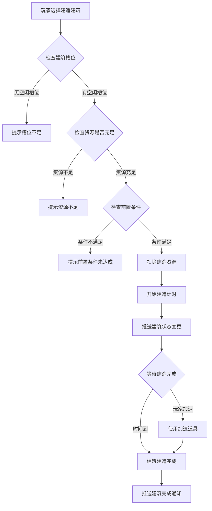
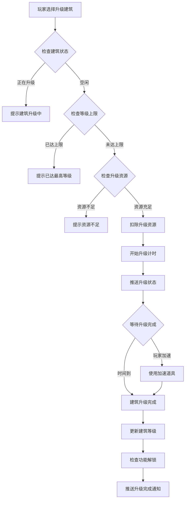
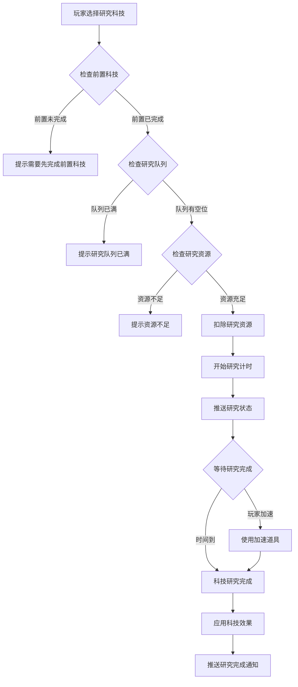
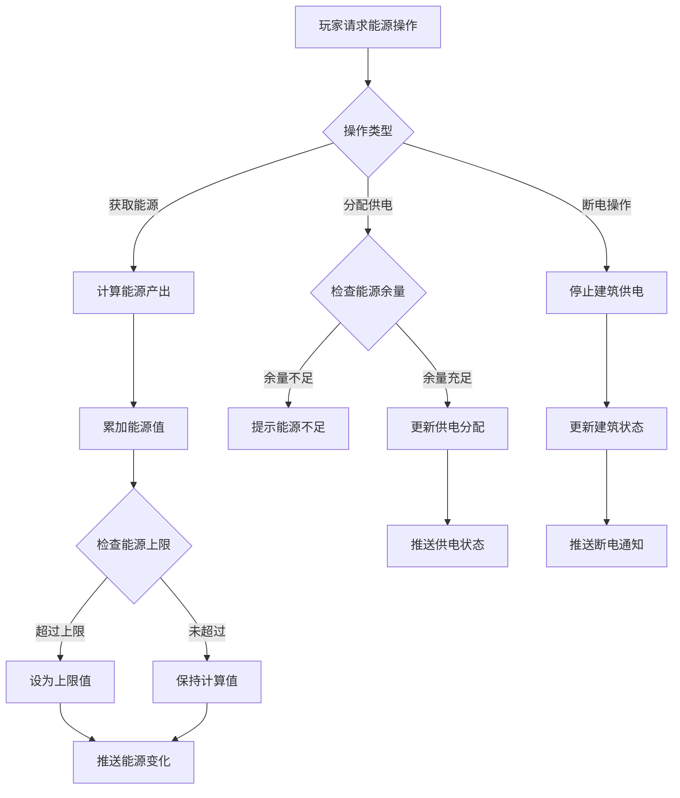

# 火星建筑模块完整说明

## 一、模块概述

### 1.1 业务背景

火星建筑模块是 K2C 游戏火星玩法核心模块之一，负责管理玩家火星基地的建筑系统。玩家可以在火星上建造、升级各类功能性建筑，发展科技研究，管理能源供应，形成完整的火星殖民地生态系统。

### 1.2 目标用户

- **所有解锁火星玩法的玩家**：等级达到要求后解锁火星建筑功能
- **策略型玩家**：通过合理规划建筑布局和升级顺序获得优势
- **长期养成玩家**：通过持续升级建筑和科技获得长期收益

### 1.3 核心价值

1. **基地建设**：提供完整的火星基地建设体验
2. **资源生产**：通过建筑产出各类资源和能源
3. **科技发展**：科技研究系统增强整体实力
4. **能源管理**：供电分配策略增加游戏深度

---

## 二、功能清单

### 2.1 建筑管理功能

| 功能名称 | 功能描述 | 用户价值 |
|---------|---------|---------|
| 建筑创建 | 创建新的火星建筑 | 扩展基地规模 |
| 建筑升级 | 提升建筑等级 | 增强建筑效果 |
| 取消升级 | 取消正在进行的升级 | 灵活调整策略 |
| 加速建造 | 使用道具或钻石加速 | 节省等待时间 |

### 2.2 科技研究功能

| 功能名称 | 功能描述 | 用户价值 |
|---------|---------|---------|
| 科技研究 | 研究各类科技 | 提升整体能力 |
| 取消研究 | 取消正在进行的研究 | 灵活调整方向 |
| 加速研究 | 使用道具加速研究 | 快速获得科技效果 |

### 2.3 能源管理功能

| 功能名称 | 功能描述 | 用户价值 |
|---------|---------|---------|
| 能源生产 | 发电建筑产生能源 | 供应基地运作 |
| 能源分配 | 为不同建筑供电 | 优化资源利用 |
| 断电操作 | 停止某建筑供电 | 灵活管理能源 |

### 2.4 产出收集功能

| 功能名称 | 功能描述 | 用户价值 |
|---------|---------|---------|
| 产出收集 | 收集建筑产出的资源 | 获取资源收益 |
| 产出查看 | 查看各建筑产出状态 | 了解生产情况 |

---

## 三、业务流程详解

### 3.1 建筑创建流程



**详细步骤说明**：

1. **条件检查**
   - 验证是否有空闲建筑槽位
   - 验证玩家等级是否满足要求
   - 验证前置建筑是否已建造

2. **资源扣除**
   - 扣除建造所需的各类资源
   - 记录资源消耗日志

3. **建造过程**
   - 开始建造计时
   - 推送建造状态给客户端

4. **完成处理**
   - 建筑进入可用状态
   - 如有首建奖励则发放

### 3.2 建筑升级流程



**详细步骤说明**：

1. **状态验证**
   - 建筑必须处于空闲状态
   - 未达到等级上限

2. **资源消耗**
   - 扣除升级所需资源
   - 资源类型和数量由配置表决定

3. **升级效果**
   - 建筑属性提升
   - 可能解锁新功能

### 3.3 科技研究流程



**详细步骤说明**：

1. **前置检查**
   - 检查前置科技是否已研究
   - 检查科技是否已达到等级上限

2. **研究过程**
   - 扣除研究资源
   - 开始研究计时

3. **效果应用**
   - 科技效果全局生效
   - 更新玩家属性加成

### 3.4 能源管理流程



**详细步骤说明**：

1. **能源产出**
   - 发电建筑按配置产出能源
   - 能源有存储上限

2. **能源分配**
   - 为建筑分配供电
   - 能源消耗建筑需要供电才能运作

3. **断电效果**
   - 断电建筑停止产出
   - 断电建筑无法进行升级操作

---

## 四、关键规则

### 4.1 建筑规则

1. **建造限制**
   - 建筑槽位有上限，可通过升级基地扩展
   - 不同建筑有不同的解锁条件

2. **升级规则**
   - 建筑等级上限由建筑类型决定
   - 升级时间和消耗随等级递增

3. **建筑类型**
   - 住宅建筑：增加人口上限
   - 食物建筑：产出食物资源
   - 能源建筑：产出能源
   - 科研建筑：提供科技研究加成
   - 防御建筑：提供防御能力

### 4.2 科技规则

1. **研究规则**
   - 科技有前置依赖关系
   - 同一时间只能研究有限数量的科技

2. **科技效果**
   - 科技效果为永久加成
   - 科技等级越高效果越强

### 4.3 能源规则

1. **能源产出**
   - 发电建筑按时间产出能源
   - 能源存储有上限

2. **能源消耗**
   - 部分建筑需要消耗能源才能运作
   - 能源不足时建筑停止运作

---

## 五、用户故事

### 5.1 新手玩家故事

> 作为一名刚解锁火星玩法的玩家，我进入火星基地后看到一片空旷的土地。按照引导，我建造了第一个发电站，看着建筑一点点建造完成，我的基地开始运转起来。发电站建成后，我立即建造了食物生产设施，看着食物资源开始累积，我对未来的基地发展充满期待。

### 5.2 策略玩家故事

> 作为一名策略型玩家，我仔细规划着我的火星基地。首先确保能源供应充足，建造了多座发电站。然后根据需求建造食物建筑和科研设施。在科技研究方面，我优先研究资源产出加成科技，让我的基地发展效率大大提升。合理的建筑布局和供电分配让我的基地资源产出最大化。

### 5.3 高级玩家故事

> 作为一名高级玩家，我的火星基地已经相当完善。所有主要建筑都已升至满级，科技树也研究了大半。现在我专注于优化供电分配，在活动期间开启所有建筑全力产出。我还使用加速道具快速完成科技研究，追求更高的效率。

---

## 六、示例

### 6.1 建筑创建示例

**输入数据**：
- 玩家等级：20
- 选择建筑：发电站（建筑ID: 101）
- 建造位置：槽位 #3

**建造条件检查**：
```
槽位状态：空闲
玩家等级：20 >= 15（需求等级）
前置条件：已建造指挥中心
资源消耗：铁矿 × 500、能源核心 × 10
```

**建造结果**：
```
建筑ID：10001
建筑类型：发电站
状态：建造中
剩余时间：30分钟
预计完成时间：2026-04-06 14:30:00
```

### 6.2 建筑升级示例

**初始状态**：
```
建筑：食物工厂（ID: 10002）
当前等级：3
状态：空闲
```

**升级操作**：
```
目标等级：4
升级消耗：铁矿 × 1000、食物 × 500
升级时间：2小时
```

**升级结果**：
```
建筑等级：4
产出提升：50 → 75（+50%）
状态：升级中
剩余时间：2小时
```

### 6.3 科技研究示例

**初始状态**：
```
科技：资源产出强化
当前等级：0
前置科技：无
```

**研究操作**：
```
研究消耗：研究点数 × 100、能源 × 200
研究时间：4小时
```

**研究结果**：
```
科技等级：1
效果：所有资源产出 +5%
状态：研究中
剩余时间：4小时
```

---

*文档生成时间: 2026-04-07*
