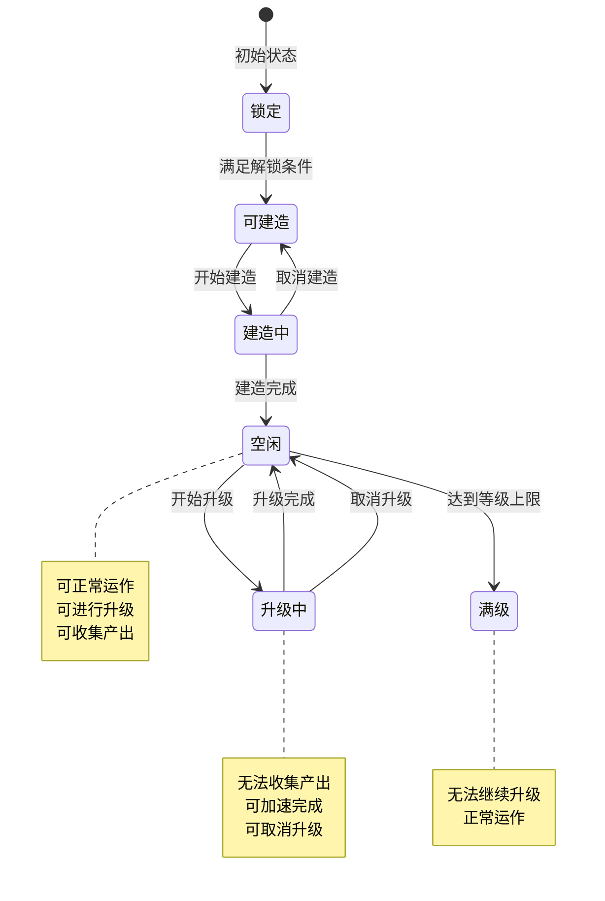
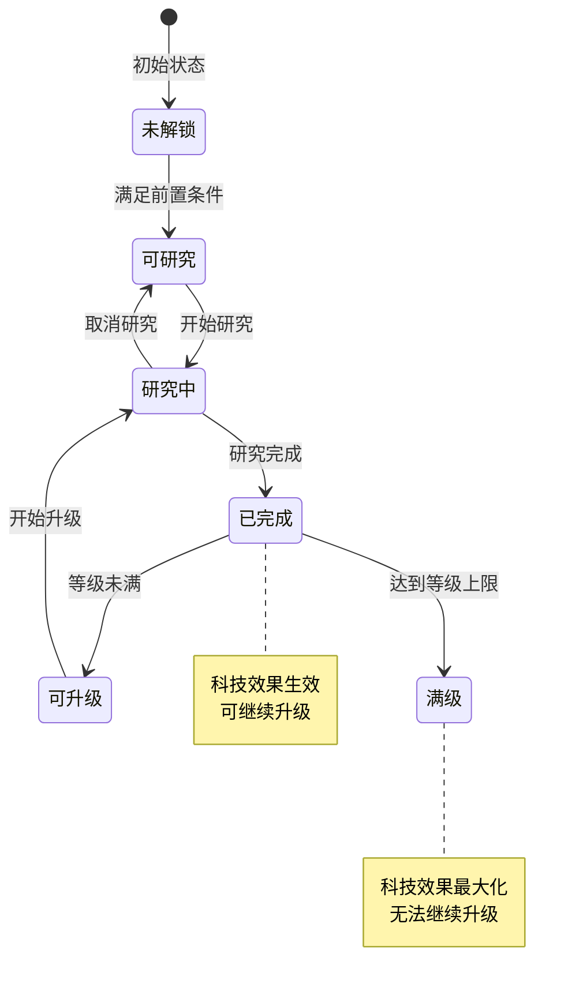
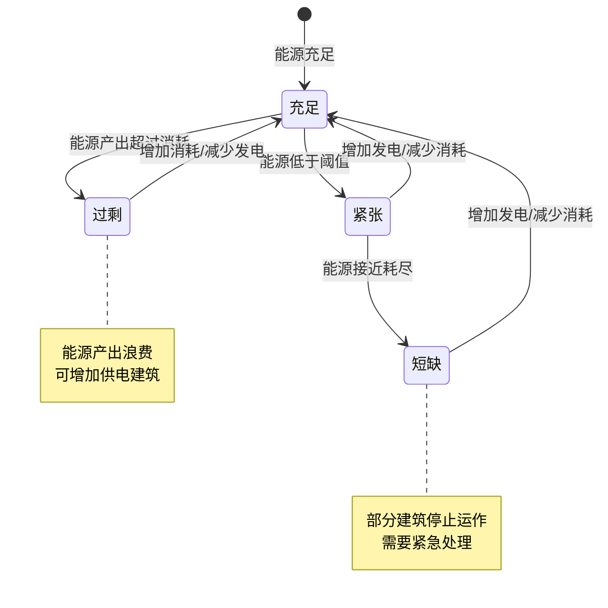
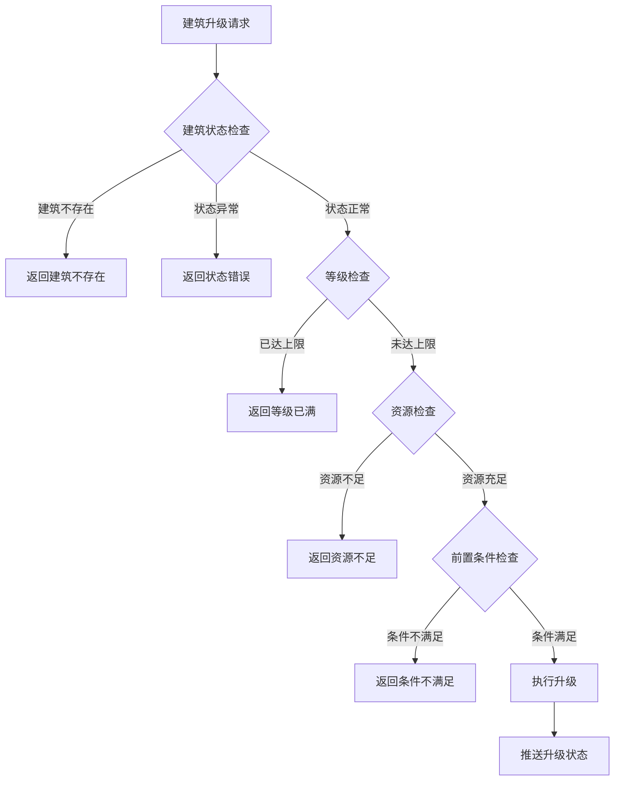

# 火星建筑模块实现细节

## 一、计算公式

### 1.1 建筑升级时间计算公式

```
升级时间 = base_time × (1 + level × time_ratio)
```

**参数说明**：
- `base_time`：基础升级时间（秒）
- `level`：目标等级
- `time_ratio`：时间递增系数

**示例计算**：
```
base_time = 1800（30分钟）
time_ratio = 0.2

3级升4级时间：1800 × (1 + 3 × 0.2) = 1800 × 1.6 = 2880秒（48分钟）
5级升6级时间：1800 × (1 + 5 × 0.2) = 1800 × 2.0 = 3600秒（60分钟）
10级升11级时间：1800 × (1 + 10 × 0.2) = 1800 × 3.0 = 5400秒（90分钟）
```

### 1.2 建筑升级消耗计算公式

```
消耗资源 = base_cost × level ^ cost_ratio
```

**参数说明**：
- `base_cost`：基础消耗（配置表）
- `level`：目标等级
- `cost_ratio`：消耗系数（通常为 1.3-1.5）

**示例计算**：
```
base_cost = 100
cost_ratio = 1.4

3级升4级消耗：100 × 3^1.4 = 100 × 4.66 ≈ 466
5级升6级消耗：100 × 5^1.4 = 100 × 9.52 ≈ 952
10级升11级消耗：100 × 10^1.4 = 100 × 25.12 ≈ 2512
```

### 1.3 建筑产出计算公式

```
实际产出 = base_output × (1 + level_bonus × level) × (1 + tech_bonus) × (1 + buff_bonus)
```

**参数说明**：
- `base_output`：基础产出（配置表）
- `level_bonus`：等级加成系数
- `tech_bonus`：科技加成比例
- `buff_bonus`：Buff加成比例

**示例计算**：
```
base_output = 10（单位/小时）
level_bonus = 0.1（每级+10%）
tech_bonus = 0.15（科技+15%）
buff_bonus = 0.05（Buff+5%）
建筑等级 = 5

实际产出 = 10 × (1 + 0.1 × 5) × (1 + 0.15) × (1 + 0.05)
        = 10 × 1.5 × 1.15 × 1.05
        = 18.11 单位/小时
```

### 1.4 能源计算公式

```
净能源 = 总发电量 - 总消耗量
```

**详细计算**：
```
总发电量 = Σ(每个发电建筑的发电量)
总消耗量 = Σ(每个供电建筑的消耗量)

发电建筑发电量 = base_power × (1 + level_bonus × level)
消耗建筑消耗量 = base_consume × (1 + level_factor × level)
```

### 1.5 科技研究时间计算公式

```
研究时间 = base_time × (1 + level × research_ratio)
```

**示例计算**：
```
base_time = 3600（1小时）
research_ratio = 0.3

科技等级0→1：3600 × (1 + 0 × 0.3) = 3600秒（1小时）
科技等级2→3：3600 × (1 + 2 × 0.3) = 3600 × 1.6 = 5760秒（1.6小时）
```

---

## 二、状态机定义

### 2.1 建筑状态机



### 2.2 科技状态机



### 2.3 能源状态机



---

## 三、数据约束

### 3.1 建筑数据约束

| 字段名 | 数据类型 | 取值范围 | 必填 | 唯一性 | 说明 |
|--------|----------|----------|------|--------|------|
| buildingId | long | > 0 | 是 | 是 | 建筑唯一ID |
| buildingType | int | 1-5 | 是 | 否 | 建筑类型 |
| configId | int | > 0 | 是 | 否 | 配置ID |
| level | int | 1-50 | 是 | 否 | 当前等级 |
| state | int | 0-2 | 是 | 否 | 状态：0空闲,1建造中,2升级中 |
| slotIndex | int | 0-19 | 是 | 否 | 槽位索引 |
| upgradeEndTime | datetime | - | 否 | 否 | 升级结束时间 |
| createTime | datetime | - | 是 | 否 | 创建时间 |

### 3.2 科技数据约束

| 字段名 | 数据类型 | 取值范围 | 必填 | 唯一性 | 说明 |
|--------|----------|----------|------|--------|------|
| techId | int | > 0 | 是 | 是 | 科技ID |
| level | int | 0-10 | 是 | 否 | 当前等级 |
| state | int | 0-2 | 是 | 否 | 状态：0未研究,1研究中,2已完成 |
| researchEndTime | datetime | - | 否 | 否 | 研究结束时间 |
| startTime | datetime | - | 否 | 否 | 开始研究时间 |

### 3.3 能源数据约束

| 字段名 | 数据类型 | 取值范围 | 必填 | 说明 |
|--------|----------|----------|------|------|
| energyType | int | 1-3 | 是 | 能源类型 |
| currentEnergy | long | >= 0 | 是 | 当前能源量 |
| maxEnergy | long | > 0 | 是 | 最大能源量 |
| outputRate | long | >= 0 | 是 | 产出速率（/小时） |
| consumeRate | long | >= 0 | 是 | 消耗速率（/小时） |

---

## 四、错误处理策略

### 4.1 建筑模块错误码

| 错误码 | 错误信息 | 处理策略 | 用户提示 |
|--------|----------|----------|----------|
| 39001 | 建筑不存在 | 检查建筑ID有效性 | "建筑数据异常，请刷新重试" |
| 39002 | 建筑槽位不足 | 检查槽位状态 | "建筑槽位不足，请先扩建" |
| 39003 | 建筑正在升级 | 检查建筑状态 | "建筑正在升级中" |
| 39004 | 建筑等级已满 | 检查等级上限 | "该建筑已达最高等级" |
| 39005 | 升级资源不足 | 检查资源数量 | "资源不足，无法升级" |
| 39006 | 前置条件未满足 | 检查前置条件 | "请先完成前置条件" |
| 39007 | 科技正在研究 | 检查科技状态 | "该科技正在研究中" |
| 39008 | 前置科技未完成 | 检查科技依赖 | "请先完成前置科技" |
| 39009 | 能源不足 | 检查能源余量 | "能源不足，请先补充能源" |
| 39010 | 建筑已断电 | 检查供电状态 | "该建筑已断电，无法操作" |

### 4.2 建筑升级错误处理流程



### 4.3 科技研究错误处理

| 研究状态 | 处理策略 | 允许操作 |
|----------|----------|----------|
| 未解锁 | 检查解锁条件，提示缺失条件 | 无 |
| 可研究 | 正常处理研究请求 | 开始研究 |
| 研究中 | 提示正在研究，显示进度 | 取消研究、加速研究 |
| 已完成 | 提示已完成，可继续升级 | 开始升级（未满级） |

---

## 五、关键代码示例

### 5.1 建筑创建伪代码

```csharp
public Result CreateBuilding(long playerId, int configId, int slotIndex)
{
    // 1. 检查槽位
    MarsBuildingData data = marsBuildingMgr.GetPlayerData(playerId);
    if (slotIndex < 0 || slotIndex >= data.maxSlots)
        return Result.Error(39002, "建筑槽位不足");

    if (data.buildings.Any(b => b.slotIndex == slotIndex))
        return Result.Error(39002, "该槽位已有建筑");

    // 2. 获取配置
    BuildingConfig config = buildingConfigMgr.Get(configId);
    if (config == null)
        return Result.Error(39001, "建筑配置不存在");

    // 3. 检查前置条件
    if (!CheckPrecondition(playerId, config.precondition))
        return Result.Error(39006, "前置条件未满足");

    // 4. 检查资源
    if (!resourceMgr.HasEnough(playerId, config.buildCost))
        return Result.Error(39005, "升级资源不足");

    // 5. 扣除资源
    resourceMgr.Cost(playerId, config.buildCost, "建筑建造");

    // 6. 创建建筑
    MarsBuilding building = new MarsBuilding {
        buildingId = idGenerator.NextId(),
        buildingType = config.buildingType,
        configId = configId,
        level = 1,
        state = BuildingState.Building,
        slotIndex = slotIndex,
        createTime = DateTime.Now,
        upgradeEndTime = DateTime.Now.AddSeconds(config.buildTime)
    };

    // 7. 保存数据
    data.buildings.Add(building);
    marsBuildingMgr.UpdateData(playerId, data);

    // 8. 推送状态
    PushBuildingChg(playerId, building);

    return Result.Success(building);
}
```

### 5.2 建筑升级伪代码

```csharp
public Result UpgradeBuilding(long playerId, long buildingId)
{
    // 1. 获取建筑数据
    MarsBuilding building = marsBuildingMgr.GetBuilding(playerId, buildingId);
    if (building == null)
        return Result.Error(39001, "建筑不存在");

    // 2. 检查状态
    if (building.state == BuildingState.Upgrading)
        return Result.Error(39003, "建筑正在升级中");

    // 3. 检查等级上限
    BuildingConfig config = buildingConfigMgr.Get(building.configId);
    if (building.level >= config.maxLevel)
        return Result.Error(39004, "建筑等级已满");

    // 4. 计算升级消耗
    UpgradeCost cost = CalculateUpgradeCost(config, building.level);

    // 5. 检查资源
    if (!resourceMgr.HasEnough(playerId, cost))
        return Result.Error(39005, "升级资源不足");

    // 6. 扣除资源
    resourceMgr.Cost(playerId, cost, "建筑升级");

    // 7. 开始升级
    int upgradeTime = CalculateUpgradeTime(config, building.level);
    building.state = BuildingState.Upgrading;
    building.upgradeEndTime = DateTime.Now.AddSeconds(upgradeTime);

    // 8. 保存并推送
    marsBuildingMgr.UpdateBuilding(playerId, building);
    PushBuildingChg(playerId, building);

    return Result.Success(new { upgradeTime = upgradeTime });
}
```

### 5.3 科技研究伪代码

```csharp
public Result ResearchTechnology(long playerId, int techId)
{
    // 1. 获取科技数据
    MarsTechnologyData data = marsTechMgr.GetPlayerData(playerId);
    MarsTechnology tech = data.technologies.FirstOrDefault(t => t.techId == techId);

    // 2. 检查前置科技
    TechConfig config = techConfigMgr.Get(techId);
    foreach (int preTechId in config.preTechIds)
    {
        MarsTechnology preTech = data.technologies.FirstOrDefault(t => t.techId == preTechId);
        if (preTech == null || preTech.state != TechState.Completed)
            return Result.Error(39008, "前置科技未完成");
    }

    // 3. 检查研究队列
    int researchingCount = data.technologies.Count(t => t.state == TechState.Researching);
    if (researchingCount >= data.maxResearchQueue)
        return Result.Error(39007, "研究队列已满");

    // 4. 计算研究消耗
    ResearchCost cost = CalculateResearchCost(config, tech?.level ?? 0);

    // 5. 检查资源
    if (!resourceMgr.HasEnough(playerId, cost))
        return Result.Error(39005, "研究资源不足");

    // 6. 扣除资源
    resourceMgr.Cost(playerId, cost, "科技研究");

    // 7. 开始研究
    int researchTime = CalculateResearchTime(config, tech?.level ?? 0);
    if (tech == null)
    {
        tech = new MarsTechnology {
            techId = techId,
            level = 0,
            state = TechState.Researching,
            researchEndTime = DateTime.Now.AddSeconds(researchTime)
        };
        data.technologies.Add(tech);
    }
    else
    {
        tech.state = TechState.Researching;
        tech.researchEndTime = DateTime.Now.AddSeconds(researchTime);
    }

    // 8. 保存并推送
    marsTechMgr.UpdateData(playerId, data);
    PushTechnologyChg(playerId, tech);

    return Result.Success(new { researchTime = researchTime });
}
```

### 5.4 能源管理伪代码

```csharp
public void UpdateEnergy(long playerId)
{
    MarsEnergyData energyData = marsEnergyMgr.GetPlayerData(playerId);

    // 计算总发电量
    long totalPower = 0;
    foreach (var building in GetPowerBuildings(playerId))
    {
        if (building.state == BuildingState.Idle)
        {
            totalPower += CalculatePowerOutput(building);
        }
    }

    // 计算总消耗量
    long totalConsume = 0;
    foreach (var building in GetPoweredBuildings(playerId))
    {
        if (building.isPowered && building.state == BuildingState.Idle)
        {
            totalConsume += CalculatePowerConsume(building);
        }
    }

    // 更新能源状态
    energyData.outputRate = totalPower;
    energyData.consumeRate = totalConsume;

    // 计算净变化
    long netChange = totalPower - totalConsume;
    long newEnergy = energyData.currentEnergy + netChange;

    // 限制范围
    energyData.currentEnergy = Math.Max(0, Math.Min(newEnergy, energyData.maxEnergy));

    // 检查是否需要断电
    if (energyData.currentEnergy <= 0 && netChange < 0)
    {
        HandlePowerShortage(playerId);
    }

    marsEnergyMgr.UpdateData(playerId, energyData);
    PushEnergyChg(playerId, energyData);
}
```

### 5.5 加速完成伪代码

```csharp
public Result AccelerateBuilding(long playerId, long buildingId, int itemId)
{
    MarsBuilding building = marsBuildingMgr.GetBuilding(playerId, buildingId);
    if (building == null)
        return Result.Error(39001, "建筑不存在");

    if (building.state != BuildingState.Upgrading && building.state != BuildingState.Building)
        return Result.Error(39003, "建筑不在进行中");

    // 计算剩余时间
    int remainSeconds = (int)(building.upgradeEndTime - DateTime.Now).TotalSeconds;
    if (remainSeconds <= 0)
        return Result.Error(39001, "建筑已完成");

    // 使用加速道具
    ItemConfig itemConfig = itemConfigMgr.Get(itemId);
    int reduceSeconds = itemConfig.effectValue;

    if (reduceSeconds >= remainSeconds)
    {
        // 直接完成
        FinishBuilding(playerId, buildingId);
    }
    else
    {
        // 减少时间
        building.upgradeEndTime = building.upgradeEndTime.AddSeconds(-reduceSeconds);
        marsBuildingMgr.UpdateBuilding(playerId, building);
        PushBuildingChg(playerId, building);
    }

    // 扣除道具
    bagMgr.UseItem(playerId, itemId, 1, "建筑加速");

    return Result.Success();
}
```

---

## 六、跨模块依赖

### 6.1 依赖模块

| 模块名称 | 依赖方式 | 说明 |
|----------|----------|------|
| Module_Player | 资源消耗 | 建造升级消耗玩家资源 |
| Module_NPResource | 资源检查 | 检查资源是否充足 |
| Module_MarsExplore | 数据联动 | 探索获取建造材料 |
| Module_MarsPeople | 人口关联 | 住宅建筑增加人口上限 |

### 6.2 被依赖模块

| 模块名称 | 依赖方式 | 说明 |
|----------|----------|------|
| Module_MarsExplore | 建筑解锁 | 部分探索需要特定建筑 |
| Module_MarsPeople | 建筑支持 | 居民需要建筑支持 |

---

*文档生成时间: 2026-04-07*
