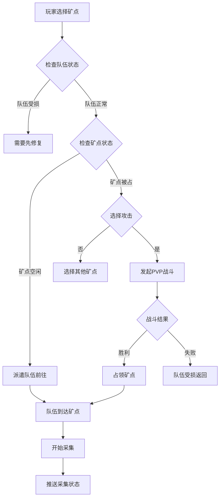
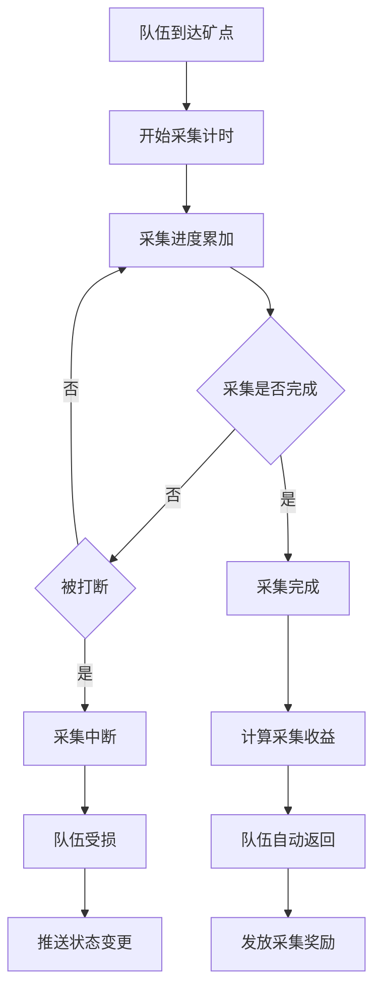
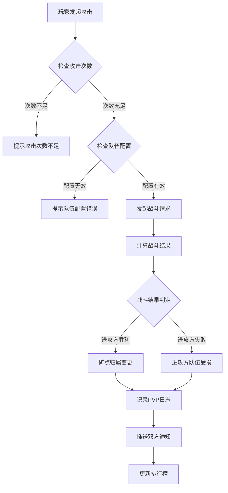
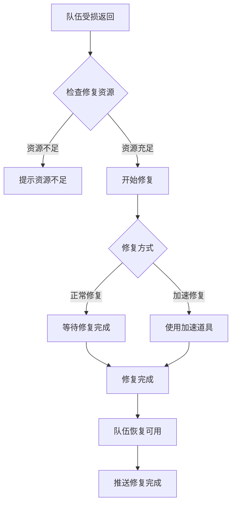
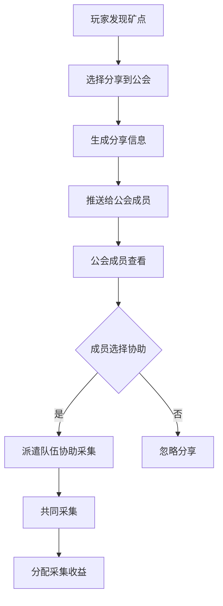

# 火星探索模块完整说明

## 一、模块概述

### 1.1 业务背景

火星探索模块是 K2C 游戏火星玩法的核心玩法之一，负责管理玩家的探索队伍、矿点采集和 PVP 战斗。玩家可以派遣探索队伍前往火星各处矿点进行资源采集，也可以攻击其他玩家占领的矿点，形成竞争与合作的动态游戏生态。

### 1.2 目标用户

- **所有解锁火星玩法的玩家**：等级达到要求后解锁探索功能
- **资源型玩家**：通过采集获取稀有资源
- **竞技型玩家**：通过 PVP 战斗掠夺资源
- **社交型玩家**：通过公会分享与合作获取收益

### 1.3 核心价值

1. **资源获取**：通过探索采集获取各类稀有资源
2. **竞技对抗**：PVP 玩法增加游戏竞争性
3. **社交合作**：公会分享机制促进玩家协作
4. **策略深度**：队伍配置和矿点选择提供策略空间

---

## 二、功能清单

### 2.1 探索队伍功能

| 功能名称 | 功能描述 | 用户价值 |
|---------|---------|---------|
| 队伍派遣 | 派遣探索队伍前往矿点 | 开始采集任务 |
| 队伍返回 | 召回正在采集的队伍 | 结束采集任务 |
| 队伍修复 | 修复受损的探索队伍 | 恢复队伍状态 |
| 加速修复 | 使用道具加速修复 | 快速恢复战斗 |

### 2.2 矿点采集功能

| 功能名称 | 功能描述 | 用户价值 |
|---------|---------|---------|
| 矿点查看 | 查看矿点信息和资源 | 了解采集目标 |
| 矿点占领 | 占领无主矿点开始采集 | 获取采集收益 |
| 资源采集 | 从矿点采集资源 | 获取稀有资源 |
| 采集完成 | 采集完毕自动返回 | 收获采集成果 |

### 2.3 PVP 战斗功能

| 功能名称 | 功能描述 | 用户价值 |
|---------|---------|---------|
| 攻击矿点 | 攻击他人占领的矿点 | 掠夺资源 |
| 防御记录 | 查看被攻击记录 | 了解防御情况 |
| 战斗日志 | 查看 PVP 战斗详情 | 分析战斗过程 |

### 2.4 公会分享功能

| 功能名称 | 功能描述 | 用户价值 |
|---------|---------|---------|
| 分享矿点 | 将矿点分享给公会 | 帮助公会成员 |
| 协助采集 | 协助公会成员采集 | 共同获取收益 |
| 分享列表 | 查看公会分享的矿点 | 发现采集机会 |

---

## 三、业务流程详解

### 3.1 探索队伍派遣流程



**详细步骤说明**：

1. **队伍检查**
   - 验证队伍是否可用
   - 验证队伍状态是否正常

2. **矿点选择**
   - 空闲矿点可直接占领
   - 被占领矿点需通过 PVP

3. **派遣过程**
   - 队伍移动到矿点
   - 开始采集计时

### 3.2 资源采集流程



**详细步骤说明**：

1. **采集过程**
   - 按时间累积采集进度
   - 采集速度受队伍配置影响

2. **中断处理**
   - 被其他玩家攻击时中断
   - 队伍受损需要修复

3. **收益计算**
   - 根据采集时间和效率计算
   - 矿点类型决定资源种类

### 3.3 PVP 战斗流程



**详细步骤说明**：

1. **战斗发起**
   - 验证攻击次数限制
   - 验证队伍战力配置

2. **战斗计算**
   - 根据双方战力计算结果
   - 考虑加成效果

3. **结果处理**
   - 胜者获得矿点所有权
   - 败者队伍受损需修复

### 3.4 队伍修复流程



**详细步骤说明**：

1. **修复触发**
   - 战斗失败后队伍受损
   - 需要修复才能再次出战

2. **修复过程**
   - 消耗修复资源
   - 等待修复时间

3. **加速选项**
   - 使用道具加速修复
   - 消耗钻石立即完成

### 3.5 公会分享流程



**详细步骤说明**：

1. **分享发布**
   - 玩家选择分享矿点
   - 生成分享信息推送到公会

2. **协助采集**
   - 公会成员可协助采集
   - 采集收益按规则分配

---

## 四、关键规则

### 4.1 探索队伍规则

1. **队伍数量**
   - 初始队伍数量有限
   - 可通过升级扩展队伍上限

2. **队伍状态**
   - 空闲：可派遣执行任务
   - 采集中：正在矿点采集
   - 返回中：从矿点返回基地
   - 修复中：受损后正在修复

3. **队伍配置**
   - 可配置队伍成员和装备
   - 配置影响采集效率和战斗力

### 4.2 矿点规则

1. **矿点类型**
   - 铁矿：产出铁矿资源
   - 水晶矿：产出水晶资源
   - 稀有矿：产出稀有资源
   - 特殊矿：产出特殊资源

2. **矿点状态**
   - 空闲：可自由占领
   - 占领中：已被玩家占领
   - 耗尽：资源已被采集完

3. **矿点刷新**
   - 矿点有资源上限
   - 耗尽后定时刷新

### 4.3 PVP 规则

1. **攻击限制**
   - 每日攻击次数有限
   - 可购买额外攻击次数

2. **战斗规则**
   - 根据双方战力计算结果
   - 考虑各种加成效果

3. **奖励规则**
   - 攻击成功获得部分资源
   - 防御成功获得保护奖励

### 4.4 公会分享规则

1. **分享限制**
   - 每日分享次数有限
   - 只能分享自己发现的矿点

2. **协助规则**
   - 公会成员可协助采集
   - 采集收益按贡献分配

---

## 五、用户故事

### 5.1 资源采集玩家故事

> 作为一名专注于资源采集的玩家，我每天登录后第一件事就是检查我的探索队伍。我派遣队伍前往附近的铁矿，开始了一天的采集工作。采集完成后，我收获了大量的铁矿资源，这些资源可以用来升级我的火星基地。我觉得探索采集是最稳定的资源来源。

### 5.2 竞技玩家故事

> 作为一名喜欢竞技的玩家，我享受 PVP 带来的刺激感。我查看附近被其他玩家占领的矿点，分析他们的防守配置。发现一个防守较弱的矿点后，我立即发起攻击，经过激烈的战斗，我成功占领了矿点。不仅获得了矿点的资源收益，还提升了我的 PVP 排名。

### 5.3 公会合作玩家故事

> 作为一名活跃的公会成员，我经常与公会伙伴合作。今天我发现了一个稀有的水晶矿，但我自己的队伍正在其他矿点采集。我把这个矿点分享到公会，很快就有公会伙伴前来协助采集。我们一起合作，高效地采集了水晶矿，收益按贡献分配，大家都获得了满意的资源。

---

## 六、示例

### 6.1 队伍派遣示例

**输入数据**：
- 玩家等级：25
- 选择矿点：铁矿 #10001
- 队伍配置：探索队 A

**派遣过程**：
```
队伍状态检查：正常
矿点状态：空闲
移动时间：5分钟
预计到达时间：10:05:00
```

**派遣结果**：
```
队伍ID：20001
目标矿点：铁矿 #10001
状态：移动中
到达时间：2026-04-07 10:05:00
```

### 6.2 资源采集示例

**初始状态**：
```
矿点：水晶矿 #20001
资源存量：5000
采集效率：100/小时
队伍：探索队 A
```

**采集过程**：
```
采集时间：2小时
理论采集量：200
实际采集量：180（矿点剩余）
剩余资源：4820
```

**采集结果**：
```
获得资源：水晶 × 180
队伍状态：返回中
返回时间：5分钟
```

### 6.3 PVP 战斗示例

**战斗双方**：
```
进攻方：
  玩家：剑舞春秋
  战力：15000
  加成：攻击+10%

防御方：
  玩家：星际探索者
  战力：12000
  加成：防御+5%
```

**战斗计算**：
```
进攻方有效战力：15000 × 1.1 = 16500
防御方有效战力：12000 × 1.05 = 12600
战力差距：16500 - 12600 = 3900
胜负判定：进攻方胜利
```

**战斗结果**：
```
矿点归属：剑舞春秋
防御方队伍：受损，需修复
掠夺资源：铁矿 × 500
PVP日志：已记录
```

### 6.4 公会分享示例

**分享信息**：
```
分享玩家：星际探索者
矿点类型：稀有矿
矿点位置：X:125, Y:340
资源存量：8000
分享时间：10:30:00
```

**协助采集**：
```
协助玩家：银河旅者
协助队伍：探索队 C
采集效率：80/小时
协助时长：1小时
获得收益：稀有矿 × 80（按贡献分配）
```

---

*文档生成时间: 2026-04-07*
