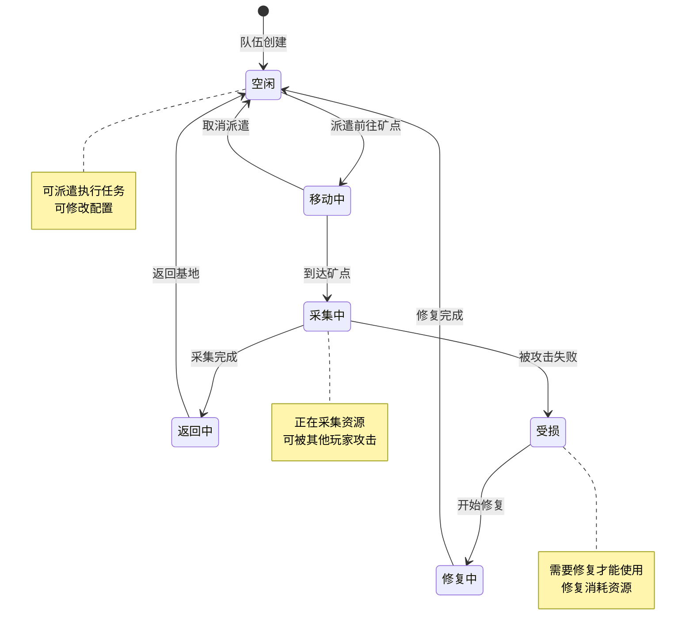
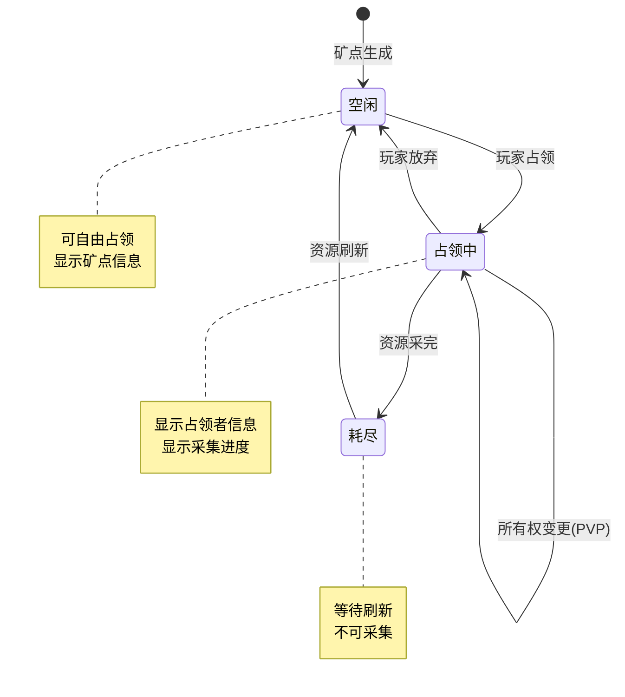
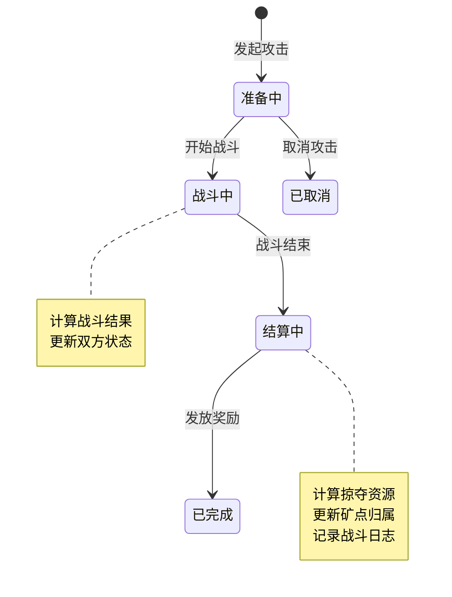
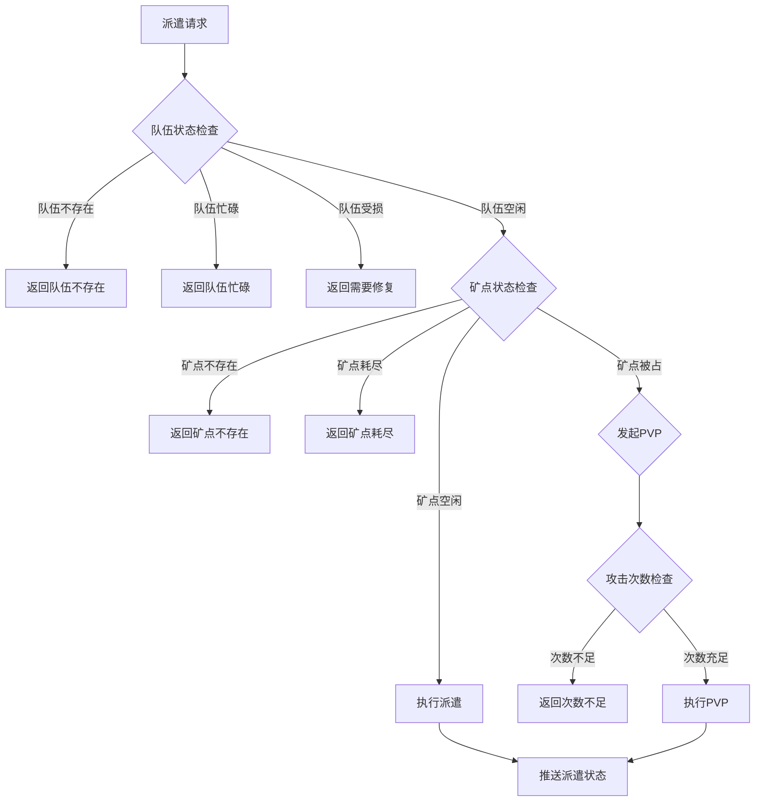

# 火星探索模块实现细节

## 一、计算公式

### 1.1 采集速度计算公式

```
实际采集速度 = base_speed × (1 + team_bonus) × (1 + tech_bonus) × (1 + buff_bonus)
```

**参数说明**：
- `base_speed`：基础采集速度（资源/小时）
- `team_bonus`：队伍配置加成
- `tech_bonus`：科技加成
- `buff_bonus`：Buff加成

**示例计算**：
```
base_speed = 60 资源/小时
team_bonus = 0.2（队伍配置+20%）
tech_bonus = 0.1（科技+10%）
buff_bonus = 0.05（Buff+5%）

实际采集速度 = 60 × 1.2 × 1.1 × 1.05 = 83.16 资源/小时
```

### 1.2 采集收益计算公式

```
采集收益 = min(实际采集速度 × 采集时间, 矿点剩余资源)
```

**示例计算**：
```
实际采集速度：83.16 资源/小时
采集时间：3小时
矿点剩余资源：200

理论采集量：83.16 × 3 = 249.48
实际采集量：min(249.48, 200) = 200
```

### 1.3 战斗结果计算公式

```
进攻方战力 = base_power × (1 + attack_bonus)
防御方战力 = base_power × (1 + defense_bonus)

胜负判定：
  进攻方战力 > 防御方战力 × 1.1 → 进攻方大胜
  进攻方战力 > 防御方战力 → 进攻方险胜
  防御方战力 >= 进攻方战力 → 防御方胜利
```

**示例计算**：
```
进攻方基础战力：12000
进攻方加成：攻击+15%
进攻方有效战力：12000 × 1.15 = 13800

防御方基础战力：10000
防御方加成：防御+10%
防御方有效战力：10000 × 1.10 = 11000

战力比较：13800 > 11000
结果：进攻方险胜
```

### 1.4 掠夺资源计算公式

```
掠夺资源 = floor(矿点存量 × plunder_ratio)
```

**参数说明**：
- `plunder_ratio`：掠夺比例，与战力差距相关

**战力差距与掠夺比例**：
```
战力差距 < 10% → plunder_ratio = 10%
战力差距 10-30% → plunder_ratio = 15%
战力差距 30-50% → plunder_ratio = 20%
战力差距 > 50% → plunder_ratio = 25%
```

### 1.5 修复时间计算公式

```
修复时间 = base_repair_time × damage_ratio × (1 - repair_bonus)
```

**参数说明**：
- `base_repair_time`：基础修复时间
- `damage_ratio`：受损程度比例
- `repair_bonus`：修复加速加成

**示例计算**：
```
base_repair_time = 1800秒（30分钟）
damage_ratio = 0.5（50%受损）
repair_bonus = 0.1（科技-10%时间）

修复时间 = 1800 × 0.5 × (1 - 0.1) = 810秒（13.5分钟）
```

---

## 二、状态机定义

### 2.1 探索队伍状态机



### 2.2 矿点状态机



### 2.3 PVP 状态机



---

## 三、数据约束

### 3.1 探索队伍数据约束

| 字段名 | 数据类型 | 取值范围 | 必填 | 唯一性 | 说明 |
|--------|----------|----------|------|--------|------|
| teamId | long | > 0 | 是 | 是 | 队伍唯一ID |
| teamName | string | 1-20字符 | 否 | 否 | 队伍名称 |
| teamState | int | 0-5 | 是 | 否 | 队伍状态 |
| currentMineId | long | >= 0 | 是 | 否 | 当前矿点ID |
| power | long | >= 0 | 是 | 否 | 队伍战力 |
| damageLevel | int | 0-100 | 是 | 否 | 受损程度 |
| repairEndTime | datetime | - | 否 | 否 | 修复结束时间 |
| createTime | datetime | - | 是 | 否 | 创建时间 |

### 3.2 矿点数据约束

| 字段名 | 数据类型 | 取值范围 | 必填 | 唯一性 | 说明 |
|--------|----------|----------|------|--------|------|
| mineId | long | > 0 | 是 | 是 | 矿点唯一ID |
| mineType | int | 1-4 | 是 | 否 | 矿点类型 |
| resourceId | int | > 0 | 是 | 否 | 产出资源ID |
| resourceCount | long | >= 0 | 是 | 否 | 剩余资源数量 |
| maxResource | long | > 0 | 是 | 否 | 最大资源数量 |
| ownerCid | long | >= 0 | 是 | 否 | 占有者CID |
| posX | int | 0-999 | 是 | 否 | X坐标 |
| posY | int | 0-999 | 是 | 否 | Y坐标 |
| refreshTime | datetime | - | 否 | 否 | 刷新时间 |

### 3.3 PVP 日志数据约束

| 字段名 | 数据类型 | 取值范围 | 必填 | 唯一性 | 说明 |
|--------|----------|----------|------|--------|------|
| logId | long | > 0 | 是 | 是 | 日志唯一ID |
| attackerCid | long | > 0 | 是 | 否 | 攻击者CID |
| defenderCid | long | > 0 | 是 | 否 | 防御者CID |
| mineId | long | > 0 | 是 | 否 | 矿点ID |
| result | int | 0-2 | 是 | 否 | 结果：0失败,1胜利,2大胜 |
| plunderResource | long | >= 0 | 是 | 否 | 掠夺资源数量 |
| battleTime | datetime | - | 是 | 否 | 战斗时间 |

### 3.4 公会分享数据约束

| 字段名 | 数据类型 | 取值范围 | 必填 | 说明 |
|--------|----------|----------|------|------|
| shareId | long | > 0 | 是 | 分享唯一ID |
| mineId | long | > 0 | 是 | 矿点ID |
| shareCid | long | > 0 | 是 | 分享者CID |
| guildId | long | > 0 | 是 | 公会ID |
| shareTime | datetime | - | 是 | 分享时间 |
| expireTime | datetime | - | 是 | 过期时间 |

---

## 四、错误处理策略

### 4.1 探索模块错误码

| 错误码 | 错误信息 | 处理策略 | 用户提示 |
|--------|----------|----------|----------|
| 41001 | 队伍不存在 | 检查队伍ID有效性 | "队伍数据异常，请刷新重试" |
| 41002 | 队伍正在任务中 | 检查队伍状态 | "队伍正在执行任务，无法派遣" |
| 41003 | 队伍受损未修复 | 检查队伍状态 | "队伍受损，请先修复" |
| 41004 | 矿点不存在 | 检查矿点ID有效性 | "矿点数据异常，请刷新重试" |
| 41005 | 矿点已被占领 | 检查矿点状态 | "矿点已被其他玩家占领" |
| 41006 | 矿点资源已耗尽 | 检查矿点资源 | "矿点资源已耗尽，请选择其他矿点" |
| 41007 | 攻击次数不足 | 检查攻击次数 | "今日攻击次数已用完" |
| 41008 | 无法攻击自己 | 检查目标归属 | "无法攻击自己占领的矿点" |
| 41009 | 分享次数不足 | 检查分享次数 | "今日分享次数已用完" |
| 41010 | 修复资源不足 | 检查修复资源 | "修复资源不足，请先获取资源" |

### 4.2 队伍派遣错误处理流程



### 4.3 PVP 战斗错误处理

| 战斗状态 | 处理策略 | 后续操作 |
|----------|----------|----------|
| 攻击方胜利 | 更新矿点归属 | 掠夺资源，记录日志 |
| 攻击方失败 | 进攻方队伍受损 | 记录日志，推送通知 |
| 战平 | 保持原状 | 双方无损，记录日志 |

---

## 五、关键代码示例

### 5.1 队伍派遣伪代码

```csharp
public Result DispatchTeam(long playerId, long teamId, long mineId)
{
    // 1. 获取队伍数据
    ExploreTeam team = exploreMgr.GetTeam(playerId, teamId);
    if (team == null)
        return Result.Error(41001, "队伍不存在");

    // 2. 检查队伍状态
    if (team.teamState != TeamState.Idle)
        return Result.Error(41002, "队伍正在任务中");

    if (team.damageLevel > 0)
        return Result.Error(41003, "队伍受损未修复");

    // 3. 获取矿点数据
    Mine mine = mineMgr.GetMine(mineId);
    if (mine == null)
        return Result.Error(41004, "矿点不存在");

    // 4. 检查矿点状态
    if (mine.resourceCount <= 0)
        return Result.Error(41006, "矿点资源已耗尽");

    // 5. 处理矿点状态
    if (mine.ownerCid > 0 && mine.ownerCid != playerId)
    {
        // 矿点被其他玩家占领，需要PVP
        return StartPVP(playerId, team, mine);
    }

    // 6. 派遣队伍
    int moveTime = CalculateMoveTime(playerId, mine);
    team.teamState = TeamState.Moving;
    team.currentMineId = mineId;
    team.arriveTime = DateTime.Now.AddSeconds(moveTime);

    // 7. 保存并推送
    exploreMgr.UpdateTeam(playerId, team);
    PushTeamChg(playerId, team);

    return Result.Success(new { moveTime = moveTime });
}
```

### 5.2 资源采集伪代码

```csharp
public void ProcessCollection(long playerId, long teamId)
{
    ExploreTeam team = exploreMgr.GetTeam(playerId, teamId);
    if (team == null || team.teamState != TeamState.Collecting)
        return;

    Mine mine = mineMgr.GetMine(team.currentMineId);
    if (mine == null)
    {
        // 矿点不存在，队伍返回
        ReturnTeam(playerId, team);
        return;
    }

    // 计算采集量
    long collectSpeed = CalculateCollectSpeed(team);
    long collectAmount = collectSpeed * (DateTime.Now - team.lastCollectTime).TotalHours;

    // 限制采集量
    collectAmount = Math.Min(collectAmount, mine.resourceCount);

    if (collectAmount <= 0)
    {
        // 矿点资源耗尽，队伍返回
        ReturnTeam(playerId, team);
        return;
    }

    // 更新采集数据
    mine.resourceCount -= collectAmount;
    team.collectedAmount += collectAmount;
    team.lastCollectTime = DateTime.Now;

    // 保存数据
    mineMgr.UpdateMine(mine);
    exploreMgr.UpdateTeam(playerId, team);

    // 推送采集进度
    PushCollectProgress(playerId, team, mine);
}
```

### 5.3 PVP 战斗伪代码

```csharp
public Result StartPVP(long attackerId, ExploreTeam attackTeam, Mine mine)
{
    // 1. 检查攻击次数
    PlayerPVPData pvpData = pvpMgr.GetPlayerData(attackerId);
    if (pvpData.todayAttackCount >= pvpData.maxAttackCount)
        return Result.Error(41007, "攻击次数不足");

    // 2. 检查是否攻击自己
    if (mine.ownerCid == attackerId)
        return Result.Error(41008, "无法攻击自己");

    // 3. 获取防御方信息
    ExploreTeam defendTeam = exploreMgr.GetTeam(mine.ownerCid, mine.defendTeamId);
    long defenderPower = defendTeam?.power ?? 0;

    // 4. 计算战斗结果
    long attackerPower = attackTeam.power;
    double attackBonus = GetAttackBonus(attackerId);
    double defendBonus = GetDefendBonus(mine.ownerCid);

    long effectiveAttackPower = (long)(attackerPower * (1 + attackBonus));
    long effectiveDefendPower = (long)(defenderPower * (1 + defendBonus));

    int result;
    if (effectiveAttackPower > effectiveDefendPower * 1.1)
        result = 2; // 大胜
    else if (effectiveAttackPower > effectiveDefendPower)
        result = 1; // 险胜
    else
        result = 0; // 失败

    // 5. 处理战斗结果
    long plunderAmount = 0;
    if (result > 0)
    {
        // 进攻方胜利
        double powerDiff = (double)(effectiveAttackPower - effectiveDefendPower) / effectiveDefendPower;
        double plunderRatio = CalculatePlunderRatio(powerDiff);
        plunderAmount = (long)(mine.resourceCount * plunderRatio);

        // 更新矿点归属
        mine.ownerCid = attackerId;
        mineMgr.UpdateMine(mine);

        // 防御方队伍受损
        if (defendTeam != null)
        {
            defendTeam.damageLevel = 50;
            ReturnTeam(mine.ownerCid, defendTeam);
        }
    }
    else
    {
        // 进攻方失败
        attackTeam.damageLevel = 30;
        ReturnTeam(attackerId, attackTeam);
    }

    // 6. 更新攻击次数
    pvpData.todayAttackCount++;
    pvpMgr.UpdatePlayerData(attackerId, pvpData);

    // 7. 记录战斗日志
    PVpLog log = new PVpLog {
        logId = idGenerator.NextId(),
        attackerCid = attackerId,
        defenderCid = mine.ownerCid,
        mineId = mine.mineId,
        result = result,
        plunderResource = plunderAmount,
        battleTime = DateTime.Now
    };
    pvpLogMgr.AddLog(log);

    // 8. 推送战斗结果
    PushPVPResult(attackerId, mine.ownerCid, result, plunderAmount, log);

    return Result.Success(new { result = result, plunderAmount = plunderAmount });
}
```

### 5.4 队伍修复伪代码

```csharp
public Result RepairTeam(long playerId, long teamId, bool useAccelerate)
{
    ExploreTeam team = exploreMgr.GetTeam(playerId, teamId);
    if (team == null)
        return Result.Error(41001, "队伍不存在");

    if (team.damageLevel <= 0)
        return Result.Error(41003, "队伍无需修复");

    // 计算修复消耗
    RepairCost cost = CalculateRepairCost(team);

    // 检查资源
    if (!resourceMgr.HasEnough(playerId, cost))
        return Result.Error(41010, "修复资源不足");

    // 扣除资源
    resourceMgr.Cost(playerId, cost, "队伍修复");

    // 计算修复时间
    int repairTime = CalculateRepairTime(team);

    if (useAccelerate)
    {
        // 使用钻石加速
        int diamondCost = CalculateAccelerateDiamond(repairTime);
        if (resourceMgr.HasDiamond(playerId, diamondCost))
        {
            resourceMgr.CostDiamond(playerId, diamondCost, "修复加速");
            repairTime = 0;
        }
    }

    // 更新队伍状态
    team.teamState = TeamState.Repairing;
    team.repairEndTime = DateTime.Now.AddSeconds(repairTime);

    if (repairTime == 0)
    {
        // 立即完成
        team.teamState = TeamState.Idle;
        team.damageLevel = 0;
    }

    exploreMgr.UpdateTeam(playerId, team);
    PushTeamChg(playerId, team);

    return Result.Success(new { repairTime = repairTime });
}
```

### 5.5 公会分享伪代码

```csharp
public Result ShareMineToGuild(long playerId, long mineId)
{
    // 1. 检查分享次数
    PlayerShareData shareData = shareMgr.GetPlayerData(playerId);
    if (shareData.todayShareCount >= shareData.maxShareCount)
        return Result.Error(41009, "分享次数不足");

    // 2. 获取矿点信息
    Mine mine = mineMgr.GetMine(mineId);
    if (mine == null)
        return Result.Error(41004, "矿点不存在");

    // 3. 检查是否是自己发现的矿点
    if (mine.discoverCid != playerId)
        return Result.Error(41008, "只能分享自己发现的矿点");

    // 4. 获取公会信息
    long guildId = guildMgr.GetPlayerGuildId(playerId);
    if (guildId <= 0)
        return Result.Error(41009, "未加入公会，无法分享");

    // 5. 创建分享记录
    MineShare share = new MineShare {
        shareId = idGenerator.NextId(),
        mineId = mineId,
        shareCid = playerId,
        guildId = guildId,
        shareTime = DateTime.Now,
        expireTime = DateTime.Now.AddHours(24)
    };

    // 6. 更新分享次数
    shareData.todayShareCount++;
    shareMgr.UpdatePlayerData(playerId, shareData);

    // 7. 保存分享
    shareMgr.AddShare(share);

    // 8. 推送给公会成员
    List<long> members = guildMgr.GetGuildMembers(guildId);
    foreach (long memberId in members)
    {
        if (memberId != playerId)
        {
            PushMineShare(memberId, share);
        }
    }

    return Result.Success(share);
}
```

---

## 六、跨模块依赖

### 6.1 依赖模块

| 模块名称 | 依赖方式 | 说明 |
|----------|----------|------|
| Module_Player | 资源发放 | 采集收益发放给玩家 |
| Module_NPResource | 资源管理 | 采集获取的资源管理 |
| Module_MarsBuilding | 建筑支持 | 部分建筑提供探索加成 |
| Module_Guild | 公会功能 | 公会分享依赖公会模块 |

### 6.2 被依赖模块

| 模块名称 | 依赖方式 | 说明 |
|----------|----------|------|
| Module_MarsPeople | 资源关联 | 居民需要采集的资源 |
| Module_MarsBuilding | 建造材料 | 部分建造材料来源于采集 |

---

*文档生成时间: 2026-04-07*
