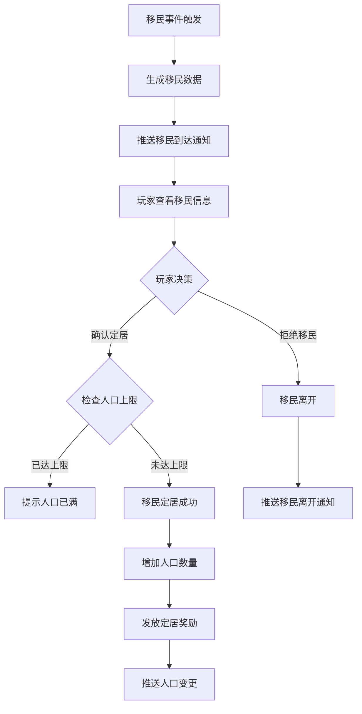
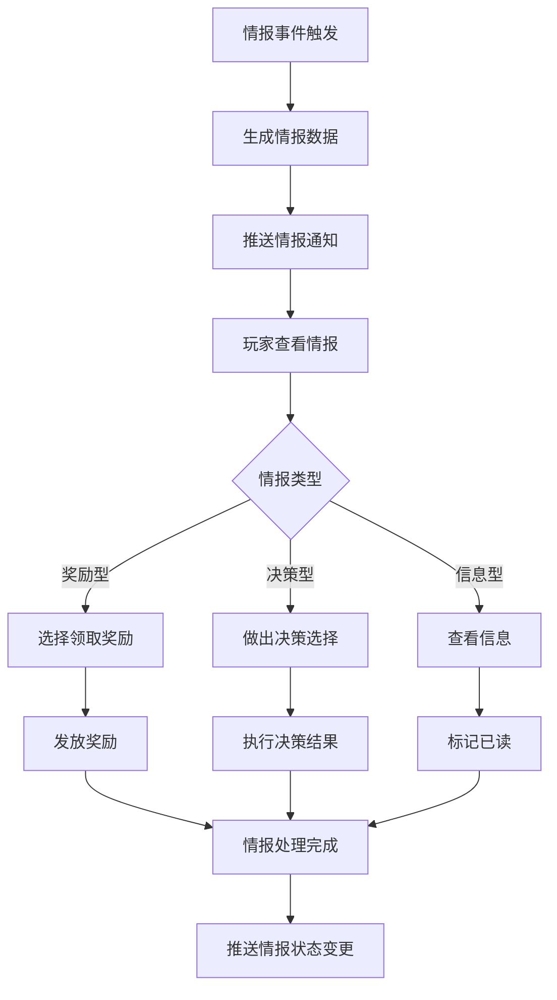
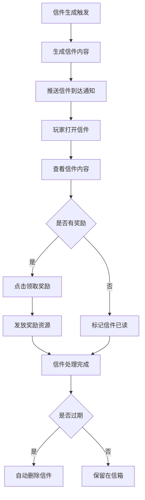
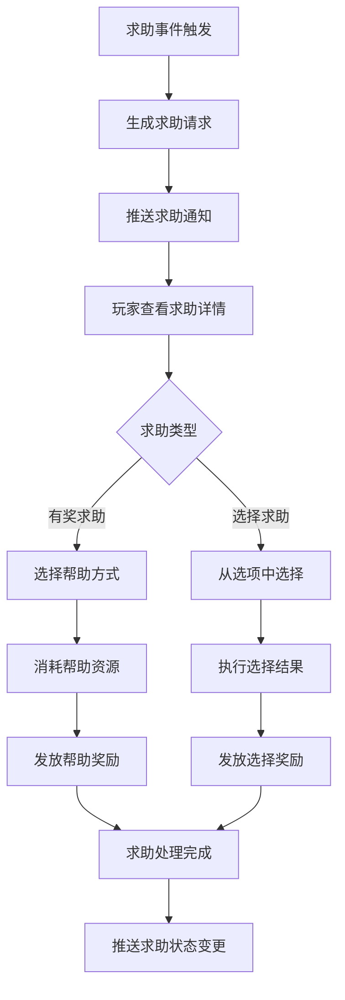
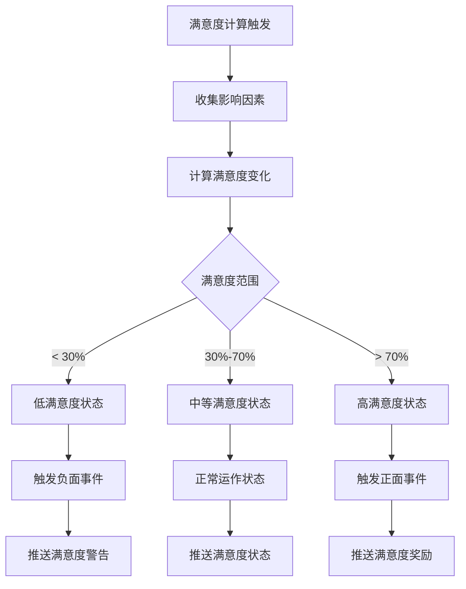

# 火星居民模块完整说明

## 一、模块概述

### 1.1 业务背景

火星居民模块是 K2C 游戏火星玩法的社交生态核心，负责管理火星基地的居民系统。玩家需要吸引移民、管理居民满意度、处理随机事件、阅读信件和响应求助请求，构建一个充满活力的火星社区。

### 1.2 目标用户

- **所有解锁火星玩法的玩家**：等级达到要求后解锁居民系统
- **社交型玩家**：享受与居民互动的玩家
- **养成型玩家**：追求人口增长和满意度提升的玩家
- **事件型玩家**：喜欢随机事件和决策的玩家

### 1.3 核心价值

1. **人口管理**：吸引和管理火星居民人口
2. **满意度系统**：维持居民满意度保障基地运转
3. **事件互动**：随机事件增加游戏趣味性
4. **社交反馈**：信件和求助系统增强代入感

---

## 二、功能清单

### 2.1 人口管理功能

| 功能名称 | 功能描述 | 用户价值 |
|---------|---------|---------|
| 人口查看 | 查看当前人口数量和分布 | 了解基地人口状况 |
| 工人分配 | 将居民分配到工作岗位 | 优化基地运作 |
| 满意度管理 | 查看和管理居民满意度 | 保持基地稳定 |

### 2.2 移民系统功能

| 功能名称 | 功能描述 | 用户价值 |
|---------|---------|---------|
| 移民申请 | 接收移民申请请求 | 获取新居民 |
| 确认定居 | 确认移民定居 | 增加人口 |
| 拒绝移民 | 拒绝移民请求 | 控制人口质量 |

### 2.3 事件系统功能

| 功能名称 | 功能描述 | 用户价值 |
|---------|---------|---------|
| 情报接收 | 接收各类情报信息 | 了解基地动态 |
| 情报处理 | 处理情报事件 | 获取奖励或避免损失 |
| 随机事件 | 响应随机触发的事件 | 增加游戏乐趣 |

### 2.4 信件系统功能

| 功能名称 | 功能描述 | 用户价值 |
|---------|---------|---------|
| 信件查看 | 查看收到的信件 | 了解居民故事 |
| 奖励领取 | 领取信件附带的奖励 | 获取资源收益 |
| 信件管理 | 管理信件列表 | 保持信箱整洁 |

### 2.5 求助系统功能

| 功能名称 | 功能描述 | 用户价值 |
|---------|---------|---------|
| 求助查看 | 查看居民的求助请求 | 了解居民需求 |
| 提供帮助 | 响应求助提供帮助 | 获取帮助奖励 |
| 选择决策 | 对选择题求助做出选择 | 影响居民关系 |

---

## 三、业务流程详解

### 3.1 移民定居流程



**详细步骤说明**：

1. **移民触发**
   - 系统随机触发移民事件
   - 生成移民属性和技能

2. **玩家决策**
   - 查看移民信息（技能、属性）
   - 决定是否接受定居

3. **定居处理**
   - 检查人口上限
   - 更新人口数据
   - 发放定居奖励

### 3.2 情报处理流程



**详细步骤说明**：

1. **情报生成**
   - 系统定时生成情报
   - 情报类型：奖励型、决策型、信息型

2. **情报处理**
   - 奖励型：领取奖励
   - 决策型：做出选择影响结果
   - 信息型：仅查看信息

3. **结果处理**
   - 发放奖励或执行决策效果
   - 更新情报状态

### 3.3 信件处理流程



**详细步骤说明**：

1. **信件生成**
   - 根据游戏进度生成信件
   - 信件内容关联游戏事件

2. **信件查看**
   - 玩家打开信件查看内容
   - 了解居民故事或游戏信息

3. **奖励领取**
   - 部分信件附带奖励
   - 点击领取后获得资源

### 3.4 求助处理流程



**详细步骤说明**：

1. **求助触发**
   - 居民随机触发求助请求
   - 生成求助内容和奖励

2. **求助类型**
   - 有奖求助：消耗资源获得奖励
   - 选择求助：从选项中选择获得不同结果

3. **结果处理**
   - 根据选择发放奖励
   - 更新居民关系

### 3.5 满意度管理流程



**详细步骤说明**：

1. **满意度计算**
   - 综合多个因素计算
   - 住宅条件、食物供应、设施完善度

2. **满意度影响**
   - 低满意度：可能导致居民离开
   - 高满意度：吸引更多移民

3. **状态推送**
   - 满意度变化时推送通知
   - 提示玩家采取措施

---

## 四、关键规则

### 4.1 人口规则

1. **人口上限**
   - 人口上限由住宅建筑决定
   - 升级住宅可增加人口上限

2. **人口类型**
   - 普通居民：基础劳动力
   - 技术工人：提供特殊加成
   - 专家居民：高级能力加成

3. **人口增长**
   - 移民定居增加人口
   - 满意度高时移民概率增加

### 4.2 满意度规则

1. **满意度因素**
   - 住宅条件：住宅等级和数量
   - 食物供应：食物产出和消耗
   - 设施完善度：休闲设施建设

2. **满意度影响**
   - 低于 30%：居民可能离开
   - 高于 70%：移民申请增加

3. **满意度恢复**
   - 建造新住宅提升
   - 升级食物产出提升

### 4.3 移民规则

1. **移民频率**
   - 定期随机触发移民事件
   - 满意度影响移民频率

2. **移民质量**
   - 移民有随机技能和属性
   - 高满意度吸引高质量移民

3. **移民拒绝**
   - 可以拒绝不满意的移民
   - 拒绝不会影响满意度

### 4.4 信件规则

1. **信件生成**
   - 根据游戏进度生成
   - 与居民类型相关联

2. **信件奖励**
   - 部分信件附带奖励
   - 奖励类型随机

3. **信件过期**
   - 信件有过期时间
   - 过期后自动删除

### 4.5 求助规则

1. **求助频率**
   - 随机触发求助事件
   - 与人口数量相关

2. **求助奖励**
   - 帮助居民获得奖励
   - 不同选择获得不同奖励

---

## 五、用户故事

### 5.1 新手玩家故事

> 作为一名刚解锁居民系统的玩家，我第一次收到了移民申请。一个名叫"小星"的技术工人希望定居我的基地。查看了他的技能后，我发现他擅长能源管理，正好我缺少这方面的人才。我立即确认了定居，小星成为了我基地的一员。系统还发放了定居奖励，让我感受到了基地发展的喜悦。

### 5.2 活跃玩家故事

> 作为一名活跃玩家，我每天都会查看居民的信件和求助请求。今天收到了一封来自老居民的感谢信，感谢我为他建造了舒适的住宅。信件附带了 500 银两的奖励，这让我感到自己的付出得到了回报。同时，我也收到了一个求助请求，一位居民遇到了困难，我选择了帮助他，获得了稀有材料的奖励。

### 5.3 策略玩家故事

> 作为一名策略型玩家，我非常重视居民系统的管理。我保持了 85% 的满意度，这让移民申请源源不断。我会仔细筛选每一个移民，只接受有价值的专家居民。通过合理的工人分配，我的基地运作效率大大提升。偶尔触发的随机事件也给我带来了不少惊喜和挑战。

---

## 六、示例

### 6.1 移民定居示例

**移民信息**：
```
移民ID：10001
姓名：星辉
类型：技术工人
技能：能源管理 +20%
属性：体力 80、智力 90
定居奖励：银两 × 500
```

**定居结果**：
```
定居状态：成功
人口变化：50 → 51
满意度变化：68% → 70%
获得奖励：银两 × 500
```

### 6.2 情报处理示例

**情报内容**：
```
情报ID：20001
类型：决策型
标题：资源发现
内容：居民在探索中发现了一处资源点，是否派人开采？
选项：A.立即开采 B.保守观察 C.忽略
```

**决策结果**：
```
选择：A.立即开采
结果：获得铁矿 × 200
效果：获得额外资源奖励
情报状态：已处理
```

### 6.3 信件查看示例

**信件内容**：
```
信件ID：30001
发件人：居民小星
主题：感谢信
内容：感谢您为我提供了舒适的住所，我在这里生活得很好...
奖励：银两 × 300、钻石 × 10
```

**处理结果**：
```
信件状态：已读
奖励领取：成功
获得资源：银两 × 300、钻石 × 10
信件保留：是
```

### 6.4 求助处理示例

**求助内容**：
```
求助ID：40001
类型：有奖求助
请求者：居民星辉
内容：我需要一些材料来改进能源设备，能帮我吗？
消耗：铁矿 × 50
奖励：能源效率 +5%（永久）
```

**处理结果**：
```
选择：提供帮助
消耗资源：铁矿 × 50
获得效果：能源效率 +5%
求助状态：已完成
```

---

*文档生成时间: 2026-04-07*
