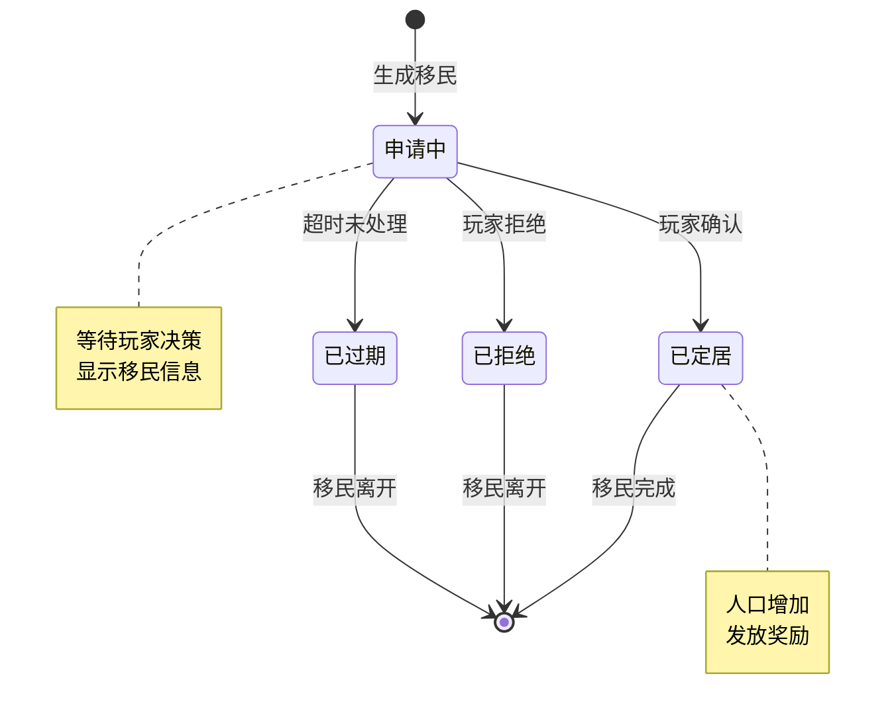
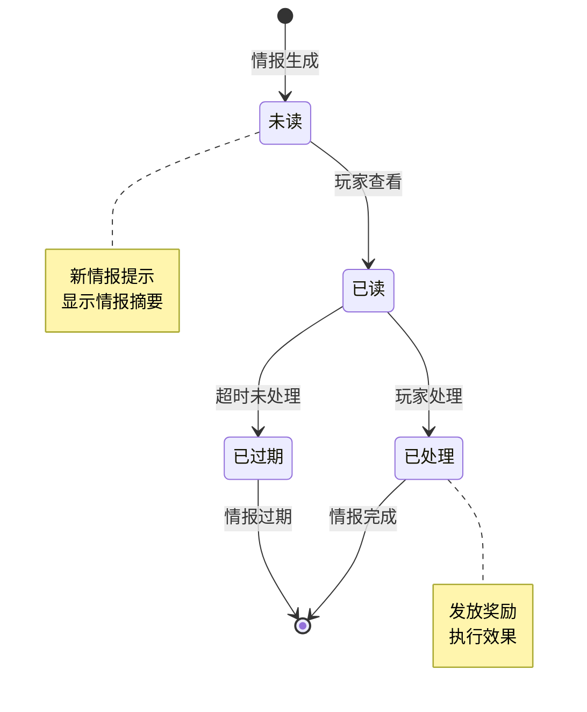
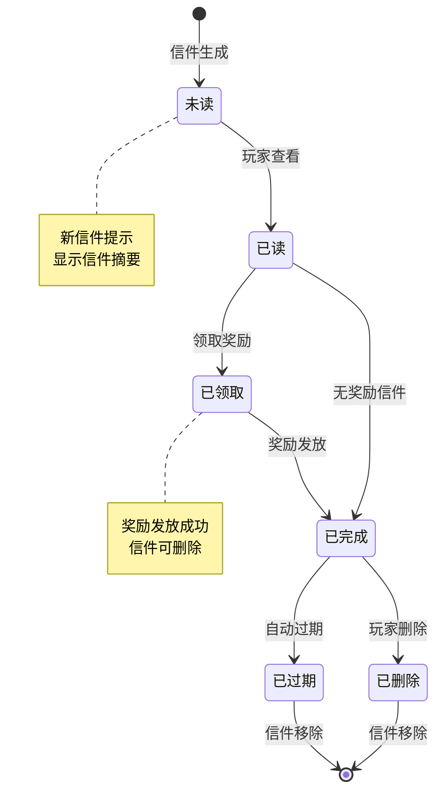
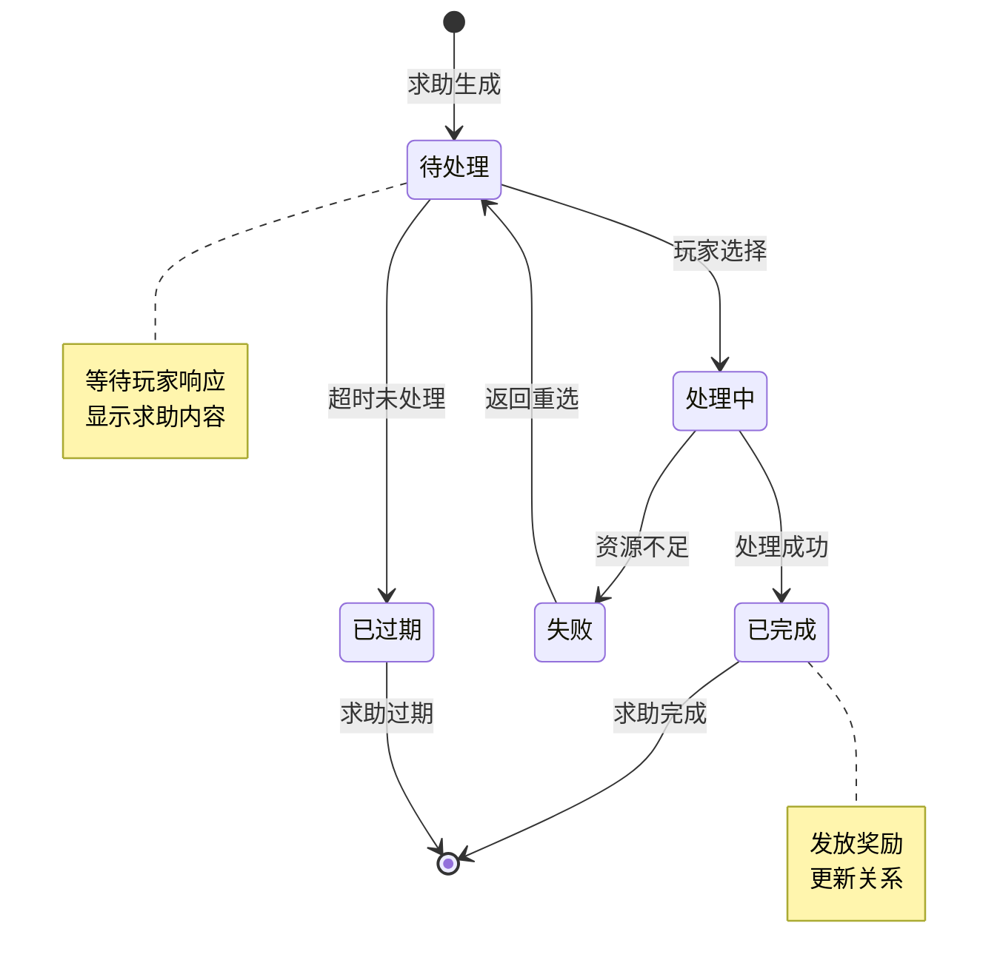
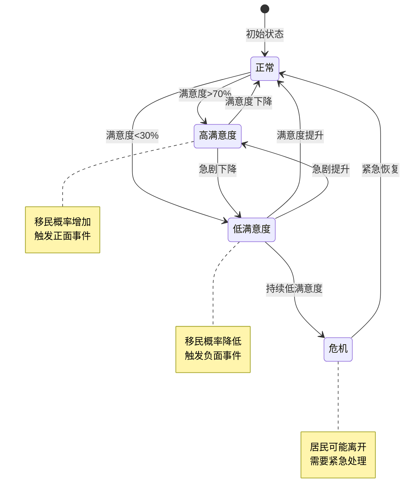
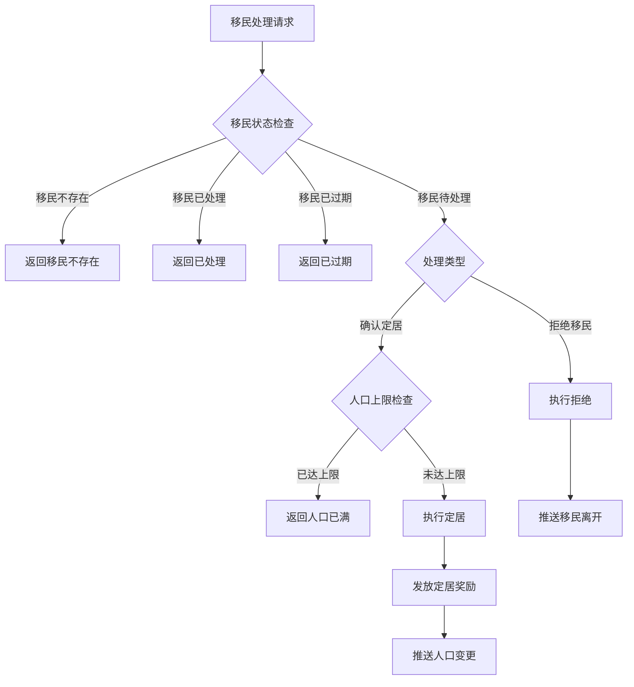

# 火星居民模块实现细节

## 一、计算公式

### 1.1 满意度计算公式

```
满意度 = (住宅分数 + 食物分数 + 设施分数 + 事件分数) / 总权重 × 100%
```

**参数说明**：
- `住宅分数`：住宅等级和数量决定的分数
- `食物分数`：食物供应与消耗的比值
- `设施分数`：休闲设施的建设情况
- `事件分数`：近期事件的影响值

**示例计算**：
```
住宅分数：40（高级住宅充足）
食物分数：30（供应充足）
设施分数：15（设施完善）
事件分数：10（近期正面事件）
总权重：100

满意度 = (40 + 30 + 15 + 10) / 100 × 100% = 95%
```

### 1.2 移民概率计算公式

```
移民概率 = base_rate × (1 + satisfaction_bonus) × (1 + population_factor)
```

**参数说明**：
- `base_rate`：基础移民概率
- `satisfaction_bonus`：满意度加成（满意度>70%时生效）
- `population_factor`：人口因素（人口越少越容易吸引移民）

**示例计算**：
```
base_rate = 0.1（10%基础概率）
satisfaction_bonus = 0.2（满意度85%时+20%）
population_factor = 0.1（人口较少+10%）

移民概率 = 0.1 × 1.2 × 1.1 = 0.132（13.2%）
```

### 1.3 移民质量计算公式

```
移民质量值 = random(1, 100) × (1 + satisfaction_bonus)
```

**质量等级**：
- 普通：质量值 1-50
- 技术：质量值 51-80
- 专家：质量值 81-100

**示例计算**：
```
随机值：70
满意度加成：+15%
质量值 = 70 × 1.15 = 80.5

等级判定：技术工人
```

### 1.4 奖励计算公式

```
奖励值 = base_reward × (1 + level_bonus) × (1 + satisfaction_factor)
```

**示例计算**：
```
base_reward = 100
level_bonus = 0.2（玩家等级加成）
satisfaction_factor = 0.1（满意度加成）

奖励值 = 100 × 1.2 × 1.1 = 132
```

### 1.5 人口上限计算公式

```
人口上限 = base_cap + Σ(每个住宅的人口容量)
```

**示例计算**：
```
base_cap = 10（基础人口上限）
住宅1：普通住宅，容量 +5
住宅2：高级住宅，容量 +10
住宅3：豪华住宅，容量 +15

人口上限 = 10 + 5 + 10 + 15 = 40
```

---

## 二、状态机定义

### 2.1 移民状态机



### 2.2 情报状态机



### 2.3 信件状态机



### 2.4 求助状态机



### 2.5 满意度状态机



---

## 三、数据约束

### 3.1 居民数量信息约束

| 字段名 | 数据类型 | 取值范围 | 必填 | 说明 |
|--------|----------|----------|------|------|
| totalPeople | int | 0-999 | 是 | 总人口数 |
| maxPeople | int | > 0 | 是 | 人口上限 |
| workerCount | int | >= 0 | 是 | 工人数量 |
| satisfaction | int | 0-100 | 是 | 满意度百分比 |
| expertCount | int | >= 0 | 是 | 专家数量 |
| techWorkerCount | int | >= 0 | 是 | 技术工人数量 |

### 3.2 移民信息约束

| 字段名 | 数据类型 | 取值范围 | 必填 | 唯一性 | 说明 |
|--------|----------|----------|------|--------|------|
| immigrantId | long | > 0 | 是 | 是 | 移民唯一ID |
| peopleType | int | 1-3 | 是 | 否 | 类型：1普通,2技术,3专家 |
| name | string | 1-20字符 | 是 | 否 | 移民姓名 |
| skills | json | - | 否 | 否 | 技能列表 |
| attributes | json | - | 是 | 否 | 属性值 |
| state | int | 0-3 | 是 | 否 | 状态 |
| expireTime | datetime | - | 是 | 否 | 过期时间 |

### 3.3 情报信息约束

| 字段名 | 数据类型 | 取值范围 | 必填 | 唯一性 | 说明 |
|--------|----------|----------|------|--------|------|
| intelligentId | long | > 0 | 是 | 是 | 情报唯一ID |
| intelligentType | int | 1-3 | 是 | 否 | 类型：1奖励,2决策,3信息 |
| title | string | 1-50字符 | 是 | 否 | 情报标题 |
| content | string | 1-500字符 | 是 | 否 | 情报内容 |
| options | json | - | 否 | 否 | 选项列表（决策型） |
| rewards | json | - | 否 | 否 | 奖励列表 |
| state | int | 0-2 | 是 | 否 | 状态：0未读,1已读,2已处理 |
| expireTime | datetime | - | 是 | 否 | 过期时间 |

### 3.4 信件信息约束

| 字段名 | 数据类型 | 取值范围 | 必填 | 唯一性 | 说明 |
|--------|----------|----------|------|--------|------|
| letterId | long | > 0 | 是 | 是 | 信件唯一ID |
| letterType | int | 1-5 | 是 | 否 | 信件类型 |
| senderName | string | 1-20字符 | 是 | 否 | 发件人名称 |
| subject | string | 1-50字符 | 是 | 否 | 信件主题 |
| content | string | 1-1000字符 | 是 | 否 | 信件内容 |
| rewardStatus | int | 0-2 | 是 | 否 | 奖励状态：0无,1待领取,2已领取 |
| rewards | json | - | 否 | 否 | 奖励列表 |
| createTime | datetime | - | 是 | 否 | 创建时间 |
| expireTime | datetime | - | 是 | 否 | 过期时间 |

### 3.5 求助信息约束

| 字段名 | 数据类型 | 取值范围 | 必填 | 唯一性 | 说明 |
|--------|----------|----------|------|--------|------|
| helpId | long | > 0 | 是 | 是 | 求助唯一ID |
| helpType | int | 1-2 | 是 | 否 | 类型：1有奖求助,2选择求助 |
| requestCid | long | > 0 | 是 | 否 | 请求者CID（NPC） |
| content | string | 1-500字符 | 是 | 否 | 求助内容 |
| cost | json | - | 否 | 否 | 帮助消耗 |
| rewards | json | - | 是 | 否 | 奖励信息 |
| options | json | - | 否 | 否 | 选项列表（选择型） |
| state | int | 0-2 | 是 | 否 | 状态 |
| expireTime | datetime | - | 是 | 否 | 过期时间 |

---

## 四、错误处理策略

### 4.1 居民模块错误码

| 错误码 | 错误信息 | 处理策略 | 用户提示 |
|--------|----------|----------|----------|
| 40001 | 移民不存在 | 检查移民ID有效性 | "移民数据异常，请刷新重试" |
| 40002 | 人口已达上限 | 检查人口数量 | "人口已达上限，无法接受新移民" |
| 40003 | 移民已过期 | 检查过期时间 | "该移民申请已过期" |
| 40004 | 情报不存在 | 检查情报ID有效性 | "情报数据异常，请刷新重试" |
| 40005 | 情报已处理 | 检查情报状态 | "该情报已处理" |
| 40006 | 情报已过期 | 检查过期时间 | "该情报已过期" |
| 40007 | 信件不存在 | 检查信件ID有效性 | "信件数据异常，请刷新重试" |
| 40008 | 奖励已领取 | 检查奖励状态 | "该信件奖励已领取" |
| 40009 | 求助不存在 | 检查求助ID有效性 | "求助数据异常，请刷新重试" |
| 40010 | 帮助资源不足 | 检查资源数量 | "资源不足，无法提供帮助" |
| 40011 | 求助已过期 | 检查过期时间 | "该求助请求已过期" |

### 4.2 移民处理错误处理流程



### 4.3 事件处理状态表

| 事件类型 | 处理状态 | 允许操作 |
|----------|----------|----------|
| 情报-未读 | 可查看 | 查看、处理 |
| 情报-已读 | 可处理 | 处理、忽略 |
| 情报-已处理 | 已完成 | 无 |
| 信件-未读 | 可查看 | 查看 |
| 信件-已读待领取 | 可领取 | 领取奖励、删除 |
| 信件-已领取 | 已完成 | 删除 |
| 求助-待处理 | 可处理 | 处理、忽略 |
| 求助-已处理 | 已完成 | 无 |

---

## 五、关键代码示例

### 5.1 移民定居伪代码

```csharp
public Result ConfirmImmigrant(long playerId, long immigrantId)
{
    // 1. 获取移民数据
    MarsPeopleImmigrantInfo immigrant = peopleMgr.GetImmigrant(playerId, immigrantId);
    if (immigrant == null)
        return Result.Error(40001, "移民不存在");

    // 2. 检查移民状态
    if (immigrant.state != ImmigrantState.Pending)
        return Result.Error(40003, "移民已处理");

    // 3. 检查过期时间
    if (immigrant.expireTime < DateTime.Now)
        return Result.Error(40003, "移民已过期");

    // 4. 获取人口数据
    MarsPeopleNumInfo peopleNum = peopleMgr.GetPeopleNum(playerId);

    // 5. 检查人口上限
    if (peopleNum.totalPeople >= peopleNum.maxPeople)
        return Result.Error(40002, "人口已达上限");

    // 6. 更新移民状态
    immigrant.state = ImmigrantState.Settled;
    peopleMgr.UpdateImmigrant(playerId, immigrant);

    // 7. 更新人口数据
    peopleNum.totalPeople++;
    switch (immigrant.peopleType)
    {
        case PeopleType.Normal:
            peopleNum.workerCount++;
            break;
        case PeopleType.Technical:
            peopleNum.techWorkerCount++;
            break;
        case PeopleType.Expert:
            peopleNum.expertCount++;
            break;
    }
    peopleMgr.UpdatePeopleNum(playerId, peopleNum);

    // 8. 发放定居奖励
    if (immigrant.settleReward != null)
    {
        rewardMgr.GiveReward(playerId, immigrant.settleReward, "移民定居");
    }

    // 9. 推送状态变更
    PushPeopleNumChg(playerId, peopleNum);
    PushImmigrantDel(playerId, immigrantId);

    return Result.Success(peopleNum);
}
```

### 5.2 情报处理伪代码

```csharp
public Result DealIntelligent(long playerId, long intelligentId, int choiceIndex)
{
    // 1. 获取情报数据
    MarsPeopleIntelligentInfo info = peopleMgr.GetIntelligent(playerId, intelligentId);
    if (info == null)
        return Result.Error(40004, "情报不存在");

    // 2. 检查情报状态
    if (info.state == IntelligentState.Processed)
        return Result.Error(40005, "情报已处理");

    // 3. 检查过期时间
    if (info.expireTime < DateTime.Now)
        return Result.Error(40006, "情报已过期");

    // 4. 根据情报类型处理
    switch (info.intelligentType)
    {
        case IntelligentType.Reward:
            // 奖励型：直接发放奖励
            if (info.rewards != null)
            {
                rewardMgr.GiveReward(playerId, info.rewards, "情报奖励");
            }
            break;

        case IntelligentType.Decision:
            // 决策型：根据选择发放奖励
            if (info.options != null && choiceIndex < info.options.Count)
            {
                var option = info.options[choiceIndex];
                if (option.rewards != null)
                {
                    rewardMgr.GiveReward(playerId, option.rewards, "情报决策奖励");
                }
            }
            break;

        case IntelligentType.Information:
            // 信息型：仅标记已读
            break;
    }

    // 5. 更新情报状态
    info.state = IntelligentState.Processed;
    peopleMgr.UpdateIntelligent(playerId, info);

    // 6. 推送状态变更
    PushIntelligentChg(playerId, info);

    return Result.Success();
}
```

### 5.3 信件处理伪代码

```csharp
public Result ReadLetter(long playerId, long letterId)
{
    // 1. 获取信件数据
    MarsPeopleLetterInfo letter = peopleMgr.GetLetter(playerId, letterId);
    if (letter == null)
        return Result.Error(40007, "信件不存在");

    // 2. 更新信件状态
    if (letter.state == LetterState.Unread)
    {
        letter.state = LetterState.Read;
        peopleMgr.UpdateLetter(playerId, letter);
        PushLetterChg(playerId, letter);
    }

    return Result.Success(letter);
}

public Result ClaimLetterReward(long playerId, long letterId)
{
    // 1. 获取信件数据
    MarsPeopleLetterInfo letter = peopleMgr.GetLetter(playerId, letterId);
    if (letter == null)
        return Result.Error(40007, "信件不存在");

    // 2. 检查奖励状态
    if (letter.rewardStatus == RewardStatus.Claimed)
        return Result.Error(40008, "奖励已领取");

    if (letter.rewardStatus == RewardStatus.None)
        return Result.Error(40008, "该信件无奖励");

    // 3. 发放奖励
    if (letter.rewards != null)
    {
        rewardMgr.GiveReward(playerId, letter.rewards, "信件奖励");
    }

    // 4. 更新奖励状态
    letter.rewardStatus = RewardStatus.Claimed;
    peopleMgr.UpdateLetter(playerId, letter);

    // 5. 推送状态变更
    PushLetterChg(playerId, letter);

    return Result.Success();
}
```

### 5.4 求助处理伪代码

```csharp
public Result DealRewardHelp(long playerId, long helpId, int choiceIndex)
{
    // 1. 获取求助数据
    MarsPeopleHelpInfo help = peopleMgr.GetHelp(playerId, helpId);
    if (help == null)
        return Result.Error(40009, "求助不存在");

    // 2. 检查求助状态
    if (help.state != HelpState.Pending)
        return Result.Error(40009, "求助已处理");

    // 3. 检查过期时间
    if (help.expireTime < DateTime.Now)
        return Result.Error(40011, "求助已过期");

    // 4. 处理有奖求助
    if (help.helpType == HelpType.Reward)
    {
        // 检查消耗资源
        if (help.cost != null)
        {
            if (!resourceMgr.HasEnough(playerId, help.cost))
                return Result.Error(40010, "帮助资源不足");

            // 扣除资源
            resourceMgr.Cost(playerId, help.cost, "求助消耗");
        }

        // 发放奖励
        if (help.rewards != null)
        {
            rewardMgr.GiveReward(playerId, help.rewards, "求助奖励");
        }
    }

    // 5. 处理选择求助
    else if (help.helpType == HelpType.Choice)
    {
        if (help.options != null && choiceIndex < help.options.Count)
        {
            var option = help.options[choiceIndex];
            if (option.rewards != null)
            {
                rewardMgr.GiveReward(playerId, option.rewards, "求助选择奖励");
            }
        }
    }

    // 6. 更新求助状态
    help.state = HelpState.Completed;
    peopleMgr.UpdateHelp(playerId, help);

    // 7. 推送状态变更
    PushHelpChg(playerId, help);

    return Result.Success();
}
```

### 5.5 满意度计算伪代码

```csharp
public void CalculateSatisfaction(long playerId)
{
    MarsPeopleNumInfo peopleNum = peopleMgr.GetPeopleNum(playerId);

    // 1. 计算住宅分数
    int housingScore = 0;
    List<Building> houses = buildingMgr.GetHouses(playerId);
    foreach (var house in houses)
    {
        housingScore += house.level * 5; // 每级+5分
    }
    housingScore = Math.Min(housingScore, 40); // 最高40分

    // 2. 计算食物分数
    long foodOutput = buildingMgr.GetFoodOutput(playerId);
    long foodConsume = peopleNum.totalPeople * 2; // 每人消耗2单位
    int foodScore = 0;
    if (foodOutput >= foodConsume * 1.5)
        foodScore = 30;
    else if (foodOutput >= foodConsume)
        foodScore = 20;
    else if (foodOutput >= foodConsume * 0.5)
        foodScore = 10;
    else
        foodScore = 0;

    // 3. 计算设施分数
    int facilityScore = 0;
    List<Building> facilities = buildingMgr.GetFacilities(playerId);
    foreach (var facility in facilities)
    {
        facilityScore += facility.level * 3;
    }
    facilityScore = Math.Min(facilityScore, 20); // 最高20分

    // 4. 计算事件分数
    int eventScore = 0;
    // 根据近期事件调整
    eventScore = Math.Max(-10, Math.Min(10, eventScore));

    // 5. 计算总满意度
    int totalScore = housingScore + foodScore + facilityScore + eventScore;
    int satisfaction = (int)((totalScore / 100.0) * 100);
    satisfaction = Math.Max(0, Math.Min(100, satisfaction));

    // 6. 更新满意度
    int oldSatisfaction = peopleNum.satisfaction;
    peopleNum.satisfaction = satisfaction;
    peopleMgr.UpdatePeopleNum(playerId, peopleNum);

    // 7. 检查满意度变化触发事件
    if (satisfaction >= 70 && oldSatisfaction < 70)
    {
        TriggerHighSatisfactionEvent(playerId);
    }
    else if (satisfaction < 30 && oldSatisfaction >= 30)
    {
        TriggerLowSatisfactionEvent(playerId);
    }

    // 8. 推送满意度变更
    PushSatisfactionChg(playerId, satisfaction);
}
```

---

## 六、跨模块依赖

### 6.1 依赖模块

| 模块名称 | 依赖方式 | 说明 |
|----------|----------|------|
| Module_Player | 资源发放 | 奖励发放到玩家资源 |
| Module_NPResource | 资源检查 | 帮助消耗资源检查 |
| Module_MarsBuilding | 建筑关联 | 住宅建筑影响人口上限 |
| Module_MarsExplore | 资源关联 | 探索获取资源支持居民 |

### 6.2 被依赖模块

| 模块名称 | 依赖方式 | 说明 |
|----------|----------|------|
| Module_MarsBuilding | 人口需求 | 部分建筑需要人口支持 |
| Module_MarsExplore | 工人分配 | 探索队伍需要工人 |

---

*文档生成时间: 2026-04-07*
