# 博物馆系统 - 数据配表

**模块名称**: Museum（博物馆系统）
**模块编号**: p035
**文档版本**: 2.0
**更新日期**: 2026-04-11

---

## 一、配表总览

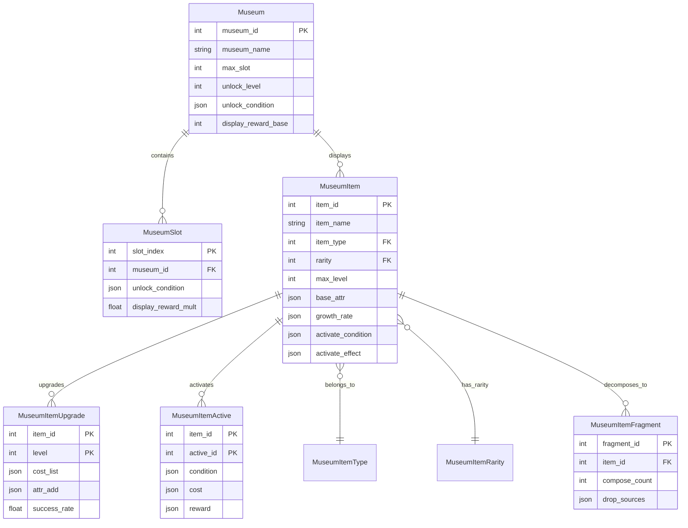

---

## 二、主配表详情

### 2.1 博物馆配置表 (Museum)

**文件路径**: `game_server/Config/museum/museum.json`

| 字段名 | 类型 | 必填 | 默认值 | 说明 | 示例值 |
|--------|------|------|--------|------|--------|
| museum_id | int | 是 | - | 博物馆ID（主键） | 1 |
| museum_name | string | 是 | - | 博物馆名称 | "皇家博物馆" |
| museum_desc | string | 否 | "" | 博物馆描述 | "展示珍贵藏品的场所" |
| max_slot | int | 是 | 10 | 最大展位数量 | 20 |
| unlock_level | int | 是 | 1 | 解锁玩家等级 | 10 |
| unlock_condition | json | 否 | {} | 解锁条件配置 | {"vip": 3} |
| icon | string | 否 | "" | 图标资源路径 | "ui/museum/icon_1" |
| display_reward_base | int | 否 | 10 | 展示基础奖励/小时 | 10 |
| display_reward_type | int | 否 | 1 | 展示奖励类型 | 1 |

**解锁条件字段说明**:

| 条件类型 | 字段名 | 值类型 | 说明 |
|----------|--------|--------|------|
| VIP等级 | vip | int | 需要达到的VIP等级 |
| 任务完成 | quest_complete | int | 需要完成的任务ID |
| 道具消耗 | item | string | 需要消耗的道具ID及数量 |
| 博物馆等级 | museum_level | int | 需要的博物馆等级 |

**配置示例**:

```json
[
  {
    "museum_id": 1,
    "museum_name": "皇家博物馆",
    "museum_desc": "展示您收集的珍贵藏品",
    "max_slot": 10,
    "unlock_level": 1,
    "unlock_condition": {},
    "icon": "ui/museum/museum_royal",
    "display_reward_base": 10,
    "display_reward_type": 1
  },
  {
    "museum_id": 2,
    "museum_name": "勇士殿堂",
    "museum_desc": "武器与装备的展示厅",
    "max_slot": 15,
    "unlock_level": 30,
    "unlock_condition": {"quest_complete": 1001},
    "icon": "ui/museum/museum_warrior",
    "display_reward_base": 15,
    "display_reward_type": 1
  },
  {
    "museum_id": 3,
    "museum_name": "神秘展厅",
    "museum_desc": "展示传说级藏品的神秘空间",
    "max_slot": 20,
    "unlock_level": 50,
    "unlock_condition": {"vip": 5, "quest_complete": 2001},
    "icon": "ui/museum/museum_mystery",
    "display_reward_base": 25,
    "display_reward_type": 2
  }
]
```

---

### 2.2 藏品配置表 (MuseumItem)

**文件路径**: `game_server/Config/museum/museum_item.json`

| 字段名 | 类型 | 必填 | 默认值 | 说明 | 取值范围 |
|--------|------|------|--------|------|----------|
| item_id | int | 是 | - | 藏品ID（主键） | > 0 |
| item_name | string | 是 | - | 藏品名称 | 1-50字符 |
| item_desc | string | 否 | "" | 藏品描述 | - |
| item_type | int | 是 | - | 藏品类型 | 1-4 |
| rarity | int | 是 | - | 稀有度 | 1-4 |
| max_level | int | 是 | - | 最大等级 | 10-50 |
| base_attr | json | 是 | {} | 基础属性 | - |
| growth_rate | json | 是 | {} | 成长系数 | - |
| activate_condition | json | 否 | {} | 激活条件 | - |
| activate_cost | json | 否 | {} | 激活消耗 | - |
| activate_effect | json | 否 | {} | 激活效果 | - |
| icon | string | 否 | "" | 图标资源 | - |
| model | string | 否 | "" | 3D模型资源 | - |
| sort_weight | int | 否 | 0 | 排序权重 | - |
| fragment_id | int | 否 | 0 | 关联碎片ID | - |
| decompose_reward | json | 否 | {} | 分解奖励 | - |

**藏品类型枚举**:

| 值 | 名称 | 说明 | 主要属性 |
|----|------|------|----------|
| 1 | WEAPON | 武器类 | 攻击力、暴击率、暴击伤害 |
| 2 | ARMOR | 防具类 | 防御力、生命值、减伤 |
| 3 | ACCESSORY | 饰品类 | 特殊属性、暴击抗性、韧性 |
| 4 | ARTWORK | 艺术品类 | 综合属性、全属性加成 |

**稀有度枚举**:

| 值 | 名称 | 颜色 | 等级上限 | 成长倍率 | 碎片合成数 |
|----|------|------|----------|----------|------------|
| 1 | COMMON | 白色 | 10 | 1.0 | 5 |
| 2 | RARE | 蓝色 | 20 | 1.5 | 10 |
| 3 | EPIC | 紫色 | 30 | 2.0 | 20 |
| 4 | LEGENDARY | 橙色 | 50 | 3.0 | 50 |

**属性字段格式**:

```json
{
  "atk": 10,        // 攻击力
  "def": 5,         // 防御力
  "hp": 100,        // 生命值
  "crit_rate": 0.01, // 暴击率（百分比）
  "crit_dmg": 0.1    // 暴击伤害（百分比）
}
```

**配置示例**:

```json
[
  {
    "item_id": 10001,
    "item_name": "古代长剑",
    "item_desc": "一把古老的长剑，剑身已布满岁月的痕迹",
    "item_type": 1,
    "rarity": 2,
    "max_level": 20,
    "base_attr": {"atk": 10, "crit_rate": 0.01},
    "growth_rate": {"atk": 2, "crit_rate": 0.002},
    "activate_condition": {"level": 5},
    "activate_cost": {"item:stone_activate": 1},
    "activate_effect": {"crit_dmg": 0.1},
    "icon": "ui/museum/item_sword_01",
    "model": "models/museum/sword_01",
    "sort_weight": 100,
    "fragment_id": 100011,
    "decompose_reward": {"item:frag_museum": 3}
  },
  {
    "item_id": 10002,
    "item_name": "精钢战刃",
    "item_desc": "经过精心锻造的战刃，锋利无比",
    "item_type": 1,
    "rarity": 3,
    "max_level": 30,
    "base_attr": {"atk": 25, "crit_rate": 0.02, "crit_dmg": 0.05},
    "growth_rate": {"atk": 4, "crit_rate": 0.003, "crit_dmg": 0.008},
    "activate_condition": {"level": 10},
    "activate_cost": {"item:stone_activate_rare": 1, "gold": 5000},
    "activate_effect": {"crit_dmg": 0.15, "penetrate": 0.05},
    "icon": "ui/museum/item_sword_02",
    "model": "models/museum/sword_02",
    "sort_weight": 200,
    "fragment_id": 100021,
    "decompose_reward": {"item:frag_museum": 8}
  },
  {
    "item_id": 20001,
    "item_name": "传说王冠",
    "item_desc": "古老王国的传世之宝，蕴含着神秘的力量",
    "item_type": 4,
    "rarity": 4,
    "max_level": 50,
    "base_attr": {"atk": 50, "def": 30, "hp": 100},
    "growth_rate": {"atk": 5, "def": 3, "hp": 10},
    "activate_condition": {"level": 10, "quest": 2001},
    "activate_cost": {"item:stone_activate_epic": 1, "gold": 10000},
    "activate_effect": {"all_attr": 0.05},
    "icon": "ui/museum/item_crown_legend",
    "model": "models/museum/crown_legend",
    "sort_weight": 1000,
    "fragment_id": 200011,
    "decompose_reward": {"item:frag_museum": 20}
  },
  {
    "item_id": 20002,
    "item_name": "守护之盾",
    "item_desc": "传说中的守护神盾，能抵御一切攻击",
    "item_type": 2,
    "rarity": 4,
    "max_level": 50,
    "base_attr": {"def": 80, "hp": 500, "reduce_dmg": 0.02},
    "growth_rate": {"def": 8, "hp": 50, "reduce_dmg": 0.003},
    "activate_condition": {"level": 15},
    "activate_cost": {"item:stone_activate_epic": 2, "gold": 20000},
    "activate_effect": {"reduce_dmg": 0.1, "hp_percent": 0.05},
    "icon": "ui/museum/item_shield_legend",
    "model": "models/museum/shield_legend",
    "sort_weight": 950,
    "fragment_id": 200021,
    "decompose_reward": {"item:frag_museum": 20}
  }
]
```

---

### 2.3 藏品升级配置表 (MuseumItemUpgrade)

**文件路径**: `game_server/Config/museum/museum_item_upgrade.json`

| 字段名 | 类型 | 必填 | 默认值 | 说明 |
|--------|------|------|--------|------|
| item_id | int | 是 | - | 藏品ID |
| level | int | 是 | - | 目标等级 |
| cost_list | json | 是 | - | 升级消耗列表 |
| attr_add | json | 是 | - | 本级属性增量 |
| success_rate | float | 否 | 1.0 | 升级成功率（0-1） |
| protect_cost | json | 否 | {} | 保底消耗（失败时消耗） |

**消耗列表格式**:

```json
{
  "gold": 100,           // 金币
  "item:frag_museum": 5, // 博物馆碎片
  "item:stone_upgrade": 1 // 升级石
}
```

**配置示例**:

```json
[
  {
    "item_id": 10001,
    "level": 2,
    "cost_list": {"gold": 100, "item:frag_museum": 5},
    "attr_add": {"atk": 2, "crit_rate": 0.002},
    "success_rate": 1.0,
    "protect_cost": {}
  },
  {
    "item_id": 10001,
    "level": 6,
    "cost_list": {"gold": 500, "item:frag_museum": 10, "item:stone_upgrade": 1},
    "attr_add": {"atk": 2, "crit_rate": 0.002},
    "success_rate": 0.95,
    "protect_cost": {"item:stone_protect": 1}
  },
  {
    "item_id": 10001,
    "level": 11,
    "cost_list": {"gold": 1000, "item:frag_museum": 20, "item:stone_upgrade": 3},
    "attr_add": {"atk": 2, "crit_rate": 0.002},
    "success_rate": 0.8,
    "protect_cost": {"item:stone_protect": 2}
  },
  {
    "item_id": 10001,
    "level": 16,
    "cost_list": {"gold": 2000, "item:frag_museum": 40, "item:stone_upgrade": 5},
    "attr_add": {"atk": 3, "crit_rate": 0.003},
    "success_rate": 0.6,
    "protect_cost": {"item:stone_protect": 3}
  },
  {
    "item_id": 20001,
    "level": 2,
    "cost_list": {"gold": 500, "item:frag_museum": 10},
    "attr_add": {"atk": 5, "def": 3, "hp": 10},
    "success_rate": 1.0,
    "protect_cost": {}
  },
  {
    "item_id": 20001,
    "level": 11,
    "cost_list": {"gold": 2000, "item:frag_museum": 30, "item:stone_upgrade_rare": 2},
    "attr_add": {"atk": 5, "def": 3, "hp": 10},
    "success_rate": 0.9,
    "protect_cost": {"item:stone_protect_rare": 1}
  }
]
```

---

### 2.4 藏品激活配置表 (MuseumItemActive)

**文件路径**: `game_server/Config/museum/museum_item_active.json`

| 字段名 | 类型 | 必填 | 默认值 | 说明 |
|--------|------|------|--------|------|
| item_id | int | 是 | - | 藏品ID |
| active_id | int | 是 | - | 激活阶段ID |
| condition | json | 是 | - | 激活条件 |
| cost | json | 是 | - | 激活消耗 |
| reward | json | 否 | {} | 激活奖励（额外属性） |
| unlock_text | string | 否 | "" | 解锁提示文案 |

**激活条件格式**:

```json
{
  "level": 5,        // 需要藏品等级
  "quest": 2001,     // 需要完成的任务ID
  "item_count": 10,  // 需要收集的藏品数量
  "active_items": [10001, 10002] // 需要先激活的藏品
}
```

**配置示例**:

```json
[
  {
    "item_id": 10001,
    "active_id": 1,
    "condition": {"level": 5},
    "cost": {"item:stone_activate": 1},
    "reward": {"attr:crit_dmg": 0.1},
    "unlock_text": "达到5级后可激活"
  },
  {
    "item_id": 10001,
    "active_id": 2,
    "condition": {"level": 15},
    "cost": {"item:stone_activate": 2, "gold": 10000},
    "reward": {"attr:crit_dmg": 0.15, "attr:penetrate": 0.05},
    "unlock_text": "达到15级后可进行二次激活"
  },
  {
    "item_id": 20001,
    "active_id": 1,
    "condition": {"level": 10},
    "cost": {"item:stone_activate_rare": 1, "gold": 5000},
    "reward": {"attr:all_attr": 0.03},
    "unlock_text": "达到10级后可激活"
  },
  {
    "item_id": 20001,
    "active_id": 2,
    "condition": {"level": 25, "quest": 2001},
    "cost": {"item:stone_activate_epic": 1, "gold": 20000},
    "reward": {"attr:all_attr": 0.05, "attr:skill_dmg": 0.1},
    "unlock_text": "达到25级并完成任务2001后可进行二次激活"
  },
  {
    "item_id": 20001,
    "active_id": 3,
    "condition": {"level": 40, "active_items": [20002, 20003]},
    "cost": {"item:stone_activate_legend": 1, "gold": 50000},
    "reward": {"attr:all_attr": 0.1, "attr:immune_control": 0.1},
    "unlock_text": "达到40级并激活守护之盾、神秘法杖后可进行最终激活"
  }
]
```

---

### 2.5 展位配置表 (MuseumSlot)

**文件路径**: `game_server/Config/museum/museum_slot.json`

| 字段名 | 类型 | 必填 | 默认值 | 说明 |
|--------|------|------|--------|------|
| museum_id | int | 是 | - | 博物馆ID |
| slot_index | int | 是 | - | 展位索引 |
| unlock_condition | json | 否 | {} | 解锁条件 |
| display_reward_mult | float | 否 | 1.0 | 展示收益倍率 |
| slot_type | int | 否 | 0 | 展位类型（0普通,1稀有,2史诗,3传说） |
| special_effect | json | 否 | {} | 展位特殊效果 |

**展位类型说明**:

| 类型 | 名称 | 说明 | 推荐藏品稀有度 |
|------|------|------|----------------|
| 0 | 普通展位 | 无特殊效果 | 普通、稀有 |
| 1 | 稀有展位 | 稀有度加成 | 稀有、史诗 |
| 2 | 史诗展位 | 高额加成 | 史诗、传说 |
| 3 | 传说展位 | 最高加成 | 传说 |

**配置示例**:

```json
[
  {
    "museum_id": 1,
    "slot_index": 0,
    "unlock_condition": {},
    "display_reward_mult": 1.0,
    "slot_type": 0,
    "special_effect": {}
  },
  {
    "museum_id": 1,
    "slot_index": 1,
    "unlock_condition": {},
    "display_reward_mult": 1.0,
    "slot_type": 0,
    "special_effect": {}
  },
  {
    "museum_id": 1,
    "slot_index": 5,
    "unlock_condition": {"vip": 2},
    "display_reward_mult": 1.2,
    "slot_type": 1,
    "special_effect": {"rarity_bonus": {"2": 1.5}}
  },
  {
    "museum_id": 1,
    "slot_index": 10,
    "unlock_condition": {"item:ticket_slot": 1},
    "display_reward_mult": 1.5,
    "slot_type": 2,
    "special_effect": {"rarity_bonus": {"3": 2.0}}
  },
  {
    "museum_id": 2,
    "slot_index": 0,
    "unlock_condition": {"quest_complete": 1001},
    "display_reward_mult": 1.3,
    "slot_type": 1,
    "special_effect": {"type_bonus": {"1": 1.5}}
  }
]
```

---

### 2.6 藏品碎片配置表 (MuseumItemFragment)

**文件路径**: `game_server/Config/museum/museum_item_fragment.json`

| 字段名 | 类型 | 必填 | 默认值 | 说明 |
|--------|------|------|--------|------|
| fragment_id | int | 是 | - | 碎片ID（主键） |
| item_id | int | 是 | - | 对应藏品ID |
| fragment_name | string | 是 | - | 碎片名称 |
| fragment_desc | string | 否 | "" | 碎片描述 |
| compose_count | int | 是 | - | 合成所需数量 |
| drop_sources | json | 是 | - | 掉落来源 |
| daily_limit | int | 否 | 0 | 每日获取上限（0不限） |
| icon | string | 否 | "" | 碎片图标 |

**掉落来源格式**:

```json
{
  "dungeon": [101, 102, 103],  // 副本掉落
  "activity": [1, 2],          // 活动产出
  "shop": [1],                 // 商店购买
  "boss": [201, 202]           // Boss掉落
}
```

**配置示例**:

```json
[
  {
    "fragment_id": 100011,
    "item_id": 10001,
    "fragment_name": "古代长剑碎片",
    "fragment_desc": "收集10个可合成古代长剑",
    "compose_count": 10,
    "drop_sources": {
      "dungeon": [101, 102, 103],
      "activity": [1],
      "shop": [1]
    },
    "daily_limit": 5,
    "icon": "ui/museum/frag_sword_01"
  },
  {
    "fragment_id": 200011,
    "item_id": 20001,
    "fragment_name": "传说王冠碎片",
    "fragment_desc": "收集50个可合成传说王冠",
    "compose_count": 50,
    "drop_sources": {
      "dungeon": [201, 202],
      "activity": [5, 6],
      "boss": [301, 302]
    },
    "daily_limit": 3,
    "icon": "ui/museum/frag_crown_legend"
  }
]
```

---

### 2.7 藏品套装配置表 (MuseumItemSet)

**文件路径**: `game_server/Config/museum/museum_item_set.json`

| 字段名 | 类型 | 必填 | 默认值 | 说明 |
|--------|------|------|--------|------|
| set_id | int | 是 | - | 套装ID（主键） |
| set_name | string | 是 | - | 套装名称 |
| set_desc | string | 否 | "" | 套装描述 |
| item_ids | json | 是 | - | 套装包含的藏品ID列表 |
| effects | json | 是 | - | 套装效果（按件数） |

**套装效果格式**:

```json
{
  "2": {"attr:atk": 50},      // 2件套效果
  "4": {"attr:atk": 100, "attr:crit_rate": 0.05},  // 4件套效果
  "6": {"attr:all_attr": 0.05}  // 6件套效果
}
```

**配置示例**:

```json
[
  {
    "set_id": 1,
    "set_name": "远古战士套装",
    "set_desc": "远古战士遗留的装备，蕴含着强大的力量",
    "item_ids": [10001, 10002, 20002, 30001, 40001, 40002],
    "effects": {
      "2": {"attr:atk": 50},
      "4": {"attr:atk": 100, "attr:crit_rate": 0.05},
      "6": {"attr:all_attr": 0.05}
    }
  },
  {
    "set_id": 2,
    "set_name": "皇室珍藏套装",
    "set_desc": "古代皇室收藏的珍品，价值连城",
    "item_ids": [20001, 20002, 20003, 20004],
    "effects": {
      "2": {"attr:hp_percent": 0.03},
      "4": {"attr:all_attr": 0.05, "attr:reduce_dmg": 0.05}
    }
  }
]
```

---

## 三、数据关系图

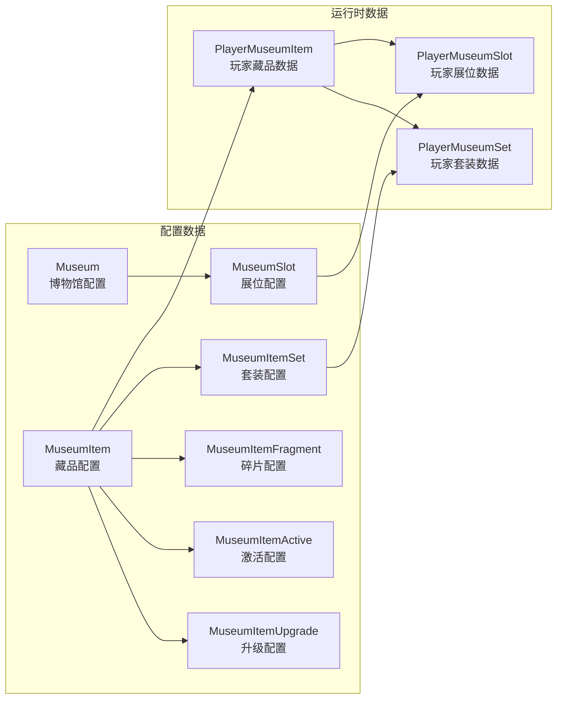

---

## 四、配表加载流程

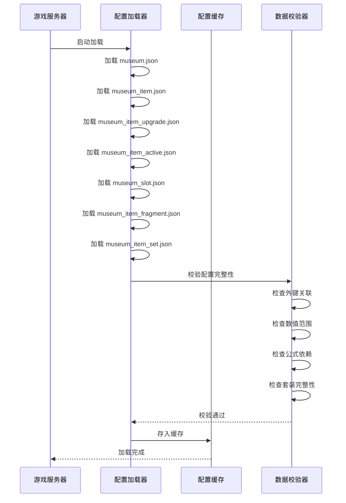

---

## 五、配置热更新

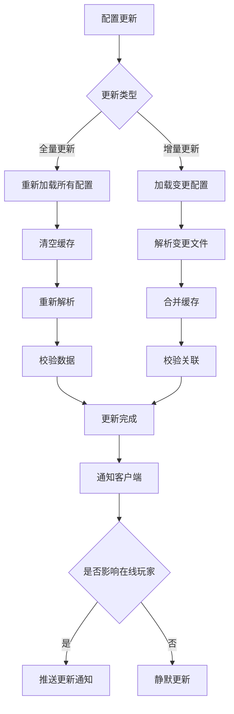

---

## 六、配表路径汇总

### 6.1 客户端配置

| 文件名 | 路径 | 说明 |
|--------|------|------|
| MuseumConfig.cs | game_client/Assets/Scripts/ResScripts/NPSO/GSO/Museum/ | 博物馆配置 |
| MuseumItemConfig.cs | game_client/Assets/Scripts/ResScripts/NPSO/GSO/Museum/ | 藏品配置 |
| MuseumItemUpgradeConfig.cs | game_client/Assets/Scripts/ResScripts/NPSO/GSO/Museum/ | 升级配置 |
| MuseumItemActiveConfig.cs | game_client/Assets/Scripts/ResScripts/NPSO/GSO/Museum/ | 激活配置 |
| MuseumSlotConfig.cs | game_client/Assets/Scripts/ResScripts/NPSO/GSO/Museum/ | 展位配置 |
| MuseumItemFragmentConfig.cs | game_client/Assets/Scripts/ResScripts/NPSO/GSO/Museum/ | 碎片配置 |
| MuseumItemSetConfig.cs | game_client/Assets/Scripts/ResScripts/NPSO/GSO/Museum/ | 套装配置 |

### 6.2 服务端配置

| 文件名 | 路径 | 说明 |
|--------|------|------|
| museum.json | game_server/Config/museum/ | 博物馆主配置 |
| museum_item.json | game_server/Config/museum/ | 藏品配置 |
| museum_item_upgrade.json | game_server/Config/museum/ | 升级配置 |
| museum_item_active.json | game_server/Config/museum/ | 激活配置 |
| museum_slot.json | game_server/Config/museum/ | 展位配置 |
| museum_item_fragment.json | game_server/Config/museum/ | 碎片配置 |
| museum_item_set.json | game_server/Config/museum/ | 套装配置 |

---

## 七、字段完整性检查清单

```mermaid
flowchart TD
    A[配置完整性检查] --> B[主键唯一性]
    A --> C[外键关联性]
    A --> D[数值范围性]
    A --> E[逻辑一致性]

    B --> B1[museum_id 唯一]
    B --> B2[item_id 唯一]
    B --> B3[fragment_id 唯一]
    B --> B4[item_id+level 唯一]
    B --> B5[item_id+active_id 唯一]

    C --> C1[upgrade.item_id 关联 item.item_id]
    C --> C2[active.item_id 关联 item.item_id]
    C --> C3[slot.museum_id 关联 museum.museum_id]
    C --> C4[fragment.item_id 关联 item.item_id]
    C --> C5[set.item_ids 关联 item.item_id]

    D --> D1[rarity 在 1-4 范围]
    D --> D2[item_type 在 1-4 范围]
    D --> D3[max_level 在 10-50 范围]
    D --> D4[success_rate 在 0-1 范围]
    D --> D5[display_reward_mult > 0]

    E --> E1[升级配置覆盖所有等级]
    E --> E2[激活条件可实现]
    E --> E3[套装包含有效藏品]
    E --> E4[碎片来源可获取]
```

---

---

## 八、配置校验规则

### 8.1 数据完整性校验

| 校验项 | 校验规则 | 错误级别 |
|--------|----------|----------|
| 主键唯一性 | museum_id、item_id、fragment_id 必须唯一 | ERROR |
| 外键关联性 | upgrade.item_id → item.item_id | ERROR |
| 数值范围 | rarity: 1-4, item_type: 1-4, max_level: 10-50 | ERROR |
| 必填字段检查 | 所有标记为必填的字段不能为空 | ERROR |
| JSON格式检查 | base_attr、growth_rate 等JSON字段格式正确 | WARN |

### 8.2 逻辑一致性校验

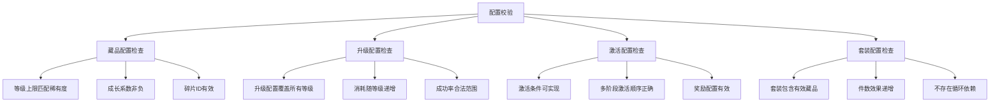

---

## 九、配置热更新机制

### 9.1 热更新流程

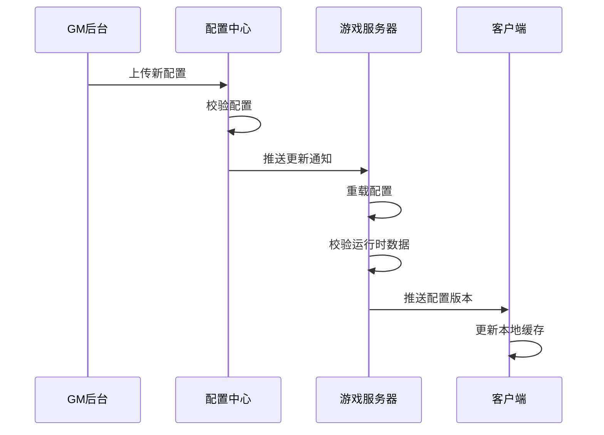

### 9.2 配置版本管理

| 版本号 | 格式 | 说明 |
|--------|------|------|
| major | 整数 | 大版本更新，可能不兼容 |
| minor | 整数 | 功能更新，兼容旧版本 |
| patch | 整数 | 修复更新，完全兼容 |

---

## 十、配置工具说明

### 10.1 配置导出工具

```bash
# 导出所有博物馆配置为客户端格式
python tools/config_exporter.py --module museum --output client

# 导出服务端格式
python tools/config_exporter.py --module museum --output server

# 校验配置
python tools/config_validator.py --module museum
```

### 10.2 配置对比工具

```bash
# 对比两个版本的配置差异
python tools/config_diff.py --module museum --old v1.0 --new v1.1

# 生成配置变更报告
python tools/config_report.py --module museum --output report.html
```

---

## 十一、字段约束规则详解

### 11.1 博物馆配置字段约束

| 字段名 | 数据类型 | 约束类型 | 取值范围 | 默认值 | 校验规则 |
|--------|----------|----------|----------|--------|----------|
| museum_id | int | PRIMARY KEY | 1-999 | - | 唯一，不可重复 |
| museum_name | string | NOT NULL | 1-50字符 | - | 非空，长度限制 |
| museum_desc | string | NULLABLE | 0-200字符 | "" | 可为空 |
| max_slot | int | NOT NULL | 1-100 | 10 | 必须 >= 1 |
| unlock_level | int | NOT NULL | 1-100 | 1 | 必须 >= 1 |
| unlock_condition | json | NULLABLE | - | {} | JSON格式校验 |
| icon | string | NULLABLE | - | "" | 资源路径存在性 |
| display_reward_base | int | NOT NULL | 1-1000 | 10 | 必须 > 0 |
| display_reward_type | int | NOT NULL | 1-10 | 1 | 枚举值校验 |

### 11.2 藏品配置字段约束

| 字段名 | 数据类型 | 约束类型 | 取值范围 | 默认值 | 校验规则 |
|--------|----------|----------|----------|--------|----------|
| item_id | int | PRIMARY KEY | 10001-99999 | - | 唯一，分区管理 |
| item_name | string | NOT NULL | 1-50字符 | - | 非空，唯一性 |
| item_desc | string | NULLABLE | 0-500字符 | "" | 可为空 |
| item_type | int | NOT NULL | 1-4 | - | 枚举值：{1:武器,2:防具,3:饰品,4:艺术} |
| rarity | int | NOT NULL | 1-4 | - | 枚举值：{1:普通,2:稀有,3:史诗,4:传说} |
| max_level | int | NOT NULL | 10-50 | - | 按稀有度规则校验 |
| base_attr | json | NOT NULL | - | {} | JSON格式，属性键值对 |
| growth_rate | json | NOT NULL | - | {} | JSON格式，与base_attr键匹配 |
| activate_condition | json | NULLABLE | - | {} | JSON格式校验 |
| activate_cost | json | NULLABLE | - | {} | JSON格式校验 |
| activate_effect | json | NULLABLE | - | {} | JSON格式校验 |
| icon | string | NULLABLE | - | "" | 资源路径存在性 |
| model | string | NULLABLE | - | "" | 资源路径存在性 |
| sort_weight | int | NULLABLE | 0-10000 | 0 | 排序权重 |
| fragment_id | int | FOREIGN KEY | 100001-999999 | 0 | 外键关联碎片表 |
| decompose_reward | json | NULLABLE | - | {} | JSON格式校验 |

### 11.3 稀有度与等级上限约束关系

| 稀有度 | 等级上限 | 成长倍率 | 碎片合成数 | 升级消耗倍率 | 激活消耗倍率 |
|--------|----------|----------|------------|--------------|--------------|
| 1(普通) | 10 | 1.0x | 5 | 1.0x | 1.0x |
| 2(稀有) | 20 | 1.5x | 10 | 1.5x | 1.5x |
| 3(史诗) | 30 | 2.0x | 20 | 2.5x | 2.0x |
| 4(传说) | 50 | 3.0x | 50 | 4.0x | 3.0x |

---

## 十二、配置校验规则详解

### 12.1 外键关联校验规则

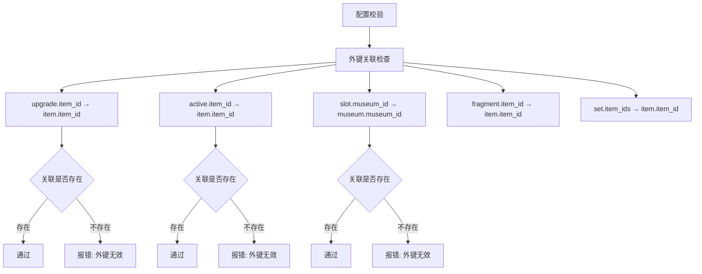

### 12.2 数值范围校验规则

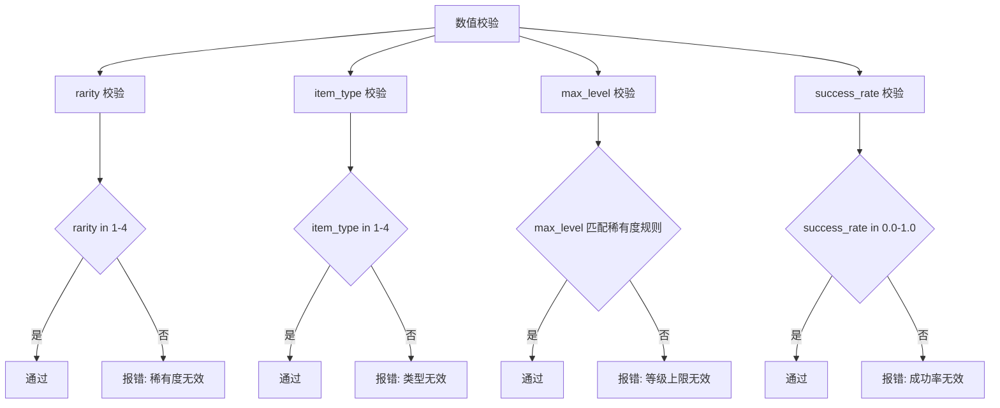

### 12.3 JSON字段格式校验规则

| JSON字段 | 必需键 | 可选键 | 值类型约束 | 示例 |
|----------|--------|--------|------------|------|
| base_attr | - | atk, def, hp, crit_rate, crit_dmg | int/float | {"atk": 10} |
| growth_rate | - | atk, def, hp, crit_rate, crit_dmg | int/float | {"atk": 2} |
| activate_condition | - | level, quest, active_items | int/int/list | {"level": 5} |
| activate_cost | - | gold, item:* | int | {"gold": 1000} |
| activate_effect | - | attr:* | int/float | {"attr:crit_dmg": 0.1} |
| cost_list | - | gold, item:* | int | {"gold": 100, "item:frag": 5} |
| drop_sources | - | dungeon, activity, shop, boss | list | {"dungeon": [101]} |

---

## 十三、属性类型枚举定义

### 13.1 属性类型枚举表

| 属性ID | 属性名称 | 属性类型 | 计算方式 | 适用藏品类型 |
|--------|----------|----------|----------|--------------|
| 1 | 攻击力 (atk) | 基础属性 | 加法累加 | 武器、艺术品 |
| 2 | 防御力 (def) | 基础属性 | 加法累加 | 防具、艺术品 |
| 3 | 生命值 (hp) | 基础属性 | 加法累加 | 防具、艺术品 |
| 4 | 暴击率 (crit_rate) | 百分比属性 | 加法累加 | 武器、饰品 |
| 5 | 暴击伤害 (crit_dmg) | 百分比属性 | 加法累加 | 武器、饰品 |
| 6 | 穿透 (penetrate) | 百分比属性 | 加法累加 | 武器 |
| 7 | 减伤 (reduce_dmg) | 百分比属性 | 加法累加 | 防具 |
| 8 | 全属性 (all_attr) | 百分比属性 | 加法累加 | 艺术品 |
| 9 | 技能伤害 (skill_dmg) | 百分比属性 | 加法累加 | 饰品 |
| 10 | 免疫控制 (immune_control) | 百分比属性 | 加法累加 | 传说藏品 |

### 13.2 属性计算优先级

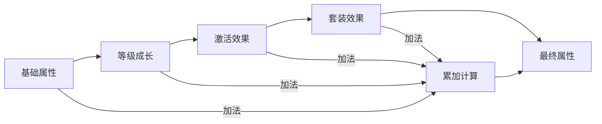

---

## 十四、配置导出格式示例

### 14.1 客户端C#配置类

```csharp
/// <summary>
/// 博物馆配置类
/// </summary>
public class MuseumConfig
{
    public int museum_id;
    public string museum_name;
    public string museum_desc;
    public int max_slot;
    public int unlock_level;
    public Dictionary<string, object> unlock_condition;
    public string icon;
    public int display_reward_base;
    public int display_reward_type;

    /// <summary>
    /// 解锁条件检查
    /// </summary>
    public bool CheckUnlockCondition(PlayerInfo player)
    {
        if (player.level < unlock_level) return false;

        if (unlock_condition.TryGetValue("vip", out var vip))
        {
            if (player.vipLevel < (int)vip) return false;
        }

        if (unlock_condition.TryGetValue("quest_complete", out var quest))
        {
            if (!QuestManager.IsComplete((int)quest)) return false;
        }

        return true;
    }
}

/// <summary>
/// 藏品配置类
/// </summary>
public class MuseumItemConfig
{
    public int item_id;
    public string item_name;
    public string item_desc;
    public int item_type;
    public int rarity;
    public int max_level;
    public Dictionary<string, long> base_attr;
    public Dictionary<string, long> growth_rate;
    public Dictionary<string, object> activate_condition;
    public Dictionary<string, int> activate_cost;
    public Dictionary<string, long> activate_effect;
    public string icon;
    public string model;
    public int sort_weight;
    public int fragment_id;
    public Dictionary<string, int> decompose_reward;

    /// <summary>
    /// 计算指定等级属性
    /// </summary>
    public Dictionary<int, long> CalculateAttr(int level)
    {
        var result = new Dictionary<int, long>();

        foreach (var attr in base_attr)
        {
            int attrType = ParseAttrType(attr.Key);
            long value = attr.Value;

            if (growth_rate.TryGetValue(attr.Key, out var growth))
            {
                value += (level - 1) * growth;
            }

            result[attrType] = value;
        }

        return result;
    }

    /// <summary>
    /// 获取稀有度名称
    /// </summary>
    public string GetRarityName()
    {
        switch (rarity)
        {
            case 1: return "普通";
            case 2: return "稀有";
            case 3: return "史诗";
            case 4: return "传说";
            default: return "未知";
        }
    }

    private int ParseAttrType(string attrKey)
    {
        return attrKey switch
        {
            "atk" => 1,
            "def" => 2,
            "hp" => 3,
            "crit_rate" => 4,
            "crit_dmg" => 5,
            "penetrate" => 6,
            "reduce_dmg" => 7,
            "all_attr" => 8,
            _ => 0
        };
    }
}

/// <summary>
/// 套装配置类
/// </summary>
public class MuseumItemSetConfig
{
    public int set_id;
    public string set_name;
    public string set_desc;
    public List<int> item_ids;
    public Dictionary<int, Dictionary<string, long>> effects;

    /// <summary>
    /// 获取激活效果
    /// </summary>
    public List<Dictionary<string, long>> GetActiveEffects(int activeCount)
    {
        var result = new List<Dictionary<string, long>>();

        foreach (var effect in effects)
        {
            if (activeCount >= effect.Key)
            {
                result.Add(effect.Value);
            }
        }

        return result;
    }

    /// <summary>
    /// 检查藏品是否属于此套装
    /// </summary>
    public bool ContainsItem(int itemId)
    {
        return item_ids.Contains(itemId);
    }
}
```

### 14.2 服务端Java配置类

```java
/**
 * 博物馆配置类
 */
@Data
public class RefMuseum {
    private int museumId;
    private String museumName;
    private String museumDesc;
    private int maxSlot;
    private int unlockLevel;
    private Map<String, Object> unlockCondition;
    private String icon;
    private int displayRewardBase;
    private int displayRewardType;

    /**
     * 检查解锁条件
     */
    public boolean checkUnlock(PlayerInfo player) {
        if (player.getLevel() < unlockLevel) {
            return false;
        }

        if (unlockCondition.containsKey("vip")) {
            int needVip = ((Number) unlockCondition.get("vip")).intValue();
            if (player.getVipLevel() < needVip) {
                return false;
            }
        }

        if (unlockCondition.containsKey("quest_complete")) {
            int questId = ((Number) unlockCondition.get("quest_complete")).intValue();
            if (!questService.isComplete(player.getId(), questId)) {
                return false;
            }
        }

        return true;
    }
}

/**
 * 藏品配置类
 */
@Data
public class RefMuseumItem {
    private int itemId;
    private String itemName;
    private String itemDesc;
    private int itemType;
    private int rarity;
    private int maxLevel;
    private Map<String, Long> baseAttr;
    private Map<String, Long> growthRate;
    private Map<String, Object> activateCondition;
    private Map<String, Integer> activateCost;
    private Map<String, Long> activateEffect;
    private String icon;
    private String model;
    private int sortWeight;
    private int fragmentId;
    private Map<String, Integer> decomposeReward;

    /**
     * 计算指定等级属性
     */
    public Map<Integer, Long> calculateAttr(int level) {
        Map<Integer, Long> result = new HashMap<>();

        for (Map.Entry<String, Long> entry : baseAttr.entrySet()) {
            int attrType = parseAttrType(entry.getKey());
            long value = entry.getValue();

            if (growthRate.containsKey(entry.getKey())) {
                value += (level - 1) * growthRate.get(entry.getKey());
            }

            result.put(attrType, value);
        }

        return result;
    }

    /**
     * 获取稀有度倍率
     */
    public double getRarityMultiplier() {
        switch (rarity) {
            case 1: return 1.0;
            case 2: return 1.5;
            case 3: return 2.0;
            case 4: return 3.0;
            default: return 1.0;
        }
    }

    private int parseAttrType(String attrKey) {
        switch (attrKey) {
            case "atk": return 1;
            case "def": return 2;
            case "hp": return 3;
            case "crit_rate": return 4;
            case "crit_dmg": return 5;
            case "penetrate": return 6;
            case "reduce_dmg": return 7;
            case "all_attr": return 8;
            default: return 0;
        }
    }
}
```

---

## 十五、配置加载流程详解

### 15.1 配置加载顺序

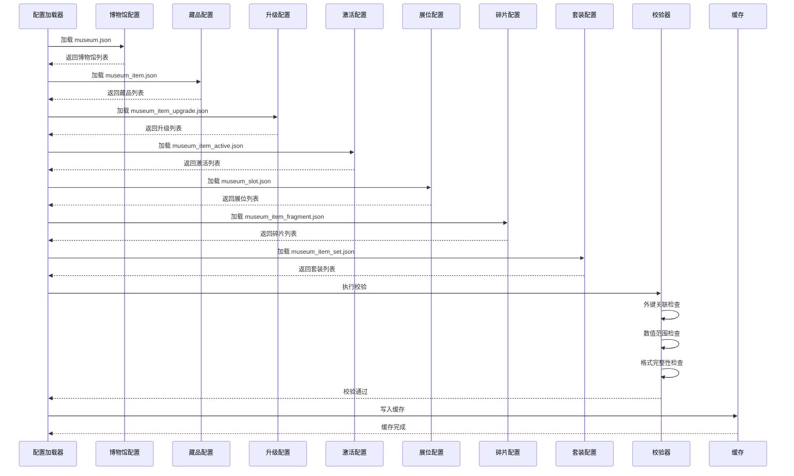

### 15.2 配置版本管理

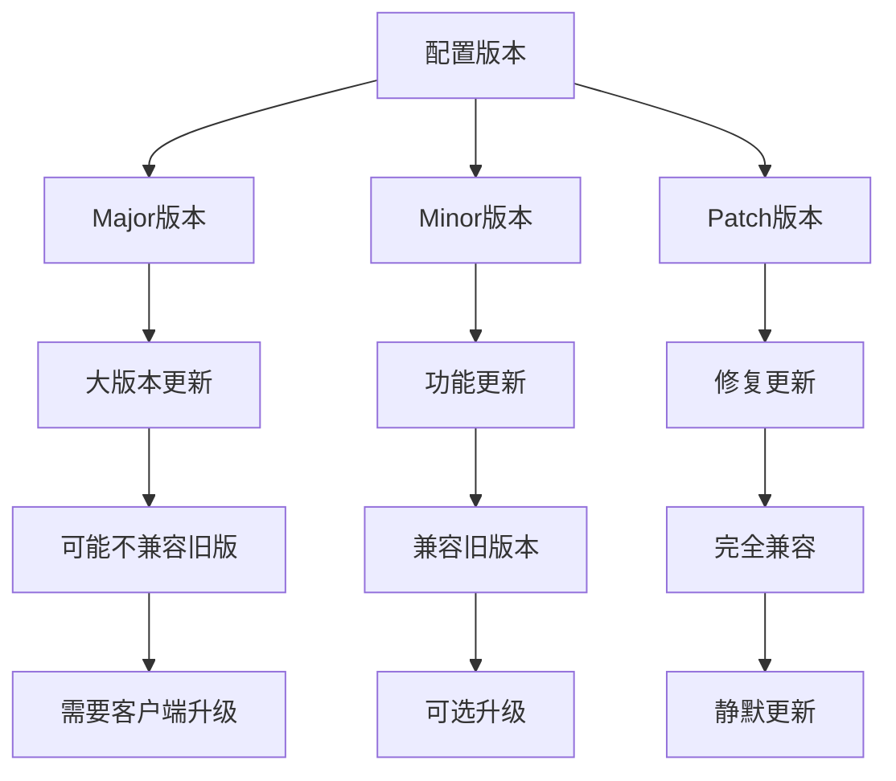

---

## 十六、配置管理工具命令

### 16.1 配置导出命令

```bash
# 导出所有博物馆配置为客户端格式
python tools/config_exporter.py --module museum --output client --format cs

# 导出服务端格式
python tools/config_exporter.py --module museum --output server --format java

# 导出JSON格式
python tools/config_exporter.py --module museum --output json

# 校验配置完整性
python tools/config_validator.py --module museum --verbose

# 检查外键关联
python tools/config_validator.py --module museum --check-foreign-key

# 检查数值范围
python tools/config_validator.py --module museum --check-range
```

### 16.2 配置对比命令

```bash
# 对比两个版本的配置差异
python tools/config_diff.py --module museum --old v1.0 --new v1.1

# 生成配置变更报告
python tools/config_report.py --module museum --output report.html

# 导出变更的配置项
python tools/config_diff.py --module museum --export-changes changes.json
```

---

## 十七、配置错误码定义

| 错误码 | 错误类型 | 错误信息 | 处理建议 |
|--------|----------|----------|----------|
| CFG_001 | 主键重复 | museum_id 重复 | 检查配置ID唯一性 |
| CFG_002 | 外键无效 | item_id 关联不存在 | 检查关联配置是否存在 |
| CFG_003 | 数值范围 | rarity 超出范围 1-4 | 检查稀有度取值 |
| CFG_004 | 格式错误 | JSON 格式解析失败 | 检查JSON格式正确性 |
| CFG_005 | 必填缺失 | base_attr 字段缺失 | 检查必填字段完整性 |
| CFG_006 | 逻辑冲突 | max_level 与 rarity 不匹配 | 检查等级上限规则 |
| CFG_007 | 资源缺失 | icon 资源不存在 | 检查资源路径正确性 |
| CFG_008 | 依赖缺失 | fragment_id 配置不存在 | 检查碎片配置关联 |

---

*文档生成时间: 2026-04-12*
*文档版本: v2.2*
