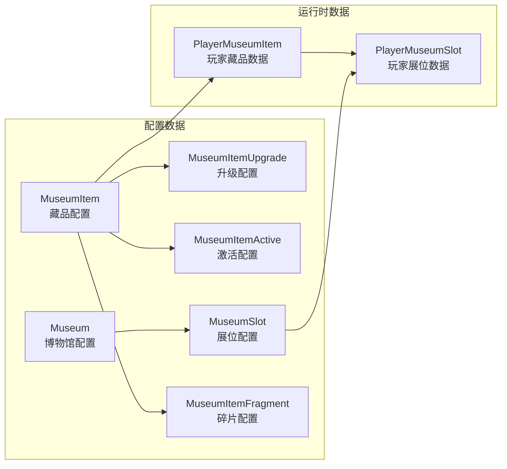
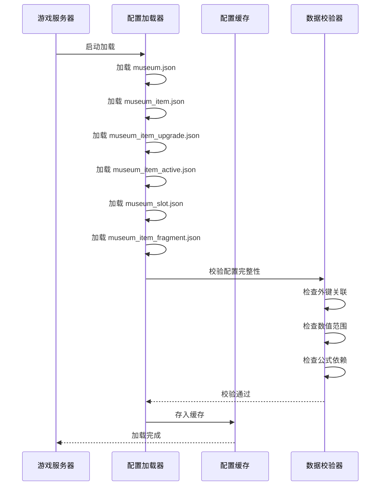
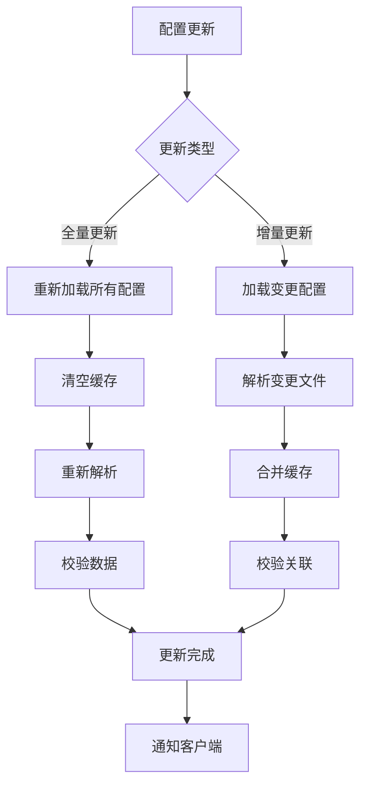

# 博物馆系统 - 数据配表

**模块名称**: Museum（博物馆系统）
**模块编号**: p035
**文档版本**: 2.0
**更新日期**: 2026-04-11

---

## 一、配表总览

```mermaid
erDiagram
    Museum ||--o{ MuseumSlot : contains
    Museum ||--o{ MuseumItem : displays
    MuseumItem ||--o{ MuseumItemUpgrade : upgrades
    MuseumItem ||--o{ MuseumItemActive : activates
    MuseumItem }o--|| MuseumItemType : belongs_to
    MuseumItem }o--|| MuseumItemRarity : has_rarity
    
    Museum {
        int museum_id PK
        string museum_name
        int max_slot
        int unlock_level
        json unlock_condition
    }
    
    MuseumItem {
        int item_id PK
        string item_name
        int item_type FK
        int rarity FK
        int max_level
        json base_attr
        json growth_rate
        json activate_condition
        json activate_effect
    }
    
    MuseumItemUpgrade {
        int item_id PK
        int level PK
        json cost_list
        json attr_add
    }
    
    MuseumItemActive {
        int item_id PK
        int active_id
        json condition
        json cost
        json reward
    }
    
    MuseumSlot {
        int slot_index PK
        int museum_id FK
        int unlock_condition
        json display_reward
    }
```



---

## 二、主配表详情

### 2.1 博物馆配置表 (Museum)

**文件路径**: `game_server/Config/museum/museum.json`

| 字段名 | 类型 | 必填 | 默认值 | 说明 | 示例值 |
|--------|------|------|--------|------|--------|
| museum_id | int | 是 | - | 博物馆ID（主键） | 1 |
| museum_name | string | 是 | - | 博物馆名称 | "皇家博物馆" |
| museum_desc | string | 否 | "" | 博物馆描述 | "展示珍贵藏品的场所" |
| max_slot | int | 是 | 10 | 最大展位数量 | 20 |
| unlock_level | int | 是 | 1 | 解锁玩家等级 | 10 |
| unlock_condition | json | 否 | {} | 解锁条件配置 | {"vip": 3} |
| icon | string | 否 | "" | 图标资源路径 | "ui/museum/icon_1" |
| display_reward_base | int | 否 | 10 | 展示基础奖励 | 10 |

**配置示例**:

```json
[
  {
    "museum_id": 1,
    "museum_name": "皇家博物馆",
    "museum_desc": "展示您收集的珍贵藏品",
    "max_slot": 10,
    "unlock_level": 1,
    "unlock_condition": {},
    "icon": "ui/museum/museum_royal",
    "display_reward_base": 10
  },
  {
    "museum_id": 2,
    "museum_name": "勇士殿堂",
    "museum_desc": "武器与装备的展示厅",
    "max_slot": 15,
    "unlock_level": 30,
    "unlock_condition": {"quest_complete": 1001},
    "icon": "ui/museum/museum_warrior",
    "display_reward_base": 15
  }
]
```

---

### 2.2 藏品配置表 (MuseumItem)

**文件路径**: `game_server/Config/museum/museum_item.json`

| 字段名 | 类型 | 必填 | 默认值 | 说明 | 取值范围 |
|--------|------|------|--------|------|----------|
| item_id | int | 是 | - | 藏品ID（主键） | > 0 |
| item_name | string | 是 | - | 藏品名称 | 1-50字符 |
| item_desc | string | 否 | "" | 藏品描述 | - |
| item_type | int | 是 | - | 藏品类型 | 1-4 |
| rarity | int | 是 | - | 稀有度 | 1-4 |
| max_level | int | 是 | - | 最大等级 | 10-50 |
| base_attr | json | 是 | {} | 基础属性 | - |
| growth_rate | json | 是 | {} | 成长系数 | - |
| activate_condition | json | 否 | {} | 激活条件 | - |
| activate_cost | json | 否 | {} | 激活消耗 | - |
| activate_effect | json | 否 | {} | 激活效果 | - |
| icon | string | 否 | "" | 图标资源 | - |
| model | string | 否 | "" | 3D模型资源 | - |
| sort_weight | int | 否 | 0 | 排序权重 | - |

**藏品类型枚举**:

| 值 | 名称 | 说明 |
|----|------|------|
| 1 | WEAPON | 武器类 - 提升攻击属性 |
| 2 | ARMOR | 防具类 - 提升防御属性 |
| 3 | ACCESSORY | 饰品类 - 提升特殊属性 |
| 4 | ARTWORK | 艺术品类 - 提升综合属性 |

**稀有度枚举**:

| 值 | 名称 | 颜色 | 等级上限 | 成长倍率 |
|----|------|------|----------|----------|
| 1 | COMMON | 白色 | 10 | 1.0 |
| 2 | RARE | 蓝色 | 20 | 1.5 |
| 3 | EPIC | 紫色 | 30 | 2.0 |
| 4 | LEGENDARY | 橙色 | 50 | 3.0 |

**配置示例**:

```json
[
  {
    "item_id": 10001,
    "item_name": "古代长剑",
    "item_desc": "一把古老的长剑，剑身已布满岁月的痕迹",
    "item_type": 1,
    "rarity": 2,
    "max_level": 20,
    "base_attr": {"atk": 10, "crit_rate": 0.01},
    "growth_rate": {"atk": 2, "crit_rate": 0.002},
    "activate_condition": {"level": 5},
    "activate_cost": {"item:10001": 5},
    "activate_effect": {"crit_dmg": 0.1},
    "icon": "ui/museum/item_sword_01",
    "model": "models/museum/sword_01",
    "sort_weight": 100
  },
  {
    "item_id": 20001,
    "item_name": "传说王冠",
    "item_desc": "古老王国的传世之宝",
    "item_type": 4,
    "rarity": 4,
    "max_level": 50,
    "base_attr": {"atk": 50, "def": 30, "hp": 100},
    "growth_rate": {"atk": 5, "def": 3, "hp": 10},
    "activate_condition": {"level": 10, "quest": 2001},
    "activate_cost": {"item:20001": 10, "gold": 10000},
    "activate_effect": {"all_attr": 0.05},
    "icon": "ui/museum/item_crown_legend",
    "model": "models/museum/crown_legend",
    "sort_weight": 1000
  }
]
```

---

### 2.3 藏品升级配置表 (MuseumItemUpgrade)

**文件路径**: `game_server/Config/museum/museum_item_upgrade.json`

| 字段名 | 类型 | 必填 | 说明 |
|--------|------|------|------|
| item_id | int | 是 | 藏品ID |
| level | int | 是 | 目标等级 |
| cost_list | json | 是 | 升级消耗列表 |
| attr_add | json | 是 | 本级属性增量 |
| success_rate | float | 否 | 升级成功率（默认100%） |

**配置示例**:

```json
[
  {
    "item_id": 10001,
    "level": 2,
    "cost_list": {"gold": 100, "item:frag_museum": 5},
    "attr_add": {"atk": 2, "crit_rate": 0.002},
    "success_rate": 1.0
  },
  {
    "item_id": 10001,
    "level": 6,
    "cost_list": {"gold": 500, "item:frag_museum": 10, "item:stone_upgrade": 1},
    "attr_add": {"atk": 2, "crit_rate": 0.002},
    "success_rate": 0.95
  },
  {
    "item_id": 10001,
    "level": 11,
    "cost_list": {"gold": 1000, "item:frag_museum": 20, "item:stone_upgrade": 3},
    "attr_add": {"atk": 2, "crit_rate": 0.002},
    "success_rate": 0.8
  }
]
```

---

### 2.4 藏品激活配置表 (MuseumItemActive)

**文件路径**: `game_server/Config/museum/museum_item_active.json`

| 字段名 | 类型 | 必填 | 说明 |
|--------|------|------|------|
| item_id | int | 是 | 藏品ID |
| active_id | int | 是 | 激活阶段ID |
| condition | json | 是 | 激活条件 |
| cost | json | 是 | 激活消耗 |
| reward | json | 否 | 激活奖励 |

**配置示例**:

```json
[
  {
    "item_id": 10001,
    "active_id": 1,
    "condition": {"level": 5},
    "cost": {"item:stone_activate": 1},
    "reward": {"attr:crit_dmg": 0.1}
  },
  {
    "item_id": 20001,
    "active_id": 1,
    "condition": {"level": 10},
    "cost": {"item:stone_activate_rare": 1, "gold": 5000},
    "reward": {"attr:all_attr": 0.03}
  },
  {
    "item_id": 20001,
    "active_id": 2,
    "condition": {"level": 25, "quest": 2001},
    "cost": {"item:stone_activate_epic": 1, "gold": 20000},
    "reward": {"attr:all_attr": 0.05}
  }
]
```

---

### 2.5 展位配置表 (MuseumSlot)

**文件路径**: `game_server/Config/museum/museum_slot.json`

| 字段名 | 类型 | 必填 | 说明 |
|--------|------|------|------|
| museum_id | int | 是 | 博物馆ID |
| slot_index | int | 是 | 展位索引 |
| unlock_condition | json | 否 | 解锁条件 |
| display_reward_mult | float | 否 | 展示收益倍率 |

**配置示例**:

```json
[
  {
    "museum_id": 1,
    "slot_index": 0,
    "unlock_condition": {},
    "display_reward_mult": 1.0
  },
  {
    "museum_id": 1,
    "slot_index": 5,
    "unlock_condition": {"vip": 2},
    "display_reward_mult": 1.2
  },
  {
    "museum_id": 1,
    "slot_index": 10,
    "unlock_condition": {"item:ticket_slot": 1},
    "display_reward_mult": 1.5
  }
]
```

---

### 2.6 藏品碎片配置表 (MuseumItemFragment)

**文件路径**: `game_server/Config/museum/museum_item_fragment.json`

| 字段名 | 类型 | 必填 | 说明 |
|--------|------|------|------|
| fragment_id | int | 是 | 碎片ID |
| item_id | int | 是 | 对应藏品ID |
| fragment_name | string | 是 | 碎片名称 |
| compose_count | int | 是 | 合成所需数量 |
| drop_sources | json | 是 | 掉落来源 |

**配置示例**:

```json
[
  {
    "fragment_id": 100011,
    "item_id": 10001,
    "fragment_name": "古代长剑碎片",
    "compose_count": 10,
    "drop_sources": ["dungeon:101", "activity:1", "shop:1"]
  }
]
```

---

## 三、数据关系图



---

## 四、配表加载流程



---

## 五、配表路径

### 5.1 客户端配置

| 文件名 | 路径 | 说明 |
|--------|------|------|
| MuseumConfig.cs | game_client/Assets/Scripts/ResScripts/NPSO/GSO/Museum/ | 博物馆配置 |
| MuseumItemConfig.cs | game_client/Assets/Scripts/ResScripts/NPSO/GSO/Museum/ | 藏品配置 |
| MuseumItemUpgradeConfig.cs | game_client/Assets/Scripts/ResScripts/NPSO/GSO/Museum/ | 升级配置 |

### 5.2 服务端配置

| 文件名 | 路径 | 说明 |
|--------|------|------|
| museum.json | game_server/Config/museum/ | 博物馆主配置 |
| museum_item.json | game_server/Config/museum/ | 藏品配置 |
| museum_item_upgrade.json | game_server/Config/museum/ | 升级配置 |
| museum_item_active.json | game_server/Config/museum/ | 激活配置 |
| museum_slot.json | game_server/Config/museum/ | 展位配置 |
| museum_item_fragment.json | game_server/Config/museum/ | 碎片配置 |

---

## 六、配置热更新



---

*文档生成时间: 2026-04-11*
