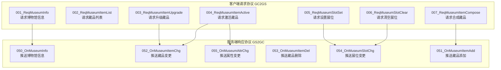
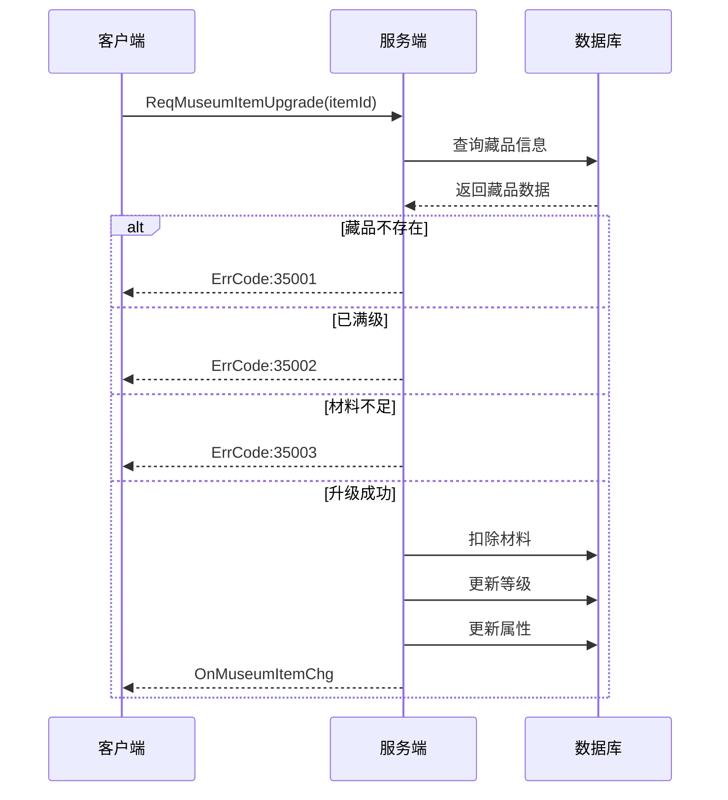
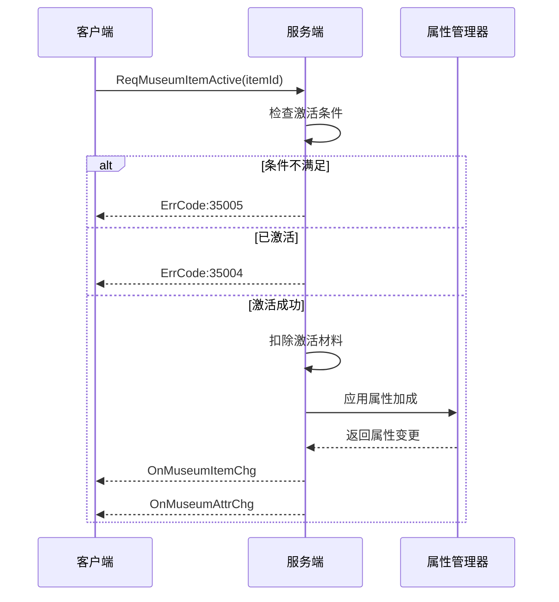
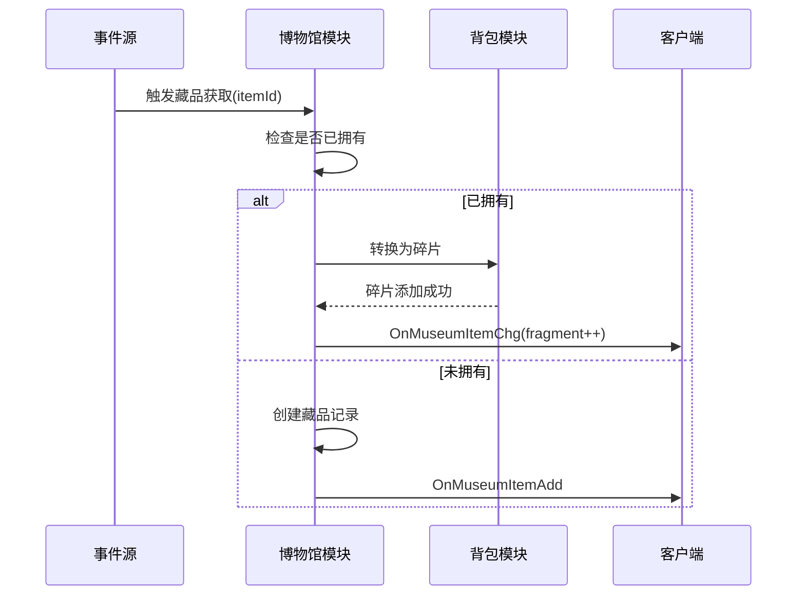
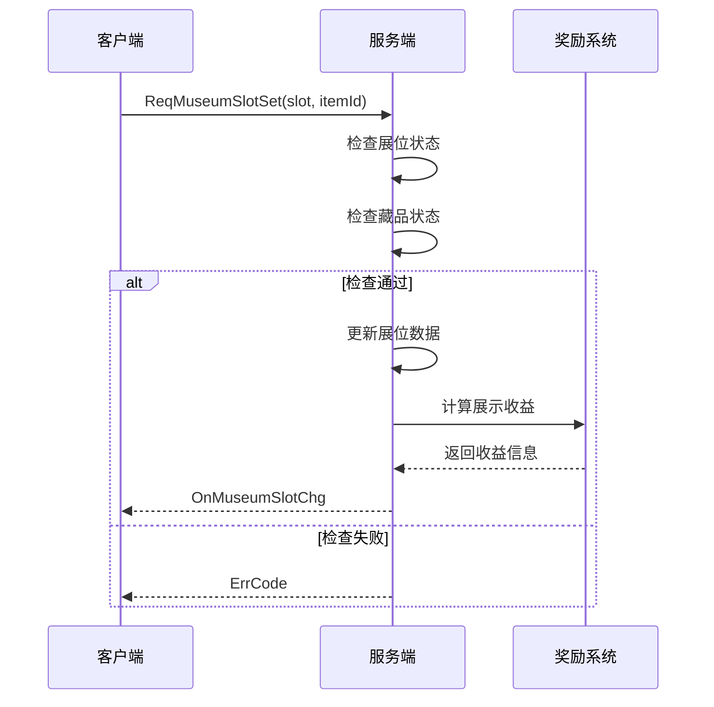

# 博物馆系统 - 协议文档

**模块名称**: Museum（博物馆系统）
**模块编号**: p035
**文档版本**: 2.0
**更新日期**: 2026-04-11

---

## 一、协议总览



---

## 二、数据结构定义

### 2.1 MuseumInfo（博物馆信息）

| 字段名 | 类型 | 必填 | 说明 |
|--------|------|------|------|
| museumId | int | 是 | 博物馆ID |
| maxSlot | int | 是 | 最大展位数 |
| unlockTime | long | 是 | 解锁时间戳 |
| collectCount | int | 是 | 已收集藏品数 |
| totalCount | int | 是 | 藏品总数 |
| activeCount | int | 是 | 已激活藏品数 |

### 2.2 MuseumItemInfo（藏品信息）

| 字段名 | 类型 | 必填 | 说明 |
|--------|------|------|------|
| itemId | int | 是 | 藏品配置ID |
| level | int | 是 | 当前等级 |
| isActive | bool | 是 | 是否已激活 |
| unlockTime | long | 是 | 解锁时间戳 |
| slotIndex | int | 否 | 所在展位索引（-1表示未展示） |
| fragment | int | 否 | 当前碎片数量 |
| attrs | map | 是 | 当前属性值列表 |

### 2.3 MuseumSlotInfo（展位信息）

| 字段名 | 类型 | 必填 | 说明 |
|--------|------|------|------|
| slotIndex | int | 是 | 展位索引 |
| itemId | int | 是 | 展示的藏品ID（0表示空闲） |
| isLocked | bool | 是 | 是否锁定 |
| displayTime | long | 否 | 展示开始时间 |

### 2.4 AttrPair（属性键值对）

| 字段名 | 类型 | 必填 | 说明 |
|--------|------|------|------|
| attrType | int | 是 | 属性类型枚举 |
| attrValue | long | 是 | 属性值 |

---

## 三、客户端请求协议 (GC2GS)

### 3.1 GC2GS_035_001_ReqMuseumInfo

**功能说明**: 请求博物馆信息

**触发场景**: 进入博物馆界面时

**请求参数**:

| 字段名 | 类型 | 必填 | 说明 |
|--------|------|------|------|
| museumId | int | 是 | 博物馆ID（0表示所有） |

**返回协议**: GS2GC_035_050_OnMuseumInfo

**协议结构**:

```protobuf
message GC2GS_035_001_ReqMuseumInfo {
    int32 museum_id = 1;
}
```

---

### 3.2 GC2GS_035_002_ReqMuseumItemList

**功能说明**: 请求藏品列表

**触发场景**: 查看藏品列表时

**请求参数**:

| 字段名 | 类型 | 必填 | 说明 |
|--------|------|------|------|
| museumId | int | 否 | 博物馆ID（0表示所有） |
| itemType | int | 否 | 藏品类型（0表示所有） |
| rarity | int | 否 | 稀有度（0表示所有） |
| pageIndex | int | 是 | 页码索引（从1开始） |
| pageSize | int | 是 | 每页数量 |

**返回协议**: GS2GC_035_052_OnMuseumItemChg（批量）

**协议结构**:

```protobuf
message GC2GS_035_002_ReqMuseumItemList {
    int32 museum_id = 1;
    int32 item_type = 2;
    int32 rarity = 3;
    int32 page_index = 4;
    int32 page_size = 5;
}
```

---

### 3.3 GC2GS_035_003_ReqMuseumItemUpgrade

**功能说明**: 请求升级藏品

**触发场景**: 点击升级按钮时

**请求参数**:

| 字段名 | 类型 | 必填 | 说明 |
|--------|------|------|------|
| itemId | int | 是 | 藏品ID |
| upgradeCount | int | 否 | 升级次数（默认1） |
| autoUse | bool | 否 | 是否自动使用材料 |

**返回协议**: GS2GC_035_052_OnMuseumItemChg

**协议结构**:

```protobuf
message GC2GS_035_003_ReqMuseumItemUpgrade {
    int32 item_id = 1;
    int32 upgrade_count = 2;
    bool auto_use = 3;
}
```

**业务流程**:



---

### 3.4 GC2GS_035_004_ReqMuseumItemActive

**功能说明**: 请求激活藏品

**触发场景**: 点击激活按钮时

**请求参数**:

| 字段名 | 类型 | 必填 | 说明 |
|--------|------|------|------|
| itemId | int | 是 | 藏品ID |

**返回协议**: GS2GC_035_052_OnMuseumItemChg + GS2GC_035_055_OnMuseumAttrChg

**协议结构**:

```protobuf
message GC2GS_035_004_ReqMuseumItemActive {
    int32 item_id = 1;
}
```

**业务流程**:



---

### 3.5 GC2GS_035_005_ReqMuseumSlotSet

**功能说明**: 请求设置展位

**触发场景**: 将藏品放入展位时

**请求参数**:

| 字段名 | 类型 | 必填 | 说明 |
|--------|------|------|------|
| slotIndex | int | 是 | 展位索引 |
| itemId | int | 是 | 藏品ID（0表示清空） |

**返回协议**: GS2GC_035_054_OnMuseumSlotChg

**协议结构**:

```protobuf
message GC2GS_035_005_ReqMuseumSlotSet {
    int32 slot_index = 1;
    int32 item_id = 2;
}
```

---

### 3.6 GC2GS_035_006_ReqMuseumSlotClear

**功能说明**: 请求清空展位

**触发场景**: 从展位移出藏品时

**请求参数**:

| 字段名 | 类型 | 必填 | 说明 |
|--------|------|------|------|
| slotIndex | int | 是 | 展位索引 |

**返回协议**: GS2GC_035_054_OnMuseumSlotChg

**协议结构**:

```protobuf
message GC2GS_035_006_ReqMuseumSlotClear {
    int32 slot_index = 1;
}
```

---

### 3.7 GC2GS_035_007_ReqMuseumItemCompose

**功能说明**: 请求合成藏品

**触发场景**: 使用碎片合成藏品时

**请求参数**:

| 字段名 | 类型 | 必填 | 说明 |
|--------|------|------|------|
| fragmentId | int | 是 | 碎片ID |
| composeCount | int | 是 | 合成数量 |

**返回协议**: GS2GC_035_051_OnMuseumItemAdd

**协议结构**:

```protobuf
message GC2GS_035_007_ReqMuseumItemCompose {
    int32 fragment_id = 1;
    int32 compose_count = 2;
}
```

---

## 四、服务端响应协议 (GS2GC)

### 4.1 GS2GC_035_050_OnMuseumInfo

**功能说明**: 推送博物馆信息

**触发场景**: 
- 进入博物馆界面
- 博物馆信息变更时

**响应字段**:

| 字段名 | 类型 | 说明 |
|--------|------|------|
| museumInfo | MuseumInfo | 博物馆信息 |

**协议结构**:

```protobuf
message GS2GC_035_050_OnMuseumInfo {
    MuseumInfo museum_info = 1;
}

message MuseumInfo {
    int32 museum_id = 1;
    int32 max_slot = 2;
    int64 unlock_time = 3;
    int32 collect_count = 4;
    int32 total_count = 5;
    int32 active_count = 6;
}
```

---

### 4.2 GS2GC_035_051_OnMuseumItemAdd

**功能说明**: 推送藏品添加

**触发场景**: 
- 获得新藏品
- 合成藏品成功

**响应字段**:

| 字段名 | 类型 | 说明 |
|--------|------|------|
| itemInfo | MuseumItemInfo | 新增藏品信息 |

**协议结构**:

```protobuf
message GS2GC_035_051_OnMuseumItemAdd {
    MuseumItemInfo item_info = 1;
}

message MuseumItemInfo {
    int32 item_id = 1;
    int32 level = 2;
    bool is_active = 3;
    int64 unlock_time = 4;
    int32 slot_index = 5;
    int32 fragment = 6;
    repeated AttrPair attrs = 7;
}
```

---

### 4.3 GS2GC_035_052_OnMuseumItemChg

**功能说明**: 推送藏品变更

**触发场景**: 
- 藏品升级成功
- 藏品激活成功
- 碎片数量变化

**响应字段**:

| 字段名 | 类型 | 说明 |
|--------|------|------|
| itemId | int | 藏品ID |
| level | int | 当前等级 |
| isActive | bool | 是否激活 |
| fragment | int | 碎片数量 |
| attrs | list | 当前属性值 |

**协议结构**:

```protobuf
message GS2GC_035_052_OnMuseumItemChg {
    int32 item_id = 1;
    int32 level = 2;
    bool is_active = 3;
    int32 fragment = 4;
    repeated AttrPair attrs = 5;
}
```

---

### 4.4 GS2GC_035_053_OnMuseumItemDel

**功能说明**: 推送藏品删除

**触发场景**: 
- 使用藏品兑换其他物品
- 特殊活动消耗藏品

**响应字段**:

| 字段名 | 类型 | 说明 |
|--------|------|------|
| itemId | int | 删除的藏品ID |

**协议结构**:

```protobuf
message GS2GC_035_053_OnMuseumItemDel {
    int32 item_id = 1;
}
```

---

### 4.5 GS2GC_035_054_OnMuseumSlotChg

**功能说明**: 推送展位变更

**触发场景**: 
- 设置展位
- 清空展位
- 展位锁定状态变化

**响应字段**:

| 字段名 | 类型 | 说明 |
|--------|------|------|
| slotInfo | MuseumSlotInfo | 展位信息 |

**协议结构**:

```protobuf
message GS2GC_035_054_OnMuseumSlotChg {
    MuseumSlotInfo slot_info = 1;
}

message MuseumSlotInfo {
    int32 slot_index = 1;
    int32 item_id = 2;
    bool is_locked = 3;
    int64 display_time = 4;
}
```

---

### 4.6 GS2GC_035_055_OnMuseumAttrChg

**功能说明**: 推送属性变更

**触发场景**: 
- 藏品激活
- 藏品升级（已激活状态）
- 藏品取消激活

**响应字段**:

| 字段名 | 类型 | 说明 |
|--------|------|------|
| attrType | int | 属性类型 |
| oldValue | long | 旧值 |
| newValue | long | 新值 |
| source | string | 来源标识 |

**协议结构**:

```protobuf
message GS2GC_035_055_OnMuseumAttrChg {
    repeated AttrChange changes = 1;
}

message AttrChange {
    int32 attr_type = 1;
    int64 old_value = 2;
    int64 new_value = 3;
    string source = 4;
}
```

---

## 五、错误码定义

| 错误码 | 错误名 | 错误信息 | 处理建议 |
|--------|--------|----------|----------|
| 35001 | ITEM_NOT_FOUND | 藏品不存在 | 检查藏品ID，刷新数据 |
| 35002 | ITEM_MAX_LEVEL | 藏品已满级 | 提示已达最高等级 |
| 35003 | MATERIAL_NOT_ENOUGH | 升级材料不足 | 引导获取材料 |
| 35004 | ITEM_ALREADY_ACTIVE | 藏品已激活 | 无需重复操作 |
| 35005 | ACTIVE_CONDITION_NOT_MET | 激活条件不满足 | 显示缺失条件 |
| 35006 | SLOT_FULL | 展位已满 | 引导扩展展位 |
| 35007 | ITEM_NOT_UNLOCKED | 藏品未解锁 | 显示解锁条件 |
| 35008 | SLOT_LOCKED | 展位被锁定 | 显示解锁条件 |
| 35009 | FRAGMENT_NOT_ENOUGH | 碎片不足 | 引导获取碎片 |
| 35010 | COMPOSE_LIMIT_REACHED | 合成次数上限 | 提示已达上限 |
| 35011 | ITEM_IN_SLOT | 藏品正在展示中 | 先移出展位 |
| 35012 | INVALID_SLOT_INDEX | 无效展位索引 | 检查展位范围 |

---

## 六、协议时序图

### 6.1 藏品获取时序



### 6.2 展示管理时序



---

## 七、协议版本兼容

| 版本 | 更新内容 | 兼容性 |
|------|----------|--------|
| 1.0 | 初始版本 | - |
| 1.1 | 新增批量升级协议 | 向下兼容 |
| 2.0 | 新增碎片合成协议 | 需客户端升级 |

---

*文档生成时间: 2026-04-11*
