# 博物馆系统 - 协议文档

**模块名称**: Museum（博物馆系统）
**模块编号**: p035
**文档版本**: 2.0
**更新日期**: 2026-04-11

---

## 一、协议总览

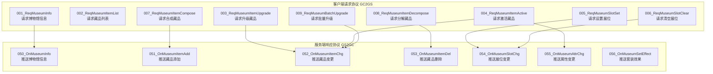

---

## 二、数据结构定义

### 2.1 MuseumInfo（博物馆信息）

| 字段名 | 类型 | 必填 | 说明 | 示例值 |
|--------|------|------|------|--------|
| museumId | int | 是 | 博物馆ID | 1 |
| maxSlot | int | 是 | 最大展位数 | 20 |
| unlockTime | long | 是 | 解锁时间戳 | 1680000000000 |
| collectCount | int | 是 | 已收集藏品数 | 45 |
| totalCount | int | 是 | 藏品总数 | 150 |
| activeCount | int | 是 | 已激活藏品数 | 30 |
| displayIncome | long | 否 | 当前展示收益/小时 | 150 |
| setName | string | 否 | 当前套装名称 | "远古战士套装" |

### 2.2 MuseumItemInfo（藏品信息）

| 字段名 | 类型 | 必填 | 说明 | 示例值 |
|--------|------|------|------|--------|
| itemId | int | 是 | 藏品配置ID | 10001 |
| level | int | 是 | 当前等级 | 15 |
| isActive | bool | 是 | 是否已激活 | true |
| activeStage | int | 否 | 激活阶段 | 2 |
| unlockTime | long | 是 | 解锁时间戳 | 1680000000000 |
| slotIndex | int | 否 | 所在展位索引 | 5 |
| fragment | int | 否 | 当前碎片数量 | 3 |
| attrs | map | 是 | 当前属性值列表 | {atk: 100} |
| setName | string | 否 | 所属套装名称 | "远古战士套装" |
| upgradeFailedCount | int | 否 | 连续升级失败次数 | 0 |

### 2.3 MuseumSlotInfo（展位信息）

| 字段名 | 类型 | 必填 | 说明 | 示例值 |
|--------|------|------|------|--------|
| slotIndex | int | 是 | 展位索引 | 5 |
| itemId | int | 是 | 展示的藏品ID | 10001 |
| isLocked | bool | 是 | 是否锁定 | false |
| displayTime | long | 否 | 展示开始时间 | 1680000000000 |
| displayIncome | long | 否 | 展示收益/小时 | 30 |
| slotType | int | 否 | 展位类型 | 1 |

### 2.4 AttrPair（属性键值对）

| 字段名 | 类型 | 必填 | 说明 | 示例值 |
|--------|------|------|------|--------|
| attrType | int | 是 | 属性类型枚举 | 1 |
| attrValue | long | 是 | 属性值 | 100 |

### 2.5 AttrChange（属性变更）

| 字段名 | 类型 | 必填 | 说明 | 示例值 |
|--------|------|------|------|--------|
| attrType | int | 是 | 属性类型 | 1 |
| oldValue | long | 是 | 旧值 | 100 |
| newValue | long | 是 | 新值 | 150 |
| source | string | 是 | 来源标识 | "museum_10001" |

### 2.6 SetEffectInfo（套装效果信息）

| 字段名 | 类型 | 必填 | 说明 | 示例值 |
|--------|------|------|------|--------|
| setId | int | 是 | 套装ID | 1 |
| setName | string | 是 | 套装名称 | "远古战士套装" |
| itemCount | int | 是 | 已激活件数 | 4 |
| effects | list | 是 | 当前激活效果列表 | [...] |

---

## 三、客户端请求协议 (GC2GS)

### 3.1 GC2GS_035_001_ReqMuseumInfo

**功能说明**: 请求博物馆信息

**触发场景**:
- 进入博物馆界面时
- 博物馆解锁时
- 刷新博物馆数据时

**请求参数**:

| 字段名 | 类型 | 必填 | 说明 | 示例值 |
|--------|------|------|------|--------|
| museumId | int | 是 | 博物馆ID（0表示所有） | 0 |

**返回协议**: GS2GC_035_050_OnMuseumInfo

**协议结构**:

```protobuf
message GC2GS_035_001_ReqMuseumInfo {
    int32 museum_id = 1;
}
```

**错误处理**:

| 错误码 | 触发条件 | 处理建议 |
|--------|----------|----------|
| 35020 | 博物馆未解锁 | 引导解锁条件 |
| 35021 | 博物馆不存在 | 检查配置 |

---

### 3.2 GC2GS_035_002_ReqMuseumItemList

**功能说明**: 请求藏品列表

**触发场景**:
- 查看藏品列表时
- 切换筛选条件时
- 翻页加载时

**请求参数**:

| 字段名 | 类型 | 必填 | 说明 | 示例值 |
|--------|------|------|------|--------|
| museumId | int | 否 | 博物馆ID（0表示所有） | 0 |
| itemType | int | 否 | 藏品类型（0表示所有） | 1 |
| rarity | int | 否 | 稀有度（0表示所有） | 2 |
| activeStatus | int | 否 | 激活状态（0全部,1未激活,2已激活） | 0 |
| pageIndex | int | 是 | 页码索引（从1开始） | 1 |
| pageSize | int | 是 | 每页数量 | 20 |

**返回协议**: GS2GC_035_052_OnMuseumItemChg（批量）

**协议结构**:

```protobuf
message GC2GS_035_002_ReqMuseumItemList {
    int32 museum_id = 1;
    int32 item_type = 2;
    int32 rarity = 3;
    int32 active_status = 4;
    int32 page_index = 5;
    int32 page_size = 6;
}
```

---

### 3.3 GC2GS_035_003_ReqMuseumItemUpgrade

**功能说明**: 请求升级藏品

**触发场景**:
- 点击升级按钮时
- 批量升级时

**请求参数**:

| 字段名 | 类型 | 必填 | 说明 | 示例值 |
|--------|------|------|------|--------|
| itemId | int | 是 | 藏品ID | 10001 |
| upgradeCount | int | 否 | 升级次数（默认1） | 5 |
| autoUse | bool | 否 | 是否自动使用材料 | true |
| useProtect | bool | 否 | 是否使用保护石 | false |

**返回协议**: GS2GC_035_052_OnMuseumItemChg

**协议结构**:

```protobuf
message GC2GS_035_003_ReqMuseumItemUpgrade {
    int32 item_id = 1;
    int32 upgrade_count = 2;
    bool auto_use = 3;
    bool use_protect = 4;
}
```

**业务流程**:

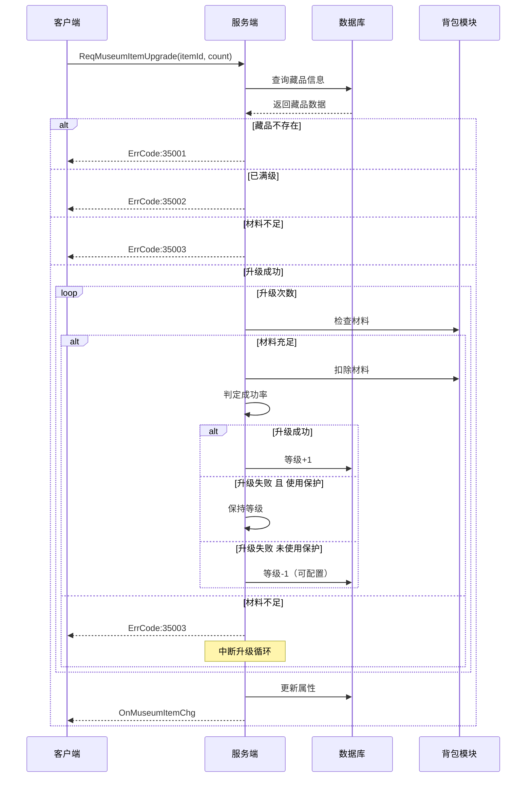

---

### 3.4 GC2GS_035_004_ReqMuseumItemActive

**功能说明**: 请求激活藏品

**触发场景**:
- 点击激活按钮时
- 满足激活条件时

**请求参数**:

| 字段名 | 类型 | 必填 | 说明 | 示例值 |
|--------|------|------|------|--------|
| itemId | int | 是 | 藏品ID | 10001 |
| activeStage | int | 否 | 激活阶段（默认下一阶段） | 2 |

**返回协议**: GS2GC_035_052_OnMuseumItemChg + GS2GC_035_055_OnMuseumAttrChg + GS2GC_035_056_OnMuseumSetEffect

**协议结构**:

```protobuf
message GC2GS_035_004_ReqMuseumItemActive {
    int32 item_id = 1;
    int32 active_stage = 2;
}
```

**业务流程**:

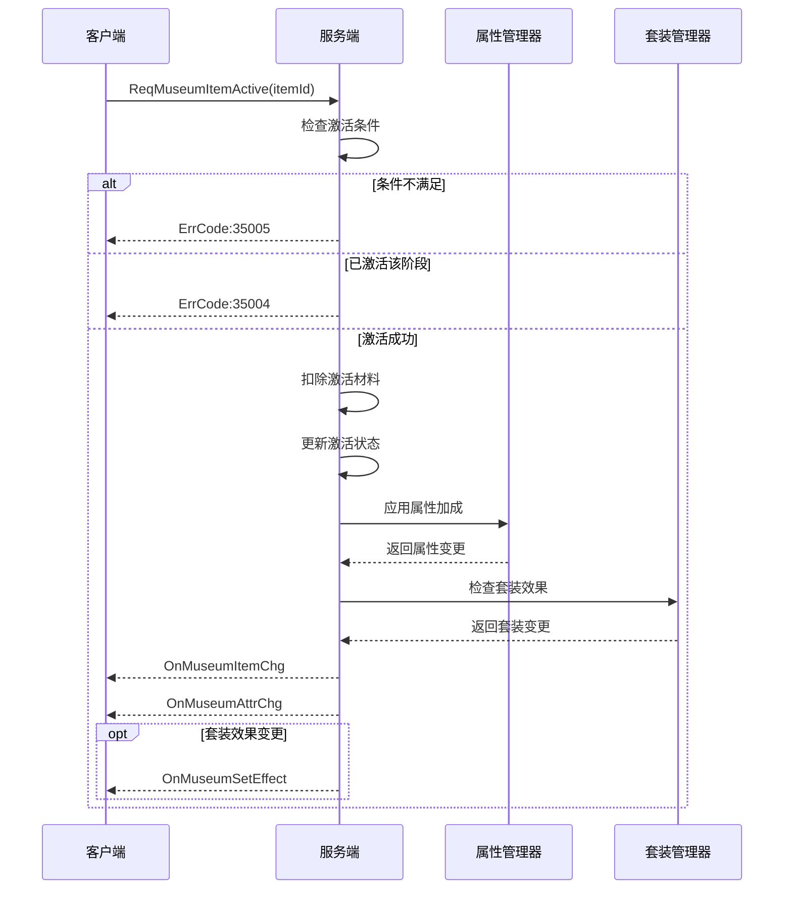

---

### 3.5 GC2GS_035_005_ReqMuseumSlotSet

**功能说明**: 请求设置展位

**触发场景**:
- 将藏品放入展位时
- 更换展位藏品时

**请求参数**:

| 字段名 | 类型 | 必填 | 说明 | 示例值 |
|--------|------|------|------|--------|
| slotIndex | int | 是 | 展位索引 | 5 |
| itemId | int | 是 | 藏品ID（0表示清空） | 10001 |

**返回协议**: GS2GC_035_054_OnMuseumSlotChg

**协议结构**:

```protobuf
message GC2GS_035_005_ReqMuseumSlotSet {
    int32 slot_index = 1;
    int32 item_id = 2;
}
```

**业务流程**:

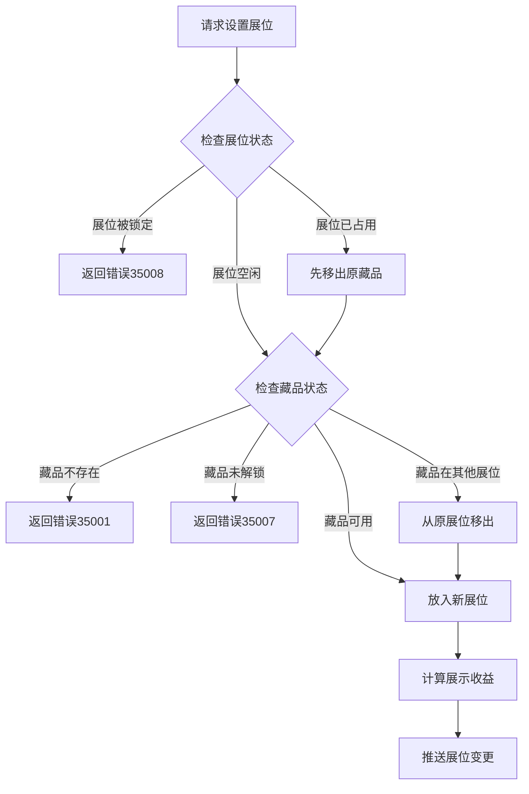

---

### 3.6 GC2GS_035_006_ReqMuseumSlotClear

**功能说明**: 请求清空展位

**触发场景**:
- 从展位移出藏品时
- 批量清空展位时

**请求参数**:

| 字段名 | 类型 | 必填 | 说明 | 示例值 |
|--------|------|------|------|--------|
| slotIndex | int | 是 | 展位索引 | 5 |

**返回协议**: GS2GC_035_054_OnMuseumSlotChg

**协议结构**:

```protobuf
message GC2GS_035_006_ReqMuseumSlotClear {
    int32 slot_index = 1;
}
```

---

### 3.7 GC2GS_035_007_ReqMuseumItemCompose

**功能说明**: 请求合成藏品

**触发场景**:
- 使用碎片合成藏品时
- 批量合成时

**请求参数**:

| 字段名 | 类型 | 必填 | 说明 | 示例值 |
|--------|------|------|------|--------|
| fragmentId | int | 是 | 碎片ID | 100011 |
| composeCount | int | 是 | 合成数量 | 1 |

**返回协议**: GS2GC_035_051_OnMuseumItemAdd

**协议结构**:

```protobuf
message GC2GS_035_007_ReqMuseumItemCompose {
    int32 fragment_id = 1;
    int32 compose_count = 2;
}
```

**业务流程**:

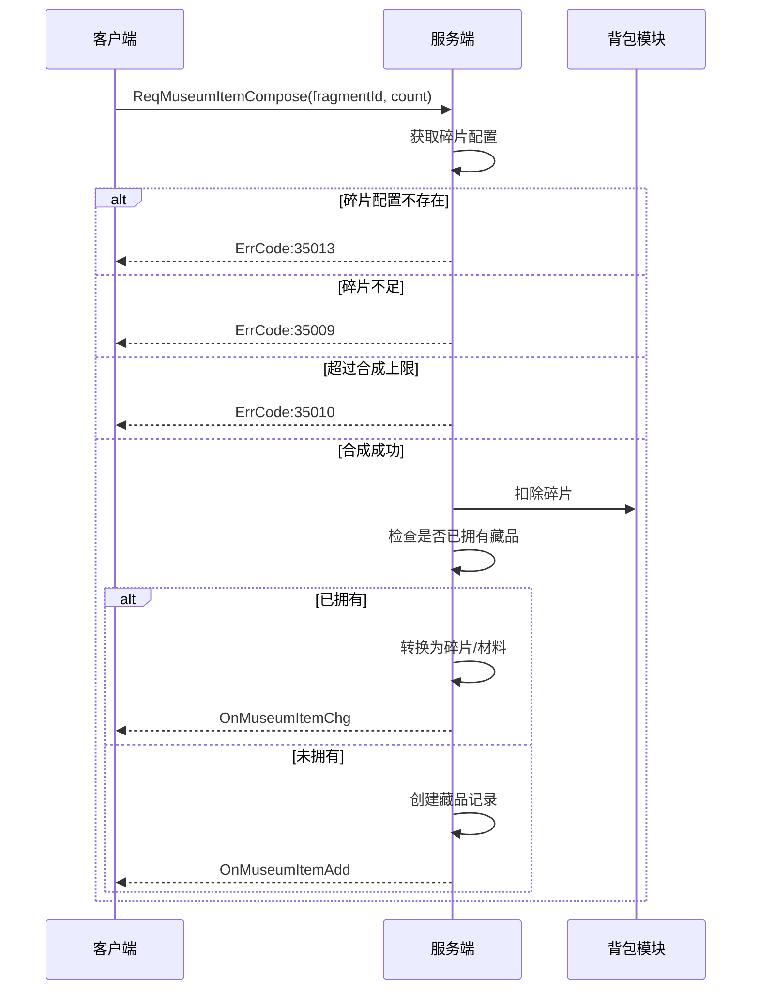

---

### 3.8 GC2GS_035_008_ReqMuseumItemDecompose

**功能说明**: 请求分解藏品

**触发场景**:
- 分解不需要的藏品时
- 批量分解时

**请求参数**:

| 字段名 | 类型 | 必填 | 说明 | 示例值 |
|--------|------|------|------|--------|
| itemId | int | 是 | 藏品ID | 10001 |
| decomposeCount | int | 否 | 分解数量（默认1） | 1 |

**返回协议**: GS2GC_035_053_OnMuseumItemDel + 背包更新

**协议结构**:

```protobuf
message GC2GS_035_008_ReqMuseumItemDecompose {
    int32 item_id = 1;
    int32 decompose_count = 2;
}
```

---

### 3.9 GC2GS_035_009_ReqMuseumBatchUpgrade

**功能说明**: 请求批量升级

**触发场景**:
- 一键升级时
- 批量操作时

**请求参数**:

| 字段名 | 类型 | 必填 | 说明 | 示例值 |
|--------|------|------|------|--------|
| itemIds | list | 是 | 藏品ID列表 | [10001, 10002] |
| targetLevel | int | 否 | 目标等级（0表示最大可升） | 0 |
| useProtect | bool | 否 | 是否使用保护石 | false |

**返回协议**: GS2GC_035_052_OnMuseumItemChg（批量）

**协议结构**:

```protobuf
message GC2GS_035_009_ReqMuseumBatchUpgrade {
    repeated int32 item_ids = 1;
    int32 target_level = 2;
    bool use_protect = 3;
}
```

---

## 四、服务端响应协议 (GS2GC)

### 4.1 GS2GC_035_050_OnMuseumInfo

**功能说明**: 推送博物馆信息

**触发场景**:
- 进入博物馆界面
- 博物馆信息变更时
- 博物馆解锁时

**响应字段**:

| 字段名 | 类型 | 说明 | 示例值 |
|--------|------|------|--------|
| museumInfo | MuseumInfo | 博物馆信息 | {...} |
| activeSetEffects | list | 激活的套装效果列表 | [...] |

**协议结构**:

```protobuf
message GS2GC_035_050_OnMuseumInfo {
    MuseumInfo museum_info = 1;
    repeated SetEffectInfo active_set_effects = 2;
}

message MuseumInfo {
    int32 museum_id = 1;
    int32 max_slot = 2;
    int64 unlock_time = 3;
    int32 collect_count = 4;
    int32 total_count = 5;
    int32 active_count = 6;
    int64 display_income = 7;
    string set_name = 8;
}
```

---

### 4.2 GS2GC_035_051_OnMuseumItemAdd

**功能说明**: 推送藏品添加

**触发场景**:
- 获得新藏品
- 合成藏品成功
- 活动发放藏品

**响应字段**:

| 字段名 | 类型 | 说明 | 示例值 |
|--------|------|------|--------|
| itemInfo | MuseumItemInfo | 新增藏品信息 | {...} |
| source | string | 获取来源 | "dungeon_101" |

**协议结构**:

```protobuf
message GS2GC_035_051_OnMuseumItemAdd {
    MuseumItemInfo item_info = 1;
    string source = 2;
}

message MuseumItemInfo {
    int32 item_id = 1;
    int32 level = 2;
    bool is_active = 3;
    int32 active_stage = 4;
    int64 unlock_time = 5;
    int32 slot_index = 6;
    int32 fragment = 7;
    repeated AttrPair attrs = 8;
    string set_name = 9;
    int32 upgrade_failed_count = 10;
}
```

---

### 4.3 GS2GC_035_052_OnMuseumItemChg

**功能说明**: 推送藏品变更

**触发场景**:
- 藏品升级成功
- 藏品升级失败
- 藏品激活成功
- 碎片数量变化

**响应字段**:

| 字段名 | 类型 | 说明 | 示例值 |
|--------|------|------|--------|
| itemId | int | 藏品ID | 10001 |
| level | int | 当前等级 | 15 |
| isActive | bool | 是否激活 | true |
| activeStage | int | 激活阶段 | 2 |
| fragment | int | 碎片数量 | 3 |
| attrs | list | 当前属性值 | [...] |
| upgradeResult | int | 升级结果（0成功,1失败,2保持） | 0 |
| setName | string | 所属套装 | "远古战士套装" |

**协议结构**:

```protobuf
message GS2GC_035_052_OnMuseumItemChg {
    int32 item_id = 1;
    int32 level = 2;
    bool is_active = 3;
    int32 active_stage = 4;
    int32 fragment = 5;
    repeated AttrPair attrs = 6;
    int32 upgrade_result = 7;
    string set_name = 8;
}
```

---

### 4.4 GS2GC_035_053_OnMuseumItemDel

**功能说明**: 推送藏品删除

**触发场景**:
- 使用藏品兑换其他物品
- 分解藏品
- 特殊活动消耗藏品

**响应字段**:

| 字段名 | 类型 | 说明 | 示例值 |
|--------|------|------|--------|
| itemId | int | 删除的藏品ID | 10001 |
| reason | string | 删除原因 | "decompose" |

**协议结构**:

```protobuf
message GS2GC_035_053_OnMuseumItemDel {
    int32 item_id = 1;
    string reason = 2;
}
```

---

### 4.5 GS2GC_035_054_OnMuseumSlotChg

**功能说明**: 推送展位变更

**触发场景**:
- 设置展位
- 清空展位
- 展位锁定状态变化

**响应字段**:

| 字段名 | 类型 | 说明 | 示例值 |
|--------|------|------|--------|
| slotInfo | MuseumSlotInfo | 展位信息 | {...} |

**协议结构**:

```protobuf
message GS2GC_035_054_OnMuseumSlotChg {
    MuseumSlotInfo slot_info = 1;
}

message MuseumSlotInfo {
    int32 slot_index = 1;
    int32 item_id = 2;
    bool is_locked = 3;
    int64 display_time = 4;
    int64 display_income = 5;
    int32 slot_type = 6;
}
```

---

### 4.6 GS2GC_035_055_OnMuseumAttrChg

**功能说明**: 推送属性变更

**触发场景**:
- 藏品激活
- 藏品升级（已激活状态）
- 藏品取消激活
- 套装效果变化

**响应字段**:

| 字段名 | 类型 | 说明 | 示例值 |
|--------|------|------|--------|
| changes | list | 属性变更列表 | [...] |

**协议结构**:

```protobuf
message GS2GC_035_055_OnMuseumAttrChg {
    repeated AttrChange changes = 1;
}

message AttrChange {
    int32 attr_type = 1;
    int64 old_value = 2;
    int64 new_value = 3;
    string source = 4;
}
```

---

### 4.7 GS2GC_035_056_OnMuseumSetEffect

**功能说明**: 推送套装效果

**触发场景**:
- 藏品激活触发套装效果
- 藏品取消激活套装效果失效
- 套装件数变化

**响应字段**:

| 字段名 | 类型 | 说明 | 示例值 |
|--------|------|------|--------|
| setEffect | SetEffectInfo | 套装效果信息 | {...} |
| isNew | bool | 是否新激活 | true |

**协议结构**:

```protobuf
message GS2GC_035_056_OnMuseumSetEffect {
    SetEffectInfo set_effect = 1;
    bool is_new = 2;
}

message SetEffectInfo {
    int32 set_id = 1;
    string set_name = 2;
    int32 item_count = 3;
    repeated AttrPair effects = 4;
}
```

---

## 五、错误码定义

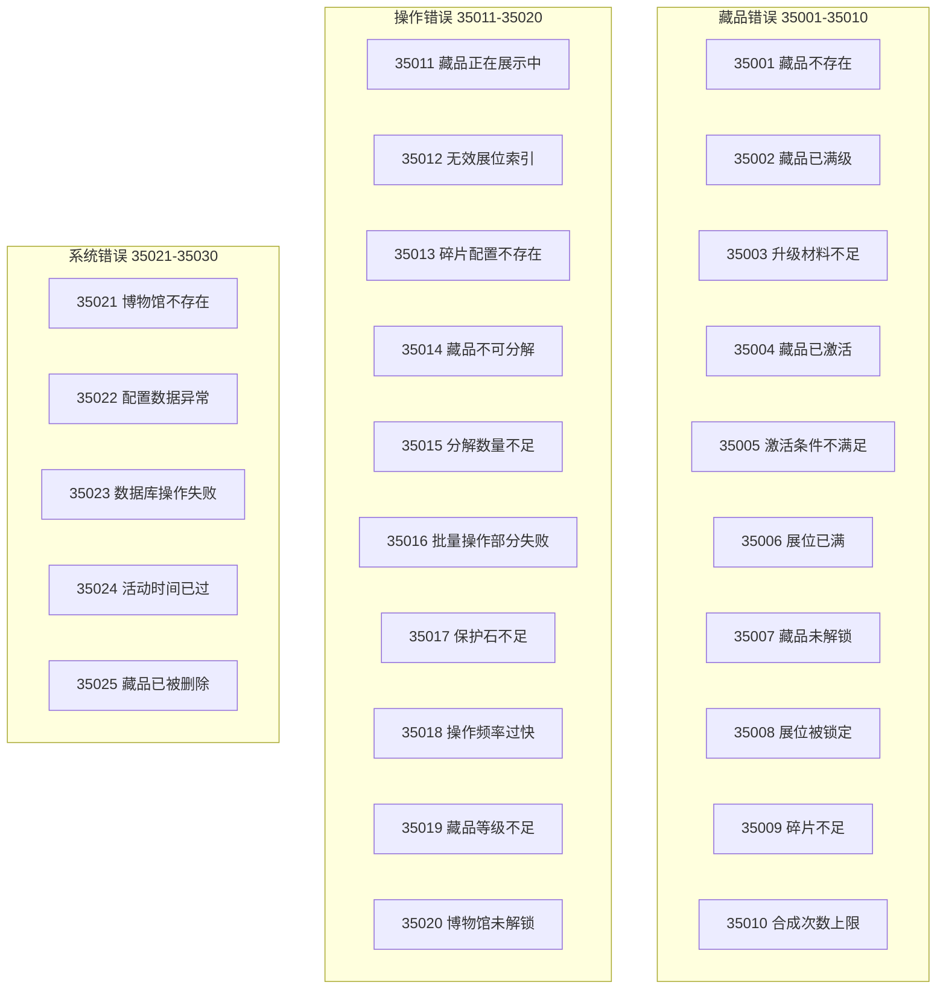

### 详细错误码表

| 错误码 | 错误名 | 错误信息 | 处理建议 |
|--------|--------|----------|----------|
| 35001 | ITEM_NOT_FOUND | 藏品不存在 | 检查藏品ID，刷新数据 |
| 35002 | ITEM_MAX_LEVEL | 藏品已满级 | 提示已达最高等级 |
| 35003 | MATERIAL_NOT_ENOUGH | 升级材料不足 | 引导获取材料 |
| 35004 | ITEM_ALREADY_ACTIVE | 藏品已激活 | 无需重复操作 |
| 35005 | ACTIVE_CONDITION_NOT_MET | 激活条件不满足 | 显示缺失条件 |
| 35006 | SLOT_FULL | 展位已满 | 引导扩展展位 |
| 35007 | ITEM_NOT_UNLOCKED | 藏品未解锁 | 显示解锁条件 |
| 35008 | SLOT_LOCKED | 展位被锁定 | 显示解锁条件 |
| 35009 | FRAGMENT_NOT_ENOUGH | 碎片不足 | 引导获取碎片 |
| 35010 | COMPOSE_LIMIT_REACHED | 合成次数上限 | 提示已达上限 |
| 35011 | ITEM_IN_SLOT | 藏品正在展示中 | 先移出展位 |
| 35012 | INVALID_SLOT_INDEX | 无效展位索引 | 检查展位范围 |
| 35013 | FRAGMENT_CONFIG_NOT_FOUND | 碎片配置不存在 | 检查配置 |
| 35014 | ITEM_CANNOT_DECOMPOSE | 藏品不可分解 | 提示该藏品不可分解 |
| 35015 | DECOMPOSE_COUNT_NOT_ENOUGH | 分解数量不足 | 检查拥有数量 |
| 35016 | BATCH_OPERATION_PARTIAL_FAIL | 批量操作部分失败 | 显示失败列表 |
| 35017 | PROTECT_STONE_NOT_ENOUGH | 保护石不足 | 引导获取保护石 |
| 35018 | OPERATION_TOO_FREQUENT | 操作频率过快 | 提示稍后重试 |
| 35019 | ITEM_LEVEL_NOT_ENOUGH | 藏品等级不足 | 引导升级 |
| 35020 | MUSEUM_NOT_UNLOCKED | 博物馆未解锁 | 显示解锁条件 |
| 35021 | MUSEUM_NOT_FOUND | 博物馆不存在 | 检查配置 |
| 35022 | CONFIG_DATA_ERROR | 配置数据异常 | 联系客服 |
| 35023 | DB_OPERATION_FAILED | 数据库操作失败 | 稍后重试 |
| 35024 | ACTIVITY_TIME_EXPIRED | 活动时间已过 | 提示活动已结束 |
| 35025 | ITEM_ALREADY_DELETED | 藏品已被删除 | 刷新数据 |

---

## 六、协议时序图

### 6.1 藏品获取时序

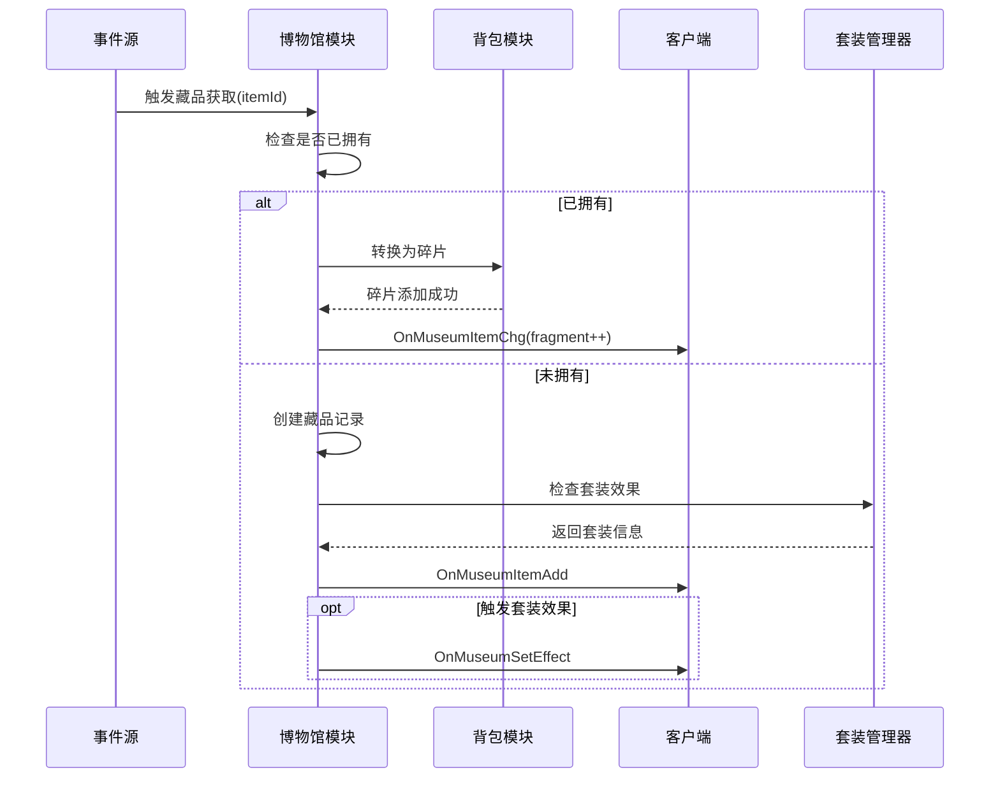

### 6.2 展示管理时序

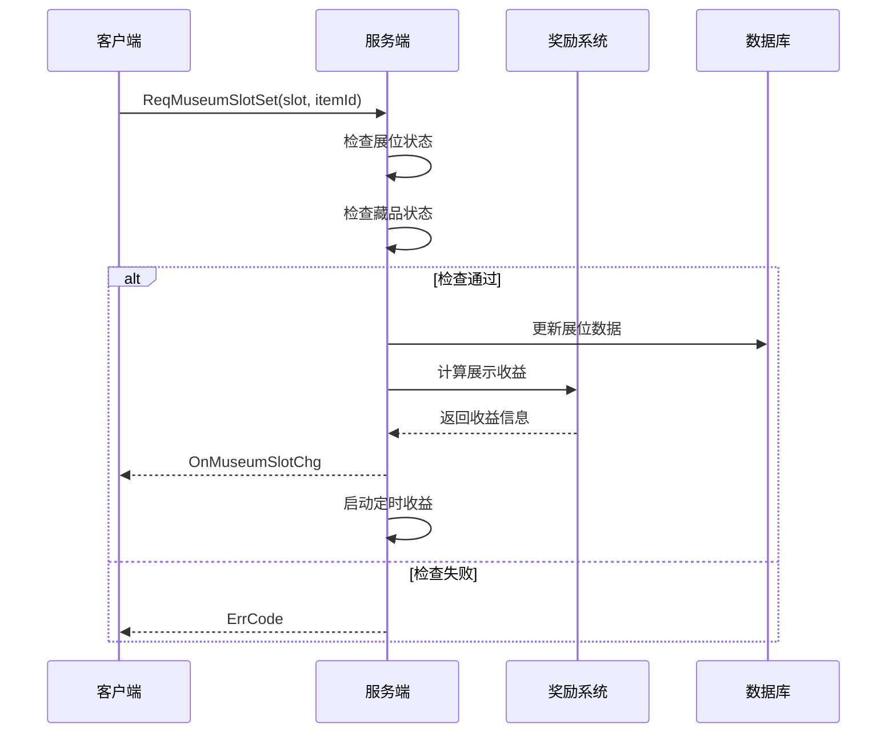

### 6.3 完整激活流程

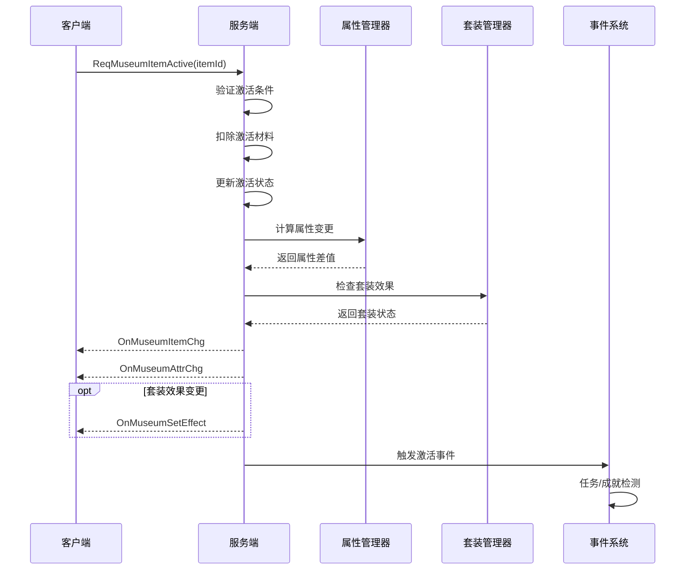

---

## 七、协议版本兼容

| 版本 | 更新内容 | 兼容性 | 发布时间 |
|------|----------|--------|----------|
| 1.0 | 初始版本 | - | 2025-01-01 |
| 1.1 | 新增批量升级协议 | 向下兼容 | 2025-03-01 |
| 1.2 | 新增碎片合成协议 | 向下兼容 | 2025-06-01 |
| 2.0 | 新增套装效果、分解协议 | 需客户端升级 | 2026-01-01 |

---

## 八、协议调试指南

### 8.1 常见问题排查

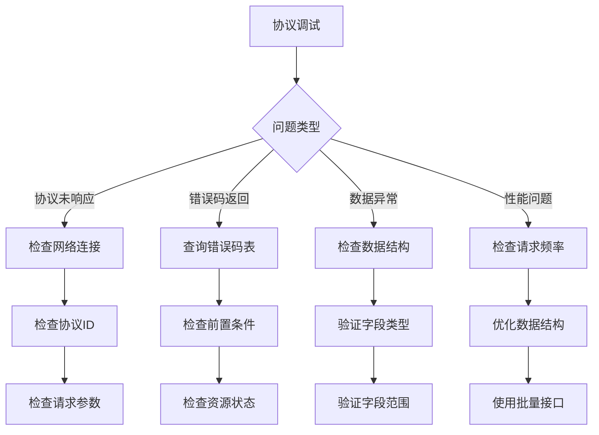

### 8.2 调试命令示例

```bash
# 模拟请求博物馆信息
./client_test --proto=035_001 --params='{"museum_id":1}'

# 模拟升级藏品
./client_test --proto=035_003 --params='{"item_id":10001,"upgrade_count":1}'

# 模拟激活藏品
./client_test --proto=035_004 --params='{"item_id":10001}'

# 模拟设置展位
./client_test --proto=035_005 --params='{"slot_index":1,"item_id":10001}'
```

---

---

## 九、协议性能优化

### 9.1 批量协议优化

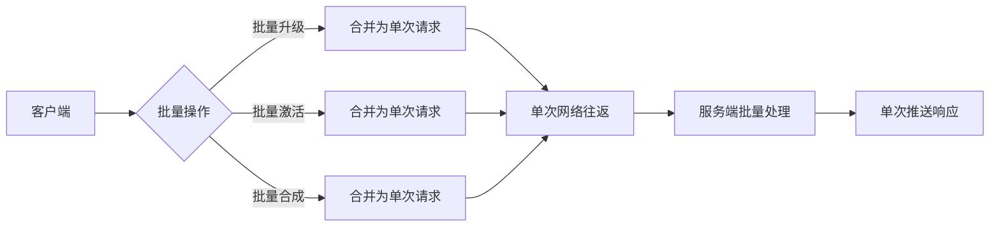

### 9.2 增量同步机制

| 同步类型 | 触发条件 | 数据量 | 说明 |
|----------|----------|--------|------|
| 全量同步 | 首次登录 | 全部数据 | 获取所有藏品信息 |
| 增量同步 | 数据变更 | 变更数据 | 仅推送变更的藏品 |
| 状态同步 | 定时/事件 | 状态数据 | 同步激活状态、展位状态 |

### 9.3 协议压缩策略

```protobuf
// 使用packed编码压缩重复字段
repeated int32 item_ids = 1 [packed = true];
repeated AttrPair attrs = 2 [packed = true];

// 使用varint编码压缩整数
int64 display_income = 3; // 自动使用varint
```

---

## 十、协议安全机制

### 10.1 请求频率限制

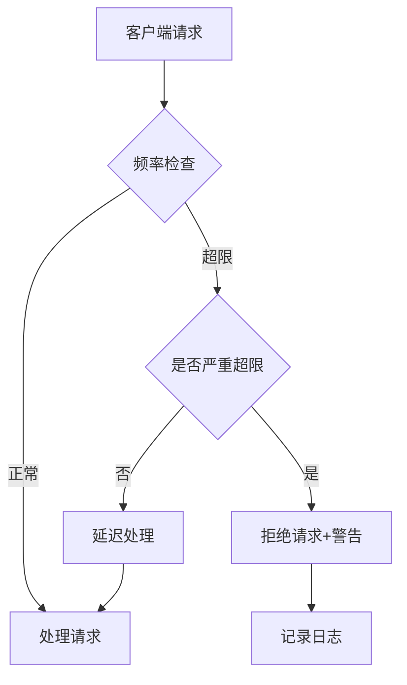

| 操作类型 | 每秒限制 | 每分钟限制 | 说明 |
|----------|----------|------------|------|
| 升级请求 | 5次 | 50次 | 防止快速刷级 |
| 激活请求 | 3次 | 30次 | 防止频繁操作 |
| 展位操作 | 10次 | 100次 | 较高频操作 |
| 合成请求 | 5次 | 50次 | 防止资源刷取 |

### 10.2 参数校验规则

```java
/**
 * 协议参数校验
 */
public class MuseumProtocolValidator {

    public static void validateUpgradeRequest(int itemId, int upgradeCount) {
        if (itemId <= 0) {
            throw new ProtocolException(ErrorCode.PARAM_INVALID, "itemId无效");
        }
        if (upgradeCount <= 0 || upgradeCount > 100) {
            throw new ProtocolException(ErrorCode.PARAM_INVALID, "升级次数无效");
        }
    }

    public static void validateSlotRequest(int slotIndex, int itemId) {
        if (slotIndex < 0 || slotIndex >= MAX_SLOT_COUNT) {
            throw new ProtocolException(ErrorCode.PARAM_INVALID, "展位索引无效");
        }
        if (itemId < 0) {
            throw new ProtocolException(ErrorCode.PARAM_INVALID, "藏品ID无效");
        }
    }
}
```

---

## 十一、协议测试用例

### 11.1 升级协议测试用例

| 用例ID | 测试场景 | 输入数据 | 预期结果 |
|--------|----------|----------|----------|
| TC001 | 正常升级 | itemId=10001, count=1 | 升级成功，等级+1 |
| TC002 | 满级升级 | itemId=满级藏品 | 返回错误35002 |
| TC003 | 材料不足 | itemId=10001, 无材料 | 返回错误35003 |
| TC004 | 藏品不存在 | itemId=99999 | 返回错误35001 |
| TC005 | 批量升级 | itemId=10001, count=10 | 成功升级多次 |

### 11.2 激活协议测试用例

| 用例ID | 测试场景 | 输入数据 | 预期结果 |
|--------|----------|----------|----------|
| TC101 | 正常激活 | itemId=10001 | 激活成功，属性生效 |
| TC102 | 已激活 | itemId=已激活藏品 | 返回错误35004 |
| TC103 | 条件不满足 | itemId=条件不足藏品 | 返回错误35005 |
| TC104 | 二次激活 | itemId=10001, stage=2 | 成功进行二阶激活 |

---

*文档生成时间: 2026-04-12*
*文档版本: v2.1*
