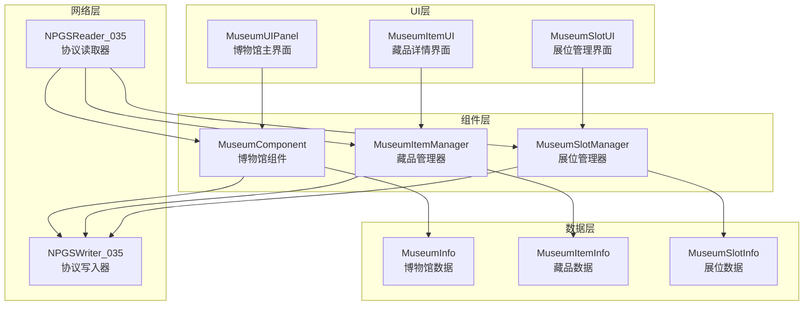
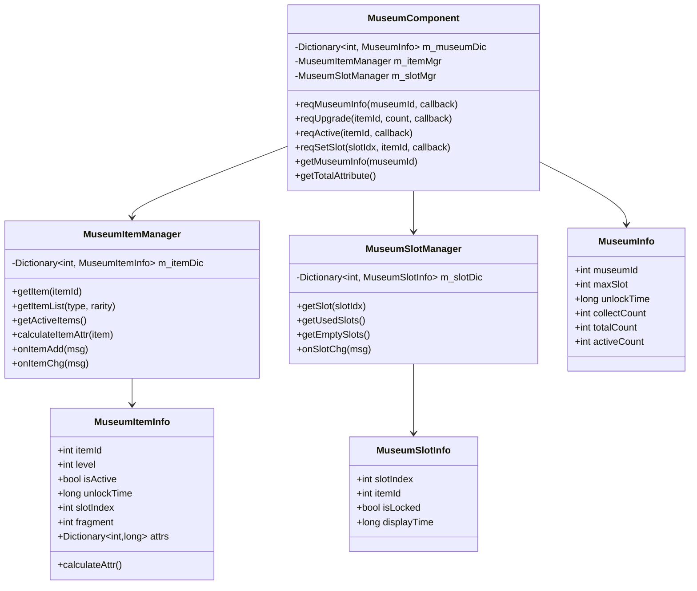

# 博物馆系统 - 客户端开发文档

**模块名称**: Museum（博物馆系统）
**模块编号**: p035
**文档版本**: 2.0
**更新日期**: 2026-04-11

---

## 一、架构概览



---

## 二、文件结构

```
game_client/Assets/Scripts/
├── GameComponent/
│   └── Museum/
│       ├── MuseumComponent.cs          # 博物馆主组件
│       ├── MuseumItemManager.cs        # 藏品管理器
│       ├── MuseumSlotManager.cs        # 展位管理器
│       ├── MuseumInfo.cs               # 博物馆信息类
│       ├── MuseumItemInfo.cs           # 藏品信息类
│       └── MuseumSlotInfo.cs           # 展位信息类
│
├── ResScripts/NPSO/GSO/Museum/
│   ├── MuseumConfig.cs                 # 博物馆配置
│   ├── MuseumItemConfig.cs             # 藏品配置
│   ├── MuseumItemUpgradeConfig.cs      # 升级配置
│   └── MuseumItemActiveConfig.cs       # 激活配置
│
├── UI/
│   └── Museum/
│       ├── MuseumUIPanel.cs            # 博物馆主界面
│       ├── MuseumItemDetailUI.cs       # 藏品详情界面
│       ├── MuseumItemCardUI.cs         # 藏品卡片控件
│       ├── MuseumSlotUI.cs             # 展位控件
│       └── MuseumFilterUI.cs           # 筛选控件
│
└── NPGS/
    ├── NPGSWriter_035_MuseumOp.cs      # 协议写入器
    └── NPGSReader_035_MuseumOp.cs      # 协议读取器
```

---

## 三、核心类设计

### 3.1 类图



---

## 四、核心代码实现

### 4.1 MuseumComponent.cs

```csharp
using System;
using System.Collections.Generic;
using UnityEngine;

namespace GameComponent.Museum
{
    /// <summary>
    /// 博物馆组件 - 管理玩家博物馆数据
    /// </summary>
    public class MuseumComponent : _ANPBasicPlayerComponent
    {
        #region 单例
        
        private static MuseumComponent _instance;
        public static MuseumComponent Instance => _instance;
        
        #endregion
        
        #region 数据成员
        
        private Dictionary<int, MuseumInfo> _museumDic = new Dictionary<int, MuseumInfo>();
        private MuseumItemManager _itemMgr;
        private MuseumSlotManager _slotMgr;
        
        #endregion
        
        #region 初始化
        
        public override void init()
        {
            base.init();
            _instance = this;
            
            _itemMgr = new MuseumItemManager();
            _slotMgr = new MuseumSlotManager();
            
            // 注册协议监听
            RegisterProtocolListeners();
        }
        
        private void RegisterProtocolListeners()
        {
            NPGSClientListener.addListener<GS2GC_035_050_OnMuseumInfo>(OnMuseumInfo);
            NPGSClientListener.addListener<GS2GC_035_051_OnMuseumItemAdd>(OnMuseumItemAdd);
            NPGSClientListener.addListener<GS2GC_035_052_OnMuseumItemChg>(OnMuseumItemChg);
            NPGSClientListener.addListener<GS2GC_035_053_OnMuseumItemDel>(OnMuseumItemDel);
            NPGSClientListener.addListener<GS2GC_035_054_OnMuseumSlotChg>(OnMuseumSlotChg);
            NPGSClientListener.addListener<GS2GC_035_055_OnMuseumAttrChg>(OnMuseumAttrChg);
        }
        
        #endregion
        
        #region 公开方法
        
        /// <summary>
        /// 请求博物馆信息
        /// </summary>
        public void ReqMuseumInfo(int museumId, Action<MuseumInfo> callback)
        {
            NPGSClientListener.sendRequest(
                NPGSWriter_035_MuseumOp.make_001_ReqMuseumInfo(museumId),
                new CommonErrCodeRequestCallbackProtocolDealer<GS2GC_035_050_OnMuseumInfo>((msg) =>
                {
                    var info = ParseMuseumInfo(msg.museum_info);
                    _museumDic[info.museumId] = info;
                    callback?.Invoke(info);
                }));
        }
        
        /// <summary>
        /// 请求升级藏品
        /// </summary>
        public void ReqUpgrade(int itemId, int upgradeCount = 1, Action callback = null)
        {
            NPGSClientListener.sendRequest(
                NPGSWriter_035_MuseumOp.make_003_ReqMuseumItemUpgrade(itemId, upgradeCount, false),
                new CommonErrCodeRequestCallbackProtocolDealer<GS2GC_035_052_OnMuseumItemChg>((msg) =>
                {
                    _itemMgr.UpdateItemFromMsg(msg);
                    callback?.Invoke();
                }));
        }
        
        /// <summary>
        /// 请求激活藏品
        /// </summary>
        public void ReqActive(int itemId, Action callback = null)
        {
            NPGSClientListener.sendRequest(
                NPGSWriter_035_MuseumOp.make_004_ReqMuseumItemActive(itemId),
                new CommonErrCodeRequestCallbackProtocolDealer<GS2GC_035_052_OnMuseumItemChg>((msg) =>
                {
                    _itemMgr.UpdateItemFromMsg(msg);
                    callback?.Invoke();
                }));
        }
        
        /// <summary>
        /// 请求设置展位
        /// </summary>
        public void ReqSetSlot(int slotIndex, int itemId, Action callback = null)
        {
            NPGSClientListener.sendRequest(
                NPGSWriter_035_MuseumOp.make_005_ReqMuseumSlotSet(slotIndex, itemId),
                new CommonErrCodeRequestCallbackProtocolDealer<GS2GC_035_054_OnMuseumSlotChg>((msg) =>
                {
                    _slotMgr.UpdateSlotFromMsg(msg.slot_info);
                    callback?.Invoke();
                }));
        }
        
        /// <summary>
        /// 请求合成藏品
        /// </summary>
        public void ReqCompose(int fragmentId, int count, Action callback = null)
        {
            NPGSClientListener.sendRequest(
                NPGSWriter_035_MuseumOp.make_007_ReqMuseumItemCompose(fragmentId, count),
                new CommonErrCodeRequestCallbackProtocolDealer<GS2GC_035_051_OnMuseumItemAdd>((msg) =>
                {
                    _itemMgr.AddItemFromMsg(msg);
                    callback?.Invoke();
                }));
        }
        
        /// <summary>
        /// 获取博物馆信息
        /// </summary>
        public MuseumInfo GetMuseumInfo(int museumId)
        {
            return _museumDic.TryGetValue(museumId, out var info) ? info : null;
        }
        
        /// <summary>
        /// 获取藏品信息
        /// </summary>
        public MuseumItemInfo GetItem(int itemId)
        {
            return _itemMgr?.GetItem(itemId);
        }
        
        /// <summary>
        /// 获取藏品列表
        /// </summary>
        public List<MuseumItemInfo> GetItemList(int itemType = 0, int rarity = 0)
        {
            return _itemMgr?.GetItemList(itemType, rarity);
        }
        
        /// <summary>
        /// 获取总属性加成
        /// </summary>
        public Dictionary<int, long> GetTotalAttribute()
        {
            var result = new Dictionary<int, long>();
            var activeItems = _itemMgr?.GetActiveItems();
            
            if (activeItems != null)
            {
                foreach (var item in activeItems)
                {
                    var attrs = item.CalculateAttr();
                    foreach (var attr in attrs)
                    {
                        if (!result.ContainsKey(attr.Key))
                            result[attr.Key] = 0;
                        result[attr.Key] += attr.Value;
                    }
                }
            }
            
            return result;
        }
        
        #endregion
        
        #region 协议回调
        
        private void OnMuseumInfo(GS2GC_035_050_OnMuseumInfo msg)
        {
            var info = ParseMuseumInfo(msg.museum_info);
            _museumDic[info.museumId] = info;
            
            // 触发事件
            EventManager.Dispatch(EventID.MuseumInfoUpdate, info.museumId);
        }
        
        private void OnMuseumItemAdd(GS2GC_035_051_OnMuseumItemAdd msg)
        {
            _itemMgr.AddItemFromMsg(msg);
            
            // 触发事件
            EventManager.Dispatch(EventID.MuseumItemAdd, msg.item_info.item_id);
        }
        
        private void OnMuseumItemChg(GS2GC_035_052_OnMuseumItemChg msg)
        {
            _itemMgr.UpdateItemFromMsg(msg);
            
            // 触发事件
            EventManager.Dispatch(EventID.MuseumItemChg, msg.item_id);
        }
        
        private void OnMuseumItemDel(GS2GC_035_053_OnMuseumItemDel msg)
        {
            _itemMgr.RemoveItem(msg.item_id);
            
            // 触发事件
            EventManager.Dispatch(EventID.MuseumItemDel, msg.item_id);
        }
        
        private void OnMuseumSlotChg(GS2GC_035_054_OnMuseumSlotChg msg)
        {
            _slotMgr.UpdateSlotFromMsg(msg.slot_info);
            
            // 触发事件
            EventManager.Dispatch(EventID.MuseumSlotChg, msg.slot_info.slot_index);
        }
        
        private void OnMuseumAttrChg(GS2GC_035_055_OnMuseumAttrChg msg)
        {
            // 触发属性变更事件
            EventManager.Dispatch(EventID.MuseumAttrChg, msg.changes);
        }
        
        #endregion
        
        #region 辅助方法
        
        private MuseumInfo ParseMuseumInfo(MuseumInfoProto proto)
        {
            return new MuseumInfo
            {
                museumId = proto.museum_id,
                maxSlot = proto.max_slot,
                unlockTime = proto.unlock_time,
                collectCount = proto.collect_count,
                totalCount = proto.total_count,
                activeCount = proto.active_count
            };
        }
        
        #endregion
    }
}
```

### 4.2 MuseumItemInfo.cs

```csharp
using System.Collections.Generic;

namespace GameComponent.Museum
{
    /// <summary>
    /// 藏品信息类
    /// </summary>
    public class MuseumItemInfo
    {
        public int itemId;
        public int level;
        public bool isActive;
        public long unlockTime;
        public int slotIndex = -1;
        public int fragment;
        public Dictionary<int, long> attrs = new Dictionary<int, long>();
        
        /// <summary>
        /// 计算藏品当前属性
        /// </summary>
        public Dictionary<int, long> CalculateAttr()
        {
            var result = new Dictionary<int, long>();
            
            // 获取配置
            var config = MuseumItemConfig.Get(itemId);
            if (config == null) return result;
            
            // 计算基础属性 + 等级成长
            foreach (var baseAttr in config.baseAttr)
            {
                long value = baseAttr.Value;
                if (config.growthRate.TryGetValue(baseAttr.Key, out var growth))
                {
                    value += (level - 1) * growth;
                }
                result[baseAttr.Key] = value;
            }
            
            // 如果已激活，加上激活效果
            if (isActive && config.activateEffect != null)
            {
                foreach (var effect in config.activateEffect)
                {
                    if (!result.ContainsKey(effect.Key))
                        result[effect.Key] = 0;
                    result[effect.Key] += effect.Value;
                }
            }
            
            return result;
        }
        
        /// <summary>
        /// 是否可升级
        /// </summary>
        public bool CanUpgrade()
        {
            var config = MuseumItemConfig.Get(itemId);
            return config != null && level < config.maxLevel;
        }
        
        /// <summary>
        /// 是否可激活
        /// </summary>
        public bool CanActivate()
        {
            if (isActive) return false;
            
            var config = MuseumItemConfig.Get(itemId);
            if (config == null) return false;
            
            // 检查激活条件
            if (config.activateCondition.TryGetValue("level", out var reqLevel))
            {
                if (level < reqLevel) return false;
            }
            
            return true;
        }
        
        /// <summary>
        /// 获取升级消耗
        /// </summary>
        public Dictionary<int, int> GetUpgradeCost()
        {
            var config = MuseumItemUpgradeConfig.Get(itemId, level + 1);
            return config?.costList ?? new Dictionary<int, int>();
        }
        
        /// <summary>
        /// 获取激活消耗
        /// </summary>
        public Dictionary<int, int> GetActivateCost()
        {
            var config = MuseumItemConfig.Get(itemId);
            return config?.activateCost ?? new Dictionary<int, int>();
        }
    }
}
```

### 4.3 MuseumItemManager.cs

```csharp
using System.Collections.Generic;
using System.Linq;

namespace GameComponent.Museum
{
    /// <summary>
    /// 藏品管理器
    /// </summary>
    public class MuseumItemManager
    {
        private Dictionary<int, MuseumItemInfo> _itemDic = new Dictionary<int, MuseumItemInfo>();
        
        /// <summary>
        /// 获取藏品
        /// </summary>
        public MuseumItemInfo GetItem(int itemId)
        {
            return _itemDic.TryGetValue(itemId, out var item) ? item : null;
        }
        
        /// <summary>
        /// 获取藏品列表
        /// </summary>
        public List<MuseumItemInfo> GetItemList(int itemType = 0, int rarity = 0)
        {
            var result = _itemDic.Values.ToList();
            
            // 按类型筛选
            if (itemType > 0)
            {
                result = result.Where(item =>
                {
                    var config = MuseumItemConfig.Get(item.itemId);
                    return config != null && config.itemType == itemType;
                }).ToList();
            }
            
            // 按稀有度筛选
            if (rarity > 0)
            {
                result = result.Where(item =>
                {
                    var config = MuseumItemConfig.Get(item.itemId);
                    return config != null && config.rarity == rarity;
                }).ToList();
            }
            
            return result;
        }
        
        /// <summary>
        /// 获取已激活的藏品列表
        /// </summary>
        public List<MuseumItemInfo> GetActiveItems()
        {
            return _itemDic.Values.Where(item => item.isActive).ToList();
        }
        
        /// <summary>
        /// 从协议消息添加藏品
        /// </summary>
        public void AddItemFromMsg(GS2GC_035_051_OnMuseumItemAdd msg)
        {
            var item = ParseItemInfo(msg.item_info);
            _itemDic[item.itemId] = item;
        }
        
        /// <summary>
        /// 从协议消息更新藏品
        /// </summary>
        public void UpdateItemFromMsg(GS2GC_035_052_OnMuseumItemChg msg)
        {
            if (_itemDic.TryGetValue(msg.item_id, out var item))
            {
                item.level = msg.level;
                item.isActive = msg.is_active;
                item.fragment = msg.fragment;
                
                item.attrs.Clear();
                foreach (var attr in msg.attrs)
                {
                    item.attrs[attr.attr_type] = attr.attr_value;
                }
            }
            else
            {
                // 创建新藏品
                var newItem = new MuseumItemInfo
                {
                    itemId = msg.item_id,
                    level = msg.level,
                    isActive = msg.is_active,
                    fragment = msg.fragment
                };
                _itemDic[newItem.itemId] = newItem;
            }
        }
        
        /// <summary>
        /// 移除藏品
        /// </summary>
        public void RemoveItem(int itemId)
        {
            _itemDic.Remove(itemId);
        }
        
        private MuseumItemInfo ParseItemInfo(MuseumItemInfoProto proto)
        {
            var item = new MuseumItemInfo
            {
                itemId = proto.item_id,
                level = proto.level,
                isActive = proto.is_active,
                unlockTime = proto.unlock_time,
                slotIndex = proto.slot_index,
                fragment = proto.fragment
            };
            
            foreach (var attr in proto.attrs)
            {
                item.attrs[attr.attr_type] = attr.attr_value;
            }
            
            return item;
        }
    }
}
```

---

## 五、UI实现示例

### 5.1 MuseumUIPanel.cs

```csharp
using UnityEngine;
using UnityEngine.UI;
using System.Collections.Generic;

namespace UI.Museum
{
    public class MuseumUIPanel : UIPanel
    {
        [Header("顶部信息")]
        [SerializeField] private Text _collectCountText;
        [SerializeField] private Text _activeCountText;
        [SerializeField] private Text _totalAttrText;
        
        [Header("藏品列表")]
        [SerializeField] private Transform _itemListContainer;
        [SerializeField] private GameObject _itemCardPrefab;
        [SerializeField] private ScrollRect _scrollRect;
        
        [Header("筛选")]
        [SerializeField] private Dropdown _typeDropdown;
        [SerializeField] private Dropdown _rarityDropdown;
        
        [Header("详情")]
        [SerializeField] private MuseumItemDetailUI _detailUI;
        
        private List<MuseumItemCardUI> _cardList = new List<MuseumItemCardUI>();
        private int _currentType = 0;
        private int _currentRarity = 0;
        
        protected override void OnOpen()
        {
            base.OnOpen();
            
            // 初始化筛选器
            InitFilters();
            
            // 请求博物馆信息
            MuseumComponent.Instance.ReqMuseumInfo(0, (info) =>
            {
                UpdateTopInfo(info);
                RefreshItemList();
            });
        }
        
        private void InitFilters()
        {
            _typeDropdown.ClearOptions();
            _typeDropdown.AddOptions(new List<string> { "全部", "武器", "防具", "饰品", "艺术品" });
            _typeDropdown.onValueChanged.AddListener(OnTypeFilterChanged);
            
            _rarityDropdown.ClearOptions();
            _rarityDropdown.AddOptions(new List<string> { "全部", "普通", "稀有", "史诗", "传说" });
            _rarityDropdown.onValueChanged.AddListener(OnRarityFilterChanged);
        }
        
        private void UpdateTopInfo(MuseumInfo info)
        {
            _collectCountText.text = $"已收集: {info.collectCount}/{info.totalCount}";
            _activeCountText.text = $"已激活: {info.activeCount}";
            
            var totalAttr = MuseumComponent.Instance.GetTotalAttribute();
            var attrText = "";
            foreach (var attr in totalAttr)
            {
                attrText += $"{GetAttrName(attr.Key)}: +{attr.Value}\n";
            }
            _totalAttrText.text = attrText;
        }
        
        private void RefreshItemList()
        {
            // 清空现有卡片
            foreach (var card in _cardList)
            {
                Destroy(card.gameObject);
            }
            _cardList.Clear();
            
            // 获取筛选后的列表
            var itemList = MuseumComponent.Instance.GetItemList(_currentType, _currentRarity);
            
            // 创建卡片
            foreach (var item in itemList)
            {
                var cardGo = Instantiate(_itemCardPrefab, _itemListContainer);
                var card = cardGo.GetComponent<MuseumItemCardUI>();
                card.SetData(item);
                card.OnClick = OnItemClick;
                _cardList.Add(card);
            }
        }
        
        private void OnItemClick(MuseumItemInfo item)
        {
            _detailUI.Show(item);
        }
        
        private void OnTypeFilterChanged(int index)
        {
            _currentType = index;
            RefreshItemList();
        }
        
        private void OnRarityFilterChanged(int index)
        {
            _currentRarity = index;
            RefreshItemList();
        }
        
        private string GetAttrName(int attrType)
        {
            switch (attrType)
            {
                case 1: return "攻击力";
                case 2: return "防御力";
                case 3: return "生命值";
                case 4: return "暴击率";
                case 5: return "暴击伤害";
                default: return $"属性{attrType}";
            }
        }
    }
}
```

### 5.2 MuseumItemDetailUI.cs

```csharp
using UnityEngine;
using UnityEngine.UI;

namespace UI.Museum
{
    public class MuseumItemDetailUI : MonoBehaviour
    {
        [Header("基础信息")]
        [SerializeField] private Image _icon;
        [SerializeField] private Text _nameText;
        [SerializeField] private Text _rarityText;
        [SerializeField] private Text _levelText;
        
        [Header("属性")]
        [SerializeField] private Text _attrText;
        
        [Header("激活")]
        [SerializeField] private GameObject _activeGroup;
        [SerializeField] private Text _activeCondText;
        [SerializeField] private Button _activeBtn;
        
        [Header("升级")]
        [SerializeField] private Text _costText;
        [SerializeField] private Button _upgradeBtn;
        [SerializeField] private Button _maxUpgradeBtn;
        
        private MuseumItemInfo _currentItem;
        
        public void Show(MuseumItemInfo item)
        {
            _currentItem = item;
            gameObject.SetActive(true);
            
            UpdateUI();
        }
        
        private void UpdateUI()
        {
            var config = MuseumItemConfig.Get(_currentItem.itemId);
            if (config == null) return;
            
            // 基础信息
            _nameText.text = config.itemName;
            _rarityText.text = GetRarityName(config.rarity);
            _levelText.text = $"Lv.{_currentItem.level}/{config.maxLevel}";
            
            // 属性
            var attrs = _currentItem.CalculateAttr();
            var attrText = "";
            foreach (var attr in attrs)
            {
                attrText += $"{GetAttrName(attr.Key)}: +{attr.Value}\n";
            }
            _attrText.text = attrText;
            
            // 激活状态
            if (_currentItem.isActive)
            {
                _activeGroup.SetActive(false);
            }
            else
            {
                _activeGroup.SetActive(true);
                _activeCondText.text = GetActivateConditionText(_currentItem);
                _activeBtn.interactable = _currentItem.CanActivate();
            }
            
            // 升级
            bool canUpgrade = _currentItem.CanUpgrade();
            _upgradeBtn.interactable = canUpgrade;
            _maxUpgradeBtn.interactable = canUpgrade;
            
            if (canUpgrade)
            {
                var cost = _currentItem.GetUpgradeCost();
                _costText.text = GetCostText(cost);
            }
            else
            {
                _costText.text = "已满级";
            }
        }
        
        public void OnUpgradeClick()
        {
            if (_currentItem == null) return;
            
            MuseumComponent.Instance.ReqUpgrade(_currentItem.itemId, 1, () =>
            {
                UpdateUI();
            });
        }
        
        public void OnMaxUpgradeClick()
        {
            if (_currentItem == null) return;
            
            // 计算可升级次数
            int count = CalculateMaxUpgradeCount(_currentItem);
            if (count > 0)
            {
                MuseumComponent.Instance.ReqUpgrade(_currentItem.itemId, count, () =>
                {
                    UpdateUI();
                });
            }
        }
        
        public void OnActivateClick()
        {
            if (_currentItem == null) return;
            
            MuseumComponent.Instance.ReqActive(_currentItem.itemId, () =>
            {
                UpdateUI();
            });
        }
        
        private int CalculateMaxUpgradeCount(MuseumItemInfo item)
        {
            var config = MuseumItemConfig.Get(item.itemId);
            if (config == null) return 0;
            
            int count = 0;
            int currentLevel = item.level;
            
            // 检查材料是否足够连续升级
            while (currentLevel < config.maxLevel)
            {
                var upgradeCost = MuseumItemUpgradeConfig.Get(item.itemId, currentLevel + 1);
                if (upgradeCost == null) break;
                
                // 检查资源是否足够（简化逻辑）
                if (!CheckResourceEnough(upgradeCost.costList)) break;
                
                count++;
                currentLevel++;
            }
            
            return count;
        }
        
        private bool CheckResourceEnough(Dictionary<int, int> cost)
        {
            // 实际实现需要检查玩家资源
            return true;
        }
        
        private string GetRarityName(int rarity)
        {
            switch (rarity)
            {
                case 1: return "普通";
                case 2: return "稀有";
                case 3: return "史诗";
                case 4: return "传说";
                default: return "未知";
            }
        }
        
        private string GetAttrName(int attrType)
        {
            switch (attrType)
            {
                case 1: return "攻击力";
                case 2: return "防御力";
                case 3: return "生命值";
                case 4: return "暴击率";
                case 5: return "暴击伤害";
                default: return $"属性{attrType}";
            }
        }
        
        private string GetActivateConditionText(MuseumItemInfo item)
        {
            var config = MuseumItemConfig.Get(item.itemId);
            if (config == null) return "";
            
            var conditions = new List<string>();
            
            if (config.activateCondition.TryGetValue("level", out var level))
            {
                if (item.level < level)
                    conditions.Add($"需要等级 {level}");
            }
            
            if (config.activateCondition.TryGetValue("quest", out var quest))
            {
                conditions.Add($"需要完成任务 {quest}");
            }
            
            return string.Join("\n", conditions);
        }
        
        private string GetCostText(Dictionary<int, int> cost)
        {
            var texts = new List<string>();
            foreach (var c in cost)
            {
                texts.Add($"{GetItemName(c.Key)} x{c.Value}");
            }
            return string.Join(", ", texts);
        }
        
        private string GetItemName(int itemId)
        {
            // 实际实现需要查询物品配置
            return $"物品{itemId}";
        }
    }
}
```

---

## 六、事件系统

```csharp
namespace GameComponent.Museum
{
    public static class EventID
    {
        // 博物馆信息更新
        public static readonly int MuseumInfoUpdate = "MuseumInfoUpdate".GetHashCode();
        
        // 藏品添加
        public static readonly int MuseumItemAdd = "MuseumItemAdd".GetHashCode();
        
        // 藏品变更
        public static readonly int MuseumItemChg = "MuseumItemChg".GetHashCode();
        
        // 藏品删除
        public static readonly int MuseumItemDel = "MuseumItemDel".GetHashCode();
        
        // 展位变更
        public static readonly int MuseumSlotChg = "MuseumSlotChg".GetHashCode();
        
        // 属性变更
        public static readonly int MuseumAttrChg = "MuseumAttrChg".GetHashCode();
    }
}
```

---

## 七、性能优化建议

### 7.1 配置缓存

```csharp
// 使用静态字典缓存配置，避免频繁查询
private static Dictionary<int, MuseumItemConfig> _itemConfigCache;

public static MuseumItemConfig Get(int itemId)
{
    if (_itemConfigCache == null)
    {
        _itemConfigCache = new Dictionary<int, MuseumItemConfig>();
        var configs = Resources.LoadAll<MuseumItemConfig>("Config/Museum/Item");
        foreach (var config in configs)
        {
            _itemConfigCache[config.item_id] = config;
        }
    }
    
    return _itemConfigCache.TryGetValue(itemId, out var result) ? result : null;
}
```

### 7.2 UI卡池复用

```csharp
// 使用对象池管理藏品卡片
public class MuseumItemCardPool : MonoBehaviour
{
    private Queue<MuseumItemCardUI> _pool = new Queue<MuseumItemCardUI>();
    
    public MuseumItemCardUI Get()
    {
        if (_pool.Count > 0)
        {
            var card = _pool.Dequeue();
            card.gameObject.SetActive(true);
            return card;
        }
        
        return Instantiate(_cardPrefab, _container).GetComponent<MuseumItemCardUI>();
    }
    
    public void Return(MuseumItemCardUI card)
    {
        card.gameObject.SetActive(false);
        card.transform.SetParent(_poolContainer);
        _pool.Enqueue(card);
    }
}
```

---

*文档生成时间: 2026-04-11*
